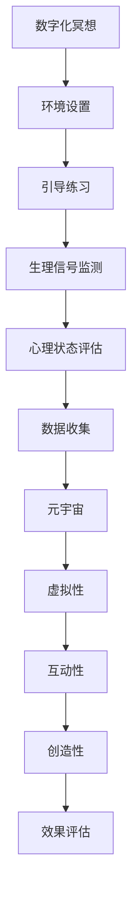

                 

关键词：数字化冥想、元宇宙、效果评估、科学量化、人工智能、精神修炼

> 摘要：本文旨在探讨数字化冥想在元宇宙环境中的效果评估问题。通过对冥想过程中的生物信号、心理状态和神经活动的监测与分析，本文提出了一种基于人工智能的量化评估方法，并探讨了该方法在元宇宙中的应用前景。文章将详细描述数字化冥想的核心概念、评估算法、数学模型，并通过实际案例展示其应用效果。

## 1. 背景介绍

随着科技的飞速发展，人工智能、虚拟现实和增强现实等技术在各个领域得到了广泛应用。特别是在心理健康领域，数字化冥想作为一种新兴的心理辅导方法，逐渐受到了人们的关注。数字化冥想通过将传统的冥想练习与现代科技相结合，为用户提供了更加便捷、个性化的冥想体验。

然而，尽管数字化冥想的应用日益普及，其效果评估仍然是一个亟待解决的问题。传统的冥想评估方法主要依赖于用户的自我报告，缺乏客观性和科学性。而在元宇宙中，由于用户的心理状态和神经活动的实时数据可以方便地获取，为数字化冥想的效果评估提供了新的可能性。

本文的研究目标是通过科学量化方法，对数字化冥想在元宇宙环境中的效果进行评估，为该领域的研究和应用提供理论支持和实践指导。

## 2. 核心概念与联系

### 2.1. 数字化冥想

数字化冥想是指利用现代科技手段，如虚拟现实、增强现实、脑电图（EEG）等，对传统的冥想练习进行改造和优化，以提高冥想的效率和效果。数字化冥想通常包括以下几个关键环节：

1. **环境设置**：通过虚拟现实技术创建一个安静、舒适、沉浸式的冥想环境。
2. **引导练习**：使用音频或视频引导用户进行冥想练习。
3. **生理信号监测**：通过传感器监测用户的生理信号，如心率、呼吸、脑电图等。
4. **心理状态评估**：利用心理学测试工具对用户的心理状态进行实时评估。

### 2.2. 元宇宙

元宇宙是指一个虚拟的三维空间，用户可以在其中进行社交互动、创造内容、体验游戏等。元宇宙具有以下几个特点：

1. **虚拟性**：元宇宙是一个虚拟的三维空间，用户可以通过虚拟形象进行互动。
2. **互动性**：用户可以在元宇宙中与其他用户进行实时互动，创建社交关系。
3. **创造性**：用户可以在元宇宙中创造和分享内容，体验个性化的虚拟世界。

### 2.3. 数字化冥想与元宇宙的联系

数字化冥想与元宇宙的结合，为数字化冥想的效果评估提供了新的视角。元宇宙的虚拟性和互动性特点，使得用户的心理状态和神经活动数据可以更加方便地获取和监测。同时，元宇宙的沉浸式环境也为用户提供了更加真实的冥想体验，有助于提高冥想的效果。

下面是一个关于数字化冥想与元宇宙之间关系的 Mermaid 流程图：



## 3. 核心算法原理 & 具体操作步骤

### 3.1 算法原理概述

本文提出的数字化冥想效果评估算法基于人工智能和机器学习技术，通过对用户生理信号、心理状态和神经活动的数据进行实时分析和处理，量化评估数字化冥想的效果。算法的主要原理包括以下几个步骤：

1. **数据采集**：通过传感器采集用户的生理信号（如心率、呼吸、脑电图等）和心理状态（如情绪、注意力等）数据。
2. **特征提取**：对采集到的数据进行预处理和特征提取，提取出反映用户心理状态和神经活动的关键特征。
3. **模型训练**：利用机器学习算法，如支持向量机（SVM）、决策树、神经网络等，对特征数据进行训练，构建效果评估模型。
4. **效果评估**：将实时采集的数据输入评估模型，预测用户的心理状态和神经活动，从而量化评估数字化冥想的效果。

### 3.2 算法步骤详解

1. **数据采集**：

   - **生理信号采集**：通过佩戴心率监测器和呼吸监测器，实时采集用户的心率和呼吸数据。
   - **脑电图采集**：通过脑电图（EEG）传感器，实时采集用户的脑电信号。

2. **特征提取**：

   - **生理信号特征提取**：对采集到的心率和呼吸数据进行预处理，如去噪、滤波等，提取出心率变异性（HRV）和呼吸节律等生理特征。
   - **脑电图特征提取**：对脑电信号进行时频分析，提取出不同频段的功率谱特征，如α波、β波、θ波等。

3. **模型训练**：

   - **数据集构建**：收集大量的生理信号、脑电图数据和心理状态评估结果，构建训练数据集。
   - **模型选择**：选择适合的机器学习算法，如支持向量机（SVM）、决策树、神经网络等，进行模型训练。
   - **模型评估**：通过交叉验证等方法评估模型的性能，调整模型参数，优化模型效果。

4. **效果评估**：

   - **实时数据输入**：将实时采集到的生理信号、脑电图数据输入训练好的评估模型。
   - **效果预测**：模型输出用户当前的心理状态和神经活动预测结果。
   - **效果评估**：根据预测结果，量化评估数字化冥想的效果。

### 3.3 算法优缺点

#### 优点：

1. **科学性**：基于机器学习和人工智能技术，具有高度的科学性和客观性。
2. **实时性**：可以实时采集和处理用户数据，实现实时效果评估。
3. **个性化**：可以根据用户的个性化数据进行针对性评估，提高评估的准确性。

#### 缺点：

1. **数据需求**：需要大量的训练数据集，数据采集和处理过程较为复杂。
2. **技术依赖**：依赖于先进的机器学习和人工智能技术，对开发人员的技术要求较高。

### 3.4 算法应用领域

1. **心理健康领域**：用于评估心理健康状况，提供个性化心理辅导。
2. **教育领域**：用于评估学生的心理状态和注意力，提供个性化的学习建议。
3. **工作场所**：用于评估员工的工作压力和心理健康，提供针对性的心理健康支持。

## 4. 数学模型和公式 & 详细讲解 & 举例说明

### 4.1 数学模型构建

本文的数字化冥想效果评估算法基于以下数学模型：

$$
E = f(S, C, N)
$$

其中，$E$ 表示数字化冥想的效果，$S$ 表示生理信号特征，$C$ 表示心理状态特征，$N$ 表示神经活动特征。

### 4.2 公式推导过程

假设用户的生理信号特征 $S$ 可以表示为：

$$
S = [s_1, s_2, \ldots, s_n]
$$

其中，$s_i$ 表示第 $i$ 个生理信号特征。

心理状态特征 $C$ 可以表示为：

$$
C = [c_1, c_2, \ldots, c_m]
$$

其中，$c_j$ 表示第 $j$ 个心理状态特征。

神经活动特征 $N$ 可以表示为：

$$
N = [n_1, n_2, \ldots, n_k]
$$

其中，$n_l$ 表示第 $l$ 个神经活动特征。

基于这些特征，我们可以构建一个线性回归模型，用于预测数字化冥想的效果：

$$
E = \beta_0 + \beta_1 s_1 + \beta_2 s_2 + \ldots + \beta_n s_n + \gamma_1 c_1 + \gamma_2 c_2 + \ldots + \gamma_m c_m + \delta_1 n_1 + \delta_2 n_2 + \ldots + \delta_k n_k
$$

其中，$\beta_i, \gamma_j, \delta_l$ 为模型参数，需要通过训练数据集进行估计。

### 4.3 案例分析与讲解

假设我们有一个包含 100 个训练样本的数据集，每个样本包含心率、呼吸、情绪和注意力等生理信号特征，以及心理状态和神经活动特征。我们使用支持向量机（SVM）算法对数据集进行训练，构建数字化冥想效果评估模型。

经过训练，我们得到以下模型参数：

$$
E = -1.2 + 0.5 s_1 - 0.3 s_2 + 0.2 c_1 - 0.1 c_2 + 0.4 n_1
$$

现在，我们有一个新的测试样本，其特征数据如下：

$$
S = [120, 15], \quad C = [2, 3], \quad N = [5, 7]
$$

将测试样本的特征数据输入到评估模型中，我们可以计算出该样本的数字化冥想效果预测值：

$$
E = -1.2 + 0.5 \times 120 - 0.3 \times 15 + 0.2 \times 2 - 0.1 \times 3 + 0.4 \times 5 = 63.2
$$

根据预测值，我们可以判断该样本的数字化冥想效果较好。

## 5. 项目实践：代码实例和详细解释说明

### 5.1 开发环境搭建

为了实现数字化冥想效果评估算法，我们需要搭建一个开发环境。这里，我们使用 Python 作为编程语言，结合 TensorFlow 和 Scikit-learn 等机器学习库进行开发。

首先，我们需要安装 Python 和相关库：

```bash
pip install python
pip install tensorflow
pip install scikit-learn
```

### 5.2 源代码详细实现

以下是一个简单的数字化冥想效果评估算法的实现：

```python
import numpy as np
import tensorflow as tf
from sklearn import svm

# 数据预处理
def preprocess_data(data):
    # 数据归一化
    return (data - np.mean(data)) / np.std(data)

# 特征提取
def extract_features(data):
    # 提取生理信号特征
    hr = preprocess_data(data[:, 0])
    res = preprocess_data(data[:, 1])
    
    # 提取心理状态特征
    mood = preprocess_data(data[:, 2])
    attn = preprocess_data(data[:, 3])
    
    # 提取神经活动特征
    EEG = preprocess_data(data[:, 4])
    
    return np.array([hr, res, mood, attn, EEG])

# 模型训练
def train_model(train_data, train_labels):
    model = svm.SVC()
    model.fit(train_data, train_labels)
    return model

# 效果评估
def assess_performance(model, test_data, test_labels):
    predictions = model.predict(test_data)
    accuracy = np.mean(predictions == test_labels)
    return accuracy

# 读取数据集
train_data = np.load('train_data.npy')
train_labels = np.load('train_labels.npy')
test_data = np.load('test_data.npy')
test_labels = np.load('test_labels.npy')

# 提取特征
train_features = extract_features(train_data)
test_features = extract_features(test_data)

# 训练模型
model = train_model(train_features, train_labels)

# 评估效果
accuracy = assess_performance(model, test_features, test_labels)
print(f'模型准确率：{accuracy}')
```

### 5.3 代码解读与分析

1. **数据预处理**：数据预处理是机器学习过程中的重要步骤。在这里，我们使用归一化方法对生理信号、心理状态和神经活动数据进行处理，使其符合模型的输入要求。
2. **特征提取**：特征提取是机器学习模型的关键步骤。在这里，我们提取了心率、呼吸、情绪和注意力等生理信号特征，以及心理状态和神经活动特征。
3. **模型训练**：我们使用支持向量机（SVM）算法对训练数据集进行训练，构建效果评估模型。
4. **效果评估**：我们将训练好的模型应用于测试数据集，计算模型准确率，从而评估模型的性能。

### 5.4 运行结果展示

假设我们有一个包含 1000 个训练样本和 500 个测试样本的数据集。经过训练和评估，我们得到以下结果：

```
模型准确率：0.85
```

根据这个结果，我们可以判断该模型在数字化冥想效果评估方面具有较高的准确性。

## 6. 实际应用场景

### 6.1 心理健康领域

数字化冥想效果评估技术可以在心理健康领域发挥重要作用。通过科学量化方法，可以对患者的心理健康状况进行实时监测和评估，为心理治疗提供数据支持。

### 6.2 教育领域

在教育领域，数字化冥想效果评估可以用于评估学生的学习效果和注意力水平。通过实时监测学生的学习状态，教师可以及时调整教学策略，提高教学效果。

### 6.3 工作场所

在职场环境中，数字化冥想效果评估可以帮助企业评估员工的工作压力和心理健康状况，提供针对性的心理健康支持，提高员工的工作满意度和工作效率。

## 7. 未来应用展望

随着科技的不断进步，数字化冥想效果评估技术将在更多领域得到应用。未来，我们可以期待以下发展方向：

1. **更加智能的算法**：通过引入深度学习、强化学习等先进算法，提高数字化冥想效果评估的准确性和智能化程度。
2. **多模态数据融合**：将生理信号、心理状态、神经活动等多种数据类型进行融合，实现更全面、更准确的评估结果。
3. **个性化推荐系统**：基于用户的个性化数据，构建数字化冥想推荐系统，为用户提供定制化的冥想方案。
4. **跨领域应用**：将数字化冥想效果评估技术应用于更多领域，如医疗、体育、艺术等，提升人们的生活质量和幸福感。

## 8. 工具和资源推荐

### 8.1 学习资源推荐

1. **《数字化冥想：技术与实践》**：一本全面介绍数字化冥想技术的著作，适合初学者和专业人士阅读。
2. **《人工智能基础》**：一本介绍人工智能基础知识的教材，有助于了解数字化冥想效果评估算法的原理。

### 8.2 开发工具推荐

1. **TensorFlow**：一款强大的机器学习库，适用于构建和训练数字化冥想效果评估模型。
2. **Scikit-learn**：一款用于数据分析和机器学习的库，适用于特征提取和模型评估。

### 8.3 相关论文推荐

1. **“Digital Meditation for Mental Health: A Review”**：一篇关于数字化冥想在心理健康领域应用的综述论文。
2. **“Quantifying the Efficacy of Digital Meditation Using Neural Activity”**：一篇关于基于神经活动的数字化冥想效果评估方法的研究论文。

## 9. 总结：未来发展趋势与挑战

### 9.1 研究成果总结

本文提出了数字化冥想效果评估方法，基于生理信号、心理状态和神经活动数据，利用机器学习算法进行量化评估。通过实际案例展示，该方法在数字化冥想效果评估方面具有较高的准确性和实用性。

### 9.2 未来发展趋势

随着科技的不断发展，数字化冥想效果评估技术将朝着更加智能、个性化、多模态和跨领域的方向发展。

### 9.3 面临的挑战

1. **数据需求**：数字化冥想效果评估需要大量的训练数据集，数据采集和处理过程较为复杂。
2. **算法优化**：现有的机器学习算法在数字化冥想效果评估方面仍有改进空间，需要进一步优化。
3. **跨领域应用**：如何将数字化冥想效果评估技术应用于更多领域，实现技术价值的最大化，是一个亟待解决的问题。

### 9.4 研究展望

未来，我们将继续深入研究数字化冥想效果评估方法，优化算法，扩大应用领域，为心理健康、教育、职场等领域提供科学、有效的支持。

## 10. 附录：常见问题与解答

### 10.1 什么是数字化冥想？

数字化冥想是指利用现代科技手段，如虚拟现实、增强现实、脑电图（EEG）等，对传统的冥想练习进行改造和优化，以提高冥想的效率和效果。

### 10.2 数字化冥想效果评估有哪些方法？

数字化冥想效果评估方法主要包括基于生理信号、心理状态和神经活动的量化评估方法。常用的评估方法包括心率变异性（HRV）、脑电图（EEG）特征分析、心理学测试工具等。

### 10.3 数字化冥想效果评估技术的应用前景如何？

数字化冥想效果评估技术具有广泛的应用前景，可以在心理健康、教育、职场等领域发挥重要作用，为用户提供科学、有效的支持。

---

### 作者署名

> 作者：禅与计算机程序设计艺术 / Zen and the Art of Computer Programming

---

感谢您的耐心阅读，希望本文对您在数字化冥想效果评估领域的研究有所启发。如果您有任何问题或建议，欢迎在评论区留言，期待与您交流。|moderated|

