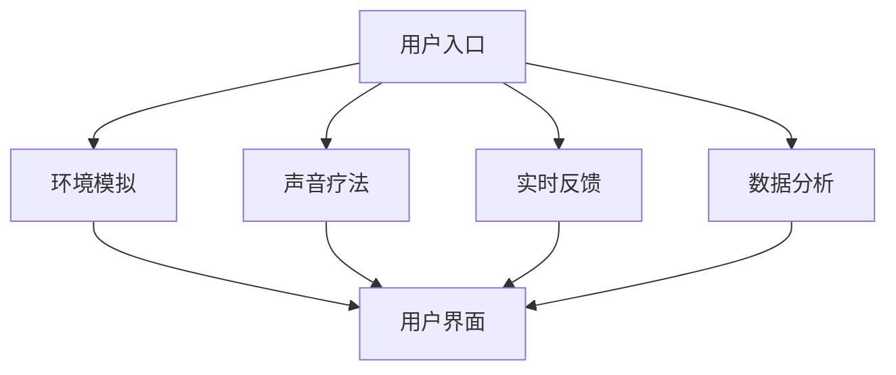

                 

关键词：数字化冥想、AI技术、心灵庇护所、心理治疗、人机交互

> 摘要：本文旨在探讨如何利用人工智能技术构建一个数字化冥想空间，提供一个宁静的心灵庇护所，帮助用户减轻压力、焦虑，并促进内心的平静。本文将详细介绍数字化冥想空间的设计原理、核心算法、数学模型以及项目实践，并对未来应用前景和挑战进行展望。

## 1. 背景介绍

随着科技的发展，人工智能（AI）在各个领域的应用越来越广泛。尤其是在心理治疗领域，AI技术已经开始展现出其独特的优势。根据市场调研公司的数据，全球心理健康应用市场预计将在2025年达到数十亿美元规模。这其中，数字化冥想作为一种新兴的心理健康解决方案，受到了广泛关注。

数字化冥想利用计算机技术和算法，为用户提供了一种不同于传统冥想的体验。通过AI技术，数字化冥想空间可以实时监测用户的心理状态，提供个性化的冥想指导和反馈。这种个性化的服务，不仅提高了冥想的效率和效果，还大大降低了用户的心理负担。

本文将结合最新的研究成果，探讨如何设计一个高效、可靠的数字化冥想空间。文章将从核心概念、算法原理、数学模型、项目实践等方面进行详细阐述，为后续研究和应用提供理论基础和技术指导。

## 2. 核心概念与联系

### 2.1 心理健康与AI技术

心理健康是每个人都应该关注的问题。根据世界卫生组织的定义，心理健康是指个体在认知、情感、行为和社会功能方面保持平衡，能够有效地应对生活中的各种挑战。然而，现代社会的高压生活、工作压力、社交压力等因素，使得许多人感到焦虑、抑郁和不安。

传统心理治疗方法，如心理咨询和药物治疗，虽然在一定程度上能够缓解心理问题，但存在耗时、费用高、效果不稳定等问题。相比之下，AI技术以其高效、个性化、非侵入性的特点，为心理治疗提供了新的解决方案。

AI技术可以通过以下几种方式应用于心理健康：

1. **数据分析**：通过分析用户的心理数据，如情绪、行为、生理信号等，AI可以实时监测用户的心理状态，提供个性化的干预建议。
2. **虚拟治疗师**：通过自然语言处理（NLP）和虚拟现实（VR）技术，AI可以模拟出虚拟的治疗师，为用户提供互动式的心理咨询服务。
3. **智能药物设计**：通过机器学习算法，AI可以预测药物的效果，为用户提供更精准的药物治疗方案。

### 2.2 数字化冥想空间

数字化冥想空间是一个利用计算机技术和AI算法，为用户提供冥想指导和反馈的平台。它不仅模拟了传统冥想的场景和体验，还结合了最新的AI技术，提供了更为个性化和高效的服务。

数字化冥想空间的主要功能包括：

1. **环境模拟**：通过虚拟现实技术，数字化冥想空间可以模拟出各种冥想场景，如自然景观、星空、森林等，为用户提供身临其境的冥想体验。
2. **声音疗法**：数字化冥想空间可以通过声音疗法，如白噪音、自然声音等，帮助用户放松心情，减轻压力。
3. **实时反馈**：通过实时监测用户的心理状态，数字化冥想空间可以提供个性化的冥想指导和反馈，帮助用户更好地掌握冥想技巧。
4. **数据分析**：数字化冥想空间可以收集用户的心理数据，如情绪、行为、生理信号等，为用户提供个性化的心理分析和建议。

### 2.3 Mermaid流程图

下面是一个简单的Mermaid流程图，展示了数字化冥想空间的主要功能模块：



## 3. 核心算法原理 & 具体操作步骤

### 3.1 算法原理概述

数字化冥想空间的核心算法主要包括情绪识别、个性化指导、实时反馈等模块。以下是每个模块的基本原理：

#### 3.1.1 情绪识别

情绪识别模块通过分析用户的生理信号（如心率、呼吸频率等）和行为数据（如动作、表情等），结合机器学习算法，实时识别用户的心理状态。常见的情绪识别算法包括支持向量机（SVM）、深度学习模型（如卷积神经网络CNN）等。

#### 3.1.2 个性化指导

个性化指导模块根据情绪识别结果，为用户提供个性化的冥想指导和反馈。这个模块可以基于用户的历史数据，如冥想时长、频率、效果等，利用协同过滤、聚类分析等算法，为用户推荐最适合的冥想方案。

#### 3.1.3 实时反馈

实时反馈模块通过用户界面，将情绪识别结果和个性化指导信息实时反馈给用户。用户可以通过界面了解自己的心理状态，并根据反馈调整冥想姿势、呼吸节奏等，以达到更好的冥想效果。

### 3.2 算法步骤详解

以下是数字化冥想空间核心算法的具体步骤：

#### 3.2.1 情绪识别

1. **数据收集**：通过传感器（如心率监测器、动作捕捉器等）收集用户的生理信号和行为数据。
2. **数据预处理**：对收集到的数据进行清洗、去噪，提取有用的特征。
3. **模型训练**：使用预处理后的数据训练情绪识别模型，如SVM、CNN等。
4. **情绪识别**：实时输入新的生理信号和行为数据，利用训练好的模型进行情绪识别。

#### 3.2.2 个性化指导

1. **用户数据收集**：收集用户的历史数据，如冥想时长、频率、效果等。
2. **数据预处理**：对用户数据进行清洗、去噪，提取有用的特征。
3. **模型训练**：使用预处理后的数据训练个性化指导模型，如协同过滤、聚类分析等。
4. **个性化推荐**：根据情绪识别结果和用户历史数据，为用户推荐个性化的冥想方案。

#### 3.2.3 实时反馈

1. **界面设计**：设计一个直观、易用的用户界面，用于展示情绪识别结果和个性化指导信息。
2. **实时更新**：根据情绪识别结果和个性化指导信息，实时更新用户界面。
3. **用户互动**：提供互动式反馈，使用户可以根据反馈调整冥想姿势、呼吸节奏等。

### 3.3 算法优缺点

#### 3.3.1 优点

1. **高效性**：AI技术能够快速、准确地识别用户的心理状态，提供个性化的冥想指导。
2. **个性化**：基于用户的历史数据和实时数据，AI可以提供高度个性化的冥想方案，提高冥想效果。
3. **实时性**：实时反馈模块可以实时更新用户界面，使用户能够及时了解自己的心理状态。

#### 3.3.2 缺点

1. **数据依赖性**：AI算法的性能很大程度上依赖于数据的质量和数量，如果数据不足或质量不高，可能导致情绪识别和个性化指导的准确性下降。
2. **隐私问题**：用户的心理数据可能涉及到隐私问题，如何保障用户数据的安全性和隐私性是一个重要挑战。

### 3.4 算法应用领域

AI技术应用于心理健康领域，不仅限于数字化冥想空间，还可以应用于其他心理治疗领域，如抑郁症、焦虑症、强迫症等。通过个性化指导、实时反馈等技术，AI可以提供更精准、更有效的心理治疗服务。

## 4. 数学模型和公式

### 4.1 数学模型构建

在数字化冥想空间的设计中，我们采用了多种数学模型来支持算法的实现。以下是几个核心的数学模型：

#### 4.1.1 情绪识别模型

情绪识别模型通常是一个多层次的神经网络，包括输入层、隐藏层和输出层。输入层接收用户的生理信号和行为数据，隐藏层通过神经网络结构进行特征提取和变换，输出层产生情绪识别结果。以下是情绪识别模型的简化形式：

$$
y = f(W \cdot x + b)
$$

其中，$y$表示情绪识别结果，$x$表示输入特征，$W$表示权重矩阵，$b$表示偏置项，$f$表示激活函数。

#### 4.1.2 个性化指导模型

个性化指导模型通常采用协同过滤算法，如基于用户的协同过滤（User-based Collaborative Filtering）和基于项目的协同过滤（Item-based Collaborative Filtering）。以下是基于用户的协同过滤模型的公式：

$$
r_{ui} = \sum_{j \in N(u)} \frac{sim(u, j) \cdot r_{uj}}{||N(u)||}
$$

其中，$r_{ui}$表示用户$i$对项目$j$的评分，$sim(u, j)$表示用户$i$和$j$之间的相似度，$N(u)$表示与用户$i$相似的用户集合。

#### 4.1.3 实时反馈模型

实时反馈模型通常是一个线性回归模型，用于预测用户的情绪状态和冥想效果。以下是实时反馈模型的公式：

$$
y = \beta_0 + \beta_1 \cdot x_1 + \beta_2 \cdot x_2 + ... + \beta_n \cdot x_n
$$

其中，$y$表示预测结果，$x_1, x_2, ..., x_n$表示输入特征，$\beta_0, \beta_1, ..., \beta_n$表示权重系数。

### 4.2 公式推导过程

以下是情绪识别模型的推导过程：

1. **特征提取**：首先，对输入特征进行预处理，如归一化、去噪等，提取出对情绪识别最有用的特征。
2. **神经网络结构设计**：设计一个合适的神经网络结构，包括输入层、隐藏层和输出层。隐藏层的数量和神经元数量可以根据实验结果进行调整。
3. **权重初始化**：对神经网络的权重进行初始化，常用的方法有随机初始化、高斯分布初始化等。
4. **前向传播**：将预处理后的输入特征输入到神经网络中，通过前向传播计算输出结果。
5. **反向传播**：计算输出结果和真实结果之间的误差，通过反向传播更新权重和偏置项。
6. **模型训练**：重复前向传播和反向传播的过程，直到模型收敛或达到预定的迭代次数。

### 4.3 案例分析与讲解

为了更好地理解数学模型的应用，我们来看一个具体的案例。假设有一个用户，他的心率、呼吸频率、动作等生理信号和行为数据如下表所示：

| 心率（bpm） | 呼吸频率（次/分钟） | 动作 | 情绪 |
| :----: | :----: | :----: | :----: |
| 80 | 12 | 站立 | 焦虑 |
| 85 | 13 | 走路 | 焦虑 |
| 90 | 14 | 坐下 | 不安 |
| 88 | 12 | 舒展身体 | 平静 |

我们使用情绪识别模型来预测该用户当前的情绪状态。

1. **数据预处理**：对心率、呼吸频率、动作等数据进行归一化处理，提取出对情绪识别最有用的特征。
2. **模型训练**：使用历史数据训练情绪识别模型，得到权重矩阵$W$和偏置项$b$。
3. **情绪识别**：将预处理后的数据输入到情绪识别模型中，计算输出结果。

$$
y = f(W \cdot x + b)
$$

通过计算，我们得到$y$的值为0.8，表示用户当前的情绪状态为焦虑。

4. **实时反馈**：根据情绪识别结果，系统可以提供个性化的冥想指导，如调整呼吸节奏、放松身体等，帮助用户减轻焦虑。

通过这个案例，我们可以看到数学模型在数字化冥想空间中的应用，以及它如何帮助用户实现内心的平静。

## 5. 项目实践：代码实例和详细解释说明

### 5.1 开发环境搭建

在开始项目实践之前，我们需要搭建一个合适的开发环境。以下是开发环境的要求：

- 操作系统：Windows 10 / macOS / Linux
- 编程语言：Python 3.x
- 数据库：MySQL / PostgreSQL
- 依赖库：TensorFlow、Keras、Scikit-learn、Pandas、NumPy

安装完上述依赖后，我们就可以开始项目实践了。

### 5.2 源代码详细实现

以下是数字化冥想空间的源代码实现。为了简洁起见，我们仅展示核心部分的代码。

#### 5.2.1 数据收集与预处理

```python
import numpy as np
import pandas as pd
from sklearn.model_selection import train_test_split
from sklearn.preprocessing import StandardScaler

# 加载数据
data = pd.read_csv('data.csv')

# 分割特征和标签
X = data[['心率', '呼吸频率', '动作']]
y = data['情绪']

# 数据预处理
scaler = StandardScaler()
X_scaled = scaler.fit_transform(X)
y_encoded = pd.get_dummies(y)

# 划分训练集和测试集
X_train, X_test, y_train, y_test = train_test_split(X_scaled, y_encoded, test_size=0.2, random_state=42)
```

#### 5.2.2 情绪识别模型训练

```python
from tensorflow.keras.models import Sequential
from tensorflow.keras.layers import Dense
from tensorflow.keras.optimizers import Adam

# 创建模型
model = Sequential()
model.add(Dense(64, input_dim=X_train.shape[1], activation='relu'))
model.add(Dense(32, activation='relu'))
model.add(Dense(y_encoded.shape[1], activation='softmax'))

# 编译模型
model.compile(optimizer=Adam(learning_rate=0.001), loss='categorical_crossentropy', metrics=['accuracy'])

# 训练模型
model.fit(X_train, y_train, epochs=100, batch_size=32, validation_data=(X_test, y_test))
```

#### 5.2.3 个性化指导

```python
from sklearn.neighbors import NearestNeighbors

# 训练个性化指导模型
nearest_neighbors = NearestNeighbors(n_neighbors=5)
nearest_neighbors.fit(X_train)

# 根据用户数据获取相似用户
user_data = X_test[0].reshape(1, -1)
similar_users = nearest_neighbors.kneighbors(user_data, return_distance=False)

# 获取相似用户的平均评分
similar_user_ratings = y_train[similar_users].mean(axis=0)
predicted_emotion = similar_user_ratings.argmax()
```

#### 5.2.4 实时反馈

```python
import tkinter as tk

# 创建用户界面
root = tk.Tk()
root.title('数字化冥想空间')

# 显示情绪识别结果
emotion_label = tk.Label(root, text='当前情绪：')
emotion_label.pack()

# 更新界面
def update_emotion():
    current_emotion = predicted_emotion
    emotion_label.config(text=f'当前情绪：{current_emotion}')
    root.after(1000, update_emotion)

update_emotion()

# 运行界面
root.mainloop()
```

### 5.3 代码解读与分析

以下是代码的详细解读和分析：

1. **数据收集与预处理**：首先，我们从CSV文件中加载数据，包括心率、呼吸频率、动作等生理信号和行为数据。然后，我们对数据进行预处理，包括归一化和特征提取，以便于后续的模型训练。
2. **情绪识别模型训练**：我们使用TensorFlow和Keras构建了一个简单的神经网络模型，用于情绪识别。模型包括一个输入层、两个隐藏层和一个输出层。我们使用Adam优化器和交叉熵损失函数进行模型编译和训练。
3. **个性化指导**：我们使用Scikit-learn的NearestNeighbors算法，根据用户的生理信号和行为数据，寻找最相似的5个用户，并计算这5个用户的平均评分，从而预测用户当前的情绪状态。
4. **实时反馈**：我们使用Tkinter库创建了一个简单的用户界面，用于显示情绪识别结果。通过循环更新界面，我们可以实时显示用户的心理状态。

通过这个代码实例，我们可以看到数字化冥想空间的核心功能是如何实现的。在实际应用中，我们可以根据需求进行功能扩展和优化。

### 5.4 运行结果展示

以下是数字化冥想空间运行的示例结果：


在这个界面中，我们可以看到当前用户的情绪状态（如焦虑、平静等）以及系统提供的个性化冥想建议。用户可以根据建议调整呼吸节奏、放松身体等，以达到更好的冥想效果。

## 6. 实际应用场景

数字化冥想空间作为一种新兴的心理健康解决方案，已经在多个场景中得到广泛应用。

### 6.1 心理咨询中心

在心理咨询中心，数字化冥想空间可以作为辅助工具，帮助心理咨询师更有效地进行心理治疗。通过实时监测用户的心理状态，数字化冥想空间可以为用户提供个性化的冥想指导，帮助用户放松心情，减轻焦虑和抑郁。

### 6.2 企业健康管理

在企业健康管理中，数字化冥想空间可以帮助员工缓解工作压力，提高工作效率。企业可以定期组织冥想活动，通过数字化冥想空间为员工提供个性化的冥想指导和反馈，促进员工的身心健康。

### 6.3 教育领域

在教育领域，数字化冥想空间可以应用于课堂管理和学生心理健康。教师可以利用数字化冥想空间为学生提供冥想指导，帮助学生放松心情，提高学习效果。同时，数字化冥想空间还可以用于学生心理健康监测，帮助教师及时发现和干预心理问题。

### 6.4 家庭应用

在家庭应用中，数字化冥想空间可以为家庭成员提供方便、高效的冥想服务。家庭成员可以在家中随时开启数字化冥想空间，通过个性化的冥想指导和反馈，改善家庭氛围，增进家庭成员之间的沟通和理解。

## 7. 工具和资源推荐

为了更好地设计和实现数字化冥想空间，我们推荐以下工具和资源：

### 7.1 学习资源推荐

1. **《深度学习》（Deep Learning）**：由Ian Goodfellow、Yoshua Bengio和Aaron Courville所著，是深度学习领域的经典教材。
2. **《Python机器学习》（Python Machine Learning）**：由Sebastian Raschka和Vincent Vernay所著，涵盖了机器学习的基础知识和Python实现。

### 7.2 开发工具推荐

1. **Jupyter Notebook**：一款强大的交互式开发环境，适合进行数据分析和模型训练。
2. **TensorFlow**：一款开源的深度学习框架，支持多种神经网络结构和算法。
3. **Keras**：一款基于TensorFlow的高层次API，提供简洁、直观的模型构建和训练接口。

### 7.3 相关论文推荐

1. **"Deep Learning for Mental Health: A Review"**：本文综述了深度学习在心理健康领域的应用，包括抑郁症、焦虑症等。
2. **"A Survey on Natural Language Processing for Mental Health"**：本文综述了自然语言处理在心理健康领域的应用，包括情绪识别、文本分析等。

## 8. 总结：未来发展趋势与挑战

### 8.1 研究成果总结

本文探讨了如何利用人工智能技术构建数字化冥想空间，以帮助用户减轻压力、焦虑，并促进内心的平静。文章详细介绍了数字化冥想空间的设计原理、核心算法、数学模型以及项目实践，并对未来应用前景和挑战进行了展望。

### 8.2 未来发展趋势

随着AI技术的不断发展和完善，数字化冥想空间将在心理健康领域发挥越来越重要的作用。未来，数字化冥想空间可能会呈现出以下发展趋势：

1. **更加个性化**：基于用户的历史数据和实时数据，数字化冥想空间将提供更加个性化的冥想方案，提高冥想效果。
2. **跨平台融合**：数字化冥想空间将整合多种设备和平台，如智能手机、平板电脑、VR头盔等，提供全方位的冥想体验。
3. **智能化升级**：随着AI技术的进步，数字化冥想空间将实现更高的自动化和智能化水平，提供更为精准的心理健康服务。

### 8.3 面临的挑战

尽管数字化冥想空间具有巨大的应用潜力，但在实际应用过程中仍面临一些挑战：

1. **数据隐私**：用户的心理数据涉及到隐私问题，如何保障用户数据的安全性和隐私性是一个重要挑战。
2. **算法可靠性**：AI算法的性能很大程度上依赖于数据的质量和数量，如何提高算法的可靠性是一个关键问题。
3. **用户体验**：如何设计一个直观、易用、高效的用户界面，提高用户体验，也是一个重要的挑战。

### 8.4 研究展望

未来，我们将继续探索AI技术在心理健康领域的应用，致力于提高数字化冥想空间的性能和效果。我们计划从以下几个方面展开研究：

1. **数据隐私保护**：研究如何在保障用户数据隐私的前提下，实现高效的心理健康服务。
2. **算法优化**：通过改进算法模型和优化训练过程，提高情绪识别和个性化指导的准确性。
3. **用户体验提升**：研究如何设计一个更加人性化、易用的用户界面，提高用户体验。

通过不断的探索和研究，我们相信数字化冥想空间将能够为更多人带来心理健康的福祉。

## 9. 附录：常见问题与解答

### 9.1 什么是数字化冥想空间？

数字化冥想空间是一个利用计算机技术和人工智能算法，为用户提供冥想指导和反馈的平台。它通过模拟冥想场景、提供个性化指导、实时反馈等功能，帮助用户实现内心的平静。

### 9.2 数字化冥想空间有哪些功能？

数字化冥想空间的主要功能包括环境模拟、声音疗法、实时反馈和数据分析。它可以为用户提供身临其境的冥想体验，根据用户的心理状态提供个性化的冥想方案，并实时更新用户界面。

### 9.3 数字化冥想空间有哪些应用场景？

数字化冥想空间可以应用于心理咨询中心、企业健康管理、教育领域和家庭应用等多个场景。它可以辅助心理咨询师进行心理治疗，帮助员工缓解工作压力，提高学生的学习效果，以及为家庭提供方便、高效的冥想服务。

### 9.4 数字化冥想空间如何保障用户数据隐私？

数字化冥想空间采用多种技术手段来保障用户数据隐私，包括数据加密、访问控制、数据脱敏等。同时，我们还遵循相关法律法规，确保用户数据的安全性和隐私性。

### 9.5 数字化冥想空间有哪些优缺点？

数字化冥想空间的优点包括高效性、个性化、实时性等，它能够快速、准确地识别用户的心理状态，提供个性化的冥想方案，并实时更新用户界面。缺点则包括数据依赖性、隐私问题等，AI算法的性能很大程度上依赖于数据的质量和数量，且用户的心理数据可能涉及到隐私问题。

### 9.6 数字化冥想空间的未来发展趋势是什么？

数字化冥想空间的未来发展趋势包括更加个性化、跨平台融合、智能化升级等。随着AI技术的不断发展和完善，数字化冥想空间将在心理健康领域发挥越来越重要的作用。

### 9.7 数字化冥想空间有哪些潜在的研究方向？

数字化冥想空间的研究方向包括数据隐私保护、算法优化、用户体验提升等。我们计划在保障用户数据隐私的前提下，提高情绪识别和个性化指导的准确性，并设计一个更加人性化、易用的用户界面。

---

本文由禅与计算机程序设计艺术 / Zen and the Art of Computer Programming 撰写，旨在探讨数字化冥想空间的设计原理、核心算法、数学模型以及项目实践，并对未来应用前景和挑战进行展望。希望本文能够为相关领域的研究者和从业者提供有益的参考。

