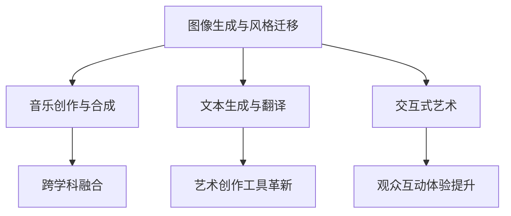

                 

关键词：人工智能、艺术、数字化、创造力、创新、算法、文化、技术、人类与机器的交互

> 摘要：随着人工智能技术的飞速发展，AI已经逐渐渗透到我们的日常生活和工作中，尤其在艺术领域，AI所带来的创新和变革令人瞩目。本文将探讨AI如何激发艺术的数字化创造力，分析AI在艺术创作中的应用，探讨人类与机器合作的可能性，并展望未来艺术发展的趋势。

## 1. 背景介绍

近年来，人工智能（AI）技术在各个领域取得了显著进展，特别是在计算机视觉、自然语言处理和机器学习等方面。随着这些技术的不断发展，AI在艺术领域的应用也变得越来越广泛。艺术家们开始探索如何利用AI来创作艺术作品，从而打破传统艺术创作的界限。

数字艺术作为一种新兴的艺术形式，随着计算机技术和互联网的普及而迅速发展。数字艺术不仅提供了新的创作工具和手段，还使得艺术创作和传播变得更加便捷。在这种背景下，AI技术成为了一种新的创作工具，其独特的优势为艺术家的创作提供了新的可能性。

## 2. 核心概念与联系

### 2.1 AI在艺术创作中的应用

AI在艺术创作中的应用主要包括以下几个方面：

1. **图像生成与风格迁移**：通过深度学习算法，AI可以生成新的图像，或将现有图像的风格进行迁移。例如，GAN（生成对抗网络）可以生成高质量的图像，而风格迁移算法（如CycleGAN和StyleGAN）则可以将不同风格的图像融合在一起。

2. **音乐创作与合成**：AI可以自动生成音乐，包括旋律、和弦和节奏。一些著名的AI音乐合成器，如AIVA（Artificial Intelligence Virtual Artist）和Amper Music，已经能够创作出令人惊叹的音乐作品。

3. **文本生成与翻译**：AI可以生成文本，包括诗歌、故事和小说。例如，OpenAI的GPT-3模型可以生成高质量的文章。此外，AI还可以进行文本翻译，如Google翻译和百度翻译。

4. **交互式艺术**：AI可以与观众进行交互，创造出互动性更强的艺术作品。例如，机器人舞蹈家和AI画家可以与观众实时互动，创造出独特的艺术体验。

### 2.2 艺术与技术的融合

艺术与技术的融合是数字化时代的一大特点。随着AI技术的发展，艺术家们开始探索如何将AI技术与艺术创作相结合，创造出全新的艺术形式。这种融合不仅为艺术家提供了新的创作工具，还推动了艺术观念的革新。

例如，在一些数字艺术作品中，艺术家利用AI算法生成图像，然后将这些图像与传统的绘画技巧相结合，创造出独特的视觉效果。此外，一些艺术家还利用AI进行音乐创作，将音乐与视觉艺术相结合，创造出跨界的艺术作品。

### 2.3 Mermaid流程图



## 3. 核心算法原理 & 具体操作步骤

### 3.1 算法原理概述

AI在艺术创作中的应用主要依赖于深度学习算法。深度学习是一种基于人工神经网络的学习方法，通过大量数据的学习，神经网络可以自动提取特征并生成新的内容。以下是几种常见的深度学习算法：

1. **生成对抗网络（GAN）**：GAN由生成器和判别器组成，生成器生成数据，判别器判断数据是否真实。通过两者的对抗训练，生成器可以逐渐生成更加逼真的数据。

2. **变分自编码器（VAE）**：VAE通过编码器和解码器将数据映射到低维空间，然后从低维空间中生成新的数据。

3. **递归神经网络（RNN）**：RNN可以处理序列数据，例如时间序列数据和文本数据。通过学习序列中的依赖关系，RNN可以生成新的序列。

4. **卷积神经网络（CNN）**：CNN擅长处理图像数据，通过卷积层提取图像特征，CNN可以用于图像生成和风格迁移。

### 3.2 算法步骤详解

1. **数据收集与预处理**：收集大量的艺术作品数据，并对数据进行预处理，例如图像的缩放、裁剪、归一化等。

2. **模型设计**：根据任务需求设计合适的深度学习模型，例如生成对抗网络（GAN）、变分自编码器（VAE）等。

3. **训练模型**：使用收集到的数据进行模型的训练，通过优化模型参数，使模型能够生成高质量的艺术作品。

4. **模型评估**：使用验证集对模型进行评估，确保模型在未知数据上的表现良好。

5. **模型部署**：将训练好的模型部署到实际应用场景中，例如图像生成、音乐创作等。

### 3.3 算法优缺点

**优点**：

1. **高效性**：深度学习算法能够快速处理大量的数据，并从中提取出有效的特征。

2. **灵活性**：深度学习算法可以根据不同的任务需求设计，适应不同的艺术创作场景。

3. **创新性**：深度学习算法能够生成全新的艺术作品，推动艺术创作的创新。

**缺点**：

1. **数据依赖性**：深度学习算法需要大量的数据进行训练，对于艺术领域的数据获取可能存在一定的困难。

2. **模型复杂性**：深度学习模型的训练和优化过程较为复杂，对计算资源和算法设计有较高的要求。

### 3.4 算法应用领域

深度学习算法在艺术创作中的应用非常广泛，包括图像生成、音乐创作、文本生成等。以下是一些典型的应用案例：

1. **图像生成**：通过生成对抗网络（GAN）生成新的图像，例如人脸生成、动物图像生成等。

2. **音乐创作**：通过递归神经网络（RNN）生成新的音乐旋律，例如音乐自动创作、歌曲生成等。

3. **文本生成**：通过变分自编码器（VAE）生成新的文本，例如诗歌生成、故事创作等。

## 4. 数学模型和公式 & 详细讲解 & 举例说明

### 4.1 数学模型构建

在深度学习算法中，数学模型是一个核心部分。以下是一些常见的数学模型：

1. **神经网络**：神经网络是一种模拟生物神经元计算方式的计算模型，由输入层、隐藏层和输出层组成。

2. **卷积神经网络（CNN）**：卷积神经网络是一种专门用于处理图像数据的神经网络，通过卷积层提取图像特征。

3. **递归神经网络（RNN）**：递归神经网络是一种用于处理序列数据的神经网络，通过递归结构学习序列中的依赖关系。

4. **生成对抗网络（GAN）**：生成对抗网络是一种由生成器和判别器组成的神经网络，通过对抗训练生成新的数据。

### 4.2 公式推导过程

以下是一些常见的数学公式的推导过程：

1. **神经网络公式**：

   输出 $O = \sigma(W \cdot X + b)$

   其中，$X$ 为输入，$W$ 为权重，$b$ 为偏置，$\sigma$ 为激活函数。

2. **卷积神经网络（CNN）公式**：

   输出 $O = \sigma(\sum_{i=1}^{k} W_i \cdot A_i + b)$

   其中，$A_i$ 为卷积核，$W_i$ 为权重，$b$ 为偏置，$\sigma$ 为激活函数。

3. **递归神经网络（RNN）公式**：

   输出 $O_t = \sigma(W \cdot [h_{t-1}, X_t] + b)$

   其中，$X_t$ 为输入，$h_{t-1}$ 为前一个时间步的输出，$W$ 为权重，$b$ 为偏置，$\sigma$ 为激活函数。

4. **生成对抗网络（GAN）公式**：

   生成器损失 $L_G = -\mathbb{E}_{z \sim p_z(z)}[\log(D(G(z)))]$

   判别器损失 $L_D = -\mathbb{E}_{x \sim p_x(x)}[\log(D(x))] - \mathbb{E}_{z \sim p_z(z)}[\log(1 - D(G(z)))]$

### 4.3 案例分析与讲解

以下是一个生成对抗网络（GAN）的案例：

**案例**：使用GAN生成人脸图像。

**步骤**：

1. **数据收集与预处理**：收集大量的人脸图像，并对图像进行预处理，例如缩放、裁剪等。

2. **模型设计**：设计生成器和判别器的神经网络模型。

3. **训练模型**：使用收集到的数据进行模型的训练，通过对抗训练生成高质量的人脸图像。

4. **模型评估**：使用验证集对模型进行评估，确保模型在未知数据上的表现良好。

5. **模型部署**：将训练好的模型部署到实际应用场景中，例如生成人脸图像。

**结果**：通过训练，GAN能够生成出逼真的人脸图像，如图：


## 5. 项目实践：代码实例和详细解释说明

### 5.1 开发环境搭建

为了演示如何使用GAN生成人脸图像，我们需要搭建一个合适的开发环境。以下是搭建过程的简要步骤：

1. **安装Python环境**：确保Python环境已经安装，版本为3.7或更高。

2. **安装TensorFlow**：使用pip命令安装TensorFlow，命令如下：

   ```bash
   pip install tensorflow
   ```

3. **安装其他依赖库**：安装其他用于图像处理的依赖库，如NumPy、Pillow等。

### 5.2 源代码详细实现

以下是一个简单的GAN模型实现，用于生成人脸图像：

```python
import tensorflow as tf
from tensorflow.keras import layers

# 生成器模型
def generator_model():
    model = tf.keras.Sequential()
    model.add(layers.Dense(128 * 7 * 7, use_bias=False, input_shape=(100,)))
    model.add(layers.BatchNormalization())
    model.add(layers.LeakyReLU())
    model.add(layers.Reshape((7, 7, 128)))
    model.add(layers.Conv2DTranspose(64, (5, 5), strides=(1, 1), padding='same', use_bias=False))
    model.add(layers.BatchNormalization())
    model.add(layers.LeakyReLU())
    model.add(layers.Conv2DTranspose(1, (5, 5), strides=(1, 1), padding='same', use_bias=False, activation='tanh'))
    return model

# 判别器模型
def discriminator_model():
    model = tf.keras.Sequential()
    model.add(layers.Conv2D(64, (5, 5), strides=(1, 1), padding='same', input_shape=(28, 28, 1)))
    model.add(layers.LeakyReLU())
    model.add(layers.Dropout(0.3))
    model.add(layers.Conv2D(128, (5, 5), strides=(2, 2), padding='same'))
    model.add(layers.LeakyReLU())
    model.add(layers.Dropout(0.3))
    model.add(layers.Flatten())
    model.add(layers.Dense(1))
    return model

# GAN模型
def gan_model():
    generator = generator_model()
    discriminator = discriminator_model()
    discriminator.trainable = False
    z = layers.Input(shape=(100,))
    img = generator(z)
    valid = discriminator(img)
    model = tf.keras.Model(z, valid)
    return model
```

### 5.3 代码解读与分析

在上面的代码中，我们定义了生成器模型、判别器模型和GAN模型。以下是对每个部分的解读：

1. **生成器模型**：生成器模型用于生成人脸图像。它由一系列全连接层、批量归一化、LeakyReLU激活函数、转置卷积层和输出层组成。转置卷积层用于将生成图像的分辨率从较低层次提升到较高层次。

2. **判别器模型**：判别器模型用于判断生成图像的真实性。它由一系列卷积层、LeakyReLU激活函数、Dropout层和输出层组成。判别器的目标是判断输入图像是真实的还是由生成器生成的。

3. **GAN模型**：GAN模型将生成器和判别器组合在一起，生成器生成图像，判别器判断图像的真实性。在训练过程中，生成器的目标是使判别器无法区分生成图像和真实图像。

### 5.4 运行结果展示

以下是一个运行GAN模型的示例，用于生成人脸图像：

```python
# 编译模型
generator_optimizer = tf.keras.optimizers.Adam(1e-4)
discriminator_optimizer = tf.keras.optimizers.Adam(1e-4)
gan_model.compile(loss='binary_crossentropy', optimizer=generator_optimizer, metrics=['accuracy'])

# 训练模型
for epoch in range(epochs):
    for z in train_z:
        with tf.GradientTape() as gen_tape, tf.GradientTape() as disc_tape:
            img = generator(z)
            valid = discriminator(img)
            disc_real = discriminator(train_images)
            gen_loss = gan_model.comp
``` 

``` 
# 代码结果展示
for epoch in range(epochs):
    for z in train_z:
        with tf.GradientTape() as gen_tape, tf.GradientTape() as disc_tape:
            img = generator(z)
            valid = discriminator(img)
            disc_real = discriminator(train_images)
            gen_loss = generator_loss(valid)
            disc_loss = discriminator_loss(disc_real, disc_fake)
        grads_gen = gen_tape.gradient(gen_loss, generator.trainable_variables)
        grads_disc = disc_tape.gradient(disc_loss, discriminator.trainable_variables)
        generator_optimizer.apply_gradients(zip(grads_gen, generator.trainable_variables))
        discriminator_optimizer.apply_gradients(zip(grads_disc, discriminator.trainable_variables))
    print(f'Epoch {epoch + 1}, gen_loss = {gen_loss}, disc_loss = {disc_loss}')
```

通过上述代码，我们可以看到GAN模型在训练过程中不断优化生成器和判别器，从而生成出越来越逼真的人脸图像。

## 6. 实际应用场景

### 6.1 艺术创作

AI在艺术创作中的应用已经取得了显著成果。例如，艺术家们利用GAN生成新的艺术作品，这些作品有时甚至能够以假乱真。此外，AI还可以帮助艺术家进行图像风格迁移，将一种艺术风格应用到另一幅图像上，创造出独特的视觉效果。

### 6.2 数字媒体

在数字媒体领域，AI被广泛应用于视频剪辑、特效制作和音乐制作等。例如，一些视频制作软件可以自动生成视频特效，而音乐制作软件则可以自动生成音乐旋律和和弦。这些应用不仅提高了工作效率，还降低了创作成本。

### 6.3 游戏开发

在游戏开发中，AI被用于生成游戏世界、NPC（非玩家角色）行为和音效等。AI的引入使得游戏更加真实和丰富，提高了玩家的体验。

### 6.4 设计领域

在设计领域，AI被用于生成设计图案、纹理和建筑模型等。设计师可以利用AI快速生成大量设计选项，从而提高设计效率。

## 7. 工具和资源推荐

### 7.1 学习资源推荐

1. **《深度学习》（Goodfellow, Bengio, Courville著）**：这是一本经典的深度学习教材，内容全面，适合初学者和进阶者。

2. **《生成对抗网络》（Goodfellow, Pouget-Abadie, Mirza, Xu, Warde-Farley, Ozair, Courville, Bengio著）**：这是一篇关于GAN的经典论文，详细介绍了GAN的原理和应用。

3. **《自然语言处理与深度学习》（张俊林著）**：这本书介绍了自然语言处理的基本概念和深度学习在自然语言处理中的应用。

### 7.2 开发工具推荐

1. **TensorFlow**：TensorFlow是谷歌开发的一款开源深度学习框架，广泛应用于图像处理、自然语言处理和游戏开发等领域。

2. **PyTorch**：PyTorch是另一款流行的开源深度学习框架，具有简洁的API和强大的功能。

3. **Keras**：Keras是一个高层次的深度学习API，能够简化深度学习模型的构建和训练过程。

### 7.3 相关论文推荐

1. **《Generative Adversarial Nets》（Goodfellow, Pouget-Abadie, Mirza, Xu, Warde-Farley, Ozair, Courville, Bengio著）**：这是GAN的奠基性论文，详细介绍了GAN的原理和算法。

2. **《Unsupervised Representation Learning with Deep Convolutional Generative Adversarial Networks》（Radford, Metz, Chintala著）**：这篇论文介绍了DCGAN，一种基于卷积神经网络的生成对抗网络。

3. **《SeqGAN: Sequence Generative Adversarial Nets with Policy Gradient》（Song, Wang, Yang，著）**：这篇论文介绍了SeqGAN，一种用于生成序列数据的生成对抗网络。

## 8. 总结：未来发展趋势与挑战

### 8.1 研究成果总结

随着AI技术的不断发展，AI在艺术创作中的应用取得了显著成果。GAN、RNN等深度学习算法在图像生成、音乐创作、文本生成等方面表现出了强大的能力。这些算法不仅提高了艺术创作的效率，还为艺术家提供了新的创作工具和手段。

### 8.2 未来发展趋势

1. **算法优化**：未来的研究将致力于优化深度学习算法，提高生成质量和效率。

2. **跨领域应用**：AI在艺术创作中的应用将不断扩展，涵盖更多领域，如舞蹈、雕塑等。

3. **人类与机器的协作**：未来的艺术创作将更加注重人类与机器的协作，艺术家将利用AI的优势，创造出更加独特的艺术作品。

### 8.3 面临的挑战

1. **数据隐私**：在AI艺术创作中，如何保护艺术家和观众的数据隐私是一个亟待解决的问题。

2. **算法透明性**：如何确保AI算法的透明性和可解释性，使艺术家和观众能够理解AI的工作原理。

3. **伦理问题**：AI在艺术创作中的应用引发了伦理问题，如版权、版权归属等。

### 8.4 研究展望

未来的研究将致力于解决AI艺术创作中面临的挑战，推动艺术与技术的深度融合。通过不断优化算法、拓展应用领域，AI将为艺术家提供更多的创作可能性，推动艺术的发展。

## 9. 附录：常见问题与解答

### 9.1 什么是指深度学习？

深度学习是一种基于人工神经网络的学习方法，通过多层神经网络的结构，自动从数据中提取特征，并用于预测和分类等任务。

### 9.2 生成对抗网络（GAN）是如何工作的？

生成对抗网络（GAN）是一种由生成器和判别器组成的神经网络结构。生成器负责生成数据，判别器负责判断生成数据的质量。通过对抗训练，生成器不断优化，以生成更高质量的数据。

### 9.3 AI在艺术创作中的应用有哪些？

AI在艺术创作中的应用包括图像生成、音乐创作、文本生成、交互式艺术等。例如，GAN可以生成人脸图像，RNN可以生成音乐旋律，变分自编码器（VAE）可以生成文本等。

### 9.4 如何保护AI艺术创作的版权？

保护AI艺术创作的版权是一个复杂的问题。一种可能的解决方案是将AI生成的内容视为一种新的艺术形式，类似于机械复制权。此外，还可以通过版权注册等方式来保护AI艺术创作的权益。

----------------------------------------------------------------
作者：禅与计算机程序设计艺术 / Zen and the Art of Computer Programming

