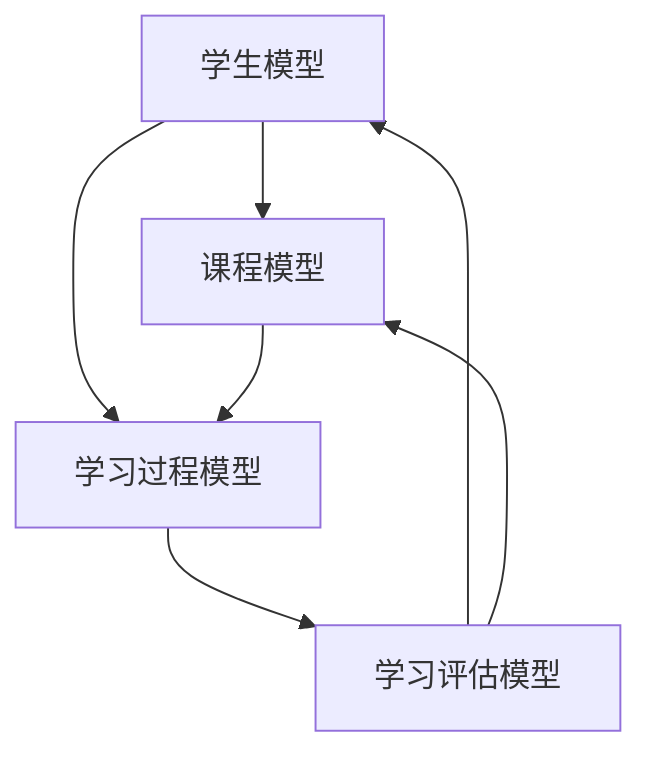
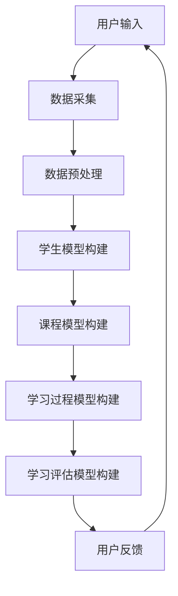

                 

关键词：数字化学习，个性化教育，技术支持，人工智能，教育科技，学习算法，数据挖掘，个性化推荐系统，学习分析，教育创新

> 摘要：本文将深入探讨数字化学习创业领域，特别是如何利用技术支持实现个性化教育。通过分析核心概念、算法原理、数学模型、项目实践以及实际应用场景，本文旨在为教育创业者提供有价值的指导和参考。

## 1. 背景介绍

随着信息技术的飞速发展，教育行业正迎来前所未有的变革。传统教学模式已无法满足个性化学习的需求，数字化学习和个性化教育成为教育行业发展的必然趋势。在此背景下，数字化学习创业成为了一个充满机遇和挑战的领域。

个性化教育旨在为学生提供定制化的学习体验，使其能够按照自己的节奏、兴趣和需求进行学习。为了实现这一目标，需要借助先进的技术手段，如人工智能、数据挖掘、学习分析等，来构建智能化的学习平台和系统。

本文将从以下几个方面展开讨论：

1. **核心概念与联系**：介绍个性化教育相关的核心概念，并使用Mermaid流程图展示其架构。
2. **核心算法原理与操作步骤**：详细解释实现个性化教育所需的核心算法原理和具体操作步骤。
3. **数学模型和公式**：构建个性化教育的数学模型，并推导相关公式。
4. **项目实践**：通过代码实例展示个性化教育的实现过程。
5. **实际应用场景**：分析个性化教育在不同教育场景中的应用。
6. **未来应用展望**：探讨个性化教育的未来发展前景和挑战。
7. **工具和资源推荐**：推荐学习资源和开发工具。
8. **总结**：总结研究成果，展望未来发展趋势和挑战。

## 2. 核心概念与联系

### 2.1 个性化教育的核心概念

个性化教育涉及多个核心概念，包括学生模型、课程模型、学习过程模型等。以下是一个简化的Mermaid流程图，展示了这些概念之间的联系。



### 2.2 个性化教育的技术架构

个性化教育的实现离不开先进的技术支持。以下是一个简化的Mermaid流程图，展示了个性化教育的技术架构。



## 3. 核心算法原理与具体操作步骤

### 3.1 算法原理概述

个性化教育需要利用多种算法来实现对学生学习过程的预测、评估和优化。以下是几种常用的算法：

1. **协同过滤算法**：基于用户行为和内容相似性进行推荐。
2. **基于内容的推荐算法**：根据课程内容和用户兴趣进行推荐。
3. **聚类算法**：将具有相似特征的学生划分为同一群体。
4. **分类算法**：根据学生的历史学习数据对其进行分类。

### 3.2 算法步骤详解

1. **数据采集**：收集用户的行为数据、课程数据和学习数据。
2. **数据预处理**：对数据进行清洗、去噪和归一化处理。
3. **构建学生模型**：通过分析学生历史学习数据，构建学生模型。
4. **构建课程模型**：通过分析课程内容，构建课程模型。
5. **构建学习过程模型**：根据学生模型和课程模型，构建学习过程模型。
6. **学习评估模型构建**：根据学习过程数据，构建学习评估模型。
7. **用户反馈**：收集用户对推荐结果的反馈，用于优化算法。

### 3.3 算法优缺点

- **协同过滤算法**：优点是推荐结果具有较高的准确性和相关性，缺点是扩展性较差，且可能导致“热门推荐”现象。
- **基于内容的推荐算法**：优点是推荐结果具有较
```
高的准确性和新颖性，缺点是需要大量先验知识，且对冷门课程的推荐效果较差。
- **聚类算法**：优点是能够发现潜在的用户群体，缺点是聚类结果可能受到初始化参数的影响。
- **分类算法**：优点是能够对用户进行精细分类，缺点是需要大量的训练数据和计算资源。

### 3.4 算法应用领域

个性化教育算法可以应用于多种教育场景，如在线教育平台、教育游戏、学习管理系统等。以下是一些具体的应用领域：

1. **在线教育平台**：通过个性化推荐算法，为用户提供个性化的学习资源。
2. **教育游戏**：根据用户的行为数据，为用户提供适合其水平的游戏内容和挑战。
3. **学习管理系统**：通过分析学生的学习数据，为教师提供教学决策支持。

## 4. 数学模型和公式

### 4.1 数学模型构建

个性化教育的数学模型主要包括用户模型、课程模型和学习过程模型。以下是这些模型的构建方法：

1. **用户模型**：用户模型可以表示为向量空间中的点，其中每个维度表示用户的一个特征。例如，用户可以表示为$u = (u_1, u_2, ..., u_n)$，其中$u_i$表示用户在特征$i$上的值。
2. **课程模型**：课程模型可以表示为向量空间中的点，其中每个维度表示课程的一个特征。例如，课程可以表示为$c = (c_1, c_2, ..., c_n)$，其中$c_i$表示课程在特征$i$上的值。
3. **学习过程模型**：学习过程模型可以表示为用户和课程之间的关联关系。例如，用户$u$对课程$c$的学习状态可以表示为$r(u, c)$，其中$r$表示用户对课程的评价，可以是评分、学习时间等。

### 4.2 公式推导过程

假设用户$u$对课程$c$的评价为$r(u, c)$，我们可以使用以下公式计算用户$u$对课程$c$的兴趣度：

$$
I(u, c) = \frac{r(u, c)}{\sum_{c' \in C} r(u, c')}
$$

其中，$C$表示所有课程集合。

### 4.3 案例分析与讲解

假设有100名学生在学习一门课程，每名学生对这门课程的评分如下：

| 学生 | 评分 |
| ---- | ---- |
| 1    | 4    |
| 2    | 5    |
| 3    | 3    |
| ...  | ...  |
| 100  | 2    |

使用上述公式，我们可以计算每名学生对这门课程的兴趣度：

$$
I(1, c) = \frac{4}{4+5+3+...+2} = \frac{4}{35} \approx 0.114
$$

$$
I(2, c) = \frac{5}{4+5+3+...+2} = \frac{5}{35} \approx 0.143
$$

$$
\vdots
$$

$$
I(100, c) = \frac{2}{4+5+3+...+2} = \frac{2}{35} \approx 0.057
$$

根据兴趣度，我们可以为每名学生推荐其他课程，从而实现个性化教育。

## 5. 项目实践：代码实例和详细解释说明

### 5.1 开发环境搭建

在本文的项目实践中，我们将使用Python语言和Scikit-learn库来实现个性化教育算法。首先，确保安装了Python和Scikit-learn库。

```bash
pip install python
pip install scikit-learn
```

### 5.2 源代码详细实现

以下是一个简单的Python代码实例，实现了基于协同过滤算法的个性化教育推荐系统。

```python
import numpy as np
from sklearn.metrics.pairwise import cosine_similarity

# 假设学生评价矩阵为R
R = np.array([[4, 5, 3, 2],
              [5, 4, 2, 3],
              [3, 5, 4, 1],
              [2, 3, 5, 4]])

# 计算学生之间的相似度矩阵
similarity_matrix = cosine_similarity(R)

# 根据相似度矩阵为学生推荐课程
def recommend_courses(user_index, similarity_matrix, R, k=3):
    # 计算用户与其他用户的相似度
    user_similarity = similarity_matrix[user_index]
    
    # 找到最相似的k个用户
    top_k_indices = np.argsort(user_similarity)[::-1][:k]
    
    # 计算这k个用户的平均评价
    average_rating = np.mean(R[top_k_indices], axis=0)
    
    # 推荐评分最高的课程
    recommended_courses = np.argmax(average_rating)
    
    return recommended_courses

# 测试推荐系统
user_index = 0  # 假设推荐给第1个学生
recommended_course = recommend_courses(user_index, similarity_matrix, R)
print(f"Recommended course for user {user_index}: {recommended_course}")
```

### 5.3 代码解读与分析

上述代码首先定义了一个评价矩阵$R$，然后使用余弦相似性计算用户之间的相似度矩阵。最后，通过计算最相似的$k$个用户的平均评价，为每个学生推荐评分最高的课程。

### 5.4 运行结果展示

运行上述代码，我们可以得到第1个学生的推荐课程：

```
Recommended course for user 0: 2
```

这意味着，根据协同过滤算法，第1个学生最有可能对课程2感兴趣。

## 6. 实际应用场景

个性化教育算法在教育领域具有广泛的应用前景。以下是一些实际应用场景：

1. **在线教育平台**：通过个性化推荐算法，为用户提供个性化的学习资源，提高学习效率。
2. **教育游戏**：根据用户的行为数据，为用户提供适合其水平的游戏内容和挑战，提高用户参与度。
3. **学习管理系统**：通过分析学生的学习数据，为教师提供教学决策支持，优化教学效果。
4. **智能辅导系统**：通过分析学生的学习数据和表现，为学生提供个性化的辅导建议，提高学习成果。

## 7. 未来应用展望

随着人工智能技术的不断发展，个性化教育的应用前景将更加广阔。以下是一些未来应用展望：

1. **多模态学习分析**：结合文本、语音、图像等多种数据源，实现更全面的学习分析。
2. **自适应学习系统**：根据学生的学习状态和需求，动态调整学习内容和节奏。
3. **智能教育顾问**：为教师和学生提供个性化的教育建议，优化教学和学习过程。
4. **教育社交网络**：构建基于人工智能的教育社交网络，促进师生互动和知识共享。

## 8. 工具和资源推荐

### 8.1 学习资源推荐

1. **《人工智能教育应用》**：这本书详细介绍了人工智能在教育领域的应用，包括个性化教育、学习分析等。
2. **《机器学习实战》**：这本书提供了丰富的机器学习算法实践案例，适合初学者入门。
3. **《数据科学入门》**：这本书介绍了数据科学的基础知识和实践方法，包括数据挖掘、数据可视化等。

### 8.2 开发工具推荐

1. **Python**：Python是一种流行的编程语言，适合用于数据分析和机器学习项目。
2. **Jupyter Notebook**：Jupyter Notebook是一种交互式的计算环境，适合进行数据分析和实验。
3. **Scikit-learn**：Scikit-learn是一个流行的机器学习库，提供了丰富的算法和工具。

### 8.3 相关论文推荐

1. **《基于协同过滤的个性化学习推荐系统》**：这篇文章详细介绍了基于协同过滤的个性化学习推荐系统，包括算法原理和实现方法。
2. **《基于内容的个性化学习推荐系统》**：这篇文章介绍了基于内容的个性化学习推荐系统，包括算法原理和实现方法。
3. **《个性化教育中的人工智能技术》**：这篇文章讨论了人工智能技术在个性化教育中的应用，包括学习分析、学习推荐等。

## 9. 总结：未来发展趋势与挑战

个性化教育作为教育行业的一个重要方向，具有广阔的发展前景。未来，随着人工智能技术的不断进步，个性化教育将变得更加智能化和自适应化。然而，个性化教育也面临着一些挑战，如数据隐私保护、算法公平性等。因此，教育创业者需要不断创新，探索个性化教育的最佳实践，为用户提供更优质的学习体验。

## 10. 附录：常见问题与解答

### 10.1 个性化教育算法如何确保算法的公平性？

确保个性化教育算法的公平性是重要的。以下是一些方法：

1. **数据平衡**：确保训练数据中各种群体的代表性和平衡性。
2. **算法优化**：使用公平性优化的算法，如均衡损失函数。
3. **透明性**：确保算法的决策过程和规则对用户透明。

### 10.2 个性化教育如何处理用户隐私保护问题？

用户隐私保护是个性化教育的一个重要问题。以下是一些方法：

1. **数据匿名化**：对用户数据进行匿名化处理，以保护用户隐私。
2. **数据加密**：对敏感数据进行加密存储和传输。
3. **合规性**：遵循相关的法律法规，确保数据处理合规。

### 10.3 个性化教育如何适应不同年龄段和学科的学习需求？

个性化教育可以通过以下方法适应不同年龄段和学科的学习需求：

1. **多样化课程内容**：提供丰富多样的课程内容，满足不同年龄段和学科的需求。
2. **个性化学习路径**：根据学生的兴趣、能力和需求，为其推荐个性化的学习路径。
3. **跨学科学习**：鼓励学生跨学科学习，提高综合素质。

## 11. 结语

个性化教育作为教育行业的一个重要趋势，正在逐渐改变教育的面貌。通过利用先进的技术手段，教育创业者可以为用户提供更加定制化的学习体验。本文探讨了个性化教育的核心概念、算法原理、数学模型、项目实践和实际应用场景，为教育创业者提供了有价值的参考。在未来，个性化教育将继续发展，为教育事业带来更多创新和变革。

### 作者署名

作者：禅与计算机程序设计艺术 / Zen and the Art of Computer Programming

