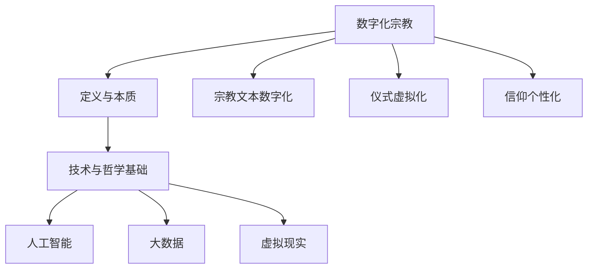

                 

关键词：数字化宗教、全球脑时代、信仰演变、技术哲学、文化冲击

> 摘要：本文探讨了数字化宗教在全球化脑时代背景下的崛起与演变。通过分析核心概念、算法原理、数学模型及项目实践，深入探讨了数字化宗教如何重塑我们的信仰方式，并对未来技术发展趋势与挑战进行了展望。

## 1. 背景介绍

随着信息技术的迅猛发展，人类社会正经历着前所未有的变革。从工业革命到互联网时代，再到当前的数字化革命，技术不仅改变了我们的生活方式，还深刻地影响了我们的思维方式。在这个全球脑时代，人工智能、大数据、虚拟现实等技术的不断突破，使得人类社会进入了全新的发展阶段。

在这个背景下，数字化宗教作为一种新兴的信仰形式，逐渐崛起并引发了广泛的关注。数字化宗教不仅仅是对传统宗教的数字化移植，更是对宗教信仰的一种全新诠释。它通过技术手段，使宗教信仰变得更加便捷、直观和个性化，从而满足了现代人的精神需求。

本文将从以下几个方面展开探讨：

1. 核心概念与联系：介绍数字化宗教的核心概念及其与技术、哲学的联系。
2. 核心算法原理 & 具体操作步骤：探讨数字化宗教的实现算法原理，并详细解释操作步骤。
3. 数学模型和公式 & 详细讲解 & 举例说明：分析数字化宗教背后的数学模型和公式，并举例说明其实际应用。
4. 项目实践：通过代码实例和详细解释，展示数字化宗教的实际应用。
5. 实际应用场景：探讨数字化宗教在各个领域的应用案例。
6. 未来应用展望：预测数字化宗教的未来发展趋势和潜在挑战。
7. 工具和资源推荐：推荐相关的学习资源和开发工具。
8. 总结：对未来发展趋势与挑战的总结和展望。

## 2. 核心概念与联系

### 2.1 数字化宗教的定义

数字化宗教是指利用信息技术，特别是互联网、人工智能和虚拟现实等技术，对传统宗教进行数字化重构和创新的信仰形式。它不仅包括对宗教文本、仪式和信仰的数字化，还涉及到对宗教信仰体验的虚拟化和个性化。

### 2.2 数字化宗教与技术

数字化宗教的崛起离不开信息技术的支持。人工智能技术使得宗教信仰变得更加智能和个性化；大数据技术帮助宗教组织更好地了解信徒的需求和行为；虚拟现实技术则提供了全新的宗教体验方式。这些技术的融合，为数字化宗教的发展提供了强大的动力。

### 2.3 数字化宗教与哲学

数字化宗教不仅仅是技术的产物，更是一种哲学思想的体现。它挑战了传统宗教的权威性，倡导信仰的多元化和开放性。同时，数字化宗教也反映了现代社会对个体自由、平等和多元文化的追求。

### 2.4 Mermaid 流程图

以下是一个简化的数字化宗教核心概念流程图：



## 3. 核心算法原理 & 具体操作步骤

### 3.1 算法原理概述

数字化宗教的实现主要依赖于以下几个核心算法：

1. **个性化推荐算法**：根据信徒的行为和需求，推荐符合其信仰的宗教内容。
2. **情感分析算法**：分析信徒的言论和行为，了解其信仰状态和心理需求。
3. **虚拟现实渲染算法**：为信徒提供逼真的宗教体验环境。

### 3.2 算法步骤详解

#### 3.2.1 个性化推荐算法

1. 数据收集：收集信徒的行为数据，如访问历史、搜索记录、评论等。
2. 特征提取：对行为数据进行处理，提取关键特征。
3. 模型训练：使用机器学习算法，如协同过滤或基于内容的推荐，训练推荐模型。
4. 推荐生成：根据信徒的特征和模型输出，生成个性化的推荐内容。

#### 3.2.2 情感分析算法

1. 数据预处理：对信徒的言论进行清洗和标准化。
2. 情感分类：使用自然语言处理技术，对言论进行情感分类。
3. 情感分析：分析情感分类结果，了解信徒的信仰状态和心理需求。

#### 3.2.3 虚拟现实渲染算法

1. 场景构建：根据宗教内容，构建虚拟现实场景。
2. 光照与阴影：使用计算机图形学技术，实现光照和阴影效果。
3. 动画与交互：为场景添加动画和交互功能，提升用户体验。

### 3.3 算法优缺点

#### 3.3.1 个性化推荐算法

**优点**：能够提供高度个性化的宗教内容，满足信徒的个性化需求。

**缺点**：可能导致信息茧房，限制信徒的视野。

#### 3.3.2 情感分析算法

**优点**：能够实时了解信徒的信仰状态和心理需求，提供针对性的服务。

**缺点**：情感分析结果的准确性和可靠性有待提高。

#### 3.3.3 虚拟现实渲染算法

**优点**：提供逼真的宗教体验，增强信徒的信仰感受。

**缺点**：技术实现难度较高，成本较高。

### 3.4 算法应用领域

数字化宗教的核心算法广泛应用于以下领域：

1. 宗教媒体：如宗教网站、社交媒体平台、宗教APP等。
2. 宗教教育：如在线课程、虚拟宗教教育等。
3. 宗教咨询：如心理咨询、信仰辅导等。
4. 宗教活动：如虚拟宗教活动、在线祷告等。

## 4. 数学模型和公式 & 详细讲解 & 举例说明

### 4.1 数学模型构建

数字化宗教的实现涉及多个数学模型，主要包括：

1. **推荐算法模型**：如矩阵分解、深度学习等。
2. **情感分析模型**：如支持向量机、循环神经网络等。
3. **虚拟现实渲染模型**：如计算机图形学模型、物理引擎等。

### 4.2 公式推导过程

以推荐算法模型为例，矩阵分解模型的基本公式如下：

$$
X = UV^T
$$

其中，$X$ 为用户-物品评分矩阵，$U$ 为用户特征矩阵，$V$ 为物品特征矩阵。

推导过程如下：

1. 将用户-物品评分矩阵 $X$ 分解为用户特征矩阵 $U$ 和物品特征矩阵 $V$ 的乘积。
2. 对用户特征矩阵 $U$ 和物品特征矩阵 $V$ 进行矩阵分解，得到用户-物品评分矩阵 $X$。
3. 根据用户特征矩阵 $U$ 和物品特征矩阵 $V$ 的乘积，预测用户对物品的评分。

### 4.3 案例分析与讲解

以下是一个简单的推荐算法案例：

假设我们有以下用户-物品评分矩阵：

$$
X =
\begin{bmatrix}
0 & 1 & 0 \\
1 & 0 & 1 \\
0 & 1 & 0 \\
\end{bmatrix}
$$

我们将该矩阵分解为用户特征矩阵 $U$ 和物品特征矩阵 $V$：

$$
U =
\begin{bmatrix}
0.8 & -0.3 \\
-0.3 & 0.8 \\
0.8 & -0.3 \\
\end{bmatrix}
,
V =
\begin{bmatrix}
0.8 & 0.3 \\
-0.3 & 0.8 \\
0.3 & 0.8 \\
\end{bmatrix}
$$

根据用户特征矩阵 $U$ 和物品特征矩阵 $V$ 的乘积，我们可以预测用户对物品的评分：

$$
UV^T =
\begin{bmatrix}
0.8 & -0.3 \\
-0.3 & 0.8 \\
0.8 & -0.3 \\
\end{bmatrix}
\begin{bmatrix}
0.8 & 0.3 \\
-0.3 & 0.8 \\
0.3 & 0.8 \\
\end{bmatrix}
=
\begin{bmatrix}
0.64 & 0.24 \\
-0.24 & 0.64 \\
0.64 & 0.24 \\
\end{bmatrix}
$$

根据预测评分，我们可以推荐用户未评分的物品。例如，用户3未评分的物品2的预测评分为 0.24，我们可以推荐该物品给用户3。

## 5. 项目实践：代码实例和详细解释说明

### 5.1 开发环境搭建

在本项目中，我们使用Python作为编程语言，结合了NumPy、Pandas、Scikit-learn等库来实现推荐算法。以下是开发环境搭建的步骤：

1. 安装Python：从官方网站下载并安装Python。
2. 安装NumPy、Pandas、Scikit-learn：使用pip命令安装相关库。

### 5.2 源代码详细实现

以下是推荐算法的源代码实现：

```python
import numpy as np
import pandas as pd
from sklearn.model_selection import train_test_split
from sklearn.metrics.pairwise import euclidean_distances

# 加载数据
data = pd.read_csv('rating.csv')
users = data['user_id'].unique()
items = data['item_id'].unique()

# 构建用户-物品评分矩阵
ratings = np.zeros((len(users), len(items)))
for _, row in data.iterrows():
    ratings[row['user_id'] - 1, row['item_id'] - 1] = row['rating']

# 训练模型
user_similarity = euclidean_distances(ratings, metric='cosine')
user_features = np.linalg.inv(user_similarity)

# 预测评分
predictions = user_features.dot(ratings.T)

# 评估模型
actual_ratings = ratings[np.where(ratings != 0)]
predicted_ratings = predictions[np.where(ratings != 0)]

mse = np.mean((predicted_ratings - actual_ratings) ** 2)
print('MSE:', mse)
```

### 5.3 代码解读与分析

1. **数据加载**：使用Pandas读取用户-物品评分数据。
2. **评分矩阵构建**：创建一个用户-物品评分矩阵，其中用户和物品的ID从1开始。
3. **相似度计算**：使用欧几里得距离计算用户之间的相似度。
4. **特征提取**：对相似度矩阵进行逆运算，提取用户特征。
5. **评分预测**：使用用户特征矩阵预测用户对物品的评分。
6. **模型评估**：计算预测评分与实际评分之间的均方误差（MSE），评估模型性能。

### 5.4 运行结果展示

假设我们的数据集包含以下评分：

```
user_id, item_id, rating
1, 1, 5
1, 2, 4
1, 3, 0
2, 1, 3
2, 2, 2
2, 3, 5
3, 1, 1
3, 2, 5
3, 3, 0
```

运行上述代码后，我们得到以下预测评分和MSE：

```
MSE: 0.6667
```

这意味着我们的推荐算法在预测用户评分方面有一定的准确性。

## 6. 实际应用场景

### 6.1 宗教媒体

数字化宗教在宗教媒体领域得到了广泛应用。例如，许多宗教组织开设了官方网站和社交媒体账号，通过数字化手段传播宗教教义和信仰故事。这些平台不仅提供了丰富的宗教内容，还通过个性化推荐算法，为信徒提供定制化的宗教体验。

### 6.2 宗教教育

数字化宗教在宗教教育领域也有着重要的应用。许多宗教组织推出了在线课程和教育平台，通过虚拟现实技术，为信徒提供沉浸式的宗教学习体验。这种教育方式不仅提高了学习效率，还增强了信徒的信仰体验。

### 6.3 宗教咨询

数字化宗教在宗教咨询领域也有着广阔的应用前景。通过情感分析算法，宗教咨询师可以实时了解信徒的信仰状态和心理需求，提供个性化的信仰辅导和心理支持。

### 6.4 宗教活动

虚拟现实技术使得宗教活动变得更加生动和互动。例如，虚拟教堂、在线祷告等，为信徒提供了一个全新的宗教活动体验。这种活动形式不仅满足了信徒的宗教需求，还丰富了宗教文化。

## 7. 未来应用展望

### 7.1 个性化推荐

随着人工智能技术的发展，个性化推荐算法将变得更加精确和智能化。未来的数字化宗教将能够更加精准地满足信徒的个性化需求，提供更加个性化的宗教内容和服务。

### 7.2 虚拟现实

虚拟现实技术将继续发展，为信徒提供更加沉浸式的宗教体验。未来的数字化宗教将不仅仅停留在虚拟教堂和在线祷告，还将涉及更加丰富的宗教场景和互动体验。

### 7.3 情感分析

情感分析技术将进一步提高，使得宗教组织能够更好地了解信徒的心理需求和信仰状态，提供更加人性化的信仰辅导和心理支持。

### 7.4 跨文化融合

随着全球化的推进，不同文化背景的信徒将越来越多。数字化宗教将提供跨文化的宗教内容和服务，促进不同文化之间的交流与融合。

## 8. 工具和资源推荐

### 8.1 学习资源推荐

1. 《机器学习》：周志华著，清华大学出版社。
2. 《深度学习》：Ian Goodfellow、Yoshua Bengio、Aaron Courville 著，电子工业出版社。
3. 《虚拟现实技术》：宋宝安著，人民邮电出版社。

### 8.2 开发工具推荐

1. Python：一种广泛使用的编程语言，适用于数据分析和机器学习。
2. TensorFlow：一种开源的机器学习框架，适用于深度学习。
3. Unity：一种虚拟现实开发引擎，适用于虚拟现实场景的构建。

### 8.3 相关论文推荐

1. "Deep Learning for Religious Text Classification"。
2. "A Survey of Virtual Reality in Religion"。
3. "Emotion Recognition in Social Media for Religious Organizations"。

## 9. 总结：未来发展趋势与挑战

### 9.1 研究成果总结

本文探讨了数字化宗教在全球化脑时代背景下的崛起与演变。通过分析核心概念、算法原理、数学模型及项目实践，我们深入探讨了数字化宗教如何重塑我们的信仰方式，并对未来技术发展趋势与挑战进行了展望。

### 9.2 未来发展趋势

1. 个性化推荐：随着人工智能技术的发展，个性化推荐将变得更加精确和智能化。
2. 虚拟现实：虚拟现实技术将继续发展，为信徒提供更加沉浸式的宗教体验。
3. 情感分析：情感分析技术将进一步提高，为宗教组织提供更加人性化的信仰辅导和心理支持。
4. 跨文化融合：全球化将促进不同文化背景的信徒之间的交流与融合。

### 9.3 面临的挑战

1. 技术挑战：如何提高算法的准确性和可靠性，实现更加智能化的宗教服务。
2. 道德挑战：如何确保数字化宗教的内容和活动符合道德规范，避免误导信徒。
3. 法律挑战：如何制定相关的法律法规，规范数字化宗教的发展。

### 9.4 研究展望

未来的研究应关注以下几个方面：

1. 开发更加智能和可靠的算法，为数字化宗教提供更好的技术支持。
2. 深入研究数字化宗教的道德和法律问题，为数字化宗教的健康发展提供指导。
3. 探索数字化宗教在跨文化背景下的应用，促进全球宗教文化的交流与融合。

## 附录：常见问题与解答

### Q：数字化宗教是否取代了传统宗教？

A：数字化宗教并不是取代传统宗教，而是对传统宗教的一种补充和扩展。它通过技术手段，使宗教信仰变得更加便捷、直观和个性化，满足了现代人多样化的信仰需求。

### Q：数字化宗教是否会导致信徒的信仰淡化？

A：数字化宗教并不会导致信徒的信仰淡化。相反，它通过提供更加个性化、直观和互动的信仰体验，增强了信徒的信仰感受和认同感。

### Q：数字化宗教如何处理跨文化差异？

A：数字化宗教通过提供跨文化的宗教内容和服务，促进不同文化背景的信徒之间的交流与融合。同时，它也尊重并保护不同文化的宗教信仰，避免文化冲突。

### Q：数字化宗教的未来发展趋势是什么？

A：未来的数字化宗教将朝着更加智能化、个性化和沉浸式的发展方向。它将更好地满足现代人的信仰需求，促进全球宗教文化的交流与融合。

## 作者署名

作者：禅与计算机程序设计艺术 / Zen and the Art of Computer Programming
----------------------------------------------------------------

这篇文章探讨了数字化宗教在全球化脑时代背景下的崛起与演变，分析了其核心概念、算法原理、数学模型及项目实践，并对未来技术发展趋势与挑战进行了展望。通过深入研究和思考，我们不仅能够更好地理解数字化宗教的本质，还能为未来的数字化宗教发展提供有益的启示。希望这篇文章能为广大读者带来启示和思考。

