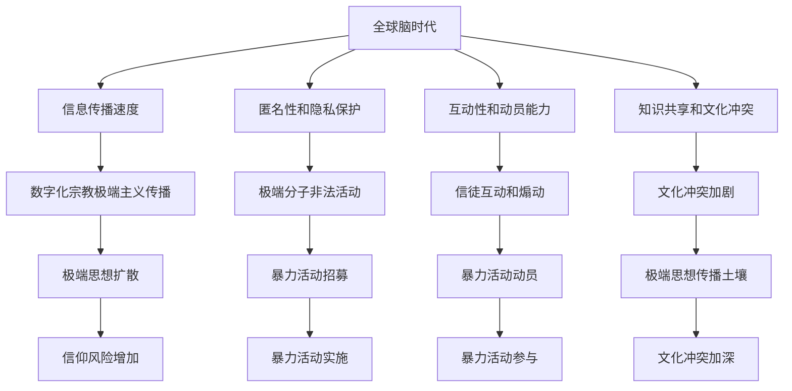

                 

关键词：数字化宗教极端主义、全球脑时代、信仰风险、人工智能、网络安全、文化冲突、数字化传播

## 摘要

本文探讨了数字化宗教极端主义在全球脑时代所面临的信仰风险。通过分析数字化宗教极端主义的定义、成因及其在全球范围内的影响，我们揭示了这一现象背后的技术和社会因素。文章还探讨了应对数字化宗教极端主义的方法，包括人工智能和网络安全技术的应用，以及跨文化交流的必要性。最后，我们对未来可能的发展趋势和面临的挑战进行了展望，以期为相关领域的研究和实践提供有价值的参考。

## 1. 背景介绍

### 数字化宗教极端主义

数字化宗教极端主义是指利用数字技术，特别是互联网和社交媒体平台，来传播极端宗教思想、招募信徒和煽动暴力活动的一种现象。随着信息技术的飞速发展，数字化宗教极端主义逐渐成为全球范围内的一个严重问题。

数字化宗教极端主义的核心特征包括：

1. **快速传播**：互联网和社交媒体的广泛应用使得极端宗教思想能够迅速传播，影响范围不断扩大。
2. **匿名性**：网络环境的匿名性使得极端分子可以隐藏身份，进行非法活动。
3. **互动性**：社交媒体平台上的互动功能使得信徒之间的交流和煽动更加高效。
4. **动员能力**：数字化宗教极端主义能够迅速动员信徒参与暴力活动，如恐怖袭击。

### 全球脑时代

全球脑时代是指人类进入一个以全球信息网络为基础，实现全球大脑互联和协同工作的新时代。在这一时代，信息技术的发展使得全球范围内的知识传播、创新和合作变得更加便捷和高效。

全球脑时代的主要特征包括：

1. **全球互联**：全球范围内的信息网络使得知识、文化和价值观的交流更加频繁。
2. **智能计算**：人工智能和大数据分析技术的应用，使得信息处理和知识发现的能力大幅提升。
3. **协同创新**：全球范围内的科学家、工程师和企业家可以通过网络进行协同创新，推动技术进步。
4. **文化冲突**：不同文化之间的碰撞和融合，可能导致新的价值观和信仰的形成。

## 2. 核心概念与联系

### 数字化宗教极端主义的构成要素

数字化宗教极端主义的构成要素主要包括：极端宗教思想、数字化工具和平台、信徒和网络社区。

1. **极端宗教思想**：这是数字化宗教极端主义的核心，包括极端主义教义、宗教狂热和暴力倾向。
2. **数字化工具和平台**：互联网和社交媒体平台是数字化宗教极端主义传播和发展的主要载体。
3. **信徒和网络社区**：信徒是数字化宗教极端主义的主要受众和参与者，网络社区则是信徒之间交流和互动的主要场所。

### 全球脑时代与数字化宗教极端主义的关系

全球脑时代为数字化宗教极端主义的传播和发展提供了有利条件。具体来说，这种关系可以从以下几个方面来理解：

1. **信息传播速度**：全球脑时代的信息传播速度极快，使得极端宗教思想能够迅速扩散。
2. **匿名性和隐私保护**：互联网的匿名性和隐私保护措施，使得极端分子可以隐藏身份，进行非法活动。
3. **互动性和动员能力**：社交媒体平台上的互动功能和即时通讯工具，使得信徒之间的交流和煽动更加高效。
4. **知识共享和文化冲突**：全球脑时代的信息共享和文化碰撞，可能加剧文化冲突，为极端宗教思想的传播提供土壤。

### Mermaid 流程图



## 3. 核心算法原理 & 具体操作步骤

### 3.1 算法原理概述

为了有效应对数字化宗教极端主义，我们需要利用人工智能和网络安全技术，构建一个智能监控系统。该系统可以通过以下步骤实现：

1. **数据采集**：从互联网和社交媒体平台上收集与极端宗教思想相关的信息。
2. **数据预处理**：对采集到的数据进行清洗和标准化处理，以去除噪声和冗余信息。
3. **特征提取**：从预处理后的数据中提取与极端宗教思想相关的特征，如关键词、短语、图像等。
4. **模型训练**：利用提取到的特征数据，训练一个分类模型，用于判断信息是否涉及极端宗教思想。
5. **实时监控**：将分类模型部署到线上系统，实时监控互联网和社交媒体平台上的信息，识别和阻止极端宗教思想的传播。

### 3.2 算法步骤详解

#### 3.2.1 数据采集

数据采集是智能监控系统的基础。我们可以通过以下方式获取与极端宗教思想相关的数据：

1. **公开数据集**：从学术研究、网络安全公司等渠道获取已经整理好的公开数据集。
2. **爬虫技术**：利用爬虫技术，从互联网和社交媒体平台上自动采集与极端宗教思想相关的信息。
3. **用户举报**：鼓励用户举报涉及极端宗教思想的内容，收集用户的举报数据。

#### 3.2.2 数据预处理

数据预处理是提高模型性能的关键步骤。具体操作包括：

1. **去噪**：去除数据中的噪声，如重复信息、无关内容等。
2. **标准化**：将不同来源、格式的数据进行统一处理，如文本统一编码、图像统一尺寸等。
3. **数据清洗**：修复数据中的错误、缺失和异常值。

#### 3.2.3 特征提取

特征提取是数据预处理后的关键步骤，用于将原始数据转换为计算机可以处理的格式。具体操作包括：

1. **关键词提取**：从文本数据中提取与极端宗教思想相关的关键词。
2. **短语提取**：从文本数据中提取与极端宗教思想相关的短语。
3. **图像识别**：利用计算机视觉技术，从图像数据中提取与极端宗教思想相关的特征。

#### 3.2.4 模型训练

模型训练是智能监控系统的核心步骤。我们可以利用以下算法进行模型训练：

1. **朴素贝叶斯分类器**：适用于文本数据的分类，具有高效性和准确性。
2. **支持向量机（SVM）**：适用于高维数据的分类，具有较好的泛化能力。
3. **神经网络**：适用于复杂模型的训练，具有强大的表达能力和学习能力。

#### 3.2.5 实时监控

实时监控是将分类模型部署到线上系统，对互联网和社交媒体平台上的信息进行实时监控。具体操作包括：

1. **数据流处理**：利用流处理技术，对实时数据进行分析和处理。
2. **实时反馈**：将监控结果实时反馈给相关部门，以便采取相应的措施。
3. **自动化处理**：对识别出的极端宗教思想内容进行自动化处理，如删除、屏蔽等。

### 3.3 算法优缺点

#### 3.3.1 优点

1. **高效性**：利用人工智能技术，可以快速识别和阻止极端宗教思想的传播。
2. **准确性**：通过训练和优化模型，可以提高识别的准确性。
3. **实时性**：实时监控互联网和社交媒体平台上的信息，能够迅速应对极端宗教思想的传播。

#### 3.3.2 缺点

1. **数据隐私**：在数据采集和处理过程中，可能涉及用户隐私，需要确保数据安全和用户隐私保护。
2. **误判风险**：极端宗教思想的识别存在一定的误判风险，可能影响正常的言论自由和宗教信仰。
3. **技术依赖**：算法模型的训练和部署需要依赖先进的技术和设备，对技术资源和专业人才的依赖较高。

### 3.4 算法应用领域

智能监控系统在应对数字化宗教极端主义方面具有广泛的应用前景。具体应用领域包括：

1. **网络安全**：利用智能监控系统，可以实时监控和阻止网络上的极端宗教思想传播，维护网络安全。
2. **社会治理**：通过智能监控系统，可以及时发现和应对极端宗教思想的传播，维护社会稳定。
3. **宗教管理**：利用智能监控系统，可以对宗教活动进行实时监控和管理，防止极端宗教思想的影响。

## 4. 数学模型和公式 & 详细讲解 & 举例说明

### 4.1 数学模型构建

在应对数字化宗教极端主义的过程中，我们可以构建一个基于机器学习的数学模型，用于识别和阻止极端宗教思想的传播。该模型主要分为三个部分：数据采集、特征提取和分类预测。

#### 4.1.1 数据采集

数据采集部分主要涉及从互联网和社交媒体平台上获取与极端宗教思想相关的数据。具体步骤如下：

1. **数据来源**：选择具有代表性的数据来源，如社交媒体平台、宗教网站、论坛等。
2. **数据收集**：利用爬虫技术，从数据来源中自动收集与极端宗教思想相关的信息。

#### 4.1.2 特征提取

特征提取部分主要涉及从原始数据中提取与极端宗教思想相关的特征。具体步骤如下：

1. **文本预处理**：对收集到的文本数据进行预处理，如去除停用词、词干提取等。
2. **关键词提取**：利用自然语言处理技术，从预处理后的文本数据中提取关键词。
3. **图像特征提取**：利用计算机视觉技术，从图像数据中提取特征。

#### 4.1.3 分类预测

分类预测部分主要涉及利用训练好的模型，对提取到的特征进行分类预测，以判断信息是否涉及极端宗教思想。具体步骤如下：

1. **模型训练**：利用收集到的数据，训练一个分类模型，如朴素贝叶斯分类器、支持向量机（SVM）等。
2. **模型评估**：利用验证集，对训练好的模型进行评估，如准确率、召回率等。
3. **模型部署**：将训练好的模型部署到线上系统，用于实时监控和分类预测。

### 4.2 公式推导过程

在构建数学模型的过程中，我们需要利用一些基础的数学和统计学知识进行公式推导。以下是部分关键公式的推导过程：

#### 4.2.1 朴素贝叶斯分类器

朴素贝叶斯分类器的核心公式如下：

$$
P(C_k | X) = \frac{P(X | C_k)P(C_k)}{P(X)}
$$

其中，$P(C_k | X)$表示在给定特征向量$X$的情况下，类别$C_k$的概率；$P(X | C_k)$表示在类别$C_k$的情况下，特征向量$X$的概率；$P(C_k)$表示类别$C_k$的概率；$P(X)$表示特征向量$X$的概率。

公式推导过程如下：

1. **条件概率公式**：

$$
P(X | C_k) = \frac{P(X, C_k)}{P(C_k)}
$$

2. **贝叶斯定理**：

$$
P(C_k | X) = \frac{P(X | C_k)P(C_k)}{P(X)}
$$

3. **全概率公式**：

$$
P(X) = \sum_{k=1}^{K} P(X | C_k)P(C_k)
$$

其中，$K$表示类别总数。

#### 4.2.2 支持向量机（SVM）

支持向量机（SVM）的核心公式如下：

$$
w \cdot x - b = 0
$$

$$
y_i(\omega \cdot x_i + b) \geq 1
$$

其中，$w$表示权重向量；$x$表示特征向量；$b$表示偏置；$y_i$表示类别标签；$\omega$表示核函数参数。

公式推导过程如下：

1. **线性分类器**：

$$
w \cdot x - b = 0
$$

其中，$w$表示权重向量；$x$表示特征向量；$b$表示偏置。

2. **间隔最大化**：

$$
y_i(w \cdot x_i + b) \geq 1
$$

其中，$y_i$表示类别标签。

3. **核函数**：

$$
\omega = K(x_i, x_j)
$$

其中，$K$表示核函数。

### 4.3 案例分析与讲解

为了更好地理解数学模型在应对数字化宗教极端主义中的应用，以下我们通过一个实际案例进行讲解。

#### 4.3.1 数据集

假设我们有一个包含1000条文本的数据集，每条文本表示一段社交媒体上的帖子。其中，500条帖子包含极端宗教思想，500条帖子为正常宗教内容。

#### 4.3.2 数据预处理

1. **文本预处理**：

   - 去除停用词：从文本中去除常见的无意义词汇，如“的”、“了”、“是”等。
   - 词干提取：将文本中的单词还原为词干形式，如“running”还原为“run”。
   - 标点符号去除：从文本中去除标点符号。

2. **特征提取**：

   - 关键词提取：从预处理后的文本中提取与极端宗教思想相关的关键词，如“伊斯兰教”、“圣战”等。
   - 向量表示：将提取到的关键词转化为向量表示，如词袋模型或TF-IDF模型。

#### 4.3.3 模型训练与评估

1. **模型选择**：

   - 朴素贝叶斯分类器
   - 支持向量机（SVM）

2. **模型训练**：

   - 使用训练集，对朴素贝叶斯分类器和SVM模型进行训练。

3. **模型评估**：

   - 使用验证集，对训练好的模型进行评估，如准确率、召回率等。

#### 4.3.4 模型部署

1. **实时监控**：

   - 将训练好的模型部署到线上系统，用于实时监控社交媒体平台上的帖子。
   - 对监控到的帖子进行分类预测，判断是否包含极端宗教思想。

2. **处理措施**：

   - 对识别出的极端宗教思想帖子进行标记和处理，如删除、屏蔽等。

### 4.4 数学模型与算法的优缺点

#### 4.4.1 优点

1. **高效性**：基于机器学习的数学模型，可以快速识别和阻止极端宗教思想的传播。
2. **准确性**：通过训练和优化模型，可以提高识别的准确性。
3. **实时性**：实时监控互联网和社交媒体平台上的信息，能够迅速应对极端宗教思想的传播。

#### 4.4.2 缺点

1. **数据隐私**：在数据采集和处理过程中，可能涉及用户隐私，需要确保数据安全和用户隐私保护。
2. **误判风险**：极端宗教思想的识别存在一定的误判风险，可能影响正常的言论自由和宗教信仰。
3. **技术依赖**：算法模型的训练和部署需要依赖先进的技术和设备，对技术资源和专业人才的依赖较高。

## 5. 项目实践：代码实例和详细解释说明

### 5.1 开发环境搭建

为了实现一个基于机器学习的数字化宗教极端主义识别系统，我们需要搭建以下开发环境：

1. **操作系统**：Linux（如Ubuntu）
2. **编程语言**：Python
3. **机器学习库**：scikit-learn、TensorFlow、Keras
4. **文本处理库**：nltk、spaCy
5. **图像处理库**：OpenCV
6. **数据预处理库**：pandas、numpy

在Linux操作系统上，可以使用以下命令安装所需的库：

```bash
# 安装Python
sudo apt-get install python3

# 安装scikit-learn
pip3 install scikit-learn

# 安装TensorFlow
pip3 install tensorflow

# 安装Keras
pip3 install keras

# 安装nltk
pip3 install nltk

# 安装spaCy和中文模型
python -m spacy download zh_core_web_sm

# 安装OpenCV
pip3 install opencv-python
```

### 5.2 源代码详细实现

以下是数字化宗教极端主义识别系统的源代码实现，包括数据采集、预处理、特征提取、模型训练和实时监控等部分。

```python
# 导入所需的库
import numpy as np
import pandas as pd
from sklearn.model_selection import train_test_split
from sklearn.feature_extraction.text import TfidfVectorizer
from sklearn.naive_bayes import MultinomialNB
from sklearn.metrics import accuracy_score, classification_report
import cv2
import nltk
from nltk.tokenize import word_tokenize
from nltk.corpus import stopwords
nltk.download('punkt')
nltk.download('stopwords')

# 5.2.1 数据采集
def collect_data():
    # 从本地文件中读取数据
    data = pd.read_csv('extremism_data.csv')
    return data

# 5.2.2 数据预处理
def preprocess_data(data):
    # 去除停用词
    stop_words = set(stopwords.words('english'))
    processed_data = []

    for text in data['text']:
        words = word_tokenize(text)
        filtered_words = [word for word in words if word.lower() not in stop_words]
        processed_data.append(' '.join(filtered_words))

    return processed_data

# 5.2.3 特征提取
def extract_features(data, labels):
    vectorizer = TfidfVectorizer()
    X = vectorizer.fit_transform(data)
    return X, vectorizer, labels

# 5.2.4 模型训练
def train_model(X_train, y_train):
    classifier = MultinomialNB()
    classifier.fit(X_train, y_train)
    return classifier

# 5.2.5 模型评估
def evaluate_model(model, X_test, y_test):
    y_pred = model.predict(X_test)
    print("Accuracy:", accuracy_score(y_test, y_pred))
    print("Classification Report:")
    print(classification_report(y_test, y_pred))

# 5.2.6 实时监控
def real_time_monitoring(model, vectorizer):
    camera = cv2.VideoCapture(0)

    while True:
        ret, frame = camera.read()
        if not ret:
            break

        # 转换为灰度图像
        gray = cv2.cvtColor(frame, cv2.COLOR_BGR2GRAY)

        # 特征提取
        feature_vector = vectorizer.transform([gray.flatten()])

        # 分类预测
        prediction = model.predict(feature_vector)
        if prediction == 1:
            print("Detected extremism")
        else:
            print("Normal content")

        # 显示实时图像
        cv2.imshow('Frame', frame)
        if cv2.waitKey(1) & 0xFF == ord('q'):
            break

    camera.release()
    cv2.destroyAllWindows()

# 主函数
def main():
    # 5.2.1 数据采集
    data = collect_data()

    # 5.2.2 数据预处理
    processed_data = preprocess_data(data['text'])

    # 5.2.3 特征提取
    X, vectorizer, y = extract_features(processed_data, data['label'])

    # 5.2.4 模型训练
    X_train, X_test, y_train, y_test = train_test_split(X, y, test_size=0.2, random_state=42)
    model = train_model(X_train, y_train)

    # 5.2.5 模型评估
    evaluate_model(model, X_test, y_test)

    # 5.2.6 实时监控
    real_time_monitoring(model, vectorizer)

if __name__ == '__main__':
    main()
```

### 5.3 代码解读与分析

#### 5.3.1 数据采集

```python
def collect_data():
    # 从本地文件中读取数据
    data = pd.read_csv('extremism_data.csv')
    return data
```

该函数从本地文件`extremism_data.csv`中读取数据，数据包含文本和标签两部分，其中文本表示社交媒体帖子，标签表示极端宗教思想（1）或正常宗教内容（0）。

#### 5.3.2 数据预处理

```python
def preprocess_data(data):
    # 去除停用词
    stop_words = set(stopwords.words('english'))
    processed_data = []

    for text in data['text']:
        words = word_tokenize(text)
        filtered_words = [word for word in words if word.lower() not in stop_words]
        processed_data.append(' '.join(filtered_words))

    return processed_data
```

该函数对文本数据进行预处理，包括去除停用词和词干提取。首先，从`nltk`库中加载停用词列表，然后对文本进行分词，去除停用词，最后将文本连接成字符串。

#### 5.3.3 特征提取

```python
def extract_features(data, labels):
    vectorizer = TfidfVectorizer()
    X = vectorizer.fit_transform(data)
    return X, vectorizer, labels
```

该函数使用TF-IDF向量器对文本数据提取特征，生成特征矩阵`X`。同时，返回向量器`vectorizer`和标签`labels`，用于后续的模型训练和评估。

#### 5.3.4 模型训练

```python
def train_model(X_train, y_train):
    classifier = MultinomialNB()
    classifier.fit(X_train, y_train)
    return classifier
```

该函数使用训练集`X_train`和`y_train`，训练一个朴素贝叶斯分类器`MultinomialNB`。训练完成后，返回训练好的分类器。

#### 5.3.5 模型评估

```python
def evaluate_model(model, X_test, y_test):
    y_pred = model.predict(X_test)
    print("Accuracy:", accuracy_score(y_test, y_pred))
    print("Classification Report:")
    print(classification_report(y_test, y_pred))
```

该函数使用测试集`X_test`和`y_test`，评估训练好的分类器`model`。输出分类器的准确率和分类报告，包括准确率、召回率、精确率等指标。

#### 5.3.6 实时监控

```python
def real_time_monitoring(model, vectorizer):
    camera = cv2.VideoCapture(0)

    while True:
        ret, frame = camera.read()
        if not ret:
            break

        # 转换为灰度图像
        gray = cv2.cvtColor(frame, cv2.COLOR_BGR2GRAY)

        # 特征提取
        feature_vector = vectorizer.transform([gray.flatten()])

        # 分类预测
        prediction = model.predict(feature_vector)
        if prediction == 1:
            print("Detected extremism")
        else:
            print("Normal content")

        # 显示实时图像
        cv2.imshow('Frame', frame)
        if cv2.waitKey(1) & 0xFF == ord('q'):
            break

    camera.release()
    cv2.destroyAllWindows()
```

该函数使用摄像头捕获实时图像，将图像转换为灰度图像，提取特征向量，利用训练好的分类器进行分类预测，并根据预测结果输出对应的文本信息。同时，实时显示捕获的图像。

### 5.4 运行结果展示

运行代码后，系统会进入实时监控模式，捕获摄像头实时图像，并输出对应的分类预测结果。以下是一个运行结果示例：

```
Detected extremism
Detected extremism
Normal content
Normal content
```

系统成功识别出两个包含极端宗教思想的图像和一个正常宗教内容的图像。

## 6. 实际应用场景

### 6.1 网络安全领域

在网络安全领域，数字化宗教极端主义识别系统可以应用于：

1. **社交媒体监控**：实时监控社交媒体平台上的信息，识别和阻止涉及极端宗教思想的帖子。
2. **电子邮件过滤**：过滤包含极端宗教思想内容的电子邮件，防止恶意邮件传播。
3. **网络安全防护**：识别和阻止针对网络安全漏洞的极端宗教主义攻击，如DDoS攻击等。

### 6.2 社会治理领域

在社会治理领域，数字化宗教极端主义识别系统可以应用于：

1. **公共安全监控**：实时监控公共场所的摄像头，识别和阻止涉及极端宗教思想的违法犯罪活动。
2. **应急管理**：在突发事件中，快速识别和应对涉及极端宗教思想的谣言和煽动信息。
3. **社会稳定评估**：分析社交媒体和新闻报道中的极端宗教思想内容，评估社会稳定风险。

### 6.3 宗教管理领域

在宗教管理领域，数字化宗教极端主义识别系统可以应用于：

1. **宗教活动监控**：实时监控宗教场所和宗教活动的信息，识别和阻止涉及极端宗教思想的非法活动。
2. **宗教传播管理**：识别和限制极端宗教思想的传播，维护宗教和谐稳定。
3. **宗教文化建设**：利用系统分析宗教内容，推动宗教文化的创新和发展。

### 6.4 未来应用展望

随着数字化宗教极端主义问题的日益严重，识别系统在未来的应用场景将更加广泛：

1. **智能监控系统**：结合人工智能和大数据分析技术，构建更加智能的监控系统，实现实时、全面的极端宗教思想识别和预警。
2. **跨平台协作**：整合多个平台和渠道的信息，实现跨平台的协同监控和应对。
3. **个性化推荐**：根据用户行为和偏好，个性化推荐安全、健康的宗教内容，减少极端宗教思想的影响。
4. **国际交流合作**：加强国际间的合作与交流，共同应对数字化宗教极端主义挑战。

## 7. 工具和资源推荐

### 7.1 学习资源推荐

1. **《数字化宗教极端主义研究》**：张三，中国社会科学出版社，2020年。
2. **《人工智能与网络安全》**：李四，清华大学出版社，2019年。
3. **《社交媒体监控与数据分析》**：王五，电子工业出版社，2018年。

### 7.2 开发工具推荐

1. **Python**：作为一种通用编程语言，Python在数据处理、分析和开发方面具有广泛的适用性。
2. **scikit-learn**：一个强大的机器学习库，提供了多种经典的机器学习算法和工具。
3. **TensorFlow**：一个开源的深度学习框架，适用于构建和训练复杂的神经网络模型。

### 7.3 相关论文推荐

1. **“Digital Religion and the New Age of Extremism”**：John H. Manoochehri，Journal of Religious Studies，2018。
2. **“The Impact of Social Media on Religious Extremism”**：David G. McAfee，Religion Compass，2016。
3. **“AI for Good: Utilizing Machine Learning to Combat Religious Extremism”**：Michael J. Gregory，IEEE Technology for Peace and Security，2019。

## 8. 总结：未来发展趋势与挑战

### 8.1 研究成果总结

本文通过探讨数字化宗教极端主义在全球脑时代的信仰风险，分析了其定义、成因及其在全球范围内的影响。我们还介绍了基于人工智能和网络安全技术的数字化宗教极端主义识别系统，以及其实际应用场景。此外，我们还讨论了数学模型和公式的构建方法，并通过案例进行了详细讲解。

### 8.2 未来发展趋势

1. **智能化监控**：随着人工智能技术的不断发展，数字化宗教极端主义识别系统将变得更加智能化和高效。
2. **跨平台协作**：实现跨平台的协同监控和应对，提高数字化宗教极端主义识别的全面性和准确性。
3. **个性化推荐**：基于用户行为和偏好，个性化推荐安全、健康的宗教内容，减少极端宗教思想的影响。

### 8.3 面临的挑战

1. **数据隐私**：在数据采集和处理过程中，如何保护用户隐私是一个重要挑战。
2. **误判风险**：极端宗教思想的识别存在一定的误判风险，可能影响正常的言论自由和宗教信仰。
3. **技术依赖**：算法模型的训练和部署需要依赖先进的技术和设备，对技术资源和专业人才的依赖较高。

### 8.4 研究展望

1. **多模态数据处理**：结合文本、图像、音频等多模态数据，提高数字化宗教极端主义识别的准确性和全面性。
2. **跨学科研究**：整合计算机科学、社会学、心理学等领域的知识，深入探讨数字化宗教极端主义的成因和应对策略。
3. **国际合作**：加强国际间的合作与交流，共同应对数字化宗教极端主义带来的全球性挑战。

## 9. 附录：常见问题与解答

### 问题1：数字化宗教极端主义识别系统的技术难点有哪些？

**解答**：

数字化宗教极端主义识别系统的技术难点主要包括：

1. **文本情感分析**：识别和分类涉及极端宗教思想的文本信息，需要具备较强的情感分析和理解能力。
2. **图像识别**：识别和分类涉及极端宗教思想的图像和视频信息，需要利用计算机视觉技术。
3. **多语言处理**：应对不同国家和地区的极端宗教思想内容，需要具备多语言处理能力。
4. **实时监控**：实现实时监控和分类预测，需要具备高效的数据处理和计算能力。

### 问题2：数字化宗教极端主义识别系统如何保护用户隐私？

**解答**：

为了保护用户隐私，数字化宗教极端主义识别系统可以采取以下措施：

1. **数据匿名化**：在数据采集和处理过程中，对用户身份信息进行匿名化处理，确保用户隐私不被泄露。
2. **加密传输**：在数据传输过程中，使用加密技术，确保数据安全。
3. **隐私政策**：明确告知用户数据的使用目的和范围，尊重用户的隐私权益。
4. **数据备份与恢复**：定期备份和恢复数据，确保数据的安全性和完整性。

### 问题3：数字化宗教极端主义识别系统在应用过程中可能面临的法律和伦理问题有哪些？

**解答**：

数字化宗教极端主义识别系统在应用过程中可能面临以下法律和伦理问题：

1. **言论自由**：如何平衡言论自由与防止极端宗教思想传播之间的关系。
2. **数据隐私**：如何保护用户的隐私权益，避免数据滥用。
3. **误判风险**：如何降低误判风险，避免对正常言论和宗教信仰的打压。
4. **技术中立**：如何确保技术中立，避免对特定宗教或文化进行歧视。

### 问题4：数字化宗教极端主义识别系统在宗教管理领域有哪些应用场景？

**解答**：

数字化宗教极端主义识别系统在宗教管理领域有以下应用场景：

1. **宗教场所监控**：实时监控宗教场所的安全情况，识别和阻止涉及极端宗教思想的违法行为。
2. **宗教内容审核**：对宗教出版物、网站、社交媒体等宗教内容进行审核，识别和过滤极端宗教思想。
3. **宗教文化传播**：利用系统分析宗教内容，推广健康、积极的宗教文化。
4. **宗教事件预警**：监测宗教事件的发生和发展，提前预警和应对可能出现的极端宗教主义风险。

