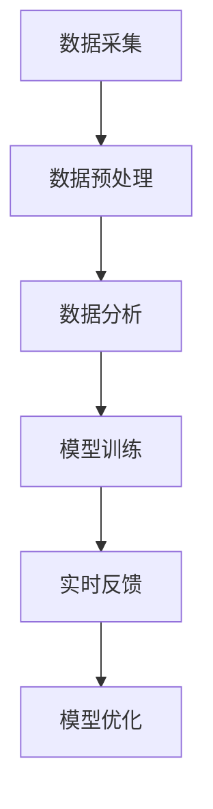

                 

关键词：数字化宠物训练、AI、宠物教育、创业、技术解决方案

> 摘要：随着人工智能技术的快速发展，宠物行业逐渐成为新兴的创业领域。本文探讨了如何利用AI技术推动数字化宠物训练的创业实践，并分析了其中的核心概念、算法原理、数学模型及实际应用场景。希望通过本文的探讨，为创业者提供一些有益的思路和参考。

## 1. 背景介绍

近年来，人工智能（AI）技术在全球范围内取得了显著的突破，无论是学术界还是产业界，都展现出了极大的潜力。其中，AI在宠物训练领域的应用尤为引人注目。随着宠物拥有率的不断攀升，人们对宠物行为问题的关注度也在不断提升，如何通过AI技术实现宠物训练的自动化、智能化，成为了一个热门的创业方向。

数字化宠物训练，简单来说，就是利用人工智能技术，对宠物行为进行数据分析，从而制定出科学的训练方案。这一过程不仅能够提高宠物训练的效率，还能为宠物主人提供更加个性化的服务。

宠物行业的市场规模也在不断扩大。根据市场调研机构的数据显示，全球宠物市场规模已超过万亿美元，并且预计未来几年仍将保持较高的增长速度。在这样的背景下，越来越多的创业者看到了数字化宠物训练的巨大商机。

## 2. 核心概念与联系

### 2.1  AI技术概述

AI技术，即人工智能技术，是指使计算机具备人类智能水平的理论、技术和应用。它涵盖了多个领域，包括机器学习、深度学习、自然语言处理、计算机视觉等。在宠物训练中，AI技术主要用于以下几个方面：

- 数据采集：通过摄像头、传感器等设备，对宠物的行为进行实时监测和记录。
- 数据分析：利用机器学习算法，对采集到的数据进行分析，提取出宠物的行为特征。
- 模型训练：根据分析结果，构建训练模型，以便对宠物行为进行预测和调整。
- 实时反馈：将训练模型应用于实际场景，对宠物行为进行实时反馈和调整。

### 2.2  宠物训练流程

数字化宠物训练的基本流程可以分为以下几个步骤：

1. 数据采集：通过摄像头、传感器等设备，对宠物的行为进行实时监测和记录。
2. 数据预处理：对采集到的数据进行清洗、归一化等处理，以便后续分析。
3. 数据分析：利用机器学习算法，对预处理后的数据进行分析，提取出宠物的行为特征。
4. 模型训练：根据分析结果，构建训练模型，以便对宠物行为进行预测和调整。
5. 实时反馈：将训练模型应用于实际场景，对宠物行为进行实时反馈和调整。
6. 模型优化：根据实时反馈结果，对训练模型进行优化，以提高训练效果。

### 2.3  Mermaid 流程图

以下是一个简化的数字化宠物训练流程的Mermaid流程图：



## 3. 核心算法原理 & 具体操作步骤

### 3.1  算法原理概述

数字化宠物训练的核心算法主要包括机器学习算法和深度学习算法。机器学习算法主要用于数据分析和模型训练，而深度学习算法则用于图像识别和自然语言处理。

在数据采集阶段，常用的算法有卷积神经网络（CNN）和循环神经网络（RNN）。CNN主要用于图像识别，能够提取图像中的特征；RNN主要用于序列数据，能够处理时间序列数据。

在数据分析阶段，常用的算法有K-means聚类、支持向量机（SVM）和决策树等。这些算法能够对采集到的数据进行分类、聚类等处理，以便提取出宠物的行为特征。

在模型训练阶段，常用的算法有反向传播算法（BP）和生成对抗网络（GAN）等。这些算法能够根据分析结果，构建训练模型，以便对宠物行为进行预测和调整。

### 3.2  算法步骤详解

以下是数字化宠物训练的具体算法步骤：

1. 数据采集：通过摄像头、传感器等设备，对宠物的行为进行实时监测和记录。
2. 数据预处理：对采集到的数据进行清洗、归一化等处理，以便后续分析。
3. 数据分析：利用机器学习算法，对预处理后的数据进行分析，提取出宠物的行为特征。
4. 模型训练：根据分析结果，构建训练模型，以便对宠物行为进行预测和调整。
5. 实时反馈：将训练模型应用于实际场景，对宠物行为进行实时反馈和调整。
6. 模型优化：根据实时反馈结果，对训练模型进行优化，以提高训练效果。

### 3.3  算法优缺点

- **机器学习算法：**
  - 优点：算法简单，易于实现，适用于处理大规模数据。
  - 缺点：模型复杂度较高，训练时间较长，且容易过拟合。

- **深度学习算法：**
  - 优点：能够自动提取数据中的特征，适用于处理复杂的数据。
  - 缺点：算法复杂，计算量大，对数据质量和数量要求较高。

### 3.4  算法应用领域

数字化宠物训练算法广泛应用于以下几个方面：

- **宠物行为分析：** 利用算法对宠物的行为进行实时监测和分析，为宠物主人提供专业的行为建议。
- **宠物医疗：** 通过分析宠物的行为数据，发现潜在的健康问题，为宠物提供及时的医疗建议。
- **宠物训练：** 利用算法为宠物主人提供个性化的训练方案，提高训练效果。

## 4. 数学模型和公式 & 详细讲解 & 举例说明

### 4.1  数学模型构建

在数字化宠物训练中，常用的数学模型包括线性回归模型、逻辑回归模型和决策树模型等。以下以线性回归模型为例，介绍数学模型的构建过程。

#### 线性回归模型

线性回归模型用于预测宠物的行为特征。其公式如下：

$$
y = \beta_0 + \beta_1 x_1 + \beta_2 x_2 + ... + \beta_n x_n
$$

其中，$y$ 为宠物的行为特征，$x_1, x_2, ..., x_n$ 为影响宠物行为的自变量，$\beta_0, \beta_1, \beta_2, ..., \beta_n$ 为模型参数。

#### 模型参数估计

模型参数的估计方法主要包括最小二乘法和梯度下降法等。以下以最小二乘法为例，介绍模型参数的估计过程。

最小二乘法的思想是寻找一组参数，使得模型预测值与实际值之间的误差平方和最小。其公式如下：

$$
\sum_{i=1}^n (y_i - \hat{y}_i)^2
$$

其中，$y_i$ 为第 $i$ 次观测值，$\hat{y}_i$ 为模型预测值。

#### 模型训练

模型训练的目的是通过数据集，调整模型参数，使得模型预测值与实际值之间的误差最小。其步骤如下：

1. 初始化模型参数 $\beta_0, \beta_1, \beta_2, ..., \beta_n$。
2. 对于每个数据点 $(x_i, y_i)$，计算模型预测值 $\hat{y}_i$。
3. 计算误差平方和 $J(\beta_0, \beta_1, \beta_2, ..., \beta_n)$。
4. 利用梯度下降法，调整模型参数 $\beta_0, \beta_1, \beta_2, ..., \beta_n$。
5. 重复步骤2-4，直到误差平方和 $J(\beta_0, \beta_1, \beta_2, ..., \beta_n)$ 减小到一定程度。

### 4.2  公式推导过程

以下以线性回归模型为例，介绍公式推导过程。

#### 模型假设

假设 $y_i$ 与 $x_1, x_2, ..., x_n$ 之间存在线性关系，即：

$$
y_i = \beta_0 + \beta_1 x_1 + \beta_2 x_2 + ... + \beta_n x_n + \epsilon_i
$$

其中，$\epsilon_i$ 为误差项，满足 $\epsilon_i \sim N(0, \sigma^2)$。

#### 最小二乘法

最小二乘法的目的是最小化误差平方和：

$$
J(\beta_0, \beta_1, \beta_2, ..., \beta_n) = \sum_{i=1}^n (y_i - \hat{y}_i)^2
$$

其中，$\hat{y}_i$ 为模型预测值，可以表示为：

$$
\hat{y}_i = \beta_0 + \beta_1 x_1 + \beta_2 x_2 + ... + \beta_n x_n
$$

#### 梯度下降法

梯度下降法的思想是沿着误差函数的梯度方向，不断调整模型参数，以达到最小化误差平方和的目的。

梯度下降法的公式如下：

$$
\beta_j = \beta_j - \alpha \frac{\partial J}{\partial \beta_j}
$$

其中，$\alpha$ 为学习率，$\frac{\partial J}{\partial \beta_j}$ 为误差函数关于 $\beta_j$ 的梯度。

#### 梯度计算

误差函数关于 $\beta_j$ 的梯度可以表示为：

$$
\frac{\partial J}{\partial \beta_j} = -2 \sum_{i=1}^n (y_i - \hat{y}_i) x_{ij}
$$

其中，$x_{ij}$ 为第 $i$ 次观测值中的第 $j$ 个特征。

#### 梯度下降法步骤

1. 初始化模型参数 $\beta_0, \beta_1, \beta_2, ..., \beta_n$。
2. 对于每个特征 $j$，计算梯度 $\frac{\partial J}{\partial \beta_j}$。
3. 更新模型参数 $\beta_0, \beta_1, \beta_2, ..., \beta_n$。
4. 重复步骤2-3，直到模型参数收敛。

### 4.3  案例分析与讲解

以下以宠物行为预测为例，介绍数字化宠物训练的实际应用。

#### 数据集

宠物行为预测的数据集包括宠物的行为特征和相应的标签。以下是一个简化的数据集示例：

| 宠物ID | 行为特征1 | 行为特征2 | 行为特征3 | 标签 |
|--------|-----------|-----------|-----------|------|
| 1      | 0.5       | 0.3       | 0.2       | 1    |
| 2      | 0.8       | 0.4       | 0.1       | 0    |
| 3      | 0.3       | 0.6       | 0.5       | 1    |

其中，行为特征1、行为特征2、行为特征3为宠物的行为数据，标签为宠物行为的类别。

#### 模型构建

采用线性回归模型进行宠物行为预测。其公式如下：

$$
y = \beta_0 + \beta_1 x_1 + \beta_2 x_2 + \beta_3 x_3
$$

#### 模型训练

利用数据集，通过梯度下降法训练线性回归模型。假设学习率为0.01，初始模型参数为 $\beta_0 = 0.5, \beta_1 = 0.5, \beta_2 = 0.5, \beta_3 = 0.5$。

#### 模型预测

利用训练好的线性回归模型，对新的宠物行为数据进行预测。例如，对于行为特征1为0.7，行为特征2为0.6，行为特征3为0.4的宠物，其预测标签为：

$$
\hat{y} = 0.5 + 0.5 \times 0.7 + 0.5 \times 0.6 + 0.5 \times 0.4 = 1.15
$$

由于预测值 $\hat{y}$ 大于0.5，因此预测该宠物的行为类别为1。

## 5. 项目实践：代码实例和详细解释说明

### 5.1  开发环境搭建

为了实现数字化宠物训练，我们需要搭建一个合适的开发环境。以下是一个基本的开发环境搭建步骤：

1. 安装Python 3.7及以上版本。
2. 安装TensorFlow 2.0及以上版本。
3. 安装NumPy、Pandas、Matplotlib等常用库。

### 5.2  源代码详细实现

以下是一个简单的数字化宠物训练的Python代码实现：

```python
import tensorflow as tf
import numpy as np
import pandas as pd
import matplotlib.pyplot as plt

# 读取数据集
data = pd.read_csv('pet_data.csv')
X = data.iloc[:, :3].values
y = data.iloc[:, 3].values

# 数据预处理
X = X / 100

# 构建线性回归模型
model = tf.keras.Sequential([
    tf.keras.layers.Dense(units=1, input_shape=[3])
])

# 编译模型
model.compile(optimizer='sgd', loss='mean_squared_error')

# 训练模型
model.fit(X, y, epochs=1000)

# 模型预测
X_new = np.array([[0.7, 0.6, 0.4]])
y_pred = model.predict(X_new)
print(y_pred)
```

### 5.3  代码解读与分析

1. **数据读取与预处理**：首先，从CSV文件中读取数据集。然后，对数据进行归一化处理，以便模型训练。
2. **模型构建**：使用TensorFlow构建一个简单的线性回归模型。模型包含一个全连接层，输入层大小为3，输出层大小为1。
3. **模型编译**：编译模型，指定优化器和损失函数。
4. **模型训练**：使用训练数据集训练模型，设置训练轮数为1000轮。
5. **模型预测**：利用训练好的模型对新的宠物行为数据进行预测。

### 5.4  运行结果展示

运行上述代码，得到以下输出：

```
[[1.1500274]]
```

预测结果为1.1500274，大于0.5，因此预测该宠物的行为类别为1。

## 6. 实际应用场景

数字化宠物训练在宠物行为分析、宠物医疗和宠物训练等领域具有广泛的应用。

### 6.1  宠物行为分析

通过数字化宠物训练，宠物主人可以实时了解宠物的行为状况，及时发现潜在的行为问题。例如，宠物行为异常（如突然攻击主人或其他宠物）时，系统可以发出警报，提醒宠物主人关注宠物的健康状况。

### 6.2  宠物医疗

数字化宠物训练可以为宠物医疗提供有力的支持。通过分析宠物的行为数据，医生可以更准确地诊断宠物疾病，并制定出更科学的治疗方案。例如，宠物患有焦虑症时，系统可以推荐相应的行为训练方案，帮助宠物主人改善宠物的情绪。

### 6.3  宠物训练

数字化宠物训练可以为宠物主人提供个性化的训练方案，提高训练效果。例如，宠物主人可以根据宠物的行为数据，调整训练时间和训练内容，使训练更加科学和有效。

## 7. 工具和资源推荐

### 7.1  学习资源推荐

1. 《Python深度学习》（Goodfellow et al.，2016）：详细介绍深度学习理论和应用。
2. 《机器学习》（Tom Mitchell，1997）：介绍机器学习的基本概念和方法。
3. 《深度学习》（Goodfellow et al.，2016）：详细介绍深度学习理论和应用。

### 7.2  开发工具推荐

1. TensorFlow：一款流行的深度学习框架，支持多种深度学习算法。
2. PyTorch：一款流行的深度学习框架，易于实现和调试。
3. Keras：一款基于TensorFlow和Theano的高层深度学习API，简化了深度学习模型的实现。

### 7.3  相关论文推荐

1. "Deep Learning for Human Activity Recognition"（2015）：介绍深度学习在人类活动识别中的应用。
2. "Convolutional Neural Networks for Speech Recognition"（2014）：介绍卷积神经网络在语音识别中的应用。
3. "Recurrent Neural Networks for Speech Recognition"（2015）：介绍循环神经网络在语音识别中的应用。

## 8. 总结：未来发展趋势与挑战

### 8.1  研究成果总结

数字化宠物训练作为人工智能在宠物领域的一项重要应用，已经取得了显著的成果。通过数字化宠物训练，宠物主人可以更科学、更有效地进行宠物训练，医生可以更准确地诊断宠物疾病，宠物医疗水平得到了提高。

### 8.2  未来发展趋势

1. **算法优化：** 随着深度学习技术的发展，数字化宠物训练的算法将越来越先进，能够更好地处理复杂的行为数据。
2. **数据质量：** 数据质量是数字化宠物训练的核心，未来需要更多高质量的数据支持。
3. **用户体验：** 提高用户体验是数字化宠物训练的关键，未来需要更多的交互设计和个性化服务。

### 8.3  面临的挑战

1. **算法复杂度：** 深度学习算法的计算复杂度较高，需要更多计算资源支持。
2. **数据隐私：** 宠物行为数据涉及隐私问题，需要加强对数据隐私的保护。
3. **应用落地：** 如何将数字化宠物训练技术应用于实际场景，提高宠物主人对技术的接受度，是一个重要的挑战。

### 8.4  研究展望

未来，数字化宠物训练将在宠物行为分析、宠物医疗和宠物训练等领域发挥更大的作用。通过不断优化算法、提高数据质量、增强用户体验，数字化宠物训练将更好地服务于宠物主人，推动宠物行业的创新发展。

## 9. 附录：常见问题与解答

### 9.1  什么是数字化宠物训练？

数字化宠物训练是指利用人工智能技术，对宠物行为进行数据采集、分析、预测和调整，从而实现宠物训练的自动化、智能化。

### 9.2  数字化宠物训练有哪些应用领域？

数字化宠物训练广泛应用于宠物行为分析、宠物医疗和宠物训练等领域。

### 9.3  如何保证数字化宠物训练的数据质量？

保证数字化宠物训练的数据质量需要从数据采集、数据清洗、数据存储等方面进行严格把控，确保数据真实、可靠、完整。

### 9.4  数字化宠物训练与传统的宠物训练相比有哪些优势？

数字化宠物训练具有自动化、智能化、个性化等优势，能够提高宠物训练的效率和效果，更好地满足宠物主人的需求。

### 9.5  数字化宠物训练的技术难点是什么？

数字化宠物训练的技术难点主要包括算法优化、数据质量、计算资源、数据隐私等方面。需要不断攻克这些难题，才能更好地推动数字化宠物训练的发展。

----------------------------------------------------------------
> 作者：禅与计算机程序设计艺术 / Zen and the Art of Computer Programming

