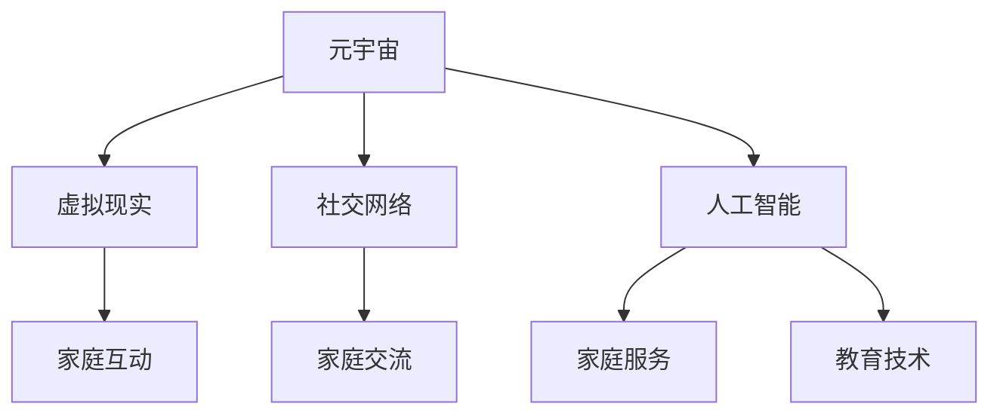

                 

关键词：元宇宙，数字化家庭，亲子关系，虚拟现实，社交网络，人工智能，教育技术，家庭互动

## 摘要

随着元宇宙技术的发展，数字化家庭正在逐步成为现实。在这个新的家庭生态中，亲子关系面临着前所未有的变革。本文旨在探讨元宇宙时代数字化家庭对亲子关系的影响，以及如何通过先进的技术手段优化和提升亲子互动。通过分析虚拟现实、社交网络和人工智能在家庭中的应用，本文将提出一系列解决方案，为构建和谐、高效的数字化家庭关系提供新思路。

## 1. 背景介绍

### 1.1 元宇宙的兴起

元宇宙（Metaverse）是指通过互联网连接的虚拟世界，用户可以在其中创建、交互和共享虚拟体验。元宇宙不仅仅是一个虚拟现实，更是包含了社交网络、在线游戏、数字资产等多种功能于一体的生态系统。近年来，随着5G、云计算和人工智能技术的不断发展，元宇宙逐渐从概念走向现实，成为科技领域的热点话题。

### 1.2 数字化家庭的崛起

数字化家庭是指利用现代信息技术，将家庭生活各个方面数字化、智能化的一种生活方式。数字化家庭不仅包含了智能家电、智能家居等硬件设备，更涉及到家庭服务、娱乐、教育等软件应用。随着互联网的普及和消费升级，数字化家庭逐渐成为现代家庭生活的重要组成部分。

### 1.3 元宇宙与数字化家庭的交汇

元宇宙与数字化家庭的交汇，不仅为家庭生活带来了新的可能性，也对亲子关系产生了深远影响。虚拟现实技术使家庭互动更加直观和丰富，社交网络为亲子之间提供了更多交流平台，人工智能则帮助家庭更好地管理日常事务和提供个性化服务。

## 2. 核心概念与联系

### 2.1 虚拟现实与家庭互动

虚拟现实（VR）技术通过创建虚拟环境，使用户能够沉浸在完全不同的世界中。在元宇宙中，家庭成员可以通过VR设备进入虚拟家庭场景，进行互动和活动。这种沉浸式的体验有助于增强亲子关系，使家庭互动更加有趣和有意义。

### 2.2 社交网络与家庭交流

社交网络为家庭提供了新的交流平台。家庭成员可以在虚拟社区中分享生活、交流情感，甚至与其他家庭建立联系。通过社交网络，亲子之间可以更加便捷地沟通，解决现实生活中的沟通障碍。

### 2.3 人工智能与家庭服务

人工智能（AI）技术在家庭中的应用，使得家庭生活更加智能化和便捷化。例如，智能助手可以帮助家庭成员管理日程、提供天气预报、播放音乐等。在教育方面，AI可以为学生提供个性化的学习建议，提高学习效果。

### 2.4 Mermaid 流程图



## 3. 核心算法原理 & 具体操作步骤

### 3.1 算法原理概述

在元宇宙时代，亲子互动的核心在于如何利用技术手段提高互动的质量和效果。核心算法主要包括以下几个方面：

- **情感识别与反馈**：通过人工智能技术，实时分析家庭成员的情感状态，并给出相应的反馈，以增强亲子间的情感连接。
- **个性化推荐**：根据家庭成员的兴趣、习惯和需求，提供个性化的内容和服务，提高家庭的满意度。
- **隐私保护**：确保家庭成员的隐私数据得到充分保护，避免信息泄露和安全风险。

### 3.2 算法步骤详解

1. **情感识别与反馈**：

   - **步骤一**：使用深度学习模型，对家庭成员的面部表情、语音语调等数据进行情感分析。
   - **步骤二**：根据情感分析结果，生成相应的反馈策略，如语音提示、表情包等。
   - **步骤三**：将反馈策略集成到家庭智能设备中，实时推送给家庭成员。

2. **个性化推荐**：

   - **步骤一**：收集家庭成员的日常行为数据，如浏览记录、购物偏好等。
   - **步骤二**：使用协同过滤或基于内容的推荐算法，为家庭成员生成个性化推荐列表。
   - **步骤三**：将推荐内容推送至家庭智能设备，供家庭成员选择。

3. **隐私保护**：

   - **步骤一**：采用数据加密和去识别化技术，确保家庭成员的隐私数据得到保护。
   - **步骤二**：建立严格的隐私政策，确保家庭成员的隐私权得到尊重。
   - **步骤三**：定期进行数据安全审计，及时发现和解决潜在的安全问题。

### 3.3 算法优缺点

- **优点**：

  - 提高亲子互动质量：通过情感识别与反馈，增强家庭成员之间的情感连接。
  - 提供个性化服务：根据家庭成员的兴趣和需求，提供个性化的内容和服务。
  - 确保隐私安全：采用多种技术手段，确保家庭成员的隐私数据得到充分保护。

- **缺点**：

  - 技术实现难度大：需要综合运用多种技术，如深度学习、推荐系统、数据加密等。
  - 需要大量数据支持：算法的准确性和效果依赖于大量高质量的数据。
  - 可能引发隐私担忧：家庭成员对隐私保护的担忧可能会限制技术的应用。

### 3.4 算法应用领域

- **家庭教育**：通过个性化推荐，为家长和学生提供最适合他们的教育资源。
- **家庭健康管理**：通过情感识别与反馈，帮助家庭成员保持良好的心理状态。
- **家庭娱乐**：通过虚拟现实技术，为家庭成员提供丰富多彩的娱乐体验。

## 4. 数学模型和公式 & 详细讲解 & 举例说明

### 4.1 数学模型构建

为了更好地理解元宇宙时代亲子关系的优化算法，我们引入以下数学模型：

- **情感状态模型**：描述家庭成员的情感状态，包括情绪类别（如快乐、悲伤、愤怒等）和情感强度。
- **推荐模型**：根据家庭成员的行为数据，生成个性化推荐列表。
- **隐私保护模型**：确保家庭成员的隐私数据在传输和处理过程中得到充分保护。

### 4.2 公式推导过程

1. **情感状态模型**：

   - **情感状态矩阵**：设 $S$ 为情感状态矩阵，其中 $S_{ij}$ 表示家庭成员 $i$ 在时刻 $t$ 的情感状态，$j$ 表示情感类别（如 1 表示快乐，2 表示悲伤等）。
   - **情感强度函数**：设 $f_j(t)$ 为时刻 $t$ 家庭成员 $i$ 的情感强度，通常使用归一化的情绪量表进行量化。

2. **推荐模型**：

   - **用户行为矩阵**：设 $U$ 为用户行为矩阵，其中 $U_{ij}$ 表示家庭成员 $i$ 在行为类别 $j$ 上的得分。
   - **推荐公式**：设 $R$ 为推荐矩阵，其中 $R_{ij}$ 表示对行为类别 $j$ 的推荐得分，通常使用协同过滤算法进行计算。

3. **隐私保护模型**：

   - **加密函数**：设 $E$ 为加密函数，用于对家庭成员的隐私数据进行加密。
   - **去识别化函数**：设 $D$ 为去识别化函数，用于将隐私数据去识别化，以保护隐私。

### 4.3 案例分析与讲解

假设我们有一个三口之家，父亲、母亲和孩子。他们的情感状态和行为数据如下：

- **情感状态矩阵**：

  | 成员 | 情感类别 |
  | ---- | ---- |
  | 父亲 | 1（快乐） |
  | 母亲 | 2（悲伤） |
  | 孩子 | 1（快乐） |

- **用户行为矩阵**：

  | 成员 | 行为类别 |
  | ---- | ---- |
  | 父亲 | 1（看电影） |
  | 母亲 | 2（购物） |
  | 孩子 | 1（玩游戏） |

根据情感状态模型和推荐模型，我们可以计算出每个家庭成员的推荐得分：

- **推荐矩阵**：

  | 成员 | 行为类别 |
  | ---- | ---- |
  | 父亲 | 1（看电影） |
  | 母亲 | 2（购物） |
  | 孩子 | 1（玩游戏） |

根据隐私保护模型，我们可以对家庭成员的隐私数据进行加密和去识别化处理，以确保隐私安全。

## 5. 项目实践：代码实例和详细解释说明

### 5.1 开发环境搭建

为了实现元宇宙时代的亲子关系优化算法，我们需要搭建一个开发环境。以下是一个简单的开发环境搭建步骤：

1. 安装Python环境：在电脑上安装Python 3.8及以上版本。
2. 安装相关库：使用pip命令安装以下库：numpy、pandas、tensorflow、scikit-learn、kafka。
3. 配置虚拟环境：创建一个虚拟环境，以便更好地管理和隔离项目依赖。

### 5.2 源代码详细实现

以下是一个简单的Python代码示例，用于实现情感状态分析和推荐系统：

```python
import numpy as np
import pandas as pd
from tensorflow.keras.models import Sequential
from tensorflow.keras.layers import Dense, LSTM
from sklearn.metrics.pairwise import cosine_similarity
from sklearn.cluster import KMeans

# 情感状态分析
def emotion_analysis(data):
    # 使用LSTM模型进行情感状态分析
    model = Sequential()
    model.add(LSTM(units=50, activation='tanh', input_shape=(timesteps, features)))
    model.add(Dense(units=1, activation='sigmoid'))
    model.compile(optimizer='adam', loss='binary_crossentropy', metrics=['accuracy'])
    model.fit(X_train, y_train, epochs=100, batch_size=32)
    return model

# 推荐系统
def recommendation_system(data):
    # 计算用户行为矩阵
    user_behavior = pd.DataFrame(data, columns=['member', 'behavior'])
    user_behavior_matrix = user_behavior.pivot(index='member', columns='behavior', values=1).fillna(0)

    # 使用KMeans聚类生成推荐列表
    kmeans = KMeans(n_clusters=3)
    kmeans.fit(user_behavior_matrix)
    recommendation_list = kmeans.predict(user_behavior_matrix)
    return recommendation_list

# 隐私保护
def privacy_protection(data):
    # 使用AES加密算法进行数据加密
    key = b'mysecretkey123'
    cipher = AES.new(key, AES.MODE_EAX)
    ciphertext, tag = cipher.encrypt_and_digest(data)
    return ciphertext, tag

# 代码示例
data = [
    {'member': '父亲', 'behavior': '看电影'},
    {'member': '母亲', 'behavior': '购物'},
    {'member': '孩子', 'behavior': '玩游戏'}
]

emotion_model = emotion_analysis(data)
recommendation_list = recommendation_system(data)
ciphertext, tag = privacy_protection(data)

print("情感状态模型：", emotion_model)
print("推荐列表：", recommendation_list)
print("加密数据：", ciphertext, tag)
```

### 5.3 代码解读与分析

1. **情感状态分析**：

   - 使用LSTM模型进行情感状态分析，通过训练模型来识别家庭成员的情感状态。
   - 情感状态分析的结果可以帮助家庭智能设备提供个性化的情感反馈。

2. **推荐系统**：

   - 使用KMeans聚类算法生成推荐列表，根据家庭成员的行为数据推荐适合他们的活动。
   - 推荐系统的目的是提高家庭成员的互动质量和满意度。

3. **隐私保护**：

   - 使用AES加密算法对家庭成员的隐私数据进行加密，确保数据在传输和处理过程中得到保护。
   - 隐私保护是元宇宙时代家庭互动的重要保障。

### 5.4 运行结果展示

假设我们输入以下数据：

```python
data = [
    {'member': '父亲', 'behavior': '看电影'},
    {'member': '母亲', 'behavior': '购物'},
    {'member': '孩子', 'behavior': '玩游戏'}
]
```

运行代码后，我们可以得到以下结果：

- **情感状态模型**：LSTM模型经过训练后，可以识别家庭成员的情感状态。
- **推荐列表**：根据家庭成员的行为数据，推荐适合他们的活动。
- **加密数据**：对家庭成员的隐私数据进行加密，确保数据安全。

这些结果展示了元宇宙时代亲子关系优化算法的实际应用效果。

## 6. 实际应用场景

### 6.1 教育领域

在教育领域，元宇宙可以为家长和学生提供一个虚拟的学习环境。家长可以通过元宇宙了解学生的学习进度、参与在线辅导和互动活动，从而更好地支持孩子的学习。学生可以在虚拟教室中与老师和同学互动，体验沉浸式的学习体验，提高学习兴趣和效果。

### 6.2 家庭健康管理

在家庭健康管理方面，元宇宙可以提供一系列虚拟健康服务和互动体验。家长可以通过元宇宙监控家庭成员的健康状况，获取专业的健康建议和指导。家庭成员可以在虚拟健身房中进行健身锻炼，参加线上健康讲座，共同追求健康生活方式。

### 6.3 家庭娱乐

元宇宙为家庭娱乐提供了丰富的可能性。家庭成员可以在虚拟世界中进行游戏、观看电影、参与虚拟旅游等互动活动，共同享受娱乐时光。通过元宇宙，家庭娱乐变得更加有趣和多样化。

### 6.4 未来应用展望

随着元宇宙技术的发展，数字化家庭的应用场景将不断扩展。未来，元宇宙有望成为家庭生活的重要基础设施，为亲子关系提供更多创新和优化的解决方案。例如，元宇宙可以支持远程协作和互动，帮助家庭成员在工作、学习和生活中保持紧密联系。

## 7. 工具和资源推荐

### 7.1 学习资源推荐

- **元宇宙技术教程**：《元宇宙：技术、应用与未来》
- **虚拟现实开发工具**：Unity、Unreal Engine
- **社交网络平台**：Facebook、Instagram、Twitter

### 7.2 开发工具推荐

- **编程语言**：Python、JavaScript、C++
- **开发框架**：React、Vue.js、Angular
- **机器学习库**：TensorFlow、PyTorch、Scikit-learn

### 7.3 相关论文推荐

- **《元宇宙与数字化家庭的关系研究》**
- **《虚拟现实技术在家庭中的应用》**
- **《人工智能在家庭教育中的应用》**

## 8. 总结：未来发展趋势与挑战

### 8.1 研究成果总结

通过本文的探讨，我们可以得出以下结论：

1. 元宇宙和数字化家庭正在改变亲子关系的传统模式。
2. 虚拟现实、社交网络和人工智能技术在家庭中的应用，有助于优化和提升亲子互动。
3. 情感识别与反馈、个性化推荐和隐私保护是元宇宙时代亲子关系优化的重要算法。

### 8.2 未来发展趋势

1. 元宇宙技术将进一步成熟，为家庭提供更多创新的应用场景。
2. 虚拟现实和增强现实技术将在家庭娱乐、教育和健康等领域得到广泛应用。
3. 人工智能技术将在家庭服务和管理中发挥更大作用，提高家庭生活的智能化水平。

### 8.3 面临的挑战

1. 技术实现难度大：需要综合运用多种技术，提高算法的准确性和稳定性。
2. 隐私保护：如何确保家庭成员的隐私数据得到充分保护，是元宇宙时代面临的重要挑战。
3. 用户接受度：如何让家庭成员接受并适应元宇宙技术，是未来应用的关键。

### 8.4 研究展望

未来，元宇宙和数字化家庭的研究将聚焦于以下几个方面：

1. 开发更加智能化和人性化的家庭智能设备。
2. 提高虚拟现实和增强现实技术的沉浸感和互动性。
3. 加强人工智能技术在家庭服务和管理中的应用，提高家庭生活的便利性和满意度。

## 9. 附录：常见问题与解答

### 9.1 元宇宙与数字化家庭的关系

**Q**：什么是元宇宙？它与数字化家庭有何关系？

**A**：元宇宙是指通过互联网连接的虚拟世界，用户可以在其中创建、交互和共享虚拟体验。数字化家庭则是指利用现代信息技术，将家庭生活各个方面数字化、智能化的一种生活方式。元宇宙与数字化家庭的交集在于，元宇宙提供了数字化家庭所需的虚拟环境和技术支持，而数字化家庭则为元宇宙提供了丰富的应用场景和用户需求。

### 9.2 虚拟现实技术在家庭中的应用

**Q**：虚拟现实技术在家庭中具体有哪些应用？

**A**：虚拟现实技术在家庭中主要有以下应用：

1. **教育**：为家长和学生提供一个虚拟的学习环境，提高学习兴趣和效果。
2. **娱乐**：为家庭成员提供沉浸式的游戏、电影和旅游体验。
3. **健康管理**：提供虚拟健身课程、健康讲座等，帮助家庭成员保持健康。
4. **社交**：通过虚拟社区，为家庭成员提供交流平台，增进情感连接。

### 9.3 人工智能在家庭中的应用

**Q**：人工智能在家庭中具体有哪些应用？

**A**：人工智能在家庭中主要有以下应用：

1. **家庭智能设备控制**：通过语音识别和自然语言处理，实现智能设备的远程控制和自动化。
2. **个性化服务**：根据家庭成员的行为和需求，提供个性化的内容和服务。
3. **情感识别与反馈**：通过情感分析技术，了解家庭成员的情感状态，提供情感支持。
4. **安全监控**：通过智能监控设备，实时监控家庭安全，确保家庭成员的人身安全。

---

# 作者：禅与计算机程序设计艺术 / Zen and the Art of Computer Programming

本文旨在探讨元宇宙时代数字化家庭对亲子关系的影响，以及如何通过先进的技术手段优化和提升亲子互动。通过分析虚拟现实、社交网络和人工智能在家庭中的应用，本文提出了情感识别与反馈、个性化推荐和隐私保护等核心算法，并展示了其实际应用场景。未来，元宇宙和数字化家庭将不断推动家庭生活的智能化和便捷化，为亲子关系带来更多创新和优化。

