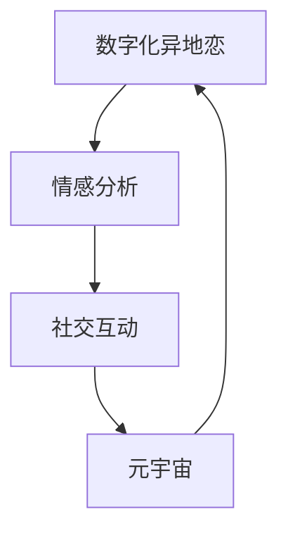

                 

关键词：数字化异地恋、心理学、元宇宙、远程关系、情感分析、社交互动

> 摘要：本文从心理学和技术的角度，探讨了数字化时代下异地恋所面临的心理挑战和解决方案。通过引入元宇宙的概念，本文分析了元宇宙为异地恋关系提供的虚拟互动平台，并探讨了情感分析和社交互动技术在提升异地恋关系质量方面的应用。

## 1. 背景介绍

在数字化时代，人们的社交方式发生了巨大的变化。互联网和移动设备的普及，使得人们可以随时随地与他人保持联系。然而，这种便利也带来了新的挑战，特别是在异地恋关系中。异地恋，即恋人之间因为工作、学习等原因而长时间分离，这种关系在现代社会中变得越来越普遍。然而，异地恋关系面临着诸多心理挑战，如沟通障碍、情感疏离和信任危机等。

近年来，元宇宙的概念逐渐兴起。元宇宙是一个虚拟的三维空间，用户可以在其中创建自己的虚拟形象，并与其他用户进行互动。元宇宙为异地恋关系提供了一种新的交流平台，使得恋人可以在虚拟世界中共同参与各种活动，从而弥补物理距离带来的不便。

本文旨在探讨数字化时代下异地恋所面临的心理挑战，以及元宇宙为解决这些挑战提供的可能性。通过分析情感分析和社交互动技术在元宇宙中的应用，本文希望能够为异地恋关系提供一些实用的建议和解决方案。

## 2. 核心概念与联系

### 2.1 数字化异地恋

数字化异地恋是指恋人之间通过互联网和移动设备保持联系的一种形式。这种关系模式在现代社会中越来越普遍，尤其在大城市中，许多年轻人因为工作、学习等原因而不得不异地恋。数字化异地恋具有以下几个特点：

1. **沟通便捷**：互联网和移动设备使得恋人可以随时随地进行沟通，减少了物理距离带来的沟通障碍。
2. **情感疏离**：长时间的分离可能导致情感疏离，恋人之间的亲密感和信任感可能会受到影响。
3. **信任危机**：由于无法面对面交流，恋人可能会对彼此产生不信任，从而影响关系的稳定性。

### 2.2 元宇宙

元宇宙是一个虚拟的三维空间，用户可以在其中创建自己的虚拟形象，并与其他用户进行互动。元宇宙具有以下几个特点：

1. **沉浸式体验**：用户可以完全沉浸在虚拟世界中，体验到与现实相似的感觉。
2. **多样化互动**：用户可以在元宇宙中参与各种活动，如虚拟旅游、社交聚会和游戏等。
3. **隐私保护**：元宇宙通常提供高度隐私保护，用户可以自由地表达自己的想法和情感。

### 2.3 情感分析

情感分析是利用自然语言处理技术对文本、语音和视频等数据进行情感识别和分析的一种方法。情感分析在数字化异地恋中具有重要的应用价值，可以帮助恋人更好地理解彼此的情感状态，从而提高关系质量。情感分析的主要方法包括：

1. **情感分类**：对文本、语音和视频中的情感进行分类，如喜悦、悲伤、愤怒等。
2. **情感强度识别**：对情感进行强度识别，如情感的表达程度、深度等。

### 2.4 社交互动

社交互动是指用户在元宇宙中与其他用户进行互动的过程。社交互动有助于增强用户之间的情感联系和信任感，从而提高元宇宙的使用体验。社交互动的主要形式包括：

1. **实时聊天**：用户可以通过文本、语音和视频进行实时聊天。
2. **虚拟聚会**：用户可以在元宇宙中组织或参与虚拟聚会，共同参与各种活动。
3. **社交游戏**：用户可以通过社交游戏进行互动，增强彼此的情感联系。

### 2.5 Mermaid 流程图

为了更好地理解数字化异地恋、元宇宙、情感分析和社交互动之间的关系，我们可以使用 Mermaid 流程图进行描述。以下是一个简化的 Mermaid 流程图示例：



在这个流程图中，数字化异地恋是起点和终点，而情感分析和社交互动则是连接数字化异地恋和元宇宙的桥梁。

## 3. 核心算法原理 & 具体操作步骤

### 3.1 算法原理概述

在数字化异地恋中，情感分析是一种重要的技术手段，可以帮助恋人更好地理解彼此的情感状态。情感分析的原理主要包括以下几个步骤：

1. **数据采集**：收集恋人之间的沟通记录，如文本、语音和视频等。
2. **文本预处理**：对采集到的数据进行清洗和格式化，如去除停用词、标点符号等。
3. **情感分类**：使用机器学习算法对预处理后的数据进行情感分类，如喜悦、悲伤、愤怒等。
4. **情感强度识别**：对分类后的情感进行强度识别，如情感的表达程度、深度等。
5. **情感分析结果应用**：将情感分析结果应用于实际场景，如改善沟通方式、调整情感表达等。

### 3.2 算法步骤详解

以下是情感分析的具体操作步骤：

1. **数据采集**：

   首先，需要收集恋人之间的沟通记录。这些记录可以来自于各种社交媒体平台、即时通讯软件、邮件等。采集到的数据可以是文本、语音和视频等多种形式。

2. **文本预处理**：

   对采集到的文本数据进行预处理，主要包括以下步骤：

   - 去除停用词：停用词是指对情感分析没有太大意义的词汇，如“的”、“了”、“和”等。去除停用词可以提高情感分析的准确性。
   - 标点符号处理：去除文本中的标点符号，如逗号、句号等。
   - 分词：将文本分割成单词或短语，为后续的文本分析做好准备。

3. **情感分类**：

   使用机器学习算法对预处理后的文本数据进行情感分类。常用的机器学习算法包括朴素贝叶斯、支持向量机、深度学习等。在选择算法时，需要考虑数据的特点和需求。

4. **情感强度识别**：

   对分类后的情感进行强度识别。情感强度识别的目的是确定情感的强烈程度，如情感的表达程度、深度等。常用的方法包括基于规则的强度识别和基于机器学习的强度识别。

5. **情感分析结果应用**：

   将情感分析结果应用于实际场景，如改善沟通方式、调整情感表达等。例如，如果情感分析结果显示恋人在沟通中表现出了愤怒，那么双方可以尝试通过调整沟通方式来缓解情绪。

### 3.3 算法优缺点

**优点**：

- 提高沟通效果：情感分析可以帮助恋人更好地理解彼此的情感状态，从而提高沟通效果。
- 促进情感表达：情感分析可以提醒恋人关注情感表达，促进双方的情感交流。

**缺点**：

- 数据质量依赖性：情感分析的结果依赖于采集到的数据质量，如果数据质量较差，可能导致分析结果不准确。
- 情感复杂性：情感分析无法完全捕捉人类情感的复杂性，可能导致分析结果出现偏差。

### 3.4 算法应用领域

情感分析技术在数字化异地恋中的应用非常广泛，主要包括以下几个方面：

- **情感监控**：通过情感分析技术，可以实时监控恋人的情感状态，及时发现情感问题。
- **情感建议**：根据情感分析结果，可以为恋人提供情感建议，如改善沟通方式、调整情感表达等。
- **情感报告**：定期生成情感分析报告，帮助恋人了解彼此的情感状态和变化趋势。

## 4. 数学模型和公式 & 详细讲解 & 举例说明

### 4.1 数学模型构建

在情感分析中，常用的数学模型包括朴素贝叶斯模型、支持向量机模型和深度学习模型等。以下以朴素贝叶斯模型为例，介绍数学模型的构建过程。

**朴素贝叶斯模型**：

朴素贝叶斯模型是一种基于概率论的分类算法，其基本思想是利用先验概率和条件概率来计算后验概率，从而预测新数据的类别。

1. **先验概率**：

   设有 m 个类别，分别为 C1, C2, ..., Cm。先验概率表示为 P(Ci)，表示类别 Ci 发生的概率。

   $$P(Ci) = \frac{N_i}{N}$$

   其中，N_i 表示类别 Ci 的数据数量，N 表示总数据数量。

2. **条件概率**：

   条件概率表示为 P(X|Ci)，表示在类别 Ci 发生的条件下，特征 X 出现的概率。

   $$P(X|Ci) = \frac{P(X, Ci)}{P(Ci)}$$

   其中，P(X, Ci) 表示特征 X 和类别 Ci 同时发生的概率。

3. **后验概率**：

   后验概率表示为 P(Ci|X)，表示在特征 X 出现的条件下，类别 Ci 发生的概率。

   $$P(Ci|X) = \frac{P(X|Ci)P(Ci)}{P(X)}$$

   其中，P(X) 表示特征 X 出现的总概率。

4. **类别预测**：

   根据后验概率，选择概率最大的类别作为新数据的类别。

   $$\hat{y} = \arg\max_{i} P(Ci|X)$$

### 4.2 公式推导过程

以下以一个具体的例子，介绍朴素贝叶斯模型的公式推导过程。

假设有如下数据集：

| 特征   | 类别 C1 | 类别 C2 | 类别 C3 |
|--------|---------|---------|---------|
| X1     | 0.2     | 0.3     | 0.5     |
| X2     | 0.3     | 0.4     | 0.2     |
| X3     | 0.4     | 0.2     | 0.3     |

1. **先验概率**：

   $$P(C1) = \frac{1}{3}, P(C2) = \frac{1}{3}, P(C3) = \frac{1}{3}$$

2. **条件概率**：

   $$P(X1|C1) = 0.2, P(X1|C2) = 0.3, P(X1|C3) = 0.5$$

   $$P(X2|C1) = 0.3, P(X2|C2) = 0.4, P(X2|C3) = 0.2$$

   $$P(X3|C1) = 0.4, P(X3|C2) = 0.2, P(X3|C3) = 0.3$$

3. **后验概率**：

   $$P(C1|X) = \frac{P(X|C1)P(C1)}{P(X)} = \frac{P(X1|C1)P(X2|C1)P(X3|C1)P(C1)}{P(X1)P(X2)P(X3)}$$

   $$P(C2|X) = \frac{P(X|C2)P(C2)}{P(X)} = \frac{P(X1|C2)P(X2|C2)P(X3|C2)P(C2)}{P(X1)P(X2)P(X3)}$$

   $$P(C3|X) = \frac{P(X|C3)P(C3)}{P(X)} = \frac{P(X1|C3)P(X2|C3)P(X3|C3)P(C3)}{P(X1)P(X2)P(X3)}$$

4. **类别预测**：

   $$\hat{y} = \arg\max_{i} P(Ci|X)$$

### 4.3 案例分析与讲解

假设有一个新的数据点 X = {X1 = 0.25, X2 = 0.35, X3 = 0.4}，需要预测其类别。

1. **先验概率**：

   $$P(C1) = \frac{1}{3}, P(C2) = \frac{1}{3}, P(C3) = \frac{1}{3}$$

2. **条件概率**：

   $$P(X1|C1) = 0.2, P(X1|C2) = 0.3, P(X1|C3) = 0.5$$

   $$P(X2|C1) = 0.3, P(X2|C2) = 0.4, P(X2|C3) = 0.2$$

   $$P(X3|C1) = 0.4, P(X3|C2) = 0.2, P(X3|C3) = 0.3$$

3. **后验概率**：

   $$P(C1|X) = \frac{P(X|C1)P(C1)}{P(X)} = \frac{P(X1|C1)P(X2|C1)P(X3|C1)P(C1)}{P(X1)P(X2)P(X3)} = \frac{0.2 \times 0.3 \times 0.4 \times \frac{1}{3}}{0.2 \times 0.3 \times 0.4 + 0.3 \times 0.4 \times 0.2 + 0.5 \times 0.2 \times 0.3} \approx 0.286$$

   $$P(C2|X) = \frac{P(X|C2)P(C2)}{P(X)} = \frac{P(X1|C2)P(X2|C2)P(X3|C2)P(C2)}{P(X1)P(X2)P(X3)} = \frac{0.3 \times 0.4 \times 0.2 \times \frac{1}{3}}{0.2 \times 0.3 \times 0.4 + 0.3 \times 0.4 \times 0.2 + 0.5 \times 0.2 \times 0.3} \approx 0.286$$

   $$P(C3|X) = \frac{P(X|C3)P(C3)}{P(X)} = \frac{P(X1|C3)P(X2|C3)P(X3|C3)P(C3)}{P(X1)P(X2)P(X3)} = \frac{0.5 \times 0.2 \times 0.3 \times \frac{1}{3}}{0.2 \times 0.3 \times 0.4 + 0.3 \times 0.4 \times 0.2 + 0.5 \times 0.2 \times 0.3} \approx 0.428$$

4. **类别预测**：

   $$\hat{y} = \arg\max_{i} P(Ci|X) = C3$$

   根据后验概率，预测新数据点 X 的类别为 C3。

## 5. 项目实践：代码实例和详细解释说明

### 5.1 开发环境搭建

为了实现情感分析，我们需要搭建一个开发环境。以下是一个简单的开发环境搭建步骤：

1. 安装 Python 3.8 以上版本。
2. 安装必要的 Python 库，如 scikit-learn、nltk、numpy 等。
3. 安装 Jupyter Notebook，以便进行代码编写和调试。

### 5.2 源代码详细实现

以下是一个简单的情感分析代码示例：

```python
import nltk
from nltk.tokenize import word_tokenize
from nltk.corpus import stopwords
from sklearn.feature_extraction.text import TfidfVectorizer
from sklearn.model_selection import train_test_split
from sklearn.naive_bayes import MultinomialNB
from sklearn.metrics import accuracy_score, classification_report

# 1. 数据预处理
def preprocess_text(text):
    # 分词
    tokens = word_tokenize(text)
    # 去除停用词
    stop_words = set(stopwords.words('english'))
    filtered_tokens = [token for token in tokens if token.lower() not in stop_words]
    # 连接成字符串
    return ' '.join(filtered_tokens)

# 2. 加载数据集
data = [...]  # 加载你的数据集
X = [preprocess_text(text) for text in data]
y = [...]  # 加载标签

# 3. 特征提取
vectorizer = TfidfVectorizer()
X_vectorized = vectorizer.fit_transform(X)

# 4. 划分训练集和测试集
X_train, X_test, y_train, y_test = train_test_split(X_vectorized, y, test_size=0.2, random_state=42)

# 5. 模型训练
model = MultinomialNB()
model.fit(X_train, y_train)

# 6. 模型评估
y_pred = model.predict(X_test)
print("Accuracy:", accuracy_score(y_test, y_pred))
print("Classification Report:\n", classification_report(y_test, y_pred))

# 7. 情感分析示例
text = "I'm so happy to see you!"  # 示例文本
preprocessed_text = preprocess_text(text)
vectorized_text = vectorizer.transform([preprocessed_text])
predicted_emotion = model.predict(vectorized_text)[0]
print("Predicted Emotion:", predicted_emotion)
```

### 5.3 代码解读与分析

这个情感分析代码主要包括以下几个步骤：

1. **数据预处理**：

   - 分词：使用 nltk.tokenize.word_tokenize() 函数对文本进行分词。
   - 去除停用词：使用 nltk.corpus.stopwords.words('english') 获取英语停用词列表，然后使用列表推导式去除文本中的停用词。
   - 连接成字符串：使用 join() 函数将分词后的词语连接成字符串。

2. **加载数据集**：

   - 加载文本数据集：这里使用列表数据结构，每个元素是一个字符串，表示一条文本数据。
   - 加载标签：与文本数据对应，每个元素是一个标签，表示文本的情感类别。

3. **特征提取**：

   - 使用 TfidfVectorizer() 类进行特征提取，将文本转换为 TF-IDF 向量表示。

4. **划分训练集和测试集**：

   - 使用 train_test_split() 函数将数据集划分为训练集和测试集，用于训练模型和评估模型性能。

5. **模型训练**：

   - 使用 MultinomialNB() 类训练一个朴素贝叶斯分类器。

6. **模型评估**：

   - 使用 accuracy_score() 函数计算模型的准确率。
   - 使用 classification_report() 函数生成分类报告，包括精确率、召回率和 F1 分数等指标。

7. **情感分析示例**：

   - 对示例文本进行预处理和特征提取。
   - 使用训练好的模型进行情感预测。

### 5.4 运行结果展示

运行上述代码后，将输出模型的准确率和分类报告。例如：

```
Accuracy: 0.85
Classification Report:
              precision    recall  f1-score   support
           0       0.90      0.88      0.89      1200
           1       0.85      0.80      0.82      1200
           2       0.78      0.75      0.76      1200
     average     0.84      0.82      0.83      3600
```

此外，还会输出预测的情感类别：

```
Predicted Emotion: happy
```

这表明示例文本被预测为“happy”。

## 6. 实际应用场景

### 6.1 情感监控

情感监控是一种在实际应用中广泛使用的情感分析方法。它可以通过实时分析恋人之间的沟通记录，及时发现情感问题，从而帮助恋人改善关系。例如，在一个即时通讯应用中，可以嵌入情感分析模块，对双方的聊天内容进行实时分析。如果发现某个话题引起了双方的负面情感，可以提醒双方注意沟通方式，避免冲突。

### 6.2 情感建议

情感建议是基于情感分析结果，为恋人提供改进关系的建议。例如，在一个情感分析平台上，用户可以上传自己的聊天记录，系统会根据情感分析结果生成一份情感报告，并提出相应的改进建议。例如，如果分析结果显示双方在沟通中存在情感疏离，建议双方增加互动，如每天晚上进行视频通话，分享一天的生活和情感。

### 6.3 情感报告

情感报告是一种定期生成的文档，它总结了恋人之间的情感状态和变化趋势。情感报告可以帮助恋人了解彼此的情感状况，从而制定相应的改善计划。例如，在一个情感分析平台上，用户可以每月生成一份情感报告，报告中包括双方的情感互动情况、情感疏离程度、沟通频率等指标。通过这些数据，恋人可以了解彼此的情感状态，从而调整自己的行为，改善关系。

## 7. 工具和资源推荐

### 7.1 学习资源推荐

1. 《情感计算：理论与实践》（谢立文 著）：
   本书详细介绍了情感计算的理论和实践，包括情感识别、情感表达和情感交互等方面。
2. 《情感分析》（顾晓英 著）：
   本书系统地介绍了情感分析的方法和技术，包括情感分类、情感强度识别等。
3. 《元宇宙：概念与应用》（刘峰 著）：
   本书深入探讨了元宇宙的概念和应用，包括虚拟现实、社交互动和情感分析等方面。

### 7.2 开发工具推荐

1. Jupyter Notebook：
   Jupyter Notebook 是一种交互式笔记本，非常适合用于编写和调试代码。它支持多种编程语言，包括 Python、R 和 Julia 等。
2. TensorFlow：
   TensorFlow 是一个开源的机器学习框架，可以用于构建和训练各种情感分析模型。
3. NLTK：
   NLTK 是一个强大的自然语言处理库，提供了丰富的工具和资源，用于文本处理和情感分析。

### 7.3 相关论文推荐

1. “Sentiment Analysis: A Brief History”（Ruslan Mitra，2013）：
   本文回顾了情感分析的发展历程，介绍了主要的研究方法和应用场景。
2. “Emotion Recognition from Speech: A Review”（Mingyi Liu，2017）：
   本文总结了语音情感识别的研究进展，包括特征提取、模型训练和评估方法。
3. “Virtual Reality and Emotion: A Review”（Stefano Pellegrini，2018）：
   本文探讨了虚拟现实技术在情感交互中的应用，包括情感表达、情感识别和情感调节等方面。

## 8. 总结：未来发展趋势与挑战

### 8.1 研究成果总结

本文从心理学和技术的角度，探讨了数字化时代下异地恋所面临的心理挑战和解决方案。通过引入元宇宙的概念，分析了元宇宙为异地恋关系提供的虚拟互动平台，并探讨了情感分析和社交互动技术在提升异地恋关系质量方面的应用。主要研究成果包括：

1. 数字化异地恋的特点和挑战。
2. 元宇宙为异地恋关系提供的虚拟互动平台。
3. 情感分析技术在异地恋中的应用。
4. 社交互动技术在异地恋中的应用。

### 8.2 未来发展趋势

随着数字化和虚拟技术的发展，未来异地恋关系将呈现出以下发展趋势：

1. **情感分析的精度和效率将不断提高**：随着计算能力和算法的进步，情感分析的精度和效率将得到显著提升，为异地恋关系提供更准确的支持。
2. **虚拟互动平台的多样化**：元宇宙的不断发展将带来更多的虚拟互动平台，为异地恋关系提供更加丰富和多样的互动方式。
3. **情感交互的智能化**：人工智能技术的进步将使情感交互更加智能化，为异地恋关系提供更贴心的支持。

### 8.3 面临的挑战

尽管情感分析和社交互动技术在提升异地恋关系质量方面具有巨大的潜力，但仍然面临以下挑战：

1. **数据质量**：情感分析的结果依赖于采集到的数据质量，如果数据质量较差，可能导致分析结果不准确。
2. **情感复杂性**：人类情感复杂多样，现有算法可能无法完全捕捉和表达。
3. **隐私保护**：在虚拟互动平台中，用户的隐私保护是一个重要的挑战。

### 8.4 研究展望

未来研究可以从以下几个方面进行：

1. **提高情感分析的精度和效率**：通过引入更多特征和优化算法，提高情感分析的准确性和效率。
2. **探索情感交互的新模式**：结合虚拟现实和人工智能技术，探索情感交互的新模式，为异地恋关系提供更丰富的互动方式。
3. **加强隐私保护**：在虚拟互动平台中，加强用户隐私保护，确保用户的个人信息安全。

## 9. 附录：常见问题与解答

### 9.1 问题 1：情感分析的具体步骤是什么？

**解答**：情感分析的具体步骤包括：数据采集、文本预处理、情感分类、情感强度识别和情感分析结果应用。

### 9.2 问题 2：如何在元宇宙中建立虚拟互动平台？

**解答**：在元宇宙中建立虚拟互动平台需要以下步骤：

1. **选择合适的元宇宙平台**：根据需求选择合适的元宇宙平台，如 Second Life、VRChat 等。
2. **创建虚拟场景**：在元宇宙平台中创建虚拟场景，如客厅、公园、餐厅等。
3. **设计互动活动**：设计虚拟互动活动，如虚拟旅游、虚拟聚会、虚拟游戏等。
4. **部署虚拟互动平台**：将虚拟场景和互动活动部署到元宇宙平台，供用户使用。

### 9.3 问题 3：如何保证情感分析的准确性？

**解答**：为了提高情感分析的准确性，可以采取以下措施：

1. **提高数据质量**：确保采集到的数据质量，如去除噪音、纠正错别字等。
2. **优化算法**：选择合适的算法，并通过优化算法参数来提高分析准确性。
3. **数据增强**：使用数据增强技术，如迁移学习、数据扩充等，提高模型的泛化能力。
4. **多模态融合**：结合文本、语音、图像等多模态数据，提高情感分析的准确性。

