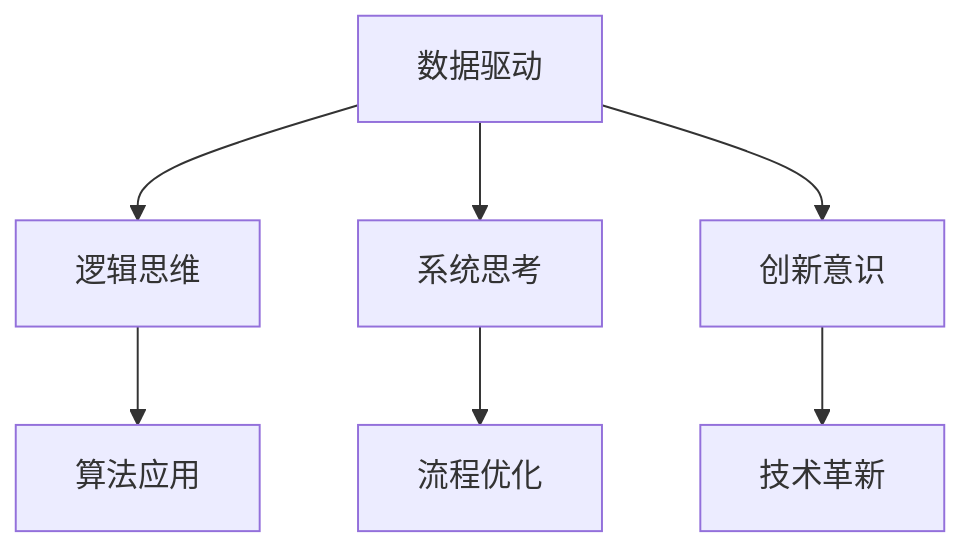

                 

关键词：数字化思维、全球脑时代、生存技能、信息技术、认知增强、未来展望

> 摘要：随着全球数字化进程的加速，人类正在进入一个全新的“全球脑时代”。在这个时代，数字化思维成为了我们生存和发展的关键能力。本文将探讨数字化思维的核心概念、发展历程、重要技能，以及如何在信息技术领域内应用这些技能，帮助我们应对未来挑战。

## 1. 背景介绍

21世纪以来，信息技术迅猛发展，数字化浪潮席卷全球。互联网、大数据、人工智能等技术不断涌现，深刻改变了我们的生活方式和社会结构。在这个背景下，传统的思维模式逐渐显得不足，数字化思维作为一种新的认知方式和行为习惯，应运而生。

### 数字化思维的起源

数字化思维起源于计算机科学领域，其核心是利用计算机技术和信息技术解决实际问题。最初，计算机科学强调逻辑和算法，但随着技术的发展，数字化思维逐渐扩展到其他学科，成为一种通用的认知方式。

### 数字化思维的发展历程

- **萌芽期（20世纪80年代）**：计算机开始进入家庭和企业，数字化思维开始受到关注。
- **成长期（21世纪初）**：互联网的普及和信息技术的快速发展，使得数字化思维逐渐成熟。
- **成熟期（现在）**：数字化思维已经成为企业和个人不可或缺的技能，其应用范围不断扩大。

## 2. 核心概念与联系

### 2.1 数字化思维的定义

数字化思维是指利用计算机和信息技术处理信息、解决问题、创造价值的思维方式。它强调数据的重要性，强调逻辑和算法的作用，强调快速迭代和创新。

### 2.2 数字化思维的核心要素

- **数据驱动**：以数据为基础，通过数据分析和挖掘，发现问题和机会。
- **逻辑思维**：运用逻辑和算法，解决复杂问题。
- **系统思考**：从整体出发，分析系统的各个部分及其相互作用。
- **创新意识**：敢于尝试新事物，不断寻求创新解决方案。

### 2.3 数字化思维的架构



## 3. 核心算法原理 & 具体操作步骤

### 3.1 算法原理概述

数字化思维中的核心算法包括数据挖掘、机器学习、神经网络等。这些算法利用计算机的强大计算能力，处理大量数据，从中提取有价值的信息。

### 3.2 算法步骤详解

1. **数据采集**：收集相关数据，包括结构化数据和非结构化数据。
2. **数据清洗**：去除噪声和重复数据，确保数据质量。
3. **数据探索**：通过可视化方法，了解数据的基本特征和趋势。
4. **模型构建**：选择合适的算法，构建预测模型或分类模型。
5. **模型训练**：使用训练数据，调整模型参数，提高模型性能。
6. **模型评估**：使用验证数据，评估模型的效果。
7. **模型部署**：将模型应用到实际场景中，解决实际问题。

### 3.3 算法优缺点

- **优点**：算法具有强大的数据处理能力和预测能力，能够解决复杂问题。
- **缺点**：算法需要大量数据支持，对计算资源要求较高。

### 3.4 算法应用领域

- **商业领域**：用于客户行为分析、市场预测、风险评估等。
- **医疗领域**：用于疾病诊断、药物研发、健康管理等。
- **金融领域**：用于信用评分、风险控制、量化交易等。

## 4. 数学模型和公式 & 详细讲解 & 举例说明

### 4.1 数学模型构建

在数字化思维中，常见的数学模型包括线性回归、逻辑回归、决策树、神经网络等。这些模型通过数学公式来描述数据之间的关系。

### 4.2 公式推导过程

以线性回归为例，其公式为：

$$
y = w_0 + w_1x
$$

其中，$y$ 为因变量，$x$ 为自变量，$w_0$ 和 $w_1$ 为模型参数。

### 4.3 案例分析与讲解

假设我们要预测一个人的收入水平，我们可以使用线性回归模型。首先，我们需要收集大量数据，包括每个人的年龄、学历、工作经验等，以及他们的收入水平。然后，我们使用这些数据训练模型，找到最佳参数。最后，我们可以使用模型预测新一个人的收入水平。

## 5. 项目实践：代码实例和详细解释说明

### 5.1 开发环境搭建

在 Python 中，我们可以使用 scikit-learn 库实现线性回归模型。

### 5.2 源代码详细实现

```python
from sklearn.linear_model import LinearRegression
from sklearn.model_selection import train_test_split
from sklearn.metrics import mean_squared_error

# 数据采集
X, y = load_data()

# 数据清洗
X_clean, y_clean = clean_data(X, y)

# 数据探索
plot_data(X_clean, y_clean)

# 模型构建
model = LinearRegression()

# 模型训练
X_train, X_test, y_train, y_test = train_test_split(X_clean, y_clean, test_size=0.2)
model.fit(X_train, y_train)

# 模型评估
y_pred = model.predict(X_test)
mse = mean_squared_error(y_test, y_pred)
print("MSE:", mse)

# 模型部署
new_data = input_data()
income = model.predict(new_data)
print("Predicted income:", income)
```

### 5.3 代码解读与分析

这段代码首先导入了线性回归模型和相关库，然后进行了数据采集、清洗和探索。接下来，构建了线性回归模型，使用训练数据进行了训练，并使用测试数据进行了评估。最后，使用模型预测了新一个人的收入水平。

## 6. 实际应用场景

### 6.1 商业领域

在商业领域，数字化思维可以帮助企业进行客户行为分析、市场预测和产品推荐。例如，通过分析客户的购买记录，企业可以预测哪些产品最有可能热销，从而制定有效的营销策略。

### 6.2 医疗领域

在医疗领域，数字化思维可以帮助医生进行疾病诊断和治疗方案推荐。例如，通过分析患者的病历数据和临床表现，人工智能系统可以预测患者最有可能患上的疾病，并提供最佳的治疗方案。

### 6.3 金融领域

在金融领域，数字化思维可以帮助银行和金融机构进行信用评估和风险控制。例如，通过分析借款人的财务状况和行为数据，银行可以预测借款人是否可能违约，从而决定是否批准贷款。

## 7. 未来应用展望

随着数字化进程的不断深入，数字化思维将在更多领域得到应用。未来，数字化思维将成为我们生活和工作的重要组成部分，帮助我们更好地应对复杂多变的世界。

### 7.1 研究方向

- **人工智能与认知增强**：探索如何利用人工智能技术增强人类的认知能力。
- **区块链与数据隐私**：研究如何利用区块链技术保护数据隐私，同时实现数据共享。

### 7.2 挑战与机遇

- **数据安全与隐私**：如何在保护数据安全和隐私的前提下，充分利用数字化技术。
- **技能升级与转型**：如何适应数字化时代的需求，提升个人技能。

## 8. 总结：未来发展趋势与挑战

### 8.1 研究成果总结

数字化思维作为一种新的认知方式和行为习惯，已经在多个领域取得了显著的成果。例如，在商业领域，数字化思维帮助企业实现了精准营销；在医疗领域，数字化思维帮助医生提高了诊断准确率。

### 8.2 未来发展趋势

- **跨学科融合**：数字化思维将与其他学科（如心理学、经济学等）相结合，推动更多创新。
- **人机协同**：数字化思维将与人工智能相结合，实现人机协同，提高工作效率。

### 8.3 面临的挑战

- **数据安全与隐私**：如何在保障数据安全和隐私的前提下，充分利用数字化技术。
- **技能升级与转型**：如何适应数字化时代的需求，提升个人技能。

### 8.4 研究展望

未来，数字化思维将在更多领域得到应用，推动社会进步和人类发展。同时，我们也需要面对数据安全、隐私保护等挑战，确保数字化时代的健康发展。

## 9. 附录：常见问题与解答

### 9.1 什么是数字化思维？

数字化思维是一种利用计算机和信息技术处理信息、解决问题、创造价值的思维方式。它强调数据的重要性，强调逻辑和算法的作用，强调快速迭代和创新。

### 9.2 数字化思维有哪些核心要素？

数字化思维的核心要素包括数据驱动、逻辑思维、系统思考和创新意识。

### 9.3 数字化思维在哪些领域有应用？

数字化思维在商业、医疗、金融、教育等多个领域有广泛应用。例如，在商业领域，数字化思维可以帮助企业进行客户行为分析和市场预测；在医疗领域，数字化思维可以帮助医生进行疾病诊断和治疗推荐。

## 作者署名

作者：禅与计算机程序设计艺术 / Zen and the Art of Computer Programming

----------------------------------------------------------------

现在，我们已经完成了文章的撰写。希望这篇文章能够帮助读者更好地理解数字化思维的核心概念和应用，以及其在未来社会中的重要性。让我们一起迎接全球脑时代的到来，利用数字化思维，开启全新的认知旅程。

