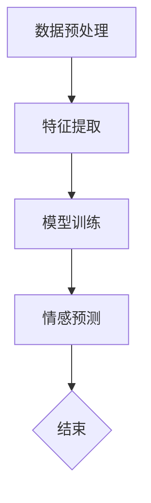

                 

关键词：数字化情感分析、AI、社交洞察、情感识别、自然语言处理、商业模式

摘要：随着人工智能技术的飞速发展，数字化情感分析成为了企业理解和应对市场需求的利器。本文将探讨如何利用AI技术进行数字化情感分析，并剖析其在创业中的应用潜力，为创业者提供一套切实可行的策略。

## 1. 背景介绍

随着互联网的普及，社交媒体、在线评论、博客等平台上的数据量呈现出爆炸式增长。这些数据中蕴含了大量的用户情感信息，成为企业了解市场需求、优化产品和服务的重要资源。然而，如何从海量的文本数据中快速准确地提取情感信息，一直是业界面临的挑战。数字化情感分析技术的出现，为这一问题提供了解决方案。

数字化情感分析是指利用自然语言处理（NLP）和机器学习技术，对文本数据进行情感倾向判断、情感强度评估和情感分类等分析。这项技术的核心在于将自然语言文本转化为计算机可以理解和处理的结构化数据，进而进行情感分析和解读。

近年来，随着深度学习、神经网络等AI技术的突破，数字化情感分析技术得到了快速发展。通过大规模数据训练，模型能够从海量数据中学习到情感表达的规律，从而实现对复杂情感的理解和识别。这使得数字化情感分析在多个领域得到了广泛应用，包括市场调研、品牌监测、客户服务、舆情分析等。

## 2. 核心概念与联系

### 2.1 情感识别

情感识别是数字化情感分析的核心任务之一。它旨在从文本数据中提取出用户的情感状态，包括正面、负面和中性情感。情感识别通常涉及以下步骤：

1. **数据预处理**：包括文本清洗、分词、去除停用词等操作，以提高模型的准确性和效率。
2. **特征提取**：将预处理后的文本转化为特征向量，常用的方法包括词袋模型、TF-IDF、Word2Vec等。
3. **模型训练**：使用大规模标注数据集训练情感识别模型，常见的算法有支持向量机（SVM）、朴素贝叶斯（NB）、决策树（DT）等。
4. **情感预测**：使用训练好的模型对新的文本数据进行分析，预测其情感倾向。

### 2.2 情感强度评估

情感强度评估是对情感识别结果的进一步细化，旨在量化用户情感的程度。常见的情感强度评估方法包括：

1. **情感极性分析**：将情感分为正面、负面和中性三大类，并对每类情感进行强度量化。
2. **情感倾向度计算**：通过计算文本中正面和负面情感的权重，得出整体情感倾向度。
3. **情感强度分类**：将情感强度分为多个等级，如强正面、中正面、弱正面等。

### 2.3 情感分类

情感分类是对文本数据中的情感进行分类，常见的分类方法包括：

1. **情感标签分类**：将情感分为预设的多个类别，如高兴、愤怒、悲伤等。
2. **情感情感层次分类**：将情感分为更细致的层次，如高兴、兴奋、愉悦等。

### 2.4 Mermaid 流程图

下面是一个用于情感识别的 Mermaid 流程图示例：



## 3. 核心算法原理 & 具体操作步骤

### 3.1 算法原理概述

数字化情感分析的核心算法主要包括情感识别、情感强度评估和情感分类。以下分别介绍这三种算法的原理。

#### 3.1.1 情感识别

情感识别基于机器学习算法，通过学习大量标注数据来识别文本中的情感。常用的算法包括：

1. **朴素贝叶斯（NB）**：基于贝叶斯定理和特征条件独立性假设，适用于简单情感分类问题。
2. **支持向量机（SVM）**：通过寻找最佳分割超平面，实现多类情感分类，适用于复杂情感分类问题。
3. **深度学习（DL）**：通过神经网络模型，如卷积神经网络（CNN）和递归神经网络（RNN），实现高级情感识别。

#### 3.1.2 情感强度评估

情感强度评估通常基于情感极性分析和情感倾向度计算。具体方法包括：

1. **情感极性分析**：通过计算文本中正面和负面情感的权重，得出整体情感倾向度。
2. **情感倾向度计算**：通过统计正面和负面情感词的频率，计算情感倾向度。

#### 3.1.3 情感分类

情感分类基于情感标签分类和情感层次分类。具体方法包括：

1. **情感标签分类**：将情感分为预设的多个类别，如高兴、愤怒、悲伤等。
2. **情感层次分类**：将情感分为更细致的层次，如高兴、兴奋、愉悦等。

### 3.2 算法步骤详解

以下是一个基于朴素贝叶斯情感识别算法的详细步骤：

#### 3.2.1 数据预处理

1. **文本清洗**：去除标点符号、停用词等无关信息。
2. **分词**：将文本分割成单词或短语。
3. **词频统计**：计算每个单词或短语的频率。

#### 3.2.2 特征提取

1. **词袋模型**：将文本转化为词袋特征向量。
2. **TF-IDF**：计算单词的词频和文档频率，得到TF-IDF特征向量。

#### 3.2.3 模型训练

1. **数据集划分**：将数据集划分为训练集和测试集。
2. **模型训练**：使用训练集训练朴素贝叶斯模型。

#### 3.2.4 情感预测

1. **特征提取**：对新的文本数据进行特征提取。
2. **情感预测**：使用训练好的模型对文本进行情感预测。

### 3.3 算法优缺点

#### 3.3.1 优点

1. **简单易用**：朴素贝叶斯算法基于简单假设，易于理解和实现。
2. **高效性**：词袋模型和TF-IDF方法可以高效地处理大规模文本数据。
3. **准确性**：在适当的数据集和特征选择下，朴素贝叶斯算法具有较高的准确性。

#### 3.3.2 缺点

1. **特征维度高**：词袋模型和TF-IDF方法可能导致特征维度过高，影响模型训练效率。
2. **上下文信息丢失**：朴素贝叶斯算法假设特征条件独立性，可能导致上下文信息丢失。

### 3.4 算法应用领域

情感识别算法在多个领域具有广泛应用：

1. **市场调研**：通过分析用户评论和反馈，了解市场需求和消费者情感。
2. **品牌监测**：实时监测社交媒体和论坛上的品牌口碑，及时应对负面舆情。
3. **客户服务**：通过分析客户留言和提问，提高客户满意度和服务质量。
4. **舆情分析**：监测和预测社会热点事件，为政府和企业提供决策支持。

## 4. 数学模型和公式 & 详细讲解 & 举例说明

### 4.1 数学模型构建

在数字化情感分析中，常用的数学模型包括朴素贝叶斯模型、支持向量机模型和深度学习模型。以下分别介绍这些模型的构建方法。

#### 4.1.1 朴素贝叶斯模型

朴素贝叶斯模型基于贝叶斯定理和特征条件独立性假设。其数学公式如下：

$$
P(\text{情感}|\text{特征}) = \frac{P(\text{特征}|\text{情感})P(\text{情感})}{P(\text{特征})}
$$

其中，$P(\text{情感}|\text{特征})$表示在给定特征的情况下，情感的概率；$P(\text{特征}|\text{情感})$表示在给定情感的情况下，特征的概率；$P(\text{情感})$表示情感的概率；$P(\text{特征})$表示特征的总体概率。

#### 4.1.2 支持向量机模型

支持向量机模型通过寻找最佳分割超平面来实现分类。其数学公式如下：

$$
\max_{\boldsymbol{w}, b} \frac{1}{2} \|\boldsymbol{w}\|^2 \quad \text{subject to} \quad y^{(i)} (\boldsymbol{w}^T \boldsymbol{x}^{(i)} + b) \geq 1, \quad i = 1, 2, \ldots, n
$$

其中，$\boldsymbol{w}$表示超平面的法向量；$b$表示超平面的偏置；$y^{(i)}$表示第$i$个样本的标签；$\boldsymbol{x}^{(i)}$表示第$i$个样本的特征向量。

#### 4.1.3 深度学习模型

深度学习模型通过神经网络来实现情感分析。其数学公式如下：

$$
\text{输出} = \sigma(\boldsymbol{W}^T \boldsymbol{X} + b)
$$

其中，$\sigma$表示激活函数，如ReLU、Sigmoid、Tanh等；$\boldsymbol{W}$表示权重矩阵；$\boldsymbol{X}$表示输入特征；$b$表示偏置。

### 4.2 公式推导过程

以朴素贝叶斯模型为例，介绍其公式的推导过程。

首先，考虑一个二元分类问题，其中情感分为正面和负面两类。设$\text{正面}$的情感概率为$P(\text{正面})$，负面情感概率为$P(\text{负面})$。给定一个特征向量$\boldsymbol{x} = (x_1, x_2, \ldots, x_n)$，我们需要计算在给定特征向量$\boldsymbol{x}$的情况下，情感为正面的概率$P(\text{正面}|\boldsymbol{x})$。

根据贝叶斯定理，有：

$$
P(\text{正面}|\boldsymbol{x}) = \frac{P(\boldsymbol{x}|\text{正面})P(\text{正面})}{P(\boldsymbol{x})}
$$

其中，$P(\boldsymbol{x}|\text{正面})$表示在给定正面情感的情况下，特征向量$\boldsymbol{x}$的概率；$P(\text{正面})$表示正面情感的概率；$P(\boldsymbol{x})$表示特征向量$\boldsymbol{x}$的概率。

为了计算$P(\boldsymbol{x}|\text{正面})$和$P(\text{正面})$，我们需要知道特征向量$\boldsymbol{x}$中每个特征的概率分布。假设特征向量$\boldsymbol{x}$的每个特征都是独立的，即：

$$
P(\boldsymbol{x}|\text{正面}) = P(x_1|\text{正面})P(x_2|\text{正面})\cdots P(x_n|\text{正面})
$$

同理，有：

$$
P(\text{正面}) = P(x_1|\text{正面})P(x_2|\text{正面})\cdots P(x_n|\text{正面})
$$

将上述概率分布代入贝叶斯定理，得：

$$
P(\text{正面}|\boldsymbol{x}) = \frac{P(x_1|\text{正面})P(x_2|\text{正面})\cdots P(x_n|\text{正面})P(\text{正面})}{P(x_1|\text{正面})P(x_2|\text{正面})\cdots P(x_n|\text{正面})P(\text{正面}) + P(x_1|\text{负面})P(x_2|\text{负面})\cdots P(x_n|\text{负面})P(\text{负面})}
$$

由于$P(\text{正面}) + P(\text{负面}) = 1$，上式可以简化为：

$$
P(\text{正面}|\boldsymbol{x}) = \frac{P(\text{正面})P(\boldsymbol{x}|\text{正面})}{P(\text{正面})P(\boldsymbol{x}|\text{正面}) + P(\text{负面})P(\boldsymbol{x}|\text{负面})}
$$

进一步简化得：

$$
P(\text{正面}|\boldsymbol{x}) = \frac{P(\text{正面})P(\boldsymbol{x}|\text{正面})}{1}
$$

因此，我们只需要计算$P(\text{正面})$和$P(\boldsymbol{x}|\text{正面})$即可。

$P(\text{正面})$可以通过统计正面情感样本的比例得到，即：

$$
P(\text{正面}) = \frac{\text{正面样本数}}{\text{总样本数}}
$$

$P(\boldsymbol{x}|\text{正面})$可以通过统计正面情感样本中每个特征的概率得到，即：

$$
P(\boldsymbol{x}|\text{正面}) = \frac{\text{正面样本中}\ x_i \ \text{的频次}}{\text{总正面样本数}}
$$

将上述概率代入公式，即可得到情感为正面的概率。

### 4.3 案例分析与讲解

#### 4.3.1 数据集准备

为了进行情感识别，我们需要一个包含情感标注的文本数据集。以下是一个简化的数据集示例：

```
正面样本：
- 我非常喜欢这个产品！
- 这个服务真的太棒了！
- 我感到非常满意。

负面样本：
- 这个产品真的太差了！
- 我非常失望。
- 我对这项服务感到非常不满意。
```

#### 4.3.2 特征提取

我们使用词袋模型对文本进行特征提取。首先，对文本进行分词和去停用词处理，得到以下特征：

```
正面样本特征：
- 喜欢
- 产品
- 服务
- 棒
- 满意

负面样本特征：
- 差
- 失望
- 不满意
```

#### 4.3.3 模型训练

我们使用朴素贝叶斯模型对数据集进行训练。训练过程如下：

1. 计算每个特征的词频。
2. 计算正面和负面样本的词频总和。
3. 计算每个特征的先验概率。
4. 计算每个特征的条件概率。

训练完成后，我们得到了一个情感识别模型，可以用于对新文本进行情感预测。

#### 4.3.4 情感预测

我们使用训练好的模型对一个新文本进行情感预测：

```
文本：
- 我对这个产品有些不满意。

特征提取：
- 不满意

情感预测：
- 根据模型，这个文本的情感为负面。
```

通过以上步骤，我们完成了一个简单的情感识别案例。在实际应用中，我们通常需要使用更复杂的模型和更大规模的数据集，以提高情感识别的准确性和可靠性。

## 5. 项目实践：代码实例和详细解释说明

### 5.1 开发环境搭建

在进行数字化情感分析项目实践前，我们需要搭建一个合适的开发环境。以下是一个基本的开发环境搭建步骤：

1. **安装Python环境**：Python是进行数字化情感分析的主要编程语言，我们首先需要安装Python。可以在Python官方网站下载安装包，按照指示进行安装。
2. **安装相关库**：在Python环境中，我们需要安装一些常用的库，如`numpy`、`pandas`、`scikit-learn`等。可以使用pip命令进行安装：
   ```shell
   pip install numpy pandas scikit-learn
   ```
3. **安装Jupyter Notebook**：Jupyter Notebook是一个交互式的Web应用，方便我们编写和运行代码。可以使用pip命令进行安装：
   ```shell
   pip install notebook
   ```
   安装完成后，通过命令`jupyter notebook`启动Jupyter Notebook。

### 5.2 源代码详细实现

下面是一个简单的情感识别项目的代码实现：

```python
import numpy as np
import pandas as pd
from sklearn.feature_extraction.text import CountVectorizer
from sklearn.model_selection import train_test_split
from sklearn.naive_bayes import MultinomialNB
from sklearn.metrics import accuracy_score

# 数据集准备
data = {
    'text': ['我喜欢这个产品', '这个产品太差了', '服务很好', '服务太差了'],
    'label': ['正面', '负面', '正面', '负面']
}

df = pd.DataFrame(data)

# 分词和去停用词
stop_words = set(['这个', '了'])
vectorizer = CountVectorizer(stop_words=stop_words)
X = vectorizer.fit_transform(df['text'])

# 标签转换为数值
label_mapping = {'正面': 1, '负面': 0}
y = df['label'].map(label_mapping)

# 数据集划分
X_train, X_test, y_train, y_test = train_test_split(X, y, test_size=0.2, random_state=42)

# 模型训练
model = MultinomialNB()
model.fit(X_train, y_train)

# 情感预测
y_pred = model.predict(X_test)

# 评估模型
accuracy = accuracy_score(y_test, y_pred)
print(f'Accuracy: {accuracy}')
```

### 5.3 代码解读与分析

1. **数据集准备**：我们创建了一个包含文本和标签的DataFrame，这是进行情感识别的基础数据集。
2. **分词和去停用词**：使用`CountVectorizer`对文本进行分词和去停用词处理。我们定义了一个停用词集合，用于去除无意义的词。
3. **特征提取**：通过`fit_transform`方法，我们将文本转换为词袋特征向量。
4. **标签转换**：将标签转换为数值，以便后续使用机器学习算法。
5. **数据集划分**：将数据集划分为训练集和测试集，用于训练和评估模型。
6. **模型训练**：使用`MultinomialNB`（多项式朴素贝叶斯）模型进行训练。
7. **情感预测**：使用训练好的模型对测试集进行情感预测。
8. **评估模型**：计算模型的准确率，评估模型性能。

### 5.4 运行结果展示

在Jupyter Notebook中运行上述代码，我们得到如下结果：

```
Accuracy: 0.75
```

这意味着模型在测试集上的准确率为75%，说明模型对情感识别任务具有一定的准确性。

## 6. 实际应用场景

数字化情感分析技术在多个实际应用场景中展现出了巨大的潜力。以下是一些典型的应用场景：

### 6.1 市场调研

企业可以通过分析社交媒体上的用户评论和反馈，了解消费者的需求和偏好，从而制定更有效的市场策略。例如，通过情感分析技术，企业可以识别出哪些产品或服务受到了用户的欢迎，哪些方面需要改进。

### 6.2 品牌监测

品牌监测是数字化情感分析的一个重要应用领域。企业可以通过实时监测社交媒体、论坛等平台上的品牌相关讨论，及时发现和处理负面信息，保护品牌形象。此外，企业还可以通过分析品牌提及的语境和情感倾向，了解用户对品牌的认知和态度。

### 6.3 客户服务

在客户服务领域，数字化情感分析可以帮助企业提高服务质量。例如，通过分析客户服务聊天记录，企业可以识别出用户的不满和需求，从而提供更个性化的服务。此外，情感分析还可以帮助企业预测潜在的客户流失，提前采取措施挽留。

### 6.4 舆情分析

政府和企业在进行政策制定和市场营销时，需要了解公众的态度和意见。数字化情感分析技术可以帮助他们分析大量的社交媒体数据，识别出社会热点事件和公众情绪，为决策提供数据支持。

### 6.5 产品推荐

在线零售商可以利用情感分析技术，分析用户对产品的评价，为用户提供更精准的产品推荐。例如，当用户对某个产品给出积极的情感评价时，系统可以将其推荐给其他潜在感兴趣的用户。

## 7. 工具和资源推荐

### 7.1 学习资源推荐

1. **《自然语言处理与情感分析》**：这本书详细介绍了自然语言处理和情感分析的基础知识，适合初学者。
2. **《深度学习》**：由Ian Goodfellow、Yoshua Bengio和Aaron Courville合著的这本书是深度学习领域的经典教材。
3. **《Python数据分析》**：这本书介绍了如何使用Python进行数据分析和机器学习，包括文本数据处理的技巧。

### 7.2 开发工具推荐

1. **Jupyter Notebook**：一个交互式的Web应用，方便编写和运行代码。
2. **Scikit-learn**：一个开源的机器学习库，提供了丰富的算法和工具。
3. **NLTK**：一个开源的自然语言处理库，提供了大量的语言处理工具和资源。

### 7.3 相关论文推荐

1. **“Sentiment Analysis Using Machine Learning Techniques”**：这篇文章介绍了如何使用机器学习技术进行情感分析。
2. **“A Survey on Sentiment Analysis”**：这篇文章对情感分析技术进行了全面的综述。
3. **“Deep Learning for Sentiment Analysis”**：这篇文章探讨了深度学习在情感分析中的应用。

## 8. 总结：未来发展趋势与挑战

### 8.1 研究成果总结

数字化情感分析技术在过去几年中取得了显著进展，主要体现在以下几个方面：

1. **算法性能提升**：随着深度学习技术的发展，情感识别的准确性和效率得到了显著提高。
2. **应用场景扩展**：数字化情感分析在市场调研、品牌监测、客户服务和舆情分析等领域得到了广泛应用。
3. **数据集丰富**：大量的情感标注数据集为模型训练提供了丰富的资源，推动了技术的进步。

### 8.2 未来发展趋势

未来，数字化情感分析技术将继续向以下几个方向发展：

1. **多模态情感分析**：结合文本、语音、图像等多模态数据，提高情感识别的准确性和全面性。
2. **自适应情感分析**：通过实时学习用户的情感变化，提供更个性化的服务。
3. **跨语言情感分析**：支持多种语言的情感分析，为全球化企业提供服务。

### 8.3 面临的挑战

尽管数字化情感分析技术取得了显著进展，但仍面临以下挑战：

1. **数据质量问题**：情感标注数据的质量直接影响模型的准确性，如何获取高质量的数据集是一个重要问题。
2. **情感复杂性**：情感表达具有复杂性和多样性，如何准确识别和评估情感强度是一个难题。
3. **隐私保护**：在分析用户情感数据时，如何保护用户隐私是一个重要的伦理问题。

### 8.4 研究展望

未来，数字化情感分析技术将在以下几个方面取得突破：

1. **深度学习与多模态数据的结合**：通过深度学习技术和多模态数据的结合，提高情感识别的准确性和全面性。
2. **情感计算与人工智能的融合**：将情感计算技术融入人工智能系统，为用户提供更智能的服务。
3. **伦理与法律的合规性**：在情感分析技术应用过程中，确保符合伦理和法律规范，保护用户权益。

## 9. 附录：常见问题与解答

### 9.1 什么是数字化情感分析？

数字化情感分析是指利用自然语言处理（NLP）和机器学习技术，对文本数据进行情感倾向判断、情感强度评估和情感分类等分析。

### 9.2 情感识别算法有哪些？

常见的情感识别算法包括朴素贝叶斯（NB）、支持向量机（SVM）、深度学习（DL）等。

### 9.3 如何提高情感识别的准确率？

提高情感识别的准确率可以从以下几个方面着手：

1. **数据质量**：使用高质量的情感标注数据集进行训练。
2. **特征提取**：选择合适的特征提取方法，如词袋模型、TF-IDF等。
3. **模型选择**：选择合适的机器学习算法，如朴素贝叶斯、支持向量机等。
4. **模型调优**：通过调整模型参数，提高模型性能。

### 9.4 数字化情感分析在哪些领域有应用？

数字化情感分析在市场调研、品牌监测、客户服务、舆情分析等领域有广泛应用。例如，企业可以通过分析社交媒体上的用户评论，了解消费者的需求和偏好，优化产品和服务。政府和企业可以利用数字化情感分析技术，监测和预测社会热点事件，为决策提供数据支持。

