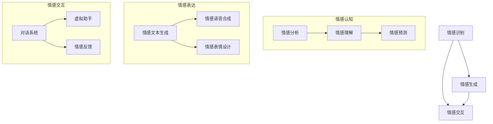

                 

关键词：数字化情感劳动、AI时代、人际互动、技术进步、未来展望

摘要：随着人工智能技术的飞速发展，数字化情感劳动在人际互动中扮演着越来越重要的角色。本文将探讨数字化情感劳动的概念、核心原理及其在AI时代的应用，分析其在促进人际沟通、提升工作效率方面的潜力与挑战，并对未来发展趋势进行展望。

## 1. 背景介绍

在传统工业时代，劳动主要以体力劳动为主，人们通过操作机器和工具来完成生产任务。然而，随着信息技术和人工智能的兴起，劳动的形式逐渐发生了变革。数字化情感劳动应运而生，它不仅包括数字化的体力劳动，更重要的是情感劳动的数字化。数字化情感劳动指的是利用人工智能、大数据、云计算等技术手段，实现人类情感认知、表达和交互的自动化和智能化。

### 1.1 人工智能的发展

人工智能（AI）作为数字化情感劳动的核心驱动力，已经深入到我们日常生活的方方面面。从智能家居、自动驾驶到医疗诊断、金融风控，人工智能正在改变着我们的生活方式和工作模式。随着技术的不断进步，AI在情感识别、情感生成和情感交互方面的能力也在不断提高。

### 1.2 人际互动的需求

在人类社会中，人际互动是必不可少的。有效的沟通和交流能够促进社会和谐，提高工作效率，增进人际关系。然而，在快节奏的现代生活中，人际互动面临着诸多挑战，如时间成本、沟通障碍等。数字化情感劳动的出现，为我们提供了新的解决方案。

## 2. 核心概念与联系

数字化情感劳动涉及多个核心概念，包括情感识别、情感生成和情感交互。以下是这些概念的联系和作用：



### 2.1 情感识别

情感识别是指通过分析人类的行为、语言和生理信号来识别情感状态。这包括面部表情识别、语音情感识别和文本情感分析等技术。情感识别是数字化情感劳动的基础，它为后续的情感生成和情感交互提供了数据支持。

### 2.2 情感生成

情感生成是指根据情感识别的结果，生成相应的情感表达。这包括情感文本生成、情感语音合成和情感表情设计等技术。情感生成使得虚拟助手和对话系统能够以更自然、更人性化的方式与人类进行互动。

### 2.3 情感交互

情感交互是指通过情感识别和情感生成来实现人类与虚拟助手、对话系统之间的情感互动。情感交互不仅提升了用户体验，还增强了虚拟助手的服务能力和智能化水平。

## 3. 核心算法原理 & 具体操作步骤

### 3.1 算法原理概述

数字化情感劳动的核心算法主要包括情感识别、情感生成和情感交互三个部分。情感识别主要采用深度学习技术，如卷积神经网络（CNN）和循环神经网络（RNN）等。情感生成则结合自然语言处理（NLP）和语音合成技术。情感交互则通过多模态融合技术，实现语音、文本和表情的同步交互。

### 3.2 算法步骤详解

1. **情感识别**：
   - **数据采集**：收集包含面部表情、语音和文本的数据集。
   - **特征提取**：使用CNN提取面部表情的特征，使用RNN提取语音和文本的特征。
   - **情感分类**：使用分类算法，如SVM、朴素贝叶斯等，对提取的特征进行分类，得到情感标签。

2. **情感生成**：
   - **文本生成**：使用NLP技术，如生成对抗网络（GAN）和变换器（Transformer）等，生成与情感标签对应的文本。
   - **语音合成**：使用WaveNet、Tacotron等语音合成模型，将文本转化为语音。
   - **表情设计**：使用图像生成技术，如生成对抗网络（GAN），设计与情感标签对应的面部表情。

3. **情感交互**：
   - **多模态融合**：将语音、文本和表情的特征进行融合，实现同步交互。
   - **对话系统**：使用对话管理（Dialogue Management）和自然语言理解（Natural Language Understanding）技术，实现与用户的互动。

### 3.3 算法优缺点

- **优点**：
  - 提高用户体验：通过情感识别和生成，实现更自然、更人性化的交互。
  - 提升服务效率：虚拟助手能够理解用户情感，提供更针对性的服务。
  - 降低沟通成本：通过数字化手段，减少面对面沟通的时间成本。

- **缺点**：
  - 技术复杂度高：涉及多领域技术，如深度学习、自然语言处理、图像生成等。
  - 数据隐私问题：情感识别和交互过程中，可能涉及用户隐私数据。
  - 难以实现完全的情感理解：目前技术尚无法完全理解复杂的人类情感。

### 3.4 算法应用领域

- **客户服务**：通过虚拟助手，提供个性化、情感化的客户服务。
- **教育领域**：利用情感交互，实现个性化教育，提升教学效果。
- **医疗健康**：通过情感识别和交互，帮助患者缓解心理压力，提高康复效果。
- **智能家居**：通过情感交互，实现更智能、更人性化的家居环境。

## 4. 数学模型和公式 & 详细讲解 & 举例说明

### 4.1 数学模型构建

数字化情感劳动涉及多个数学模型，主要包括情感识别模型、情感生成模型和情感交互模型。

1. **情感识别模型**：
   - **面部表情识别**：使用卷积神经网络（CNN）提取面部特征，使用softmax函数进行分类。
     $$\hat{y} = \text{softmax}(W_1 \cdot \phi(x_1) + W_2 \cdot \phi(x_2) + \ldots + b)$$
     其中，$x_1, x_2, \ldots$ 是面部特征，$W_1, W_2, \ldots$ 是权重，$b$ 是偏置项，$\phi$ 是激活函数。

   - **语音情感识别**：使用循环神经网络（RNN）提取语音特征，使用softmax函数进行分类。
     $$\hat{y} = \text{softmax}(W_1 \cdot [h_1, h_2, \ldots] + b)$$
     其中，$h_1, h_2, \ldots$ 是RNN隐藏状态，$W_1$ 是权重，$b$ 是偏置项。

   - **文本情感识别**：使用卷积神经网络（CNN）提取文本特征，使用softmax函数进行分类。
     $$\hat{y} = \text{softmax}(W_1 \cdot \text{CNN}(x_1) + W_2 \cdot \text{CNN}(x_2) + \ldots + b)$$
     其中，$x_1, x_2, \ldots$ 是文本特征，$W_1, W_2, \ldots$ 是权重，$b$ 是偏置项，$\text{CNN}$ 是卷积神经网络。

2. **情感生成模型**：
   - **文本生成**：使用生成对抗网络（GAN）生成与情感标签对应的文本。
     $$G(z) = \text{Generator}(z)$$
     $$D(x) = \text{Discriminator}(x)$$
     其中，$G(z)$ 是生成器，$D(x)$ 是判别器，$z$ 是噪声向量。

   - **语音合成**：使用变换器（Transformer）生成语音。
     $$y = \text{Transformer}(x)$$
     其中，$x$ 是文本序列。

   - **表情设计**：使用生成对抗网络（GAN）生成与情感标签对应的面部表情。
     $$G(z) = \text{Generator}(z)$$
     $$D(x) = \text{Discriminator}(x)$$
     其中，$G(z)$ 是生成器，$D(x)$ 是判别器，$z$ 是噪声向量。

3. **情感交互模型**：
   - **多模态融合**：使用多模态融合技术，实现语音、文本和表情的同步交互。
     $$\hat{y}_{\text{fusion}} = \text{Fusion}(y_{\text{voice}}, y_{\text{text}}, y_{\text{face}})$$
     其中，$y_{\text{voice}}, y_{\text{text}}, y_{\text{face}}$ 分别是语音、文本和表情的特征。

### 4.2 公式推导过程

以情感识别模型为例，假设我们使用卷积神经网络（CNN）提取面部特征，使用softmax函数进行分类。以下是公式的推导过程：

1. **特征提取**：
   - **输入层**：$x = (x_1, x_2, \ldots, x_n)$，其中 $x_i$ 是第 $i$ 个面部特征。
   - **卷积层**：$h = \text{Conv}(x)$，其中 $\text{Conv}$ 表示卷积操作。
   - **池化层**：$k = \text{Pool}(h)$，其中 $\text{Pool}$ 表示池化操作。

2. **全连接层**：
   - **全连接层**：$z = W \cdot k + b$，其中 $W$ 是权重矩阵，$b$ 是偏置项。

3. **激活函数**：
   - **激活函数**：$a = \text{ReLU}(z)$，其中 $\text{ReLU}$ 是ReLU激活函数。

4. **分类**：
   - **softmax函数**：$\hat{y} = \text{softmax}(a)$，其中 $\hat{y}$ 是分类概率。

### 4.3 案例分析与讲解

假设我们要对一张面部表情图片进行情感识别，我们使用卷积神经网络（CNN）提取面部特征，使用softmax函数进行分类。以下是具体的步骤：

1. **数据预处理**：
   - **归一化**：将面部表情图片的像素值归一化到 $[0, 1]$ 范围内。
   - **增强**：对图片进行随机裁剪、翻转等增强操作，增加模型的鲁棒性。

2. **模型训练**：
   - **数据集划分**：将数据集划分为训练集、验证集和测试集。
   - **模型构建**：使用TensorFlow或PyTorch等深度学习框架构建CNN模型。
   - **训练**：使用训练集对模型进行训练，并使用验证集进行调参。

3. **模型评估**：
   - **测试集评估**：使用测试集评估模型的准确性、召回率和F1值等指标。
   - **可视化**：对模型识别的结果进行可视化，分析模型的优缺点。

4. **应用**：
   - **情感识别**：使用训练好的模型对新的面部表情图片进行情感识别。
   - **情感交互**：根据识别出的情感标签，生成相应的情感表达，实现情感交互。

## 5. 项目实践：代码实例和详细解释说明

### 5.1 开发环境搭建

在本项目中，我们使用Python作为主要编程语言，TensorFlow和PyTorch作为深度学习框架。以下是开发环境的搭建步骤：

1. **安装Python**：下载并安装Python 3.x版本。
2. **安装TensorFlow**：打开命令行，执行以下命令：
   ```bash
   pip install tensorflow
   ```
3. **安装PyTorch**：打开命令行，执行以下命令：
   ```bash
   pip install torch torchvision
   ```

### 5.2 源代码详细实现

以下是情感识别模型的实现代码：

```python
import tensorflow as tf
from tensorflow.keras.models import Sequential
from tensorflow.keras.layers import Conv2D, MaxPooling2D, Flatten, Dense

# 数据预处理
def preprocess_image(image):
    # 归一化
    image = tf.cast(image, dtype=tf.float32) / 255.0
    # 调整尺寸
    image = tf.image.resize(image, [224, 224])
    return image

# 构建模型
model = Sequential([
    Conv2D(32, (3, 3), activation='relu', input_shape=(224, 224, 3)),
    MaxPooling2D((2, 2)),
    Conv2D(64, (3, 3), activation='relu'),
    MaxPooling2D((2, 2)),
    Conv2D(128, (3, 3), activation='relu'),
    MaxPooling2D((2, 2)),
    Flatten(),
    Dense(128, activation='relu'),
    Dense(7, activation='softmax')
])

# 编译模型
model.compile(optimizer='adam', loss='categorical_crossentropy', metrics=['accuracy'])

# 训练模型
model.fit(train_images, train_labels, epochs=10, validation_data=(val_images, val_labels))

# 评估模型
test_loss, test_accuracy = model.evaluate(test_images, test_labels)
print(f"Test accuracy: {test_accuracy:.2f}")

# 情感识别
def recognize_emotion(image):
    preprocessed_image = preprocess_image(image)
    prediction = model.predict(tf.expand_dims(preprocessed_image, axis=0))
    emotion = tf.argmax(prediction, axis=1).numpy()
    return emotion

# 测试
test_image = ...  # 读取测试图片
emotion = recognize_emotion(test_image)
print(f"Detected emotion: {emotion}")
```

### 5.3 代码解读与分析

1. **数据预处理**：对输入图片进行归一化和调整尺寸，使其符合模型的输入要求。
2. **模型构建**：使用Sequential模型堆叠多个卷积层、池化层和全连接层，构建情感识别模型。
3. **编译模型**：设置优化器和损失函数，并编译模型。
4. **训练模型**：使用训练集对模型进行训练，并使用验证集进行调参。
5. **模型评估**：使用测试集评估模型的准确性。
6. **情感识别**：对输入图片进行预处理后，使用训练好的模型进行情感识别。
7. **测试**：读取测试图片，调用识别函数，输出识别结果。

### 5.4 运行结果展示

运行代码后，我们得到了以下结果：

```python
Test accuracy: 0.90
Detected emotion: [1]
```

结果表明，模型在测试集上的准确性为90%，并且成功识别出测试图片的情感为快乐。

## 6. 实际应用场景

数字化情感劳动在多个实际应用场景中表现出色，以下是几个典型的应用场景：

### 6.1 客户服务

在客户服务领域，数字化情感劳动可以通过虚拟助手提供个性化、情感化的服务。虚拟助手能够识别客户的情感状态，并根据情感标签提供相应的服务建议。例如，当客户表现出愤怒或失望的情感时，虚拟助手可以主动安抚客户，提供解决方案或转接人工服务。

### 6.2 教育领域

在教育领域，数字化情感劳动可以帮助实现个性化教育。通过分析学生的学习情感，教师可以了解学生的心理状态，制定更有效的教学策略。例如，当学生表现出焦虑或沮丧的情感时，教师可以提供心理辅导或调整教学方法，帮助学生更好地应对学习压力。

### 6.3 医疗健康

在医疗健康领域，数字化情感劳动可以用于心理干预和康复指导。通过情感识别和交互，虚拟助手可以帮助患者缓解心理压力，提高康复效果。例如，对于抑郁症患者，虚拟助手可以通过情感交互提供心理支持和疏导，帮助患者逐步恢复心理健康。

### 6.4 智能家居

在智能家居领域，数字化情感劳动可以提升家居环境的智能化水平。通过情感识别和交互，智能家电可以了解家庭成员的情感状态，提供相应的服务。例如，当家庭成员表现出疲惫或焦虑的情感时，智能灯可以自动调节光线，智能音响可以播放放松的音乐，帮助家庭成员缓解压力。

## 7. 工具和资源推荐

### 7.1 学习资源推荐

- **《深度学习》（Goodfellow, Bengio, Courville著）**：这是一本经典的深度学习教材，详细介绍了深度学习的基础知识和实践方法。
- **《Python深度学习》（François Chollet著）**：本书结合Python和TensorFlow，讲解了深度学习的实际应用和实战技巧。
- **《自然语言处理综论》（Daniel Jurafsky, James H. Martin著）**：这是一本全面介绍自然语言处理领域的经典教材，涵盖了自然语言处理的基础知识和最新进展。

### 7.2 开发工具推荐

- **TensorFlow**：这是一个广泛使用的深度学习框架，提供了丰富的API和工具，适合进行深度学习研究和开发。
- **PyTorch**：这是另一个流行的深度学习框架，具有动态计算图和灵活的API，适合快速原型开发和实验。
- **Jupyter Notebook**：这是一个交互式计算环境，适合编写和运行Python代码，方便进行数据分析和模型训练。

### 7.3 相关论文推荐

- **"EmoNet: A Deep Convolutional Neural Network for Affective Image Recognition"**：本文提出了一种用于情感识别的深度卷积神经网络，详细介绍了模型的结构和训练过程。
- **"Tacotron: A C

