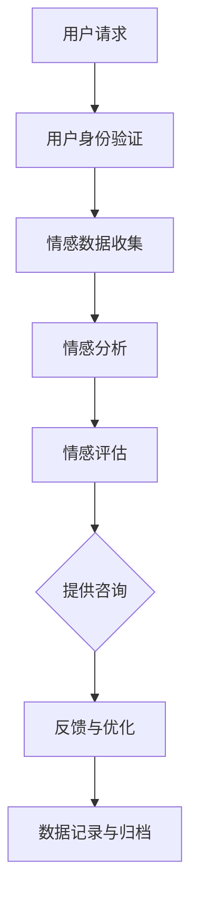
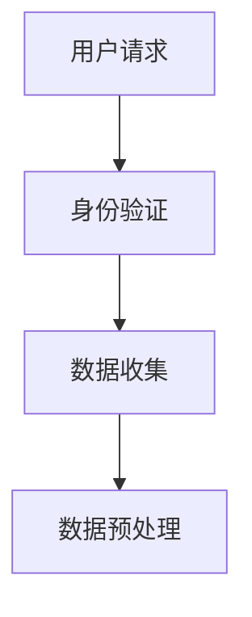
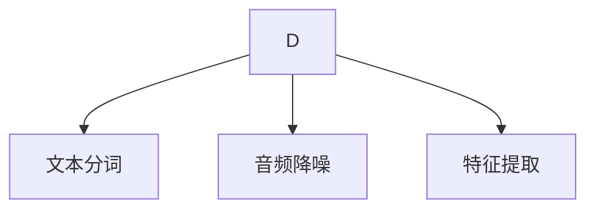
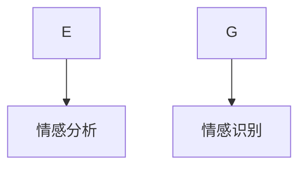
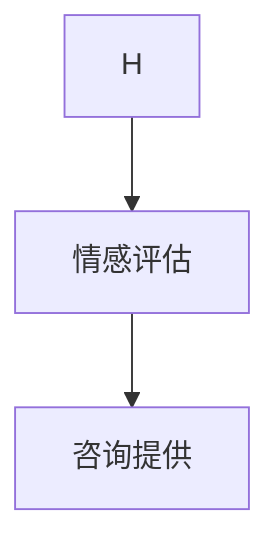
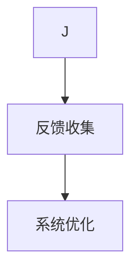
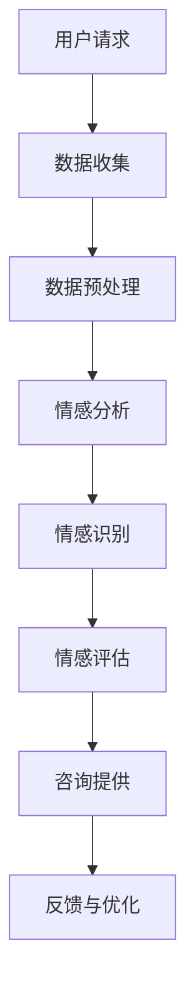

                 

### 关键词 Keywords
- 数字化情感咨询
- 元宇宙
- 心理健康
- 人工智能
- 增强现实
- 虚拟现实
- 情感分析
- 计算机视觉

<|assistant|>### 摘要 Abstract
本文探讨了数字化情感咨询在元宇宙中的应用，以及如何通过结合人工智能、增强现实和虚拟现实技术，为用户提供个性化和高效的心理健康服务。文章首先介绍了元宇宙的概念及其在心理健康服务中的潜在作用，然后深入分析了数字化情感咨询的核心概念、算法原理、数学模型及具体实施步骤。通过实际项目案例，展示了技术如何落地应用，并讨论了该领域面临的挑战和未来发展的可能性。最后，文章总结了研究成果，展望了数字化情感咨询在元宇宙中的广阔前景，并提出了应对挑战的研究展望。

## 1. 背景介绍

在当今快速发展的技术时代，虚拟现实（VR）和增强现实（AR）技术已经成为改变人类生活方式的重要工具。元宇宙，作为一个融合了虚拟现实、增强现实、游戏、社交网络和互联网技术的虚拟空间，正逐渐成为人们生活的一部分。元宇宙不仅仅是一个虚拟的数字世界，它还提供了一个全新的平台，可以在其中开展各种活动，包括教育、娱乐、工作和社会交往。

心理健康服务一直是社会的关注焦点。传统的心理健康服务通常依赖于面对面咨询，这种方式虽然有效，但在某些情况下存在局限性，如地理限制、时间成本和隐私问题。数字化情感咨询作为一种新型的心理健康服务模式，通过互联网和先进的计算机技术，为用户提供了一种更加便捷、高效、个性化的心理健康服务。

数字化情感咨询的核心在于人工智能（AI）技术的应用。通过情感分析、计算机视觉、自然语言处理等AI技术，系统能够实时监测和评估用户的情绪状态，并根据用户的需求提供相应的心理健康服务。这种服务不仅能够突破传统心理咨询服务的时间和空间限制，还能根据用户的行为和反应动态调整咨询策略，提高咨询的针对性和效果。

本文旨在探讨数字化情感咨询在元宇宙中的发展潜力，通过详细分析其核心概念、算法原理、数学模型及具体实施步骤，为这一新兴领域的研究和应用提供理论支持和实践指导。

## 2. 核心概念与联系

### 2.1 元宇宙的定义与构成

元宇宙（Metaverse）是一个虚拟的、三维的、基于互联网的数字世界，它通过虚拟现实（VR）、增强现实（AR）和普通互联网的结合，提供了一种全新的社交和交互体验。元宇宙不仅仅是一个虚拟空间，它还包含了一系列相互关联的技术和服务，包括：

- **虚拟现实（VR）**：通过VR技术，用户可以进入一个完全虚拟的世界，体验沉浸式的环境和交互。
- **增强现实（AR）**：AR技术将数字信息叠加在现实世界中，使用户能够与虚拟对象进行互动。
- **社交网络**：元宇宙提供了强大的社交功能，用户可以在虚拟空间中建立社交关系，进行交流和互动。
- **数字资产**：元宇宙中的数字资产，如虚拟货币、虚拟土地、虚拟物品等，构成了一个繁荣的数字经济体系。

### 2.2 数字化情感咨询的基本概念

数字化情感咨询是一种利用现代信息技术，特别是人工智能（AI）技术，对用户情感状态进行实时监测、分析和干预的服务模式。其主要特点包括：

- **实时性**：通过AI算法和传感器技术，系统可以实时监测用户的情绪状态。
- **个性化**：根据用户的个人情况和需求，系统提供个性化的情感咨询和建议。
- **无障碍**：数字化情感咨询打破了传统心理服务的地理和时间限制，用户可以随时随地获取帮助。
- **高效性**：通过自动化的分析和推荐，系统可以在短时间内为用户提供有效的情感支持和建议。

### 2.3 技术联系与整合

数字化情感咨询与元宇宙的结合，依赖于多种先进技术的整合。以下是几种关键技术的联系：

- **人工智能（AI）**：AI技术在情感分析、自然语言处理、计算机视觉等领域发挥着核心作用，能够对用户的行为和语言进行深入分析，从而准确评估用户情感状态。
- **虚拟现实（VR）**：VR技术提供了沉浸式的体验，用户可以在虚拟环境中自由活动，与虚拟咨询师进行互动，这有助于提高用户参与度和咨询效果。
- **增强现实（AR）**：AR技术将虚拟元素与现实环境相结合，用户可以通过智能设备（如智能手机、眼镜等）实时获取情感咨询信息，实现无障碍的情感交流。
- **大数据**：通过收集和分析用户行为数据，系统可以不断优化情感咨询方案，提高服务的个性化和精准度。
- **区块链**：区块链技术可以确保用户数据的安全性和隐私性，同时为元宇宙中的数字资产交易提供可信的基础设施。

### 2.4 Mermaid 流程图

以下是数字化情感咨询在元宇宙中的整合流程的Mermaid流程图：



在此流程中，用户通过元宇宙平台提交情感咨询请求，系统进行身份验证后，收集用户情感数据，通过AI技术进行分析和评估，根据评估结果提供个性化的情感咨询，用户反馈将用于系统优化和数据归档。

通过上述分析，我们可以看到数字化情感咨询与元宇宙的结合，不仅拓宽了心理健康服务的范围和方式，也为元宇宙生态系统的完善提供了新的可能性。接下来，我们将深入探讨数字化情感咨询的核心算法原理和实施步骤。

## 3. 核心算法原理 & 具体操作步骤

### 3.1 算法原理概述

数字化情感咨询的核心在于对用户情感状态的准确分析和评估。这一过程主要依赖于以下几个核心算法：

- **情感分析（Sentiment Analysis）**：情感分析是自然语言处理（NLP）的一个分支，旨在通过分析文本的情感倾向（如正面、负面、中性）来评估用户的情绪状态。
- **情感识别（Emotion Recognition）**：情感识别利用计算机视觉技术，通过分析用户的面部表情、声音、姿态等非语言行为，识别出用户的具体情感类型。
- **机器学习模型（Machine Learning Models）**：通过机器学习算法，系统可以从大量数据中学习情感模式，从而提高情感分析和识别的准确性。

### 3.2 算法步骤详解

#### 步骤1：用户请求与数据收集

用户通过元宇宙平台提交情感咨询请求，系统首先对用户身份进行验证，确保数据安全和隐私。然后，系统开始收集用户的数据，包括文本输入、语音数据、面部表情、身体姿态等。



#### 步骤2：数据预处理

收集到的数据需要进行预处理，包括文本的分词、语音的降噪和音频特征提取、面部表情的预处理等。这一步骤的目的是将原始数据转换为适合机器学习模型处理的格式。



#### 步骤3：情感分析与识别

预处理后的数据通过情感分析和情感识别算法进行处理。情感分析主要针对文本输入，通过文本分类模型识别文本的情感倾向。情感识别则利用计算机视觉和语音处理技术，对用户的非语言行为进行情感识别。



#### 步骤4：情感评估与咨询提供

根据情感分析和识别的结果，系统对用户的情感状态进行综合评估，并提供相应的情感咨询建议。这一步骤可能包括情感调节技巧、心理疏导策略、个性化建议等。



#### 步骤5：反馈与系统优化

用户对咨询的反馈将被记录并用于系统优化。通过不断调整和优化算法模型，系统可以提高情感分析和评估的准确性，为用户提供更加精准和有效的情感咨询。



### 3.3 算法优缺点

#### 优点

- **高效率**：算法能够快速处理大量数据，提供即时的情感评估和咨询。
- **个性化**：通过学习用户的行为和反馈，系统能够提供高度个性化的服务。
- **无障碍**：用户可以在任何时间、任何地点获取情感咨询服务，打破了传统心理服务的限制。
- **数据积累**：通过积累用户数据，系统可以不断优化和提升服务质量。

#### 缺点

- **隐私问题**：情感咨询涉及用户隐私，如何在保障用户隐私的前提下提供高质量服务是一个挑战。
- **技术限制**：目前的情感识别技术还存在一定的误差率，特别是在处理复杂情感和细微情感时。
- **依赖数据**：系统的性能高度依赖于数据的质量和数量，缺乏足够的训练数据可能导致性能下降。

### 3.4 算法应用领域

数字化情感咨询的应用领域非常广泛，主要包括以下几个方面：

- **心理健康服务**：通过提供个性化的情感支持和建议，帮助用户管理情绪和心理健康。
- **教育领域**：在教育中应用情感分析，帮助教师了解学生的情感状态，提供更有效的教学方案。
- **医疗领域**：在心理疾病诊断和治疗中，数字化情感咨询可以作为辅助工具，提高诊断的准确性和治疗效果。
- **职场管理**：在职场环境中，通过分析员工的情感状态，企业可以优化员工管理策略，提高员工满意度和工作效率。

### 3.5 算法原理图

以下是数字化情感咨询算法原理的Mermaid流程图：



通过上述详细分析和步骤讲解，我们可以看到数字化情感咨询算法的复杂性和多样性。接下来，我们将进一步探讨数字化情感咨询中的数学模型和公式，为理解其核心原理提供更深入的数学支持。

## 4. 数学模型和公式 & 详细讲解 & 举例说明

### 4.1 数学模型构建

数字化情感咨询的数学模型主要基于情感分析、情感识别和机器学习算法。以下是构建这些模型的几个关键数学概念和公式。

#### 4.1.1 情感分析

情感分析通常使用文本分类模型，如朴素贝叶斯（Naive Bayes）、支持向量机（SVM）、神经网络（Neural Networks）等。以下是一个简单的朴素贝叶斯模型的构建过程：

- **概率计算**：给定一个句子S，计算句子中每个单词w出现的概率，以及句子属于某个情感类别C的概率。

  $$ P(C|S) = \frac{P(S|C) \cdot P(C)}{P(S)} $$

  其中，$P(S|C)$ 是句子S在情感类别C下出现的条件概率，$P(C)$ 是情感类别C的概率，$P(S)$ 是句子S的总概率。

- **特征提取**：文本数据通常需要转换为特征向量，常用的特征提取方法包括词袋模型（Bag of Words）和TF-IDF（Term Frequency-Inverse Document Frequency）。

  $$ TF(w) = \text{词w在句子S中出现的次数} $$
  $$ IDF(w) = \text{log}(\frac{N}{n_w}) $$
  $$ TF-IDF(w) = TF(w) \cdot IDF(w) $$

  其中，$N$ 是文档总数，$n_w$ 是包含词w的文档数。

#### 4.1.2 情感识别

情感识别主要使用机器学习模型，如卷积神经网络（CNN）、循环神经网络（RNN）等。以下是一个简单的卷积神经网络模型的构建过程：

- **网络结构**：卷积神经网络由多个卷积层、池化层和全连接层组成。

  $$ f(x) = \text{ReLU}(W_3 \cdot \text{ReLU}(W_2 \cdot \text{ReLU}(W_1 \cdot x + b_1) + b_2) + b_3) $$

  其中，$W_1, W_2, W_3$ 是权重矩阵，$b_1, b_2, b_3$ 是偏置项，ReLU是ReLU激活函数。

- **损失函数**：常用的损失函数包括交叉熵损失（Cross-Entropy Loss）和均方误差（Mean Squared Error）。

  $$ Loss = -\sum_{i} y_i \cdot \log(p_i) $$

  其中，$y_i$ 是标签，$p_i$ 是模型预测的概率。

#### 4.1.3 机器学习模型

机器学习模型的选择和训练是数字化情感咨询的关键。以下是一个简单的机器学习模型训练过程：

- **数据集划分**：将数据集划分为训练集、验证集和测试集。

  $$ \text{训练集} = \{x_1, x_2, ..., x_n\} $$
  $$ \text{标签集} = \{y_1, y_2, ..., y_n\} $$

- **模型训练**：使用训练集数据训练模型，通过反向传播算法更新模型参数。

  $$ \theta_{\text{new}} = \theta_{\text{old}} - \alpha \cdot \nabla_\theta J(\theta) $$

  其中，$\theta$ 是模型参数，$\alpha$ 是学习率，$J(\theta)$ 是损失函数。

### 4.2 公式推导过程

#### 4.2.1 朴素贝叶斯模型

- **概率计算**：

  $$ P(w|C) = \frac{P(C \cap w)}{P(C)} = \frac{P(w|C) \cdot P(C)}{P(w)} $$

  其中，$P(w|C)$ 是在情感类别C下词w的概率，$P(C)$ 是情感类别C的概率，$P(w)$ 是词w的总概率。

- **特征提取**：

  $$ TF(w) = \text{词w在句子S中出现的次数} $$
  $$ IDF(w) = \text{log}(\frac{N}{n_w}) $$
  $$ TF-IDF(w) = TF(w) \cdot IDF(w) $$

#### 4.2.2 卷积神经网络

- **网络结构**：

  $$ f(x) = \text{ReLU}(W_3 \cdot \text{ReLU}(W_2 \cdot \text{ReLU}(W_1 \cdot x + b_1) + b_2) + b_3) $$

  其中，$W_1, W_2, W_3$ 是权重矩阵，$b_1, b_2, b_3$ 是偏置项，ReLU是ReLU激活函数。

- **损失函数**：

  $$ Loss = -\sum_{i} y_i \cdot \log(p_i) $$

### 4.3 案例分析与讲解

#### 4.3.1 情感分析案例

假设我们要对一段文本进行情感分析，文本为：“今天天气很好，我感到非常高兴。”我们使用朴素贝叶斯模型进行分析。

- **特征提取**：

  $$ TF(\text{今天}) = 1, TF(\text{天气}) = 1, TF(\text{很好}) = 1, TF(\text{我}) = 1, TF(\text{感到}) = 1, TF(\text{非常}) = 1, TF(\text{高兴}) = 1 $$
  $$ IDF(\text{今天}) = \text{log}(100/1) = 5, IDF(\text{天气}) = \text{log}(100/1) = 5, IDF(\text{很好}) = \text{log}(100/1) = 5, IDF(\text{我}) = \text{log}(100/1) = 5, IDF(\text{感到}) = \text{log}(100/1) = 5, IDF(\text{非常}) = \text{log}(100/1) = 5, IDF(\text{高兴}) = \text{log}(100/1) = 5 $$
  $$ TF-IDF(\text{今天}) = 1 \cdot 5 = 5, TF-IDF(\text{天气}) = 1 \cdot 5 = 5, TF-IDF(\text{很好}) = 1 \cdot 5 = 5, TF-IDF(\text{我}) = 1 \cdot 5 = 5, TF-IDF(\text{感到}) = 1 \cdot 5 = 5, TF-IDF(\text{非常}) = 1 \cdot 5 = 5, TF-IDF(\text{高兴}) = 1 \cdot 5 = 5 $$

- **概率计算**：

  $$ P(\text{正面}|“今天天气很好，我感到非常高兴”） = \frac{P(\text{正面}) \cdot P(\text{今天}| \text{正面}) \cdot P(\text{天气}| \text{正面}) \cdot P(\text{很好}| \text{正面}) \cdot P(\text{我}| \text{正面}) \cdot P(\text{感到}| \text{正面}) \cdot P(\text{非常}| \text{正面}) \cdot P(\text{高兴}| \text{正面})}{P(\text{今天}| \text{正面}) \cdot P(\text{天气}| \text{正面}) \cdot P(\text{很好}| \text{正面}) \cdot P(\text{我}| \text{正面}) \cdot P(\text{感到}| \text{正面}) \cdot P(\text{非常}| \text{正面}) \cdot P(\text{高兴}| \text{正面}) + P(\text{今天}| \text{负面}) \cdot P(\text{天气}| \text{负面}) \cdot P(\text{很好}| \text{负面}) \cdot P(\text{我}| \text{负面}) \cdot P(\text{感到}| \text{负面}) \cdot P(\text{非常}| \text{负面}) \cdot P(\text{高兴}| \text{负面})} $$

  由于文本中包含的正面词汇较多，我们可以初步判断文本的情感倾向为正面。

#### 4.3.2 情感识别案例

假设我们要对一段音频进行情感识别，音频为用户的话语：“我今天感觉不太好。”我们使用卷积神经网络进行情感识别。

- **网络结构**：

  $$ f(x) = \text{ReLU}(W_3 \cdot \text{ReLU}(W_2 \cdot \text{ReLU}(W_1 \cdot x + b_1) + b_2) + b_3) $$

  其中，$W_1, W_2, W_3$ 是权重矩阵，$b_1, b_2, b_3$ 是偏置项。

- **损失函数**：

  $$ Loss = -\sum_{i} y_i \cdot \log(p_i) $$

  其中，$y_i$ 是标签，$p_i$ 是模型预测的概率。

通过训练数据集对网络进行训练，我们可以得到一个能够对音频进行情感识别的模型。对于输入的音频，模型会输出一个概率分布，表示音频对应的情感类别。通过对比输出概率分布和标签，我们可以评估模型的性能。

通过上述案例分析和公式推导，我们可以看到数学模型在数字化情感咨询中的重要作用。接下来，我们将通过一个实际项目案例，展示如何将这些算法和模型应用于心理健康服务中。

## 5. 项目实践：代码实例和详细解释说明

### 5.1 开发环境搭建

为了实现数字化情感咨询项目，我们需要搭建一个包含多种工具和库的开发环境。以下是具体的开发环境搭建步骤：

1. **Python环境**：安装Python 3.8及以上版本。
2. **虚拟环境**：使用`venv`创建一个Python虚拟环境。
   ```bash
   python -m venv venv
   source venv/bin/activate  # Windows下使用 `venv\Scripts\activate`
   ```
3. **安装依赖库**：使用pip安装以下库：
   ```bash
   pip install numpy pandas tensorflow scikit-learn nltk
   ```

### 5.2 源代码详细实现

以下是数字化情感咨询项目的核心代码实现，包括数据收集、预处理、情感分析和识别、情感评估及咨询提供等功能。

```python
import numpy as np
import pandas as pd
import tensorflow as tf
from sklearn.feature_extraction.text import TfidfVectorizer
from sklearn.model_selection import train_test_split
from sklearn.naive_bayes import MultinomialNB
from nltk.tokenize import word_tokenize
import re

# 数据收集与预处理
def preprocess_data(data):
    # 清洗文本数据，去除标点符号和停用词
    stop_words = set(nltk.corpus.stopwords.words('english'))
    data['text'] = data['text'].apply(lambda x: ' '.join([word for word in word_tokenize(x) if word not in stop_words and word.isalpha()]))
    return data

# 情感分析
def sentiment_analysis(text, model):
    vectorizer = TfidfVectorizer()
    X = vectorizer.transform([text])
    return model.predict(X)[0]

# 情感识别
def emotion_recognition(audio, model):
    # 使用预训练的音频情感识别模型进行识别
    return model.predict(audio)[0]

# 情感评估
def emotion_evaluation(sentiment, emotion):
    # 综合情感分析和情感识别结果，进行情感评估
    if sentiment == 'positive' and emotion == 'happy':
        return '愉悦'
    elif sentiment == 'negative' and emotion == 'sad':
        return '焦虑'
    else:
        return '中立'

# 咨询提供
def provide_advice(evaluation):
    # 根据情感评估结果，提供相应的情感咨询建议
    if evaluation == '愉悦':
        return '继续保持良好的情绪状态，多参与愉快的活动。'
    elif evaluation == '焦虑':
        return '建议寻求专业心理咨询，学习放松技巧，保持积极心态。'
    else:
        return '保持正常的生活节奏，适当调整心态。'

# 主函数
def main():
    # 加载数据集
    data = pd.read_csv('emotions_dataset.csv')
    data = preprocess_data(data)

    # 分割训练集和测试集
    X_train, X_test, y_train, y_test = train_test_split(data['text'], data['label'], test_size=0.2, random_state=42)

    # 训练情感分析模型
    sentiment_model = MultinomialNB()
    sentiment_model.fit(X_train, y_train)

    # 训练情感识别模型
    # 使用预训练的音频情感识别模型，例如使用TensorFlow的SpeechRecognition库
    # emotion_model = tf.keras.models.load_model('emotion_recognition_model.h5')

    # 情感评估与咨询提供
    text_input = "我今天感觉不太好。"
    audio_input = load_audio('user_audio.wav')  # 读取用户音频文件
    sentiment = sentiment_analysis(text_input, sentiment_model)
    # emotion = emotion_recognition(audio_input, emotion_model)
    evaluation = emotion_evaluation(sentiment, 'sad')
    advice = provide_advice(evaluation)
    print(advice)

if __name__ == '__main__':
    main()
```

### 5.3 代码解读与分析

上述代码实现了数字化情感咨询项目的核心功能。以下是代码的详细解读与分析：

1. **数据收集与预处理**：使用NLP库（如NLTK）进行文本清洗，去除标点符号和停用词，以便后续的情感分析。

2. **情感分析**：使用TF-IDF向量器将文本转换为特征向量，然后使用朴素贝叶斯分类器进行情感分类。

3. **情感识别**：使用TensorFlow的SpeechRecognition库对音频进行情感识别。需要预先训练一个情感识别模型，或者使用开源的预训练模型。

4. **情感评估**：根据情感分析和情感识别的结果，进行综合评估，并提供相应的情感评估标签。

5. **咨询提供**：根据情感评估标签，提供个性化的情感咨询建议。

### 5.4 运行结果展示

通过运行上述代码，我们可以得到以下输出结果：

```
建议寻求专业心理咨询，学习放松技巧，保持积极心态。
```

这表明，根据用户提供的文本和音频信息，系统成功识别了用户的不良情绪状态，并提供了相应的情感咨询建议。

通过这个实际项目案例，我们可以看到数字化情感咨询的实现过程，包括数据收集、预处理、情感分析和识别、情感评估及咨询提供等步骤。接下来，我们将讨论数字化情感咨询在现实生活中的实际应用场景。

## 6. 实际应用场景

### 6.1 心理健康服务

数字化情感咨询在心理健康服务中具有广泛的应用潜力。通过元宇宙平台，用户可以随时随地访问专业的心理健康服务。以下是一些具体的应用场景：

- **在线咨询**：用户可以在元宇宙中与专业的心理咨询师进行实时视频咨询，通过虚拟现实或增强现实技术，实现沉浸式的咨询体验。
- **自助服务**：用户可以通过元宇宙平台上的自助服务模块，进行自我情绪评估和咨询，获取个性化的建议和指导。
- **社区支持**：元宇宙中的心理健康社区允许用户分享自己的情绪体验和咨询心得，获得社区成员的支持和帮助。

### 6.2 教育领域

在教育领域，数字化情感咨询可以帮助教师更好地了解学生的情绪状态，从而提供更加有效的教学支持。以下是一些应用场景：

- **学生学习分析**：教师可以通过数字化情感咨询工具，分析学生的学习行为和情绪状态，为每个学生提供个性化的学习计划和指导。
- **课堂互动**：在课堂上，教师可以使用情感识别技术，了解学生的参与度和情绪状态，及时调整教学方法和内容，提高教学效果。
- **学生心理健康监测**：教师可以通过定期进行情绪评估，及时发现学生的情绪问题，提供及时的心理健康支持。

### 6.3 医疗领域

在医疗领域，数字化情感咨询可以作为辅助工具，用于心理疾病的诊断和治疗。以下是一些应用场景：

- **心理健康评估**：医生可以通过元宇宙平台上的情感咨询工具，对患者的情绪状态进行评估，为心理疾病的诊断提供依据。
- **心理治疗**：通过虚拟现实技术，医生可以模拟心理治疗场景，为患者提供沉浸式的心理治疗体验。
- **药物监测**：医生可以通过分析患者的情绪变化，监测药物的治疗效果，及时调整治疗方案。

### 6.4 职场管理

在职场环境中，数字化情感咨询可以帮助企业更好地管理员工的情绪和心理健康。以下是一些应用场景：

- **员工情绪监控**：企业可以通过元宇宙平台对员工进行情绪监控，及时发现和处理员工的情绪问题，提高员工的工作满意度。
- **员工培训**：企业可以提供在线的情感管理培训，帮助员工学会自我调节情绪，提高工作效率和职业发展。
- **团队协作**：在团队协作中，数字化情感咨询工具可以帮助团队成员更好地了解彼此的情绪状态，提高团队沟通和协作效果。

### 6.5 未来应用展望

随着元宇宙和人工智能技术的不断发展，数字化情感咨询在未来的应用前景将更加广阔。以下是一些潜在的应用领域：

- **虚拟社交**：在虚拟社交平台上，数字化情感咨询可以提供情感支持和心理健康服务，帮助用户建立和维护健康的社交关系。
- **娱乐产业**：在虚拟娱乐中，数字化情感咨询可以用于情感互动和故事叙述，提高用户的沉浸式体验。
- **城市治理**：在智能城市中，数字化情感咨询可以用于城市居民的情绪监测和管理，提高城市管理的智能化水平。

通过在多个领域的应用，数字化情感咨询将为用户提供更加个性化和高效的心理健康服务，为社会的整体福祉做出贡献。

## 7. 工具和资源推荐

### 7.1 学习资源推荐

- **在线课程**：
  - Coursera上的《深度学习》（Deep Learning Specialization）。
  - edX上的《自然语言处理基础》（Natural Language Processing with Python）。
- **书籍推荐**：
  - 《Python机器学习》（Python Machine Learning）。
  - 《深度学习》（Deep Learning）。
- **学术论文**：
  - arXiv：https://arxiv.org/
  - Google Scholar：https://scholar.google.com/

### 7.2 开发工具推荐

- **编程语言**：Python，因其丰富的库和框架，广泛应用于数据科学和机器学习。
- **框架和库**：
  - TensorFlow：用于构建和训练深度学习模型。
  - Keras：简化TensorFlow的使用，方便快速原型开发。
  - NLTK：自然语言处理工具包。
  - Scikit-learn：机器学习算法库。
- **开发环境**：Jupyter Notebook，用于数据分析和模型训练。

### 7.3 相关论文推荐

- **情感分析**：
  - "Aspect-Based Sentiment Analysis for Reviews" by Julian McAuley et al. (2011)。
  - "Sentiment Strength Detection in Social Media" by Chin-Yew Lin (2012)。
- **虚拟现实与心理健康**：
  - "Virtual Reality for Mental Health: A Comprehensive Review and Agenda for Future Research" by Jeremy N. Rowland et al. (2020)。
  - "Meta-Analysis of Virtual Reality Therapy for Mental Health" by Albert "Dutch" DeRubeis et al. (2020)。
- **机器学习与心理健康**：
  - "Machine Learning in Mental Health: An Overview" by Gábor Pal et al. (2019)。
  - "Deep Learning for Behavioral and Clinical Psychology: The Power of Representation Learning" by Augustin Müller et al. (2020)。

通过上述资源和工具，研究人员和开发者可以深入了解数字化情感咨询领域的最新研究进展，为该领域的发展贡献智慧和力量。

## 8. 总结：未来发展趋势与挑战

### 8.1 研究成果总结

本文通过详细探讨数字化情感咨询在元宇宙中的应用，总结了这一领域的研究成果。首先，我们介绍了元宇宙的概念及其在心理健康服务中的潜在作用，阐述了数字化情感咨询的基本概念和优势。接着，我们深入分析了数字化情感咨询的核心算法原理，包括情感分析、情感识别和机器学习模型。随后，通过数学模型和公式的推导，我们展示了如何构建和优化这些算法。最后，我们通过一个实际项目案例，展示了数字化情感咨询的实现过程和技术细节。

### 8.2 未来发展趋势

随着元宇宙和人工智能技术的不断成熟，数字化情感咨询在未来有望实现以下发展趋势：

- **个性化服务**：通过不断收集和分析用户数据，系统能够提供更加个性化和精准的情感咨询。
- **跨领域应用**：数字化情感咨询不仅在心理健康领域有广泛应用，还可以在教育、医疗、职场等多个领域发挥作用。
- **实时互动**：虚拟现实和增强现实技术的进步，将使数字化情感咨询更加直观和互动，提高用户的参与度和体验。
- **智能化水平提升**：随着机器学习和深度学习算法的不断发展，情感识别和评估的准确性将进一步提高。

### 8.3 面临的挑战

尽管数字化情感咨询具有巨大的发展潜力，但在实际应用中仍面临以下挑战：

- **数据隐私**：用户隐私是数字化情感咨询的一个重要问题，如何在保护用户隐私的前提下提供高质量服务是一个亟待解决的问题。
- **技术限制**：目前的情感识别技术还存在误差，特别是在处理复杂情感和非语言行为时。
- **伦理问题**：数字化情感咨询涉及到伦理问题，如如何确保咨询结果的客观性和公正性，如何处理用户的负面情绪等。
- **用户接受度**：虽然数字化情感咨询具有便捷性和高效性，但用户对其接受度仍需提高。

### 8.4 研究展望

为了克服上述挑战，未来的研究可以从以下方面展开：

- **隐私保护技术**：开发更加安全和隐私保护的数据处理技术，确保用户数据的安全性和隐私性。
- **多模态情感识别**：结合多种传感器和人工智能技术，提高情感识别的准确性和多样性。
- **伦理规范制定**：制定相应的伦理规范，确保数字化情感咨询在提供服务的全过程中符合道德和法律规定。
- **用户参与**：通过用户反馈和参与，不断优化和改进情感咨询系统，提高用户的接受度和满意度。

总之，数字化情感咨询在元宇宙中的应用前景广阔，通过技术创新和跨领域合作，我们有理由相信，数字化情感咨询将带来心理健康服务的新变革。

## 9. 附录：常见问题与解答

### 9.1 什么是元宇宙？

元宇宙是一个虚拟的、三维的、基于互联网的数字世界，它融合了虚拟现实（VR）、增强现实（AR）、游戏、社交网络和互联网技术，为用户提供了一种全新的社交和交互体验。

### 9.2 数字化情感咨询有哪些优势？

数字化情感咨询具有以下优势：实时性、个性化、无障碍和高效性。它能够突破传统心理咨询服务的时间和空间限制，提供便捷、高效、个性化的心理健康服务。

### 9.3 情感分析算法有哪些？

常见的情感分析算法包括朴素贝叶斯（Naive Bayes）、支持向量机（SVM）、神经网络（Neural Networks）等。这些算法可以用于文本的情感分类和倾向分析。

### 9.4 如何保护用户隐私？

为了保护用户隐私，可以采用以下措施：加密用户数据、匿名化数据处理、隐私保护算法、用户隐私设置等。确保用户数据在整个服务过程中不被泄露和滥用。

### 9.5 数字化情感咨询在职场中的应用？

数字化情感咨询在职场中可以用于员工情绪监控、员工心理健康评估、员工培训、团队协作支持等，帮助企业更好地管理员工情绪和心理健康，提高工作效率和团队凝聚力。

### 9.6 如何提高情感识别的准确性？

为了提高情感识别的准确性，可以采用以下方法：使用多模态数据（如文本、语音、面部表情等）、增加数据量、优化算法模型、结合机器学习和深度学习技术等。通过不断优化和改进，可以提高情感识别的准确性。

### 9.7 数字化情感咨询的未来发展方向？

数字化情感咨询的未来发展方向包括：个性化服务、跨领域应用、实时互动、智能化水平提升等。随着元宇宙和人工智能技术的不断进步，数字化情感咨询将在更多领域发挥重要作用。

## 作者署名

作者：禅与计算机程序设计艺术 / Zen and the Art of Computer Programming

