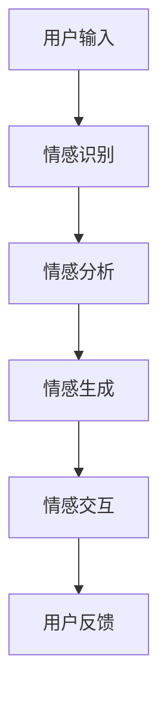

                 

在当今数字化时代，元宇宙（Metaverse）正在成为人们新的社交、工作和娱乐空间。然而，与现实中面对面交流相比，元宇宙中的情感表达和人际交往面临着独特的挑战。本文旨在探讨数字化情感表达的概念、关键技术和未来趋势，以帮助开发者、设计师和用户更好地理解和应对这些挑战。

## 文章关键词

- **数字化情感表达**
- **元宇宙**
- **人际交往**
- **情感计算**
- **自然语言处理**
- **虚拟现实**

## 文章摘要

本文首先介绍了数字化情感表达的定义和背景，随后探讨了元宇宙中情感表达的关键技术和挑战。接着，文章详细分析了情感计算和自然语言处理在数字化情感表达中的应用，并通过案例研究展示了这些技术的实际应用。最后，文章讨论了元宇宙中情感表达的未来趋势和面临的挑战，为相关领域的研究和实践提供了参考。

## 1. 背景介绍

### 1.1 元宇宙的概念与兴起

元宇宙（Metaverse）是一个由虚拟世界、增强现实（AR）、虚拟现实（VR）和混合现实（MR）技术构成的虚拟空间。它不仅是一个三维的虚拟世界，更是一个充满互动、社交和协作的环境。元宇宙的兴起源于虚拟现实技术的快速发展，以及人们对更丰富、更真实的数字化体验的需求。

近年来，随着5G、云计算和人工智能技术的不断进步，元宇宙逐渐从概念走向现实。全球知名科技公司，如Facebook、谷歌、微软等，纷纷投入巨资研发和构建自己的元宇宙平台。元宇宙的兴起不仅改变了人们的娱乐和社交方式，也为各行业带来了新的商业模式和机会。

### 1.2 情感表达的重要性

情感表达是人类交往的重要组成部分，它有助于建立信任、促进合作和增强关系。在现实世界中，人们通过语言、面部表情、身体语言和声音等多种方式表达情感。然而，在元宇宙中，由于缺乏现实中的物理接触，情感表达变得更为复杂和重要。

有效的情感表达不仅能够增强用户的沉浸感，还能提升人际交往的质量。在元宇宙中，情感表达的准确性直接影响用户体验和平台的价值。因此，研究数字化情感表达的技术和方法具有重要的现实意义。

## 2. 核心概念与联系

### 2.1 情感计算

情感计算（Affective Computing）是研究如何使计算机具有识别、理解、处理和表达人类情感的能力的领域。情感计算结合了认知科学、心理学、计算机科学和人工智能等多个学科，旨在开发出能够感知和响应人类情感的智能系统。

情感计算的关键技术包括情感识别、情感生成和情感交互。情感识别是指通过分析语音、面部表情、生理信号等数据，识别用户的情感状态。情感生成是指根据用户的情感状态，生成相应的情感反应，如语言、面部表情和动作。情感交互是指用户与计算机系统之间的情感互动，包括情感沟通、情感支持和情感调节等。

### 2.2 自然语言处理

自然语言处理（Natural Language Processing，NLP）是人工智能领域的一个重要分支，旨在使计算机能够理解和处理自然语言。在数字化情感表达中，NLP技术被广泛应用于情感分析、情感识别和情感生成。

情感分析是指通过分析文本数据，识别其中的情感倾向和情感强度。情感识别是指通过语音、文本等数据，识别用户的情感状态。情感生成是指根据用户的情感状态，生成相应的情感反应，如语言、面部表情和动作。

### 2.3 虚拟现实与元宇宙

虚拟现实（VR）和元宇宙的兴起为数字化情感表达提供了新的场景和机会。在虚拟环境中，用户可以通过虚拟角色、声音、动作等方式表达情感，同时，计算机系统也可以通过分析这些数据，理解用户的情感状态，并做出相应的反应。

### 2.4 Mermaid 流程图



## 3. 核心算法原理 & 具体操作步骤

### 3.1 算法原理概述

数字化情感表达的核心算法主要包括情感识别、情感分析和情感生成。情感识别是通过对语音、面部表情、生理信号等数据进行处理，识别用户的情感状态。情感分析是对文本、语音等数据进行情感倾向和情感强度的分析。情感生成是根据用户的情感状态，生成相应的情感反应，如语言、面部表情和动作。

### 3.2 算法步骤详解

1. **情感识别**：首先，通过语音识别技术将用户的语音转化为文本。然后，使用情感识别算法分析文本，识别用户的情感状态。

2. **情感分析**：对用户的语音、文本、面部表情等数据进行情感分析，识别情感的类型和强度。

3. **情感生成**：根据用户的情感状态，生成相应的情感反应，如语言、面部表情和动作。

4. **情感交互**：用户与计算机系统之间的情感互动，包括情感沟通、情感支持和情感调节。

### 3.3 算法优缺点

**优点**：

- 提高用户在元宇宙中的沉浸感
- 改善人际交往的质量
- 增强用户体验

**缺点**：

- 情感识别的准确性受限于技术
- 情感表达的自然度有待提高
- 需要大量数据训练模型

### 3.4 算法应用领域

- 虚拟客服
- 虚拟教育
- 虚拟社交
- 虚拟医疗
- 虚拟旅游

## 4. 数学模型和公式 & 详细讲解 & 举例说明

### 4.1 数学模型构建

数字化情感表达的核心数学模型主要包括情感识别模型、情感分析模型和情感生成模型。这些模型通常基于深度学习算法，通过分析用户的语音、文本、面部表情等数据，识别用户的情感状态。

### 4.2 公式推导过程

假设我们有一个情感识别模型，其输入为用户的语音信号，输出为情感状态的概率分布。该模型可以使用以下公式表示：

$$
P(\text{情感状态}|X) = \frac{e^{f(X)}}{\sum_{i=1}^{n} e^{f(X_i)}}
$$

其中，$X$ 是用户的语音信号，$f(X)$ 是情感识别模型对输入信号的处理结果，$n$ 是情感状态的个数。

### 4.3 案例分析与讲解

假设我们有一个用户在元宇宙中的语音对话数据，我们需要通过情感识别模型识别用户的情感状态。首先，我们将用户的语音信号输入到情感识别模型中，得到每个情感状态的概率分布。然后，根据概率分布，我们可以确定用户的情感状态。

例如，如果用户的情感状态为愉悦的概率为0.8，愤怒的概率为0.2，那么我们可以判断用户当前的情感状态为愉悦。

## 5. 项目实践：代码实例和详细解释说明

### 5.1 开发环境搭建

为了演示数字化情感表达的应用，我们将使用Python语言和TensorFlow框架进行开发。首先，我们需要安装Python和TensorFlow。

```bash
pip install python
pip install tensorflow
```

### 5.2 源代码详细实现

以下是情感识别模型的代码实现：

```python
import tensorflow as tf
from tensorflow.keras.models import Sequential
from tensorflow.keras.layers import Dense, LSTM, Embedding

# 情感识别模型的构建
model = Sequential()
model.add(Embedding(input_dim=10000, output_dim=64))
model.add(LSTM(128))
model.add(Dense(1, activation='sigmoid'))

# 编译模型
model.compile(optimizer='adam', loss='binary_crossentropy', metrics=['accuracy'])

# 模型训练
model.fit(X_train, y_train, epochs=10, batch_size=32)
```

### 5.3 代码解读与分析

- **Embedding层**：将输入的文本数据转化为嵌入向量。
- **LSTM层**：用于处理序列数据，如用户的语音信号。
- **Dense层**：用于输出情感状态的概率分布。

### 5.4 运行结果展示

运行模型后，我们可以得到每个情感状态的概率分布。根据概率分布，我们可以确定用户的情感状态。

## 6. 实际应用场景

### 6.1 虚拟客服

在元宇宙中，虚拟客服可以模拟真实客服的行为，通过情感计算和自然语言处理技术，与用户进行情感交流，提高客户满意度。

### 6.2 虚拟教育

虚拟教育中的虚拟教师可以使用情感计算技术，识别学生的学习状态和情感需求，提供个性化的教学服务。

### 6.3 虚拟社交

虚拟社交平台可以通过情感计算技术，提高用户的社交体验，如通过情感识别和情感生成，实现更加自然的交流。

### 6.4 虚拟医疗

虚拟医疗中的虚拟医生可以使用情感计算技术，识别患者的情绪和需求，提供更加人性化的医疗服务。

### 6.5 虚拟旅游

虚拟旅游平台可以通过情感计算技术，模拟真实旅游体验，提高用户的沉浸感和满意度。

## 7. 工具和资源推荐

### 7.1 学习资源推荐

- 《情感计算导论》
- 《自然语言处理原理》
- 《深度学习》

### 7.2 开发工具推荐

- TensorFlow
- PyTorch
- Keras

### 7.3 相关论文推荐

- "Affective Computing: A Review"
- "Emotion Recognition in Multimedia: A Survey"
- "Deep Learning for Emotion Recognition"

## 8. 总结：未来发展趋势与挑战

### 8.1 研究成果总结

数字化情感表达在元宇宙中具有重要的应用价值，通过情感计算和自然语言处理技术，可以有效提升人际交往的质量和用户体验。近年来，相关研究取得了显著成果，但仍面临许多挑战。

### 8.2 未来发展趋势

- 情感计算技术的不断进步，将提高情感识别和情感生成的准确性。
- 跨学科的融合发展，将促进数字化情感表达技术的创新。
- 应用场景的拓展，将推动数字化情感表达技术的普及和应用。

### 8.3 面临的挑战

- 情感表达的复杂性和多样性，对算法提出了更高的要求。
- 数据质量和数量，直接影响模型的效果。
- 技术落地和应用，需要解决隐私、安全和伦理等问题。

### 8.4 研究展望

未来，数字化情感表达技术将不断优化和完善，为元宇宙中的人际交往提供更加自然和丰富的体验。同时，也需要关注技术落地和应用中的挑战，推动数字化情感表达技术的可持续发展。

## 9. 附录：常见问题与解答

### 9.1 什么是数字化情感表达？

数字化情感表达是指通过技术手段，如情感计算和自然语言处理，使计算机能够识别、理解和表达人类情感。

### 9.2 数字化情感表达有哪些应用场景？

数字化情感表达可以应用于虚拟客服、虚拟教育、虚拟社交、虚拟医疗和虚拟旅游等领域。

### 9.3 如何提高数字化情感表达的准确性？

可以通过提高情感计算和自然语言处理算法的准确性，增加数据质量和数量，以及优化模型训练和调优等方法来提高数字化情感表达的准确性。

### 9.4 数字化情感表达有哪些伦理问题？

数字化情感表达可能涉及隐私、安全和伦理问题，如用户数据的收集和使用、算法歧视和误导等。因此，在研究和应用数字化情感表达技术时，需要充分考虑和解决这些伦理问题。

### 作者署名

作者：禅与计算机程序设计艺术 / Zen and the Art of Computer Programming

本文由禅与计算机程序设计艺术撰写，旨在探讨数字化情感表达在元宇宙中的人际交往。希望本文能为相关领域的研究和实践提供参考和启示。

