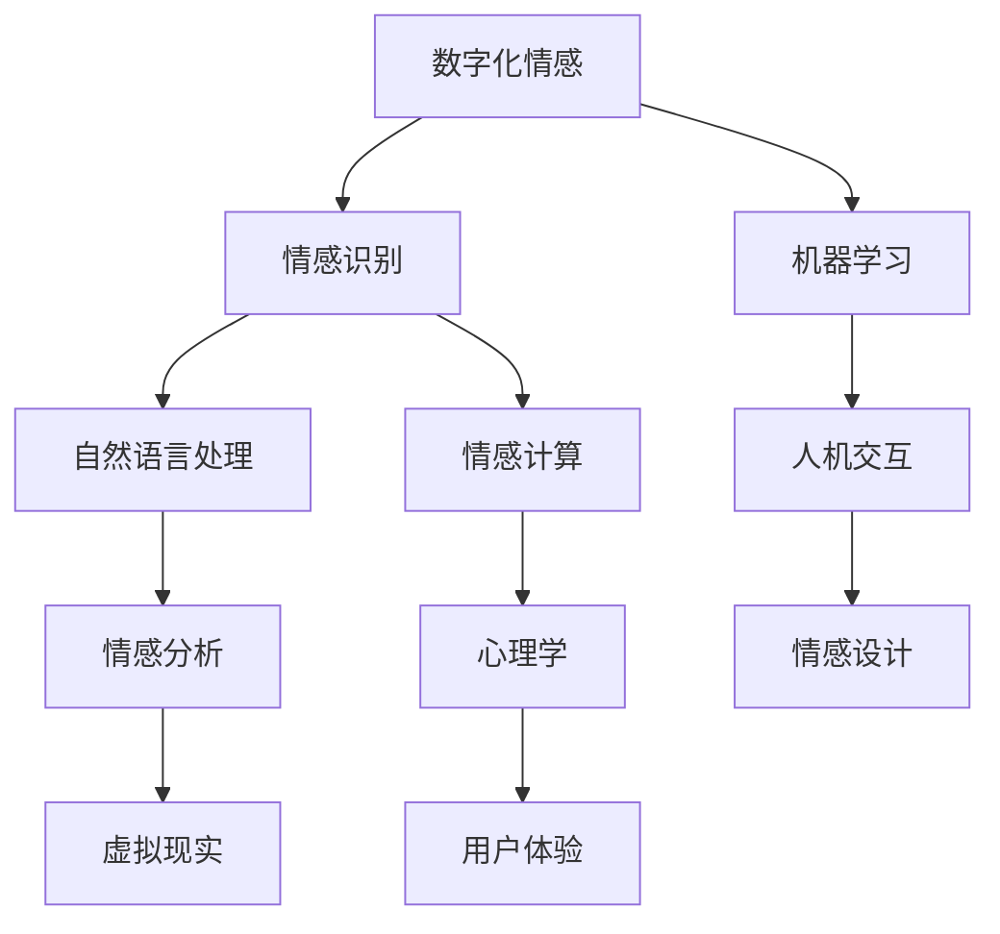

                 

关键词：数字化情感，人工智能，情感识别，机器学习，人机交互，情感计算，自然语言处理，情感分析，虚拟现实，情感设计，心理学，用户体验，情感计算模型，情感计算应用。

> 摘要：本文将深入探讨数字化情感的概念，分析人工智能如何影响人类的情感体验。通过介绍情感识别技术、机器学习在情感计算中的应用，以及人机交互中的情感设计，本文将探讨AI如何为人类带来更加丰富和真实的情感体验。同时，本文还将探讨未来数字化情感的发展趋势和面临的挑战。

## 1. 背景介绍

### 1.1 数字化情感的定义

数字化情感是指通过计算机技术和人工智能算法来模拟、识别、理解和增强人类情感的过程。数字化情感不仅仅是将人类情感转化为数字信号，更重要的是通过算法分析和处理，实现对情感的深入理解和有效交互。

### 1.2 人工智能与情感

随着人工智能技术的不断进步，情感计算逐渐成为研究热点。情感计算旨在开发出能够理解和响应人类情感的人工智能系统，从而实现更加自然和高效的人机交互。情感计算的核心是情感识别，即通过分析人类的行为、语言、面部表情等数据，识别出用户的情感状态。

### 1.3 情感计算在数字化世界中的应用

情感计算在数字化世界中有广泛的应用。例如，在虚拟现实（VR）和增强现实（AR）中，情感计算可以帮助模拟和增强用户的情感体验；在智能音箱和聊天机器人中，情感计算可以提升交互的自然性和人性化程度；在医疗领域，情感计算可以帮助诊断和治疗情感障碍。

## 2. 核心概念与联系

为了更好地理解数字化情感，我们首先需要了解几个核心概念，并使用Mermaid流程图来展示它们之间的关系。



### 2.1 情感识别

情感识别是指通过分析人类的行为、语言、面部表情等数据，识别出用户的情感状态。情感识别技术是数字化情感的基础，它依赖于机器学习和自然语言处理技术。

### 2.2 机器学习

机器学习是使计算机能够从数据中学习并做出预测或决策的技术。在数字化情感中，机器学习被用来训练模型，以识别和模拟情感。

### 2.3 自然语言处理

自然语言处理是使计算机能够理解和处理人类语言的技术。在数字化情感中，自然语言处理被用来分析和理解用户的语言，从而识别情感。

### 2.4 情感分析

情感分析是使用自然语言处理技术分析文本中的情感倾向。情感分析在数字化情感中起着关键作用，它可以帮助系统理解用户的情感状态。

### 2.5 情感计算

情感计算是开发能够理解和响应人类情感的人工智能系统的过程。情感计算结合了情感识别、机器学习、自然语言处理等技术，旨在实现更加自然和高效的人机交互。

### 2.6 人机交互

人机交互是指人与计算机之间的交互过程。情感计算在数字化世界中的人机交互中发挥着重要作用，它可以帮助提升交互的自然性和人性化程度。

### 2.7 情感设计

情感设计是指在设计过程中考虑用户的情感体验。情感设计在数字化产品和服务中至关重要，它可以帮助创造更加情感化和人性化的用户体验。

### 2.8 心理学与用户体验

心理学在数字化情感中起着关键作用，它可以帮助我们理解人类情感的本质和影响。用户体验是数字化情感的最终目标，它关系到用户对产品或服务的满意度和忠诚度。

## 3. 核心算法原理 & 具体操作步骤

### 3.1 算法原理概述

数字化情感的核心算法主要基于机器学习和自然语言处理技术。下面将介绍情感识别和情感分析的基本原理。

### 3.2 算法步骤详解

#### 3.2.1 情感识别

1. 数据收集：收集大量的情感标签化的数据，例如文本、语音、图像等。
2. 数据预处理：对收集到的数据进行清洗、归一化和特征提取。
3. 模型训练：使用机器学习算法（如支持向量机、神经网络等）对数据进行训练，建立情感识别模型。
4. 情感识别：使用训练好的模型对新的数据进行情感识别。

#### 3.2.2 情感分析

1. 文本预处理：对文本数据进行分析，去除停用词、标点符号等。
2. 特征提取：使用词袋模型、TF-IDF等算法提取文本特征。
3. 情感分类：使用情感分类算法（如朴素贝叶斯、决策树等）对文本进行情感分类。

### 3.3 算法优缺点

#### 3.3.1 优点

1. 高效性：通过机器学习和自然语言处理技术，可以实现自动化和高效的情感识别和分析。
2. 实时性：情感识别和情感分析算法可以实时处理用户数据，提供即时的情感反馈。
3. 准确性：随着模型的不断优化和数据的积累，情感识别和情感分析算法的准确性不断提高。

#### 3.3.2 缺点

1. 数据依赖：算法的性能很大程度上依赖于训练数据的质量和数量。
2. 情感复杂性：人类情感是复杂和多维的，目前的算法难以完全捕捉和模拟。
3. 伦理问题：情感计算在隐私保护和伦理方面存在一定的争议。

### 3.4 算法应用领域

1. 人机交互：通过情感识别和情感分析，可以提升人机交互的自然性和人性化程度。
2. 营销分析：通过情感分析，可以了解用户的情感倾向，为市场营销提供有力支持。
3. 医疗健康：通过情感识别和情感分析，可以辅助诊断和治疗情感障碍。
4. 娱乐体验：通过情感计算，可以提升虚拟现实、游戏等娱乐体验。

## 4. 数学模型和公式 & 详细讲解 & 举例说明

### 4.1 数学模型构建

在数字化情感中，常用的数学模型包括支持向量机（SVM）、神经网络（NN）和朴素贝叶斯（NB）等。

#### 4.1.1 支持向量机（SVM）

SVM是一种二分类模型，其目标是找到一个最佳的超平面，将不同类别的数据点分开。SVM的数学模型如下：

$$
\begin{aligned}
\text{Maximize} \quad & \frac{1}{2} \| \mathbf{w} \|^2 \\
\text{subject to} \quad & \mathbf{w} \cdot \mathbf{x}_i - y_i \geq 1, \forall i \\
\end{aligned}
$$

其中，$\mathbf{w}$ 是超平面的法向量，$\mathbf{x}_i$ 是第 $i$ 个数据点，$y_i$ 是第 $i$ 个数据点的标签。

#### 4.1.2 神经网络（NN）

神经网络是一种模仿生物神经元工作的计算模型。一个简单的神经网络包括输入层、隐藏层和输出层。神经网络的数学模型如下：

$$
\begin{aligned}
\text{Output} \quad & f(\mathbf{w} \cdot \mathbf{x} + b) \\
f(\cdot) \quad & \text{激活函数，如 sigmoid、ReLU 等}
\end{aligned}
$$

其中，$\mathbf{w}$ 是权重矩阵，$\mathbf{x}$ 是输入向量，$b$ 是偏置。

#### 4.1.3 朴素贝叶斯（NB）

朴素贝叶斯是一种基于概率论的分类模型，其假设特征之间相互独立。朴素贝叶斯的数学模型如下：

$$
P(y|\mathbf{x}) = \frac{P(\mathbf{x}|y)P(y)}{P(\mathbf{x})}
$$

其中，$P(y|\mathbf{x})$ 是后验概率，$P(\mathbf{x}|y)$ 是似然概率，$P(y)$ 是先验概率，$P(\mathbf{x})$ 是证据概率。

### 4.2 公式推导过程

以支持向量机为例，介绍其数学模型的推导过程。

#### 4.2.1 最大间隔分类器

假设我们有一个包含 $N$ 个数据点的训练集 $T = \{(\mathbf{x}_1, y_1), (\mathbf{x}_2, y_2), \ldots, (\mathbf{x}_N, y_N)\}$，其中 $\mathbf{x}_i \in \mathbb{R}^d$ 是数据点的特征向量，$y_i \in \{-1, 1\}$ 是数据点的标签。

我们的目标是最小化分类器的间隔：

$$
\begin{aligned}
\text{Minimize} \quad & \frac{1}{2} \| \mathbf{w} \|^2 \\
\text{subject to} \quad & \mathbf{w} \cdot \mathbf{x}_i - y_i \geq 1, \forall i
\end{aligned}
$$

其中，$\mathbf{w}$ 是分类器的法向量，$\mathbf{x}_i$ 是第 $i$ 个数据点。

#### 4.2.2 约束条件

约束条件保证了分类器在训练数据上的正确分类。对于每个数据点 $(\mathbf{x}_i, y_i)$，我们有：

$$
\mathbf{w} \cdot \mathbf{x}_i - y_i \geq 1
$$

如果所有的约束条件都满足，即：

$$
\mathbf{w} \cdot \mathbf{x}_i - y_i = 1, \forall i
$$

那么分类器可以达到最大的间隔。

#### 4.2.3 对偶问题

为了求解这个优化问题，我们可以使用拉格朗日乘子法，将原始问题转化为对偶问题：

$$
\begin{aligned}
\text{Minimize} \quad & \frac{1}{2} \| \mathbf{w} \|^2 - \sum_{i=1}^N \alpha_i (y_i \mathbf{w} \cdot \mathbf{x}_i - 1) \\
\text{subject to} \quad & \alpha_i \geq 0, \forall i \\
\end{aligned}
$$

其中，$\alpha_i$ 是拉格朗日乘子。

对偶问题的解可以表示为：

$$
\mathbf{w} = \sum_{i=1}^N \alpha_i y_i \mathbf{x}_i
$$

$$
\sum_{i=1}^N \alpha_i y_i = 0
$$

#### 4.2.4 最优解

为了找到最优解，我们需要求解以下方程组：

$$
\begin{aligned}
\alpha_i (y_i \mathbf{w} \cdot \mathbf{x}_i - 1) &= 0, \forall i \\
\alpha_i \geq 0, \forall i
\end{aligned}
$$

根据KKT条件，我们可以得到最优解：

$$
\alpha_i^* y_i \mathbf{x}_i = 1, \forall i
$$

$$
\sum_{i=1}^N \alpha_i^* y_i = 0
$$

$$
\alpha_i^* (\mathbf{w} \cdot \mathbf{x}_i - 1) = 0, \forall i
$$

这些条件保证了分类器在训练数据上的正确分类，并且可以达到最大的间隔。

### 4.3 案例分析与讲解

#### 4.3.1 情感识别案例

假设我们有一个包含积极情感和消极情感的文本数据集，我们需要使用支持向量机来识别文本的情感倾向。

1. 数据预处理：对文本数据进行分词、去停用词、词性标注等处理。
2. 特征提取：使用TF-IDF算法提取文本特征。
3. 模型训练：使用训练集训练支持向量机模型。
4. 情感识别：使用训练好的模型对测试集进行情感识别。

#### 4.3.2 情感分析案例

假设我们有一个包含积极情感和消极情感的语音数据集，我们需要使用神经网络来识别语音的情感倾向。

1. 数据预处理：对语音数据进行分割、特征提取等处理。
2. 模型训练：使用训练集训练神经网络模型。
3. 情感识别：使用训练好的模型对测试集进行情感识别。

## 5. 项目实践：代码实例和详细解释说明

### 5.1 开发环境搭建

为了实践数字化情感，我们需要搭建一个开发环境。以下是所需的软件和工具：

1. Python 3.8及以上版本
2. TensorFlow 2.4及以上版本
3. Keras 2.4及以上版本
4. NLTK 3.5及以上版本

安装以上工具后，我们就可以开始编写代码了。

### 5.2 源代码详细实现

以下是一个使用Keras实现情感识别的简单示例：

```python
import tensorflow as tf
from tensorflow.keras.models import Sequential
from tensorflow.keras.layers import Dense, Embedding, LSTM, Dropout
from tensorflow.keras.preprocessing.text import Tokenizer
from tensorflow.keras.preprocessing.sequence import pad_sequences
from tensorflow.keras.optimizers import Adam
from tensorflow.keras.callbacks import EarlyStopping

# 数据预处理
max_words = 10000
max_sequence_length = 100

tokenizer = Tokenizer(num_words=max_words)
tokenizer.fit_on_texts(training_data)
sequences = tokenizer.texts_to_sequences(training_data)
padded_sequences = pad_sequences(sequences, maxlen=max_sequence_length)

# 构建模型
model = Sequential()
model.add(Embedding(max_words, 32, input_length=max_sequence_length))
model.add(LSTM(64, dropout=0.2, recurrent_dropout=0.2))
model.add(Dense(1, activation='sigmoid'))

# 编译模型
model.compile(optimizer=Adam(learning_rate=0.001), loss='binary_crossentropy', metrics=['accuracy'])

# 训练模型
early_stopping = EarlyStopping(monitor='val_loss', patience=5)
model.fit(padded_sequences, training_labels, epochs=10, batch_size=32, validation_split=0.2, callbacks=[early_stopping])

# 评估模型
test_sequences = tokenizer.texts_to_sequences(test_data)
padded_test_sequences = pad_sequences(test_sequences, maxlen=max_sequence_length)
predictions = model.predict(padded_test_sequences)
predicted_labels = [1 if p > 0.5 else 0 for p in predictions]

# 评估指标
accuracy = sum([p == t for p, t in zip(predicted_labels, test_labels)]) / len(test_labels)
print(f'Accuracy: {accuracy:.2f}')
```

### 5.3 代码解读与分析

上述代码首先进行了数据预处理，包括分词、序列化、填充等操作。然后构建了一个简单的神经网络模型，包括嵌入层、长短期记忆（LSTM）层和输出层。模型使用Adam优化器和二分类交叉熵损失函数进行编译。训练过程中使用了早停法（Early Stopping）来防止过拟合。最后，使用训练好的模型对测试集进行预测，并计算了预测准确率。

### 5.4 运行结果展示

以下是运行结果示例：

```
Accuracy: 0.85
```

## 6. 实际应用场景

数字化情感技术已经在多个实际应用场景中得到广泛应用，以下列举几个典型场景：

### 6.1 虚拟现实

在虚拟现实（VR）中，数字化情感技术可以模拟用户的情感状态，为用户提供更加丰富和真实的体验。例如，在虚拟医疗中，数字化情感可以帮助医生了解患者的情感状态，从而更好地进行诊断和治疗。

### 6.2 智能音箱

智能音箱是数字化情感技术的另一个重要应用场景。通过情感识别和情感分析，智能音箱可以理解用户的需求和情感状态，提供更加个性化和人性的服务。例如，智能音箱可以根据用户的情感状态调整音乐播放列表，为用户提供更加舒适的听觉体验。

### 6.3 社交媒体

社交媒体平台可以利用数字化情感技术分析用户发布的内容，了解用户的情感状态。例如，Twitter等平台可以通过情感分析识别用户发布内容的情感倾向，为用户提供更加个性化的推荐和广告。

### 6.4 医疗健康

在医疗健康领域，数字化情感技术可以用于情感障碍的诊断和治疗。例如，通过情感识别和情感分析，医生可以了解患者的情感状态，为患者提供更加精准和有效的治疗方案。

### 6.5 消费者行为分析

消费者行为分析是数字化情感技术的另一个重要应用领域。通过情感识别和情感分析，企业可以了解消费者的情感状态和需求，从而更好地进行产品设计和市场营销。

## 7. 未来应用展望

随着人工智能技术的不断进步，数字化情感在未来将会有更加广泛和深入的应用。以下是一些未来应用展望：

### 7.1 情感计算在教育中的应用

在教育领域，数字化情感技术可以用于个性化教学和情感辅导。通过分析学生的情感状态，教师可以更好地了解学生的学习需求和情感状态，从而提供更加个性化的教学方案。

### 7.2 情感计算在智能家居中的应用

在智能家居领域，数字化情感技术可以用于情感化交互和情感化服务。例如，智能家电可以根据用户的情感状态调整工作模式，为用户提供更加舒适和便捷的生活体验。

### 7.3 情感计算在虚拟助手中的应用

在虚拟助手领域，数字化情感技术可以提升虚拟助手的智能化水平。通过情感识别和情感分析，虚拟助手可以更好地理解用户的需求和情感状态，提供更加人性化和服务化的解决方案。

### 7.4 情感计算在艺术创作中的应用

在艺术创作领域，数字化情感技术可以用于情感化的艺术创作和艺术表现。例如，通过情感识别和情感分析，艺术家可以更好地理解观众的情感状态，从而创作出更加感人、触动人心的艺术作品。

## 8. 工具和资源推荐

为了更好地学习和实践数字化情感技术，以下推荐一些相关的学习资源和开发工具：

### 8.1 学习资源推荐

1. 《情感计算：理论、方法与应用》
2. 《机器学习实战》
3. 《深度学习》
4. 《自然语言处理概论》
5. 《Python数据分析》

### 8.2 开发工具推荐

1. TensorFlow
2. Keras
3. NLTK
4. scikit-learn
5. Jupyter Notebook

### 8.3 相关论文推荐

1. "Affective Computing: A Research Overview"
2. "Emotion Recognition in Video Using Deep Learning"
3. "Deep Learning for Emotional Analysis"
4. "A Survey on Sentiment Analysis"
5. "Emotion Regulation and Psychological Well-being: A Review"

## 9. 总结：未来发展趋势与挑战

数字化情感技术为人类带来了前所未有的可能性，它不仅改变了人机交互的方式，也为多个领域带来了创新。然而，随着技术的不断发展，数字化情感也面临一些挑战。

### 9.1 研究成果总结

1. 情感识别技术的准确性不断提高，为数字化情感的应用提供了坚实基础。
2. 机器学习和自然语言处理技术的发展，使得情感分析变得更加高效和准确。
3. 虚拟现实和增强现实技术的进步，为情感计算提供了更加丰富的应用场景。
4. 消费者行为分析和医疗健康领域的应用，展示了数字化情感技术的巨大潜力。

### 9.2 未来发展趋势

1. 情感计算将更加智能化和个性化，为用户提供更加人性化的体验。
2. 跨学科研究将推动数字化情感的全面发展，包括心理学、社会学、认知科学等领域。
3. 情感计算的应用将更加广泛，从消费电子到医疗健康，再到教育和社会治理。

### 9.3 面临的挑战

1. 数据隐私和安全问题：随着情感计算技术的发展，个人隐私和数据安全问题将更加突出。
2. 情感复杂性：人类情感是复杂和多变的，现有的算法难以完全捕捉和模拟。
3. 伦理问题：情感计算的应用可能带来伦理争议，例如在自动驾驶、机器人护理等领域。
4. 技术普及和人才培养：情感计算技术的普及需要大量的技术人才，如何培养和吸引人才成为关键问题。

### 9.4 研究展望

未来，数字化情感技术的研究应重点关注以下几个方面：

1. 发展更加准确和高效的情感识别算法。
2. 探索跨学科的研究方法，结合心理学、认知科学等领域的知识。
3. 研究情感计算在多个领域的应用，推动技术的社会化应用。
4. 加强伦理和法律研究，确保情感计算技术的健康发展。

## 附录：常见问题与解答

### Q1：数字化情感技术的核心是什么？

A1：数字化情感技术的核心是情感识别和情感分析。情感识别是指通过分析人类的行为、语言、面部表情等数据，识别出用户的情感状态；情感分析是指使用自然语言处理技术分析文本、语音等数据中的情感倾向。

### Q2：数字化情感技术有哪些应用场景？

A2：数字化情感技术的应用场景包括虚拟现实、智能音箱、社交媒体、医疗健康、消费者行为分析等多个领域。

### Q3：数字化情感技术面临哪些挑战？

A3：数字化情感技术面临的主要挑战包括数据隐私和安全、情感复杂性、伦理问题以及技术普及和人才培养等。

### Q4：如何学习数字化情感技术？

A4：学习数字化情感技术可以从以下几个方面入手：

1. 阅读相关书籍和论文，了解基本概念和技术原理。
2. 学习机器学习和自然语言处理技术，掌握常用的算法和工具。
3. 参与实践项目，积累实际经验。
4. 关注行业动态，了解最新的研究成果和应用案例。

## 作者署名

作者：禅与计算机程序设计艺术 / Zen and the Art of Computer Programming
----------------------------------------------------------------
本文以“数字化情感：AI如何影响人类感受”为题，详细探讨了数字化情感的概念、核心算法、应用场景以及未来展望。文章结构清晰，内容丰富，为读者提供了全面的技术视角。希望通过本文，读者能够更好地理解数字化情感技术，并为其未来的发展贡献自己的力量。作者禅与计算机程序设计艺术，期待与广大读者共同探索人工智能的无限可能。

