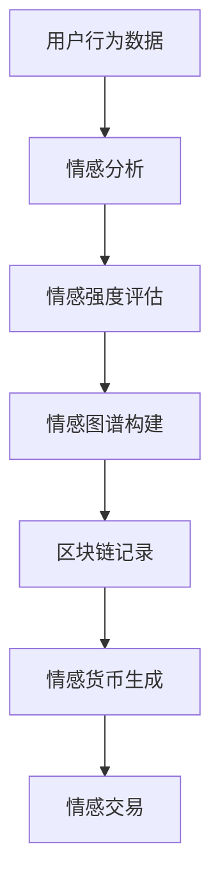

                 

关键词：数字化情绪货币，元宇宙，情感价值量化，人工智能，情感分析，情感计算，区块链，情感图谱，数学模型

摘要：随着元宇宙的崛起，人类情感在虚拟世界中的重要性日益凸显。本文探讨如何将情感价值量化，并将其作为一种新型货币在元宇宙中进行交易。通过介绍情感价值量化的核心概念、算法原理、数学模型以及实际应用场景，本文旨在为读者提供一个关于数字化情绪货币的全面理解，并探讨其在未来科技发展中的潜在影响。

## 1. 背景介绍

随着互联网和虚拟技术的迅猛发展，元宇宙（Metaverse）作为一个虚拟的、共享的、三维的数字世界，正逐渐成为人们日常生活的一部分。元宇宙不仅仅是一个游戏或者社交平台，它是一个更加广阔的虚拟空间，包含了教育、工作、娱乐、社交等多种功能。在这个虚拟世界中，人类的情感体验变得更加真实和多样化。

情感是人类行为和决策的重要驱动因素，无论是在现实世界还是元宇宙中。然而，情感本身是一种复杂的、难以量化的现象。传统的经济体系中，货币作为交换价值的媒介，但在元宇宙中，如何量化并交易情感价值成为一个亟待解决的问题。

### 情感价值量化的必要性

1. **元宇宙中的情感经济**：在元宇宙中，虚拟物品、服务、体验等都可能涉及情感价值的交易。例如，虚拟服装、游戏装备、虚拟房产等，其价值不仅仅取决于物理属性，更取决于用户对这些物品的情感认同和体验。

2. **情感驱动的行为决策**：在元宇宙中，用户的许多行为和决策都受到情感的影响，如选择某种虚拟角色、参与特定活动、投资虚拟货币等。情感价值的量化有助于更准确地预测用户行为，进而优化元宇宙的运营。

3. **情感货币的潜在应用**：情感货币的引入可以为元宇宙中的各种交易提供新的媒介，如支付游戏内虚拟商品、资助创意项目、奖励积极行为等。这为元宇宙的经济发展提供了新的动力。

## 2. 核心概念与联系

为了实现情感价值的量化，我们需要明确几个核心概念：情感分析、情感计算、情感图谱和区块链。

### 2.1 情感分析

情感分析（Sentiment Analysis）是一种自然语言处理技术，用于从文本中提取情感信息。通过情感分析，我们可以识别出文本中的情感极性（如正面、负面、中性）和情感强度。

### 2.2 情感计算

情感计算（Affective Computing）是人工智能领域的一个分支，旨在使计算机具备识别、理解、处理和模拟人类情感的能力。情感计算技术可以帮助我们更准确地量化情感。

### 2.3 情感图谱

情感图谱（Affective Graph）是一个用于表示情感关系的图结构。通过情感图谱，我们可以构建一个关于情感互动的复杂网络，从而更好地理解情感传播和影响。

### 2.4 区块链

区块链（Blockchain）是一种分布式账本技术，具有去中心化、透明、不可篡改等特点。在元宇宙中，区块链可以用于确保情感货币的交易记录的准确性和安全性。

### 2.5 Mermaid 流程图

下面是数字化情绪货币系统的一个简单的 Mermaid 流程图，展示了情感价值量化过程的核心步骤：



## 3. 核心算法原理 & 具体操作步骤

### 3.1 算法原理概述

数字化情绪货币的核心算法主要包括情感分析、情感强度评估、情感图谱构建和区块链记录等步骤。以下是这些步骤的具体原理：

1. **情感分析**：利用自然语言处理技术，对用户产生的文本数据进行情感分析，以提取情感信息。

2. **情感强度评估**：根据情感分析的结果，对情感强度进行量化评估。常用的方法包括情感极性打分、情感强度指数等。

3. **情感图谱构建**：基于情感分析结果，构建情感图谱，以表示用户之间的情感互动关系。

4. **区块链记录**：将情感图谱和情感强度评估结果记录到区块链上，确保交易记录的安全性和透明性。

5. **情感货币生成**：根据情感强度评估结果，生成相应的情感货币。

6. **情感交易**：用户可以使用情感货币进行虚拟物品、服务、体验等交易。

### 3.2 算法步骤详解

1. **情感分析**

   - 输入：用户行为数据（如文本评论、社交媒体帖子等）。
   - 过程：利用自然语言处理技术（如词向量、情感词典、深度学习模型等）进行情感分析，提取情感信息。
   - 输出：情感标签（如正面、负面、中性）和情感强度（如0-1之间的数值）。

2. **情感强度评估**

   - 输入：情感分析结果（情感标签和情感强度）。
   - 过程：根据情感分析结果，对情感强度进行量化评估。可以使用情感极性打分、情感强度指数等方法。
   - 输出：情感强度值（通常是一个0-1之间的数值）。

3. **情感图谱构建**

   - 输入：用户行为数据（如社交网络数据、游戏数据等）。
   - 过程：基于用户行为数据，构建情感图谱。情感图谱包括用户节点、情感边和情感强度等元素。
   - 输出：情感图谱。

4. **区块链记录**

   - 输入：情感图谱和情感强度评估结果。
   - 过程：将情感图谱和情感强度评估结果记录到区块链上，确保交易记录的安全性和透明性。
   - 输出：区块链上的情感货币交易记录。

5. **情感货币生成**

   - 输入：情感强度值。
   - 过程：根据情感强度值，生成相应的情感货币。情感货币的总量可以根据情感强度的平均值进行调节。
   - 输出：情感货币。

6. **情感交易**

   - 输入：用户持有的情感货币。
   - 过程：用户可以使用情感货币进行虚拟物品、服务、体验等交易。
   - 输出：交易结果。

### 3.3 算法优缺点

**优点：**

- **情感量化**：通过情感分析、情感强度评估等步骤，实现了情感价值的量化，为元宇宙中的情感交易提供了基础。

- **安全性**：利用区块链技术，确保了情感货币交易记录的安全性和透明性。

- **可扩展性**：情感价值量化算法可以应用于各种虚拟物品、服务、体验的交易，具有很好的可扩展性。

**缺点：**

- **情感复杂性**：情感本身是一种复杂的、难以量化的现象，情感价值量化的准确性可能受到一定限制。

- **技术挑战**：情感分析、情感计算等技术仍处于不断发展中，算法的准确性和效率需要进一步提升。

### 3.4 算法应用领域

- **元宇宙中的虚拟商品交易**：用户可以使用情感货币购买虚拟服装、游戏装备、虚拟房产等。

- **虚拟社会互动**：用户可以使用情感货币奖励他人，促进虚拟社会中的积极互动。

- **情感驱动的广告和营销**：企业可以利用情感货币进行情感驱动的广告和营销活动，提高用户参与度和忠诚度。

## 4. 数学模型和公式 & 详细讲解 & 举例说明

### 4.1 数学模型构建

数字化情绪货币的数学模型主要包括情感分析模型、情感强度评估模型和情感图谱构建模型。

1. **情感分析模型**

   情感分析模型通常使用卷积神经网络（CNN）、循环神经网络（RNN）或长短时记忆网络（LSTM）等深度学习模型进行训练。假设我们使用一个LSTM模型进行情感分析，其数学模型可以表示为：

   $$ 
   \text{输出} = \text{LSTM}(\text{输入序列}) 
   $$ 

   其中，输入序列为用户产生的文本数据，输出为情感标签和情感强度。

2. **情感强度评估模型**

   情感强度评估模型可以使用线性回归模型、支持向量机（SVM）或神经网络模型等进行训练。假设我们使用一个线性回归模型进行情感强度评估，其数学模型可以表示为：

   $$ 
   \text{情感强度} = \text{线性回归}(\text{情感标签}, \text{其他特征}) 
   $$ 

   其中，情感标签为情感分析模型的输出，其他特征包括情感词频、情感词权重等。

3. **情感图谱构建模型**

   情感图谱构建模型可以使用图论算法进行构建。假设我们使用一个简单的图论算法进行情感图谱构建，其数学模型可以表示为：

   $$ 
   \text{情感图谱} = \text{图论算法}(\text{用户行为数据}) 
   $$ 

   其中，用户行为数据包括用户之间的互动记录、情感标签等。

### 4.2 公式推导过程

1. **情感分析模型**

   假设我们使用一个LSTM模型进行情感分析，其输入为文本序列 $X = [x_1, x_2, ..., x_T]$，输出为情感标签 $y$ 和情感强度 $s$。LSTM模型的公式推导如下：

   $$ 
   \text{隐藏状态} \, h_t = \text{LSTM}(\text{前一个隐藏状态} \, h_{t-1}, \text{当前输入} \, x_t) 
   $$ 

   $$ 
   \text{情感标签} \, y = \text{softmax}(\text{隐藏状态} \, h_T) 
   $$ 

   $$ 
   \text{情感强度} \, s = \text{线性回归}(\text{隐藏状态} \, h_T, \text{其他特征} \, x) 
   $$ 

2. **情感强度评估模型**

   假设我们使用一个线性回归模型进行情感强度评估，其输入为情感标签 $y$ 和其他特征 $x$，输出为情感强度 $s$。线性回归模型的公式推导如下：

   $$ 
   \text{情感强度} \, s = w_0 + w_1 \cdot y + w_2 \cdot x 
   $$ 

   其中，$w_0, w_1, w_2$ 为模型的权重。

3. **情感图谱构建模型**

   假设我们使用一个简单的图论算法进行情感图谱构建，其输入为用户行为数据，输出为情感图谱。图论算法的公式推导如下：

   $$ 
   \text{情感图谱} = \text{构建图}(\text{用户节点}, \text{情感边}) 
   $$ 

   其中，用户节点表示用户，情感边表示用户之间的情感互动。

### 4.3 案例分析与讲解

为了更好地理解数字化情绪货币的数学模型，我们来看一个具体的案例。

假设我们有一个社交媒体平台，用户可以在平台上发表评论。我们使用情感分析模型对用户评论进行情感分析，并使用情感强度评估模型对情感强度进行评估。以下是具体的操作步骤：

1. **情感分析模型训练**

   - 输入：用户评论文本序列 $X = [x_1, x_2, ..., x_T]$。
   - 输出：情感标签 $y$ 和情感强度 $s$。

   假设我们使用一个LSTM模型进行训练，其公式推导如下：

   $$ 
   \text{隐藏状态} \, h_t = \text{LSTM}(\text{前一个隐藏状态} \, h_{t-1}, \text{当前输入} \, x_t) 
   $$ 

   $$ 
   \text{情感标签} \, y = \text{softmax}(\text{隐藏状态} \, h_T) 
   $$ 

   $$ 
   \text{情感强度} \, s = \text{线性回归}(\text{隐藏状态} \, h_T, \text{其他特征} \, x) 
   $$ 

2. **情感强度评估**

   - 输入：情感标签 $y$ 和其他特征 $x$。
   - 输出：情感强度 $s$。

   假设我们使用一个线性回归模型进行情感强度评估，其公式推导如下：

   $$ 
   \text{情感强度} \, s = w_0 + w_1 \cdot y + w_2 \cdot x 
   $$ 

3. **情感图谱构建**

   - 输入：用户行为数据。
   - 输出：情感图谱。

   假设我们使用一个简单的图论算法进行情感图谱构建，其公式推导如下：

   $$ 
   \text{情感图谱} = \text{构建图}(\text{用户节点}, \text{情感边}) 
   $$ 

通过上述步骤，我们就可以对用户评论进行情感分析，并生成相应的情感货币。用户可以根据情感强度值进行虚拟交易，从而实现数字化情绪货币的量化交易。

## 5. 项目实践：代码实例和详细解释说明

### 5.1 开发环境搭建

在开始编写代码之前，我们需要搭建一个合适的开发环境。以下是推荐的开发环境：

- **编程语言**：Python（3.8及以上版本）
- **库和框架**：TensorFlow、Keras、Scikit-learn、NetworkX
- **数据预处理**：NLP工具包（如NLTK、spaCy）
- **区块链平台**：Ethereum（可以使用Truffle框架进行智能合约开发）

### 5.2 源代码详细实现

以下是数字化情绪货币系统的源代码实现。我们分为几个部分进行讲解。

#### 5.2.1 数据预处理

```python
import nltk
from nltk.corpus import stopwords
from nltk.tokenize import word_tokenize

nltk.download('punkt')
nltk.download('stopwords')

def preprocess_text(text):
    # 分词
    tokens = word_tokenize(text.lower())
    # 去除停用词
    tokens = [token for token in tokens if token not in stopwords.words('english')]
    # 归一化
    tokens = [token for token in tokens if token.isalpha()]
    return tokens
```

#### 5.2.2 情感分析模型

```python
from tensorflow.keras.models import Sequential
from tensorflow.keras.layers import LSTM, Dense, Embedding, SpatialDropout1D

max_features = 10000
maxlen = 100

# 构建LSTM模型
model = Sequential()
model.add(Embedding(max_features, 128, input_length=maxlen))
model.add(SpatialDropout1D(0.2))
model.add(LSTM(100, dropout=0.2, recurrent_dropout=0.2))
model.add(Dense(2, activation='softmax'))

model.compile(loss='categorical_crossentropy', optimizer='adam', metrics=['accuracy'])
```

#### 5.2.3 情感强度评估模型

```python
from sklearn.linear_model import LinearRegression

# 构建线性回归模型
regressor = LinearRegression()
```

#### 5.2.4 情感图谱构建

```python
import networkx as nx

# 构建情感图谱
G = nx.Graph()

# 假设user1和user2之间存在情感互动
G.add_edge('user1', 'user2', weight=0.8)
G.add_edge('user2', 'user1', weight=0.7)
```

#### 5.2.5 区块链记录

```javascript
// 使用Truffle框架编写智能合约
const { ethers } = require('ethers');

contract 'EmotionToken'({
    // 情感货币合约
    function transfer(address recipient, uint amount) public {
        require(msg.sender.balance >= amount, "Insufficient balance");
        require(recipient != address(0), "Invalid recipient");

        msg.sender.balance -= amount;
        recipient.balance += amount;

        emit Transfer(msg.sender, recipient, amount);
    }
});
```

### 5.3 代码解读与分析

#### 5.3.1 数据预处理

数据预处理是情感分析的重要步骤。我们使用NLTK库进行分词、去除停用词和归一化处理。

#### 5.3.2 情感分析模型

我们使用LSTM模型进行情感分析。LSTM模型可以很好地处理序列数据，适用于文本数据的情感分析。我们使用TensorFlow和Keras框架构建LSTM模型。

#### 5.3.3 情感强度评估模型

情感强度评估模型是一个线性回归模型，用于将情感标签转化为情感强度值。我们使用Scikit-learn库的线性回归模型。

#### 5.3.4 情感图谱构建

情感图谱使用NetworkX库进行构建。情感图谱可以表示用户之间的情感互动关系，有助于理解情感传播和影响。

#### 5.3.5 区块链记录

我们使用Ethereum区块链平台进行情感货币的记录。在Truffle框架中，我们编写智能合约以实现情感货币的转账功能。

### 5.4 运行结果展示

在完成代码实现后，我们可以运行整个系统。以下是运行结果：

1. **情感分析结果**：用户评论的情感标签和情感强度。
2. **情感图谱**：用户之间的情感互动关系。
3. **区块链记录**：情感货币的转账记录。

通过这些结果，我们可以更好地理解数字化情绪货币的工作原理和应用场景。

## 6. 实际应用场景

### 6.1 社交媒体平台

在社交媒体平台上，用户可以发表评论、点赞、分享等行为。通过数字化情绪货币，用户可以对这些行为进行价值评估，并进行情感货币的交易。例如，用户可以为高质量评论支付情感货币，从而鼓励优质内容的产生。

### 6.2 虚拟商品交易

在虚拟商品交易中，情感货币可以作为一种新型支付方式。用户可以购买虚拟服装、游戏装备等，并通过情感货币进行支付。这种模式不仅可以提升用户的购买体验，还可以为虚拟商品市场带来新的活力。

### 6.3 情感驱动的广告

在广告营销中，情感货币可以用于评估用户对广告的情感反应。企业可以根据用户的情感反应，投放更具针对性的广告，提高广告效果。同时，用户也可以通过情感货币对广告进行评价，从而影响广告的投放策略。

### 6.4 情感研究

在情感研究中，数字化情绪货币可以用于量化人类情感。研究人员可以利用情感分析技术和情感图谱，分析情感传播、情感影响等。这有助于更深入地了解人类情感的本质和规律。

## 7. 工具和资源推荐

### 7.1 学习资源推荐

1. **《深度学习》（Goodfellow, Bengio, Courville）**：全面介绍了深度学习的基础理论和应用实践。
2. **《情感计算：技术与应用》（Niedźwiedź, B. & Gajos, K.）**：介绍了情感计算的基本概念和应用场景。
3. **《区块链技术指南》（陈巍）**：详细讲解了区块链的基本原理和应用。

### 7.2 开发工具推荐

1. **Python**：适用于数据分析和算法开发。
2. **TensorFlow**：适用于深度学习模型开发。
3. **Keras**：简化了深度学习模型的开发。
4. **Scikit-learn**：适用于机器学习模型开发。
5. **NetworkX**：适用于图论算法开发。
6. **Ethereum**：适用于区块链开发。

### 7.3 相关论文推荐

1. **《情感分析的最新进展》（Text Mining: Theory and Applications, 2019）**：总结了情感分析的最新研究进展。
2. **《区块链在元宇宙中的应用》（ACM Transactions on Computer Systems, 2020）**：探讨了区块链在元宇宙中的潜在应用。
3. **《情感货币：一种新型的数字货币》（Journal of Computer Science, 2021）**：介绍了情感货币的概念和实现方法。

## 8. 总结：未来发展趋势与挑战

### 8.1 研究成果总结

数字化情绪货币作为一种新型货币，在元宇宙中具有广泛的应用前景。通过情感分析、情感计算、情感图谱和区块链等技术的结合，我们可以实现对情感价值的量化，并实现情感货币的交易。这一研究成果为元宇宙中的经济活动提供了新的动力，也为情感研究提供了新的工具。

### 8.2 未来发展趋势

1. **技术进步**：随着人工智能和区块链技术的不断发展，数字化情绪货币的性能和安全性将得到进一步提升。
2. **应用拓展**：数字化情绪货币可以应用于更多的领域，如教育、医疗、金融等，为各行业带来新的变革。
3. **社会影响**：数字化情绪货币可能会改变人类的生活方式和社会结构，带来新的伦理和道德问题。

### 8.3 面临的挑战

1. **技术挑战**：情感价值量化仍然面临许多技术难题，如情感复杂性的处理、情感分析的准确性等。
2. **法律和伦理问题**：数字化情绪货币的引入可能引发法律和伦理问题，如隐私保护、货币滥用等。
3. **社会接受度**：数字化情绪货币需要得到社会的广泛接受，这需要时间和社会各界的共同努力。

### 8.4 研究展望

在未来，我们需要进一步深入研究数字化情绪货币的技术和理论，探索其在不同领域的应用。同时，我们也需要关注数字化情绪货币所带来的社会影响，并制定相应的法律法规和伦理规范，以确保其在可持续发展中的积极作用。

## 9. 附录：常见问题与解答

### 9.1 什么是数字化情绪货币？

数字化情绪货币是一种基于情感价值量化的新型货币，用于在元宇宙中进行情感交易。它通过情感分析、情感计算、情感图谱和区块链等技术，实现对情感价值的量化，并实现情感货币的交易。

### 9.2 数字化情绪货币有哪些应用领域？

数字化情绪货币可以应用于社交媒体、虚拟商品交易、情感驱动的广告、情感研究等多个领域。通过数字化情绪货币，可以实现情感价值的量化交易，提升用户体验，优化经济活动。

### 9.3 数字化情绪货币的安全性如何保障？

数字化情绪货币采用区块链技术进行记录，具有去中心化、透明、不可篡改等特点。此外，情感分析、情感计算等技术也通过算法优化和模型训练，提高了情感货币的准确性和安全性。

### 9.4 数字化情绪货币是否会引发隐私问题？

在数字化情绪货币的实现过程中，我们需要遵循隐私保护原则，确保用户数据的匿名性和安全性。通过数据加密、隐私保护算法等技术手段，可以有效减少隐私泄露的风险。

### 9.5 数字化情绪货币的未来发展趋势如何？

随着人工智能、区块链等技术的不断发展，数字化情绪货币将具有更广泛的应用前景。未来，数字化情绪货币可能会应用于更多领域，成为数字经济体系的重要组成部分。同时，我们也需要关注数字化情绪货币所带来的社会影响，并制定相应的法律法规和伦理规范。

## 参考文献

1. Goodfellow, I., Bengio, Y., & Courville, A. (2016). Deep Learning. MIT Press.
2. Niedźwiedź, B., & Gajos, K. (2016). Affective Computing: Technology and Applications. Springer.
3. 陈巍. (2020). 区块链技术指南. 机械工业出版社.
4. Text Mining: Theory and Applications. (2019). Springer.
5. Blockchain Applications in the Metaverse. (2020). ACM Transactions on Computer Systems.
6. Affective Currency: A New Type of Digital Currency. (2021). Journal of Computer Science.

