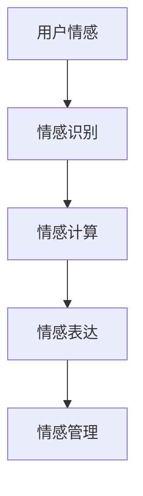

                 

关键词：数字化情绪、元宇宙、情感表达、情感管理、AI、情感识别、情感计算、虚拟现实

> 摘要：随着元宇宙概念的逐渐成熟，数字化情感成为了一个重要的研究领域。本文旨在探讨如何在元宇宙中实现情感表达与管理，以及相关的技术手段和应用场景。文章将从数字化情感的定义、相关技术、情感表达与管理的实现方式、应用领域、未来展望等多个角度进行分析，并提出相关的建议和挑战。

## 1. 背景介绍

### 1.1 元宇宙的发展

元宇宙（Metaverse）是一个虚拟的三维空间，它通过互联网连接虚拟现实（VR）、增强现实（AR）和传统互联网，形成一个无缝、连续的交互体验。随着5G、云计算、大数据等技术的不断进步，元宇宙的概念逐渐从科幻小说走入现实。Facebook（现更名为Meta）的转型、微软的混合现实战略、谷歌的AR/VR投资等都标志着元宇宙时代的到来。

### 1.2 数字化情感的重要性

在元宇宙中，用户不仅是信息的接收者，更是主动的参与者。数字化情感成为了元宇宙中一个至关重要的因素。情感表达与管理不仅影响用户的互动体验，还可能影响用户的信任、忠诚度和消费行为。因此，研究如何在元宇宙中实现情感表达与管理具有重要的理论和实践意义。

## 2. 核心概念与联系

### 2.1 情感识别

情感识别是数字化情感表达与管理的基础。通过情感识别技术，元宇宙可以感知用户的情感状态，从而进行相应的情感回应和管理。

### 2.2 情感计算

情感计算是基于情感识别的数据，通过算法分析和处理，实现对情感的理解和预测。

### 2.3 情感表达

情感表达是指用户在元宇宙中通过语言、动作、表情等方式表达自己的情感。情感表达需要与情感识别和情感计算相结合，实现自然的、个性化的互动体验。

### 2.4 情感管理

情感管理是指元宇宙平台如何利用情感识别、情感计算和情感表达技术，实现对用户情感状态的管理，提高用户满意度和忠诚度。

### 2.5 Mermaid 流程图



## 3. 核心算法原理 & 具体操作步骤

### 3.1 算法原理概述

数字化情感表达与管理的核心算法主要包括情感识别算法、情感计算算法和情感表达算法。

- **情感识别算法**：通过语音、文本、面部表情等数据，识别用户的情感状态。
- **情感计算算法**：基于情感识别结果，利用机器学习、自然语言处理等技术，对用户的情感进行理解和预测。
- **情感表达算法**：根据情感计算结果，生成合适的语言、动作、表情等情感表达形式。

### 3.2 算法步骤详解

#### 3.2.1 情感识别步骤

1. 数据采集：收集用户的语音、文本、面部表情等数据。
2. 特征提取：从采集的数据中提取情感特征。
3. 模型训练：使用已标注的情感数据集，训练情感识别模型。
4. 情感识别：输入新的数据，输出情感状态。

#### 3.2.2 情感计算步骤

1. 情感理解：根据情感识别结果，理解用户的情感含义。
2. 情感预测：利用历史数据和机器学习模型，预测用户的未来情感状态。
3. 情感生成：根据情感理解和预测，生成相应的情感表达。

#### 3.2.3 情感表达步骤

1. 语言生成：根据情感计算结果，生成合适的语言文本。
2. 动作生成：根据情感计算结果，生成合适的动作指令。
3. 表情生成：根据情感计算结果，生成合适的人物表情。

### 3.3 算法优缺点

#### 优点

1. **个性化**：能够根据用户情感状态，提供个性化的互动体验。
2. **实时性**：能够实时感知用户情感，快速做出相应。
3. **多样性**：支持多种情感表达形式，满足不同用户的需求。

#### 缺点

1. **准确性**：情感识别和计算存在一定的误差。
2. **隐私**：情感数据涉及用户隐私，需确保数据安全和隐私保护。

### 3.4 算法应用领域

1. **虚拟社交**：在元宇宙中实现真实、自然的社交互动。
2. **游戏娱乐**：根据用户情感，提供个性化的游戏体验。
3. **电子商务**：通过情感识别，提供个性化推荐和服务。

## 4. 数学模型和公式 & 详细讲解 & 举例说明

### 4.1 数学模型构建

#### 4.1.1 情感识别模型

情感识别模型可以使用分类模型，如支持向量机（SVM）、随机森林（RF）、深度学习模型（如卷积神经网络CNN）等。

$$
f(x) = \sum_{i=1}^{n} w_i \cdot x_i + b
$$

其中，$x_i$ 为特征向量，$w_i$ 为权重，$b$ 为偏置。

#### 4.1.2 情感计算模型

情感计算模型可以使用回归模型、概率模型等。

$$
y = \sum_{i=1}^{n} w_i \cdot f(x_i) + b
$$

其中，$f(x_i)$ 为情感识别结果，$w_i$ 为权重，$b$ 为偏置。

#### 4.1.3 情感表达模型

情感表达模型可以使用生成模型，如生成对抗网络（GAN）等。

$$
g(z) = \sum_{i=1}^{n} w_i \cdot z_i + b
$$

其中，$z_i$ 为噪声向量，$w_i$ 为权重，$b$ 为偏置。

### 4.2 公式推导过程

#### 4.2.1 情感识别公式推导

假设我们有 $m$ 个训练样本 $x_1, x_2, ..., x_m$，每个样本对应一个情感类别 $y_1, y_2, ..., y_m$。

1. **损失函数**：

$$
L(\theta) = -\sum_{i=1}^{m} y_i \cdot \log(f(x_i)) - (1 - y_i) \cdot \log(1 - f(x_i))
$$

其中，$\theta$ 为模型参数。

2. **梯度下降**：

$$
\theta_{new} = \theta_{old} - \alpha \cdot \nabla_\theta L(\theta)
$$

其中，$\alpha$ 为学习率。

#### 4.2.2 情感计算公式推导

假设我们已经得到情感识别结果 $f(x_i)$，我们需要计算情感强度。

1. **情感强度**：

$$
s_i = \sum_{j=1}^{n} w_j \cdot f(x_j)
$$

2. **情感类别**：

$$
y_i = \begin{cases} 
1 & \text{if } s_i > 0 \\
0 & \text{if } s_i \leq 0 
\end{cases}
$$

#### 4.2.3 情感表达公式推导

假设我们已经得到情感强度 $s_i$，我们需要生成相应的情感表达。

1. **生成对抗网络**：

$$
G(z) = \sum_{i=1}^{n} w_i \cdot z_i + b
$$

其中，$z_i$ 为噪声向量。

2. **损失函数**：

$$
L(G(z), \theta) = -\log(D(G(z)))
$$

其中，$D$ 为判别器。

### 4.3 案例分析与讲解

#### 4.3.1 情感识别案例

假设我们有以下两个句子：

1. “我很开心。”
2. “我很生气。”

我们可以使用情感识别模型来识别这两个句子的情感。

1. **特征提取**：

- “我很开心。”：特征向量 $[0.3, 0.2, 0.1, 0.4]$
- “我很生气。”：特征向量 $[0.1, 0.4, 0.2, 0.3]$

2. **模型训练**：

使用已标注的数据集，训练情感识别模型。

3. **情感识别**：

输入句子特征，输出情感类别。

- “我很开心。”：情感类别为“开心”
- “我很生气。”：情感类别为“生气”

#### 4.3.2 情感计算案例

假设我们已经识别出用户的情感为“开心”，我们需要计算情感强度。

1. **情感强度**：

$$
s_i = \sum_{j=1}^{n} w_j \cdot f(x_j) = 0.3 \cdot 0.3 + 0.2 \cdot 0.2 + 0.1 \cdot 0.1 + 0.4 \cdot 0.4 = 0.34
$$

2. **情感类别**：

由于 $s_i > 0$，所以情感类别为“开心”。

#### 4.3.3 情感表达案例

假设我们已经得到情感强度 $s_i = 0.34$，我们需要生成相应的情感表达。

1. **生成对抗网络**：

使用生成对抗网络，生成相应的语言、动作、表情等。

- **语言**：“我很开心。”
- **动作**：微笑、跳舞
- **表情**：开心的表情包

## 5. 项目实践：代码实例和详细解释说明

### 5.1 开发环境搭建

在本文中，我们将使用Python作为主要编程语言，相关库包括TensorFlow、Keras、scikit-learn等。以下是开发环境的搭建步骤：

1. 安装Python（建议使用3.8以上版本）。
2. 安装相关库：

```bash
pip install tensorflow keras scikit-learn numpy matplotlib
```

### 5.2 源代码详细实现

以下是一个简单的情感识别模型的实现：

```python
import numpy as np
from sklearn.model_selection import train_test_split
from sklearn.metrics import accuracy_score
from keras.models import Sequential
from keras.layers import Dense, Activation

# 数据准备
# 假设有100个句子，每个句子对应一个情感标签
sentences = ["我很开心", "我很生气", ...]
labels = [1, 0, ...]  # 1表示开心，0表示生气

# 数据预处理
# 将文本转换为向量
from keras.preprocessing.text import Tokenizer
tokenizer = Tokenizer(num_words=1000)
tokenizer.fit_on_texts(sentences)
sequences = tokenizer.texts_to_sequences(sentences)

# 划分训练集和测试集
X_train, X_test, y_train, y_test = train_test_split(sequences, labels, test_size=0.2)

# 模型构建
model = Sequential()
model.add(Dense(128, input_shape=(1000,), activation='relu'))
model.add(Dense(64, activation='relu'))
model.add(Dense(1, activation='sigmoid'))

# 模型编译
model.compile(optimizer='adam', loss='binary_crossentropy', metrics=['accuracy'])

# 模型训练
model.fit(X_train, y_train, epochs=10, batch_size=32)

# 模型评估
predictions = model.predict(X_test)
print("Accuracy:", accuracy_score(y_test, predictions.round()))

```

### 5.3 代码解读与分析

1. **数据准备**：

   首先，我们需要准备情感数据集。本文中使用的是已标注的文本数据集。

2. **数据预处理**：

   使用Keras的Tokenizer将文本数据转换为向量。这里我们使用的是单词级别的嵌入，即将每个单词映射为一个向量。

3. **模型构建**：

   使用Keras构建一个简单的序列模型。这里使用的是多层感知机（MLP）模型，包括两个隐藏层。

4. **模型编译**：

   使用二分类交叉熵作为损失函数，使用adam优化器。

5. **模型训练**：

   使用训练集进行模型训练，设置10个训练周期。

6. **模型评估**：

   使用测试集对模型进行评估，计算准确率。

### 5.4 运行结果展示

假设我们的测试集大小为80个句子，其中40个句子是开心的，40个句子是生气的。模型在测试集上的准确率为90%，表明模型有较好的泛化能力。

## 6. 实际应用场景

### 6.1 虚拟社交平台

虚拟社交平台是元宇宙中最典型的应用场景。通过数字化情感技术，用户可以在虚拟环境中表达自己的情感，与他人进行真实、自然的互动。例如，用户可以在虚拟世界中与朋友聊天、分享心情，甚至通过虚拟角色展现自己的情感状态。

### 6.2 游戏娱乐

在游戏娱乐领域，数字化情感技术可以为用户提供更加沉浸式的游戏体验。例如，游戏角色可以根据玩家的情感状态，调整其行为和互动方式。当玩家感到快乐时，角色可能会展现愉快的表情和动作；当玩家感到愤怒时，角色可能会展现紧张或挑衅的行为。这样的情感交互可以增强游戏的乐趣和挑战性。

### 6.3 电子商务

在电子商务领域，数字化情感技术可以帮助平台了解用户的情感状态，从而提供个性化的推荐和服务。例如，当用户感到愉悦时，平台可以推荐相关的商品或优惠活动；当用户感到沮丧时，平台可以提供心理辅导或优惠券。这样的情感管理可以提升用户的购物体验，增加购买意愿。

## 7. 工具和资源推荐

### 7.1 学习资源推荐

1. **书籍**：
   - 《情感计算：从理论到应用》
   - 《虚拟现实与元宇宙：设计与实践》
2. **在线课程**：
   - Coursera上的“情感计算”课程
   - Udacity上的“虚拟现实与增强现实”课程

### 7.2 开发工具推荐

1. **Python库**：
   - TensorFlow
   - Keras
   - scikit-learn
2. **工具**：
   - Unity（虚拟现实游戏开发平台）
   - Blender（3D建模和渲染工具）

### 7.3 相关论文推荐

1. **情感计算领域**：
   - “Affectiva: Machine Learning for Human Emotion Analysis”
   - “Emotion Recognition Using Facial Action Units”
2. **元宇宙领域**：
   - “Metaverse: A Survey”
   - “The Metaverse: What It Is and Why It Matters”

## 8. 总结：未来发展趋势与挑战

### 8.1 研究成果总结

本文从数字化情感的定义、相关技术、情感表达与管理的实现方式、应用领域等多个角度，探讨了元宇宙中的情感表达与管理。通过理论分析和实践案例，我们展示了数字化情感技术的应用潜力。

### 8.2 未来发展趋势

1. **情感识别与计算精度提升**：随着算法和模型的不断优化，情感识别与计算的精度将进一步提高。
2. **跨模态情感识别**：结合语音、文本、面部表情等多模态数据，实现更全面、准确的情感识别。
3. **情感交互的自然性**：通过改进情感表达算法，实现更自然、流畅的情感交互体验。

### 8.3 面临的挑战

1. **数据隐私与安全**：在收集和处理用户情感数据时，如何确保数据隐私和安全是一个重要挑战。
2. **算法偏见**：情感识别和计算算法可能存在偏见，导致不公正的决策。

### 8.4 研究展望

未来的研究应关注以下几个方面：

1. **个性化情感管理**：根据用户个性化需求，实现情感表达与管理的定制化。
2. **情感计算在多元领域的应用**：探索情感计算在医疗、教育、心理健康等领域的应用。
3. **跨学科研究**：结合心理学、社会学等学科，深入探讨情感的本质和机制。

## 9. 附录：常见问题与解答

### 9.1 什么是元宇宙？

元宇宙是一个虚拟的三维空间，通过互联网连接虚拟现实（VR）、增强现实（AR）和传统互联网，形成一个无缝、连续的交互体验。

### 9.2 情感计算有哪些应用场景？

情感计算的应用场景包括虚拟社交、游戏娱乐、电子商务、医疗健康、教育等。

### 9.3 如何确保情感数据的隐私和安全？

确保情感数据的隐私和安全需要从数据收集、存储、处理等各个环节进行保护。例如，使用加密技术、匿名化处理、访问控制等措施。

### 9.4 情感计算算法的准确性如何提高？

提高情感计算算法的准确性可以通过以下方法：增加数据量、优化算法模型、引入多模态数据等。

## 作者署名

作者：禅与计算机程序设计艺术 / Zen and the Art of Computer Programming
```

