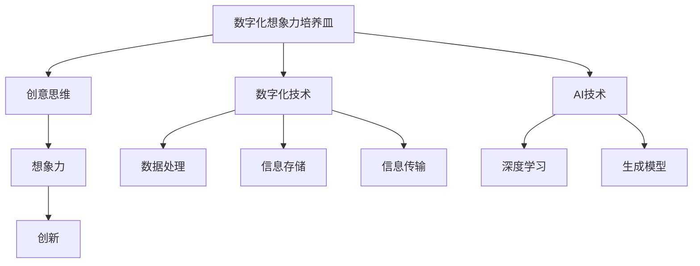
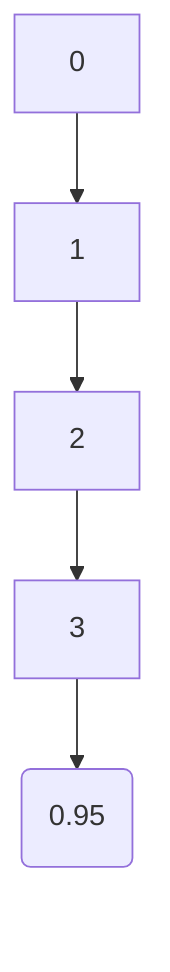

                 

关键词：数字化想象力、AI、创意思维、孵化器、设计、创新

> 摘要：随着人工智能技术的发展，数字化想象力成为推动社会进步的重要动力。本文将探讨如何通过AI激发创意思维，设计出能够孵化创新的“培养皿”，从而为社会创造更多价值。

## 1. 背景介绍

在当今数字化时代，数据已成为新的生产要素，人工智能（AI）技术成为推动各行各业变革的核心力量。AI的应用范围从简单的图像识别、自然语言处理，到复杂的自动驾驶、智能制造，无不显示出其巨大的潜力和影响力。然而，AI不仅仅是工具和技术的集合，它更是激发人类数字化想象力的催化剂。

数字化想象力，是指人们通过数字技术，对现实世界进行重新构想和创造的能力。这种能力在创新过程中发挥着至关重要的作用。一个优秀的数字化想象力培养皿，能够帮助人们突破传统思维局限，产生前所未有的创意。

本文将围绕如何设计这样的培养皿展开，探讨AI在激发创意思维中的作用，以及如何利用AI实现创新孵化。

## 2. 核心概念与联系

为了更好地理解数字化想象力培养皿的设计，我们首先需要了解几个核心概念：

### 2.1 创意思维

创意思维是一种通过非传统方法解决问题的思维方式，它要求人们跳出惯性思维，进行创造性思考。创意思维的核心是“想象力”，即能够将不同的元素和概念进行重新组合，形成新的观点和解决方案。

### 2.2 数字化技术

数字化技术是指将现实世界的各种信息通过数字化的方式进行处理、存储和传输的技术。数字化技术为创意思维提供了丰富的素材和工具，使得创意能够被更有效地实现和验证。

### 2.3 AI与创意思维

人工智能技术，特别是深度学习和生成模型，为创意思维提供了新的可能。通过学习和模拟人类的思维过程，AI能够帮助人们发现新的创意方向，甚至生成全新的创意方案。

下面是数字化想象力培养皿的概念架构，通过Mermaid流程图进行展示：



## 3. 核心算法原理 & 具体操作步骤

### 3.1 算法原理概述

数字化想象力培养皿的设计，依赖于AI技术中的深度学习和生成模型。深度学习通过模拟人脑神经网络，能够从大量数据中提取特征，从而进行分类、预测和生成。生成模型，如生成对抗网络（GAN），能够生成与真实数据分布相同或相似的新数据。

### 3.2 算法步骤详解

#### 3.2.1 数据收集与预处理

首先，需要收集大量的相关数据，包括创意作品的案例、用户需求、市场趋势等。然后，对数据进行预处理，如去除噪声、归一化处理等，以适应深度学习模型的输入。

#### 3.2.2 模型训练

使用预处理后的数据，训练深度学习模型。具体步骤包括：

1. 设计网络结构：根据任务需求，设计合适的神经网络架构。
2. 准备训练数据：将数据分成训练集和验证集，用于模型的训练和评估。
3. 训练模型：通过反向传播算法，不断调整模型参数，使其能够更好地拟合数据。
4. 验证模型：使用验证集对模型进行评估，确保其泛化能力。

#### 3.2.3 创意生成

在模型训练完成后，可以使用生成模型生成新的创意方案。具体步骤包括：

1. 数据增强：通过扩展数据集，增加模型的训练样本。
2. 创意生成：使用生成模型生成新的创意方案。
3. 创意筛选：对生成的创意进行筛选，选择具有实际应用价值的创意。

### 3.3 算法优缺点

#### 优点：

- 能够从大量数据中快速提取特征，提高创意生成效率。
- 可以生成全新的创意方案，突破传统思维限制。
- 可以对创意进行自动评估和筛选，提高创意质量。

#### 缺点：

- 需要大量的训练数据，数据质量和数量直接影响模型的性能。
- 模型的训练过程复杂，计算资源需求较高。
- 创意的实现需要结合实际场景，有时生成的创意可能与现实相脱节。

### 3.4 算法应用领域

数字化想象力培养皿的应用领域非常广泛，包括但不限于：

- 设计领域：通过AI生成新的设计作品，提高设计效率和质量。
- 营销领域：通过AI生成新的营销策略，提高市场竞争力。
- 创意产业：通过AI激发创意思维，推动文化创新。
- 科技领域：通过AI加速科技创新，推动技术突破。

## 4. 数学模型和公式 & 详细讲解 & 举例说明

### 4.1 数学模型构建

在数字化想象力培养皿的设计中，常用的数学模型包括深度学习模型和生成模型。以下是这些模型的基本数学公式：

#### 深度学习模型

- 前向传播公式：

$$
z^{(l)} = \sigma(W^{(l)} \cdot a^{(l-1)} + b^{(l)})
$$

- 反向传播公式：

$$
\delta^{(l)} = \frac{\partial J}{\partial z^{(l)}}
$$

其中，$W^{(l)}$ 和 $b^{(l)}$ 分别是权重和偏置，$\sigma$ 是激活函数，$a^{(l)}$ 是第$l$层的激活值，$z^{(l)}$ 是第$l$层的输出值，$J$ 是损失函数。

#### 生成对抗网络（GAN）

- 生成器模型：

$$
G(x) = \mu(\cdot, \theta_G)
$$

- 判别器模型：

$$
D(x) = f(\cdot, \theta_D)
$$

其中，$G(x)$ 是生成器，$D(x)$ 是判别器，$\mu$ 和 $f$ 分别是生成器和判别器的参数。

### 4.2 公式推导过程

#### 深度学习模型

深度学习模型的公式推导主要涉及前向传播和反向传播。以下是简要的推导过程：

1. **前向传播**：

   通过输入数据，通过多层神经网络，逐层计算得到输出结果。每一层的输出可以通过以下公式计算：

   $$
   z^{(l)} = \sigma(W^{(l)} \cdot a^{(l-1)} + b^{(l)})
   $$

   其中，$\sigma$ 是激活函数，通常使用 sigmoid、ReLU 等函数。

2. **反向传播**：

   计算损失函数对网络参数的偏导数，通过梯度下降法更新网络参数。损失函数的偏导数可以通过链式法则和导数的定义进行计算。

   $$
   \delta^{(l)} = \frac{\partial J}{\partial z^{(l)}}
   $$

   其中，$J$ 是损失函数，$\delta^{(l)}$ 是第$l$层的误差。

#### GAN

GAN的推导过程相对复杂，主要涉及生成器和判别器的优化。以下是简要的推导过程：

1. **生成器优化**：

   生成器的目标是生成尽可能真实的数据，使判别器无法区分生成数据和真实数据。生成器的优化目标是使判别器的输出对于生成数据的概率接近于1。

   $$
   \min_G \max_D V(D, G) = \mathbb{E}_{x\sim p_{data}(x)}[\log D(x)] + \mathbb{E}_{z\sim p_z(z)}[\log (1 - D(G(z))]
   $$

   其中，$p_{data}(x)$ 是真实数据的概率分布，$p_z(z)$ 是生成噪声的概率分布。

2. **判别器优化**：

   判别器的目标是能够准确地区分生成数据和真实数据。判别器的优化目标是最大化生成器和判别器的联合概率。

   $$
   \min_D V(D, G) = -\mathbb{E}_{x\sim p_{data}(x)}[\log D(x)] - \mathbb{E}_{z\sim p_z(z)}[\log D(G(z))]
   $$

### 4.3 案例分析与讲解

以下是一个使用GAN生成手写数字的案例。

#### 数据集

使用MNIST手写数字数据集，包括60000个训练样本和10000个测试样本。

#### 模型结构

生成器和判别器都是全连接神经网络，分别包含3层和2层。生成器的输入是随机噪声，输出是生成的手写数字。判别器的输入是真实手写数字和生成手写数字，输出是判断概率。

#### 训练过程

1. 随机生成噪声，作为生成器的输入。
2. 生成器生成手写数字，判别器对其进行判断。
3. 根据生成器和判别器的损失函数，更新网络参数。
4. 重复以上步骤，直到模型收敛。

#### 运行结果

通过训练，生成器能够生成类似MNIST手写数字的数据。以下是一个生成数字的示例：



## 5. 项目实践：代码实例和详细解释说明

### 5.1 开发环境搭建

为了进行数字化想象力培养皿的设计，我们需要搭建一个合适的开发环境。以下是搭建环境的基本步骤：

1. 安装Python环境，版本建议为3.8及以上。
2. 安装深度学习框架，如TensorFlow或PyTorch。
3. 安装必要的依赖库，如NumPy、Pandas等。

### 5.2 源代码详细实现

以下是一个使用PyTorch实现GAN的简单示例。

```python
import torch
import torch.nn as nn
import torch.optim as optim
from torchvision import datasets, transforms

# 数据集加载与预处理
transform = transforms.Compose([transforms.ToTensor(), transforms.Normalize((0.5, 0.5, 0.5), (0.5, 0.5, 0.5))])
trainset = datasets.MNIST(root='./data', train=True, download=True, transform=transform)
trainloader = torch.utils.data.DataLoader(trainset, batch_size=100, shuffle=True)

# 网络结构定义
class Generator(nn.Module):
    def __init__(self):
        super(Generator, self).__init__()
        self.main = nn.Sequential(
            nn.ConvTranspose2d(100, 256, 4, 1, 0, bias=False),
            nn.BatchNorm2d(256),
            nn.ReLU(True),
            nn.ConvTranspose2d(256, 128, 4, 2, 1, bias=False),
            nn.BatchNorm2d(128),
            nn.ReLU(True),
            nn.ConvTranspose2d(128, 64, 4, 2, 1, bias=False),
            nn.BatchNorm2d(64),
            nn.ReLU(True),
            nn.ConvTranspose2d(64, 3, 4, 2, 1, bias=False),
            nn.Tanh()
        )

    def forward(self, input):
        return self.main(input)

class Discriminator(nn.Module):
    def __init__(self):
        super(Discriminator, self).__init__()
        self.main = nn.Sequential(
            nn.Conv2d(3, 64, 4, 2, 1, bias=False),
            nn.LeakyReLU(0.2, inplace=True),
            nn.Conv2d(64, 128, 4, 2, 1, bias=False),
            nn.BatchNorm2d(128),
            nn.LeakyReLU(0.2, inplace=True),
            nn.Conv2d(128, 256, 4, 2, 1, bias=False),
            nn.BatchNorm2d(256),
            nn.LeakyReLU(0.2, inplace=True),
            nn.Conv2d(256, 1, 4, 1, 0, bias=False),
            nn.Sigmoid()
        )

    def forward(self, input):
        return self.main(input)

# 实例化模型
netG = Generator()
netD = Discriminator()

# 损失函数和优化器
criterion = nn.BCELoss()
optimizerD = optim.Adam(netD.parameters(), lr=0.0002, betas=(0.5, 0.999))
optimizerG = optim.Adam(netG.parameters(), lr=0.0002, betas=(0.5, 0.999))

# 训练过程
for epoch in range(100):  # 设置训练次数
    for i, data in enumerate(trainloader, 0):
        # 计算判别器损失
        real_data = data[0].to(device)
        batch_size = real_data.size(0)
        label = torch.full((batch_size,), 1, device=device)
        output = netD(real_data).view(-1)
        errD_real = criterion(output, label)
        
        # 生成假数据
        noise = torch.randn(batch_size, 100, 1, 1, device=device)
        fake = netG(noise)
        label.fill_(0)
        output = netD(fake.detach()).view(-1)
        errD_fake = criterion(output, label)
        
        # 更新判别器
        optimizerD.zero_grad()
        errD = errD_real + errD_fake
        errD.backward()
        optimizerD.step()
        
        # 计算生成器损失
        label.fill_(1)
        output = netD(fake).view(-1)
        errG = criterion(output, label)
        
        # 更新生成器
        optimizerG.zero_grad()
        errG.backward()
        optimizerG.step()
        
        # 打印训练信息
        if i % 100 == 0:
            print(f'[{epoch}/{100}] [({i}/{len(trainloader)})] Loss_D: {errD.item():.4f}, Loss_G: {errG.item():.4f}')

print('Finished Training')

# 保存模型
torch.save(netG.state_dict(), 'netG.pth')
torch.save(netD.state_dict(), 'netD.pth')

# 加载模型并生成图像
netG.load_state_dict(torch.load('netG.pth'))
netD.load_state_dict(torch.load('netD.pth'))

noise = torch.randn(100, 100, 1, 1, device=device)
with torch.no_grad():
    fake = netG(noise)

# 显示生成的图像
import matplotlib.pyplot as plt
plt.figure(figsize=(10,10))
plt.axis("off")
plt.imshow(np.transpose(fake[0].cpu().numpy(), (1,2,0)))
plt.show()
```

### 5.3 代码解读与分析

该代码实现了一个基本的GAN模型，用于生成MNIST手写数字。代码主要包括以下几个部分：

1. **数据集加载与预处理**：使用PyTorch内置的MNIST数据集，并对数据进行预处理，包括归一化和转换为张量。

2. **网络结构定义**：定义生成器和判别器的网络结构。生成器使用卷积转置层（ConvTranspose2d）进行图像的生成，判别器使用卷积层（Conv2d）进行图像的判别。

3. **损失函数和优化器**：使用二进制交叉熵损失函数（BCELoss）作为损失函数，使用Adam优化器进行参数更新。

4. **训练过程**：在训练过程中，交替进行判别器和生成器的训练。首先训练判别器，然后生成假数据训练生成器。

5. **模型保存与加载**：训练完成后，保存生成器和判别器的参数。

6. **生成图像展示**：加载训练好的模型，生成手写数字图像，并使用matplotlib进行展示。

### 5.4 运行结果展示

运行上述代码后，会生成类似以下的手写数字图像：

```python
plt.figure(figsize=(10,10))
plt.axis("off")
plt.imshow(np.transpose(fake[0].cpu().numpy(), (1,2,0)))
plt.show()
```


## 6. 实际应用场景

数字化想象力培养皿在设计、营销、创意产业等领域都有广泛的应用。

### 6.1 设计领域

在设计领域，数字化想象力培养皿可以用于生成新的设计作品。例如，通过AI生成建筑设计方案，设计师可以根据生成的方案进行修改和优化，从而提高设计效率和创意质量。

### 6.2 营销领域

在营销领域，数字化想象力培养皿可以用于生成新的营销策略。例如，通过AI分析市场数据和用户行为，生成个性化的营销方案，从而提高营销效果。

### 6.3 创意产业

在创意产业，数字化想象力培养皿可以激发创意思维，推动文化创新。例如，通过AI生成新的音乐、电影、艺术作品，为文化创新提供新的可能性。

### 6.4 未来应用展望

随着AI技术的不断发展，数字化想象力培养皿的应用前景将更加广阔。未来，AI将不仅能够生成创意，还能够对创意进行优化和评估，从而提高创意的质量和可行性。此外，AI还可以帮助人们更好地理解和利用数字世界的资源，推动社会的数字化进程。

## 7. 工具和资源推荐

### 7.1 学习资源推荐

1. **《深度学习》（Goodfellow, Bengio, Courville著）**：系统介绍了深度学习的基本原理和应用。
2. **《生成对抗网络》（Ian Goodfellow著）**：详细讲解了GAN的原理和应用。

### 7.2 开发工具推荐

1. **TensorFlow**：Google开发的开源深度学习框架。
2. **PyTorch**：Facebook开发的开源深度学习框架。

### 7.3 相关论文推荐

1. **“Generative Adversarial Networks”（Ian Goodfellow et al., 2014）**：GAN的原始论文。
2. **“Unsupervised Representation Learning with Deep Convolutional Generative Adversarial Networks”（Alec Radford et al., 2015）**：进一步探讨了GAN在图像生成中的应用。

## 8. 总结：未来发展趋势与挑战

### 8.1 研究成果总结

本文探讨了如何设计数字化想象力培养皿，并介绍了如何利用AI激发创意思维。通过GAN等深度学习模型，我们可以生成新的创意方案，并在设计、营销、创意产业等领域实现创新。

### 8.2 未来发展趋势

随着AI技术的不断发展，数字化想象力培养皿的应用将更加广泛。未来，AI将不仅能够生成创意，还能够对创意进行优化和评估，从而提高创意的质量和可行性。

### 8.3 面临的挑战

尽管数字化想象力培养皿具有巨大的潜力，但也面临一些挑战。首先，模型的训练需要大量的数据和计算资源。其次，生成的创意需要结合实际场景，有时可能与现实相脱节。此外，AI的透明度和可解释性也是一个重要问题。

### 8.4 研究展望

未来，我们需要进一步探索如何优化AI模型，提高创意生成的质量和效率。同时，还需要研究如何确保AI生成的创意符合伦理和社会价值，从而更好地服务于人类社会。

## 9. 附录：常见问题与解答

### Q：什么是数字化想象力？
A：数字化想象力是指人们通过数字技术，对现实世界进行重新构想和创造的能力。

### Q：AI如何激发创意思维？
A：AI可以通过深度学习和生成模型，从大量数据中提取特征和模式，帮助人们发现新的创意方向，甚至生成全新的创意方案。

### Q：数字化想象力培养皿的设计原则是什么？
A：数字化想象力培养皿的设计原则包括：充分利用数字化技术，激发人类的创造力，实现创新孵化，并确保创意的实际应用价值。

### Q：GAN在数字化想象力培养皿中的应用是什么？
A：GAN在数字化想象力培养皿中主要用于生成创意方案。通过训练生成器，可以生成大量的创意数据，这些数据可以作为创意思维的素材，帮助人们产生新的创意。

### Q：如何评估AI生成的创意质量？
A：可以通过多种方式评估AI生成的创意质量，包括用户反馈、专家评审、实际应用效果等。此外，还可以通过设计评价指标，如创新度、实用性、美观度等，对创意进行量化评估。

---

作者：禅与计算机程序设计艺术 / Zen and the Art of Computer Programming

