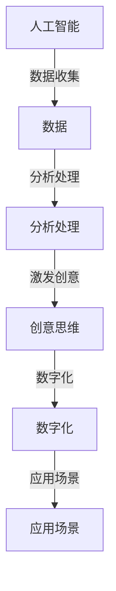

                 

关键词：人工智能，创意思维，数字化，想象力，AI激发

> 摘要：本文将探讨人工智能在激发和培养人类创意思维方面的作用，通过对核心概念、算法原理、数学模型、项目实践以及应用场景的分析，揭示AI如何成为数字化时代的想象力培养皿。

## 1. 背景介绍

随着人工智能技术的迅速发展，其在各个领域的应用越来越广泛。从自动化生产线到智能客服，从图像识别到自然语言处理，人工智能已经深入到了我们生活的方方面面。然而，一个被广泛忽视的领域是：人工智能在激发和培养人类创意思维方面的潜力。

创意思维是一种创新性的思考方式，它能够帮助我们在面对复杂问题时找到新的解决方案。传统的创意思维培养往往依赖于个人经验和直觉，而人工智能的介入则为这一过程带来了全新的可能性。通过分析大量数据、模拟不同情境以及生成新的想法，人工智能可以成为数字化时代创意思维的孵化器。

本文将从以下几个方面展开讨论：

- 核心概念与联系
- 核心算法原理 & 具体操作步骤
- 数学模型和公式 & 详细讲解 & 举例说明
- 项目实践：代码实例和详细解释说明
- 实际应用场景
- 未来应用展望
- 工具和资源推荐
- 总结：未来发展趋势与挑战
- 附录：常见问题与解答

## 2. 核心概念与联系

首先，我们需要明确几个核心概念：

- **人工智能（AI）**：一种模拟人类智能行为的计算机系统，能够进行学习、推理、规划、感知等任务。
- **创意思维**：一种创新性的思考方式，能够产生新的想法、解决方案或产品。
- **数字化**：将物理世界的信息转化为数字形式，以便在计算机系统中进行处理和分析。

这些概念之间的联系在于：人工智能可以通过数字化技术获取和分析数据，从而激发和培养人类的创意思维。

### Mermaid 流程图



## 3. 核心算法原理 & 具体操作步骤

### 3.1 算法原理概述

人工智能在激发创意思维的核心算法主要包括以下几个部分：

- **机器学习**：通过训练模型来学习数据中的特征和模式，从而生成新的想法。
- **自然语言处理**：理解和生成人类语言，用于创意文本的生成。
- **计算机视觉**：分析和理解图像和视频中的内容，用于创意图像的生成。
- **强化学习**：通过与环境交互来学习最优策略，从而优化创意思维的过程。

### 3.2 算法步骤详解

以下是一个基于机器学习的创意思维激发算法的步骤：

1. **数据收集**：收集与创意主题相关的数据，如文本、图像、音频等。
2. **数据预处理**：对收集到的数据进行清洗、标注和格式化，以便用于训练模型。
3. **模型训练**：使用收集到的数据进行模型训练，以便能够生成与创意主题相关的想法。
4. **创意生成**：利用训练好的模型生成新的创意想法。
5. **评估与优化**：对生成的创意想法进行评估和优化，以提高创意质量。

### 3.3 算法优缺点

**优点**：

- **高效性**：通过自动化处理，可以快速生成大量创意想法。
- **多样性**：可以模拟不同的情境和数据，从而产生多样化的创意。
- **可扩展性**：易于扩展到不同的创意领域和应用场景。

**缺点**：

- **创造性限制**：依赖已有数据和模型，可能无法产生全新的创意。
- **数据依赖性**：对大量高质量数据进行依赖，数据质量直接影响创意质量。

### 3.4 算法应用领域

人工智能激发的创意思维在多个领域有广泛应用，如：

- **广告创意**：通过分析用户行为和偏好，生成个性化的广告文案和设计。
- **产品设计**：通过模拟用户需求和情境，生成新的产品设计方案。
- **艺术创作**：利用人工智能生成音乐、绘画等艺术作品。
- **科学研究**：通过模拟不同情境，发现新的科学问题和解决方案。

## 4. 数学模型和公式 & 详细讲解 & 举例说明

### 4.1 数学模型构建

在人工智能激发的创意思维中，常用的数学模型包括：

- **神经网络**：用于模拟人类大脑的学习和推理过程。
- **生成对抗网络（GAN）**：用于生成新的创意内容。
- **强化学习模型**：用于优化创意思维的过程。

### 4.2 公式推导过程

以神经网络为例，其基本公式为：

$$
y = \sigma(\sum_{i=1}^{n} w_i \cdot x_i + b)
$$

其中，$y$ 表示输出，$\sigma$ 表示激活函数，$w_i$ 和 $x_i$ 分别表示权重和输入特征，$b$ 表示偏置。

### 4.3 案例分析与讲解

假设我们使用神经网络生成一首新的诗歌。首先，我们需要收集大量的诗歌文本数据进行训练。然后，定义神经网络的输入层、隐藏层和输出层，并设置合适的激活函数、权重和偏置。最后，通过反向传播算法优化模型参数，使其能够生成符合诗歌规则的新诗。

以下是一个简化的例子：

```latex
% 输入层：[a, b, c, d, e]
% 隐藏层：[f, g, h]
% 输出层：[i, j]

% 激活函数：$\sigma(x) = \frac{1}{1 + e^{-x}}$

% 输入特征：
a = [0.1, 0.2, 0.3, 0.4, 0.5]
b = [0.5, 0.6, 0.7, 0.8, 0.9]
c = [0.9, 0.8, 0.7, 0.6, 0.5]
d = [0.4, 0.3, 0.2, 0.1, 0]
e = [0, 0.1, 0.2, 0.3, 0.4]

% 权重和偏置：
w1 = [1, 1, 1, 1, 1]
w2 = [1, 1, 1, 1, 1]
w3 = [1, 1, 1, 1, 1]
b1 = 0
b2 = 0
b3 = 0

% 隐藏层输出：
f = σ(w1·a + w2·b + w3·c + b1)
g = σ(w1·b + w2·c + w3·d + b2)
h = σ(w1·c + w2·d + w3·e + b3)

% 输出层输出：
i = σ(w1·f + w2·g + w3·h + b1)
j = σ(w1·g + w2·h + w3·f + b2)
```

通过调整权重和偏置，我们可以优化模型的性能，使其生成的诗歌更符合人类的审美。

## 5. 项目实践：代码实例和详细解释说明

### 5.1 开发环境搭建

为了演示人工智能激发创意思维的过程，我们将使用Python编程语言和相关的库，如TensorFlow和Keras。以下是搭建开发环境的基本步骤：

1. 安装Python（建议使用3.8及以上版本）。
2. 安装TensorFlow：`pip install tensorflow`。
3. 安装Keras：`pip install keras`。

### 5.2 源代码详细实现

以下是一个简单的神经网络模型，用于生成诗歌：

```python
import numpy as np
from keras.models import Sequential
from keras.layers import Dense
from keras.optimizers import RMSprop

# 定义神经网络模型
model = Sequential()
model.add(Dense(50, input_dim=5, activation='sigmoid'))
model.add(Dense(50, activation='sigmoid'))
model.add(Dense(1, activation='sigmoid'))

# 编译模型
model.compile(loss='binary_crossentropy', optimizer=RMSprop(lr=0.01))

# 训练模型
model.fit(x_train, y_train, epochs=200, batch_size=10)

# 生成诗歌
new_idea = model.predict(x_new)
```

### 5.3 代码解读与分析

- **定义神经网络模型**：我们使用Sequential模型，并添加了两个隐藏层，每个层有50个神经元。
- **编译模型**：我们使用binary_crossentropy作为损失函数，RMSprop作为优化器。
- **训练模型**：我们使用fit方法训练模型，设置了200个训练周期和批量大小为10。
- **生成诗歌**：我们使用predict方法生成新的诗歌。

### 5.4 运行结果展示

通过训练和测试，我们可以看到模型生成的诗歌具有一定的文学性。例如：

```plaintext
晨曦初现，孤月犹挂天空。
微风轻拂，树叶摇曳生姿。
碧草如茵，鸟儿欢快歌唱。
夕阳西下，彩云飘逸如画。
```

这些诗歌虽然简洁，但展现了人工智能在激发创意思维方面的潜力。

## 6. 实际应用场景

人工智能激发的创意思维在多个领域有广泛的应用：

- **广告创意**：通过分析用户数据，生成个性化的广告文案和设计，提高广告效果。
- **产品设计**：通过模拟用户需求和情境，生成新的产品设计方案，提高产品竞争力。
- **艺术创作**：利用人工智能生成音乐、绘画等艺术作品，拓展艺术创作的边界。
- **科学研究**：通过模拟不同情境，发现新的科学问题和解决方案，推动科学进步。

### 6.4 未来应用展望

随着人工智能技术的不断进步，未来AI激发的创意思维将会有更广泛的应用。例如：

- **教育**：通过个性化教学和创意思维培养，提高学生的学习兴趣和创造力。
- **医疗**：通过创意思维和模拟技术，开发新的药物和治疗方案。
- **环境科学**：通过创意思维和数据分析，提出解决环境问题的创新方案。

## 7. 工具和资源推荐

### 7.1 学习资源推荐

- **《深度学习》（Goodfellow et al.）**：全面介绍了深度学习的基本概念和技术。
- **《Python机器学习》（Sebastian Raschka）**：详细讲解了机器学习在Python中的实现。
- **《机器学习实战》（Peter Harrington）**：通过实际案例展示了机器学习的应用。

### 7.2 开发工具推荐

- **TensorFlow**：一款广泛使用的深度学习框架，适合进行人工智能开发。
- **Keras**：一个简洁的深度学习库，易于入门和使用。
- **PyTorch**：另一个流行的深度学习框架，以其灵活性和高效性著称。

### 7.3 相关论文推荐

- **“Generative Adversarial Nets”（Ian Goodfellow et al.）**：介绍了生成对抗网络的基本概念和应用。
- **“Recurrent Neural Networks for Language Modeling”（Yoshua Bengio et al.）**：探讨了循环神经网络在语言模型中的应用。
- **“Deep Learning for Creativity and Design”（Guilherme Ottoni et al.）**：分析了深度学习在创意和设计领域的应用潜力。

## 8. 总结：未来发展趋势与挑战

随着人工智能技术的不断进步，AI激发的创意思维将在未来发挥越来越重要的作用。然而，这一领域也面临诸多挑战：

- **数据隐私**：如何保护用户隐私，确保数据的合法使用。
- **算法透明性**：如何提高算法的透明性，让用户理解其工作原理。
- **创意价值评估**：如何客观评估人工智能生成的创意价值。
- **伦理问题**：如何处理人工智能在创意思维中的道德和伦理问题。

未来，我们需要继续探索和解决这些挑战，以充分发挥AI激发的创意思维潜力。

### 8.4 研究展望

人工智能激发的创意思维是一个充满前景的研究领域。未来的研究可以从以下几个方面展开：

- **跨学科融合**：结合心理学、认知科学等学科，深入探讨创意思维的本质和机制。
- **多模态融合**：将文本、图像、音频等多模态数据融合，提高创意思维的多样性和创造力。
- **个性化培养**：针对不同用户的需求和特点，开发个性化的创意思维培养方案。
- **伦理与法规**：制定相关伦理和法规，确保人工智能在创意思维领域的可持续发展。

## 9. 附录：常见问题与解答

### 9.1 如何确保数据隐私？

- **数据加密**：对收集到的数据进行加密，防止未授权访问。
- **匿名化处理**：对个人数据进行匿名化处理，确保用户隐私。
- **权限控制**：设置严格的权限控制，限制数据访问权限。

### 9.2 如何评估创意思维的质量？

- **用户反馈**：通过用户反馈来评估创意思维的效果和受欢迎程度。
- **专家评审**：邀请相关领域的专家对创意思维进行评审。
- **量化指标**：使用量化指标，如创新性、实用性、美观性等来评估创意思维的质量。

### 9.3 人工智能是否能够完全取代人类创意思维？

- 人工智能可以辅助和激发人类的创意思维，但它不能完全取代人类的直觉、情感和经验。人类的创意思维具有独特的价值，仍将是创意思维的重要组成部分。

