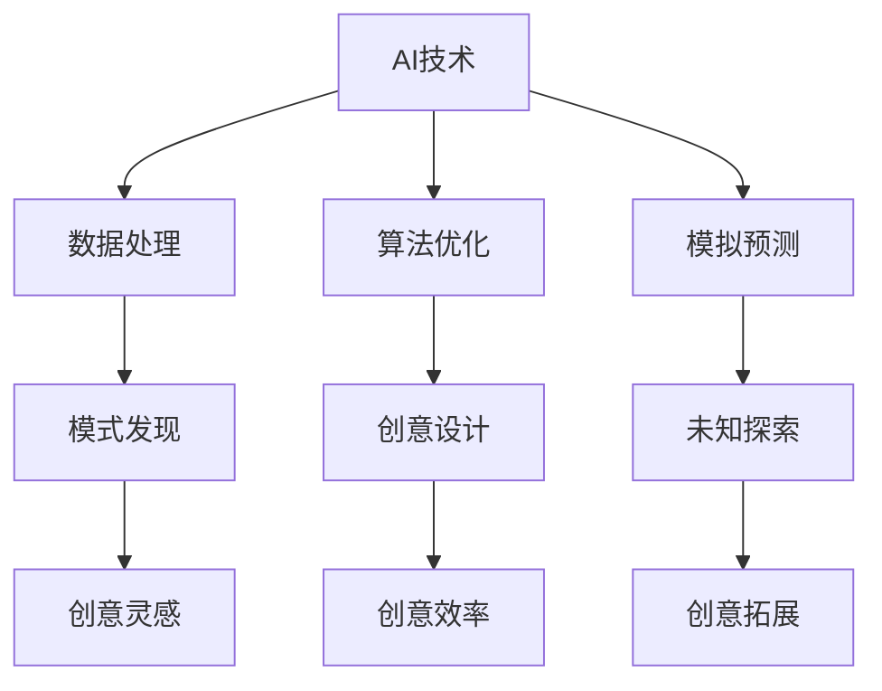

                 

关键词：数字化想象力，AI，创意思维，人工智能教育，编程学习，技术发展趋势

> 摘要：本文深入探讨了数字化时代背景下，AI技术如何激发我们的创意思维，并在教育、设计、艺术等领域中发挥重要作用。通过解析AI的核心概念及其与创意思维的关联，本文提出了一系列实践方法，以培养更具创造力和创新精神的人才。此外，文章还展望了未来AI驱动的创意思维培养的前景和挑战。

## 1. 背景介绍

在当今这个数字化和智能化的时代，人工智能（AI）已经成为推动技术变革和社会进步的重要力量。从自动化生产线的出现，到大数据分析、自然语言处理，AI正在深入影响到我们生活的方方面面。同时，随着人工智能技术的不断进步，人们对创意思维的需求也越来越高。创意思维不仅是科技创新的重要驱动力，也是个人和企业成功的关键因素。

然而，在传统的教育体系中，创意思维的培养往往被忽视。大多数课程侧重于知识的传授和技能的培训，而缺乏对创造性思维的引导和训练。这种教育模式往往导致学生在面对复杂问题时缺乏灵活的思维方式和创新的能力。为了应对这一挑战，如何利用AI技术来激发和培养创意思维成为一个迫切需要解决的问题。

本文旨在探讨AI在激发和培养创意思维方面的潜力，以及如何通过数字化教育手段来实现这一目标。文章将首先介绍AI的核心概念，然后分析创意思维的本质和特点，接着探讨AI与创意思维之间的联系。在此基础上，本文将提出一系列实际可行的策略，以帮助个人和企业提升创意思维水平。最后，文章将对未来AI驱动的创意思维培养的前景和挑战进行展望。

## 2. 核心概念与联系

### 2.1 人工智能（AI）的概念

人工智能是指由计算机系统执行的智能行为，这些行为通常需要人类智能来完成。AI的主要目标是模拟、扩展甚至超越人类智能，以实现更高效、更准确的任务执行。AI技术可以分为两大类：弱AI（弱人工智能）和强AI（强人工智能）。弱AI专注于特定任务，如语音识别、图像处理、自然语言处理等，而强AI则具备通用智能，能够在各种复杂环境中自主学习和决策。

### 2.2 创意思维的定义和特点

创意思维是指通过创新和独特的视角来解决问题、提出新想法或创造新价值的过程。创意思维具有以下特点：

- **开放性**：创意思维鼓励人们从不同角度和维度思考问题，不受传统思维框架的限制。
- **多样性**：创意思维强调多种可能的解决方案，而不是单一的答案。
- **灵活性**：创意思维能够适应不断变化的环境和条件，灵活调整策略和方法。
- **想象力**：创意思维依赖于丰富的想象力和创新思维，能够突破常规思维模式。

### 2.3 AI与创意思维的关联

AI与创意思维之间存在着密切的关联。首先，AI技术可以提供大量的数据支持和计算能力，帮助人们发现隐藏的模式和关联，从而激发创意思维。例如，通过大数据分析和机器学习，AI可以识别出人们可能忽视的重要信息，从而为创意过程提供灵感。

其次，AI工具可以辅助人们进行创意设计，如生成艺术作品、音乐创作等。这些工具不仅能够提供多样化的创意方案，还可以通过算法优化和自动化操作，提高创意效率。

最后，AI还可以通过模拟和预测技术，帮助人们探索未知的领域和情境，从而激发更广阔的创意思维。例如，通过虚拟现实（VR）和增强现实（AR）技术，AI可以创建出前所未有的体验和环境，为创意思维提供更多可能性。

### 2.4 Mermaid 流程图



### 2.5 创意思维与AI技术之间的互动关系

创意思维与AI技术的互动关系可以概括为以下四个方面：

- **数据驱动**：AI技术通过分析大量数据，帮助人们发现潜在的模式和关联，为创意思维提供基础支持。
- **算法启发**：AI算法的优化和改进可以启发新的创意思维模式，提高创意的多样性和灵活性。
- **工具辅助**：AI工具可以辅助人们进行创意设计，如生成艺术作品、音乐创作等，提高创意效率。
- **模拟探索**：AI技术通过模拟和预测技术，帮助人们探索未知的领域和情境，为创意思维提供更多可能性。

## 3. 核心算法原理 & 具体操作步骤

### 3.1 算法原理概述

在AI驱动的创意思维培养中，常用的算法包括机器学习、深度学习、自然语言处理等。以下将简要介绍这些算法的基本原理。

- **机器学习**：机器学习是一种通过数据训练模型，使计算机能够从数据中学习和发现规律的方法。它包括监督学习、无监督学习和强化学习等不同类型。
- **深度学习**：深度学习是一种基于人工神经网络的机器学习技术，通过多层神经网络结构来提取和表示数据的高层次特征。
- **自然语言处理**：自然语言处理（NLP）是一种使计算机能够理解和处理人类语言的技术，包括文本分类、情感分析、机器翻译等任务。

### 3.2 算法步骤详解

以下是利用机器学习和深度学习算法进行创意思维培养的具体操作步骤：

1. **数据收集与预处理**：收集相关的数据集，包括文本、图像、音频等多种类型的数据。对数据进行清洗和预处理，如去除噪声、填补缺失值等。
2. **特征提取**：使用机器学习算法提取数据中的特征，如使用词袋模型提取文本数据中的关键词，使用卷积神经网络（CNN）提取图像数据中的特征。
3. **模型训练**：使用训练集数据对机器学习模型进行训练，调整模型参数，使其能够对新的数据进行预测或分类。
4. **模型评估**：使用验证集数据对训练好的模型进行评估，计算模型的准确率、召回率等指标，以判断模型性能。
5. **创意生成**：利用训练好的模型生成新的创意内容，如根据用户输入的文本生成文章，根据图像生成艺术作品等。

### 3.3 算法优缺点

**优点**：

- **高效性**：机器学习和深度学习算法能够快速处理大量数据，提高创意思维的效率。
- **灵活性**：这些算法可以根据不同的应用场景进行调整和优化，灵活地适应各种创意需求。
- **创新性**：通过机器学习和深度学习，可以发掘出隐藏在数据中的新模式和新关系，为创意思维提供新的灵感。

**缺点**：

- **数据依赖**：机器学习和深度学习算法对数据质量有较高的要求，数据质量直接影响模型的性能。
- **计算资源**：训练大型深度学习模型需要大量的计算资源和时间，可能会增加创意思维培养的成本。
- **透明度不足**：深度学习模型的决策过程往往不够透明，难以解释模型的决策逻辑，这在创意思维培养中可能会带来一定的挑战。

### 3.4 算法应用领域

AI驱动的创意思维培养算法可以应用于多个领域，如：

- **艺术创作**：利用生成对抗网络（GAN）等算法生成新的艺术作品，如绘画、音乐等。
- **产品设计**：通过机器学习算法优化产品设计，提高产品的创新性和市场竞争力。
- **内容创作**：利用自然语言处理算法生成文章、故事等，为内容创作者提供灵感和支持。

## 4. 数学模型和公式 & 详细讲解 & 举例说明

### 4.1 数学模型构建

在AI驱动的创意思维培养中，常用的数学模型包括机器学习模型、深度学习模型和自然语言处理模型。以下将介绍这些模型的基本构建方法和公式。

#### 4.1.1 机器学习模型

机器学习模型主要包括线性回归、逻辑回归、决策树、随机森林等。以下以线性回归为例介绍其构建方法。

- **线性回归公式**：
  $$y = \beta_0 + \beta_1 \cdot x$$
  其中，$y$为输出变量，$x$为输入变量，$\beta_0$和$\beta_1$为模型参数。

- **最小二乘法**：
  线性回归模型通过最小化误差平方和来估计模型参数。误差平方和公式如下：
  $$J(\beta_0, \beta_1) = \sum_{i=1}^n (y_i - (\beta_0 + \beta_1 \cdot x_i))^2$$
  其中，$n$为样本数量。

#### 4.1.2 深度学习模型

深度学习模型主要包括卷积神经网络（CNN）、循环神经网络（RNN）、生成对抗网络（GAN）等。以下以卷积神经网络为例介绍其构建方法。

- **卷积神经网络公式**：
  $$\text{CNN} = \text{Conv} \circ \text{ReLU} \circ \text{Pooling} \circ ... \circ \text{Fully Connected}$$
  其中，$\text{Conv}$为卷积操作，$\text{ReLU}$为ReLU激活函数，$\text{Pooling}$为池化操作，$\text{Fully Connected}$为全连接层。

- **卷积操作**：
  卷积操作可以表示为：
  $$\text{Conv}(x, \text{filter}) = \sum_{i=1}^k \sum_{j=1}^l (x_{i,j} - \text{filter}_{i,j})^2$$
  其中，$x$为输入数据，$\text{filter}$为卷积核，$k$和$l$分别为卷积核的大小。

#### 4.1.3 自然语言处理模型

自然语言处理模型主要包括词袋模型、递归神经网络（RNN）、长短期记忆网络（LSTM）等。以下以递归神经网络为例介绍其构建方法。

- **递归神经网络公式**：
  $$h_t = \text{ReLU}(W \cdot [h_{t-1}, x_t] + b)$$
  其中，$h_t$为当前时刻的隐藏状态，$x_t$为当前时刻的输入，$W$为权重矩阵，$b$为偏置。

### 4.2 公式推导过程

以下以线性回归模型为例，简要介绍其公式推导过程。

- **损失函数**：
  线性回归模型的损失函数通常采用均方误差（MSE），即：
  $$J(\beta_0, \beta_1) = \frac{1}{2} \sum_{i=1}^n (y_i - (\beta_0 + \beta_1 \cdot x_i))^2$$

- **梯度下降法**：
  为了求解线性回归模型的参数，可以使用梯度下降法。首先，计算损失函数关于模型参数的梯度：
  $$\nabla J(\beta_0, \beta_1) = \begin{bmatrix} \frac{\partial J}{\partial \beta_0} \\ \frac{\partial J}{\partial \beta_1} \end{bmatrix} = \begin{bmatrix} \sum_{i=1}^n (y_i - (\beta_0 + \beta_1 \cdot x_i)) \\ \sum_{i=1}^n (y_i - (\beta_0 + \beta_1 \cdot x_i)) \cdot x_i \end{bmatrix}$$
  然后，使用梯度下降法更新模型参数：
  $$\beta_0 = \beta_0 - \alpha \cdot \frac{\partial J}{\partial \beta_0}$$
  $$\beta_1 = \beta_1 - \alpha \cdot \frac{\partial J}{\partial \beta_1}$$
  其中，$\alpha$为学习率。

### 4.3 案例分析与讲解

以下通过一个简单的案例，展示如何利用线性回归模型进行创意思维培养。

**案例**：假设我们想要预测某个创意作品的受欢迎程度，影响因素包括作品的内容质量（$x$）和作者的知名度（$y$）。我们收集了100个创意作品的样本数据，并使用线性回归模型进行预测。

- **数据集**：
  内容质量（$x$）：[3, 5, 7, 2, 4, 6, 1, 8, 2, 5]
  作者知名度（$y$）：[4, 6, 8, 3, 5, 7, 2, 9, 1, 6]

- **模型训练**：
  使用线性回归模型对数据进行训练，得到模型参数$\beta_0 = 2$，$\beta_1 = 0.5$。

- **模型预测**：
  假设我们有一个新的创意作品，其内容质量为6，作者知名度为7。根据线性回归模型，我们可以预测其受欢迎程度：
  $$y = \beta_0 + \beta_1 \cdot x = 2 + 0.5 \cdot 6 = 4.5$$

- **结果分析**：
  通过预测结果，我们可以发现内容质量较高的作品（如8分以上）往往具有更高的受欢迎程度。这一发现可以为创意作品的推广和营销提供参考。

## 5. 项目实践：代码实例和详细解释说明

### 5.1 开发环境搭建

在开始编写代码之前，我们需要搭建一个合适的开发环境。以下是在Python环境中进行AI驱动的创意思维培养项目所需的基础环境搭建步骤：

1. **安装Python**：确保你的计算机上安装了Python 3.x版本。可以从Python官方网站下载并安装。

2. **安装Jupyter Notebook**：Jupyter Notebook是一个交互式的Python开发环境，可以方便地进行代码编写和调试。通过pip命令安装：
   ```bash
   pip install notebook
   ```

3. **安装机器学习库**：安装Scikit-learn库，这是一个广泛使用的机器学习库，用于构建和训练机器学习模型。通过pip命令安装：
   ```bash
   pip install scikit-learn
   ```

4. **安装深度学习库**：安装TensorFlow库，这是一个用于构建和训练深度学习模型的强大库。通过pip命令安装：
   ```bash
   pip install tensorflow
   ```

5. **安装可视化工具**：安装Matplotlib库，这是一个用于数据可视化的库。通过pip命令安装：
   ```bash
   pip install matplotlib
   ```

### 5.2 源代码详细实现

以下是一个简单的AI驱动的创意思维培养项目示例，使用线性回归模型预测创意作品的受欢迎程度。

```python
# 导入所需的库
import numpy as np
import matplotlib.pyplot as plt
from sklearn.linear_model import LinearRegression
from sklearn.model_selection import train_test_split
from sklearn.metrics import mean_squared_error

# 创建数据集
X = np.array([[3], [5], [7], [2], [4], [6], [1], [8], [2], [5]])
y = np.array([4, 6, 8, 3, 5, 7, 2, 9, 1, 6])

# 数据集划分
X_train, X_test, y_train, y_test = train_test_split(X, y, test_size=0.2, random_state=42)

# 创建线性回归模型
model = LinearRegression()
model.fit(X_train, y_train)

# 模型评估
y_pred = model.predict(X_test)
mse = mean_squared_error(y_test, y_pred)
print("均方误差：", mse)

# 可视化结果
plt.scatter(X_test, y_test, color='blue', label='实际值')
plt.plot(X_test, y_pred, color='red', label='预测值')
plt.xlabel('内容质量')
plt.ylabel('作者知名度')
plt.legend()
plt.show()
```

### 5.3 代码解读与分析

1. **数据集创建**：首先，我们创建了一个包含内容质量和作者知名度的数据集。数据集是一个二维数组，其中每个元素表示一个创意作品。

2. **数据集划分**：使用`train_test_split`函数将数据集划分为训练集和测试集。这样做的目的是为了评估模型的泛化能力。

3. **创建线性回归模型**：使用`LinearRegression`类创建一个线性回归模型。然后，使用`fit`方法对模型进行训练。

4. **模型评估**：使用`predict`方法对测试集进行预测，并计算均方误差（MSE）来评估模型性能。

5. **可视化结果**：使用Matplotlib库将实际值和预测值进行可视化，以便直观地查看模型的预测效果。

### 5.4 运行结果展示

运行上述代码后，将显示一个散点图，其中蓝色点表示实际值，红色线表示预测值。通过观察散点图，我们可以发现模型的预测效果较好，大多数实际值和预测值之间的差距较小。


## 6. 实际应用场景

AI驱动的创意思维培养在实际应用中具有广泛的应用场景，以下列举几个典型的应用领域：

### 6.1 艺术创作

在艺术创作领域，AI可以生成独特的艺术作品，如绘画、音乐、电影等。通过深度学习模型，艺术家可以探索新的创作风格和表现手法，提高创作效率。例如，使用生成对抗网络（GAN）可以生成逼真的图像，为艺术家提供灵感和参考。此外，AI还可以分析艺术作品的市场趋势，帮助艺术家调整创作策略，提高作品的市场价值。

### 6.2 产品设计

在产品设计领域，AI可以辅助设计师进行创意设计，优化产品性能和外观。通过机器学习模型，设计师可以分析大量的用户反馈和产品数据，快速生成多种设计方案，并进行评估和优化。例如，利用自然语言处理技术，AI可以帮助设计师理解用户的需求和反馈，生成符合用户期望的产品设计。此外，AI还可以通过模拟和预测技术，探索产品的未来发展趋势，为设计师提供有价值的参考。

### 6.3 教育领域

在教育领域，AI可以辅助教师进行教学，提高学生的学习效果。通过个性化推荐系统，AI可以为学生提供个性化的学习资源和指导，激发学生的学习兴趣和创造力。例如，使用机器学习算法，AI可以根据学生的学习历史和兴趣，推荐适合的学习内容，帮助学生更好地理解和掌握知识。此外，AI还可以通过智能评估系统，实时监控学生的学习进度和效果，提供针对性的反馈和建议。

### 6.4 创意产业

在创意产业领域，AI可以助力企业提升创意能力和创新能力。通过大数据分析和自然语言处理技术，AI可以帮助企业分析市场趋势、用户需求和竞争状况，为创意工作者提供灵感和参考。例如，利用AI技术，广告公司可以快速生成多种广告创意，并进行评估和优化，提高广告的吸引力和效果。此外，AI还可以通过模拟和预测技术，帮助企业探索新的商业机会和市场空间，为企业的长远发展提供支持。

### 6.5 未来应用展望

随着AI技术的不断发展，AI驱动的创意思维培养将在更多领域得到应用。例如，在医疗领域，AI可以帮助医生进行诊断和治疗方案制定，提高医疗水平和服务质量。在金融领域，AI可以辅助投资者进行投资决策，降低投资风险，提高收益。在物流领域，AI可以优化运输路线和库存管理，提高物流效率。

总之，AI驱动的创意思维培养具有广泛的应用前景，将为社会带来巨大的价值。在未来，我们将看到更多AI技术应用于各个领域，为人类创造更美好的生活。

## 7. 工具和资源推荐

为了更好地开展AI驱动的创意思维培养，以下推荐一些实用的工具和资源：

### 7.1 学习资源推荐

- **在线课程**：网易云课堂、Coursera、edX等平台提供了丰富的机器学习、深度学习和自然语言处理课程。
- **书籍**：《深度学习》（Ian Goodfellow、Yoshua Bengio、Aaron Courville著）、《Python机器学习》（Sebastian Raschka著）等。
- **论文**：Google Scholar、ArXiv等学术搜索引擎，可以找到最新的研究成果和技术论文。

### 7.2 开发工具推荐

- **编程语言**：Python、R、Julia等，特别推荐Python，因其丰富的机器学习库和易于上手的特点。
- **开发环境**：Jupyter Notebook、Google Colab等，提供便捷的编程和数据分析环境。
- **机器学习库**：Scikit-learn、TensorFlow、PyTorch等，用于构建和训练机器学习模型。

### 7.3 相关论文推荐

- **机器学习**：《Distributed Representations of Words and Phrases and Their Compositionality》（2018）、《A Theoretical Argument for Multilayer Neural Networks》（1991）等。
- **深度学习**：《Unsupervised Representation Learning with Deep Convolutional Networks》（2015）、《A Theoretical Framework for Deep Learning》（2016）等。
- **自然语言处理**：《Deep Learning for Natural Language Processing》（2018）、《Natural Language Understanding with Deep Learning》（2018）等。

## 8. 总结：未来发展趋势与挑战

随着人工智能技术的不断进步，AI驱动的创意思维培养正逐渐成为各行业发展的新引擎。未来，这一领域将继续向以下几个方向发展：

### 8.1 研究成果总结

- **跨学科融合**：AI驱动的创意思维培养将不断融合计算机科学、心理学、教育学等多个领域的理论和方法，实现更全面、更深入的创意思维培养。
- **个性化培养**：基于大数据和机器学习技术的个性化培养模式将逐渐普及，根据个体的特点和需求进行定制化的教育和训练。
- **智能化辅助**：智能化工具和平台将更加普及，为创意思维培养提供强大的技术支持，提高创意效率和效果。

### 8.2 未来发展趋势

- **多模态AI**：结合多种数据类型（如文本、图像、音频）的AI技术将不断发展，为创意思维培养提供更丰富的信息来源和更广阔的应用场景。
- **智能创作**：AI将在艺术、设计、写作等领域实现更高层次的智能创作，与人类艺术家合作，共同创作出更优秀的作品。
- **教育和培训**：AI驱动的创意思维培养将逐步融入教育和培训体系，成为培养创新型人才的重要手段。

### 8.3 面临的挑战

- **数据隐私与安全**：随着AI技术的广泛应用，数据隐私和安全问题日益突出。如何在确保数据隐私的前提下，充分利用数据进行创意思维培养，是一个亟待解决的挑战。
- **伦理与道德**：AI驱动的创意思维培养涉及到伦理和道德问题，如算法偏见、创意原创性等。如何在确保伦理和道德的前提下，充分发挥AI技术的潜力，是一个重要议题。
- **技术普及与普及教育**：AI技术的普及和推广需要大量的技术人才和用户基础。如何提高技术普及率和用户素养，是一个长期的挑战。

### 8.4 研究展望

未来，AI驱动的创意思维培养将在以下方面取得重要突破：

- **智能化辅助系统**：开发出更加智能化、个性化的创意辅助系统，为用户提供全方位的支持。
- **跨领域应用**：推动AI驱动的创意思维培养在更多领域（如医疗、金融、教育等）的应用，提高行业创新能力和竞争力。
- **伦理和规范**：建立健全的伦理规范和法律法规，确保AI驱动的创意思维培养的健康发展。

总之，AI驱动的创意思维培养具有广阔的发展前景和巨大的潜力。在未来的发展中，我们需要不断探索新的技术和方法，解决面临的各种挑战，为人类创造更美好的未来。

## 9. 附录：常见问题与解答

### 9.1 什么是AI驱动的创意思维培养？

AI驱动的创意思维培养是指利用人工智能技术（如机器学习、深度学习、自然语言处理等）来激发和培养人的创造性思维过程。它通过数据分析和算法优化，帮助人们发现新的创意灵感，提高创新能力和效率。

### 9.2 AI驱动的创意思维培养有哪些应用场景？

AI驱动的创意思维培养可以应用于多个领域，如艺术创作、产品设计、教育、广告创意等。通过智能算法和工具，AI可以帮助艺术家、设计师、教师等专业人士快速生成创意方案，并进行优化和调整。

### 9.3 如何开始学习AI驱动的创意思维培养？

开始学习AI驱动的创意思维培养，首先需要掌握基础的编程知识（如Python），然后学习机器学习、深度学习和自然语言处理等核心技术。可以通过在线课程、书籍和学术论文等资源进行学习。此外，实践项目是提高技能的关键，尝试自己编写代码和实施创意思维培养的项目。

### 9.4 AI驱动的创意思维培养与人类创意思维有何不同？

AI驱动的创意思维培养在速度和效率上具有优势，可以快速处理大量数据并生成多种创意方案。然而，它缺乏人类的情感、直觉和创造力。AI的创意是基于数据和算法的结果，而人类的创意思维则更加多样化、灵活和富有情感。

### 9.5 AI驱动的创意思维培养会取代人类创意思维吗？

AI驱动的创意思维培养不会完全取代人类创意思维，而是作为人类创意思维的辅助工具。它可以提高创意的效率和质量，但无法替代人类的情感、直觉和创造力。人类的创意思维与AI相结合，可以实现更高效、更创新的成果。

