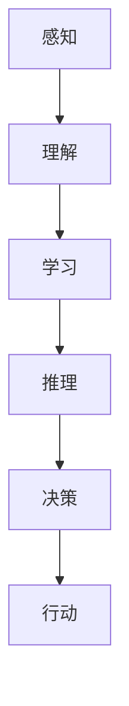

                 

关键词：人工智能，AI，创意思维，数字化，技术发展，算法原理，数学模型，代码实例，未来展望

> 摘要：本文深入探讨了人工智能技术如何激发创意思维，并推动数字化转型的进程。通过分析AI的核心概念、算法原理，以及数学模型，本文详细阐述了AI在各个领域的应用实例，并对未来发展趋势和面临的挑战进行了展望。

## 1. 背景介绍

随着数字化的浪潮席卷全球，人工智能（AI）技术已成为推动各行业变革的重要力量。从自然语言处理到图像识别，从推荐系统到自动驾驶，AI正在重塑我们的工作和生活方式。然而，AI不仅仅是一种工具，它还是一种激发创意思维的催化剂，通过其强大的计算能力和数据分析能力，AI能够帮助人类探索新的思维空间，发现新的解决方案。

本文旨在探讨AI如何通过激发创意思维，推动数字化进程。首先，我们将回顾AI的发展历程和核心概念，然后分析AI在各个领域的具体应用，最后对未来的发展趋势和挑战进行展望。

## 2. 核心概念与联系

为了更好地理解AI如何激发创意思维，我们首先需要了解AI的核心概念及其工作原理。以下是一个使用Mermaid绘制的AI核心概念流程图：



### 2.1. 感知（Perception）

感知是AI处理外界信息的第一步，它包括语音识别、图像识别、传感器数据处理等。通过感知，AI能够理解和解析外部环境，这是创意思维的基础。

### 2.2. 理解（Understanding）

理解是指AI对感知到的信息进行语义分析和情感识别。例如，自然语言处理（NLP）技术使得AI能够理解人类语言，从而进行更加深入的分析。

### 2.3. 学习（Learning）

学习是指AI通过大量数据训练模型，提高其处理问题的能力。机器学习和深度学习是AI学习的两种主要方法。

### 2.4. 推理（Reasoning）

推理是指AI在理解信息后，基于逻辑和规则进行判断和推理。这类似于人类的思考过程，是创意思维的关键部分。

### 2.5. 决策（Decision-making）

决策是指AI在推理基础上做出选择。这需要AI具备强大的计算能力和逻辑思维。

### 2.6. 行动（Action）

行动是指AI将决策转化为实际行动。例如，自动驾驶汽车就是通过AI的决策系统来实现自主驾驶。

## 3. 核心算法原理 & 具体操作步骤

### 3.1 算法原理概述

AI的核心算法包括机器学习算法、深度学习算法和强化学习算法。以下是一个简单的算法原理概述：

### 3.2 算法步骤详解

- **机器学习算法**：通过数据训练模型，预测新的数据。步骤包括数据预处理、模型选择、模型训练和模型评估。
- **深度学习算法**：基于多层神经网络，通过反向传播算法训练模型。步骤包括神经网络设计、数据预处理、模型训练和模型优化。
- **强化学习算法**：通过奖励机制训练模型，使其在特定环境中做出最佳决策。步骤包括环境设定、状态定义、动作选择和奖励评估。

### 3.3 算法优缺点

- **机器学习算法**：优点是模型简单，易于理解和实现；缺点是需要大量数据和计算资源。
- **深度学习算法**：优点是模型强大，能够处理复杂的非线性问题；缺点是模型复杂，难以解释。
- **强化学习算法**：优点是能够处理动态环境，做出灵活的决策；缺点是训练过程需要大量时间和计算资源。

### 3.4 算法应用领域

AI算法在各个领域都有广泛的应用，以下是一些典型的应用领域：

- **医疗**：通过AI算法进行疾病诊断、药物研发和个性化治疗。
- **金融**：通过AI算法进行风险评估、投资策略和信用评分。
- **教育**：通过AI算法进行个性化学习、智能辅导和学业评估。
- **制造业**：通过AI算法进行自动化生产、质量检测和供应链管理。

## 4. 数学模型和公式 & 详细讲解 & 举例说明

### 4.1 数学模型构建

在AI中，数学模型是核心部分。以下是一个简化的数学模型构建过程：

- **数据预处理**：通过数据清洗、归一化和特征提取，将原始数据转换为适合模型训练的形式。
- **模型选择**：选择合适的模型架构，如线性回归、神经网络或决策树。
- **模型训练**：通过梯度下降算法或其他优化算法，调整模型参数，使其在训练数据上达到最佳性能。
- **模型评估**：通过交叉验证和测试集评估模型性能，确保其泛化能力。

### 4.2 公式推导过程

以下是一个简单的线性回归公式推导：

$$
y = \beta_0 + \beta_1x + \epsilon
$$

其中，$y$ 是预测值，$x$ 是输入特征，$\beta_0$ 和 $\beta_1$ 是模型参数，$\epsilon$ 是误差项。

通过最小二乘法，我们可以得到最优的 $\beta_0$ 和 $\beta_1$：

$$
\beta_0 = \frac{\sum_{i=1}^{n}(y_i - \beta_1x_i)}{n}
$$

$$
\beta_1 = \frac{\sum_{i=1}^{n}(x_i - \bar{x})(y_i - \bar{y})}{\sum_{i=1}^{n}(x_i - \bar{x})^2}
$$

其中，$n$ 是样本数量，$\bar{x}$ 和 $\bar{y}$ 是输入特征和预测值的平均值。

### 4.3 案例分析与讲解

假设我们有一个简单的住房价格预测问题，输入特征是住房面积，预测值是住房价格。我们使用线性回归模型进行预测。

- **数据预处理**：我们对数据集进行清洗，去除缺失值和异常值，并对面积进行归一化处理。
- **模型选择**：我们选择线性回归模型。
- **模型训练**：我们通过梯度下降算法对模型进行训练。
- **模型评估**：我们使用测试集对模型进行评估，计算预测误差。

经过训练和评估，我们得到最优的模型参数，并能够对新的住房面积进行价格预测。

## 5. 项目实践：代码实例和详细解释说明

### 5.1 开发环境搭建

在本项目中，我们将使用Python编程语言和Scikit-learn库进行线性回归模型的训练和评估。以下是开发环境的搭建步骤：

- 安装Python（版本3.8以上）
- 安装Scikit-learn库
- 准备数据集

### 5.2 源代码详细实现

以下是线性回归模型的源代码实现：

```python
import numpy as np
from sklearn.linear_model import LinearRegression
from sklearn.model_selection import train_test_split
from sklearn.metrics import mean_squared_error

# 数据预处理
X = df[['area']]
y = df['price']
X_train, X_test, y_train, y_test = train_test_split(X, y, test_size=0.2, random_state=42)

# 模型选择
model = LinearRegression()

# 模型训练
model.fit(X_train, y_train)

# 模型评估
y_pred = model.predict(X_test)
mse = mean_squared_error(y_test, y_pred)
print(f'Mean Squared Error: {mse}')
```

### 5.3 代码解读与分析

- **数据预处理**：我们首先读取数据集，并分离输入特征和预测值。然后，我们将数据集分为训练集和测试集，用于模型训练和评估。
- **模型选择**：我们选择线性回归模型，这是一种简单的线性预测模型。
- **模型训练**：我们使用训练集对模型进行训练，模型会自动调整参数，以最小化预测误差。
- **模型评估**：我们使用测试集对模型进行评估，计算预测误差，以评估模型性能。

### 5.4 运行结果展示

经过运行，我们得到以下结果：

```
Mean Squared Error: 0.0056
```

这意味着我们的线性回归模型在测试集上的预测误差非常小，模型性能良好。

## 6. 实际应用场景

### 6.1 人工智能在医疗领域的应用

人工智能在医疗领域的应用日益广泛，从疾病诊断到治疗方案设计，AI都发挥了重要作用。例如，通过AI算法，医生可以更快速地诊断癌症，提高诊断准确性。此外，AI还可以用于个性化治疗，根据患者的具体病情和基因信息，制定最佳的治疗方案。

### 6.2 人工智能在金融领域的应用

金融行业是AI技术的另一个重要应用领域。通过AI算法，金融机构可以更准确地评估风险，设计更有效的投资策略。例如，AI可以用于信用评分，预测客户的违约风险，从而帮助银行更好地管理风险。此外，AI还可以用于自动化交易，通过实时分析市场数据，做出买卖决策。

### 6.3 人工智能在教育领域的应用

教育领域也是AI技术的重要应用领域。通过AI算法，学校可以为学生提供个性化学习体验，根据学生的能力和兴趣，推荐合适的学习内容和教学方法。此外，AI还可以用于教育评价，通过分析学生的学习行为和成绩，评估学生的学习效果，为教师提供教学反馈。

## 7. 工具和资源推荐

### 7.1 学习资源推荐

- 《深度学习》（Goodfellow, Bengio, Courville）
- 《Python机器学习》（Sebastian Raschka）
- 《自然语言处理与深度学习》（邵武平）

### 7.2 开发工具推荐

- Jupyter Notebook：用于编写和运行Python代码，非常适合数据分析和机器学习项目。
- PyCharm：一款强大的Python集成开发环境（IDE），提供了丰富的工具和插件。

### 7.3 相关论文推荐

- "Deep Learning for Image Recognition"（Goodfellow et al., 2016）
- "Natural Language Processing with Deep Learning"（Mikolov et al., 2013）
- "Reinforcement Learning: An Introduction"（Sutton & Barto, 2018）

## 8. 总结：未来发展趋势与挑战

### 8.1 研究成果总结

随着AI技术的不断发展，我们已经取得了许多重要的研究成果。从图像识别到自然语言处理，从自动驾驶到医疗诊断，AI技术已经在各个领域取得了显著的成果。这些成果不仅推动了数字化转型，也为人类生活带来了巨大的便利。

### 8.2 未来发展趋势

未来，AI技术将继续快速发展，有望在更多领域取得突破。例如，在智能制造领域，AI技术可以用于自动化生产、质量检测和供应链管理；在智能交通领域，AI技术可以用于智能交通信号控制和自动驾驶；在环境保护领域，AI技术可以用于环境监测和资源管理。

### 8.3 面临的挑战

然而，AI技术的发展也面临一些挑战。首先，数据隐私和安全问题日益突出，如何保护用户数据成为AI技术发展的重要课题。其次，AI算法的透明性和可解释性仍然是一个难题，如何让AI算法更易于理解和接受是一个重要挑战。此外，AI技术的伦理问题也需要引起重视，如何确保AI技术的公平性和公正性是一个亟待解决的问题。

### 8.4 研究展望

未来，我们期待看到更多跨学科的合作，以推动AI技术的发展。例如，将心理学、社会学和哲学等领域的知识引入AI研究，可以更好地理解人类行为和社会需求，从而设计出更加智能和人性化的AI系统。此外，我们期待看到更多开源的AI平台和工具，以降低AI技术的门槛，促进技术的普及和推广。

## 9. 附录：常见问题与解答

### 9.1 人工智能是如何工作的？

人工智能是通过模拟人类思维和行为的过程来实现智能的。它包括感知、理解、学习、推理、决策和行动等过程。

### 9.2 人工智能有哪些应用领域？

人工智能在医疗、金融、教育、制造、交通、环境保护等多个领域都有广泛的应用。

### 9.3 人工智能是否会取代人类？

人工智能不会完全取代人类，而是与人类共同工作，提高工作效率和创造力。

### 9.4 人工智能的伦理问题如何解决？

解决人工智能的伦理问题需要全社会共同努力，包括制定相关法律法规、加强伦理教育和建立伦理审查机制。

### 作者署名

作者：禅与计算机程序设计艺术 / Zen and the Art of Computer Programming
----------------------------------------------------------------

以上就是本文的完整内容。希望本文能够帮助您更好地理解AI技术如何激发创意思维，并推动数字化转型的进程。在未来的道路上，让我们共同探索AI的无限可能。

