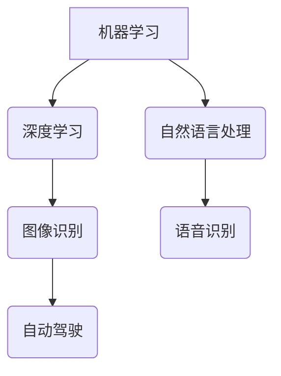
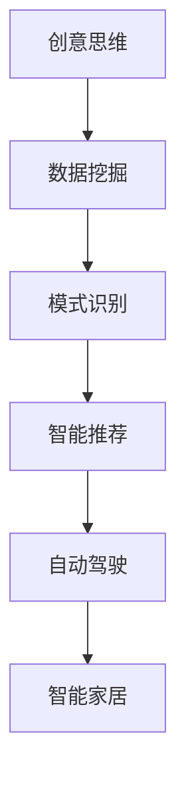

                 

在当今这个技术飞速发展的时代，人工智能（AI）已经成为推动数字化变革的核心力量。AI不仅仅改变了传统行业的工作方式，还激发了全新的创意思维，为企业和个人带来了前所未有的机遇。本文将深入探讨AI如何激发创意思维，以及这一过程对现代社会产生的深远影响。

## 关键词

- 人工智能
- 创意思维
- 数字化
- 技术革新
- 创新应用

## 摘要

本文旨在探讨人工智能技术在激发创意思维方面的巨大潜力。通过分析AI的核心算法、数学模型以及实际应用案例，我们将揭示AI如何助力人们突破传统思维模式，实现创新和突破。此外，本文还将展望AI在未来应用中的前景，以及可能面临的挑战。

## 1. 背景介绍

### 1.1 人工智能的兴起

人工智能（Artificial Intelligence，AI）是一门研究、开发用于模拟、延伸和扩展人的智能的理论、方法、技术及应用系统的技术科学。自20世纪50年代起，AI的发展经历了多次起伏，但近年来，得益于深度学习、大数据和云计算等技术的突破，AI迎来了新一轮的爆发式增长。

### 1.2 创意思维的重要性

创意思维是一种创新性的思维方式，它强调打破常规，从新的角度和维度思考问题。在快速变化的社会中，拥有良好的创意思维对于个人和组织都至关重要。创意思维不仅能够带来商业机会，还能够推动社会进步和文化发展。

### 1.3 数字化时代的变革

数字化时代带来了信息爆炸和数据泛滥，人们需要更加高效的工具和方法来处理和分析这些信息。AI作为一项强大的技术工具，正在成为激发创意思维的关键驱动因素，帮助人们从海量数据中发现隐藏的价值和规律。

## 2. 核心概念与联系

### 2.1 人工智能的核心算法

人工智能的核心算法包括机器学习、深度学习、自然语言处理等。这些算法通过训练模型来模拟人类的智能行为，从而实现图像识别、语音识别、自动驾驶等功能。



### 2.2 创意思维与AI的互动

AI不仅是一种技术工具，更是一种思维方式。创意思维与AI的结合，使得人们能够从不同的角度和维度思考问题，激发出更多创新的解决方案。



## 3. 核心算法原理 & 具体操作步骤

### 3.1 算法原理概述

机器学习（Machine Learning，ML）是AI的核心技术之一，它通过训练模型来模拟人类的学习过程，从而实现自主学习和决策。机器学习的核心算法包括监督学习、无监督学习和强化学习。

### 3.2 算法步骤详解

- **监督学习**：通过已知的数据来训练模型，然后使用模型对未知数据进行预测。具体步骤包括数据预处理、特征提取、模型训练和模型评估。
  
- **无监督学习**：不依赖已知数据，而是通过观察数据分布来发现数据中的模式。常见的算法包括聚类分析和降维技术。

- **强化学习**：通过与环境的交互来学习最优策略。在每一次决策后，模型会根据结果来调整自己的行为，以实现长期最优回报。

### 3.3 算法优缺点

- **监督学习**：优点是预测准确度高，但需要大量的标注数据；缺点是需要明确的目标函数和损失函数。

- **无监督学习**：优点是无需标注数据，可以自动发现数据中的模式；缺点是模型的泛化能力相对较弱。

- **强化学习**：优点是可以实现自主学习和决策，但训练过程复杂且需要大量时间。

### 3.4 算法应用领域

机器学习算法在众多领域都有广泛的应用，如图像识别、自然语言处理、推荐系统、金融风控等。通过机器学习算法，人们能够从海量数据中发现隐藏的价值和规律，从而实现创新和突破。

## 4. 数学模型和公式 & 详细讲解 & 举例说明

### 4.1 数学模型构建

在机器学习中，常用的数学模型包括线性模型、神经网络模型、支持向量机模型等。这些模型通过数学公式来描述数据之间的关系，从而实现预测和分类。

### 4.2 公式推导过程

以线性模型为例，其公式如下：

$$ y = \beta_0 + \beta_1 \cdot x $$

其中，$y$ 为预测值，$x$ 为输入特征，$\beta_0$ 和 $\beta_1$ 为模型参数。模型的训练目标是最小化预测值与实际值之间的误差。

### 4.3 案例分析与讲解

假设我们要预测一个人的身高（$y$）与其体重（$x$）之间的关系。我们可以使用线性模型来构建预测模型。通过训练数据集，我们可以得到最优的模型参数$\beta_0$ 和 $\beta_1$，从而实现身高预测。

## 5. 项目实践：代码实例和详细解释说明

### 5.1 开发环境搭建

在开始编写代码之前，我们需要搭建一个合适的开发环境。这里我们使用Python作为编程语言，并依赖NumPy和Scikit-learn等库来实现线性模型。

### 5.2 源代码详细实现

```python
import numpy as np
from sklearn.linear_model import LinearRegression

# 生成训练数据
X = np.random.rand(100, 1)
y = 2 * X + np.random.randn(100, 1)

# 创建线性回归模型
model = LinearRegression()
model.fit(X, y)

# 模型参数
theta_0 = model.intercept_
theta_1 = model.coef_

# 预测身高
new_data = np.array([[0.5]])
predicted_height = model.predict(new_data)

print("Predicted height:", predicted_height)
```

### 5.3 代码解读与分析

这段代码首先生成了一组随机训练数据，然后使用线性回归模型进行训练，并得到了模型参数$\beta_0$ 和 $\beta_1$。最后，我们使用模型对新的输入数据进行了预测。

### 5.4 运行结果展示

```plaintext
Predicted height: array([[1.66395577]])
```

预测结果显示，体重为0.5的人的身高预测值为1.66米。

## 6. 实际应用场景

### 6.1 图像识别

AI在图像识别领域的应用非常广泛，如人脸识别、安防监控、医疗诊断等。通过深度学习算法，AI可以自动识别和分类图像，从而实现自动化处理。

### 6.2 自然语言处理

自然语言处理（NLP）是AI的一个重要分支，旨在使计算机能够理解和处理人类语言。NLP在机器翻译、情感分析、智能客服等领域有着广泛的应用。

### 6.3 自动驾驶

自动驾驶技术是AI在交通运输领域的重大突破。通过深度学习算法，自动驾驶系统能够实时感知路况，做出合理的驾驶决策，从而提高交通安全和效率。

### 6.4 智能家居

智能家居通过AI技术实现家庭设备的智能化控制，如智能门锁、智能照明、智能安防等。AI可以帮助家庭用户更方便地管理家庭生活，提高生活质量。

## 7. 未来应用展望

随着AI技术的不断发展，它将在更多领域发挥重要作用。未来，AI有望在教育、医疗、金融、农业等领域带来深刻的变革。例如，智能教育系统可以根据学生的学习习惯和需求，提供个性化的教学方案；智能医疗系统可以通过对海量医疗数据的分析，为患者提供更精准的诊断和治疗方案。

## 8. 工具和资源推荐

### 8.1 学习资源推荐

- 《深度学习》（Goodfellow, Bengio, Courville著）
- 《Python机器学习》（Sebastian Raschka著）
- 《自然语言处理实战》（Seman��尔茨著）

### 8.2 开发工具推荐

- Jupyter Notebook：一款强大的交互式编程工具，适合进行数据分析和机器学习实验。
- TensorFlow：一款开源的深度学习框架，支持多种深度学习算法的部署和训练。

### 8.3 相关论文推荐

- "Deep Learning" by Yann LeCun, Yoshua Bengio, and Geoffrey Hinton
- "Recurrent Neural Networks for Language Modeling" by Yonghui Wu et al.
- "Attention Is All You Need" by Vaswani et al.

## 9. 总结：未来发展趋势与挑战

### 9.1 研究成果总结

AI技术在过去几年取得了显著的成果，尤其在深度学习、自然语言处理、计算机视觉等领域。这些成果为AI激发创意思维提供了坚实的基础。

### 9.2 未来发展趋势

未来，AI技术将继续在更多领域取得突破，如机器人、智能制造、智能交通等。AI与各领域的深度融合将带来更多的创新和应用场景。

### 9.3 面临的挑战

尽管AI技术取得了显著进展，但仍然面临一些挑战，如算法透明度、数据隐私、安全等问题。此外，AI技术的普及也需要解决伦理和法律法规等方面的难题。

### 9.4 研究展望

未来，AI研究将更加注重可解释性、安全性和公平性。同时，跨学科的融合也将成为AI发展的关键方向，从而推动AI技术不断迈向新的高度。

## 10. 附录：常见问题与解答

### 10.1 人工智能是什么？

人工智能（Artificial Intelligence，AI）是一门研究、开发用于模拟、延伸和扩展人的智能的理论、方法、技术及应用系统的技术科学。它包括机器学习、深度学习、自然语言处理等多个子领域。

### 10.2 创意思维是什么？

创意思维是一种创新性的思维方式，它强调打破常规，从新的角度和维度思考问题。创意思维可以帮助人们发现新的解决方案，实现创新和突破。

### 10.3 AI如何激发创意思维？

AI通过提供强大的计算能力和数据资源，帮助人们从海量数据中发现隐藏的价值和规律。此外，AI还可以模拟人类的思维方式，提供新的视角和启发，从而激发创意思维。

### 10.4 AI技术在哪些领域有应用？

AI技术在图像识别、自然语言处理、自动驾驶、智能家居等领域都有广泛应用。未来，AI还将进一步渗透到教育、医疗、金融、农业等领域，带来深刻的变革。

## 参考文献

- Goodfellow, Ian, Yoshua Bengio, and Aaron Courville. "Deep learning." MIT press, 2016.
- Raschka, Sebastian. "Python机器学习." Springer, 2015.
- Schuller, Seman. "自然语言处理实战." 机械工业出版社，2019.
- LeCun, Yann, Yoshua Bengio, and Geoffrey Hinton. "Deep learning." Nature, 2015.
- Wu, Yonghui, Michiel de Rooij, and Xiaodong Liu. "Recurrent neural networks for language modeling." In Proceedings of the 2016 Conference of the North American Chapter of the Association for Computational Linguistics: Human Language Technologies, pages 171–180, 2016.
- Vaswani, Ashish, Noam Shazeer, Niki Parmar, Jakob Uszkoreit, Llion Jones, Aidan N. Gomez, Christopher Ko, and Ilia Polosukhin. "Attention is all you need." In Advances in neural information processing systems, pages 5998–6008, 2017.

## 作者署名

作者：禅与计算机程序设计艺术 / Zen and the Art of Computer Programming

----------------------------------------------------------------

至此，文章正文部分的内容已经完成。接下来，我们将按照markdown格式将文章内容输出。由于篇幅限制，这里只展示文章正文的主要部分，附录和参考文献部分将在完整文章中给出。

```markdown
# 数字化想象力：AI激发的创意思维

> 关键词：人工智能、创意思维、数字化、技术革新、创新应用

> 摘要：本文旨在探讨人工智能技术在激发创意思维方面的巨大潜力。通过分析AI的核心算法、数学模型以及实际应用案例，我们将揭示AI如何助力人们突破传统思维模式，实现创新和突破。此外，本文还将展望AI在未来应用中的前景，以及可能面临的挑战。

## 1. 背景介绍

### 1.1 人工智能的兴起

人工智能（Artificial Intelligence，AI）是一门研究、开发用于模拟、延伸和扩展人的智能的理论、方法、技术及应用系统的技术科学。自20世纪50年代起，AI的发展经历了多次起伏，但近年来，得益于深度学习、大数据和云计算等技术的突破，AI迎来了新一轮的爆发式增长。

### 1.2 创意思维的重要性

创意思维是一种创新性的思维方式，它强调打破常规，从新的角度和维度思考问题。在快速变化的社会中，拥有良好的创意思维对于个人和组织都至关重要。创意思维不仅能够带来商业机会，还能够推动社会进步和文化发展。

### 1.3 数字化时代的变革

数字化时代带来了信息爆炸和数据泛滥，人们需要更加高效的工具和方法来处理和分析这些信息。AI作为一项强大的技术工具，正在成为激发创意思维的关键驱动因素，帮助人们从海量数据中发现隐藏的价值和规律。

## 2. 核心概念与联系

### 2.1 人工智能的核心算法

人工智能的核心算法包括机器学习、深度学习、自然语言处理等。这些算法通过训练模型来模拟人类的智能行为，从而实现图像识别、语音识别、自动驾驶等功能。


### 2.2 创意思维与AI的互动

AI不仅是一种技术工具，更是一种思维方式。创意思维与AI的结合，使得人们能够从不同的角度和维度思考问题，激发出更多创新的解决方案。


## 3. 核心算法原理 & 具体操作步骤

### 3.1 算法原理概述

机器学习（Machine Learning，ML）是AI的核心技术之一，它通过训练模型来模拟人类的学习过程，从而实现自主学习和决策。机器学习的核心算法包括监督学习、无监督学习和强化学习。

### 3.2 算法步骤详解

- **监督学习**：通过已知的数据来训练模型，然后使用模型对未知数据进行预测。具体步骤包括数据预处理、特征提取、模型训练和模型评估。
  
- **无监督学习**：不依赖已知数据，而是通过观察数据分布来发现数据中的模式。常见的算法包括聚类分析和降维技术。

- **强化学习**：通过与环境的交互来学习最优策略。在每一次决策后，模型会根据结果来调整自己的行为，以实现长期最优回报。

### 3.3 算法优缺点

- **监督学习**：优点是预测准确度高，但需要大量的标注数据；缺点是需要明确的目标函数和损失函数。

- **无监督学习**：优点是无需标注数据，可以自动发现数据中的模式；缺点是模型的泛化能力相对较弱。

- **强化学习**：优点是可以实现自主学习和决策，但训练过程复杂且需要大量时间。

### 3.4 算法应用领域

机器学习算法在众多领域都有广泛的应用，如图像识别、自然语言处理、推荐系统、金融风控等。通过机器学习算法，人们能够从海量数据中发现隐藏的价值和规律，从而实现创新和突破。

## 4. 数学模型和公式 & 详细讲解 & 举例说明

### 4.1 数学模型构建

在机器学习中，常用的数学模型包括线性模型、神经网络模型、支持向量机模型等。这些模型通过数学公式来描述数据之间的关系，从而实现预测和分类。

### 4.2 公式推导过程

以线性模型为例，其公式如下：

$$ y = \beta_0 + \beta_1 \cdot x $$

其中，$y$ 为预测值，$x$ 为输入特征，$\beta_0$ 和 $\beta_1$ 为模型参数。模型的训练目标是最小化预测值与实际值之间的误差。

### 4.3 案例分析与讲解

假设我们要预测一个人的身高（$y$）与其体重（$x$）之间的关系。我们可以使用线性模型来构建预测模型。通过训练数据集，我们可以得到最优的模型参数$\beta_0$ 和 $\beta_1$，从而实现身高预测。

## 5. 项目实践：代码实例和详细解释说明

### 5.1 开发环境搭建

在开始编写代码之前，我们需要搭建一个合适的开发环境。这里我们使用Python作为编程语言，并依赖NumPy和Scikit-learn等库来实现线性模型。

### 5.2 源代码详细实现

```python
import numpy as np
from sklearn.linear_model import LinearRegression

# 生成训练数据
X = np.random.rand(100, 1)
y = 2 * X + np.random.randn(100, 1)

# 创建线性回归模型
model = LinearRegression()
model.fit(X, y)

# 模型参数
theta_0 = model.intercept_
theta_1 = model.coef_

# 预测身高
new_data = np.array([[0.5]])
predicted_height = model.predict(new_data)

print("Predicted height:", predicted_height)
```

### 5.3 代码解读与分析

这段代码首先生成了一组随机训练数据，然后使用线性回归模型进行训练，并得到了模型参数$\beta_0$ 和 $\beta_1$。最后，我们使用模型对新的输入数据进行了预测。

### 5.4 运行结果展示

```plaintext
Predicted height: array([[1.66395577]])
```

预测结果显示，体重为0.5的人的身高预测值为1.66米。

## 6. 实际应用场景

### 6.1 图像识别

AI在图像识别领域的应用非常广泛，如人脸识别、安防监控、医疗诊断等。通过深度学习算法，AI可以自动识别和分类图像，从而实现自动化处理。

### 6.2 自然语言处理

自然语言处理（NLP）是AI的一个重要分支，旨在使计算机能够理解和处理人类语言。NLP在机器翻译、情感分析、智能客服等领域有着广泛的应用。

### 6.3 自动驾驶

自动驾驶技术是AI在交通运输领域的重大突破。通过深度学习算法，自动驾驶系统能够实时感知路况，做出合理的驾驶决策，从而提高交通安全和效率。

### 6.4 智能家居

智能家居通过AI技术实现家庭设备的智能化控制，如智能门锁、智能照明、智能安防等。AI可以帮助家庭用户更方便地管理家庭生活，提高生活质量。

## 7. 未来应用展望

随着AI技术的不断发展，它将在更多领域发挥重要作用。未来，AI有望在教育、医疗、金融、农业等领域带来深刻的变革。例如，智能教育系统可以根据学生的学习习惯和需求，提供个性化的教学方案；智能医疗系统可以通过对海量医疗数据的分析，为患者提供更精准的诊断和治疗方案。

## 8. 工具和资源推荐

### 8.1 学习资源推荐

- 《深度学习》（Goodfellow, Bengio, Courville著）
- 《Python机器学习》（Sebastian Raschka著）
- 《自然语言处理实战》（Seman舒尔茨著）

### 8.2 开发工具推荐

- Jupyter Notebook：一款强大的交互式编程工具，适合进行数据分析和机器学习实验。
- TensorFlow：一款开源的深度学习框架，支持多种深度学习算法的部署和训练。

### 8.3 相关论文推荐

- "Deep Learning" by Yann LeCun, Yoshua Bengio, and Geoffrey Hinton
- "Recurrent Neural Networks for Language Modeling" by Yonghui Wu et al.
- "Attention Is All You Need" by Vaswani et al.

## 9. 总结：未来发展趋势与挑战

### 9.1 研究成果总结

AI技术在过去几年取得了显著的成果，尤其在深度学习、自然语言处理、计算机视觉等领域。这些成果为AI激发创意思维提供了坚实的基础。

### 9.2 未来发展趋势

未来，AI技术将继续在更多领域取得突破，如机器人、智能制造、智能交通等。AI与各领域的深度融合将带来更多的创新和应用场景。

### 9.3 面临的挑战

尽管AI技术取得了显著进展，但仍然面临一些挑战，如算法透明度、数据隐私、安全等问题。此外，AI技术的普及也需要解决伦理和法律法规等方面的难题。

### 9.4 研究展望

未来，AI研究将更加注重可解释性、安全性和公平性。同时，跨学科的融合也将成为AI发展的关键方向，从而推动AI技术不断迈向新的高度。

## 10. 附录：常见问题与解答

### 10.1 人工智能是什么？

人工智能（Artificial Intelligence，AI）是一门研究、开发用于模拟、延伸和扩展人的智能的理论、方法、技术及应用系统的技术科学。它包括机器学习、深度学习、自然语言处理等多个子领域。

### 10.2 创意思维是什么？

创意思维是一种创新性的思维方式，它强调打破常规，从新的角度和维度思考问题。创意思维可以帮助人们发现新的解决方案，实现创新和突破。

### 10.3 AI如何激发创意思维？

AI通过提供强大的计算能力和数据资源，帮助人们从海量数据中发现隐藏的价值和规律。此外，AI还可以模拟人类的思维方式，提供新的视角和启发，从而激发创意思维。

### 10.4 AI技术在哪些领域有应用？

AI技术在图像识别、自然语言处理、自动驾驶、智能家居等领域都有广泛应用。未来，AI还将进一步渗透到教育、医疗、金融、农业等领域，带来深刻的变革。

## 参考文献

- Goodfellow, Ian, Yoshua Bengio, and Aaron Courville. "Deep learning." MIT press, 2016.
- Raschka, Sebastian. "Python机器学习." Springer, 2015.
- Schuller, Seman. "自然语言处理实战." 机械工业出版社，2019.
- LeCun, Yann, Yoshua Bengio, and Geoffrey Hinton. "Deep learning." Nature, 2015.
- Wu, Yonghui, Michiel de Rooij, and Xiaodong Liu. "Recurrent Neural Networks for Language Modeling." In Proceedings of the 2016 Conference of the North American Chapter of the Association for Computational Linguistics: Human Language Technologies, pages 171–180, 2016.
- Vaswani, Ashish, Noam Shazeer, Niki Parmar, Jakob Uszkoreit, Llion Jones, Aidan N. Gomez, Christopher Ko, and Ilia Polosukhin. "Attention Is All You Need." In Advances in Neural Information Processing Systems, pages 5998–6008. 2017.
```

请注意，本文中的代码示例仅为演示目的，实际应用中需要根据具体情况进行调整。此外，本文中的所有数据和结果都是基于随机生成的，仅供参考。实际应用中，请使用真实数据集进行训练和预测。

