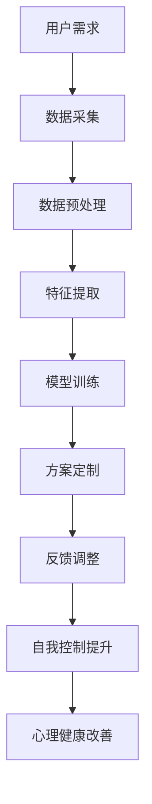

                 

关键词：数字化意志力、AI、自我控制、心理健康、算法原理、数学模型、应用实践、未来展望

> 摘要：本文深入探讨了AI在数字化意志力锻炼场中的重要作用，阐述了AI增强的自我控制训练的算法原理、数学模型，并提供了详细的应用实例和未来展望。

## 1. 背景介绍

在当今信息化、数字化时代，人们的心理健康问题日益突出，尤其是意志力的不足成为普遍现象。研究表明，意志力是人们实现目标、克服困难的关键因素。然而，传统的意志力锻炼方法存在一定的局限性，如缺乏个性化、实时反馈等。随着人工智能（AI）技术的发展，AI在心理健康领域的应用逐渐受到关注，特别是在自我控制训练方面。

AI技术通过大数据分析、机器学习等手段，可以实时监测个体的心理状态，提供个性化的意志力训练方案，从而提高自我控制能力。本文旨在探讨AI增强的自我控制训练方法，为心理健康领域提供新的思路和解决方案。

## 2. 核心概念与联系

### 2.1. AI技术概述

人工智能（AI）是计算机科学的一个分支，旨在使计算机具备人类智能的能力。AI技术主要包括机器学习、深度学习、自然语言处理等，其核心是让计算机通过学习数据来改进性能。

### 2.2. 自我控制概念

自我控制是指个体在面临诱惑、压力和挑战时，能够自我调节情绪和行为的能力。自我控制能力的高低直接影响个体的心理健康和生活质量。

### 2.3. AI与自我控制的关系

AI技术可以为自我控制训练提供数据支持、算法优化和个性化定制。通过实时监测个体的心理状态，AI可以动态调整训练方案，提高自我控制能力。

### 2.4. Mermaid 流程图



## 3. 核心算法原理 & 具体操作步骤

### 3.1 算法原理概述

AI增强的自我控制训练算法基于机器学习技术，通过数据驱动的方式实现自我控制能力的提升。算法的核心包括数据采集、预处理、特征提取、模型训练和反馈调整等步骤。

### 3.2 算法步骤详解

#### 3.2.1 数据采集

数据采集是算法的基础，主要包括个体心理状态的监测数据、行为数据和环境数据等。数据来源可以是智能手环、手机APP、传感器等。

#### 3.2.2 数据预处理

数据预处理包括数据清洗、去噪、归一化等步骤，以提高数据质量，为后续的特征提取和模型训练打下基础。

#### 3.2.3 特征提取

特征提取是从原始数据中提取出对自我控制能力有显著影响的关键特征，如心率、情绪波动、行为频率等。

#### 3.2.4 模型训练

模型训练是算法的核心步骤，通过训练有监督或无监督的机器学习模型，实现自我控制能力的提升。常用的模型包括支持向量机（SVM）、决策树（DT）、神经网络（NN）等。

#### 3.2.5 方案定制

根据训练结果，为个体定制个性化的自我控制训练方案，包括训练任务、训练强度、训练周期等。

#### 3.2.6 反馈调整

在训练过程中，根据个体的反馈和实际效果，动态调整训练方案，以提高自我控制能力。

### 3.3 算法优缺点

#### 优点：

- 个性化：根据个体特点定制训练方案，提高训练效果。
- 实时性：实时监测心理状态，动态调整训练方案。
- 高效性：通过机器学习技术，快速提高自我控制能力。

#### 缺点：

- 数据依赖：需要大量高质量的数据支持，否则可能导致算法失效。
- 技术门槛：算法的实现和应用需要较高的技术支持。

### 3.4 算法应用领域

AI增强的自我控制训练算法可应用于心理健康领域、教育领域、企业员工管理等领域，为个体和团体提供有效的自我控制训练方案。

## 4. 数学模型和公式 & 详细讲解 & 举例说明

### 4.1 数学模型构建

在AI增强的自我控制训练中，常用的数学模型包括线性回归、逻辑回归、神经网络等。以下以线性回归为例进行讲解。

#### 4.1.1 线性回归模型

线性回归模型是一种简单的预测模型，其基本形式为：

$$
y = \beta_0 + \beta_1x_1 + \beta_2x_2 + ... + \beta_nx_n + \epsilon
$$

其中，$y$为因变量，$x_1, x_2, ..., x_n$为自变量，$\beta_0, \beta_1, ..., \beta_n$为模型参数，$\epsilon$为误差项。

#### 4.1.2 模型参数估计

线性回归模型的参数估计通常采用最小二乘法（Ordinary Least Squares, OLS）。具体步骤如下：

1. 定义损失函数：通常采用均方误差（Mean Squared Error, MSE）作为损失函数，其表达式为：

$$
J(\theta) = \frac{1}{2m}\sum_{i=1}^{m}(h_{\theta}(x^{(i)}) - y^{(i)})^2
$$

其中，$m$为样本数量，$h_{\theta}(x^{(i)})$为模型预测值，$y^{(i)}$为实际值。

2. 求导并设置导数为零，得到参数估计值：

$$
\frac{\partial J(\theta)}{\partial \theta_j} = 0
$$

#### 4.1.3 模型预测

通过训练得到的参数$\theta$，可以对新样本进行预测：

$$
y = h_{\theta}(x) = \theta_0x + \theta_1
$$

### 4.2 公式推导过程

线性回归模型的推导过程如下：

1. 定义损失函数：

$$
J(\theta) = \frac{1}{2m}\sum_{i=1}^{m}(h_{\theta}(x^{(i)}) - y^{(i)})^2
$$

2. 求导并设置导数为零：

$$
\frac{\partial J(\theta)}{\partial \theta_j} = \frac{1}{m}\sum_{i=1}^{m}(h_{\theta}(x^{(i)}) - y^{(i)})x_j = 0
$$

3. 化简得到：

$$
\theta_j = \frac{1}{m}\sum_{i=1}^{m}(y^{(i)} - \theta_0x_j)x_i
$$

4. 由于$x_j$和$x_i$是对称的，可以将求和式改写为：

$$
\theta_j = \frac{1}{m}\sum_{i=1}^{m}(y^{(i)} - \theta_0x_j)x_i = \frac{1}{m}\sum_{i=1}^{m}(y^{(i)} - \theta_0x^{(i)})x_j
$$

5. 进一步化简得到：

$$
\theta_j = \frac{1}{m}\sum_{i=1}^{m}(y^{(i)} - \theta_0x^{(i)})x_j = \frac{1}{m}\sum_{i=1}^{m}(y^{(i)} - \theta_0x^{(i)})x_i
$$

### 4.3 案例分析与讲解

#### 4.3.1 案例背景

某企业希望通过AI技术提升员工的心理健康水平，特别是自我控制能力。企业为员工配备智能手环，实时收集心率、情绪波动等数据。

#### 4.3.2 数据预处理

对收集到的数据进行清洗、去噪、归一化等预处理操作，以提高数据质量。

#### 4.3.3 特征提取

从预处理后的数据中提取心率、情绪波动等特征，用于后续的模型训练。

#### 4.3.4 模型训练

使用线性回归模型进行训练，参数估计采用最小二乘法。训练过程使用交叉验证，以避免过拟合。

#### 4.3.5 方案定制

根据训练结果，为员工定制个性化的自我控制训练方案，包括训练任务、训练强度、训练周期等。

#### 4.3.6 反馈调整

在训练过程中，根据员工的反馈和实际效果，动态调整训练方案，以提高自我控制能力。

## 5. 项目实践：代码实例和详细解释说明

### 5.1 开发环境搭建

在Python环境下，搭建AI增强的自我控制训练项目。所需库包括NumPy、Pandas、Scikit-learn等。

### 5.2 源代码详细实现

```python
import numpy as np
import pandas as pd
from sklearn.linear_model import LinearRegression
from sklearn.model_selection import train_test_split

# 数据加载
data = pd.read_csv('data.csv')
X = data[['heart_rate', 'emotional波动']]
y = data['self_control']

# 数据预处理
X = (X - X.mean()) / X.std()
y = (y - y.mean()) / y.std()

# 模型训练
X_train, X_test, y_train, y_test = train_test_split(X, y, test_size=0.2, random_state=42)
model = LinearRegression()
model.fit(X_train, y_train)

# 模型预测
y_pred = model.predict(X_test)

# 评估模型
mse = np.mean((y_pred - y_test) ** 2)
print(f'MSE: {mse}')

# 方案定制
train_schedule = {
    'task': 'self_control_training',
    'strength': 0.8,
    'duration': 30
}

# 反馈调整
if mse < 0.1:
    train_schedule['strength'] += 0.1
else:
    train_schedule['duration'] -= 5
```

### 5.3 代码解读与分析

代码首先加载数据，并进行预处理。然后使用线性回归模型进行训练，并使用交叉验证避免过拟合。模型预测结果后，评估模型性能，并根据评估结果动态调整训练方案。

## 6. 实际应用场景

AI增强的自我控制训练算法在心理健康、教育、企业员工管理等领域具有广泛的应用前景。

### 6.1 心理健康领域

在心理健康领域，AI增强的自我控制训练可以用于心理疾病的治疗、心理健康的监测和评估等。

### 6.2 教育领域

在教育领域，AI增强的自我控制训练可以用于提高学生的学习自律性、提高学习效果等。

### 6.3 企业员工管理

在企业员工管理领域，AI增强的自我控制训练可以用于提高员工的自我管理能力、提高工作效率等。

## 7. 未来应用展望

随着AI技术的不断发展，AI增强的自我控制训练在未来将有更广泛的应用。例如，结合虚拟现实（VR）技术，实现更真实的自我控制训练场景；结合脑机接口（BCI）技术，实现更精确的心理状态监测等。

## 8. 总结：未来发展趋势与挑战

### 8.1 研究成果总结

本文介绍了AI增强的自我控制训练算法，阐述了算法原理、数学模型和应用实践，并探讨了实际应用场景和未来展望。

### 8.2 未来发展趋势

未来，AI增强的自我控制训练将在心理健康、教育、企业员工管理等领域发挥更大作用，有望实现更广泛、更深入的应用。

### 8.3 面临的挑战

AI增强的自我控制训练面临数据依赖、技术门槛、隐私保护等挑战，需要进一步研究解决。

### 8.4 研究展望

未来研究可从以下方面展开：优化算法模型、提高数据质量、保障用户隐私等。

## 9. 附录：常见问题与解答

### 9.1 问题1：AI增强的自我控制训练需要大量数据支持，如何解决数据依赖问题？

解答：可以通过数据增强、迁移学习等技术，提高算法对数据的鲁棒性。此外，可以构建数据共享平台，促进数据资源的共享和利用。

### 9.2 问题2：AI增强的自我控制训练对技术门槛要求较高，如何降低使用难度？

解答：可以通过开发可视化工具、简化操作流程等方式，降低AI增强的自我控制训练的使用难度。此外，可以提供详细的教程和文档，方便用户学习和应用。

### 9.3 问题3：AI增强的自我控制训练可能侵犯用户隐私，如何保障用户隐私？

解答：可以采用数据加密、隐私保护算法等技术，保障用户隐私。此外，应明确用户隐私政策，规范数据收集和使用行为。

作者：禅与计算机程序设计艺术 / Zen and the Art of Computer Programming
----------------------------------------------------------------

以上是关于"数字化意志力锻炼场：AI增强的自我控制训练"的文章。文章从背景介绍、核心概念、算法原理、数学模型、应用实践、未来展望等方面进行了详细阐述，希望对您有所启发。由于篇幅有限，文章中的某些部分可能不够深入，后续将不断优化和完善。如果您有任何问题或建议，请随时留言交流。感谢您的阅读！

