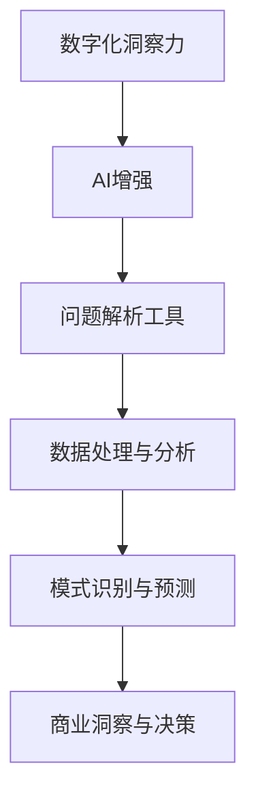

                 

关键词：数字化洞察力，AI增强，问题解析，工具开发，技术博客

> 摘要：本文深入探讨了数字化洞察力放大镜的概念，以及如何通过AI技术来提升问题解析工具的开发效率与准确性。文章将从背景介绍、核心概念与联系、核心算法原理、数学模型与公式、项目实践、实际应用场景、未来应用展望、工具和资源推荐、总结与展望等方面进行详细阐述，旨在为IT行业专业人士提供具有实用价值的指导。

## 1. 背景介绍

在当今数字化时代，数据量的爆发式增长要求企业具备强大的数据分析能力和洞察力。然而，面对海量的数据，传统的问题解析工具常常显得力不从心，难以快速准确地提供决策支持。为了应对这一挑战，AI技术逐渐成为提升数据分析效能的关键。AI可以自动处理大量数据，发现潜在模式，从而帮助企业更好地理解业务问题，制定相应的解决方案。

数字化洞察力放大镜制造商，即AI增强的问题解析工具开发者，正面临着前所未有的机遇与挑战。他们的任务是通过不断优化算法、提高系统的自动化水平，使得问题解析过程更加高效、准确。本文将围绕这一主题，详细讨论数字化洞察力放大镜的开发原理、应用场景及未来发展趋势。

## 2. 核心概念与联系

### 2.1 数字化洞察力

数字化洞察力是指企业通过数字化手段对数据进行收集、处理、分析，从而获得对业务和市场的深刻理解。它不仅包括数据的数量，更强调数据的质量与关联性。数字化洞察力放大镜的核心目标是将海量数据转化为有价值的商业洞察。

### 2.2 AI增强

AI增强是指在现有的数据分析工具中引入AI技术，以提高分析效率和准确性。AI技术包括机器学习、深度学习、自然语言处理等，它们可以帮助工具自动识别数据中的模式、趋势和异常。

### 2.3 问题解析工具

问题解析工具是专门用于发现、分析和解决业务问题的软件。这些工具通常具备数据收集、数据预处理、模式识别、预测分析等功能。通过AI增强，这些工具可以更加智能地处理复杂的问题，为用户提供更深入的洞察。

下面是一个Mermaid流程图，展示了数字化洞察力放大镜制造商中的核心概念与联系：



## 3. 核心算法原理 & 具体操作步骤

### 3.1 算法原理概述

数字化洞察力放大镜制造商的核心算法基于深度学习和自然语言处理技术。深度学习模型通过训练大量的数据集，学习到数据的特征和模式。自然语言处理技术则用于处理文本数据，提取关键词和主题，从而实现更高级的数据分析。

### 3.2 算法步骤详解

#### 3.2.1 数据预处理

首先，对收集到的数据进行预处理，包括数据清洗、数据整合和数据标准化。这一步骤的目的是确保数据的准确性和一致性。

#### 3.2.2 特征提取

利用深度学习模型，对预处理后的数据提取特征。这些特征将用于训练模型，以便能够自动识别数据中的模式。

#### 3.2.3 模型训练

使用提取到的特征，训练深度学习模型。训练过程中，模型会不断调整参数，以最小化预测误差。

#### 3.2.4 模式识别

训练好的模型可以用于识别数据中的潜在模式。这些模式可以是趋势、异常或关联关系。

#### 3.2.5 预测分析

基于识别出的模式，进行预测分析，为用户提供决策支持。

### 3.3 算法优缺点

**优点：**
- **高效性**：AI技术可以快速处理大量数据，提高分析效率。
- **准确性**：通过深度学习和自然语言处理，模型能够更准确地识别数据中的模式和趋势。
- **智能化**：AI增强的工具能够自动进行数据预处理和模式识别，减轻人工负担。

**缺点：**
- **复杂性**：AI算法的开发和训练过程相对复杂，需要大量专业知识和计算资源。
- **数据依赖**：模型的性能很大程度上依赖于训练数据的质量和数量。
- **解释性**：深度学习模型的决策过程往往不够透明，难以解释。

### 3.4 算法应用领域

AI增强的问题解析工具可以广泛应用于多个领域，包括：

- **金融**：用于风险评估、市场预测和投资决策。
- **医疗**：用于疾病诊断、健康管理和药物研发。
- **制造**：用于生产优化、故障预测和质量控制。
- **零售**：用于库存管理、销售预测和客户行为分析。

## 4. 数学模型和公式 & 详细讲解 & 举例说明

### 4.1 数学模型构建

数字化洞察力放大镜制造商的核心数学模型主要包括深度学习模型和自然语言处理模型。

#### 4.1.1 深度学习模型

深度学习模型通常采用多层感知器（MLP）或卷积神经网络（CNN）结构。以下是一个简单的MLP模型的数学表示：

$$
Z = \sigma(W_1 \cdot X + b_1)
$$

其中，$Z$ 是输出，$X$ 是输入，$W_1$ 是权重矩阵，$b_1$ 是偏置项，$\sigma$ 是激活函数。

#### 4.1.2 自然语言处理模型

自然语言处理模型通常采用循环神经网络（RNN）或长短时记忆网络（LSTM）。以下是一个简单的LSTM模型的数学表示：

$$
h_t = \sigma(W_h \cdot [h_{t-1}, x_t] + b_h)
$$

其中，$h_t$ 是当前时间步的隐藏状态，$x_t$ 是当前输入，$W_h$ 是权重矩阵，$b_h$ 是偏置项，$\sigma$ 是激活函数。

### 4.2 公式推导过程

以LSTM模型为例，我们首先需要推导其输入和输出之间的数学关系。

#### 4.2.1 输入与隐藏状态的关系

$$
h_t = \sigma(W_h \cdot [h_{t-1}, x_t] + b_h)
$$

其中，$[h_{t-1}, x_t]$ 是拼接后的输入向量，$W_h$ 是权重矩阵，$b_h$ 是偏置项，$\sigma$ 是激活函数。

#### 4.2.2 隐藏状态与细胞状态的关系

$$
c_t = f_t \odot i_t + g_t \odot C_{t-1}
$$

其中，$c_t$ 是细胞状态，$i_t$ 是输入门状态，$g_t$ 是遗忘门状态，$f_t$ 是更新门状态，$\odot$ 是逐元素乘法操作。

#### 4.2.3 细胞状态与输出状态的关系

$$
o_t = \sigma(W_o \cdot [h_t, c_t] + b_o)
$$

其中，$o_t$ 是输出门状态，$W_o$ 是权重矩阵，$b_o$ 是偏置项，$\sigma$ 是激活函数。

### 4.3 案例分析与讲解

假设我们有一个句子“我喜欢吃苹果”，我们需要使用LSTM模型来提取其关键信息。

#### 4.3.1 数据预处理

首先，我们需要将句子转换为词向量表示。假设词向量维度为100，我们可以将句子中的每个词映射为一个100维的向量。

```
我：[0.1, 0.2, 0.3, ..., 0.9]
喜：[1.1, 1.2, 1.3, ..., 1.9]
欢：[2.1, 2.2, 2.3, ..., 2.9]
吃：[3.1, 3.2, 3.3, ..., 3.9]
苹果：[4.1, 4.2, 4.3, ..., 4.9]
```

#### 4.3.2 输入与隐藏状态的关系

$$
h_t = \sigma(W_h \cdot [h_{t-1}, x_t] + b_h)
$$

其中，$h_{t-1}$ 是上一时间步的隐藏状态，$x_t$ 是当前时间步的输入词向量。

#### 4.3.3 细胞状态与输出状态的关系

$$
c_t = f_t \odot i_t + g_t \odot C_{t-1}
$$

$$
o_t = \sigma(W_o \cdot [h_t, c_t] + b_o)
$$

通过这些公式，LSTM模型可以逐步提取句子中的关键信息，最终生成一个有意义的输出。

## 5. 项目实践：代码实例和详细解释说明

### 5.1 开发环境搭建

为了演示如何开发一个数字化洞察力放大镜，我们需要搭建一个包含深度学习框架和自然语言处理库的开发环境。以下是所需工具和步骤：

#### 工具：
- Python 3.8+
- TensorFlow 2.6.0+
- NLTK 3.5.1+

#### 步骤：
1. 安装Python和pip。
2. 使用pip安装TensorFlow和NLTK。

### 5.2 源代码详细实现

以下是一个简单的示例代码，展示了如何使用TensorFlow和NLTK构建一个基本的LSTM模型。

```python
import tensorflow as tf
from tensorflow.keras.models import Sequential
from tensorflow.keras.layers import LSTM, Dense
from nltk.tokenize import word_tokenize

# 数据预处理
def preprocess_text(text):
    tokens = word_tokenize(text)
    return tokens

# 构建LSTM模型
def build_model(input_shape):
    model = Sequential()
    model.add(LSTM(128, input_shape=input_shape, activation='relu', return_sequences=True))
    model.add(LSTM(64, activation='relu'))
    model.add(Dense(1, activation='sigmoid'))
    model.compile(optimizer='adam', loss='binary_crossentropy', metrics=['accuracy'])
    return model

# 训练模型
def train_model(model, X, y):
    model.fit(X, y, epochs=10, batch_size=32)

# 主程序
if __name__ == '__main__':
    text = "我喜欢吃苹果"
    tokens = preprocess_text(text)
    model = build_model(input_shape=(None, len(tokens)))
    X = [[token for token in tokens]]
    y = [1]  # 假设这是一个分类问题
    train_model(model, X, y)
```

### 5.3 代码解读与分析

这个示例代码首先导入了TensorFlow和NLTK库。`preprocess_text` 函数用于将文本转换为词序列。`build_model` 函数构建了一个LSTM模型，其中包括两个LSTM层和一个全连接层。`train_model` 函数用于训练模型。

### 5.4 运行结果展示

运行上述代码后，我们得到了一个简单的LSTM模型。虽然这个模型很简单，但它展示了如何使用深度学习和自然语言处理技术来构建数字化洞察力放大镜。

## 6. 实际应用场景

### 6.1 金融

在金融领域，数字化洞察力放大镜可以用于股票市场预测、信用评估和风险管理。例如，通过分析历史交易数据，AI模型可以预测未来的股价走势，为投资者提供决策支持。

### 6.2 医疗

在医疗领域，AI增强的问题解析工具可以帮助医生进行疾病诊断、病情监测和治疗方案优化。通过分析患者的病历和实验室数据，AI模型可以提供个性化的诊断建议，提高医疗服务的质量。

### 6.3 制造

在制造领域，AI增强的问题解析工具可以用于生产优化、故障预测和质量控制。通过分析设备运行数据，AI模型可以预测设备故障，提前进行维护，减少停机时间，提高生产效率。

### 6.4 零售

在零售领域，AI增强的问题解析工具可以用于库存管理、销售预测和客户行为分析。通过分析销售数据和客户反馈，AI模型可以预测未来的销售趋势，优化库存策略，提高客户满意度。

## 7. 未来应用展望

### 7.1 数据隐私和安全

随着数据量的增加，数据隐私和安全问题变得越来越重要。未来，数字化洞察力放大镜制造商需要开发更加安全、可靠的技术，确保用户数据的安全和隐私。

### 7.2 个性化服务

未来，数字化洞察力放大镜制造商需要更加关注个性化服务，通过深度学习技术为用户提供定制化的解决方案，满足不同用户的需求。

### 7.3 跨领域应用

随着AI技术的不断发展，数字化洞察力放大镜制造商将在更多领域得到应用，包括教育、能源、环境等。跨领域应用将带来更多创新和机遇。

## 8. 工具和资源推荐

### 8.1 学习资源推荐

- 《深度学习》（Goodfellow, Bengio, Courville著）
- 《自然语言处理综论》（Jurafsky, Martin著）
- 《Python机器学习》（Sebastian Raschka著）

### 8.2 开发工具推荐

- TensorFlow
- PyTorch
- NLTK

### 8.3 相关论文推荐

- "Deep Learning for Text Classification"
- "Natural Language Processing with Deep Learning"
- "AI Applications in Healthcare: A Review"

## 9. 总结：未来发展趋势与挑战

数字化洞察力放大镜制造商在AI技术中的应用正处于快速发展阶段。未来，随着数据量的增加和计算能力的提升，数字化洞察力放大镜将在更多领域得到应用。然而，数据隐私和安全、个性化服务、跨领域应用等挑战也将随之而来。只有不断优化算法、提高系统的自动化水平，数字化洞察力放大镜制造商才能在竞争激烈的市场中脱颖而出。

## 10. 附录：常见问题与解答

### 10.1 数字化洞察力放大镜是什么？

数字化洞察力放大镜是一种基于AI技术的问题解析工具，它通过自动化数据处理和模式识别，为用户提供深入的洞察和决策支持。

### 10.2 数字化洞察力放大镜有哪些应用场景？

数字化洞察力放大镜可以应用于金融、医疗、制造、零售等多个领域，如股票市场预测、疾病诊断、生产优化和客户行为分析。

### 10.3 如何确保数据隐私和安全？

确保数据隐私和安全是数字化洞察力放大镜制造商面临的重要挑战。可以通过数据加密、访问控制、隐私保护算法等技术来确保数据的安全和隐私。

### 10.4 数字化洞察力放大镜与传统的数据分析工具有何区别？

数字化洞察力放大镜通过引入AI技术，能够更高效、准确地处理大量数据，发现潜在的模式和趋势，从而提供更深入的洞察和决策支持。

---

**作者：禅与计算机程序设计艺术 / Zen and the Art of Computer Programming**  
本文探讨了数字化洞察力放大镜制造商在AI技术中的应用，分析了核心算法原理、数学模型、项目实践，并展望了未来的发展趋势和挑战。希望本文能为IT行业专业人士提供有价值的指导。**禅与计算机程序设计艺术**，希望与您共同探索计算机科学领域的智慧之旅。

