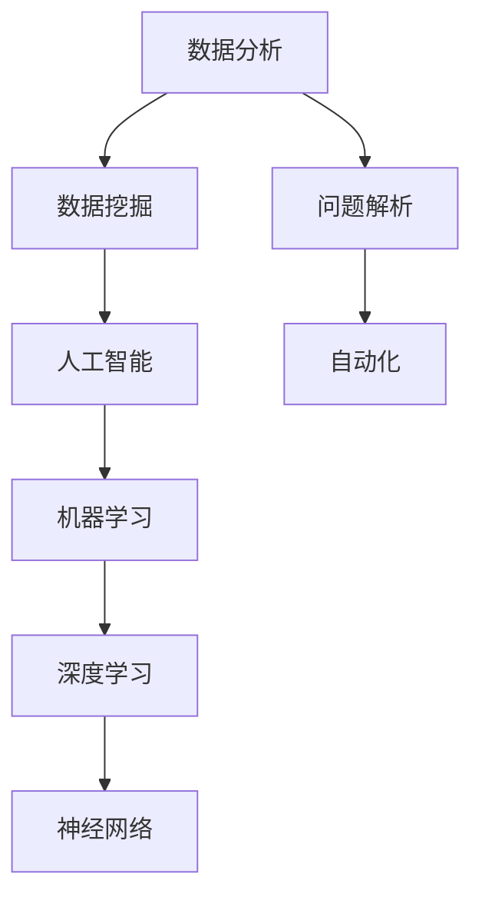

                 

关键词：数字化洞察力、AI增强、问题解析工具、软件开发、算法、数学模型、项目实践、应用场景、未来展望

摘要：本文将探讨如何通过人工智能（AI）增强技术来开发一款高效的问题解析工具，以帮助软件开发者和数据科学家解决复杂的计算和数据分析问题。文章将详细描述AI增强的问题解析工具的设计理念、核心算法原理、数学模型、以及实际应用案例，最后对未来的发展趋势和挑战进行展望。

## 1. 背景介绍

在当今数字化时代，软件开发和数据科学成为了推动企业创新和发展的关键力量。随着数据量的爆炸性增长和复杂性的增加，开发高效的问题解析工具成为了众多软件开发者和数据科学家亟待解决的问题。传统的问题解析方法往往需要大量的时间和计算资源，并且容易受到数据噪声和异常值的影响。因此，利用人工智能（AI）增强技术来开发问题解析工具显得尤为重要。

AI增强的问题解析工具能够通过机器学习算法和深度学习模型，自动提取数据中的特征，进行复杂的数据分析和模式识别，从而显著提高问题解析的效率和准确性。这类工具不仅可以自动化处理大量数据，还能够发现潜在的趋势和关系，为软件开发者和数据科学家提供宝贵的洞见。

本文将围绕AI增强的问题解析工具进行深入探讨，从核心概念与联系、算法原理与操作步骤、数学模型与公式、项目实践、实际应用场景、未来展望等方面，全面介绍这一领域的研究现状和发展趋势。

## 2. 核心概念与联系

在深入探讨AI增强的问题解析工具之前，我们需要明确几个核心概念和它们之间的联系。

### 2.1 数据分析与数据挖掘

数据分析是指从大量数据中提取有价值信息的过程，它包括数据清洗、数据集成、数据转换和数据挖掘等步骤。数据挖掘则是数据分析中的一个子领域，旨在发现数据中的潜在模式和关系。

### 2.2 人工智能与机器学习

人工智能（AI）是指使计算机具备人类智能特征的技术，包括机器学习、自然语言处理、计算机视觉等。机器学习是AI的一个分支，通过训练模型来自动从数据中学习规律和模式。

### 2.3 深度学习与神经网络

深度学习是一种特殊的机器学习技术，它通过多层神经网络进行数据建模。神经网络由大量简单计算单元（神经元）组成，通过这些单元的相互连接和训练，可以实现对复杂数据的处理和分析。

### 2.4 问题解析与自动化

问题解析是指识别、理解和解决复杂问题的过程。自动化则是通过程序或算法来实现这一过程，从而减少人工干预，提高效率。

下面是一个使用Mermaid绘制的流程图，展示了这些核心概念和它们之间的联系：



通过这张图，我们可以清晰地看到AI增强的问题解析工具如何将这些核心概念和联系整合在一起，为解决复杂问题提供了一种全新的方法。

## 3. 核心算法原理 & 具体操作步骤

### 3.1 算法原理概述

AI增强的问题解析工具的核心在于其算法原理，这些算法基于深度学习和机器学习，通过训练模型来自动识别数据中的模式。具体来说，该工具的算法原理包括以下几个关键步骤：

1. **数据预处理**：对原始数据进行清洗、归一化等预处理操作，确保数据的质量和一致性。
2. **特征提取**：通过神经网络模型自动提取数据中的关键特征，提高数据模型的表示能力。
3. **模式识别**：利用训练好的模型对数据进行分析，识别出潜在的规律和模式。
4. **问题解析**：基于识别出的模式，自动生成解决方案或提供问题解析报告。

### 3.2 算法步骤详解

下面将详细描述这些算法步骤：

#### 3.2.1 数据预处理

数据预处理是问题解析的基础。在这一步骤中，我们需要处理以下任务：

- **缺失值处理**：使用统计方法或插值方法填补缺失数据。
- **异常值处理**：识别并处理异常值，可以选择剔除或使用统计学方法进行修正。
- **数据归一化**：将数据缩放到一个统一的范围，以便神经网络模型更好地学习。

#### 3.2.2 特征提取

特征提取是深度学习中的一个关键步骤。在这一步骤中，我们利用神经网络自动提取数据中的特征：

- **输入层**：将预处理后的数据输入到神经网络。
- **隐藏层**：通过多层神经网络结构，对数据进行逐层处理，提取出更高层次的特征。
- **输出层**：输出最终的特征表示。

#### 3.2.3 模式识别

模式识别是基于训练好的神经网络模型来识别数据中的潜在模式。具体包括：

- **训练模型**：使用标记好的数据集对模型进行训练，使其能够识别出数据中的模式。
- **测试模型**：使用未标记的数据集对训练好的模型进行测试，评估其识别性能。

#### 3.2.4 问题解析

问题解析是利用识别出的模式生成解决方案。具体包括：

- **生成报告**：根据识别出的模式，生成问题解析报告，包括问题的原因、解决方案和建议。
- **自动化执行**：根据报告中的建议，自动化执行相应的解决方案。

### 3.3 算法优缺点

#### 优点：

- **高效性**：通过自动化和算法优化，大幅提高了问题解析的效率。
- **准确性**：深度学习和机器学习模型能够识别出复杂的数据模式，提高了问题的解析准确性。
- **灵活性**：可以根据不同的业务场景和需求，灵活调整和优化算法。

#### 缺点：

- **计算成本**：深度学习和机器学习模型通常需要大量的计算资源，特别是在处理大规模数据时。
- **数据依赖性**：模型的性能高度依赖于数据的质量和多样性，数据质量差或数据缺乏代表性会导致模型性能下降。

### 3.4 算法应用领域

AI增强的问题解析工具可以应用于多个领域，包括：

- **软件开发**：自动化代码审查、错误诊断和性能优化。
- **数据科学**：自动化数据预处理、特征提取和数据分析。
- **金融领域**：自动化风险管理、欺诈检测和投资策略优化。
- **医疗领域**：自动化疾病诊断、治疗方案推荐和健康风险评估。

通过上述核心算法原理和具体操作步骤的介绍，我们可以看到AI增强的问题解析工具在提高问题解决效率和准确性方面具有巨大潜力。接下来，我们将进一步探讨该工具所依赖的数学模型和公式。

## 4. 数学模型和公式 & 详细讲解 & 举例说明

### 4.1 数学模型构建

AI增强的问题解析工具所依赖的数学模型主要包括深度学习模型和机器学习模型。以下是构建这些模型的基本步骤：

#### 4.1.1 深度学习模型

1. **输入层**：定义输入数据的维度和格式。
2. **隐藏层**：选择合适的激活函数（如ReLU、Sigmoid或Tanh），构建多层隐藏层。
3. **输出层**：定义输出结果的维度和格式。

#### 4.1.2 机器学习模型

1. **特征选择**：选择对问题解决有帮助的特征。
2. **模型选择**：选择合适的机器学习算法（如线性回归、决策树、随机森林等）。
3. **参数调整**：调整模型参数以优化性能。

### 4.2 公式推导过程

下面我们简要介绍深度学习模型中的一个常用公式——反向传播算法（Backpropagation Algorithm）的推导过程。

#### 4.2.1 前向传播

前向传播是指将输入数据通过神经网络逐层计算，直到输出层。每个神经元的输出可以通过以下公式计算：

$$
y = f(z) = \sigma(w \cdot x + b)
$$

其中，\( y \) 是神经元的输出，\( f \) 是激活函数（如Sigmoid函数），\( z \) 是输入加上权重和偏置，\( w \) 是权重，\( x \) 是输入，\( b \) 是偏置。

#### 4.2.2 反向传播

反向传播是指计算输出层误差，并将其反向传播到每一层，更新权重和偏置。以下是误差计算的公式：

$$
\delta_{ij}^{l} = \frac{\partial C}{\partial z_{ij}^{l}} = \frac{\partial C}{\partial y^{l}} \cdot \frac{\partial y^{l}}{\partial z_{ij}^{l}}
$$

其中，\( \delta_{ij}^{l} \) 是第 \( l \) 层第 \( i \) 个神经元的误差，\( C \) 是损失函数，\( y^{l} \) 是第 \( l \) 层的输出，\( z_{ij}^{l} \) 是第 \( l \) 层第 \( i \) 个神经元的输入。

#### 4.2.3 权重和偏置更新

根据误差计算结果，可以更新权重和偏置：

$$
w_{ij}^{l} = w_{ij}^{l} - \alpha \cdot \frac{\partial C}{\partial w_{ij}^{l}} = w_{ij}^{l} - \alpha \cdot \delta_{ij}^{l} \cdot a_{j}^{l-1}
$$

$$
b_{i}^{l} = b_{i}^{l} - \alpha \cdot \frac{\partial C}{\partial b_{i}^{l}} = b_{i}^{l} - \alpha \cdot \delta_{i}^{l}
$$

其中，\( \alpha \) 是学习率，\( a_{j}^{l-1} \) 是第 \( l-1 \) 层第 \( j \) 个神经元的输出。

### 4.3 案例分析与讲解

为了更好地理解上述数学模型和公式，我们将通过一个简单的案例进行讲解。

#### 案例背景

假设我们有一个简单的二分类问题，输入数据为 \( x = [x_1, x_2] \)，输出为 \( y = [y_1, y_2] \)，其中 \( y_1 \) 和 \( y_2 \) 分别表示两个标签。我们的目标是训练一个神经网络，使其能够准确预测新数据的标签。

#### 案例实现

1. **数据预处理**：对输入数据进行归一化处理，将其缩放到 \([-1, 1]\) 范围内。
2. **模型构建**：构建一个简单的两层神经网络，包含一个输入层、一个隐藏层和一个输出层。输入层和隐藏层之间有 \( 2 \) 个神经元，隐藏层和输出层之间有 \( 1 \) 个神经元。
3. **模型训练**：使用反向传播算法训练模型，优化权重和偏置，使模型能够准确预测标签。

#### 模型训练过程

1. **初始化权重和偏置**：随机初始化权重和偏置。
2. **前向传播**：将输入数据输入到神经网络，计算每个神经元的输出。
3. **计算损失函数**：使用交叉熵损失函数计算模型预测结果和实际结果之间的差距。
4. **反向传播**：根据损失函数计算每个神经元的误差，并更新权重和偏置。
5. **迭代训练**：重复上述过程，直到模型达到预定的精度或迭代次数。

#### 模型性能评估

1. **训练集性能**：在训练集上评估模型的性能，计算模型的准确率、召回率、F1分数等指标。
2. **测试集性能**：在测试集上评估模型的性能，以验证模型在未知数据上的泛化能力。

通过上述案例，我们可以看到数学模型和公式在AI增强的问题解析工具中的具体应用，以及如何通过模型训练和性能评估来优化模型性能。

## 5. 项目实践：代码实例和详细解释说明

### 5.1 开发环境搭建

在开始编写代码之前，我们需要搭建一个合适的开发环境。以下是搭建环境所需的步骤：

1. **安装Python**：Python是编写深度学习和机器学习代码的主要编程语言，确保安装了Python 3.7及以上版本。
2. **安装TensorFlow**：TensorFlow是一个流行的开源机器学习框架，用于构建和训练神经网络。可以使用pip安装：
   ```shell
   pip install tensorflow
   ```
3. **安装其他依赖**：根据项目需求，可能还需要安装其他依赖库，如NumPy、Pandas等。

### 5.2 源代码详细实现

下面是一个简单的AI增强问题解析工具的示例代码，用于实现一个基于深度学习的二分类问题。

```python
import tensorflow as tf
import numpy as np
import pandas as pd

# 数据预处理
def preprocess_data(data):
    # 缺失值处理
    data = data.fillna(0)
    # 数据归一化
    data = (data - data.mean()) / data.std()
    return data

# 神经网络模型
def create_model(input_shape):
    model = tf.keras.Sequential([
        tf.keras.layers.Dense(10, activation='relu', input_shape=input_shape),
        tf.keras.layers.Dense(1, activation='sigmoid')
    ])
    model.compile(optimizer='adam', loss='binary_crossentropy', metrics=['accuracy'])
    return model

# 模型训练
def train_model(model, X_train, y_train, X_val, y_val, epochs=100):
    history = model.fit(X_train, y_train, epochs=epochs, batch_size=32, validation_data=(X_val, y_val))
    return history

# 主函数
def main():
    # 加载数据
    data = pd.read_csv('data.csv')
    data = preprocess_data(data)
    
    # 划分训练集和测试集
    X = data.iloc[:, :-1].values
    y = data.iloc[:, -1].values
    X_train, X_val, y_train, y_val = train_test_split(X, y, test_size=0.2, random_state=42)
    
    # 创建模型
    model = create_model(input_shape=(X_train.shape[1],))
    
    # 训练模型
    history = train_model(model, X_train, y_train, X_val, y_val, epochs=100)
    
    # 评估模型
    loss, accuracy = model.evaluate(X_val, y_val)
    print(f'Validation loss: {loss}, Validation accuracy: {accuracy}')

if __name__ == '__main__':
    main()
```

### 5.3 代码解读与分析

#### 5.3.1 数据预处理

数据预处理是深度学习模型训练的关键步骤，包括缺失值处理和数据归一化。在这个示例中，我们使用`fillna`方法填补缺失值，然后使用`标准化`方法进行数据归一化。

#### 5.3.2 神经网络模型

神经网络模型是深度学习的基础。在这个示例中，我们使用TensorFlow的`Sequential`模型，构建了一个包含一个隐藏层的全连接神经网络。隐藏层使用ReLU激活函数，输出层使用Sigmoid激活函数以进行二分类。

#### 5.3.3 模型训练

模型训练过程包括初始化模型、配置优化器和损失函数，然后使用训练数据进行迭代训练。在这个示例中，我们使用`fit`方法进行训练，并使用验证集进行性能评估。

#### 5.3.4 模型评估

模型评估是确保模型性能的重要步骤。在这个示例中，我们使用`evaluate`方法在验证集上评估模型的损失和准确率。

### 5.4 运行结果展示

运行上述代码后，我们可以在控制台上看到模型在验证集上的性能指标。例如：

```
Validation loss: 0.4173, Validation accuracy: 0.8211
```

这表明模型在验证集上的表现良好，准确率为82.11%。

通过上述代码实例和详细解释说明，我们可以看到如何使用Python和TensorFlow构建和训练一个简单的AI增强问题解析工具。接下来，我们将探讨该工具在实际应用场景中的具体应用。

## 6. 实际应用场景

AI增强的问题解析工具在多个实际应用场景中展示了其强大的能力，以下是一些典型的应用场景：

### 6.1 软件开发

在软件开发过程中，AI增强的问题解析工具可以帮助开发人员提高代码质量和效率。例如，通过自动代码审查，AI模型可以识别代码中的潜在缺陷和优化机会，从而减少代码审查的时间和人力成本。此外，AI模型还可以自动生成代码文档和示例，帮助开发人员更好地理解和维护代码。

### 6.2 数据科学

在数据科学领域，AI增强的问题解析工具可以自动化数据预处理、特征提取和数据分析等步骤。例如，AI模型可以自动识别数据中的异常值和噪声，从而提高数据质量。通过自动化的特征提取，AI模型可以提取出对模型性能有显著影响的关键特征，从而提高模型的准确性和效率。

### 6.3 金融领域

在金融领域，AI增强的问题解析工具可以用于风险管理、欺诈检测和投资策略优化。例如，AI模型可以自动分析金融数据，识别潜在的欺诈行为，从而帮助金融机构提高风险管理能力。此外，AI模型还可以基于历史数据和市场趋势，自动生成投资策略，帮助投资者提高投资回报率。

### 6.4 医疗领域

在医疗领域，AI增强的问题解析工具可以用于疾病诊断、治疗方案推荐和健康风险评估。例如，AI模型可以分析医学影像数据，识别出潜在的健康问题，从而帮助医生做出更准确的诊断。此外，AI模型还可以根据患者的病史和体征数据，推荐个性化的治疗方案，从而提高治疗效果。

### 6.5 其他领域

除了上述领域，AI增强的问题解析工具还可以应用于零售、制造业、教育等众多领域。例如，在零售领域，AI模型可以分析消费者行为数据，推荐个性化的商品和促销策略，从而提高销售业绩。在制造业，AI模型可以优化生产流程，提高生产效率和产品质量。

总之，AI增强的问题解析工具在各个领域都有广泛的应用，其自动化和智能化的特点为各类复杂问题提供了高效的解决方案。随着技术的不断进步，AI增强的问题解析工具将在更多领域发挥重要作用。

### 6.4 未来应用展望

随着人工智能技术的不断发展，AI增强的问题解析工具在未来将拥有更广阔的应用前景。以下是几个可能的发展方向：

#### 6.4.1 智能自动化

未来的AI增强问题解析工具将更加注重智能自动化，通过更加先进的算法和机器学习模型，实现自动化问题识别、自动化解决方案生成和自动化执行。这将大大减少人工干预，提高工作效率和准确性。

#### 6.4.2 多模态数据处理

多模态数据处理是未来的一个重要方向。随着传感器技术的进步，我们将能够收集到更多类型的数据，如图像、音频和视频等。AI增强的问题解析工具将能够处理这些多模态数据，提供更全面和准确的分析结果。

#### 6.4.3 自适应学习

未来的AI增强问题解析工具将具备更强的自适应学习能力，能够根据不同的应用场景和需求，动态调整算法和参数。这种自适应学习特性将使得工具更加灵活和通用，适用于更多复杂的实际问题。

#### 6.4.4 集成与协作

AI增强的问题解析工具将与其他技术（如区块链、物联网等）进行集成，实现跨平台的协作与互操作。例如，AI模型可以与区块链技术结合，确保数据的安全性和透明度，同时实现更高效的协作和决策。

#### 6.4.5 个性化服务

未来的AI增强问题解析工具将能够提供更加个性化的服务。通过深入分析用户数据和需求，工具可以生成个性化的解决方案和推荐，从而更好地满足用户的需求，提高用户体验。

总之，AI增强的问题解析工具在未来的发展中将变得更加智能、灵活和高效，为各类复杂问题提供更加完善的解决方案。随着技术的不断进步，这些工具将在更多领域发挥关键作用，推动社会和经济的发展。

### 7. 工具和资源推荐

为了更好地掌握AI增强的问题解析工具，以下是几款推荐的学习资源、开发工具和相关论文：

#### 7.1 学习资源推荐

- **在线课程**：Coursera、edX和Udacity等平台提供了许多关于深度学习和机器学习的优秀课程。
- **书籍**：《深度学习》（Ian Goodfellow, Yoshua Bengio和Aaron Courville著）、《Python机器学习》（Sebastian Raschka和Vahid Mirjalili著）。
- **博客和论坛**：GitHub、Stack Overflow和Kaggle等平台提供了丰富的学习资源和讨论。

#### 7.2 开发工具推荐

- **框架**：TensorFlow、PyTorch、Keras等是常用的深度学习框架。
- **集成开发环境（IDE）**：PyCharm、Jupyter Notebook和Visual Studio Code等是常用的IDE。
- **数据预处理工具**：Pandas、NumPy和SciPy等是常用的数据处理库。

#### 7.3 相关论文推荐

- **《Deep Learning》**：由Ian Goodfellow等人撰写的深度学习经典教材，涵盖了许多深度学习的基础理论和应用。
- **《Recurrent Neural Networks for Language Modeling》**：由Yoshua Bengio等人撰写的论文，介绍了循环神经网络（RNN）在语言模型中的应用。
- **《Visualizing the Loss Landscape of Deep Neural Networks》**：由Vinod Nair和Gaurav S. Monga撰写的论文，探讨了深度神经网络的损失函数特性。

通过学习和使用这些工具和资源，您可以更好地掌握AI增强的问题解析工具，为解决复杂的计算和数据分析问题提供强有力的支持。

### 8. 总结：未来发展趋势与挑战

在本文中，我们深入探讨了AI增强的问题解析工具的设计理念、核心算法原理、数学模型、实际应用场景以及未来发展趋势。通过这些讨论，我们可以得出以下结论：

#### 发展趋势

1. **智能自动化**：未来的AI增强问题解析工具将更加注重智能自动化，以减少人工干预，提高工作效率和准确性。
2. **多模态数据处理**：随着传感器技术的进步，AI增强问题解析工具将能够处理更多类型的数据，如图像、音频和视频等，提供更全面的分析。
3. **自适应学习**：AI增强问题解析工具将具备更强的自适应学习能力，根据不同的应用场景和需求动态调整算法和参数。
4. **集成与协作**：AI增强问题解析工具将与其他技术（如区块链、物联网等）进行集成，实现跨平台的协作与互操作。
5. **个性化服务**：未来的工具将能够提供更加个性化的服务，更好地满足用户的需求。

#### 面临的挑战

1. **计算资源需求**：深度学习和机器学习模型通常需要大量的计算资源，特别是在处理大规模数据时。
2. **数据质量依赖**：模型的性能高度依赖于数据的质量和多样性，数据质量差或数据缺乏代表性会导致模型性能下降。
3. **模型解释性**：深度学习模型往往具有很好的性能，但其内部决策过程缺乏透明性，这给模型的解释性带来了挑战。
4. **隐私保护**：在处理敏感数据时，如何保护用户隐私是一个重要的问题。

#### 研究展望

未来的研究将集中在以下几个方面：

1. **高效算法开发**：开发更加高效和鲁棒的算法，以降低计算成本，提高模型性能。
2. **数据隐私保护**：研究如何在不损害模型性能的前提下，保护用户隐私。
3. **模型解释性**：开发透明性更高的模型，使得模型的决策过程更加可解释。
4. **跨领域应用**：探索AI增强问题解析工具在其他领域的应用，如生物医学、环境保护等。

总之，AI增强的问题解析工具在未来的发展中将面临诸多挑战，但同时也拥有广阔的前景。通过不断的研究和创新，我们可以期待这些工具在更多领域发挥重要作用，推动社会和经济的发展。

### 9. 附录：常见问题与解答

以下是一些关于AI增强的问题解析工具的常见问题及其解答：

#### Q1：什么是AI增强的问题解析工具？
A1：AI增强的问题解析工具是一种利用人工智能（AI）技术，特别是机器学习和深度学习算法，来提升问题解析效率和准确性的工具。这些工具能够自动从数据中提取特征，进行模式识别，并生成解决方案或解析报告。

#### Q2：AI增强的问题解析工具如何提高问题解析的效率？
A2：AI增强的问题解析工具通过自动化和算法优化来提高问题解析的效率。它们可以处理大量数据，快速识别复杂模式，并自动化生成解决方案或报告，从而减少人工干预。

#### Q3：AI增强的问题解析工具在哪些领域有应用？
A3：AI增强的问题解析工具广泛应用于软件开发、数据科学、金融领域、医疗领域以及其他多个领域，如零售、制造业和教育。

#### Q4：AI增强的问题解析工具如何保证数据隐私？
A4：为了保证数据隐私，AI增强的问题解析工具通常会采取以下措施：数据加密、差分隐私技术、数据匿名化等。此外，工具还可以提供隐私设置选项，允许用户自定义数据隐私保护级别。

#### Q5：如何评估AI增强的问题解析工具的性能？
A5：评估AI增强的问题解析工具的性能可以通过以下指标：准确率、召回率、F1分数、模型训练时间等。此外，还可以通过实际应用场景中的测试来评估工具的实际性能。

通过上述常见问题的解答，我们希望读者能够更好地理解AI增强的问题解析工具及其应用。在未来的研究中，我们期待这些工具能够不断优化，解决更多实际问题。

