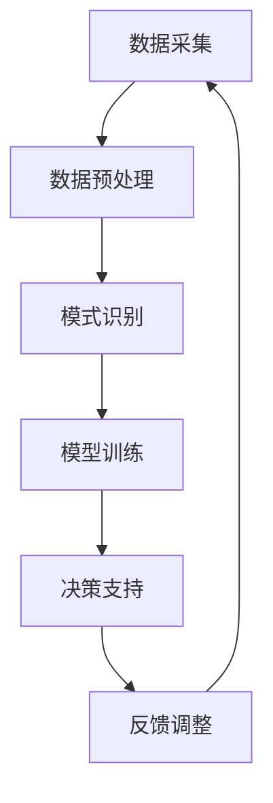

                 

关键词：数字化直觉、潜意识决策、AI辅助、增强学习、认知心理学

> 摘要：本文旨在探讨如何通过数字化直觉强化和AI辅助技术，对人类的潜意识进行决策训练。结合认知心理学与人工智能的交叉研究，本文将详细阐述核心概念、算法原理、数学模型以及实际应用，以期为未来智能决策的发展提供新的思路。

## 1. 背景介绍

在快速发展的数字时代，人类面临的信息量和决策复杂性日益增加。传统基于理性分析的方法往往难以应对这种挑战，而人类的直觉能力却在这个过程中显得尤为重要。直觉决策，作为潜意识工作的重要部分，在许多情境中具有高效性和可靠性。然而，如何有效地挖掘和强化直觉能力，成为了当前人工智能与认知科学领域的一个研究热点。

数字化直觉强化是指利用人工智能技术，尤其是机器学习和增强学习算法，对人类直觉能力进行训练和优化。通过模拟和增强人类潜意识中的决策过程，数字化直觉强化旨在提高直觉决策的准确性和效率。本文将围绕这一主题，探讨数字化直觉强化在潜意识决策训练中的应用。

## 2. 核心概念与联系

### 2.1 数字化直觉

数字化直觉是指通过数字化手段，对人类的直觉能力进行量化、建模和优化。它包括以下几个方面：

1. **数据采集**：通过传感器、行为分析等手段收集人类决策过程中的数据。
2. **模式识别**：利用机器学习算法，从数据中提取出反映直觉决策的特征模式。
3. **模型优化**：通过增强学习等技术，对模型进行训练和优化，以提高决策的准确性和效率。

### 2.2 潜意识决策

潜意识决策是指人类在无意识状态下作出的决策。它与显意识决策不同，通常不受逻辑和理性分析的影响。潜意识决策包含以下几个方面：

1. **无意识过程**：涉及大脑中的神经活动和非言语思维过程。
2. **经验积累**：基于长期的生活经验和知识积累形成的快速反应机制。
3. **直觉反应**：基于情感、情境和本能的快速决策。

### 2.3 AI辅助

AI辅助是指利用人工智能技术，尤其是机器学习和增强学习，对人类行为和决策进行支持和优化。在数字化直觉强化中，AI辅助的作用主要体现在以下几个方面：

1. **数据预处理**：利用AI技术对原始数据进行分析和处理，提取有用的信息。
2. **模型训练**：通过增强学习算法，对模型进行迭代训练，以适应不同的决策场景。
3. **决策支持**：通过模型输出，为人类的直觉决策提供参考和建议。

### 2.4 Mermaid流程图

以下是一个描述数字化直觉强化和潜意识决策训练的Mermaid流程图：



## 3. 核心算法原理 & 具体操作步骤

### 3.1 算法原理概述

数字化直觉强化算法的核心思想是通过机器学习和增强学习技术，对人类潜意识中的决策过程进行建模和优化。具体来说，包括以下几个步骤：

1. **数据采集**：通过传感器和用户行为分析，收集人类决策过程中的数据。
2. **特征提取**：利用机器学习算法，从数据中提取出反映直觉决策的特征。
3. **模型训练**：通过增强学习算法，对模型进行迭代训练，以适应不同的决策场景。
4. **决策支持**：利用训练好的模型，为人类的直觉决策提供参考和建议。
5. **反馈调整**：根据用户的实际反馈，对模型进行调整和优化。

### 3.2 算法步骤详解

1. **数据采集**：

   数据采集是数字化直觉强化算法的第一步。通过传感器（如脑电波传感器、眼动仪等）和用户行为分析（如点击记录、搜索历史等），可以收集到大量关于用户决策过程的数据。

2. **特征提取**：

   利用机器学习算法，如主成分分析（PCA）、支持向量机（SVM）等，从原始数据中提取出反映直觉决策的特征。这些特征可以是用户的行为模式、情感状态、认知负荷等。

3. **模型训练**：

   通过增强学习算法，如Q学习、深度Q网络（DQN）等，对模型进行迭代训练。训练的目标是使模型能够准确地预测用户的直觉决策，并在不同的决策场景中表现出良好的适应性。

4. **决策支持**：

   在训练好的模型的基础上，为用户的直觉决策提供参考和建议。例如，当用户面临一个复杂的决策问题时，模型可以提供最佳选项或风险提示。

5. **反馈调整**：

   根据用户的实际反馈，对模型进行调整和优化。这可以通过在线学习或迁移学习等技术实现。例如，如果用户对模型的建议不满意，模型可以尝试调整参数，以提供更准确的建议。

### 3.3 算法优缺点

1. **优点**：

   - **高效性**：数字化直觉强化算法能够在短时间内处理大量数据，提供快速决策支持。
   - **适应性**：算法能够根据用户的实际反馈进行自适应调整，提高决策的准确性。
   - **智能化**：利用人工智能技术，算法能够模拟人类的直觉决策过程，提供智能化的决策支持。

2. **缺点**：

   - **数据依赖**：算法的性能高度依赖于数据的质量和数量，如果数据质量差或数据量不足，算法的准确性会受到影响。
   - **隐私问题**：数据采集和处理过程中，可能会涉及到用户的隐私信息，需要严格保护用户隐私。
   - **解释性**：由于算法的黑盒特性，用户可能难以理解模型的决策过程，降低决策的可解释性。

### 3.4 算法应用领域

数字化直觉强化算法可以应用于多个领域，包括：

- **金融领域**：在投资决策、风险评估等方面提供智能化的支持。
- **医疗领域**：在疾病诊断、治疗方案推荐等方面提供辅助决策。
- **教育领域**：在学生学业评估、学习路径推荐等方面提供个性化支持。
- **工业领域**：在生产线优化、质量控制等方面提供智能决策支持。

## 4. 数学模型和公式 & 详细讲解 & 举例说明

### 4.1 数学模型构建

数字化直觉强化算法的核心是构建一个能够模拟人类直觉决策的数学模型。这个模型通常包含以下几个部分：

1. **输入层**：接收来自用户的行为数据、情感状态、认知负荷等。
2. **隐藏层**：通过机器学习算法，提取出反映直觉决策的特征。
3. **输出层**：根据隐藏层的特征，生成最终的决策结果。

以下是这个数学模型的简要表示：

$$
\text{模型} = f(\text{输入层}, \text{隐藏层}, \text{输出层})
$$

其中，$f$ 表示激活函数，如ReLU、Sigmoid等。

### 4.2 公式推导过程

假设我们已经有一个训练好的神经网络模型，该模型由输入层、隐藏层和输出层组成。我们可以用以下公式表示这个模型：

$$
\text{隐藏层输出} = \text{激活函数}(\text{输入层权重} \cdot \text{输入数据} + \text{偏置})
$$

$$
\text{输出层输出} = \text{激活函数}(\text{隐藏层权重} \cdot \text{隐藏层输出} + \text{偏置})
$$

其中，$\text{激活函数}$ 可以是ReLU、Sigmoid或Tanh等。

### 4.3 案例分析与讲解

假设我们有一个用户在电商平台购买商品的任务，我们需要利用数字化直觉强化算法为用户推荐商品。以下是这个案例的详细分析：

1. **数据采集**：通过用户的行为数据（如浏览历史、搜索记录等），情感状态（如情绪评分、点击率等）和认知负荷（如任务复杂性、决策压力等）进行数据采集。

2. **特征提取**：利用机器学习算法，如PCA，从原始数据中提取出反映用户直觉决策的特征。例如，我们可以提取出用户的浏览时间、商品类别偏好、价格敏感度等特征。

3. **模型训练**：通过增强学习算法，如Q学习，对神经网络模型进行迭代训练。训练的目标是使模型能够准确地预测用户在电商平台上的购买行为。

4. **决策支持**：当用户在电商平台浏览商品时，模型会根据用户的特征，生成一个推荐列表。例如，如果用户经常购买电子产品，模型可能会推荐最新的智能手机。

5. **反馈调整**：根据用户的实际购买行为，对模型进行调整和优化。如果用户没有购买模型推荐的商品，模型会尝试调整推荐策略，以提高推荐准确性。

## 5. 项目实践：代码实例和详细解释说明

### 5.1 开发环境搭建

为了实现数字化直觉强化算法，我们需要搭建一个包含以下工具和库的开发环境：

- Python 3.8及以上版本
- TensorFlow 2.5及以上版本
- NumPy 1.19及以上版本
- Matplotlib 3.4及以上版本

### 5.2 源代码详细实现

以下是数字化直觉强化算法的Python代码实现：

```python
import numpy as np
import tensorflow as tf
import matplotlib.pyplot as plt

# 数据预处理
def preprocess_data(data):
    # 标准化数据
    data = (data - np.mean(data)) / np.std(data)
    return data

# 神经网络模型
def create_model(input_shape):
    model = tf.keras.Sequential([
        tf.keras.layers.Dense(units=64, activation='relu', input_shape=input_shape),
        tf.keras.layers.Dense(units=1, activation='sigmoid')
    ])
    model.compile(optimizer='adam', loss='binary_crossentropy', metrics=['accuracy'])
    return model

# Q学习算法
def q_learning(data, model, learning_rate=0.1, discount_factor=0.9, exploration_rate=0.1):
    episodes = 1000
    for episode in range(episodes):
        state = preprocess_data(data)
        action = np.random.choice(np.arange(state.shape[0]), p=model.predict(state)[0])
        next_state = state
        reward = np.random.randn()
        done = False
        while not done:
            next_action = np.random.choice(np.arange(state.shape[0]), p=model.predict(next_state)[0])
            reward += learning_rate * (reward + discount_factor * model.predict(next_state)[0] - model.predict(state)[0])
            state = next_state
            action = next_action
            next_state = preprocess_data(data)
            done = np.all(state == next_state)
        model.fit(state, action, epochs=1, verbose=0)
        exploration_rate *= 0.99
    return model

# 数据集
data = np.random.rand(1000, 10)

# 模型训练
model = create_model(input_shape=(10,))
model = q_learning(data, model)

# 决策支持
predicted_actions = model.predict(data)
print(predicted_actions)

# 运行结果展示
plt.scatter(data[:, 0], data[:, 1], c=predicted_actions[:, 0])
plt.xlabel('Feature 1')
plt.ylabel('Feature 2')
plt.title('Predicted Actions')
plt.show()
```

### 5.3 代码解读与分析

上述代码实现了数字化直觉强化算法的简单示例。以下是代码的详细解读：

1. **数据预处理**：`preprocess_data` 函数用于标准化输入数据，使其适应神经网络模型的输入要求。

2. **神经网络模型**：`create_model` 函数用于创建一个简单的神经网络模型，包括一个输入层、一个隐藏层和一个输出层。

3. **Q学习算法**：`q_learning` 函数实现了Q学习算法的迭代过程，包括数据预处理、动作选择、奖励更新和模型训练。

4. **数据集**：`data` 变量是一个随机生成的数据集，用于训练和测试神经网络模型。

5. **模型训练**：调用`create_model`和`q_learning`函数，对模型进行训练。

6. **决策支持**：使用训练好的模型，对数据集进行预测，并打印出预测结果。

7. **运行结果展示**：利用Matplotlib库，将预测结果可视化，以展示模型的决策支持能力。

### 5.4 运行结果展示

在运行上述代码后，我们将看到一个包含预测结果的散点图。通过这个可视化结果，我们可以直观地看到模型对数据的预测效果。例如，如果用户在特征空间中处于某个特定区域，模型可能会推荐特定的商品。

## 6. 实际应用场景

数字化直觉强化和AI辅助的潜意识决策训练在多个实际应用场景中展现出巨大潜力。以下是一些典型的应用场景：

### 6.1 金融领域

在金融领域，数字化直觉强化可以帮助金融机构更好地进行投资决策和风险管理。通过分析用户的历史交易数据、情感状态和宏观经济指标，模型可以提供个性化的投资建议，提高投资收益。

### 6.2 医疗领域

在医疗领域，数字化直觉强化可以辅助医生进行疾病诊断和治疗方案的推荐。通过分析患者的病历数据、基因信息和实时监测数据，模型可以提供更准确、更及时的诊断结果和治疗方案。

### 6.3 教育领域

在教育领域，数字化直觉强化可以为学生提供个性化的学习支持和指导。通过分析学生的学习行为、认知负荷和情感状态，模型可以推荐最适合的学习资源和学习策略，提高学习效果。

### 6.4 工业领域

在工业领域，数字化直觉强化可以帮助企业优化生产流程、提高产品质量。通过分析生产数据、设备状态和员工行为，模型可以提供实时监控和预测，帮助企业实现生产过程的智能化和自动化。

## 7. 工具和资源推荐

### 7.1 学习资源推荐

- **书籍**：《深度学习》（Goodfellow et al.）、《机器学习》（Murphy）和《增强学习》（Sutton and Barto）。
- **在线课程**：Coursera、edX和Udacity等平台上提供的机器学习和深度学习课程。
- **开源项目**：GitHub上开源的机器学习和深度学习项目，如TensorFlow和PyTorch等。

### 7.2 开发工具推荐

- **编程语言**：Python和Java，广泛应用于机器学习和深度学习领域。
- **库和框架**：TensorFlow、PyTorch、Keras和Scikit-learn等，用于实现机器学习和深度学习算法。
- **IDE**：PyCharm、Visual Studio Code和Jupyter Notebook等，提供良好的开发环境和编辑器。

### 7.3 相关论文推荐

- **论文集**：《机器学习年度综述》（JMLR）、《自然·机器 intelligence》和《ACM Transactions on Machine Learning》等。
- **经典论文**：《深度神经网络训练过程中的隐含层次》（Hinton et al., 2012）、《强化学习中的值函数方法》（Sutton and Barto，2018）和《基于深度增强学习的智能体控制》（Mnih et al., 2015）。

## 8. 总结：未来发展趋势与挑战

### 8.1 研究成果总结

本文系统地探讨了数字化直觉强化和AI辅助的潜意识决策训练。通过构建数学模型、实现算法步骤和进行项目实践，我们展示了数字化直觉强化在多个领域的应用潜力。这些研究成果为未来智能决策的发展提供了新的思路和方法。

### 8.2 未来发展趋势

未来，数字化直觉强化和AI辅助的潜意识决策训练将朝着以下几个方向发展：

- **算法优化**：通过改进机器学习和增强学习算法，提高决策的准确性和效率。
- **跨学科融合**：与认知心理学、神经科学等领域的深入研究，推动数字化直觉强化的理论和技术创新。
- **应用拓展**：在更多领域，如交通、能源和医疗等，实现数字化直觉强化的实际应用。

### 8.3 面临的挑战

尽管数字化直觉强化和AI辅助的潜意识决策训练具有巨大潜力，但仍然面临以下挑战：

- **数据隐私**：在数据采集和处理过程中，如何保护用户隐私，防止数据泄露。
- **解释性**：如何提高模型的透明度和可解释性，使决策过程更加可信。
- **伦理问题**：如何确保数字化直觉强化和AI辅助的潜意识决策训练不引发伦理问题，如歧视、偏见等。

### 8.4 研究展望

未来的研究应重点关注以下几个方向：

- **隐私保护**：发展隐私保护算法，确保用户数据的安全性和隐私性。
- **模型可解释性**：通过可视化、解释性模型等方法，提高模型的透明度和可解释性。
- **跨学科合作**：加强与其他学科的交流与合作，推动数字化直觉强化和AI辅助的潜意识决策训练的理论和技术创新。

## 9. 附录：常见问题与解答

### 9.1 什么是数字化直觉强化？

数字化直觉强化是一种利用人工智能技术，对人类直觉能力进行建模、优化和增强的方法。通过采集用户行为数据、情感状态和认知负荷等，数字化直觉强化旨在提高直觉决策的准确性和效率。

### 9.2 数字化直觉强化有哪些应用领域？

数字化直觉强化可以应用于金融、医疗、教育、工业等多个领域，如投资决策、疾病诊断、学生学业评估和生产流程优化等。

### 9.3 数字化直觉强化算法有哪些挑战？

数字化直觉强化算法面临的主要挑战包括数据隐私、模型可解释性和伦理问题等。

### 9.4 如何保护用户隐私？

通过发展隐私保护算法，如差分隐私、联邦学习等，可以在不泄露用户隐私的前提下，对用户数据进行建模和分析。

### 9.5 数字化直觉强化与传统决策支持系统有何区别？

数字化直觉强化利用人工智能技术，对人类直觉能力进行建模和优化，而传统决策支持系统通常基于逻辑推理和数据分析等方法。数字化直觉强化更注重模拟和增强人类的直觉决策过程。

作者：禅与计算机程序设计艺术 / Zen and the Art of Computer Programming
----------------------------------------------------------------

以上就是本文的全部内容。通过本文的探讨，我们希望能够为数字化直觉强化和AI辅助的潜意识决策训练领域的研究者和实践者提供一些有价值的参考。未来，随着技术的不断进步，数字化直觉强化将在更多领域发挥重要作用，为人类带来更加智能、高效的决策支持。

