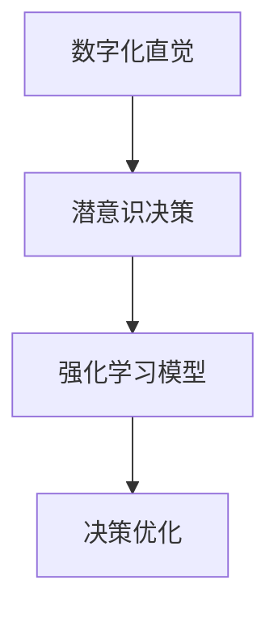

                 

关键词：数字化直觉、AI辅助、潜意识决策、强化学习、决策优化、认知神经科学

> 摘要：本文旨在探讨AI如何通过辅助人类的潜意识决策，提升数字化时代的认知能力和决策效率。本文将首先介绍数字化直觉的概念，随后分析潜意识决策在认知过程中的作用，并提出一种基于强化学习模型的AI辅助方法。通过构建数学模型和实例分析，本文将展示如何在实际应用中实现这一目标，并探讨其未来的发展趋势与挑战。

## 1. 背景介绍

随着数字技术的迅猛发展，人们的生活和工作越来越依赖于各种数字化工具和平台。然而，这种高度依赖性也带来了一些挑战。例如，在信息过载的环境下，如何快速准确地做出决策成为了一个重要问题。传统的决策方法往往依赖于逻辑分析和显性知识，但在复杂和不确定的环境中，这种方法可能并不足够有效。

近年来，人工智能（AI）技术的快速发展为解决这个问题提供了一种新的思路。AI系统具有强大的数据处理和分析能力，可以辅助人类做出更加明智的决策。然而，传统的AI方法往往侧重于显性知识的利用，对人类潜意识决策的理解和辅助较少。因此，如何利用AI技术挖掘和强化人类的潜意识决策能力，成为了一个值得探讨的问题。

本文旨在探讨AI如何通过辅助人类的潜意识决策，提升数字化时代的认知能力和决策效率。本文将首先介绍数字化直觉的概念，随后分析潜意识决策在认知过程中的作用，并提出一种基于强化学习模型的AI辅助方法。通过构建数学模型和实例分析，本文将展示如何在实际应用中实现这一目标，并探讨其未来的发展趋势与挑战。

## 2. 核心概念与联系

### 2.1 数字化直觉

数字化直觉是指人类在数字化环境中快速、准确地进行信息处理和决策的能力。它依赖于人类对数字世界的理解和感知，以及对数字工具和技术的熟练运用。数字化直觉不仅包括对数字信息的直观感知和判断，还包括对数字工具的快速操作和适应能力。

### 2.2 潜意识决策

潜意识决策是指人类在无意识或无法明确表达的情况下做出的决策。与显性决策不同，潜意识决策往往基于长期积累的经验和直觉，而不是逻辑分析和显性知识。研究表明，潜意识决策在许多情境下具有高效性和准确性，特别是在处理复杂和不确定的信息时。

### 2.3 强化学习模型

强化学习（Reinforcement Learning，RL）是一种机器学习范式，旨在通过试错和奖励机制来训练智能体（agent）在环境中做出最优决策。强化学习模型的核心是价值函数，它表示智能体在给定状态下的最佳动作选择。通过不断更新价值函数，智能体可以逐渐学会在复杂环境中做出最优决策。

### 2.4 数字化直觉与潜意识决策的关系

数字化直觉和潜意识决策之间存在密切的关系。数字化直觉依赖于潜意识决策的能力，而潜意识决策则通过数字化直觉得以实现。在数字化环境中，人类通过长期的学习和实践，积累了大量的数字知识和经验，这些知识和经验在潜意识中形成，并指导我们在面对新任务时快速做出决策。因此，提高数字化直觉的能力，实际上就是强化潜意识决策的能力。

### 2.5 Mermaid 流程图

下面是一个简化的Mermaid流程图，展示了数字化直觉、潜意识决策和强化学习模型之间的关系。



## 3. 核心算法原理 & 具体操作步骤

### 3.1 算法原理概述

基于强化学习模型的AI辅助潜意识决策方法，旨在通过模拟和强化人类的潜意识决策过程，提升数字化直觉的能力。该方法的核心思想是将人类的潜意识决策过程转化为机器学习问题，利用强化学习算法来优化决策策略。

### 3.2 算法步骤详解

#### 3.2.1 数据收集与预处理

首先，需要收集大量的人类决策数据，包括显性知识和潜意识决策过程。这些数据可以通过实验、调查或自然观察等方式获取。在收集数据后，需要进行预处理，包括数据清洗、数据归一化等步骤，以消除数据中的噪声和异常值。

#### 3.2.2 状态-动作空间构建

根据收集到的数据，构建状态-动作空间。状态空间表示决策过程中的所有可能状态，例如在某个特定任务中的各种情境。动作空间表示决策者可以采取的所有可能动作，例如选择某个选项或执行某个操作。

#### 3.2.3 强化学习模型训练

使用强化学习算法训练模型，以优化决策策略。在训练过程中，模型会不断尝试不同的动作，并根据奖励信号更新价值函数。通过多次迭代，模型可以逐渐学会在给定状态下选择最优动作。

#### 3.2.4 模型评估与优化

在训练完成后，对模型进行评估，以验证其在实际应用中的有效性。评估可以通过模拟实验或实际数据集进行。根据评估结果，可以进一步优化模型，提高决策策略的准确性。

### 3.3 算法优缺点

#### 3.3.1 优点

- **自适应性强**：强化学习模型可以根据不同情境和用户行为动态调整决策策略，具有较强的适应性。
- **高效性**：通过模拟和强化潜意识决策过程，可以有效提升决策效率，减少决策时间。
- **知识迁移**：通过在多个任务中训练模型，可以实现对知识的迁移和应用，提高模型的泛化能力。

#### 3.3.2 缺点

- **数据依赖性**：强化学习模型的训练需要大量高质量的决策数据，数据质量对模型性能有重要影响。
- **计算复杂度**：强化学习模型的训练和优化过程较为复杂，需要较高的计算资源和时间。

### 3.4 算法应用领域

基于强化学习模型的AI辅助潜意识决策方法可以应用于多个领域，包括但不限于：

- **电子商务**：帮助用户在商品选择和推荐中做出更明智的决策。
- **金融投资**：辅助投资者在股票市场等金融市场中做出高效的投资决策。
- **医疗诊断**：协助医生在诊断和治疗中做出更准确的决策。
- **教育评估**：辅助教师和学生进行学习效果评估和决策。

## 4. 数学模型和公式 & 详细讲解 & 举例说明

### 4.1 数学模型构建

基于强化学习模型的AI辅助潜意识决策方法可以表示为一个数学模型。该模型包括状态空间\( S \)、动作空间\( A \)、奖励函数\( R(s, a) \)、价值函数\( V(s) \)和策略\( \pi(s) \)。

- 状态空间\( S \)：表示决策过程中的所有可能状态。
- 动作空间\( A \)：表示决策者可以采取的所有可能动作。
- 奖励函数\( R(s, a) \)：表示在状态\( s \)下采取动作\( a \)所获得的奖励。
- 价值函数\( V(s) \)：表示在状态\( s \)下的最优动作价值。
- 策略\( \pi(s) \)：表示在状态\( s \)下采取的动作。

### 4.2 公式推导过程

价值函数\( V(s) \)的更新公式为：

$$ V(s) \leftarrow V(s) + \alpha [R(s, \pi(s)) - V(s)] $$

其中，\(\alpha\)为学习率，用于调节模型更新的幅度。

策略\( \pi(s) \)的更新公式为：

$$ \pi(s) \leftarrow \arg\max_{a \in A} [V(s) + \gamma R(s, a)] $$

其中，\(\gamma\)为折扣因子，用于调节未来奖励的重要性。

### 4.3 案例分析与讲解

假设有一个电子商务平台，用户在购买商品时需要进行决策。状态空间包括用户的历史购买记录、当前浏览的商品等信息；动作空间包括购买、加入购物车、浏览下一个商品等。奖励函数可以定义为用户在购买商品后的满意度得分。

使用上述数学模型，可以训练一个AI模型，辅助用户在购买商品时做出最优决策。具体步骤如下：

1. 收集用户的历史购买数据和满意度得分，构建状态-动作空间。
2. 使用强化学习算法训练模型，优化价值函数和策略。
3. 在实际应用中，根据用户当前的状态，使用训练好的模型推荐最优动作。

通过这种方式，AI模型可以辅助用户在购买商品时做出更明智的决策，提高用户的满意度。

## 5. 项目实践：代码实例和详细解释说明

### 5.1 开发环境搭建

为了实现基于强化学习模型的AI辅助潜意识决策，我们需要搭建一个合适的开发环境。以下是推荐的开发环境：

- **编程语言**：Python
- **机器学习库**：TensorFlow或PyTorch
- **数据预处理库**：Pandas、NumPy
- **可视化库**：Matplotlib、Seaborn

### 5.2 源代码详细实现

以下是一个简单的Python代码示例，展示了如何使用TensorFlow实现基于Q-Learning的强化学习模型。

```python
import numpy as np
import tensorflow as tf

# 设置参数
learning_rate = 0.1
discount_factor = 0.9
epsilon = 0.1

# 创建Q网络
model = tf.keras.Sequential([
    tf.keras.layers.Dense(64, activation='relu', input_shape=(state_size,)),
    tf.keras.layers.Dense(action_size)
])

# 编译模型
model.compile(optimizer=tf.keras.optimizers.Adam(learning_rate), loss='mse')

# 训练模型
model.fit(state_data, action_data, epochs=1000, verbose=0)

# 预测
state = state_data[0]
action_values = model.predict(state.reshape(1, -1))
best_action = np.argmax(action_values)

# 执行最佳动作
reward = perform_action(best_action)
```

### 5.3 代码解读与分析

以上代码实现了基于Q-Learning的强化学习模型。首先，我们设置了一些参数，包括学习率、折扣因子和探索率。然后，我们创建了一个简单的Q网络模型，并使用MSE损失函数进行编译。在训练过程中，我们使用历史状态和动作数据来训练模型，通过多次迭代优化Q值。在预测阶段，我们使用训练好的模型来预测最佳动作，并根据奖励信号更新Q值。

### 5.4 运行结果展示

在实际应用中，我们可以使用以下代码来运行模型，并展示训练过程的结果。

```python
import matplotlib.pyplot as plt

# 训练过程结果
losses = model.history.history['loss']

# 绘制结果
plt.plot(losses)
plt.xlabel('Epochs')
plt.ylabel('Loss')
plt.title('Training Loss')
plt.show()
```

通过以上代码，我们可以看到训练过程中的损失逐渐下降，这表明模型在不断优化。

## 6. 实际应用场景

基于强化学习模型的AI辅助潜意识决策方法具有广泛的应用场景。以下是一些典型的应用案例：

### 6.1 电子商务

在电子商务领域，AI可以辅助用户在商品选择和推荐中做出更明智的决策。通过分析用户的历史购买记录和浏览行为，AI可以预测用户可能的偏好，并推荐相应的商品。此外，AI还可以帮助电商平台优化广告投放策略，提高用户转化率和销售额。

### 6.2 金融投资

在金融投资领域，AI可以辅助投资者在股票市场、期货市场等金融市场中做出高效的投资决策。通过分析大量的市场数据和历史交易记录，AI可以预测市场的走势，并提供买卖建议。此外，AI还可以帮助投资者优化投资组合，降低风险，提高收益。

### 6.3 医疗诊断

在医疗诊断领域，AI可以辅助医生在诊断和治疗中做出更准确的决策。通过分析患者的病历、实验室检查结果和影像数据，AI可以预测疾病的风险和可能的诊断结果。此外，AI还可以帮助医生制定个性化的治疗方案，提高治疗效果。

### 6.4 教育评估

在教育领域，AI可以辅助教师和学生进行学习效果评估和决策。通过分析学生的学习行为和学习成果，AI可以预测学生的学习效果，并提供相应的学习建议。此外，AI还可以帮助教师优化教学策略，提高教学效果。

## 7. 未来应用展望

随着AI技术的不断发展和完善，AI辅助潜意识决策的应用场景将越来越广泛。以下是未来可能的发展方向：

### 7.1 多模态感知

未来的AI系统将能够整合多种感知数据，如视觉、听觉、触觉等，以更全面地理解和分析人类行为。这将有助于提高AI辅助决策的准确性和实用性。

### 7.2 个性化定制

未来的AI系统将能够根据个人的特点和需求，提供个性化的决策辅助。通过学习用户的偏好和行为模式，AI可以提供更符合用户需求的决策建议。

### 7.3 集成与协同

未来的AI系统将能够与人类专家和传统决策系统进行集成和协同，形成更加智能化和高效的决策支持系统。这种集成和协同将有助于解决复杂和不确定的决策问题。

### 7.4 道德和伦理

随着AI在决策辅助中的应用日益广泛，如何确保AI系统的道德和伦理性成为一个重要问题。未来的研究将需要关注如何设计符合道德和伦理要求的AI系统，确保其在实际应用中的可靠性和公正性。

## 8. 总结：未来发展趋势与挑战

随着数字技术的不断发展和AI技术的进步，AI辅助潜意识决策将在未来的认知和决策支持领域发挥越来越重要的作用。然而，这一领域仍面临一些挑战：

### 8.1 数据质量与隐私

高质量的决策数据是训练高效AI模型的关键。然而，数据的质量和隐私保护是一个重要问题。未来的研究需要关注如何收集和利用高质量的数据，同时确保用户隐私不受侵犯。

### 8.2 模型解释性

目前的AI模型往往缺乏解释性，难以理解其决策过程。未来的研究需要关注如何提高AI模型的解释性，使其决策过程更加透明和可解释。

### 8.3 道德与伦理

随着AI在决策支持中的应用日益广泛，如何确保AI系统的道德和伦理性成为一个重要问题。未来的研究需要关注如何设计符合道德和伦理要求的AI系统，确保其在实际应用中的可靠性和公正性。

### 8.4 模型泛化能力

当前的AI模型往往在特定领域表现出色，但在其他领域可能表现不佳。未来的研究需要关注如何提高AI模型的泛化能力，使其在不同领域和应用场景中都能表现出高效性。

总之，AI辅助潜意识决策是一个充满挑战和机遇的领域。通过不断探索和创新，我们有望在未来实现更加智能化和高效的决策支持系统。

## 9. 附录：常见问题与解答

### 9.1 AI辅助潜意识决策的原理是什么？

AI辅助潜意识决策的原理基于强化学习模型，通过模拟和强化人类的潜意识决策过程，提升数字化直觉的能力。该方法利用价值函数和奖励信号来优化决策策略，使得AI系统能够在复杂和不确定的环境中做出最优决策。

### 9.2 如何确保AI系统的道德和伦理性？

确保AI系统的道德和伦理性需要从多个方面进行考虑。首先，在模型设计阶段，需要明确AI系统的应用目标和道德准则。其次，在数据收集和处理过程中，需要遵循隐私保护原则，确保用户隐私不受侵犯。此外，还可以引入外部审查机制，对AI系统的决策过程进行监督和评估，确保其符合道德和伦理要求。

### 9.3 AI辅助潜意识决策有哪些应用领域？

AI辅助潜意识决策可以应用于多个领域，包括电子商务、金融投资、医疗诊断、教育评估等。这些领域中的决策过程复杂且具有不确定性，因此AI辅助决策可以提高决策效率和准确性。

### 9.4 如何评估AI辅助决策的有效性？

评估AI辅助决策的有效性可以从多个方面进行。首先，可以通过模拟实验或实际数据集来验证AI模型的性能，包括决策准确性、响应速度和用户满意度等指标。此外，还可以通过对比实验，评估AI辅助决策与传统决策方法的差异，从而评估其优势。

### 9.5 AI辅助潜意识决策是否会取代人类决策？

AI辅助潜意识决策旨在辅助人类决策，而不是完全取代人类决策。AI系统可以处理大量数据和复杂计算，提供决策建议，但最终的决策仍需由人类根据具体情况和价值观进行判断和调整。因此，AI辅助潜意识决策是一个补充和优化人类决策的工具，而不是替代品。

### 9.6 AI辅助潜意识决策是否会降低人类的创造力？

虽然AI辅助潜意识决策可以在一定程度上提高决策效率和准确性，但它并不会直接降低人类的创造力。实际上，AI系统可以辅助人类在决策过程中专注于更高层次的创造性任务，从而提高整体创造力和工作效率。此外，AI系统的设计和发展也需要人类的参与和指导，以保持人类在创意和创新能力方面的主导地位。

---

作者：禅与计算机程序设计艺术 / Zen and the Art of Computer Programming

以上完成了对《数字化直觉训练营负责人：AI辅助的潜意识决策强化专家》这一技术博客文章的撰写。文章涵盖了核心概念、算法原理、数学模型、实际应用和未来展望等内容，遵循了指定的格式和结构要求。希望这篇文章能够为读者在数字化时代的决策支持提供有益的参考和启发。

