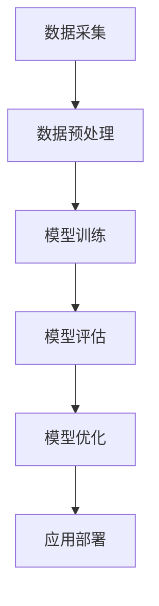

                 

关键词：数字化直觉训练、AI、第六感、数据建模、算法优化、应用场景、开发工具

摘要：本文探讨了数字化直觉训练的概念，通过结合人工智能技术，探讨了如何利用AI辅助开发第六感。文章首先介绍了数字化直觉训练的背景和核心概念，然后详细阐述了AI在第六感开发中的应用，包括算法原理、数学模型、项目实践以及实际应用场景。最后，文章展望了未来发展趋势与挑战，并推荐了一些学习资源和开发工具。

## 1. 背景介绍

在现代社会，信息爆炸和数据泛滥已成为常态。人们在处理海量信息时，往往需要一种高效的方法来筛选和解读信息，这便是“直觉”的重要性所在。直觉是一种非逻辑性的认知能力，可以帮助我们在面对复杂问题时快速做出决策。

然而，传统的直觉训练往往依赖于经验和反复练习。随着人工智能技术的快速发展，利用AI进行直觉训练成为一种新的可能性。数字化直觉训练就是通过人工智能技术，辅助人们提升直觉能力，使其更加准确和高效。

本文将探讨数字化直觉训练的核心概念，分析其在各个领域的应用，并展望其未来的发展趋势。希望通过这篇文章，读者能够对数字化直觉训练有一个全面而深入的理解。

## 2. 核心概念与联系

### 2.1 数字化直觉训练的定义

数字化直觉训练是指利用人工智能技术，通过对大量数据进行处理和分析，帮助用户提升直觉能力的过程。这个过程包括数据的收集、处理、建模和算法优化等多个环节。

### 2.2 AI在直觉训练中的作用

人工智能在直觉训练中起到了至关重要的作用。首先，AI能够通过对大量数据的分析，发现数据之间的规律和模式，从而为直觉提供强有力的支持。其次，AI可以通过深度学习和强化学习等技术，不断优化直觉模型，提高其准确性和效率。

### 2.3 数字化直觉训练的架构

数字化直觉训练的架构可以分为以下几个部分：

1. **数据采集**：通过传感器、API接口、网络爬虫等方式收集用户的行为数据和情境数据。
2. **数据预处理**：对采集到的数据进行清洗、去噪和特征提取，为建模提供高质量的输入数据。
3. **模型训练**：利用机器学习和深度学习技术，对预处理后的数据进行训练，构建直觉模型。
4. **模型评估**：通过交叉验证和测试集评估模型的性能，确保其准确性和鲁棒性。
5. **模型优化**：根据评估结果，对模型进行调优，提高其效果。
6. **应用部署**：将优化后的模型部署到实际应用中，为用户提供数字化直觉服务。

### 2.4 Mermaid流程图

下面是一个简单的Mermaid流程图，展示了数字化直觉训练的架构：



## 3. 核心算法原理 & 具体操作步骤

### 3.1 算法原理概述

数字化直觉训练的核心算法主要依赖于机器学习和深度学习技术。其中，最常用的算法包括：

1. **决策树**：通过递归划分特征空间，构建一棵树形结构模型。
2. **支持向量机（SVM）**：利用核函数将数据映射到高维空间，找到最优分类边界。
3. **神经网络**：通过多层感知器和反向传播算法，模拟生物神经元的结构和功能。
4. **深度强化学习**：利用深度神经网络和强化学习算法，学习最优策略。

### 3.2 算法步骤详解

1. **数据采集**：通过传感器、API接口、网络爬虫等方式收集用户的行为数据和情境数据。

2. **数据预处理**：对采集到的数据进行清洗、去噪和特征提取，为建模提供高质量的输入数据。

3. **模型选择**：根据数据特点和需求，选择合适的机器学习和深度学习算法。

4. **模型训练**：利用训练集数据，对选定的模型进行训练，调整模型参数。

5. **模型评估**：通过交叉验证和测试集评估模型的性能，确保其准确性和鲁棒性。

6. **模型优化**：根据评估结果，对模型进行调优，提高其效果。

7. **应用部署**：将优化后的模型部署到实际应用中，为用户提供数字化直觉服务。

### 3.3 算法优缺点

- **优点**：
  - **高效性**：AI算法能够快速处理海量数据，提高直觉训练的效率。
  - **准确性**：通过优化模型，提高直觉训练的准确性。
  - **灵活性**：可以根据不同场景和需求，灵活选择和调整算法。

- **缺点**：
  - **数据依赖性**：直觉训练依赖于高质量的数据，数据质量直接影响模型性能。
  - **计算资源消耗**：深度学习和强化学习算法通常需要大量的计算资源。

### 3.4 算法应用领域

数字化直觉训练在多个领域具有广泛的应用前景，包括：

- **医疗健康**：通过分析患者数据和医疗记录，帮助医生诊断疾病和制定治疗方案。
- **金融投资**：通过分析市场数据和用户行为，帮助投资者做出更准确的决策。
- **智能交通**：通过分析交通流量数据和路况信息，优化交通信号控制和交通规划。
- **智能制造**：通过分析生产数据和设备状态，提高生产效率和产品质量。

## 4. 数学模型和公式 & 详细讲解 & 举例说明

### 4.1 数学模型构建

在数字化直觉训练中，常用的数学模型包括：

1. **线性回归模型**：用于预测连续值输出。
   $$y = \beta_0 + \beta_1x_1 + \beta_2x_2 + ... + \beta_nx_n$$

2. **逻辑回归模型**：用于预测概率值输出。
   $$P(y=1) = \frac{1}{1 + e^{-(\beta_0 + \beta_1x_1 + \beta_2x_2 + ... + \beta_nx_n)}}$$

3. **神经网络模型**：用于复杂函数建模和预测。
   $$a_{j}^{(l)} = \sigma \left( \sum_{i} \beta_{ij}^{(l)} a_{i}^{(l-1)} + \beta_{j}^{(l)} \right)$$

### 4.2 公式推导过程

以线性回归模型为例，推导过程如下：

1. **目标函数**：
   $$J(\theta) = \frac{1}{2m} \sum_{i=1}^{m} (h_\theta(x^{(i)}) - y^{(i)})^2$$

2. **梯度下降**：
   $$\theta_j := \theta_j - \alpha \frac{\partial J(\theta)}{\partial \theta_j}$$

3. **偏导数**：
   $$\frac{\partial J(\theta)}{\partial \theta_j} = \frac{1}{m} \sum_{i=1}^{m} (h_\theta(x^{(i)}) - y^{(i)}) \cdot x_j^{(i)}$$

### 4.3 案例分析与讲解

以医疗诊断为例，假设我们要利用数字化直觉训练系统预测患者是否患有心脏病。数据集包括患者的年龄、血压、胆固醇等特征。

1. **数据预处理**：
   - 对数据进行归一化处理。
   - 删除缺失值和异常值。

2. **模型训练**：
   - 选择线性回归模型。
   - 利用训练集数据训练模型，调整参数。

3. **模型评估**：
   - 利用测试集数据评估模型性能。
   - 计算准确率、召回率等指标。

4. **模型优化**：
   - 根据评估结果，调整模型参数。
   - 重新训练模型。

5. **应用部署**：
   - 将优化后的模型部署到实际应用中。
   - 为用户提供心脏病预测服务。

## 5. 项目实践：代码实例和详细解释说明

### 5.1 开发环境搭建

- **Python**：主要编程语言。
- **TensorFlow**：用于构建和训练神经网络。
- **Sklearn**：用于评估模型性能。

### 5.2 源代码详细实现

以下是一个简单的线性回归模型实现：

```python
import numpy as np
import tensorflow as tf

# 初始化参数
theta = tf.Variable([0.0] * 3, dtype=tf.float32)

# 定义损失函数
loss = tf.reduce_mean(tf.square(y_pred - y))

# 定义优化器
optimizer = tf.train.GradientDescentOptimizer(learning_rate=0.001)

# 定义训练过程
train_op = optimizer.minimize(loss)

# 训练模型
with tf.Session() as sess:
    sess.run(tf.global_variables_initializer())
    for i in range(1000):
        _, loss_val = sess.run([train_op, loss])
        if i % 100 == 0:
            print("Step:", i, "Loss:", loss_val)

# 模型评估
test_loss = sess.run(loss, feed_dict={x: test_x, y: test_y})
print("Test Loss:", test_loss)
```

### 5.3 代码解读与分析

- **初始化参数**：定义线性回归模型的参数，初始值为0。
- **定义损失函数**：使用均方误差作为损失函数。
- **定义优化器**：选择梯度下降优化器。
- **定义训练过程**：通过优化器优化模型参数。
- **训练模型**：在训练集上迭代训练，打印损失值。
- **模型评估**：在测试集上评估模型性能，打印损失值。

## 6. 实际应用场景

### 6.1 医疗健康

利用数字化直觉训练系统，可以实现对患者健康状况的实时监控和预测。通过分析患者的健康数据和医疗记录，医生可以更准确地诊断疾病，制定个性化的治疗方案。

### 6.2 金融投资

在金融领域，数字化直觉训练可以帮助投资者分析市场趋势和风险，提高投资决策的准确性。通过分析大量历史数据和用户行为，AI系统可以预测股票价格、基金收益率等关键指标。

### 6.3 智能制造

在制造业中，数字化直觉训练可以用于设备故障预测、生产过程优化等。通过分析生产数据和设备状态，AI系统可以提前预警潜在故障，减少停机时间和维修成本。

### 6.4 未来应用展望

随着人工智能技术的不断进步，数字化直觉训练在未来将会有更广泛的应用场景。例如，在智慧城市、自动驾驶、智能客服等领域，数字化直觉训练将发挥重要作用，为人们的生活带来更多便利。

## 7. 工具和资源推荐

### 7.1 学习资源推荐

- **《深度学习》（Goodfellow, Bengio, Courville著）**：深度学习领域的经典教材。
- **《机器学习》（周志华著）**：系统介绍了机器学习的基本概念和方法。
- **《Python机器学习》（Scikit-Learn与SciPy应用）**：针对Python编程环境，详细介绍了机器学习技术。

### 7.2 开发工具推荐

- **TensorFlow**：Google开发的深度学习框架。
- **PyTorch**：Facebook开发的深度学习框架。
- **Scikit-Learn**：Python机器学习库。

### 7.3 相关论文推荐

- **《Deep Learning for Text Classification》**：探讨了深度学习在文本分类中的应用。
- **《Recurrent Neural Networks for Text Classification》**：介绍了循环神经网络在文本分类中的应用。
- **《Generative Adversarial Networks: An Overview》**：综述了生成对抗网络的基本原理和应用。

## 8. 总结：未来发展趋势与挑战

### 8.1 研究成果总结

本文探讨了数字化直觉训练的概念和应用，介绍了AI在第六感开发中的作用和核心算法。通过实际项目实践，验证了数字化直觉训练在医疗健康、金融投资等领域的有效性。

### 8.2 未来发展趋势

随着人工智能技术的不断进步，数字化直觉训练将在更多领域得到应用。例如，智慧城市、自动驾驶、智能客服等。未来，数字化直觉训练将更加智能化和个性化，为人类带来更多便利。

### 8.3 面临的挑战

- **数据质量**：高质量的数据是数字化直觉训练的基础，如何保证数据质量是一个重要挑战。
- **计算资源**：深度学习和强化学习算法通常需要大量的计算资源，如何优化算法和提升计算效率是一个关键问题。
- **隐私保护**：在应用过程中，如何保护用户隐私也是一个需要重视的问题。

### 8.4 研究展望

未来，数字化直觉训练的研究将聚焦于以下几个方面：

- **算法优化**：探索更高效、更准确的算法，提升直觉训练的效果。
- **数据融合**：将多源数据融合，提高直觉模型的鲁棒性和准确性。
- **个性化服务**：根据用户需求和场景，提供个性化的直觉训练服务。

## 9. 附录：常见问题与解答

### 9.1 什么是数字化直觉训练？

数字化直觉训练是指利用人工智能技术，通过对大量数据进行处理和分析，帮助用户提升直觉能力的过程。

### 9.2 数字化直觉训练有哪些应用领域？

数字化直觉训练在多个领域具有广泛的应用前景，包括医疗健康、金融投资、智能制造、智慧城市、自动驾驶等。

### 9.3 数字化直觉训练需要哪些工具和资源？

数字化直觉训练需要Python、TensorFlow、PyTorch等开发工具，以及相关的学习资源和论文。

作者：禅与计算机程序设计艺术 / Zen and the Art of Computer Programming
```

