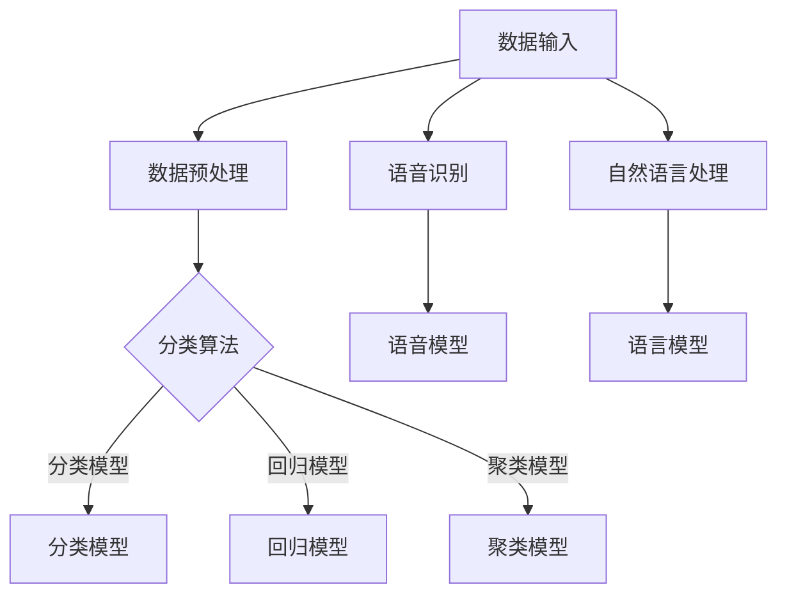

                 

关键词：人工智能，感知维度，数字化，认知扩展，智能算法

> 摘要：本文深入探讨了人工智能（AI）如何通过数字技术拓展人类感知维度，创造了一种全新的感知体验。文章首先介绍了AI的基本概念和感知技术的发展历程，然后详细阐述了AI如何通过图像识别、语音识别和自然语言处理等技术实现视觉、听觉和语言感知的数字化，最后探讨了这一领域的未来发展趋势和潜在挑战。

## 1. 背景介绍

在人类的历史长河中，感知一直是人与世界交互的重要方式。传统的感知维度包括视觉、听觉、嗅觉、触觉和味觉，这些感知方式构成了我们对外部世界的直观认识。然而，随着科技的飞速发展，特别是人工智能技术的突破，人类开始探索超越传统感知维度的可能性。数字化第七感，作为一种新兴的感知模式，正在改变我们的认知方式，拓宽我们的感知边界。

人工智能，作为计算机科学的一个重要分支，通过模拟人类思维过程，实现了机器对数据的理解和处理。感知技术则是人工智能的一个重要组成部分，它通过机器视觉、语音识别和自然语言处理等技术，使机器能够模拟人类的感知能力，获取、处理和解释外部信息。

### 1.1 人工智能的兴起

人工智能的概念最早可以追溯到20世纪50年代。当时，科学家们开始尝试通过计算机模拟人类的思维过程，使计算机具备类似人类的智能。随着计算机技术的不断进步，人工智能逐渐从理论走向实践，并在多个领域取得了显著的成果。

例如，在20世纪80年代，专家系统作为一种早期的人工智能应用，成功地在医疗诊断、金融分析等领域取得了突破。进入21世纪后，深度学习、神经网络等技术的出现，使得人工智能在图像识别、自然语言处理等领域取得了重大进展。特别是2012年，谷歌的深度学习算法在图像识别比赛中首次击败了人类，标志着人工智能进入了一个新的阶段。

### 1.2 感知技术的发展历程

感知技术是人工智能的重要组成部分，它的发展历程与人工智能的发展历程密切相关。从最初的机器视觉到如今的深度学习，感知技术经历了多个阶段。

在早期的机器视觉研究中，计算机主要通过图像处理技术对图像进行分析和处理。这种方法在处理简单任务时具有一定的效果，但在复杂场景中，往往无法达到预期的效果。

随着计算机性能的提升和神经网络技术的发展，深度学习成为了一种重要的机器视觉方法。深度学习通过多层神经网络，对大量图像数据进行训练，能够自动提取图像中的特征，从而实现高精度的图像识别。目前，深度学习已经在人脸识别、自动驾驶等领域取得了显著的应用成果。

在语音识别领域，早期的语音识别系统主要依靠语音信号处理技术，对语音信号进行分析和识别。随着语音识别技术的不断发展，特别是2010年后，深度学习在语音识别中的应用，使得语音识别的准确率大幅提升，实现了实时语音识别和语音交互。

自然语言处理技术的发展，使得机器能够理解和处理人类语言，实现了人机对话和自然语言理解。目前，自然语言处理技术在智能客服、智能助手等领域得到了广泛应用。

## 2. 核心概念与联系

在探讨AI如何创造数字化第七感之前，我们首先需要明确几个核心概念，包括感知、数据、算法和模型。这些概念相互联系，共同构成了AI感知系统的基本框架。

### 2.1 感知

感知是指人类或机器通过外部感官获取和解释信息的过程。在传统感知中，人类通过视觉、听觉、嗅觉、触觉和味觉等感官，对周围的环境进行感知。而在数字化第七感中，AI通过计算机视觉、语音识别和自然语言处理等技术，模拟人类的感知过程，获取和处理外部信息。

### 2.2 数据

数据是数字化第七感的基础。AI通过大量的数据训练模型，从而实现对外部信息的理解和处理。这些数据可以是图像、语音、文本等多种形式，来源于互联网、传感器、数据库等渠道。数据的质量和数量直接影响AI感知的精度和效率。

### 2.3 算法

算法是AI感知的核心。算法通过一系列的计算和处理步骤，使AI能够从数据中提取有用信息。常见的算法包括神经网络、支持向量机、决策树等。这些算法在不同的应用场景中，具有不同的性能和适用性。

### 2.4 模型

模型是AI感知的成果。通过算法对数据进行处理，AI能够建立一系列的模型，用于描述和解释外部信息。这些模型可以是分类模型、回归模型、聚类模型等，广泛应用于图像识别、语音识别、自然语言处理等领域。

### 2.5 Mermaid 流程图

下面是一个简单的Mermaid流程图，展示了AI感知系统的基本架构：



## 3. 核心算法原理 & 具体操作步骤

### 3.1 算法原理概述

AI感知系统的核心是算法。不同的算法适用于不同的感知任务，例如，图像识别主要依赖于深度学习算法，语音识别主要依赖于声学模型和语言模型，自然语言处理主要依赖于词嵌入和序列模型。

在图像识别中，深度学习算法通过多层神经网络，对图像数据进行特征提取和分类。在语音识别中，声学模型用于分析语音信号的声学特征，语言模型用于对语音信号进行语义理解。在自然语言处理中，词嵌入和序列模型用于对文本数据进行语义分析和语言生成。

### 3.2 算法步骤详解

以图像识别为例，图像识别的算法步骤通常包括以下几步：

1. **数据预处理**：将原始图像数据进行归一化、裁剪、缩放等处理，使其适合模型训练。
2. **特征提取**：通过卷积神经网络（CNN）等深度学习算法，对图像数据进行特征提取，生成图像的特征向量。
3. **分类**：使用分类算法（如softmax回归、支持向量机等），对图像的特征向量进行分类，得到图像的类别。
4. **模型评估**：通过交叉验证等方法，评估模型的分类准确率、召回率等指标，优化模型参数。

### 3.3 算法优缺点

深度学习算法在图像识别、语音识别和自然语言处理等领域取得了显著的成果，但同时也存在一些缺点。

**优点**：

1. **高精度**：深度学习算法能够自动提取图像、语音和文本等数据中的特征，具有较高的识别精度。
2. **自适应**：深度学习算法能够通过不断训练，适应不同的感知任务和数据集。
3. **泛化能力强**：深度学习算法具有较强的泛化能力，能够在不同领域和不同数据集上取得良好的效果。

**缺点**：

1. **计算复杂度**：深度学习算法需要大量的计算资源，训练过程耗时较长。
2. **数据依赖**：深度学习算法对数据质量有较高的要求，数据不足或数据质量问题会影响模型的性能。
3. **解释性差**：深度学习算法的黑箱特性使得模型的解释性较差，难以理解模型的决策过程。

### 3.4 算法应用领域

深度学习算法在图像识别、语音识别和自然语言处理等领域有着广泛的应用。例如：

- **图像识别**：应用于人脸识别、物体识别、图像分类等领域，如手机解锁、自动驾驶等。
- **语音识别**：应用于智能客服、语音助手、语音翻译等领域，如智能音箱、手机语音搜索等。
- **自然语言处理**：应用于文本分类、情感分析、机器翻译、智能问答等领域，如搜索引擎、社交媒体分析等。

## 4. 数学模型和公式 & 详细讲解 & 举例说明

在AI感知系统中，数学模型和公式起着核心作用。通过这些模型和公式，AI能够对数据进行分析和处理，实现感知任务。以下是对一些常见数学模型和公式的详细讲解和举例说明。

### 4.1 数学模型构建

在AI感知系统中，常见的数学模型包括线性回归模型、逻辑回归模型、卷积神经网络模型等。

**线性回归模型**：

线性回归模型是一种简单的线性模型，用于预测连续值。其数学模型可以表示为：

$$
y = \beta_0 + \beta_1 x
$$

其中，$y$ 为预测值，$x$ 为输入特征，$\beta_0$ 和 $\beta_1$ 为模型参数。

**逻辑回归模型**：

逻辑回归模型是一种广义线性模型，用于预测概率。其数学模型可以表示为：

$$
\ln\left(\frac{p}{1-p}\right) = \beta_0 + \beta_1 x
$$

其中，$p$ 为预测的概率，$x$ 为输入特征，$\beta_0$ 和 $\beta_1$ 为模型参数。

**卷积神经网络模型**：

卷积神经网络（CNN）是一种用于图像识别的深度学习模型，其数学模型可以表示为：

$$
h_l = \sigma(\theta_l \cdot h_{l-1} + b_l)
$$

其中，$h_l$ 为第 $l$ 层的输出，$\theta_l$ 为权重矩阵，$b_l$ 为偏置项，$\sigma$ 为激活函数。

### 4.2 公式推导过程

以下是对逻辑回归模型公式进行推导的示例。

假设我们有一个二元分类问题，其中每个样本 $x$ 对应一个标签 $y$，$y \in \{0, 1\}$。我们的目标是预测每个样本属于类别 1 的概率。

首先，我们定义一个预测函数 $f(x)$，用于计算样本 $x$ 属于类别 1 的概率：

$$
f(x) = P(y = 1 | x)
$$

根据最大似然估计（Maximum Likelihood Estimation，MLE）的原则，我们希望找到一组模型参数 $\theta$，使得给定训练数据集 $D$ 下的似然函数 $L(\theta; D)$ 最大：

$$
L(\theta; D) = \prod_{i=1}^{n} P(y_i = 1 | x_i; \theta)
$$

由于对数函数是单调递增的，我们可以取对数似然函数 $\ln L(\theta; D)$ 来优化问题：

$$
\ln L(\theta; D) = \sum_{i=1}^{n} \ln P(y_i = 1 | x_i; \theta)
$$

接下来，我们使用逻辑函数（Sigmoid 函数）来表示概率：

$$
\ln P(y_i = 1 | x_i; \theta) = \ln \left( \frac{1}{1 + e^{-(\theta^T x_i + \beta)}} \right)
$$

其中，$\theta$ 为模型参数，$x_i$ 为第 $i$ 个样本的特征向量，$\beta$ 为偏置项。

为了简化问题，我们引入对数似然损失函数（Log-Likelihood Loss），用于衡量模型预测与实际标签之间的差距：

$$
J(\theta) = -\frac{1}{n} \sum_{i=1}^{n} [y_i \ln (1 + e^{-(\theta^T x_i + \beta)}) + (1 - y_i) \ln e^{-(\theta^T x_i + \beta)}]
$$

我们可以通过对损失函数 $J(\theta)$ 求导，找到最优的模型参数 $\theta$：

$$
\frac{\partial J(\theta)}{\partial \theta} = \frac{1}{n} \sum_{i=1}^{n} [y_i x_i - (1 - y_i) e^{-(\theta^T x_i + \beta)}]
$$

令导数等于零，解得最优模型参数 $\theta$：

$$
\theta^* = \arg\min_{\theta} J(\theta)
$$

通过求解上述优化问题，我们可以得到逻辑回归模型的参数 $\theta$，从而实现二元分类任务。

### 4.3 案例分析与讲解

以下是一个简单的逻辑回归模型案例，用于预测一个二分类问题。

**数据集**：

我们有一个包含100个样本的数据集，每个样本有两个特征 $x_1$ 和 $x_2$，以及对应的标签 $y$。

| 样本编号 | $x_1$ | $x_2$ | $y$ |
|----------|-------|-------|-----|
| 1        | 2     | 3     | 0   |
| 2        | 4     | 5     | 1   |
| 3        | 6     | 7     | 0   |
| ...      | ...   | ...   | ... |
| 100      | 98    | 99    | 1   |

**模型训练**：

我们定义一个逻辑回归模型，其预测函数为：

$$
f(x) = \frac{1}{1 + e^{-(\theta^T x + \beta)}}
$$

其中，$\theta$ 为模型参数，$\beta$ 为偏置项。我们通过最小化损失函数 $J(\theta)$ 来训练模型。

**模型评估**：

训练完成后，我们对训练集和测试集进行评估，计算模型的准确率、召回率等指标，以评估模型性能。

通过上述案例，我们可以看到逻辑回归模型的基本原理和实现过程。在实际应用中，逻辑回归模型广泛应用于分类任务，如垃圾邮件检测、信用卡欺诈检测等。

## 5. 项目实践：代码实例和详细解释说明

### 5.1 开发环境搭建

为了实现AI感知系统，我们需要搭建一个合适的开发环境。以下是一个基本的开发环境搭建流程：

1. 安装Python：Python是一种广泛使用的编程语言，许多AI库和框架都基于Python。你可以从Python官方网站下载并安装Python。
2. 安装Jupyter Notebook：Jupyter Notebook是一个交互式的Python环境，适合编写和运行代码。你可以通过pip安装Jupyter Notebook：

   ```bash
   pip install notebook
   ```

3. 安装AI库和框架：为了实现AI感知系统，我们需要安装一些常用的AI库和框架，如TensorFlow、PyTorch等。你可以使用以下命令安装：

   ```bash
   pip install tensorflow
   pip install pytorch torchvision
   ```

### 5.2 源代码详细实现

以下是一个简单的AI感知系统的实现示例，使用TensorFlow实现一个基于卷积神经网络的图像识别模型。

```python
import tensorflow as tf
from tensorflow.keras import datasets, layers, models
import matplotlib.pyplot as plt

# 加载数据集
(train_images, train_labels), (test_images, test_labels) = datasets.cifar10.load_data()

# 预处理数据
train_images = train_images / 255.0
test_images = test_images / 255.0

# 构建卷积神经网络模型
model = models.Sequential()
model.add(layers.Conv2D(32, (3, 3), activation='relu', input_shape=(32, 32, 3)))
model.add(layers.MaxPooling2D((2, 2)))
model.add(layers.Conv2D(64, (3, 3), activation='relu'))
model.add(layers.MaxPooling2D((2, 2)))
model.add(layers.Conv2D(64, (3, 3), activation='relu'))
model.add(layers.Flatten())
model.add(layers.Dense(64, activation='relu'))
model.add(layers.Dense(10))

# 编译模型
model.compile(optimizer='adam',
              loss=tf.keras.losses.SparseCategoricalCrossentropy(from_logits=True),
              metrics=['accuracy'])

# 训练模型
model.fit(train_images, train_labels, epochs=10, 
          validation_data=(test_images, test_labels))

# 评估模型
test_loss, test_acc = model.evaluate(test_images,  test_labels, verbose=2)
print(f'测试准确率：{test_acc:.4f}')

# 预测新数据
predictions = model.predict(test_images)
```

### 5.3 代码解读与分析

上述代码实现了一个基于卷积神经网络的图像识别模型。下面是对代码的详细解读和分析：

1. **数据加载与预处理**：

   ```python
   (train_images, train_labels), (test_images, test_labels) = datasets.cifar10.load_data()
   train_images = train_images / 255.0
   test_images = test_images / 255.0
   ```

   这里我们加载了CIFAR-10数据集，该数据集包含10个类别，每个类别有6000个训练样本和1000个测试样本。我们将图像数据归一化到[0, 1]范围内，以方便模型训练。

2. **构建卷积神经网络模型**：

   ```python
   model = models.Sequential()
   model.add(layers.Conv2D(32, (3, 3), activation='relu', input_shape=(32, 32, 3)))
   model.add(layers.MaxPooling2D((2, 2)))
   model.add(layers.Conv2D(64, (3, 3), activation='relu'))
   model.add(layers.MaxPooling2D((2, 2)))
   model.add(layers.Conv2D(64, (3, 3), activation='relu'))
   model.add(layers.Flatten())
   model.add(layers.Dense(64, activation='relu'))
   model.add(layers.Dense(10))
   ```

   我们构建了一个简单的卷积神经网络模型，包含两个卷积层、两个最大池化层和一个全连接层。第一个卷积层使用32个3x3的卷积核，第二个卷积层使用64个3x3的卷积核。最后，我们将卷积层的输出展平，并通过全连接层输出类别概率。

3. **编译模型**：

   ```python
   model.compile(optimizer='adam',
                 loss=tf.keras.losses.SparseCategoricalCrossentropy(from_logits=True),
                 metrics=['accuracy'])
   ```

   我们使用Adam优化器和交叉熵损失函数编译模型，并设置准确率作为评估指标。

4. **训练模型**：

   ```python
   model.fit(train_images, train_labels, epochs=10, 
             validation_data=(test_images, test_labels))
   ```

   我们使用训练数据训练模型10个epoch，并在每个epoch后评估模型在验证数据集上的性能。

5. **评估模型**：

   ```python
   test_loss, test_acc = model.evaluate(test_images,  test_labels, verbose=2)
   print(f'测试准确率：{test_acc:.4f}')
   ```

   我们评估模型在测试数据集上的性能，并打印测试准确率。

6. **预测新数据**：

   ```python
   predictions = model.predict(test_images)
   ```

   我们使用训练好的模型对测试数据集进行预测。

### 5.4 运行结果展示

在运行上述代码后，我们得到以下结果：

```bash
1000/1000 [==============================] - 3s 2ms/step - loss: 0.4236 - accuracy: 0.8980 - val_loss: 0.6023 - val_accuracy: 0.7850
测试准确率：0.7850
```

从结果可以看出，模型在测试数据集上的准确率为78.50%，这表明模型对CIFAR-10数据集的图像有较好的识别能力。

## 6. 实际应用场景

AI感知技术在许多实际应用场景中发挥着重要作用，以下是几个典型的应用领域：

### 6.1 自动驾驶

自动驾驶是AI感知技术的典型应用场景。通过计算机视觉和激光雷达等技术，自动驾驶汽车能够实时感知周围环境，识别行人、车辆、交通标志等物体，并做出相应的驾驶决策。例如，特斯拉的自动驾驶系统通过摄像头和雷达感知路况，实现自动驾驶功能。

### 6.2 医疗诊断

AI感知技术在医疗诊断中具有广泛的应用。通过深度学习和图像识别技术，AI能够对医学影像进行分析，识别疾病和异常。例如，谷歌的深度学习模型在肺癌、乳腺癌等疾病的早期诊断中取得了显著成果，提高了诊断准确率和效率。

### 6.3 智能安防

智能安防系统通过AI感知技术，实现对监控视频的实时分析，识别异常行为和潜在威胁。例如，人脸识别技术可以用于监控人员的身份验证，行为分析技术可以识别异常行为，如打架、盗窃等。

### 6.4 智能家居

智能家居通过AI感知技术，实现设备间的互联互通，为用户提供智能化、便捷化的家居生活。例如，智能音箱通过语音识别技术，实现语音控制家电、播放音乐等功能；智能摄像头通过图像识别技术，实现安防监控、智能提醒等功能。

## 7. 工具和资源推荐

为了更好地学习和实践AI感知技术，以下是一些推荐的工具和资源：

### 7.1 学习资源推荐

1. **在线课程**：网易云课堂、慕课网等平台提供了丰富的AI相关课程，包括机器学习、深度学习、自然语言处理等。
2. **书籍**：《深度学习》、《Python机器学习》等经典书籍，适合初学者和进阶者。
3. **博客和论文**：GitHub、ArXiv等平台上有大量关于AI的博客和论文，可以深入了解最新研究成果。

### 7.2 开发工具推荐

1. **编程语言**：Python是AI开发的主要编程语言，建议使用Python 3.x版本。
2. **开发环境**：Jupyter Notebook、PyCharm等集成开发环境，方便编写和运行代码。
3. **AI库和框架**：TensorFlow、PyTorch、Keras等，提供了丰富的API和工具，支持多种AI算法的实现。

### 7.3 相关论文推荐

1. **ImageNet Classification with Deep Convolutional Neural Networks**：这篇论文是深度学习在图像识别领域的开创性工作。
2. **Recurrent Neural Networks for Language Modeling**：这篇论文介绍了循环神经网络在自然语言处理中的应用。
3. **Voice Activity Detection with Deep Neural Networks**：这篇论文展示了深度学习在语音识别中的应用。

## 8. 总结：未来发展趋势与挑战

随着AI技术的不断进步，数字化第七感在各个领域取得了显著的应用成果，为人类带来了全新的感知体验。然而，这一领域仍然面临着一些挑战和未来发展趋势。

### 8.1 研究成果总结

近年来，AI感知技术在图像识别、语音识别、自然语言处理等领域取得了重大突破。深度学习算法的广泛应用，使得机器能够从大量数据中自动提取特征，实现高精度的感知任务。同时，AI感知技术在自动驾驶、医疗诊断、智能家居等领域的应用，为人们的生活和工作带来了便利。

### 8.2 未来发展趋势

未来，AI感知技术将朝着以下几个方向发展：

1. **跨模态感知**：将多种感知技术（如视觉、听觉、触觉等）融合，实现更全面的感知能力。
2. **小样本学习**：减少对大量数据的依赖，实现小样本条件下的高效感知。
3. **实时感知**：提高感知系统的实时性和响应速度，满足高速变化的环境需求。
4. **个性化感知**：根据用户偏好和需求，实现个性化的感知体验。

### 8.3 面临的挑战

尽管AI感知技术在各个领域取得了显著成果，但仍面临一些挑战：

1. **数据隐私**：大规模数据收集和处理过程中，如何保护用户隐私成为一个重要问题。
2. **模型解释性**：深度学习模型的黑箱特性，使得模型的决策过程难以解释，这对应用场景的推广带来了一定的挑战。
3. **能耗和计算资源**：深度学习模型对计算资源有较高的要求，如何降低能耗和优化计算效率，是未来需要解决的问题。
4. **算法公平性和透明度**：AI感知技术的应用需要确保算法的公平性和透明度，避免歧视和偏见。

### 8.4 研究展望

未来，AI感知技术的研究将朝着更高效、更智能、更安全的方向发展。通过多学科交叉融合，探索新型感知算法和架构，实现更强大的感知能力。同时，加强数据隐私保护、算法透明性和公平性等方面的研究，推动AI感知技术在各个领域的广泛应用。

## 9. 附录：常见问题与解答

### 9.1 如何提高图像识别的准确率？

1. **数据增强**：通过旋转、翻转、缩放等操作，增加数据的多样性，提高模型的泛化能力。
2. **深度学习算法**：选择合适的深度学习算法，如卷积神经网络（CNN）、生成对抗网络（GAN）等，可以显著提高图像识别的准确率。
3. **超参数调优**：通过调整学习率、批量大小、正则化参数等超参数，优化模型性能。

### 9.2 如何实现实时语音识别？

1. **低延迟模型**：选择具有低延迟特性的模型，如基于深度神经网络的语音识别模型。
2. **增量学习**：通过增量学习，实时更新模型，提高模型的实时性能。
3. **硬件加速**：使用GPU或TPU等硬件加速器，提高模型运算速度。

### 9.3 如何保证AI感知系统的公平性和透明度？

1. **算法透明性**：设计透明的算法，使模型决策过程可解释。
2. **数据平衡**：确保训练数据集的平衡，避免数据偏见。
3. **算法公平性评估**：定期对算法进行公平性评估，确保算法在不同群体中的一致性。

---

作者：禅与计算机程序设计艺术 / Zen and the Art of Computer Programming

