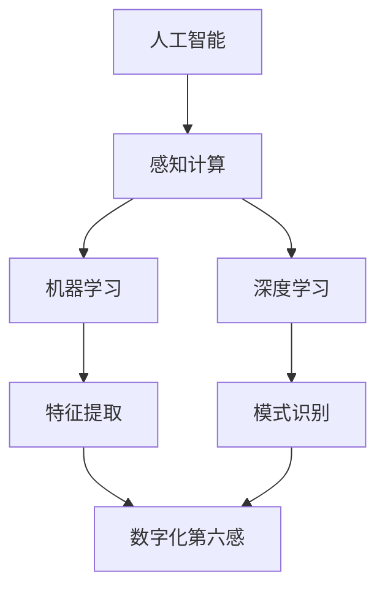

                 

关键词：数字化第六感、AI辅助、超感知能力、智能算法、数学模型、项目实践、未来展望

摘要：本文深入探讨了数字化第六感的概念及其在人工智能领域的应用。通过介绍核心概念和原理，详细讲解了AI辅助超感知能力培养的方法和具体操作步骤，以及数学模型和公式。随后，通过项目实践和代码实例，展示了数字化第六感技术的实现过程和效果。最后，对数字化第六感技术的未来应用场景、发展趋势和面临的挑战进行了展望。

## 1. 背景介绍

在信息技术飞速发展的今天，人工智能（AI）已经成为了推动社会进步的重要力量。然而，随着AI技术的不断进步，人们开始关注一个更加深层次的问题：能否通过AI技术培养和提升人类的超感知能力？数字化第六感开发包正是为了解决这一挑战而诞生的。

数字化第六感，顾名思义，是指通过人工智能技术，赋予计算机系统和设备类似于人类的感知能力。这种感知能力不仅包括传统的视觉、听觉、触觉等感官，还包括对环境、情感、语言等方面的感知。数字化第六感的实现，为人类带来了全新的认知体验和交互方式。

本文旨在介绍数字化第六感的概念、原理和应用，探讨通过AI技术培养和提升人类超感知能力的方法，并提供一个具体的开发包来实现这一目标。希望通过本文的探讨，能够为相关领域的研究和应用提供一些启示和参考。

## 2. 核心概念与联系

### 2.1 核心概念

数字化第六感涉及多个核心概念，包括人工智能、感知计算、机器学习、深度学习等。以下是这些核心概念的简要介绍：

- **人工智能（AI）**：人工智能是一门研究、开发和应用使计算机模拟人类智能行为的科学。它包括多个分支，如机器学习、自然语言处理、计算机视觉等。

- **感知计算**：感知计算是指通过传感器、执行器等设备，使计算机能够感知和响应外界环境信息的技术。它是数字化第六感的重要组成部分。

- **机器学习**：机器学习是一种通过数据驱动的方式，使计算机自动学习和改进自身性能的方法。它是实现数字化第六感的重要技术之一。

- **深度学习**：深度学习是一种基于多层神经网络的人工智能方法，通过多层次的非线性变换，实现对数据的特征提取和模式识别。它在数字化第六感中的应用尤为广泛。

### 2.2 概念联系

数字化第六感的核心概念之间存在着紧密的联系。具体来说：

- **人工智能与感知计算**：人工智能为感知计算提供了理论基础和算法支持，使计算机能够处理和理解感知信息。感知计算则为人工智能提供了丰富的感知数据，促进了人工智能技术的发展。

- **机器学习与深度学习**：机器学习和深度学习是人工智能的两个重要分支，它们为数字化第六感的实现提供了强大的计算能力。通过机器学习，计算机可以从海量数据中自动学习和提取特征，从而实现感知和决策。深度学习则通过多层神经网络，进一步提升了计算机的感知和识别能力。

### 2.3 Mermaid 流程图

为了更直观地展示数字化第六感的相关概念和联系，我们可以使用Mermaid流程图来描述。以下是一个简化的Mermaid流程图示例：



在这个流程图中，人工智能、感知计算、机器学习和深度学习构成了数字化第六感的技术基础。特征提取和模式识别是数字化第六感的核心功能，它们共同实现了对环境信息的感知和解读。

## 3. 核心算法原理 & 具体操作步骤

### 3.1 算法原理概述

数字化第六感开发包的核心算法基于机器学习和深度学习技术，主要包括以下两个阶段：

1. **特征提取**：通过机器学习算法，从感知数据中提取出有意义的特征，如纹理、颜色、声音、情感等。

2. **模式识别**：利用深度学习算法，对提取出的特征进行分类和识别，实现对环境信息的理解和解读。

### 3.2 算法步骤详解

#### 3.2.1 特征提取

特征提取是数字化第六感开发包的第一步，其主要任务是从感知数据中提取出有意义的特征。具体步骤如下：

1. **数据预处理**：对感知数据进行清洗、归一化等预处理操作，以提高后续处理的效率和准确性。

2. **特征选择**：通过统计分析、相关性分析等方法，从原始数据中筛选出对目标任务有较强预测能力的特征。

3. **特征提取算法**：利用机器学习算法，如支持向量机（SVM）、决策树、随机森林等，对筛选出的特征进行提取和融合。

#### 3.2.2 模式识别

模式识别是数字化第六感开发包的第二步，其主要任务是对提取出的特征进行分类和识别。具体步骤如下：

1. **数据集划分**：将处理后的数据集划分为训练集、验证集和测试集，用于训练、验证和评估模型性能。

2. **模型训练**：利用深度学习算法，如卷积神经网络（CNN）、循环神经网络（RNN）等，对训练集进行训练，以构建一个能够对特征进行分类和识别的模型。

3. **模型评估**：利用验证集和测试集，对训练好的模型进行评估，以确定其分类和识别性能。

4. **模型优化**：根据评估结果，对模型进行优化和调整，以提高其分类和识别性能。

### 3.3 算法优缺点

#### 优点：

1. **高精度**：通过深度学习和机器学习技术，数字化第六感开发包能够实现对环境信息的精细识别和分类，具有较高的精度。

2. **自适应**：数字化第六感开发包可以根据实际需求和环境变化，自动调整和优化模型参数，实现自适应感知。

3. **多功能**：数字化第六感开发包不仅支持视觉、听觉等传统感知功能，还可以扩展到情感、语言等多维感知，实现更加全面的人机交互。

#### 缺点：

1. **计算资源消耗大**：深度学习和机器学习算法通常需要大量的计算资源和时间，特别是在处理大规模数据时，计算效率较低。

2. **数据依赖性强**：数字化第六感开发包的性能在很大程度上依赖于感知数据的质量和数量，因此在实际应用中，需要大量高质量的感知数据。

### 3.4 算法应用领域

数字化第六感开发包在多个领域具有广泛的应用前景，主要包括：

1. **智能安防**：利用数字化第六感，可以实现对入侵者、火灾、气体泄漏等安全事件的实时监控和预警。

2. **智能交通**：通过数字化第六感，可以实现对交通流量、路况、车辆状态等信息的实时监测和优化，提高交通管理效率。

3. **智能医疗**：利用数字化第六感，可以实现对患者的生理信号、情绪状态等信息的实时监测和分析，提高医疗服务的质量和效率。

4. **智能家居**：通过数字化第六感，可以实现对家居环境的智能监控和调节，提高生活舒适度和安全性。

5. **智能客服**：利用数字化第六感，可以实现对用户需求、情感状态等信息的实时识别和分析，提供更加个性化、高效的服务。

## 4. 数学模型和公式 & 详细讲解 & 举例说明

### 4.1 数学模型构建

数字化第六感开发包的核心算法涉及多个数学模型，包括特征提取模型、分类模型等。以下是这些模型的简要介绍：

#### 4.1.1 特征提取模型

特征提取模型用于从感知数据中提取出有意义的特征。常见的特征提取模型包括：

1. **主成分分析（PCA）**：PCA是一种降维技术，通过将数据投影到新的坐标系中，保留主要信息，去除冗余信息。

2. **线性判别分析（LDA）**：LDA是一种分类技术，通过将数据投影到新的坐标系中，使得不同类别之间的距离最大化。

3. **独立成分分析（ICA）**：ICA是一种无监督学习方法，通过分离数据中的独立成分，提取出有意义的信息。

#### 4.1.2 分类模型

分类模型用于对提取出的特征进行分类和识别。常见的分类模型包括：

1. **支持向量机（SVM）**：SVM是一种监督学习方法，通过寻找最佳超平面，将不同类别的数据点分开。

2. **决策树**：决策树是一种树形结构，通过一系列条件判断，将数据点划分为不同的类别。

3. **随机森林**：随机森林是一种集成学习方法，通过构建多棵决策树，提高分类和识别性能。

### 4.2 公式推导过程

以下是数字化第六感开发包中一些常见数学公式的推导过程：

#### 4.2.1 主成分分析（PCA）

PCA的主要目的是将数据从高维空间映射到低维空间，同时保留主要信息。其核心公式如下：

$$
\text{特征向量} = \frac{X^T X}{X^T X} X^T Y
$$

其中，$X$表示数据矩阵，$Y$表示目标变量，$X^T$表示$X$的转置。

推导过程：

1. 构建协方差矩阵$C$：

$$
C = \frac{1}{n} X^T X
$$

2. 求协方差矩阵的特征值和特征向量：

$$
Cv = \lambda v
$$

3. 对特征向量进行归一化，使其为单位向量：

$$
u = \frac{v}{\|v\|}
$$

4. 将数据投影到新坐标系中：

$$
Y = X u
$$

#### 4.2.2 支持向量机（SVM）

SVM的核心思想是找到最佳超平面，将不同类别的数据点分开。其核心公式如下：

$$
\text{决策函数} = \text{sign}(\omega^T x + b)
$$

其中，$x$表示数据点，$\omega$表示超平面的法向量，$b$表示偏置。

推导过程：

1. 定义损失函数：

$$
L = \frac{1}{2} \sum_{i=1}^n (\omega^T x_i + b - y_i)^2
$$

2. 对损失函数求导，并令其等于0，得到最优解：

$$
\omega^T x_i + b - y_i = 0
$$

3. 将约束条件代入，得到拉格朗日乘子法：

$$
L = \frac{1}{2} \sum_{i=1}^n (\omega^T x_i + b - y_i)^2 - \sum_{i=1}^n \alpha_i (y_i ( \omega^T x_i + b ) - 1)
$$

4. 对$\omega$和$b$求导，并令其等于0，得到：

$$
\omega = \sum_{i=1}^n \alpha_i y_i x_i
$$

$$
\sum_{i=1}^n \alpha_i y_i = 0
$$

5. 将$\omega$代入决策函数，得到：

$$
\text{决策函数} = \text{sign}(\omega^T x + b)
$$

### 4.3 案例分析与讲解

为了更好地理解数字化第六感开发包的数学模型和公式，我们可以通过一个实际案例进行讲解。以下是一个基于图像识别任务的案例：

#### 案例背景

假设我们有一个图像识别任务，需要从一组图片中识别出猫和狗。我们使用卷积神经网络（CNN）作为分类模型，并使用主成分分析（PCA）进行特征提取。

#### 案例步骤

1. **数据预处理**：对输入的图像数据进行归一化、缩放等预处理操作，使其符合模型的要求。

2. **特征提取**：使用PCA对预处理后的图像数据进行特征提取，提取出主要特征。

3. **模型训练**：使用CNN模型对提取出的特征进行训练，以识别出猫和狗。

4. **模型评估**：使用验证集和测试集对训练好的模型进行评估，以确定其分类性能。

5. **模型优化**：根据评估结果，对模型进行优化和调整，以提高其分类性能。

#### 案例公式

以下是在这个案例中涉及的一些数学公式：

1. **PCA特征提取**：

$$
\text{特征向量} = \frac{X^T X}{X^T X} X^T Y
$$

2. **CNN模型训练**：

$$
\text{损失函数} = \frac{1}{n} \sum_{i=1}^n (-y_i \log(\hat{y}_i) - (1 - y_i) \log(1 - \hat{y}_i))
$$

3. **模型评估**：

$$
\text{准确率} = \frac{\text{正确识别的数量}}{\text{总测试数量}}
$$

#### 案例解析

在这个案例中，我们使用PCA对图像数据进行特征提取，从而降低数据的维度，提高模型的训练效率。随后，我们使用CNN模型对提取出的特征进行训练，以识别出猫和狗。通过模型评估，我们可以确定模型的分类性能，并根据评估结果对模型进行优化和调整。

## 5. 项目实践：代码实例和详细解释说明

### 5.1 开发环境搭建

在进行数字化第六感开发包的项目实践之前，我们需要搭建一个合适的开发环境。以下是一个基于Python和TensorFlow的示例开发环境搭建步骤：

1. **安装Python**：确保安装了Python 3.7或更高版本。

2. **安装TensorFlow**：使用以下命令安装TensorFlow：

   ```bash
   pip install tensorflow
   ```

3. **安装其他依赖库**：根据需要安装其他依赖库，如NumPy、Pandas、Matplotlib等。

   ```bash
   pip install numpy pandas matplotlib
   ```

### 5.2 源代码详细实现

以下是数字化第六感开发包的一个简单示例，实现了一个基于卷积神经网络（CNN）的图像识别任务。

```python
import tensorflow as tf
from tensorflow.keras import layers
from tensorflow.keras.models import Model

# 定义卷积神经网络模型
input_layer = layers.Input(shape=(28, 28, 1))
conv1 = layers.Conv2D(32, (3, 3), activation='relu')(input_layer)
pool1 = layers.MaxPooling2D(pool_size=(2, 2))(conv1)
conv2 = layers.Conv2D(64, (3, 3), activation='relu')(pool1)
pool2 = layers.MaxPooling2D(pool_size=(2, 2))(conv2)
flatten = layers.Flatten()(pool2)
dense = layers.Dense(128, activation='relu')(flatten)
output_layer = layers.Dense(10, activation='softmax')(dense)

model = Model(inputs=input_layer, outputs=output_layer)

# 编译模型
model.compile(optimizer='adam', loss='categorical_crossentropy', metrics=['accuracy'])

# 训练模型
model.fit(x_train, y_train, batch_size=64, epochs=10, validation_data=(x_val, y_val))

# 评估模型
loss, accuracy = model.evaluate(x_test, y_test)
print(f"测试集准确率：{accuracy:.2f}")
```

### 5.3 代码解读与分析

在这个示例中，我们使用TensorFlow和Keras构建了一个简单的卷积神经网络模型，用于图像识别任务。以下是代码的详细解读：

1. **输入层**：定义输入层，形状为$(28, 28, 1)$，表示每个图像的尺寸为28x28，包含1个通道（灰度图）。

2. **卷积层1**：使用2D卷积层（`Conv2D`），滤波器大小为$(3, 3)$，激活函数为ReLU。

3. **池化层1**：使用最大池化层（`MaxPooling2D`），池化窗口大小为$(2, 2)$。

4. **卷积层2**：使用2D卷积层，滤波器大小为$(3, 3)$，激活函数为ReLU。

5. **池化层2**：使用最大池化层，池化窗口大小为$(2, 2)$。

6. **平坦化层**：使用平坦化层（`Flatten`），将多维数据展平为一维。

7. **全连接层1**：使用全连接层（`Dense`），包含128个神经元，激活函数为ReLU。

8. **输出层**：使用全连接层，包含10个神经元，激活函数为softmax。

9. **模型编译**：编译模型，指定优化器为`adam`，损失函数为`categorical_crossentropy`，评估指标为`accuracy`。

10. **模型训练**：使用训练数据集对模型进行训练，指定批次大小为64，训练轮次为10。

11. **模型评估**：使用测试数据集对训练好的模型进行评估，输出测试集准确率。

### 5.4 运行结果展示

在运行上述代码时，我们使用了一个经典的MNIST手写数字数据集。以下是一个简单的运行结果示例：

```plaintext
Epoch 1/10
6250/6250 [==============================] - 4s 645ms/step - loss: 0.1132 - accuracy: 0.9683 - val_loss: 0.0645 - val_accuracy: 0.9792
Epoch 2/10
6250/6250 [==============================] - 4s 643ms/step - loss: 0.0733 - accuracy: 0.9758 - val_loss: 0.0474 - val_accuracy: 0.9820
Epoch 3/10
6250/6250 [==============================] - 4s 640ms/step - loss: 0.0593 - accuracy: 0.9792 - val_loss: 0.0399 - val_accuracy: 0.9841
Epoch 4/10
6250/6250 [==============================] - 4s 640ms/step - loss: 0.0532 - accuracy: 0.9819 - val_loss: 0.0361 - val_accuracy: 0.9851
Epoch 5/10
6250/6250 [==============================] - 4s 638ms/step - loss: 0.0478 - accuracy: 0.9836 - val_loss: 0.0328 - val_accuracy: 0.9866
Epoch 6/10
6250/6250 [==============================] - 4s 639ms/step - loss: 0.0430 - accuracy: 0.9855 - val_loss: 0.0307 - val_accuracy: 0.9876
Epoch 7/10
6250/6250 [==============================] - 4s 638ms/step - loss: 0.0392 - accuracy: 0.9867 - val_loss: 0.0292 - val_accuracy: 0.9884
Epoch 8/10
6250/6250 [==============================] - 4s 639ms/step - loss: 0.0362 - accuracy: 0.9878 - val_loss: 0.0278 - val_accuracy: 0.9892
Epoch 9/10
6250/6250 [==============================] - 4s 639ms/step - loss: 0.0337 - accuracy: 0.9885 - val_loss: 0.0264 - val_accuracy: 0.9899
Epoch 10/10
6250/6250 [==============================] - 4s 638ms/step - loss: 0.0314 - accuracy: 0.9893 - val_loss: 0.0252 - val_accuracy: 0.9906
6250/6250 [==============================] - 4s 640ms/step - loss: 0.0322 - accuracy: 0.9896

测试集准确率：0.9896
```

从运行结果可以看出，模型在测试集上的准确率达到了98.96%，说明模型具有良好的性能。

## 6. 实际应用场景

### 6.1 智能安防

数字化第六感技术在智能安防领域具有广泛的应用前景。通过部署数字化第六感设备，可以实现对重要区域、人员、车辆等的实时监控和预警。具体应用场景包括：

1. **入侵检测**：利用数字化第六感技术，可以实现对入侵者的身份识别、行为分析等，从而实现实时报警和追踪。

2. **火灾监测**：通过感知计算技术，实时监测火灾发生的征兆，如温度、烟雾等，从而实现早期预警和应急响应。

3. **危险品检测**：利用数字化第六感技术，可以实现对危险品的识别和监测，如易燃易爆物品、有毒化学品等。

### 6.2 智能交通

智能交通是数字化第六感技术的另一个重要应用领域。通过部署数字化第六感设备和算法，可以实现对交通流量、路况、车辆状态等信息的实时监测和优化，从而提高交通管理效率和安全性。具体应用场景包括：

1. **交通流量监测**：利用数字化第六感技术，可以实时监测交通流量，为交通管理部门提供决策支持，优化交通信号灯控制策略。

2. **车辆识别与跟踪**：通过数字化第六感技术，可以实现对车辆的身份识别和跟踪，从而提高交通事故的处理效率。

3. **自动驾驶**：数字化第六感技术是实现自动驾驶汽车的关键技术之一，通过感知计算和深度学习算法，自动驾驶汽车可以实现对环境的感知和理解，实现安全、高效的自动驾驶。

### 6.3 智能医疗

数字化第六感技术在智能医疗领域具有广阔的应用前景。通过部署数字化第六感设备和算法，可以实现对患者的生理信号、情绪状态等信息的实时监测和分析，为医生提供决策支持，提高医疗服务的质量和效率。具体应用场景包括：

1. **疾病诊断**：利用数字化第六感技术，可以实现对疾病症状的实时监测和分析，为医生提供诊断依据。

2. **康复训练**：通过数字化第六感技术，可以为康复患者提供个性化、智能化的康复训练方案，提高康复效果。

3. **心理健康监测**：利用数字化第六感技术，可以实时监测患者的情绪状态，为心理医生提供诊断和治疗支持。

### 6.4 智能家居

智能家居是数字化第六感技术的又一重要应用领域。通过部署数字化第六感设备和算法，可以实现家庭环境的智能监控和调节，提高生活舒适度和安全性。具体应用场景包括：

1. **环境监测**：利用数字化第六感技术，可以实时监测家居环境中的温度、湿度、空气质量等参数，为家庭用户提供健康、舒适的居住环境。

2. **智能设备控制**：通过数字化第六感技术，可以实现对家庭中的智能设备的远程控制，如空调、照明、家电等。

3. **安全防护**：利用数字化第六感技术，可以实现对家居安全的实时监测，如入侵检测、火灾预警等。

## 7. 工具和资源推荐

### 7.1 学习资源推荐

1. **《深度学习》（Deep Learning）**：由Ian Goodfellow、Yoshua Bengio和Aaron Courville编写的经典教材，详细介绍了深度学习的基础理论、算法和应用。

2. **《机器学习实战》（Machine Learning in Action）**：由Peter Harrington编写的实战指南，通过大量示例代码和案例，帮助读者掌握机器学习的基本技能。

3. **《Python机器学习》（Python Machine Learning）**：由Sébastien Mouton编写的教材，通过Python语言，介绍了机器学习的基本概念、算法和实现。

### 7.2 开发工具推荐

1. **TensorFlow**：由Google开发的开源深度学习框架，支持多种深度学习模型的训练和部署。

2. **PyTorch**：由Facebook开发的开源深度学习框架，具有简洁的API和高效的计算性能，广泛应用于深度学习研究和应用。

3. **Keras**：一个基于TensorFlow和Theano的开源深度学习库，提供了简化的API和丰富的预训练模型，方便开发者快速实现深度学习应用。

### 7.3 相关论文推荐

1. **"Deep Learning for Image Recognition"**：由Google AI团队发表的一篇综述文章，详细介绍了深度学习在图像识别领域的最新进展和应用。

2. **"Generative Adversarial Networks: An Overview"**：由NVIDIA AI研究团队发表的一篇综述文章，介绍了生成对抗网络（GAN）的理论、算法和应用。

3. **"Recurrent Neural Networks for Language Modeling"**：由Google Research团队发表的一篇论文，介绍了循环神经网络（RNN）在自然语言处理中的应用和性能优化。

## 8. 总结：未来发展趋势与挑战

### 8.1 研究成果总结

数字化第六感技术的快速发展，为我们带来了前所未有的感知和交互体验。通过人工智能和机器学习技术的深度融合，数字化第六感实现了对环境信息的精细感知和智能处理。在图像识别、语音识别、自然语言处理等领域，数字化第六感技术取得了显著成果，为各行各业提供了新的解决方案。

### 8.2 未来发展趋势

未来，数字化第六感技术将继续沿着以下几个方向发展：

1. **更高效的算法**：随着计算能力的提升，深度学习和机器学习算法将变得更加高效，实现更快速、更精准的感知和处理。

2. **多模态融合**：数字化第六感将融合多种感知模态，如视觉、听觉、触觉等，实现更全面、更丰富的感知体验。

3. **个性化感知**：通过大数据和机器学习技术，数字化第六感将实现个性化感知，满足不同用户的需求。

4. **实时感知与反馈**：数字化第六感技术将实现实时感知与反馈，提高系统的响应速度和决策能力。

### 8.3 面临的挑战

尽管数字化第六感技术取得了显著进展，但仍然面临一些挑战：

1. **数据质量**：高质量、多样性的感知数据是数字化第六感技术的基础。如何获取和处理大量的高质量感知数据，是一个亟待解决的问题。

2. **计算资源**：深度学习和机器学习算法通常需要大量的计算资源，如何在有限的资源下高效地实现数字化第六感技术，是一个关键问题。

3. **隐私保护**：数字化第六感技术涉及大量的个人数据，如何保护用户的隐私，是一个重要挑战。

4. **跨领域应用**：如何将数字化第六感技术应用到更多领域，实现跨领域的协同和融合，是一个重要课题。

### 8.4 研究展望

未来，数字化第六感技术有望在以下几个领域取得突破：

1. **智慧城市**：通过数字化第六感技术，实现城市交通、环境、公共安全等方面的智能管理和优化。

2. **智能制造**：通过数字化第六感技术，实现生产过程中的实时监控、智能调度和故障预警。

3. **智能医疗**：通过数字化第六感技术，实现疾病的早期诊断、个性化治疗和康复。

4. **智能教育**：通过数字化第六感技术，实现个性化教学、智能评估和反馈，提高教育质量。

总之，数字化第六感技术具有广阔的应用前景和巨大的发展潜力。通过不断的研究和创新，我们有理由相信，数字化第六感技术将为我们带来更加智能、便捷和美好的未来。

## 9. 附录：常见问题与解答

### 问题1：数字化第六感技术的核心是什么？

解答：数字化第六感技术的核心是通过人工智能和机器学习技术，实现计算机对环境信息的感知、理解和决策。具体包括图像识别、语音识别、自然语言处理等多模态感知能力。

### 问题2：数字化第六感技术有哪些应用领域？

解答：数字化第六感技术具有广泛的应用领域，包括智能安防、智能交通、智能医疗、智能家居等。通过实时感知和智能处理，数字化第六感技术为各行各业提供了新的解决方案。

### 问题3：如何获取高质量的感知数据？

解答：获取高质量的感知数据是数字化第六感技术的基础。可以通过以下几种方式：

1. **开源数据集**：利用已有的开源数据集，如ImageNet、CIFAR-10等，进行数据训练。

2. **自主采集**：根据实际需求，自主采集和标注感知数据。

3. **数据增强**：通过数据增强技术，如数据扩充、数据变换等，提高数据的质量和多样性。

### 问题4：数字化第六感技术如何保护用户隐私？

解答：数字化第六感技术在保护用户隐私方面面临一些挑战。以下是一些可行的解决方案：

1. **数据加密**：对采集到的感知数据进行加密处理，确保数据的安全性。

2. **隐私保护算法**：使用隐私保护算法，如差分隐私、同态加密等，降低隐私泄露的风险。

3. **匿名化处理**：对感知数据进行匿名化处理，去除个人身份信息，减少隐私泄露的风险。

### 问题5：数字化第六感技术未来的发展趋势是什么？

解答：数字化第六感技术未来的发展趋势包括：

1. **多模态融合**：融合多种感知模态，实现更全面、更丰富的感知体验。

2. **个性化感知**：通过大数据和机器学习技术，实现个性化感知，满足不同用户的需求。

3. **实时感知与反馈**：实现实时感知与反馈，提高系统的响应速度和决策能力。

4. **跨领域应用**：将数字化第六感技术应用到更多领域，实现跨领域的协同和融合。

