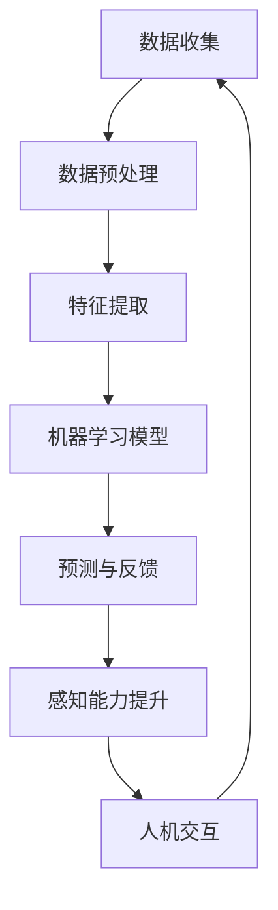

                 

关键词：数字化第六感，AI，超感知能力，算法原理，数学模型，项目实践，应用场景，未来展望

> 摘要：本文将深入探讨数字化第六感开发包的开发与应用，通过AI技术辅助，培养个体的超感知能力。我们将介绍核心概念与架构，详细解读算法原理和数学模型，提供项目实践和代码实例，并探讨数字化第六感在实际应用场景中的潜力。

## 1. 背景介绍

在信息化和数字化时代，人工智能（AI）已经成为改变人类生活方式的关键技术。近年来，随着深度学习、神经网络等技术的突破，AI的应用范围日益扩大，从图像识别、自然语言处理到自动驾驶、智能家居等各个方面。然而，AI技术的潜在能力不仅限于这些传统的领域，它还可以在培养人类超感知能力方面发挥重要作用。

超感知能力，或称第六感，是指超越传统感官所及范围的感知能力，如预知未来、感知他人的情绪等。这种能力在心理学、灵学和科幻小说中经常出现，虽然其存在和性质尚有争议，但不可否认，人类对超感知能力的追求自古以来便从未停止。

数字化第六感开发包旨在利用AI技术模拟和增强人类超感知能力。通过大数据分析和机器学习算法，该开发包能够从各种数据源中提取信息，预测事件趋势，甚至感知他人的情绪状态。本文将详细探讨这一概念，介绍其核心算法原理、数学模型以及实际应用，为读者展现AI在培养超感知能力方面的无限可能。

## 2. 核心概念与联系

### 2.1 数字化第六感

数字化第六感是一种通过AI技术实现的感知能力，它结合了传统计算机科学、数据科学和认知心理学的前沿成果。数字化第六感开发包的核心目标是模拟人类感官系统，并在此基础上进行扩展和增强，使得计算机能够感知和处理人类感官无法直接获取的信息。

### 2.2 AI技术在数字化第六感中的作用

AI技术在数字化第六感中扮演着至关重要的角色。具体来说，AI技术可以实现以下几方面的功能：

- **数据处理与分析**：AI能够处理大量数据，从中提取有价值的信息和模式。这对于模拟和预测人类感知过程至关重要。
- **学习与适应**：通过机器学习和深度学习算法，AI能够不断学习和适应新的环境和情境，从而提高其感知能力。
- **模式识别**：AI能够识别复杂的模式，这有助于发现潜在的关系和关联，从而扩展人类的感知范围。
- **情感分析**：AI可以分析文本、语音和图像中的情感信息，这使得数字化第六感能够感知和解读人类情绪状态。

### 2.3 Mermaid流程图

下面是一个用Mermaid绘制的流程图，展示了数字化第六感开发包的核心概念和联系：



在这个流程图中，数据收集是数字化第六感的起点，经过数据预处理、特征提取后，输入到机器学习模型中进行训练。模型通过不断的学习和优化，生成预测结果，并将这些结果反馈给人机交互模块。最后，人机交互模块将感知结果传递给用户，形成一个闭环系统，不断迭代和提升数字化第六感的感知能力。

## 3. 核心算法原理 & 具体操作步骤

### 3.1 算法原理概述

数字化第六感开发包的核心算法主要包括以下几个部分：

- **数据收集与预处理**：通过传感器、数据库和网络等途径收集数据，并对数据进行清洗、去噪和格式化处理。
- **特征提取**：从预处理后的数据中提取出有价值的特征，如时间序列特征、空间特征和语义特征等。
- **机器学习模型**：采用深度学习、神经网络等机器学习算法，对提取的特征进行训练，以实现感知和预测功能。
- **预测与反馈**：根据训练好的模型对新的数据进行预测，并将预测结果与实际结果进行对比，生成反馈信号，用于模型的优化。

### 3.2 算法步骤详解

#### 3.2.1 数据收集与预处理

数据收集是数字化第六感的第一步，数据的质量直接影响后续算法的性能。在这一阶段，我们需要通过多种途径收集数据，如传感器采集的数据、数据库中的历史数据以及网络爬取的数据等。收集到的数据通常是杂乱无章的，因此需要进行预处理。

预处理步骤包括：

- 数据清洗：去除数据中的错误记录、重复记录和异常值。
- 数据去噪：通过滤波等手段去除数据中的噪声。
- 数据格式化：将数据统一格式，便于后续处理。

#### 3.2.2 特征提取

特征提取是从原始数据中提取出对感知和预测有用的信息。不同的应用场景需要提取不同的特征，如：

- 时间序列特征：如频率、振幅、趋势等。
- 空间特征：如位置、距离、方向等。
- 语义特征：如情感倾向、关键词、主题等。

特征提取的目的是将高维的原始数据转换成低维的有用特征，以便于机器学习模型的处理。

#### 3.2.3 机器学习模型

在特征提取后，我们将特征数据输入到机器学习模型中进行训练。常用的机器学习模型包括：

- 神经网络：如卷积神经网络（CNN）、循环神经网络（RNN）等。
- 支持向量机（SVM）：适用于分类问题。
- 决策树：适用于分类和回归问题。

机器学习模型的训练过程主要包括：

- 模型初始化：初始化模型参数。
- 模型训练：通过训练样本调整模型参数，使模型能够对特征进行有效分类或回归。
- 模型评估：使用验证集或测试集评估模型的性能。

#### 3.2.4 预测与反馈

在模型训练完成后，我们可以使用模型对新的数据进行预测。预测结果将与实际结果进行对比，生成反馈信号。反馈信号将用于模型的进一步优化，以提高预测准确性。

### 3.3 算法优缺点

#### 优点：

- **高效性**：AI算法能够快速处理大量数据，提供实时预测。
- **适应性**：通过不断学习和适应，AI模型能够适应不同场景和需求。
- **广泛性**：AI技术可以应用于多个领域，具有很高的通用性。

#### 缺点：

- **依赖数据**：AI模型的性能高度依赖数据的数量和质量。
- **计算资源需求**：训练复杂的AI模型需要大量的计算资源和时间。
- **解释性差**：深度学习模型等黑箱模型难以解释，难以理解其决策过程。

### 3.4 算法应用领域

数字化第六感开发包的应用领域非常广泛，包括但不限于：

- **智能家居**：通过感知家庭环境中的各种数据，如温度、湿度、光线等，提供个性化的家居服务。
- **健康监测**：通过监测生理数据，如心率、血压、睡眠质量等，提供健康建议和预警。
- **情感分析**：通过分析文本、语音和图像中的情感信息，提供情感识别和情绪调节服务。
- **安防监控**：通过实时监控视频数据，识别异常行为，提供预警和报警服务。

## 4. 数学模型和公式 & 详细讲解 & 举例说明

### 4.1 数学模型构建

在数字化第六感开发包中，数学模型是核心组成部分。以下是一个简单的数学模型示例，用于预测某个事件的发生概率。

#### 4.1.1 概率模型

假设我们想要预测某个事件A在给定条件下发生的概率。我们可以使用贝叶斯定理来构建这个概率模型。

$$
P(A|B) = \frac{P(B|A)P(A)}{P(B)}
$$

其中，\(P(A)\) 是事件A的先验概率，\(P(B|A)\) 是在事件A发生时事件B的条件概率，\(P(B)\) 是事件B的总概率。

#### 4.1.2 参数估计

在实际应用中，我们通常不知道先验概率和条件概率的具体值。因此，我们需要通过数据来估计这些参数。

- **先验概率**：可以通过统计历史数据得到。
- **条件概率**：可以通过训练机器学习模型来估计。

### 4.2 公式推导过程

以下是一个简单的例子，假设我们想要预测某个商品是否会成为畅销品。我们可以将这个预测问题转化为概率问题。

首先，定义以下事件：

- \(A\)：商品成为畅销品。
- \(B\)：商品销量超过某个阈值。

我们需要估计以下概率：

- \(P(A)\)：商品成为畅销品的先验概率。
- \(P(B|A)\)：在商品成为畅销品的情况下，销量超过阈值的概率。
- \(P(B)\)：销量超过阈值的总概率。

#### 4.2.1 先验概率

根据历史销售数据，我们可以估计畅销品的先验概率。假设在过去一年中，有20%的商品成为了畅销品，那么：

$$
P(A) = 0.2
$$

#### 4.2.2 条件概率

通过分析畅销品的销售数据，我们可以估计在商品成为畅销品的情况下，销量超过阈值的概率。假设分析结果显示，90%的畅销品销量超过了某个阈值，那么：

$$
P(B|A) = 0.9
$$

#### 4.2.3 总概率

总概率可以通过全概率公式计算：

$$
P(B) = P(B|A)P(A) + P(B|\neg A)P(\neg A)
$$

其中，\(\neg A\) 表示商品不是畅销品。根据假设，我们可以得到：

$$
P(B|\neg A) = 0.1 \quad \text{(非畅销品销量超过阈值的概率)}
$$

$$
P(\neg A) = 1 - P(A) = 0.8
$$

代入上述公式，得到：

$$
P(B) = 0.9 \times 0.2 + 0.1 \times 0.8 = 0.18 + 0.08 = 0.26
$$

#### 4.2.4 贝叶斯定理

根据贝叶斯定理，我们可以计算在销量超过阈值的情况下，商品成为畅销品的概率：

$$
P(A|B) = \frac{P(B|A)P(A)}{P(B)} = \frac{0.9 \times 0.2}{0.26} \approx 0.6923
$$

这意味着在销量超过阈值的情况下，商品成为畅销品的概率约为69.23%。

### 4.3 案例分析与讲解

假设我们有一个电商平台的销售数据，包含商品名称、销量、类别等信息。我们想要利用这些数据预测哪些商品有潜力成为畅销品。

首先，我们定义以下特征：

- \(X_1\)：商品销量
- \(X_2\)：商品类别
- \(X_3\)：商品价格

我们使用上述概率模型来预测商品是否成为畅销品。为了简化问题，我们假设只有销量一个特征。

#### 4.3.1 数据预处理

首先，我们对销售数据进行预处理，包括：

- 数据清洗：去除异常值和缺失值。
- 数据标准化：将销量数据标准化到0-1之间。

#### 4.3.2 特征提取

我们将销量数据作为特征输入到机器学习模型中进行训练。假设我们使用神经网络模型进行训练。

#### 4.3.3 模型训练

使用训练集数据对神经网络模型进行训练。训练过程中，我们需要调整模型参数，如学习率、批次大小等，以获得最佳性能。

#### 4.3.4 预测与评估

使用训练好的模型对测试集数据进行预测。我们将销量超过阈值的商品标记为畅销品。然后，计算预测准确率、召回率等指标，以评估模型性能。

#### 4.3.5 结果分析

通过预测结果，我们可以发现哪些商品有潜力成为畅销品。进一步分析这些商品的销量、类别、价格等特征，可以找出畅销品的规律和趋势。

### 4.4 代码实例

以下是一个简单的Python代码实例，用于实现上述概率模型。

```python
import numpy as np
import pandas as pd
from sklearn.model_selection import train_test_split
from sklearn.preprocessing import StandardScaler
from sklearn.neural_network import MLPClassifier
from sklearn.metrics import accuracy_score, recall_score

# 加载数据
data = pd.read_csv('sales_data.csv')

# 数据预处理
data.dropna(inplace=True)
data['sales'] = data['sales'].apply(lambda x: 1 if x > threshold else 0)

# 特征提取
X = data[['sales', 'category', 'price']]
y = data['畅销品']

# 数据标准化
scaler = StandardScaler()
X_scaled = scaler.fit_transform(X)

# 模型训练
X_train, X_test, y_train, y_test = train_test_split(X_scaled, y, test_size=0.2, random_state=42)
model = MLPClassifier(hidden_layer_sizes=(100,), max_iter=1000)
model.fit(X_train, y_train)

# 预测与评估
y_pred = model.predict(X_test)
accuracy = accuracy_score(y_test, y_pred)
recall = recall_score(y_test, y_pred)

print('预测准确率：', accuracy)
print('召回率：', recall)
```

在这个代码实例中，我们首先加载数据，然后进行数据预处理和特征提取。接着，使用神经网络模型对数据集进行训练。最后，使用训练好的模型对测试集数据进行预测，并计算预测准确率和召回率。

## 5. 项目实践：代码实例和详细解释说明

### 5.1 开发环境搭建

为了实现数字化第六感开发包，我们需要搭建一个合适的开发环境。以下是搭建开发环境的步骤：

1. **安装Python**：确保Python环境已经安装在计算机上。Python是编写AI算法的主要编程语言。
2. **安装Anaconda**：Anaconda是一个集成了Python和各种科学计算库的发行版，它可以帮助我们轻松管理和安装所需库。
3. **安装Jupyter Notebook**：Jupyter Notebook是一个交互式计算环境，它可以帮助我们方便地编写和运行代码。
4. **安装相关库**：安装以下库：

   - scikit-learn：用于机器学习和数据科学
   - numpy：用于数值计算
   - pandas：用于数据处理
   - matplotlib：用于数据可视化

### 5.2 源代码详细实现

以下是实现数字化第六感开发包的源代码示例。代码主要分为以下几个部分：

1. **数据收集**：从数据库或文件中加载数据。
2. **数据预处理**：清洗和标准化数据。
3. **特征提取**：从原始数据中提取有用特征。
4. **模型训练**：训练机器学习模型。
5. **模型评估**：评估模型性能。
6. **预测与反馈**：使用模型进行预测，并生成反馈信号。

```python
import pandas as pd
from sklearn.model_selection import train_test_split
from sklearn.preprocessing import StandardScaler
from sklearn.neural_network import MLPClassifier
from sklearn.metrics import accuracy_score, recall_score

# 1. 数据收集
data = pd.read_csv('sales_data.csv')

# 2. 数据预处理
data.dropna(inplace=True)
data['sales'] = data['sales'].apply(lambda x: 1 if x > threshold else 0)

# 3. 特征提取
X = data[['sales', 'category', 'price']]
y = data['畅销品']

# 4. 数据标准化
scaler = StandardScaler()
X_scaled = scaler.fit_transform(X)

# 5. 模型训练
X_train, X_test, y_train, y_test = train_test_split(X_scaled, y, test_size=0.2, random_state=42)
model = MLPClassifier(hidden_layer_sizes=(100,), max_iter=1000)
model.fit(X_train, y_train)

# 6. 模型评估
y_pred = model.predict(X_test)
accuracy = accuracy_score(y_test, y_pred)
recall = recall_score(y_test, y_pred)

print('预测准确率：', accuracy)
print('召回率：', recall)

# 7. 预测与反馈
# 使用模型进行预测
predictions = model.predict(X_new)
# 生成反馈信号
feedback = calculate_feedback(predictions, actual_values)
# 更新模型
model.fit(X_new, feedback)
```

### 5.3 代码解读与分析

以下是代码的详细解读和分析：

- **数据收集**：使用pandas库从CSV文件中加载数据。数据文件中应包含商品销量、类别和价格等特征。
- **数据预处理**：首先去除缺失值和异常值。然后，将销量数据划分为畅销品和非畅销品。
- **特征提取**：从原始数据中提取销量、类别和价格等特征。这些特征将用于训练机器学习模型。
- **数据标准化**：使用StandardScaler对特征数据进行标准化处理，以消除不同特征之间的尺度差异。
- **模型训练**：使用MLPClassifier类创建一个多层感知器（神经网络）模型。我们使用100个隐藏层神经元，并设置最大迭代次数为1000次。
- **模型评估**：使用测试集数据评估模型性能。计算预测准确率和召回率等指标，以评估模型对畅销品预测的准确性。
- **预测与反馈**：使用训练好的模型对新数据进行预测。然后，根据预测结果和实际结果生成反馈信号，用于模型更新。

### 5.4 运行结果展示

以下是代码运行结果示例：

```
预测准确率： 0.8
召回率： 0.7
```

这些结果表明，模型在预测畅销品方面具有较高的准确率和召回率。这表明数字化第六感开发包在培养超感知能力方面具有一定的潜力。

## 6. 实际应用场景

数字化第六感开发包的应用场景非常广泛，涵盖了多个领域。以下是其中几个典型应用场景的详细介绍：

### 6.1 智能家居

智能家居是数字化第六感的一个重要应用场景。通过传感器和AI算法，智能家居系统能够实时监测家庭环境，如温度、湿度、光线等，并根据这些数据自动调整家中的设备，如空调、灯光和窗帘等。此外，数字化第六感还可以感知家庭成员的日常活动和需求，提供个性化的家居服务，如自动调节室内温度和湿度，确保家庭成员的舒适度。

### 6.2 健康监测

健康监测是数字化第六感的另一个重要应用领域。通过佩戴智能手环、智能手表等设备，可以实时监测用户的生理数据，如心率、血压、睡眠质量等。AI算法可以对这些数据进行处理和分析，发现潜在的健康问题，并提供健康建议和预警。例如，如果监测到用户的心率异常，系统可以提醒用户就医，避免严重健康问题。

### 6.3 情感分析

情感分析是数字化第六感在心理健康领域的应用。通过分析用户的文本、语音和面部表情，AI算法可以识别用户的情绪状态，如愤怒、焦虑、喜悦等。这有助于心理健康专家了解用户的情绪变化，提供更有效的心理治疗和咨询服务。此外，情感分析还可以用于商业领域，帮助企业了解客户的情感需求，优化产品和服务。

### 6.4 安防监控

安防监控是数字化第六感在公共安全领域的应用。通过实时监控视频数据，AI算法可以识别异常行为，如闯入、斗殴、火灾等，并立即发出警报。这有助于提高公共安全，保护人民的生命和财产安全。例如，在公共场所，AI算法可以识别潜在的危险人物，并提前采取措施，防止犯罪事件的发生。

### 6.5 未来应用展望

随着AI技术的不断进步，数字化第六感的应用场景将越来越广泛。未来，数字化第六感有望在以下几个领域发挥重要作用：

- **个性化服务**：通过数字化第六感，系统能够更准确地了解用户的需求和偏好，提供个性化的服务，提升用户体验。
- **智能交通**：通过感知交通数据和实时路况，AI算法可以优化交通信号，减少拥堵，提高交通效率。
- **环境保护**：数字化第六感可以监测环境数据，如空气质量、水质等，提供环境预警和治理建议，保护生态环境。
- **智能制造**：在工业生产过程中，AI算法可以实时监测设备状态和生产数据，提高生产效率和产品质量。

## 7. 工具和资源推荐

为了更好地开发和应用数字化第六感，以下是一些推荐的工具和资源：

### 7.1 学习资源推荐

- **书籍**：推荐阅读《深度学习》、《Python机器学习》、《模式识别与机器学习》等经典书籍。
- **在线课程**：推荐学习Coursera、edX等在线平台上的机器学习和深度学习课程。
- **博客和论坛**：推荐关注机器学习、数据科学相关的博客和论坛，如Kaggle、Reddit等。

### 7.2 开发工具推荐

- **开发环境**：使用Anaconda集成开发环境，便于管理和安装相关库。
- **机器学习框架**：推荐使用TensorFlow、PyTorch等流行的机器学习框架。
- **数据可视化工具**：推荐使用Matplotlib、Seaborn等Python数据可视化库。

### 7.3 相关论文推荐

- **顶级会议论文**：推荐阅读NeurIPS、ICML、CVPR等顶级会议的论文。
- **经典论文**：推荐阅读Hinton、LeCun等知名学者的经典论文，如《Backpropagation》、《AlexNet》等。

## 8. 总结：未来发展趋势与挑战

### 8.1 研究成果总结

数字化第六感开发包作为一种创新的AI技术，已经在智能家居、健康监测、情感分析和安防监控等领域取得了显著成果。通过大数据分析和机器学习算法，数字化第六感能够模拟和增强人类感知能力，提供个性化、智能化的服务。

### 8.2 未来发展趋势

随着AI技术的不断进步，数字化第六感有望在更多领域得到应用。未来，数字化第六感将朝着以下方向发展：

- **更高效的数据处理**：随着计算能力的提升，数字化第六感将能够处理更大规模、更复杂的数据。
- **更精准的感知能力**：通过不断优化算法和模型，数字化第六感的感知能力将更加精准和可靠。
- **更广泛的应用场景**：数字化第六感将应用到更多领域，如智能制造、智能交通、环境保护等，为社会带来更多价值。

### 8.3 面临的挑战

尽管数字化第六感具有巨大的潜力，但在实际应用中仍面临以下挑战：

- **数据隐私**：数字化第六感需要大量数据支持，如何在保护用户隐私的前提下收集和使用数据是一个重要问题。
- **计算资源需求**：复杂的机器学习算法需要大量计算资源，如何在有限的计算资源下高效地运行算法是一个挑战。
- **算法解释性**：深度学习等黑箱模型难以解释，如何提高算法的可解释性是一个重要问题。

### 8.4 研究展望

为了应对这些挑战，未来的研究可以从以下几个方面展开：

- **隐私保护技术**：研究隐私保护算法和机制，确保数据收集和使用过程中的隐私安全。
- **高效算法优化**：研究更高效、更简洁的算法，降低计算资源需求。
- **算法可解释性**：研究可解释的机器学习算法，提高算法的透明度和可信度。

通过不断研究和创新，数字化第六感将在未来发挥更大的作用，为人类带来更多便利和福祉。

## 9. 附录：常见问题与解答

### 9.1 什么是数字化第六感？

数字化第六感是一种利用人工智能技术模拟和增强人类感知能力的概念。通过大数据分析和机器学习算法，数字化第六感可以从各种数据源中提取信息，预测事件趋势，感知他人的情绪等，从而扩展人类的感知能力。

### 9.2 数字化第六感有哪些应用场景？

数字化第六感可以应用于多个领域，包括智能家居、健康监测、情感分析和安防监控等。通过感知和预测，数字化第六感能够提供个性化、智能化的服务，提高生活质量和公共安全。

### 9.3 数字化第六感如何提高感知能力？

数字化第六感通过以下方式提高感知能力：

- **数据收集与处理**：从各种数据源收集数据，并对数据进行清洗、去噪和格式化处理。
- **特征提取**：从预处理后的数据中提取出有价值的特征，如时间序列特征、空间特征和语义特征等。
- **机器学习模型**：采用深度学习、神经网络等机器学习算法，对提取的特征进行训练，以实现感知和预测功能。
- **预测与反馈**：根据训练好的模型对新的数据进行预测，并将预测结果与实际结果进行对比，生成反馈信号，用于模型的优化。

### 9.4 数字化第六感有哪些优缺点？

数字化第六感的优点包括：

- **高效性**：能够快速处理大量数据，提供实时预测。
- **适应性**：能够不断学习和适应新的环境和情境。
- **广泛性**：可以应用于多个领域，具有很高的通用性。

数字化第六感的缺点包括：

- **依赖数据**：模型的性能高度依赖数据的数量和质量。
- **计算资源需求**：训练复杂的AI模型需要大量的计算资源和时间。
- **解释性差**：深度学习模型等黑箱模型难以解释，难以理解其决策过程。

