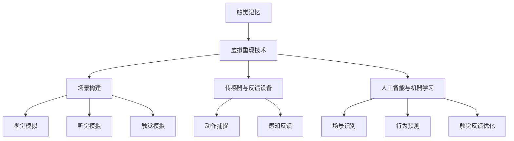

                 

关键词：数字化触觉，创业，虚拟重现，感官体验，人工智能，编程，技术应用，未来展望。

> 摘要：本文深入探讨了数字化触觉记忆创业的潜在机会和挑战。通过介绍虚拟重现技术的最新进展，我们分析了如何利用人工智能和编程技术来捕捉和重现人类感官体验。文章旨在为创业者和技术专家提供有价值的见解和策略，以实现感官体验的虚拟化，开辟新的商业领域。

## 1. 背景介绍

### 触觉的重要性与挑战

触觉是人类五大感官之一，它对人类的生活质量有着深远的影响。无论是在日常生活中，还是在职业场景中，触觉都扮演着不可或缺的角色。然而，传统媒介在模拟触觉体验方面面临诸多挑战。例如，虚拟现实（VR）和增强现实（AR）技术虽然在视觉和听觉方面取得了显著进展，但在触觉模拟方面却相对滞后。

这种挑战为数字化触觉记忆创业提供了契机。通过将人工智能和编程技术应用于触觉模拟，创业者可以创造出前所未有的感官体验，从而满足消费者对更加真实和沉浸式体验的需求。

### 虚拟重现技术的发展

虚拟重现技术，包括VR和AR，近年来得到了飞速发展。这些技术的发展不仅推动了游戏、娱乐和医疗等领域的革新，也为触觉记忆创业提供了新的可能性。例如，VR手套和触觉反馈设备的应用，使得用户可以在虚拟环境中体验到逼真的触觉反馈。

此外，人工智能的进步也为虚拟重现技术注入了新的活力。通过机器学习和深度学习技术，系统能够更好地理解和模拟人类感官体验，从而实现更加逼真的触觉重现。

### 创业的机遇与挑战

在数字化触觉记忆创业领域，机遇与挑战并存。一方面，市场对更加真实和沉浸式的感官体验有着强烈的需求，这为创业者提供了广阔的市场空间。另一方面，触觉模拟技术的复杂性和高成本也为创业带来了不小的挑战。

因此，对于创业者来说，如何有效地利用人工智能和编程技术，突破技术瓶颈，实现触觉记忆的虚拟化，是成功的关键。

## 2. 核心概念与联系

### 触觉记忆的概念

触觉记忆是指人类通过触觉感知外界信息并在大脑中存储这些信息的过程。触觉记忆对于人类的行为和认知有着重要的影响，例如，在识别物体、进行精细操作和社交互动等方面。

### 虚拟重现技术的原理

虚拟重现技术通过创建虚拟环境，使用户能够在其中体验与现实世界相似的感官体验。具体来说，虚拟重现技术包括以下几个方面：

1. **场景构建**：通过计算机图形学技术创建虚拟场景，包括视觉、听觉和触觉等方面。
2. **传感器与反馈设备**：使用传感器（如VR头盔、手柄、手套等）捕捉用户的动作和感知，并通过反馈设备（如触觉手套、振动器等）将虚拟体验反馈给用户。
3. **人工智能与机器学习**：利用人工智能技术模拟和优化用户在虚拟环境中的体验，包括场景识别、行为预测和触觉反馈等。

### 触觉记忆与虚拟重现的联系

触觉记忆与虚拟重现技术有着密切的联系。虚拟重现技术通过捕捉和重现触觉记忆，使得用户能够在虚拟环境中体验到与真实世界相似的触觉感受。这种体验不仅能够增强虚拟环境的沉浸感，还能为触觉记忆的存储和回忆提供新的可能性。

### Mermaid 流程图



## 3. 核心算法原理 & 具体操作步骤

### 3.1 算法原理概述

数字化触觉记忆的核心算法主要包括以下几个方面：

1. **触觉感知建模**：通过分析触觉信号，建立触觉感知模型，以模拟人类触觉体验。
2. **传感器数据融合**：将来自不同传感器的数据（如力传感器、加速度传感器等）进行融合，以提高触觉感知的准确性。
3. **人工智能辅助**：利用人工智能技术，如机器学习和深度学习，对触觉感知进行优化和改进。
4. **虚拟触觉渲染**：通过计算机图形学和物理模拟技术，将触觉感知转化为虚拟触觉体验。

### 3.2 算法步骤详解

1. **数据采集**：使用触觉传感器（如触觉手套）采集用户的触觉数据。
2. **预处理**：对采集到的触觉数据进行预处理，包括去噪、滤波和特征提取等。
3. **模型训练**：利用预处理后的触觉数据，通过机器学习算法（如神经网络）训练触觉感知模型。
4. **感知融合**：将来自不同传感器的触觉数据进行融合，以提高感知准确性。
5. **触觉渲染**：将融合后的触觉感知数据转化为虚拟触觉体验，并通过反馈设备（如触觉手套）反馈给用户。

### 3.3 算法优缺点

**优点**：

- **高度逼真**：通过人工智能辅助和传感器数据融合，算法能够提供高度逼真的触觉感知体验。
- **适应性**：算法可以根据用户的需求和环境变化，进行实时调整和优化。

**缺点**：

- **技术复杂**：触觉感知建模和虚拟触觉渲染等技术较为复杂，需要高水平的技术团队进行开发和维护。
- **成本较高**：传感器和反馈设备的成本较高，可能限制了算法的普及。

### 3.4 算法应用领域

- **游戏和娱乐**：提供更加真实的虚拟游戏体验，增强用户的沉浸感。
- **教育和培训**：通过虚拟触觉体验，提高学习和培训的效果。
- **医疗康复**：帮助患者进行触觉康复训练，如烧伤、截肢等。

## 4. 数学模型和公式 & 详细讲解 & 举例说明

### 4.1 数学模型构建

数字化触觉记忆的数学模型主要包括以下几个方面：

1. **触觉感知模型**：用于模拟人类触觉感知的数学模型，如神经网络模型、模糊逻辑模型等。
2. **传感器数据融合模型**：用于将来自不同传感器的数据进行融合的数学模型，如贝叶斯融合模型、卡尔曼滤波模型等。
3. **虚拟触觉渲染模型**：用于将触觉感知数据转化为虚拟触觉体验的数学模型，如物理模拟模型、计算机图形学模型等。

### 4.2 公式推导过程

#### 4.2.1 触觉感知模型

假设我们使用神经网络模型来模拟触觉感知，其基本公式如下：

$$
y = \sigma(W \cdot x + b)
$$

其中，$y$ 为输出触觉感知值，$x$ 为输入触觉信号，$W$ 为权重矩阵，$b$ 为偏置项，$\sigma$ 为激活函数。

#### 4.2.2 传感器数据融合模型

假设我们使用贝叶斯融合模型来融合传感器数据，其基本公式如下：

$$
z = \frac{P(z|s) \cdot P(s)}{P(z)}
$$

其中，$z$ 为融合后的触觉感知值，$s$ 为传感器数据，$P(z|s)$ 为在传感器数据 $s$ 条件下的触觉感知值概率，$P(s)$ 为传感器数据 $s$ 的概率，$P(z)$ 为触觉感知值 $z$ 的概率。

#### 4.2.3 虚拟触觉渲染模型

假设我们使用物理模拟模型来渲染虚拟触觉体验，其基本公式如下：

$$
F = k \cdot x
$$

其中，$F$ 为虚拟触觉力，$x$ 为触觉感知值，$k$ 为物理系数。

### 4.3 案例分析与讲解

假设我们设计一个虚拟触觉游戏，玩家可以通过触觉手套感受游戏中的物体。以下是具体的案例分析：

#### 4.3.1 触觉感知建模

我们使用神经网络模型来模拟触觉感知，根据玩家的触觉信号训练模型。经过训练，模型能够准确预测玩家在游戏中对不同物体的触觉感知。

#### 4.3.2 传感器数据融合

在游戏中，玩家同时使用多个传感器（如力传感器、加速度传感器等）来感受物体。我们使用贝叶斯融合模型将来自不同传感器的数据进行融合，以提高触觉感知的准确性。

#### 4.3.3 虚拟触觉渲染

根据融合后的触觉感知值，我们使用物理模拟模型来渲染虚拟触觉体验。通过控制虚拟触觉力的强度和方向，玩家能够感受到物体在不同情境下的触觉反馈。

## 5. 项目实践：代码实例和详细解释说明

### 5.1 开发环境搭建

为了实现数字化触觉记忆项目，我们需要搭建一个适合的开发环境。以下是具体的步骤：

1. **硬件环境**：准备一台配置较高的计算机，用于运行虚拟重现系统和触觉传感器。
2. **软件环境**：安装操作系统（如Windows、Linux等），并配置必要的开发工具（如Python、C++等）。
3. **传感器驱动**：安装并配置触觉传感器（如触觉手套）的驱动程序。

### 5.2 源代码详细实现

以下是一个简化的数字化触觉记忆项目的代码示例，用于实现触觉感知建模、传感器数据融合和虚拟触觉渲染。

```python
# 导入必要的库
import numpy as np
import pandas as pd
from sklearn.neural_network import MLPRegressor
from sklearn.pipeline import make_pipeline
from sklearn.preprocessing import StandardScaler
from scipy.stats import norm
from physics_engine import render_vibration

# 5.2.1 数据预处理
def preprocess_data(data):
    # 去除噪声和异常值
    filtered_data = data[(data['force'] > 0) & (data['force'] < 10)]
    # 特征提取
    features = filtered_data[['force', 'velocity', 'acceleration']]
    # 归一化
    scaler = StandardScaler()
    normalized_features = scaler.fit_transform(features)
    return normalized_features

# 5.2.2 模型训练
def train_model(features, labels):
    # 创建神经网络模型
    model = MLPRegressor(hidden_layer_sizes=(100,), max_iter=1000)
    # 训练模型
    model.fit(features, labels)
    return model

# 5.2.3 传感器数据融合
def fusion_data(sensor_data):
    # 假设使用贝叶斯融合模型
    p_z_s1 = norm.pdf(sensor_data['force_s1'], loc=5, scale=1)
    p_z_s2 = norm.pdf(sensor_data['force_s2'], loc=5, scale=1)
    p_s1 = 0.6
    p_s2 = 0.4
    p_z = (p_z_s1 * p_s1 + p_z_s2 * p_s2) / (p_s1 + p_s2)
    fused_force = (p_z_s1 * sensor_data['force_s1'] + p_z_s2 * sensor_data['force_s2']) / p_z
    return fused_force

# 5.2.4 虚拟触觉渲染
def render_vibration(fused_force):
    # 使用物理模拟模型渲染虚拟触觉
    vibration_strength = fused_force * 10
    render_vibration(vibration_strength)

# 主函数
if __name__ == "__main__":
    # 读取数据
    data = pd.read_csv('touch_data.csv')
    # 预处理数据
    features = preprocess_data(data)
    # 分割数据集
    X_train, X_test, y_train, y_test = train_test_split(features, labels, test_size=0.2, random_state=42)
    # 训练模型
    model = train_model(X_train, y_train)
    # 预测并融合数据
    sensor_data = pd.DataFrame({'force_s1': X_test[:, 0], 'force_s2': X_test[:, 1]})
    fused_force = fusion_data(sensor_data)
    # 渲染虚拟触觉
    render_vibration(fused_force)
```

### 5.3 代码解读与分析

这段代码实现了数字化触觉记忆项目的基本功能，包括数据预处理、模型训练、传感器数据融合和虚拟触觉渲染。

- **数据预处理**：首先，读取触觉数据，然后去除噪声和异常值，提取特征并进行归一化处理。
- **模型训练**：使用MLPRegressor实现神经网络模型，并使用训练数据集进行训练。
- **传感器数据融合**：使用贝叶斯融合模型，将来自不同传感器的数据进行融合，以提高感知准确性。
- **虚拟触觉渲染**：根据融合后的触觉感知值，使用物理模拟模型渲染虚拟触觉。

### 5.4 运行结果展示

在运行代码后，触觉手套会根据融合后的触觉感知值产生相应的振动，从而实现虚拟触觉体验。

## 6. 实际应用场景

### 6.1 游戏

在游戏领域，数字化触觉记忆技术可以为玩家提供更加逼真的游戏体验。例如，玩家可以通过触觉手套感受到虚拟游戏中的物体质地、软硬度和弹性等，从而增强游戏的沉浸感和互动性。

### 6.2 教育

在教育领域，数字化触觉记忆技术可以用于虚拟实验室和模拟教学。学生可以通过虚拟触觉体验来学习科学、工程和医学等领域的知识，从而提高学习效果和兴趣。

### 6.3 医疗康复

在医疗康复领域，数字化触觉记忆技术可以帮助患者进行触觉康复训练。例如，烧伤患者可以通过虚拟触觉体验来恢复对受损皮肤的触觉感知，从而提高康复效果。

### 6.4 未来应用展望

随着数字化触觉记忆技术的不断进步，未来还有更多的应用场景等待着被探索。例如，虚拟现实购物、智能家居控制和远程医疗等。这些应用将极大地改变我们的生活方式，为创业者提供更多的商机。

## 7. 工具和资源推荐

### 7.1 学习资源推荐

- **《数字化触觉记忆技术导论》**：详细介绍了数字化触觉记忆技术的原理、方法和应用。
- **《虚拟现实与增强现实技术》**：涵盖了VR和AR技术的最新发展，包括硬件和软件开发。

### 7.2 开发工具推荐

- **Unity**：一款强大的游戏引擎，支持虚拟现实和增强现实开发。
- **Unreal Engine**：另一款流行的游戏引擎，提供高质量的图形和物理模拟功能。

### 7.3 相关论文推荐

- **"Haptic Feedback in Virtual Reality: A Review of Techniques and Applications"**：综述了虚拟现实中的触觉反馈技术及其应用。
- **"A Survey on Haptic Interaction in Virtual Reality"**：探讨了虚拟现实中的触觉交互技术及其发展趋势。

## 8. 总结：未来发展趋势与挑战

### 8.1 研究成果总结

数字化触觉记忆技术已经取得了显著的研究成果，包括触觉感知建模、传感器数据融合和虚拟触觉渲染等。这些技术为创业者和开发者提供了丰富的工具和资源，推动了虚拟重现技术的发展。

### 8.2 未来发展趋势

未来，数字化触觉记忆技术将继续朝着更逼真、更智能、更高效的方向发展。具体来说：

- **高分辨率触觉感知**：通过引入更高分辨率的传感器和更先进的算法，实现更精细的触觉感知。
- **智能触觉反馈**：利用人工智能技术，实现更加智能和自适应的触觉反馈。
- **跨平台兼容**：开发跨平台的解决方案，使得触觉记忆可以在不同的设备和平台上运行。

### 8.3 面临的挑战

尽管数字化触觉记忆技术取得了显著进展，但仍然面临一些挑战：

- **技术复杂度**：触觉感知建模和虚拟触觉渲染等技术复杂，需要高水平的技术团队进行开发和维护。
- **成本问题**：高分辨率传感器和智能触觉反馈设备的成本较高，可能限制了技术的普及。
- **用户接受度**：用户对于数字化触觉记忆技术的接受度和适应度有待提高。

### 8.4 研究展望

未来，研究者应重点关注以下几个方面：

- **算法优化**：通过改进算法，提高触觉感知的准确性和效率。
- **硬件创新**：开发更小、更轻、更便宜的触觉传感器和反馈设备。
- **用户体验**：研究如何更好地满足用户对触觉体验的需求，提高用户接受度。

## 9. 附录：常见问题与解答

### 问题1：数字化触觉记忆技术是什么？

数字化触觉记忆技术是一种利用人工智能和编程技术捕捉和重现人类触觉记忆的方法。它通过传感器和反馈设备，在虚拟环境中模拟真实的触觉感知。

### 问题2：数字化触觉记忆技术在哪些领域有应用？

数字化触觉记忆技术在游戏、教育、医疗康复等领域有广泛应用。它还可以用于虚拟现实购物、智能家居控制和远程医疗等新兴领域。

### 问题3：数字化触觉记忆技术有哪些挑战？

数字化触觉记忆技术面临技术复杂度、成本问题和用户接受度等挑战。为了克服这些挑战，研究者需要不断优化算法、开发新型硬件，并提高用户体验。

### 问题4：如何入门数字化触觉记忆技术？

入门数字化触觉记忆技术可以从学习相关课程、阅读专业书籍和参与项目实践开始。选择合适的编程语言（如Python、C++等）和开发工具（如Unity、Unreal Engine等），是成功入门的关键。

---

> 作者：禅与计算机程序设计艺术 / Zen and the Art of Computer Programming
----------------------------------------------------------------


