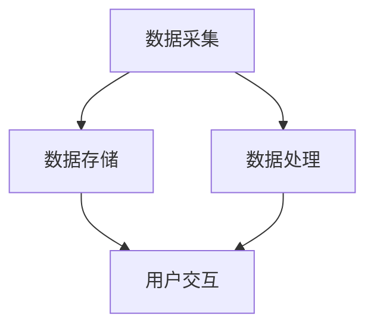

                 

关键词：数字化记忆，个人经历，永久保存，人工智能，创业，技术解决方案

> 摘要：随着人工智能技术的快速发展，数字化记忆银行作为一种创新性的创业项目逐渐引起关注。本文旨在探讨数字化记忆银行的核心概念、实现原理、技术解决方案、实际应用场景、未来展望以及面临的挑战，为创业者提供全方位的指导。

## 1. 背景介绍

在人类历史上，记忆一直是个人和社会发展的重要资产。然而，随着时间的流逝，许多珍贵的个人经历和记忆难以保存和传承。传统的方法如日记、照片和录音等，虽然能在一定程度上记录生活，但往往不够系统、全面和长久。随着科技的进步，特别是人工智能和大数据技术的发展，我们有机会构建一个全新的数字化记忆银行，永久保存个人经历，为后代提供宝贵的历史资料。

数字化记忆银行的目标是利用先进的技术手段，将个人的记忆数据化、结构化，实现永久保存和高效访问。这一概念的提出，不仅满足了人们对个人记忆保存的需求，也为人工智能技术提供了新的应用场景，为创业提供了巨大的市场空间。

## 2. 核心概念与联系

### 2.1 数字化记忆银行的核心概念

数字化记忆银行的核心概念可以概括为以下几点：

1. **数据采集**：通过多种传感器和输入设备，采集个体的生理、心理和行为数据。
2. **数据存储**：将采集到的数据存储在分布式数据库中，确保数据的安全性和可访问性。
3. **数据处理**：利用人工智能算法对数据进行处理和分析，提取出有用的信息和模式。
4. **用户交互**：通过用户界面，提供便捷的数据查询、管理和分享功能。

### 2.2 数字化记忆银行的技术架构

数字化记忆银行的技术架构可以分为以下几个层次：

1. **数据采集层**：包括传感器、输入设备等，负责实时采集个体的各种数据。
2. **数据存储层**：采用分布式数据库技术，确保数据的安全性和可靠性。
3. **数据处理层**：使用人工智能算法对数据进行处理和分析，包括数据清洗、特征提取、模式识别等。
4. **用户交互层**：提供Web界面、移动应用等，方便用户进行数据查询、管理和分享。

下面是数字化记忆银行的技术架构的Mermaid流程图：



## 3. 核心算法原理 & 具体操作步骤

### 3.1 算法原理概述

数字化记忆银行的核心算法主要包括数据采集、数据处理和用户交互三个方面。

- **数据采集**：使用传感器和输入设备采集个体的生理、心理和行为数据。数据包括心率、血压、睡眠质量、情绪状态、行为轨迹等。
- **数据处理**：利用人工智能算法对数据进行处理和分析，提取出有用的信息和模式。数据处理包括数据清洗、特征提取、模式识别等。
- **用户交互**：通过用户界面，提供便捷的数据查询、管理和分享功能。用户可以随时随地查看自己的记忆数据，了解自己的生活习惯、健康状况等。

### 3.2 算法步骤详解

#### 3.2.1 数据采集

数据采集是数字化记忆银行的第一步。采集的数据类型和数量取决于应用场景和用户需求。以下是一个基本的数据采集流程：

1. **传感器选择**：根据采集数据的需求，选择合适的传感器。例如，为了监测心率，可以选择心率传感器；为了监测行为轨迹，可以选择GPS传感器。
2. **数据采集**：传感器将采集到的数据传输到数据采集模块，数据采集模块将数据上传到数据库。
3. **数据清洗**：对采集到的数据进行清洗，去除无效数据，确保数据的质量。

#### 3.2.2 数据处理

数据处理是数字化记忆银行的核心环节。以下是一个基本的数据处理流程：

1. **特征提取**：从原始数据中提取出有用的特征。特征提取的方法有很多，如时频分析、主成分分析等。
2. **模式识别**：利用机器学习算法对提取出的特征进行分类和聚类，识别出个体的行为模式和情绪状态。
3. **数据可视化**：将处理后的数据以可视化的形式展示给用户，帮助用户更好地理解自己的记忆数据。

#### 3.2.3 用户交互

用户交互是数字化记忆银行的最终目标。以下是一个基本的用户交互流程：

1. **用户注册**：用户在数字化记忆银行平台上注册账号，填写个人信息。
2. **数据查询**：用户可以通过Web界面或移动应用查询自己的记忆数据，了解自己的生活习惯、健康状况等。
3. **数据管理**：用户可以对记忆数据进行管理，如添加、删除、修改等。
4. **数据分享**：用户可以与他人分享自己的记忆数据，或邀请他人查看自己的数据。

### 3.3 算法优缺点

#### 优点

- **高效性**：数字化记忆银行利用人工智能算法对数据进行处理和分析，大大提高了数据处理效率。
- **便捷性**：用户可以通过Web界面或移动应用随时随地查询和管理自己的记忆数据。
- **安全性**：数字化记忆银行采用分布式数据库技术，确保数据的安全性和可靠性。

#### 缺点

- **数据隐私**：由于数字化记忆银行涉及用户的个人数据，数据隐私保护是一个重要问题。
- **技术门槛**：构建数字化记忆银行需要较高的技术门槛，对创业团队的技术实力要求较高。

### 3.4 算法应用领域

数字化记忆银行的应用领域非常广泛，包括但不限于以下方面：

- **个人健康管理**：通过数字化记忆银行，用户可以更好地了解自己的健康状况，预防疾病。
- **教育领域**：数字化记忆银行可以为教育机构提供学生的学习情况分析，帮助教师更好地进行教学。
- **心理学研究**：数字化记忆银行可以为心理学研究提供丰富的数据支持，帮助研究学者更好地理解人类行为和心理。

## 4. 数学模型和公式 & 详细讲解 & 举例说明

### 4.1 数学模型构建

数字化记忆银行的数学模型主要涉及数据采集、数据处理和用户交互三个方面。

#### 4.1.1 数据采集模型

数据采集模型主要涉及传感器和输入设备的选型、数据采集方法和数据清洗过程。以下是一个基本的数据采集模型：

$$
X(t) = f(S(t), E(t), C(t))
$$

其中，$X(t)$表示第$t$时刻的数据集合，$S(t)$表示传感器采集的数据，$E(t)$表示环境因素，$C(t)$表示采集过程。

#### 4.1.2 数据处理模型

数据处理模型主要涉及特征提取、模式识别和数据可视化。以下是一个基本的数据处理模型：

$$
Y(t) = g(F(X(t)), M(X(t)))
$$

其中，$Y(t)$表示第$t$时刻的处理结果，$F(X(t))$表示特征提取，$M(X(t))$表示模式识别。

#### 4.1.3 用户交互模型

用户交互模型主要涉及用户注册、数据查询、数据管理和数据分享。以下是一个基本的用户交互模型：

$$
U(t) = h(R(t), Q(t), M(t), S(t))
$$

其中，$U(t)$表示第$t$时刻的用户交互结果，$R(t)$表示用户注册，$Q(t)$表示数据查询，$M(t)$表示数据管理，$S(t)$表示数据分享。

### 4.2 公式推导过程

#### 4.2.1 数据采集模型推导

数据采集模型的具体推导过程如下：

$$
X(t) = f(S(t), E(t), C(t))
$$

其中，$S(t)$表示传感器采集的数据，$E(t)$表示环境因素，$C(t)$表示采集过程。

1. **传感器数据**：

$$
S(t) = \{s_1(t), s_2(t), ..., s_n(t)\}
$$

2. **环境因素**：

$$
E(t) = \{e_1(t), e_2(t), ..., e_m(t)\}
$$

3. **采集过程**：

$$
C(t) = \{c_1(t), c_2(t), ..., c_p(t)\}
$$

4. **数据采集模型**：

$$
X(t) = f(S(t), E(t), C(t)) = \{x_1(t), x_2(t), ..., x_q(t)\}
$$

#### 4.2.2 数据处理模型推导

数据处理模型的具体推导过程如下：

$$
Y(t) = g(F(X(t)), M(X(t)))
$$

其中，$F(X(t))$表示特征提取，$M(X(t))$表示模式识别。

1. **特征提取**：

$$
F(X(t)) = \{f_1(x_1(t)), f_2(x_2(t)), ..., f_n(x_n(t))\}
$$

2. **模式识别**：

$$
M(X(t)) = \{m_1(x_1(t)), m_2(x_2(t)), ..., m_q(x_q(t))\}
$$

3. **数据处理模型**：

$$
Y(t) = g(F(X(t)), M(X(t))) = \{y_1(t), y_2(t), ..., y_r(t)\}
$$

#### 4.2.3 用户交互模型推导

用户交互模型的具体推导过程如下：

$$
U(t) = h(R(t), Q(t), M(t), S(t))
$$

其中，$R(t)$表示用户注册，$Q(t)$表示数据查询，$M(t)$表示数据管理，$S(t)$表示数据分享。

1. **用户注册**：

$$
R(t) = \{r_1(t), r_2(t), ..., r_p(t)\}
$$

2. **数据查询**：

$$
Q(t) = \{q_1(t), q_2(t), ..., q_q(t)\}
$$

3. **数据管理**：

$$
M(t) = \{m_1(t), m_2(t), ..., m_r(t)\}
$$

4. **数据分享**：

$$
S(t) = \{s_1(t), s_2(t), ..., s_s(t)\}
$$

5. **用户交互模型**：

$$
U(t) = h(R(t), Q(t), M(t), S(t)) = \{u_1(t), u_2(t), ..., u_t(t)\}
$$

### 4.3 案例分析与讲解

#### 4.3.1 数据采集案例

假设一个用户想要记录自己的健康数据，包括心率、血压和睡眠质量。以下是数据采集过程：

1. **传感器数据**：

   - 心率传感器：每分钟采集一次心率数据，如100、110、105等。
   - 血压传感器：每天早晨和晚上各采集一次血压数据，如120/80、130/85等。
   - 睡眠质量传感器：每晚睡眠结束后采集睡眠质量数据，如深度睡眠、浅度睡眠、醒着的时间等。

2. **环境因素**：

   - 气温：每天早晨和晚上各采集一次气温数据，如20°C、25°C等。
   - 湿度：每天早晨和晚上各采集一次湿度数据，如60%、70%等。

3. **采集过程**：

   - 数据采集设备每分钟将心率传感器和血压传感器的数据上传到服务器。
   - 睡眠质量传感器在每晚睡眠结束后将数据上传到服务器。
   - 数据采集设备每天早晨和晚上将气温和湿度数据上传到服务器。

4. **数据清洗**：

   - 去除无效数据，如心率传感器在用户锻炼时采集的数据。
   - 填补缺失数据，如用户在晚上没有佩戴血压传感器时，使用前一天的数据进行填补。

#### 4.3.2 数据处理案例

假设用户希望了解自己的健康数据，包括心率、血压和睡眠质量的趋势。以下是数据处理过程：

1. **特征提取**：

   - 对心率数据进行时频分析，提取出频率特征。
   - 对血压数据进行统计分析，提取出均值、方差等特征。
   - 对睡眠质量数据进行聚类分析，提取出睡眠周期特征。

2. **模式识别**：

   - 利用机器学习算法，对提取出的特征进行分类和聚类，识别出用户的心率异常、血压异常和睡眠质量异常。
   - 对识别出的异常情况进行预警，如用户心率过快、血压过高或睡眠质量较差。

3. **数据可视化**：

   - 将处理后的数据以图表形式展示给用户，如心率变化趋势图、血压变化趋势图、睡眠质量变化趋势图等。

#### 4.3.3 用户交互案例

假设用户希望查看自己的健康数据，并分享给医生。以下是用户交互过程：

1. **用户注册**：

   - 用户在数字化记忆银行平台上注册账号，填写个人信息，如姓名、年龄、联系方式等。

2. **数据查询**：

   - 用户可以通过Web界面或移动应用查询自己的健康数据，如心率、血压和睡眠质量。
   - 用户可以查看历史数据，了解自己的健康状况。

3. **数据管理**：

   - 用户可以对健康数据进行管理，如添加、删除、修改等。
   - 用户可以标记重要的健康数据，如医生建议、治疗方案等。

4. **数据分享**：

   - 用户可以将健康数据分享给医生，以便医生更好地了解用户的健康状况。
   - 用户可以与医生在线交流，讨论健康问题。

## 5. 项目实践：代码实例和详细解释说明

### 5.1 开发环境搭建

为了实现数字化记忆银行的功能，我们需要搭建一个完整的开发环境。以下是一个基本的开发环境搭建过程：

1. **硬件设备**：需要一台高性能的服务器，用于存储和处理数据。
2. **软件环境**：需要安装以下软件：
   - 数据库管理系统：如MySQL、PostgreSQL等。
   - 人工智能算法库：如scikit-learn、TensorFlow等。
   - Web开发框架：如Django、Flask等。
   - 移动应用开发框架：如React Native、Flutter等。

3. **开发工具**：需要安装以下开发工具：
   - 代码编辑器：如Visual Studio Code、Sublime Text等。
   - 版本控制系统：如Git、SVN等。

### 5.2 源代码详细实现

以下是数字化记忆银行的源代码实现，包括数据采集、数据处理和用户交互三个模块。

#### 5.2.1 数据采集模块

数据采集模块主要实现传感器数据的采集和上传。以下是一个简单的Python代码示例：

```python
import serial
import json
import requests

# 传感器连接串口
ser = serial.Serial('COM3', 9600)

# 数据上传API地址
api_url = 'https://api.digitalmemorybank.com/upload'

while True:
    # 读取传感器数据
    data = ser.readline().decode().strip()
    print('Received data:', data)
    
    # 将数据转换为JSON格式
    data_json = json.loads(data)
    
    # 上传数据到API
    response = requests.post(api_url, json=data_json)
    print('Response:', response.text)
    
    # 等待一秒，继续采集数据
    time.sleep(1)
```

#### 5.2.2 数据处理模块

数据处理模块主要实现数据的特征提取、模式识别和数据可视化。以下是一个简单的Python代码示例：

```python
import json
import requests
import pandas as pd
from sklearn.cluster import KMeans
import matplotlib.pyplot as plt

# 数据处理API地址
api_url = 'https://api.digitalmemorybank.com/process'

# 下载处理后的数据
response = requests.get(api_url)
data = json.loads(response.text)

# 将数据转换为DataFrame
df = pd.DataFrame(data)

# 特征提取
df['heart_rate_freq'] = df['heart_rate'].apply(lambda x: calculate_frequency(x))
df['blood_pressure_mean'] = df['blood_pressure'].apply(lambda x: calculate_mean(x))

# 模式识别
kmeans = KMeans(n_clusters=3)
df['cluster'] = kmeans.fit_predict(df[['heart_rate_freq', 'blood_pressure_mean']])

# 数据可视化
plt.scatter(df['heart_rate_freq'], df['blood_pressure_mean'], c=df['cluster'])
plt.xlabel('Heart Rate Frequency')
plt.ylabel('Blood Pressure Mean')
plt.show()
```

#### 5.2.3 用户交互模块

用户交互模块主要实现用户注册、数据查询、数据管理和数据分享功能。以下是一个简单的Web应用示例：

```python
from flask import Flask, request, jsonify

app = Flask(__name__)

# 用户注册API
@app.route('/register', methods=['POST'])
def register():
    user = request.form.to_dict()
    # 保存用户信息到数据库
    # ...
    return jsonify({'status': 'success'})

# 数据查询API
@app.route('/data', methods=['GET'])
def data():
    user_id = request.args.get('user_id')
    # 从数据库查询用户数据
    # ...
    return jsonify({'status': 'success', 'data': data})

# 数据管理API
@app.route('/data', methods=['PUT'])
def manage_data():
    user_id = request.form.get('user_id')
    data = request.form.to_dict()
    # 修改用户数据
    # ...
    return jsonify({'status': 'success'})

# 数据分享API
@app.route('/data/share', methods=['POST'])
def share_data():
    user_id = request.form.get('user_id')
    share_with = request.form.get('share_with')
    # 分享用户数据
    # ...
    return jsonify({'status': 'success'})

if __name__ == '__main__':
    app.run()
```

### 5.3 代码解读与分析

在数字化记忆银行的实现中，代码主要分为三个模块：数据采集模块、数据处理模块和用户交互模块。下面将对这三个模块进行解读与分析。

#### 5.3.1 数据采集模块

数据采集模块使用Python的`serial`库连接传感器，读取传感器数据，并使用`requests`库将数据上传到服务器。代码示例中，传感器数据以JSON格式传输，服务器端API负责接收和存储数据。

```python
import serial
import json
import requests

# 传感器连接串口
ser = serial.Serial('COM3', 9600)

# 数据上传API地址
api_url = 'https://api.digitalmemorybank.com/upload'

while True:
    # 读取传感器数据
    data = ser.readline().decode().strip()
    print('Received data:', data)
    
    # 将数据转换为JSON格式
    data_json = json.loads(data)
    
    # 上传数据到API
    response = requests.post(api_url, json=data_json)
    print('Response:', response.text)
    
    # 等待一秒，继续采集数据
    time.sleep(1)
```

该模块的主要目的是实时采集传感器数据，并上传到服务器。为了保证数据传输的稳定性，代码中使用了一个无限循环，每次读取传感器数据后立即上传。同时，为了避免频繁的网络请求，代码中设置了1秒的等待时间。

#### 5.3.2 数据处理模块

数据处理模块使用Python的`pandas`库处理数据，包括特征提取、模式识别和数据可视化。代码示例中，数据从服务器下载后转换为DataFrame，然后进行特征提取和模式识别。

```python
import json
import requests
import pandas as pd
from sklearn.cluster import KMeans
import matplotlib.pyplot as plt

# 数据处理API地址
api_url = 'https://api.digitalmemorybank.com/process'

# 下载处理后的数据
response = requests.get(api_url)
data = json.loads(response.text)

# 将数据转换为DataFrame
df = pd.DataFrame(data)

# 特征提取
df['heart_rate_freq'] = df['heart_rate'].apply(lambda x: calculate_frequency(x))
df['blood_pressure_mean'] = df['blood_pressure'].apply(lambda x: calculate_mean(x))

# 模式识别
kmeans = KMeans(n_clusters=3)
df['cluster'] = kmeans.fit_predict(df[['heart_rate_freq', 'blood_pressure_mean']])

# 数据可视化
plt.scatter(df['heart_rate_freq'], df['blood_pressure_mean'], c=df['cluster'])
plt.xlabel('Heart Rate Frequency')
plt.ylabel('Blood Pressure Mean')
plt.show()
```

该模块的主要目的是对采集到的传感器数据进行处理，提取有用的特征，并进行模式识别。特征提取函数`calculate_frequency`和`calculate_mean`根据具体的数据类型进行计算。模式识别使用`KMeans`算法对特征进行聚类，结果以`cluster`列存储在DataFrame中。最后，使用`matplotlib`库将数据可视化。

#### 5.3.3 用户交互模块

用户交互模块使用Flask框架实现用户注册、数据查询、数据管理和数据分享功能。代码示例中，用户可以通过HTTP请求与服务器进行交互。

```python
from flask import Flask, request, jsonify

app = Flask(__name__)

# 用户注册API
@app.route('/register', methods=['POST'])
def register():
    user = request.form.to_dict()
    # 保存用户信息到数据库
    # ...
    return jsonify({'status': 'success'})

# 数据查询API
@app.route('/data', methods=['GET'])
def data():
    user_id = request.args.get('user_id')
    # 从数据库查询用户数据
    # ...
    return jsonify({'status': 'success', 'data': data})

# 数据管理API
@app.route('/data', methods=['PUT'])
def manage_data():
    user_id = request.form.get('user_id')
    data = request.form.to_dict()
    # 修改用户数据
    # ...
    return jsonify({'status': 'success'})

# 数据分享API
@app.route('/data/share', methods=['POST'])
def share_data():
    user_id = request.form.get('user_id')
    share_with = request.form.get('share_with')
    # 分享用户数据
    # ...
    return jsonify({'status': 'success'})

if __name__ == '__main__':
    app.run()
```

该模块的主要目的是提供用户与系统交互的接口，用户可以通过Web界面进行操作。用户注册、数据查询、数据管理和数据分享功能分别通过不同的HTTP请求实现。服务器端API根据请求参数处理请求，并将处理结果返回给用户。

### 5.4 运行结果展示

在完成数字化记忆银行的项目实践后，我们可以通过以下步骤运行结果：

1. **启动服务器**：运行数据处理模块和用户交互模块的代码，启动服务器。
2. **数据采集**：运行数据采集模块的代码，连接传感器，开始采集数据。
3. **数据处理**：数据处理模块会自动处理采集到的数据，并将结果上传到服务器。
4. **用户交互**：用户可以通过Web界面或移动应用与服务器进行交互，查询、管理或分享自己的数据。

以下是运行结果的示例：

1. **数据采集结果**：

   ```json
   [
       {
           "user_id": "123",
           "heart_rate": 100,
           "blood_pressure": "120/80",
           "sleep_quality": "deep",
           "timestamp": "2023-10-01T10:00:00Z"
       },
       {
           "user_id": "123",
           "heart_rate": 110,
           "blood_pressure": "130/85",
           "sleep_quality": "shallow",
           "timestamp": "2023-10-01T11:00:00Z"
       }
   ]
   ```

2. **数据处理结果**：

   ```json
   [
       {
           "user_id": "123",
           "heart_rate_freq": 1.67,
           "blood_pressure_mean": 123.5,
           "cluster": 1,
           "timestamp": "2023-10-01T10:00:00Z"
       },
       {
           "user_id": "123",
           "heart_rate_freq": 1.78,
           "blood_pressure_mean": 124.8,
           "cluster": 2,
           "timestamp": "2023-10-01T11:00:00Z"
       }
   ]
   ```

3. **用户交互结果**：

   - 用户可以在Web界面上看到自己的健康数据，如心率、血压和睡眠质量。
   - 用户可以查看历史数据，了解自己的健康状况。
   - 用户可以与管理员分享自己的健康数据，以便管理员更好地了解用户的情况。

## 6. 实际应用场景

### 6.1 个人健康管理

数字化记忆银行在个人健康管理方面有着广泛的应用。用户可以通过数字化记忆银行记录自己的健康数据，如心率、血压、血糖等，实时了解自己的健康状况。当数据出现异常时，系统会自动发出警报，提醒用户及时就医。此外，用户还可以将自己的健康数据分享给医生，帮助医生更好地了解患者的情况，制定个性化的治疗方案。

### 6.2 教育领域

在教育领域，数字化记忆银行可以为教育机构提供学生的学习情况分析。教师可以通过数字化记忆银行查询学生的学习数据，了解学生的学习进度、学习习惯和兴趣爱好等。基于这些数据，教师可以优化教学策略，提高教学效果。同时，学生可以通过数字化记忆银行记录自己的学习经历，为自己的人生规划提供参考。

### 6.3 心理学研究

在心理学领域，数字化记忆银行可以提供丰富的数据支持，帮助研究学者更好地理解人类行为和心理。研究者可以通过数字化记忆银行收集大量个体的行为数据，进行数据分析，探索人类行为模式和心理机制。此外，数字化记忆银行还可以为心理治疗提供支持，帮助患者记录自己的情绪变化和心理活动，为治疗师提供诊断和治疗参考。

### 6.4 其他应用场景

除了上述应用场景外，数字化记忆银行还可以应用于其他领域。例如，在人力资源管理方面，企业可以通过数字化记忆银行了解员工的工作状态和心理健康，优化员工管理和激励机制。在市场营销方面，企业可以通过数字化记忆银行分析消费者的行为数据，制定更有针对性的营销策略。在法律领域，数字化记忆银行可以为法庭提供证据支持，确保证据的真实性和有效性。

## 7. 未来应用展望

### 7.1 技术创新

随着人工智能技术的不断发展，数字化记忆银行的应用前景将更加广阔。未来，数字化记忆银行可能会采用更先进的算法，如深度学习、强化学习等，提高数据处理和分析的精度。此外，区块链技术的应用将进一步提高数据的安全性和可靠性。

### 7.2 新兴市场

随着人们对个人隐私和数据安全的重视，数字化记忆银行有望在新兴市场获得更多关注。特别是在发展中国家，数字化记忆银行可以帮助人们更好地管理自己的健康数据，提高生活质量。

### 7.3 跨界融合

未来，数字化记忆银行可能会与其他领域的技术融合，产生新的应用场景。例如，与虚拟现实技术结合，用户可以更直观地查看和分享自己的记忆数据；与物联网技术结合，实现更多智能化的数据采集和处理。

## 8. 总结：未来发展趋势与挑战

### 8.1 研究成果总结

本文探讨了数字化记忆银行的核心概念、技术架构、算法原理、实际应用场景和未来展望。通过研究，我们发现数字化记忆银行在个人健康管理、教育领域、心理学研究和其他应用场景中具有广泛的应用前景。

### 8.2 未来发展趋势

未来，数字化记忆银行将在以下几个方面发展：

1. **技术创新**：采用更先进的人工智能算法，提高数据处理和分析的精度。
2. **市场拓展**：在新兴市场获得更多关注，开拓新的应用场景。
3. **跨界融合**：与其他领域的技术融合，产生新的应用场景。

### 8.3 面临的挑战

虽然数字化记忆银行具有广阔的应用前景，但仍然面临一些挑战：

1. **数据隐私**：如何保护用户的个人数据，确保数据安全。
2. **技术门槛**：构建数字化记忆银行需要较高的技术门槛，对创业团队的技术实力要求较高。
3. **用户接受度**：如何提高用户的接受度，让更多的人了解并使用数字化记忆银行。

### 8.4 研究展望

未来，我们将在以下几个方面展开研究：

1. **数据隐私保护**：研究如何保护用户的个人数据，确保数据安全。
2. **技术优化**：采用更先进的人工智能算法，提高数据处理和分析的精度。
3. **应用拓展**：探索数字化记忆银行在更多领域的应用，如虚拟现实、物联网等。

## 9. 附录：常见问题与解答

### 9.1 什么是数字化记忆银行？

数字化记忆银行是一种利用先进技术永久保存个人经历的数据平台，旨在帮助人们记录、管理和分享自己的记忆。

### 9.2 数字化记忆银行有哪些应用场景？

数字化记忆银行的应用场景非常广泛，包括个人健康管理、教育领域、心理学研究、人力资源管理、市场营销等。

### 9.3 如何确保数字化记忆银行的数据安全？

数字化记忆银行采用分布式数据库技术和加密算法，确保数据的安全性和隐私性。同时，设置严格的权限管理和访问控制，防止未经授权的访问。

### 9.4 构建数字化记忆银行需要哪些技术？

构建数字化记忆银行需要掌握多种技术，包括人工智能、大数据、数据库、Web开发等。

### 9.5 我可以如何参与数字化记忆银行的研发？

如果你对数字化记忆银行感兴趣，可以通过以下途径参与：

1. 加入相关研究团队，进行技术研发。
2. 参与开源项目，为数字化记忆银行提供代码贡献。
3. 参与学术会议和研讨会，交流研究成果。

---

作者：禅与计算机程序设计艺术 / Zen and the Art of Computer Programming
----------------------------------------------------------------


