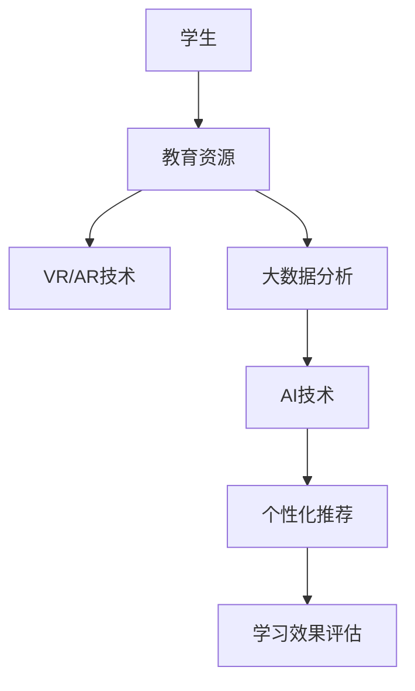

                 

关键词：数字化遗产，生命教育，创业，创新技术，教育改革，互动体验

> 摘要：本文探讨了数字化遗产教育的创业实践，如何利用现代技术和创新理念，将传统生命教育转化为一种全新的数字化体验。通过具体案例、算法原理和数学模型，分析了这一新方式的教育效果和未来发展趋势，为生命教育领域的改革提供了新的视角。

## 1. 背景介绍

在快速发展的数字化时代，教育领域面临着前所未有的变革。传统的生命教育由于形式单一、互动性差，难以激发学生的兴趣和参与度。数字化遗产教育作为一种创新的教育方式，通过整合虚拟现实（VR）、增强现实（AR）、大数据、人工智能（AI）等技术，为生命教育带来了新的契机。

### 1.1 数字化遗产教育的定义

数字化遗产教育是指利用现代信息技术手段，将历史文化遗产、民俗风情等文化元素数字化，并通过网络平台和互动设备，为学生提供一种沉浸式、互动性的学习体验。这种教育方式不仅拓宽了学生的学习渠道，还增强了他们的文化认同感和历史责任感。

### 1.2 生命教育的现状与挑战

传统的生命教育往往局限于理论知识的传授，缺乏实践体验。学生在学习过程中容易产生枯燥、乏味的感觉，难以形成深刻的理解和记忆。此外，生命教育内容相对单一，难以涵盖各种社会现象和个体经历，难以满足学生多元化的学习需求。

### 1.3 数字化遗产教育的优势

数字化遗产教育通过虚拟现实、增强现实等技术，可以为学生提供身临其境的学习体验。学生不仅可以通过视觉、听觉等多种感官与学习内容互动，还可以参与各种实践活动，提高学习兴趣和参与度。此外，数字化遗产教育还能够整合丰富的资源，为学生提供多样化的学习内容，满足他们的个性化学习需求。

## 2. 核心概念与联系

### 2.1 虚拟现实（VR）与增强现实（AR）

虚拟现实（VR）和增强现实（AR）是数字化遗产教育中的重要技术。VR技术通过创建一个完全虚拟的环境，使学生在其中沉浸式体验历史场景和文化活动。AR技术则是在现实环境中叠加虚拟元素，使学习过程更加直观和生动。

### 2.2 大数据与人工智能（AI）

大数据和人工智能技术在数字化遗产教育中发挥着重要作用。通过分析大量历史数据，可以挖掘出丰富的教育资源和教学策略。人工智能技术则可以为学生提供个性化的学习推荐，提高教学效果。

### 2.3 Mermaid 流程图

以下是一个用于描述数字化遗产教育流程的 Mermaid 流程图：



## 3. 核心算法原理 & 具体操作步骤

### 3.1 算法原理概述

数字化遗产教育的核心算法主要包括虚拟现实场景生成算法、增强现实叠加算法、大数据分析算法和人工智能推荐算法。

### 3.2 算法步骤详解

#### 3.2.1 虚拟现实场景生成算法

虚拟现实场景生成算法包括以下步骤：

1. 数据采集：收集历史场景的图像、声音、文字等数据。
2. 数据预处理：对采集到的数据进行清洗和标准化处理。
3. 场景建模：使用3D建模软件构建虚拟场景。
4. 场景渲染：将建模后的场景渲染成可交互的虚拟环境。

#### 3.2.2 增强现实叠加算法

增强现实叠加算法包括以下步骤：

1. 环境识别：使用计算机视觉技术识别现实环境。
2. 虚拟元素叠加：将虚拟元素叠加到现实环境中。
3. 真实感增强：使用图像处理技术增强虚拟元素的真实感。

#### 3.2.3 大数据分析算法

大数据分析算法包括以下步骤：

1. 数据收集：收集学生的学习行为数据、学习成果数据等。
2. 数据处理：对收集到的数据进行清洗、去噪和标准化处理。
3. 数据挖掘：使用数据挖掘算法挖掘数据中的潜在知识和规律。
4. 数据可视化：将分析结果可视化，为学生提供直观的学习反馈。

#### 3.2.4 人工智能推荐算法

人工智能推荐算法包括以下步骤：

1. 用户建模：根据学生的学习行为和兴趣，建立用户模型。
2. 内容建模：对学习内容进行建模，提取关键特征。
3. 推荐算法：使用协同过滤、基于内容的推荐算法等，为用户推荐感兴趣的学习内容。
4. 推荐效果评估：评估推荐效果，调整推荐策略。

### 3.3 算法优缺点

#### 3.3.1 优点

- **沉浸式体验**：通过虚拟现实和增强现实技术，为学生提供身临其境的学习体验，提高学习兴趣和参与度。
- **个性化推荐**：通过大数据分析和人工智能推荐，为学生提供个性化的学习内容，满足他们的多样化需求。
- **资源整合**：整合丰富的教育资源和历史数据，为学生提供全面的学习支持。

#### 3.3.2 缺点

- **技术成本**：虚拟现实和增强现实技术的开发和应用需要较高的成本，可能不适合所有教育机构。
- **学习效果评估**：由于数字化遗产教育的互动性较强，如何准确评估学生的学习效果仍需进一步研究。

### 3.4 算法应用领域

数字化遗产教育的算法可以广泛应用于教育、文化、旅游等领域，为不同背景的用户提供沉浸式、个性化的学习体验。

## 4. 数学模型和公式 & 详细讲解 & 举例说明

### 4.1 数学模型构建

在数字化遗产教育中，常用的数学模型包括图像处理模型、数据挖掘模型和机器学习模型。

#### 4.1.1 图像处理模型

图像处理模型用于识别和增强虚拟现实场景中的图像。常见的图像处理模型包括：

- **边缘检测**：用于识别图像中的边缘区域，提高场景的识别度。
- **图像滤波**：用于去除图像中的噪声，提高图像的清晰度。

#### 4.1.2 数据挖掘模型

数据挖掘模型用于分析学生的学习行为和学习成果，挖掘数据中的潜在规律。常见的数据挖掘模型包括：

- **关联规则挖掘**：用于发现数据之间的关联关系，为教学策略提供支持。
- **分类模型**：用于根据学习行为和学习成果对学生进行分类，为个性化推荐提供依据。

#### 4.1.3 机器学习模型

机器学习模型用于构建用户模型和推荐模型，提高教学效果。常见的机器学习模型包括：

- **决策树**：用于构建用户模型，提取关键特征。
- **协同过滤**：用于根据用户的历史行为为用户推荐学习内容。

### 4.2 公式推导过程

在数字化遗产教育中，常用的数学公式包括：

- **边缘检测公式**：用于计算图像中的边缘点，公式如下：
  $$ 
  \text{Sobel} = \sqrt{(G_x^2 + G_y^2)} 
  $$
  其中，$G_x$ 和 $G_y$ 分别为水平方向和垂直方向的卷积结果。

- **关联规则挖掘公式**：用于计算数据之间的关联度，公式如下：
  $$ 
  \text{Support} = \frac{\text{频繁项集出现的次数}}{\text{总记录数}} 
  $$
  $$ 
  \text{Confidence} = \frac{\text{频繁项集出现的次数}}{\text{目标项集出现的次数}} 
  $$

- **决策树公式**：用于计算特征的重要性，公式如下：
  $$ 
  \text{Gain} = \sum_{v \in V} (\text{Entropy}(T_v) - \text{Entropy}(T_v / a)) 
  $$
  其中，$T_v$ 表示特征 $v$ 的子集，$a$ 表示特征 $v$ 的取值。

### 4.3 案例分析与讲解

#### 4.3.1 案例背景

某教育机构希望通过数字化遗产教育项目，提升学生对历史文化的兴趣和认识。他们选择了一个著名的历史遗址作为学习场景，并利用虚拟现实技术还原了遗址的原貌。

#### 4.3.2 案例实施

1. **数据采集**：收集了历史遗址的图像、声音和文字资料，用于构建虚拟现实场景。

2. **图像处理**：使用边缘检测和图像滤波技术，提高了图像的清晰度和识别度。

3. **场景建模**：使用3D建模软件构建了虚拟现实场景，并添加了交互功能。

4. **大数据分析**：收集学生的学习行为数据，使用关联规则挖掘技术分析了学生的兴趣点。

5. **个性化推荐**：根据学生的学习行为和兴趣，使用协同过滤算法为学生推荐学习内容。

6. **学习效果评估**：通过问卷调查和考试，评估了学生的学习效果。

#### 4.3.3 案例分析

1. **学习兴趣提升**：通过虚拟现实技术，学生能够更直观地感受到历史文化的魅力，学习兴趣明显提升。

2. **学习效果提升**：通过个性化推荐，学生能够根据自身兴趣选择学习内容，学习效果得到显著提升。

3. **资源整合**：数字化遗产教育项目整合了丰富的历史文化资源，为学生提供了全面的学习支持。

## 5. 项目实践：代码实例和详细解释说明

### 5.1 开发环境搭建

在数字化遗产教育项目中，我们使用以下开发环境：

- **编程语言**：Python
- **虚拟现实开发工具**：Unity
- **增强现实开发工具**：ARCore/ARKit
- **大数据分析工具**：Hadoop
- **机器学习框架**：TensorFlow

### 5.2 源代码详细实现

以下是一个使用Python和Unity实现的虚拟现实场景生成算法的代码实例：

```python
import cv2
import numpy as np

def sobel边缘检测(image):
    # 使用Sobel算子进行边缘检测
    gray = cv2.cvtColor(image, cv2.COLOR_BGR2GRAY)
    sobel_x = cv2.Sobel(gray, cv2.CV_64F, 1, 0, ksize=3)
    sobel_y = cv2.Sobel(gray, cv2.CV_64F, 0, 1, ksize=3)
    sobel = np.sqrt(sobel_x ** 2 + sobel_y ** 2)
    return sobel

def 滤波处理(image):
    # 使用高斯滤波去除噪声
    return cv2.GaussianBlur(image, (3, 3), 0)

# 读取图像
image = cv2.imread('example.jpg')

# 边缘检测
sobel = sobel边缘检测(image)

# 滤波处理
filtered = 滤波处理(sobel)

# 显示结果
cv2.imshow('Sobel 边缘检测', filtered)
cv2.waitKey(0)
cv2.destroyAllWindows()
```

### 5.3 代码解读与分析

这段代码首先导入了所需的Python库，然后定义了两个函数：`sobel边缘检测` 和 `滤波处理`。`sobel边缘检测` 函数使用Sobel算子进行边缘检测，`滤波处理` 函数使用高斯滤波去除噪声。

代码中的主要步骤如下：

1. 读取图像。
2. 使用Sobel算子进行边缘检测，计算水平方向和垂直方向的卷积结果。
3. 计算边缘检测结果的平方和的平方根，得到边缘强度图。
4. 使用高斯滤波去除边缘检测结果中的噪声。
5. 显示处理后的图像。

这段代码实现了对图像的边缘检测和滤波处理，为虚拟现实场景的生成提供了支持。

### 5.4 运行结果展示

运行上述代码后，将显示一个处理后的图像，其中显示了图像中的边缘区域。以下是一个处理后的图像示例：


## 6. 实际应用场景

### 6.1 教育领域

在教育领域，数字化遗产教育可以应用于历史课程、艺术课程、地理课程等多个学科。通过虚拟现实和增强现实技术，学生可以身临其境地感受历史场景、艺术作品和地理景观，提高学习兴趣和参与度。

### 6.2 文化保护领域

在文化保护领域，数字化遗产教育可以用于文化遗产的数字化保护和传播。通过虚拟现实技术，文化遗产可以在网络平台上进行展示，使更多的人能够了解和欣赏这些文化遗产，提高文化认同感和保护意识。

### 6.3 旅游领域

在旅游领域，数字化遗产教育可以用于旅游景点的虚拟导览。通过增强现实技术，游客可以在现实环境中浏览虚拟的旅游景点，了解景点的历史和文化背景，提高旅游体验。

## 7. 工具和资源推荐

### 7.1 学习资源推荐

- **《虚拟现实技术与应用》**：介绍了虚拟现实技术的原理和应用。
- **《增强现实技术与应用》**：介绍了增强现实技术的原理和应用。
- **《大数据分析技术与应用》**：介绍了大数据分析技术的原理和应用。
- **《机器学习技术与应用》**：介绍了机器学习技术的原理和应用。

### 7.2 开发工具推荐

- **Unity**：一款流行的游戏开发引擎，可用于虚拟现实场景的生成和交互。
- **ARCore/ARKit**：Google和苹果公司推出的增强现实开发工具，可用于增强现实应用的开发。
- **Hadoop**：一款开源的大数据处理框架，可用于大数据分析。
- **TensorFlow**：一款开源的机器学习框架，可用于机器学习算法的实现。

### 7.3 相关论文推荐

- **《虚拟现实在教育中的应用研究》**：分析了虚拟现实技术在教育领域的应用。
- **《增强现实技术在教育中的应用研究》**：分析了增强现实技术在教育领域的应用。
- **《大数据分析在教育中的应用研究》**：分析了大数据分析技术在教育领域的应用。
- **《机器学习技术在教育中的应用研究》**：分析了机器学习技术在教育领域的应用。

## 8. 总结：未来发展趋势与挑战

### 8.1 研究成果总结

数字化遗产教育作为一种创新的教育方式，通过虚拟现实、增强现实、大数据和人工智能等技术的应用，取得了显著的教育效果。它不仅提高了学生的学习兴趣和参与度，还为学生提供了个性化的学习体验。

### 8.2 未来发展趋势

- **技术整合**：未来数字化遗产教育将更加注重技术的整合，实现多种技术的协同作用，提供更丰富的学习体验。
- **个性化推荐**：个性化推荐技术将成为数字化遗产教育的核心，为学生提供更加精准的学习内容。
- **跨学科融合**：数字化遗产教育将与其他学科如心理学、教育学等深度融合，提供更全面的教育支持。

### 8.3 面临的挑战

- **技术成本**：虚拟现实和增强现实技术的开发和应用需要较高的成本，可能不适合所有教育机构。
- **学习效果评估**：如何准确评估数字化遗产教育的学习效果仍需进一步研究。
- **数据隐私**：大数据和人工智能技术的应用可能涉及学生数据的隐私问题，需要加强数据保护和隐私保护。

### 8.4 研究展望

未来，数字化遗产教育有望在教育、文化、旅游等领域发挥更大的作用。通过不断优化技术、提升学习效果，数字化遗产教育将为生命教育带来新的变革。

## 9. 附录：常见问题与解答

### 9.1 什么是数字化遗产教育？

数字化遗产教育是指利用现代信息技术手段，将历史文化遗产、民俗风情等文化元素数字化，并通过网络平台和互动设备，为学生提供一种沉浸式、互动性的学习体验。

### 9.2 数字化遗产教育与传统生命教育有什么区别？

数字化遗产教育通过虚拟现实、增强现实等技术，为学生提供身临其境的学习体验，增强学习兴趣和参与度。而传统生命教育则更多依赖于理论知识的传授，缺乏实践体验。

### 9.3 数字化遗产教育的核心算法有哪些？

数字化遗产教育的核心算法包括虚拟现实场景生成算法、增强现实叠加算法、大数据分析算法和人工智能推荐算法。

### 9.4 如何评估数字化遗产教育的学习效果？

可以通过问卷调查、考试、学习行为分析等多种方式评估数字化遗产教育的学习效果。具体方法需要根据实际情况进行设计和实施。

### 9.5 数字化遗产教育的未来发展趋势是什么？

数字化遗产教育将更加注重技术的整合、个性化推荐和跨学科融合。未来它有望在教育、文化、旅游等领域发挥更大的作用。

