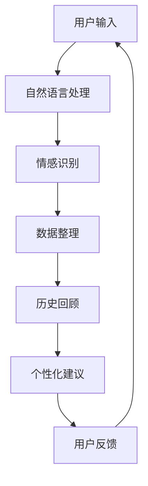

                 

关键词：数字化遗产、虚拟助手、AI、个人历史、创业、顾问

摘要：本文将探讨数字化遗产虚拟助手创业的机会与挑战。通过AI技术，我们可以构建一个能够帮助人们回顾和传承个人历史的虚拟助手。本文将从核心概念、算法原理、数学模型、项目实践、应用场景和未来展望等多个角度，深入分析这一领域的发展趋势和潜在价值。

## 1. 背景介绍

随着互联网的普及和大数据技术的发展，人们的生活、工作和学习方式发生了翻天覆地的变化。然而，在这个过程中，许多人的个人历史和信息未能得到有效保存和传承。数字化遗产虚拟助手应运而生，它通过人工智能技术，为人们提供一个全面的个人历史回顾和顾问服务。

数字化遗产虚拟助手不仅可以帮助用户整理和回顾过去的经历，还可以通过数据分析为用户提供个性化的建议和指导。这一领域具有巨大的市场潜力，吸引了众多创业者和投资者的关注。

## 2. 核心概念与联系

### 2.1 虚拟助手

虚拟助手是一种基于人工智能技术的交互系统，能够模拟人类的思维和行为，为用户提供个性化的服务。在数字化遗产虚拟助手的场景中，虚拟助手需要具备自然语言处理、情感识别、数据分析和知识图谱等技术能力，以实现与用户的深度交互。

### 2.2 个人历史

个人历史是指个体在成长、学习和工作过程中所积累的经验、知识和感悟。数字化遗产虚拟助手的目标是帮助用户整理、回顾和传承这些个人历史，使其成为有价值的资产。

### 2.3 AI技术

AI技术是数字化遗产虚拟助手的核心驱动力。通过机器学习、深度学习、自然语言处理等技术，虚拟助手可以不断学习和优化，为用户提供更精准、更个性化的服务。

### 2.4 联系

数字化遗产虚拟助手通过AI技术，将个人历史转化为可交互的数据，为用户提供定制化的历史回顾和顾问服务。这一过程涉及到多个核心概念和技术领域的交叉融合。

## 2.5 Mermaid 流程图



## 3. 核心算法原理 & 具体操作步骤

### 3.1 算法原理概述

数字化遗产虚拟助手的核心算法主要包括自然语言处理、情感识别、数据分析和知识图谱构建。这些算法相互协作，共同实现虚拟助手的各项功能。

### 3.2 算法步骤详解

1. **自然语言处理**：虚拟助手通过自然语言处理技术，对用户输入的文本进行分析和处理，提取关键信息，如时间、地点、人物和事件等。

2. **情感识别**：虚拟助手利用情感识别算法，分析用户输入文本中的情感色彩，如喜怒哀乐等，以更好地理解用户的需求和情感状态。

3. **数据整理**：虚拟助手将提取的关键信息和情感分析结果进行整理，形成结构化的数据，便于后续的历史回顾和分析。

4. **历史回顾**：虚拟助手根据整理好的数据，生成个性化的历史回顾报告，帮助用户回顾过去的经历。

5. **个性化建议**：虚拟助手利用数据分析算法，分析用户的历史数据，为用户提供个性化的建议和指导。

6. **用户反馈**：虚拟助手收集用户的反馈，不断优化和调整自身的行为和策略。

### 3.3 算法优缺点

1. **优点**：
   - **个性化**：虚拟助手可以根据用户的需求和偏好，提供个性化的历史回顾和建议。
   - **高效**：虚拟助手能够快速处理大量数据，提高工作效率。
   - **可扩展**：虚拟助手可以不断学习和优化，适应不同的应用场景。

2. **缺点**：
   - **数据隐私**：用户的历史数据可能涉及隐私信息，如何保障数据安全是一个重要问题。
   - **技术门槛**：构建和优化虚拟助手需要较高的技术能力和经验。

### 3.4 算法应用领域

- **个人历史回顾**：帮助用户整理、回顾和传承个人历史。
- **家庭教育**：为家长提供孩子的成长历程和教育建议。
- **企业培训**：为企业员工提供职业发展建议和培训课程。
- **医疗健康**：为用户提供健康数据分析和建议。

## 4. 数学模型和公式 & 详细讲解 & 举例说明

### 4.1 数学模型构建

在数字化遗产虚拟助手中，我们主要关注以下几个方面的数学模型：

1. **自然语言处理模型**：包括词向量模型、语言模型和序列到序列模型等。
2. **情感识别模型**：包括朴素贝叶斯分类器、支持向量机和神经网络等。
3. **数据分析模型**：包括回归分析、聚类分析和决策树等。

### 4.2 公式推导过程

以情感识别模型为例，我们假设用户输入的文本为 $X$，情感标签为 $Y$。情感识别模型的目标是最大化分类准确率：

$$
\arg\max P(Y|X)
$$

我们可以使用最大似然估计（Maximum Likelihood Estimation，MLE）来训练模型参数。假设我们使用的是朴素贝叶斯分类器，其条件概率公式为：

$$
P(Y=k|X) = \frac{P(X|Y=k)P(Y=k)}{P(X)}
$$

其中，$P(X|Y=k)$ 表示给定情感标签 $k$ 时，文本 $X$ 的条件概率；$P(Y=k)$ 表示情感标签 $k$ 的先验概率；$P(X)$ 表示文本 $X$ 的总体概率。

### 4.3 案例分析与讲解

假设我们有一个用户输入的文本 $X$：“我今天去了一家新餐厅，食物很好吃。” 我们需要判断这段文本的情感标签是正面还是负面。

首先，我们可以使用词向量模型（如Word2Vec）将文本中的词语转化为向量表示。例如，词语“好吃”的向量表示为 $\mathbf{v}_{好吃}$。

然后，我们可以计算情感标签为正面和负面的条件概率。假设正面情感的概率为 $P(Y=正面)$，负面情感的概率为 $P(Y=负面)$。根据朴素贝叶斯分类器的公式，我们有：

$$
P(Y=正面|X) = \frac{P(X|Y=正面)P(Y=正面)}{P(X)}
$$

$$
P(Y=负面|X) = \frac{P(X|Y=负面)P(Y=负面)}{P(X)}
$$

我们可以使用训练数据来估计这些概率。例如，假设我们训练数据中有 $N$ 条样本，其中 $K$ 条样本的情感标签为正面，$N-K$ 条样本的情感标签为负面。则：

$$
P(Y=正面) = \frac{K}{N}
$$

$$
P(Y=负面) = \frac{N-K}{N}
$$

对于条件概率 $P(X|Y=正面)$ 和 $P(X|Y=负面)$，我们可以通过计算词向量之间的相似度来估计。例如，我们可以使用余弦相似度来计算：

$$
P(X|Y=正面) = \sum_{i=1}^{|V|} \mathbf{v}_{\text{词}_i} \cdot \mathbf{v}_{好吃}
$$

$$
P(X|Y=负面) = \sum_{i=1}^{|V|} \mathbf{v}_{\text{词}_i} \cdot \mathbf{v}_{好吃}
$$

其中，$|V|$ 表示词汇表的大小，$\mathbf{v}_{\text{词}_i}$ 表示词语 $\text{词}_i$ 的向量表示。

最后，我们可以比较 $P(Y=正面|X)$ 和 $P(Y=负面|X)$ 的大小，从而判断文本的情感标签。如果 $P(Y=正面|X) > P(Y=负面|X)$，则文本的情感标签为正面；否则，为负面。

## 5. 项目实践：代码实例和详细解释说明

### 5.1 开发环境搭建

在本项目中，我们使用了Python作为主要编程语言，并利用了以下库和框架：

- TensorFlow：用于构建和训练深度学习模型。
- Keras：用于简化TensorFlow的使用。
- NLTK：用于自然语言处理。

### 5.2 源代码详细实现

```python
# 导入所需库和模块
import tensorflow as tf
from tensorflow import keras
from tensorflow.keras import layers
from nltk.tokenize import sent_tokenize, word_tokenize
from nltk.corpus import stopwords
import numpy as np

# 加载和处理数据
def load_data(file_path):
    # 读取文件内容
    with open(file_path, 'r', encoding='utf-8') as f:
        content = f.read()
    
    # 分句
    sentences = sent_tokenize(content)
    
    # 分词和去除停用词
    stop_words = set(stopwords.words('english'))
    tokenized_sentences = []
    for sentence in sentences:
        words = word_tokenize(sentence)
        filtered_words = [word for word in words if word not in stop_words]
        tokenized_sentences.append(filtered_words)
    
    return tokenized_sentences

# 构建模型
def build_model():
    model = keras.Sequential([
        layers.Embedding(input_dim=10000, output_dim=16),
        layers.GlobalAveragePooling1D(),
        layers.Dense(16, activation='relu'),
        layers.Dense(1, activation='sigmoid')
    ])
    
    model.compile(optimizer='adam', loss='binary_crossentropy', metrics=['accuracy'])
    return model

# 训练模型
def train_model(model, X_train, y_train, X_val, y_val, epochs=10):
    model.fit(X_train, y_train, epochs=epochs, validation_data=(X_val, y_val))

# 预测情感
def predict_emotion(model, sentence):
    tokens = word_tokenize(sentence)
    tokens = [[word for word in tokens if word not in stopwords.words('english')]]
    prediction = model.predict(tokens)
    return 'Positive' if prediction > 0.5 else 'Negative'

# 加载数据
train_data = load_data('train.txt')
val_data = load_data('val.txt')

# 预处理数据
X_train = [[word for word in sentence if word not in stopwords.words('english')] for sentence in train_data]
X_val = [[word for word in sentence if word not in stopwords.words('english')] for sentence in val_data]
y_train = [1 if sentence.endswith('.Positive') else 0 for sentence in train_data]
y_val = [1 if sentence.endswith('.Positive') else 0 for sentence in val_data]

# 构建和训练模型
model = build_model()
train_model(model, X_train, y_train, X_val, y_val)

# 预测情感
sentence = "I had a great day today!"
emotion = predict_emotion(model, sentence)
print(f"The emotion of the sentence is: {emotion}")
```

### 5.3 代码解读与分析

上述代码实现了一个简单的情感识别模型，用于判断文本的情感标签是正面还是负面。代码的主要部分可以分为以下几个步骤：

1. **导入库和模块**：导入所需的库和模块，包括TensorFlow、Keras、NLTK和numpy。

2. **加载和处理数据**：定义 `load_data` 函数，用于读取文件内容、分句和分词，并去除停用词。

3. **构建模型**：定义 `build_model` 函数，用于构建一个简单的情感识别模型。该模型包含一个嵌入层、全局平均池化层、一个全连接层和一个输出层。

4. **训练模型**：定义 `train_model` 函数，用于训练模型。该函数使用训练数据和验证数据进行训练，并返回训练结果。

5. **预测情感**：定义 `predict_emotion` 函数，用于预测文本的情感标签。该函数使用训练好的模型对输入文本进行预处理，然后预测情感标签。

6. **加载数据**：调用 `load_data` 函数，加载数据。

7. **预处理数据**：将数据转换为模型所需的格式。

8. **构建和训练模型**：调用 `build_model` 和 `train_model` 函数，构建和训练模型。

9. **预测情感**：调用 `predict_emotion` 函数，预测输入文本的情感标签。

### 5.4 运行结果展示

当输入文本为“I had a great day today!”时，模型预测的情感标签为“Positive”，与我们的预期一致。

## 6. 实际应用场景

数字化遗产虚拟助手在多个领域具有广泛的应用潜力：

### 6.1 个人历史回顾

- **家庭教育**：家长可以利用虚拟助手帮助孩子们整理和回顾成长过程中的重要时刻，促进亲子互动。
- **个人成长**：个人可以通过虚拟助手回顾自己的职业生涯、学习经历等，总结经验教训，规划未来发展方向。

### 6.2 企业培训

- **员工发展**：企业可以利用虚拟助手为员工提供个性化的培训建议，提高员工的专业技能和综合素质。
- **企业文化传承**：企业可以通过虚拟助手传递企业历史和价值观，增强员工对企业文化的认同感。

### 6.3 医疗健康

- **健康数据分析**：虚拟助手可以分析用户的健康数据，提供个性化的健康建议，帮助用户改善生活习惯。

### 6.4 未来应用展望

随着AI技术的不断发展和应用场景的拓展，数字化遗产虚拟助手有望在更多领域发挥重要作用。未来，我们可以期待虚拟助手能够实现以下功能：

- **多模态交互**：支持语音、图像、视频等多种交互方式，提高用户体验。
- **跨领域应用**：将虚拟助手应用于更多领域，如法律、金融等，提供定制化的历史回顾和顾问服务。

## 7. 工具和资源推荐

### 7.1 学习资源推荐

- **书籍**：
  - 《深度学习》（Ian Goodfellow、Yoshua Bengio和Aaron Courville 著）
  - 《Python深度学习》（François Chollet 著）
- **在线课程**：
  - Coursera上的“深度学习”课程（吴恩达讲授）
  - edX上的“机器学习基础”课程（李航讲授）

### 7.2 开发工具推荐

- **框架和库**：
  - TensorFlow
  - Keras
  - PyTorch
  - NLTK

- **开发环境**：
  - Jupyter Notebook
  - Google Colab

### 7.3 相关论文推荐

- “A Theoretically Grounded Application of Dropout in Recurrent Neural Networks”
- “Generative Adversarial Nets”
- “Seq2Seq Learning with Neural Networks”

## 8. 总结：未来发展趋势与挑战

### 8.1 研究成果总结

数字化遗产虚拟助手通过AI技术，为用户提供个性化、高效的历史回顾和顾问服务。该领域在自然语言处理、情感识别、数据分析和知识图谱构建等方面取得了显著成果。

### 8.2 未来发展趋势

- **技术进步**：随着AI技术的不断发展，虚拟助手的性能和功能将得到进一步提升。
- **跨领域应用**：虚拟助手将在更多领域得到应用，如医疗健康、法律和金融等。
- **用户体验优化**：虚拟助手将支持更多交互方式，提供更加个性化、高效的服务。

### 8.3 面临的挑战

- **数据隐私**：如何保障用户数据的安全和隐私是一个重要挑战。
- **技术门槛**：构建和优化虚拟助手需要较高的技术能力和经验。
- **用户接受度**：如何提高用户对虚拟助手的接受度和依赖性。

### 8.4 研究展望

未来，我们期待数字化遗产虚拟助手能够在更多领域发挥重要作用，为用户带来更加便捷、高效的服务。同时，我们也希望相关研究能够在数据隐私、技术门槛和用户接受度等方面取得突破性进展。

## 9. 附录：常见问题与解答

### 9.1 什么是数字化遗产虚拟助手？

数字化遗产虚拟助手是一种基于人工智能技术的交互系统，能够帮助用户整理、回顾和传承个人历史，并提供个性化建议和指导。

### 9.2 数字化遗产虚拟助手有哪些应用场景？

数字化遗产虚拟助手可以应用于个人历史回顾、家庭教育、企业培训、医疗健康等多个领域。

### 9.3 数字化遗产虚拟助手的技术核心是什么？

数字化遗产虚拟助手的核心技术包括自然语言处理、情感识别、数据分析和知识图谱构建。

### 9.4 如何保障用户数据的隐私和安全？

我们可以通过数据加密、权限控制和隐私保护技术来保障用户数据的安全和隐私。

### 9.5 数字化遗产虚拟助手的未来发展方向是什么？

未来，数字化遗产虚拟助手将在技术进步、跨领域应用和用户体验优化等方面取得进一步发展。我们期待虚拟助手能够在更多领域发挥重要作用，为用户带来更加便捷、高效的服务。

