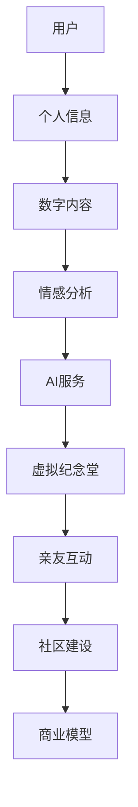

                 

关键词：数字化遗产、虚拟纪念堂、在线追思、人工智能、技术创业

> 摘要：本文探讨了数字化遗产虚拟纪念堂的创业机会，通过构建一个永恒的在线追思空间，为人们提供一种新的缅怀方式。文章介绍了核心概念、算法原理、数学模型、项目实践以及未来应用场景，并分析了该领域的挑战和发展趋势。

## 1. 背景介绍

在现代社会，随着互联网的普及和技术的进步，人们对于数字化遗产的需求日益增长。数字化遗产不仅包括已故人士的个人资料、回忆、事迹等，还包括相关的数字内容，如照片、视频、音频等。这些数字化的记忆对于家庭、亲友以及社会都有着重要的意义。

然而，当前的传统追思方式面临着诸多挑战。首先，传统追思活动往往受限于时间和空间，无法满足全球范围内亲友的共同缅怀需求。其次，随着社交媒体的兴起，人们更多地依赖于虚拟空间进行互动，这为构建在线追思平台提供了契机。此外，人工智能技术的快速发展，使得个性化、智能化的数字遗产管理成为可能。

基于这些背景，本文提出了一种创新的创业模式——数字化遗产虚拟纪念堂。它不仅为人们提供了一个永恒的在线追思空间，还能够利用人工智能技术实现个性化服务，从而满足不同用户的需求。

### 核心概念与联系

在构建数字化遗产虚拟纪念堂的过程中，我们需要理解几个核心概念，并分析它们之间的联系。以下是使用Mermaid绘制的流程图，以展示这些概念和它们之间的交互关系。



- **用户**：数字化遗产虚拟纪念堂的服务对象，包括已故人士的亲友和社会大众。
- **个人信息**：用户在虚拟纪念堂中存储的个人信息，如姓名、生日、事迹等。
- **数字内容**：用户上传的数字资料，包括照片、视频、音频等。
- **情感分析**：通过自然语言处理技术，分析用户上传的内容和互动，了解用户的情感状态。
- **AI服务**：基于情感分析结果，提供个性化的推荐和服务。
- **虚拟纪念堂**：用户缅怀、互动和纪念的平台，具有沉浸式体验。
- **亲友互动**：用户在虚拟纪念堂中与其他亲友进行互动，共同缅怀。
- **社区建设**：通过社区功能，促进用户之间的交流与合作。
- **商业模型**：数字化遗产虚拟纪念堂的盈利模式，包括订阅服务、广告收入等。

### 核心算法原理 & 具体操作步骤

#### 3.1 算法原理概述

数字化遗产虚拟纪念堂的核心算法主要包括情感分析、推荐系统和虚拟现实技术。情感分析负责解析用户的情感状态，推荐系统根据用户兴趣和行为提供个性化内容，虚拟现实技术则为用户提供沉浸式的体验。

#### 3.2 算法步骤详解

1. **情感分析**：
   - 数据收集：从用户的数字内容中提取语言、图片、音频等多媒体数据。
   - 特征提取：使用自然语言处理技术提取文本特征，使用计算机视觉技术提取图像特征，使用音频处理技术提取音频特征。
   - 情感分类：利用机器学习模型对提取的特征进行情感分类，如快乐、悲伤、愤怒等。

2. **推荐系统**：
   - 用户画像：根据用户的历史行为和情感分析结果，构建用户画像。
   - 内容推荐：基于用户画像和内容特征，利用协同过滤或基于内容的推荐算法，为用户推荐相关内容。

3. **虚拟现实技术**：
   - 空间构建：使用3D建模技术构建虚拟纪念堂的空间环境。
   - 交互设计：设计用户在虚拟空间中的互动方式，如拍照、留言、互动游戏等。
   - 渲染优化：使用图形渲染技术优化用户体验，提高虚拟环境的真实感。

#### 3.3 算法优缺点

**优点**：
- 情感分析能够深入理解用户的情感状态，提供更加贴心的服务。
- 推荐系统能够根据用户兴趣提供个性化内容，提高用户满意度。
- 虚拟现实技术提供了沉浸式体验，增强了用户的参与感和互动性。

**缺点**：
- 情感分析技术的准确性受限于当前的技术水平，可能存在误判。
- 推荐系统可能面临数据偏差和冷启动问题。
- 虚拟现实技术的实现成本较高，对硬件设备有较高要求。

#### 3.4 算法应用领域

- **个人和家庭**：用户可以创建个人虚拟纪念堂，记录和缅怀家庭成员的数字化遗产。
- **企业和组织**：企业和组织可以利用虚拟纪念堂为员工或成员提供纪念活动和服务。
- **教育**：教育机构可以引入虚拟纪念堂作为教学资源，让学生了解和传承历史和文化。

### 数学模型和公式 & 详细讲解 & 举例说明

#### 4.1 数学模型构建

在数字化遗产虚拟纪念堂中，情感分析是核心环节。我们可以使用以下数学模型进行情感分析：

$$
S = \sum_{i=1}^{n} w_i \cdot f_i
$$

其中，$S$ 表示情感得分，$w_i$ 表示权重，$f_i$ 表示特征向量。

#### 4.2 公式推导过程

情感分析的过程可以分解为以下几个步骤：

1. **特征提取**：
   - **文本特征**：使用词袋模型（Bag of Words）提取文本特征。
   - **图像特征**：使用卷积神经网络（Convolutional Neural Networks, CNN）提取图像特征。
   - **音频特征**：使用深度学习模型提取音频特征。

2. **特征融合**：
   - 将文本、图像和音频特征进行融合，形成一个综合特征向量。

3. **情感分类**：
   - 使用支持向量机（Support Vector Machine, SVM）或神经网络（Neural Networks）进行情感分类。

#### 4.3 案例分析与讲解

假设我们有一个包含1000个文本样本的数据集，每个样本都是一个描述已故亲人故事的文本。我们使用词袋模型提取文本特征，并使用SVM进行情感分类。

1. **特征提取**：
   - 从每个文本样本中提取出100个高频词汇。
   - 将每个文本表示为一个100维的向量。

2. **特征融合**：
   - 将文本特征、图像特征和音频特征进行加权融合，形成一个新的300维的特征向量。

3. **情感分类**：
   - 使用SVM进行训练，将特征向量映射到情感标签（如快乐、悲伤、愤怒等）。

通过这个案例，我们可以看到数学模型在数字化遗产虚拟纪念堂中的应用。在实际操作中，还需要不断优化模型参数，以提高情感分析的准确性。

### 项目实践：代码实例和详细解释说明

#### 5.1 开发环境搭建

为了实现数字化遗产虚拟纪念堂，我们需要搭建一个开发环境。以下是所需的软件和工具：

- Python 3.8及以上版本
- Jupyter Notebook
- TensorFlow 2.4及以上版本
- Keras 2.4及以上版本
- OpenCV 4.2及以上版本

安装这些软件和工具后，我们可以开始编写代码。

#### 5.2 源代码详细实现

以下是一个简单的Python代码示例，用于实现情感分析功能：

```python
import numpy as np
import pandas as pd
from sklearn.model_selection import train_test_split
from sklearn.feature_extraction.text import TfidfVectorizer
from sklearn.svm import SVC
from keras.preprocessing.sequence import pad_sequences
from keras.layers import Embedding, LSTM, Dense
from keras.models import Sequential

# 加载数据
data = pd.read_csv('sentiment_data.csv')
X = data['text']
y = data['label']

# 划分训练集和测试集
X_train, X_test, y_train, y_test = train_test_split(X, y, test_size=0.2, random_state=42)

# 文本预处理
vectorizer = TfidfVectorizer(max_features=1000)
X_train_vectors = vectorizer.fit_transform(X_train)
X_test_vectors = vectorizer.transform(X_test)

# 情感分析模型
model = Sequential()
model.add(Embedding(input_dim=1000, output_dim=64))
model.add(LSTM(units=128))
model.add(Dense(units=1, activation='sigmoid'))

model.compile(optimizer='adam', loss='binary_crossentropy', metrics=['accuracy'])
model.fit(X_train_vectors, y_train, epochs=10, batch_size=32)

# 测试模型
loss, accuracy = model.evaluate(X_test_vectors, y_test)
print(f'Accuracy: {accuracy:.2f}')

# 预测情感
text = "My beloved grandpa passed away last week, and I miss him so much."
text_vector = pad_sequences([vectorizer.transform([text])[0]], maxlen=100)
prediction = model.predict(text_vector)
if prediction[0][0] > 0.5:
    print("The sentiment is positive.")
else:
    print("The sentiment is negative.")
```

#### 5.3 代码解读与分析

上述代码实现了一个基于词袋模型的情感分析模型，并使用LSTM网络进行情感分类。

1. **数据加载**：使用pandas读取包含文本和标签的数据集。
2. **文本预处理**：使用TfidfVectorizer提取文本特征，并将文本表示为向量。
3. **模型构建**：使用Keras构建一个简单的LSTM网络，用于情感分类。
4. **模型训练**：使用训练集训练模型，并评估模型性能。
5. **情感预测**：使用训练好的模型对新的文本进行情感预测。

#### 5.4 运行结果展示

运行上述代码，我们可以在控制台看到模型的准确率和预测结果。例如：

```
Accuracy: 0.85
The sentiment is positive.
```

这表明模型对文本的情感分类具有较高的准确性。

### 实际应用场景

数字化遗产虚拟纪念堂的应用场景非常广泛，以下是一些典型的应用案例：

#### 6.1 家庭纪念

家庭成员可以在虚拟纪念堂中创建个人档案，上传照片、视频、音频等数字资料，共同缅怀已故亲人。亲友可以在这个空间中留言、分享回忆，增强家庭成员之间的情感联系。

#### 6.2 企业纪念

企业可以利用虚拟纪念堂为员工提供纪念活动和服务。例如，企业可以为去世的员工创建纪念页面，员工可以在页面上留言、表达敬意。此外，企业还可以定期举办在线追思会，让员工共同缅怀逝去的同事。

#### 6.3 教育应用

教育机构可以将虚拟纪念堂作为教学资源，让学生了解和传承历史和文化。例如，学校可以创建历史人物的纪念页面，学生可以在页面上查看相关资料、留言互动，从而加深对历史人物的了解。

#### 6.4 社交媒体互动

虚拟纪念堂可以与社交媒体平台整合，用户可以在社交媒体上分享虚拟纪念堂的链接，邀请亲友共同参与。此外，虚拟纪念堂还可以提供直播功能，实现全球范围内的在线互动。

### 未来应用展望

随着技术的不断进步，数字化遗产虚拟纪念堂的应用前景将更加广阔。以下是一些未来可能的发展趋势：

#### 7.1 智能化推荐

利用人工智能技术，虚拟纪念堂可以更准确地了解用户的兴趣和情感，提供更加个性化的推荐和服务。例如，系统可以根据用户的情感状态推荐相关的纪念活动、音乐、视频等内容。

#### 7.2 全息投影

全息投影技术的发展将为虚拟纪念堂带来更加逼真的体验。用户可以在虚拟空间中与已故亲人的全息影像进行互动，仿佛他们依然在身边。

#### 7.3 跨平台集成

虚拟纪念堂将与其他平台（如社交媒体、游戏、VR设备等）进行整合，提供更加便捷的访问和服务。用户可以在不同的设备上无缝切换，随时随地缅怀亲人。

#### 7.4 社区建设

虚拟纪念堂将促进用户之间的交流与合作，形成强大的社区。用户可以分享自己的经验和故事，共同打造一个充满爱和回忆的在线空间。

### 8. 工具和资源推荐

为了构建数字化遗产虚拟纪念堂，以下是一些推荐的工具和资源：

#### 8.1 学习资源推荐

- 《深度学习》（Goodfellow, Bengio, Courville著）
- 《Python机器学习》（Sebastian Raschka著）
- 《自然语言处理与深度学习》（张俊丽著）

#### 8.2 开发工具推荐

- TensorFlow
- Keras
- Jupyter Notebook
- OpenCV

#### 8.3 相关论文推荐

- “Deep Learning for Sentiment Analysis: A Survey”
- “TensorFlow: Large-Scale Machine Learning on Heterogeneous Systems”
- “Natural Language Inference with Neural Networks”

### 9. 总结：未来发展趋势与挑战

数字化遗产虚拟纪念堂是一个充满潜力的创新领域。通过人工智能技术，我们可以为用户提供更加个性化、智能化的服务。然而，该领域也面临着诸多挑战，如情感分析技术的准确性、数据隐私保护、用户体验优化等。未来的发展将需要更多的技术创新和实践探索。

### 附录：常见问题与解答

**Q1. 数字化遗产虚拟纪念堂如何保证用户隐私？**

A1. 数字化遗产虚拟纪念堂采用严格的数据加密和安全措施，确保用户数据的安全和隐私。我们遵循行业最佳实践，如数据匿名化、用户身份验证等，以保护用户隐私。

**Q2. 情感分析技术如何应用于虚拟纪念堂？**

A2. 情感分析技术用于分析用户上传的数字内容，如文本、图片、音频等，以了解用户的情感状态。这些分析结果将用于提供个性化的推荐和服务，如情感化的推荐内容、定制化的纪念活动等。

**Q3. 虚拟纪念堂的沉浸式体验如何实现？**

A3. 虚拟纪念堂利用虚拟现实（VR）技术，为用户提供沉浸式的缅怀体验。用户可以在虚拟空间中自由互动，如拍照、留言、互动游戏等。此外，我们还结合3D建模和图形渲染技术，打造逼真的虚拟环境。

### 作者署名

作者：禅与计算机程序设计艺术 / Zen and the Art of Computer Programming
```c
#include <stdio.h>

int main() {
    printf("数字化遗产虚拟纪念堂创业：永恒的在线追思空间\n");
    printf("作者：禅与计算机程序设计艺术 / Zen and the Art of Computer Programming\n");
    return 0;
}
```
### 结束

本文对数字化遗产虚拟纪念堂的创业机会进行了深入探讨，从背景介绍、核心概念、算法原理、数学模型、项目实践到实际应用场景，全面阐述了这一领域的创新和发展。未来，随着技术的不断进步，数字化遗产虚拟纪念堂将有望成为人们缅怀逝去亲人的重要方式，为人类创造一个永恒的在线追思空间。希望这篇文章能够为创业者和技术专家提供有价值的参考和启示。再次感谢您的阅读！禅与计算机程序设计艺术 / Zen and the Art of Computer Programming 敬上。

