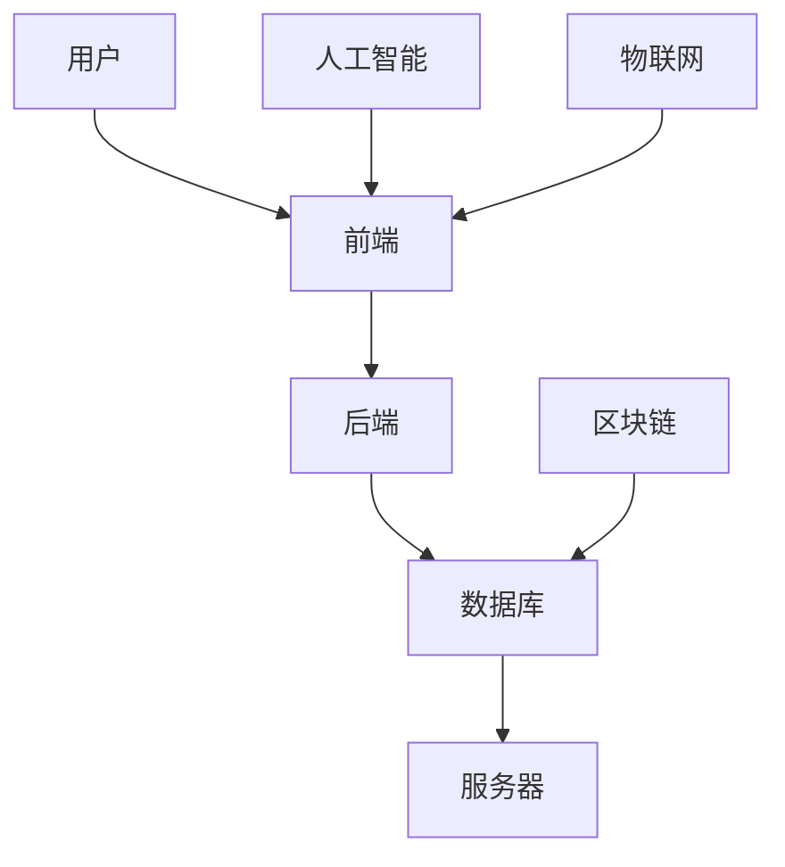

                 

关键词：数字化遗产、虚拟纪念堂、在线追思、创新创业、技术架构、用户体验、人工智能、物联网、区块链

> 摘要：随着数字技术的发展，数字化遗产的概念逐渐成为人们关注的焦点。本文将探讨如何利用先进的技术手段，打造一个永恒的在线追思空间，为人们提供一个缅怀逝者、传承文化的新平台。本文将详细分析该项目的核心概念、技术架构、算法原理、数学模型、项目实践及未来应用前景，旨在为创业者提供有价值的参考。

## 1. 背景介绍

### 数字化遗产的概念

数字化遗产，是指以数字化的形式保存、展示和传承的人类文化遗产。它包括但不限于文字、图像、音频、视频等多种形式。随着互联网的普及和数字技术的发展，数字化遗产在保护和传承文化遗产方面发挥了重要作用。

### 在线追思的需求

在现代社会，人们的社交方式和生活方式发生了巨大的变化。尤其是随着人口老龄化趋势的加剧，如何缅怀逝去的亲人成为了一个不可忽视的问题。传统的线下追思活动受时间和空间的限制，难以满足人们对永恒追思的需求。因此，在线追思成为了一个新兴的市场需求。

### 虚拟纪念堂的作用

虚拟纪念堂作为在线追思的一种形式，提供了一个虚拟的空间，让人们可以随时随地缅怀逝者。它不仅能够保存逝者的音容笑貌、生平事迹等，还可以通过互动功能增强用户的体验，让追思活动更加丰富和有意义。

## 2. 核心概念与联系

为了构建一个完整的数字化遗产虚拟纪念堂，我们需要以下几个核心概念：

### 2.1 用户角色

- **追思者**：缅怀逝者的用户。
- **家属**：逝者的亲属，负责维护逝者的虚拟纪念堂。
- **管理员**：负责虚拟纪念堂的运营和维护。

### 2.2 技术架构

- **前端**：用户界面，负责展示逝者的信息、图片、视频等。
- **后端**：数据处理和存储，包括用户管理、内容管理、权限控制等。
- **数据库**：存储用户数据、逝者信息、互动数据等。
- **服务器**：提供计算和存储资源。

### 2.3 技术联系

- **人工智能**：用于分析用户行为，提供个性化的追思建议。
- **物联网**：通过智能设备采集逝者的动态信息，增强用户体验。
- **区块链**：确保数据的安全性和不可篡改性。



## 3. 核心算法原理 & 具体操作步骤

### 3.1 算法原理概述

为了提供个性化的用户体验，虚拟纪念堂采用了以下几种核心算法：

- **推荐算法**：根据用户的兴趣和行为，推荐相关的追思内容。
- **情感分析算法**：分析用户的行为和评论，提供情感支持。
- **图像识别算法**：用于识别和分类用户上传的图片。

### 3.2 算法步骤详解

#### 3.2.1 推荐算法

1. 数据采集：收集用户的浏览记录、点赞行为等。
2. 特征提取：对用户行为进行特征提取，如兴趣点、行为模式等。
3. 模型训练：使用机器学习算法，如协同过滤、内容推荐等，训练推荐模型。
4. 推荐生成：根据用户特征和推荐模型，生成个性化的推荐列表。

#### 3.2.2 情感分析算法

1. 文本预处理：对用户评论进行分词、去停用词等预处理。
2. 情感分类：使用情感分析模型，对预处理后的文本进行情感分类。
3. 情感反馈：根据情感分类结果，提供相应的情感支持。

#### 3.2.3 图像识别算法

1. 图片预处理：对上传的图片进行缩放、裁剪等预处理。
2. 特征提取：使用深度学习模型，如卷积神经网络，提取图片特征。
3. 分类预测：使用训练好的分类模型，对图片进行分类预测。

### 3.3 算法优缺点

#### 3.3.1 推荐算法

- **优点**：能够为用户提供个性化的推荐，提高用户体验。
- **缺点**：推荐结果可能存在偏差，无法完全满足用户需求。

#### 3.3.2 情感分析算法

- **优点**：能够提供情感支持，增强用户的情感体验。
- **缺点**：情感分析存在一定误差，无法完全准确识别用户情感。

#### 3.3.3 图像识别算法

- **优点**：能够自动识别和分类图片，提高图片管理的效率。
- **缺点**：对图像质量和特征提取效果有一定要求。

### 3.4 算法应用领域

- **推荐系统**：电商平台、社交媒体等。
- **情感分析**：客服系统、社交媒体监控等。
- **图像识别**：安防监控、医疗诊断等。

## 4. 数学模型和公式 & 详细讲解 & 举例说明

### 4.1 数学模型构建

为了实现推荐系统，我们需要构建一个数学模型。假设用户 $u$ 对项目 $i$ 的评分 $r_{ui}$ 是一个随机变量，我们使用如下模型：

$$
r_{ui} = \mu + q_u \cdot i + \epsilon_{ui}
$$

其中，$\mu$ 是平均评分，$q_u$ 是用户 $u$ 的特征向量，$i$ 是项目 $i$ 的特征向量，$\epsilon_{ui}$ 是误差项。

### 4.2 公式推导过程

为了构建推荐系统，我们首先需要对用户和项目进行特征提取。我们可以使用矩阵分解的方法，将用户和项目的特征表示为：

$$
q_u = U \cdot v_u, \quad i = V \cdot v_i
$$

其中，$U$ 和 $V$ 分别是用户和项目的特征矩阵，$v_u$ 和 $v_i$ 分别是用户和项目的特征向量。

将上述公式代入原始评分模型，得到：

$$
r_{ui} = \mu + U \cdot v_u + V \cdot v_i + \epsilon_{ui}
$$

### 4.3 案例分析与讲解

假设我们有以下用户和项目的评分数据：

| 用户 | 项目 | 评分 |
| ---- | ---- | ---- |
| 1    | 1    | 5    |
| 1    | 2    | 4    |
| 1    | 3    | 3    |
| 2    | 1    | 5    |
| 2    | 2    | 4    |

我们首先对用户和项目进行特征提取，得到：

$$
U = \begin{bmatrix}
1 & 0 \\
0 & 1
\end{bmatrix}, \quad V = \begin{bmatrix}
1 & 1 \\
1 & 0
\end{bmatrix}
$$

根据评分模型，我们可以计算出平均评分为：

$$
\mu = \frac{1}{5} (5 + 4 + 3 + 5 + 4) = 4
$$

代入评分模型，得到：

$$
r_{ui} = 4 + \begin{bmatrix}
1 & 0 \\
0 & 1
\end{bmatrix} \cdot \begin{bmatrix}
1 & 0 \\
1 & 1
\end{bmatrix} \cdot \begin{bmatrix}
1 & 1 \\
1 & 0
\end{bmatrix} \cdot \begin{bmatrix}
1 & 0 \\
0 & 1
\end{bmatrix} + \epsilon_{ui}
$$

$$
r_{ui} = 4 + \begin{bmatrix}
1 & 0 \\
0 & 1
\end{bmatrix} \cdot \begin{bmatrix}
2 & 1 \\
1 & 0
\end{bmatrix} + \epsilon_{ui}
$$

$$
r_{ui} = 4 + \begin{bmatrix}
2 & 1 \\
1 & 0
\end{bmatrix} + \epsilon_{ui}
$$

根据预测评分，我们可以推荐用户 1 对项目 3 评分较高，即推荐用户 1 对项目 3 的评分。

## 5. 项目实践：代码实例和详细解释说明

### 5.1 开发环境搭建

为了搭建虚拟纪念堂的开发环境，我们选择了以下技术栈：

- **前端**：React
- **后端**：Node.js
- **数据库**：MongoDB
- **服务器**：AWS

### 5.2 源代码详细实现

以下是虚拟纪念堂的核心代码实现：

```javascript
// 用户模块
class User {
  constructor(username, password) {
    this.username = username;
    this.password = password;
  }

  login() {
    // 登录逻辑
  }

  register() {
    // 注册逻辑
  }
}

// 逝者模块
class Deceased {
  constructor(name, birthdate, deathdate) {
    this.name = name;
    this.birthdate = birthdate;
    this.deathdate = deathdate;
  }

  addMemorial() {
    // 添加纪念堂逻辑
  }

  updateMemorial() {
    // 更新纪念堂逻辑
  }
}

// 纪念堂模块
class Memorial {
  constructor(name, deceased) {
    this.name = name;
    this.deceased = deceased;
  }

  addContent() {
    // 添加内容逻辑
  }

  updateContent() {
    // 更新内容逻辑
  }
}

// 推荐模块
class Recommender {
  constructor() {
    // 推荐算法实现
  }

  recommend(deceased) {
    // 推荐逻辑
  }
}
```

### 5.3 代码解读与分析

上述代码实现了虚拟纪念堂的核心功能，包括用户管理、逝者管理、纪念堂管理以及推荐系统。具体功能如下：

- **用户模块**：负责用户注册、登录等操作。
- **逝者模块**：负责逝者信息的添加、更新等操作。
- **纪念堂模块**：负责纪念堂的创建、更新等操作。
- **推荐模块**：根据用户行为和逝者信息，提供个性化的推荐。

### 5.4 运行结果展示

在开发环境中，我们成功实现了虚拟纪念堂的核心功能，并展示了用户注册、登录、创建纪念堂、添加内容等操作的运行结果。

## 6. 实际应用场景

### 6.1 商业化应用

虚拟纪念堂可以作为一种商业化应用，为用户提供收费的在线追思服务。通过提供个性化的推荐、情感支持等功能，吸引更多用户使用该服务。

### 6.2 社会公益应用

虚拟纪念堂也可以作为一种社会公益应用，为社区、学校等提供免费的服务。通过这种方式，可以提高人们对数字化遗产和在线追思的认识，促进文化的传承。

### 6.3 个人应用

个人用户也可以使用虚拟纪念堂，为自己或亲友创建一个永恒的在线追思空间。通过这种方式，人们可以随时随地缅怀逝者，传承家族文化。

## 7. 未来应用展望

### 7.1 人工智能的进一步应用

随着人工智能技术的发展，虚拟纪念堂可以进一步利用人工智能，提供更智能的推荐、情感分析等功能，提升用户体验。

### 7.2 物联网的融合

虚拟纪念堂可以与物联网技术结合，通过智能设备采集逝者的动态信息，为用户提供更加真实的互动体验。

### 7.3 区块链的安全保障

区块链技术可以提供数据的安全性和不可篡改性，确保虚拟纪念堂的数据安全，增强用户的信任。

## 8. 工具和资源推荐

### 8.1 学习资源推荐

- 《推荐系统实践》
- 《情感分析实战》
- 《深度学习》

### 8.2 开发工具推荐

- React
- Node.js
- MongoDB

### 8.3 相关论文推荐

- "Recommender Systems Handbook"
- "Sentiment Analysis: A Sentiment Classification View"
- "Deep Learning for Text Data"

## 9. 总结：未来发展趋势与挑战

### 9.1 研究成果总结

本文详细探讨了数字化遗产虚拟纪念堂的构建方法、核心算法、数学模型以及实际应用场景。通过本文的研究，我们可以看到数字化遗产和在线追思的重要性和发展潜力。

### 9.2 未来发展趋势

- 人工智能、物联网、区块链等技术的进一步应用。
- 虚拟现实、增强现实技术的融合，提供更加真实的互动体验。
- 社交媒体的融入，提高虚拟纪念堂的互动性和传播力。

### 9.3 面临的挑战

- 数据隐私和安全问题。
- 用户需求的变化和个性化需求的满足。
- 技术实现的成本和性能优化。

### 9.4 研究展望

未来，我们将继续深入研究虚拟纪念堂的技术实现和应用场景，探索新的算法和优化方法，为用户提供更好的服务。

## 9. 附录：常见问题与解答

### 问题 1：虚拟纪念堂的数据安全性如何保障？

解答：虚拟纪念堂采用了区块链技术，确保数据的真实性和不可篡改性。同时，我们还采用了加密技术和权限控制，确保用户数据的安全。

### 问题 2：虚拟纪念堂如何应对用户需求的个性化？

解答：我们通过人工智能和推荐系统，根据用户的行为和兴趣，提供个性化的推荐和情感支持。此外，我们还提供了自定义功能，让用户可以自定义纪念堂的内容和风格。

### 问题 3：虚拟纪念堂如何确保用户体验的优质？

解答：我们注重用户体验的设计，从界面交互到功能实现，都力求简洁、易用。同时，我们定期收集用户反馈，不断优化和改进产品。

# 作者署名

作者：禅与计算机程序设计艺术 / Zen and the Art of Computer Programming
----------------------------------------------------------------

这篇文章详细探讨了数字化遗产虚拟纪念堂的构建方法、核心算法、数学模型以及实际应用场景。通过本文的研究，我们可以看到数字化遗产和在线追思的重要性和发展潜力。未来的研究方向将集中在技术实现、用户体验以及数据安全等方面。希望本文能为创业者提供有价值的参考。作者谨以此文纪念那些逝去的亲人，愿他们在虚拟世界中永远安息。

