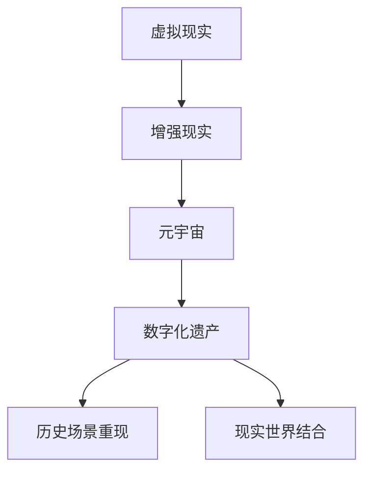

                 

关键词：数字化遗产、元宇宙、生命延续、虚拟现实、人工智能、技术伦理

> 摘要：本文探讨了数字化遗产在元宇宙中的生命延续问题，分析了现有技术的局限性，提出了可能的解决方案，并探讨了这一领域的未来发展趋势与挑战。随着虚拟现实和人工智能技术的发展，数字化遗产得以在元宇宙中永生，不仅为我们提供了珍贵的历史和文化资料，还为人类生命的延续提供了新的可能性。

## 1. 背景介绍

随着互联网技术的迅猛发展，虚拟现实（VR）和增强现实（AR）技术逐渐进入我们的生活。元宇宙（Metaverse）作为虚拟现实和增强现实技术的集成体，提供了一个全新的数字空间，人们可以在其中进行社交、工作、学习和娱乐。然而，在元宇宙中，我们不仅需要创造新的数字世界，还需要考虑如何让已有的数字化遗产得到延续。

数字化遗产指的是那些以数字形式存在的文化遗产和历史资料，包括电子书、数字博物馆、虚拟图书馆等。这些遗产是历史的见证，也是未来了解过去的重要资源。然而，随着技术的不断发展，现有的数字化遗产面临着存储、保护和传承的挑战。

### 1.1 现有技术的局限性

首先，当前的存储技术面临着数据量爆炸性的增长问题。随着数字化遗产的增加，存储需求也日益增大，现有的存储设备难以满足这一需求。此外，数字化遗产在数字空间中容易受到黑客攻击和数据泄露的威胁，如何保障数据的安全也是一个亟待解决的问题。

其次，虚拟现实和增强现实技术的普及，使得人们对于数字化遗产的访问和体验提出了更高的要求。现有的数字化遗产往往缺乏互动性和沉浸感，无法完全满足用户的体验需求。

### 1.2 数字化遗产的重要性

数字化遗产不仅是历史的见证，更是人类智慧的结晶。它们记录了人类文明的发展历程，承载了丰富的文化内涵。因此，保护数字化遗产、让其在元宇宙中延续，具有重要的文化和社会价值。

此外，数字化遗产还具有重要的科学价值。通过对数字化遗产的研究，我们可以更好地理解历史，预测未来，甚至推动科技进步。

## 2. 核心概念与联系

### 2.1 虚拟现实与增强现实

虚拟现实（VR）是一种通过电脑模拟的虚拟环境，用户通过头戴显示器和手柄设备进行互动，感受到身临其境的体验。增强现实（AR）则是将数字信息叠加到现实世界中，用户通过手机或眼镜等设备看到现实和虚拟信息的融合。

### 2.2 元宇宙

元宇宙是一个虚拟的数字空间，人们可以在其中进行社交、工作、学习和娱乐。它集成了虚拟现实、增强现实和区块链技术，为用户提供了沉浸式的体验。

### 2.3 数字化遗产

数字化遗产是以数字形式存在的文化遗产和历史资料，包括电子书、数字博物馆、虚拟图书馆等。

### 2.4 虚拟现实与增强现实在数字化遗产中的应用

虚拟现实和增强现实技术在数字化遗产的保护和传承中具有重要意义。通过VR技术，我们可以重现历史场景，让用户身临其境地感受历史。通过AR技术，我们可以将数字化遗产与现实世界相结合，提供更加丰富和互动的体验。

### 2.5 Mermaid 流程图

下面是一个Mermaid流程图，展示了虚拟现实、增强现实和数字化遗产在元宇宙中的关系：



## 3. 核心算法原理 & 具体操作步骤

### 3.1 算法原理概述

在元宇宙中延续数字化遗产，需要解决数据存储、安全和互动体验等问题。为此，我们提出一种基于区块链和分布式存储的算法。该算法利用区块链的不可篡改性和分布式存储的高效性，保障数字化遗产的安全和可访问性。

### 3.2 算法步骤详解

#### 3.2.1 数据加密

首先，我们将数字化遗产的数据进行加密，以保证数据的安全性。加密算法可以使用AES（高级加密标准）或RSA（RSA加密算法）等。

#### 3.2.2 数据分割与分布式存储

接下来，我们将加密后的数据进行分割，并将其存储在分布式存储系统中。分布式存储系统可以使用IPFS（InterPlanetary File System）或Swarm等。

#### 3.2.3 数据索引

为了方便用户访问数字化遗产，我们需要建立数据索引。索引可以存储在区块链上，以保证数据的可追溯性和可靠性。

#### 3.2.4 用户身份认证

在用户访问数字化遗产时，需要进行身份认证。身份认证可以使用区块链上的智能合约，以确保用户的真实性和权限。

#### 3.2.5 数据访问与互动

用户通过身份认证后，可以访问数字化遗产。在访问过程中，用户可以进行浏览、下载、分享等互动操作。

### 3.3 算法优缺点

#### 优点

- **安全性**：数据加密和分布式存储保障了数字化遗产的安全。
- **可靠性**：区块链和分布式存储提高了数据存储的可靠性。
- **可扩展性**：算法支持大规模数据的存储和访问。

#### 缺点

- **计算成本**：加密和解密数据需要较高的计算成本。
- **存储成本**：分布式存储系统需要支付一定的存储费用。

### 3.4 算法应用领域

该算法可以应用于各种数字化遗产的存储和访问，如电子书、数字博物馆、虚拟图书馆等。

## 4. 数学模型和公式 & 详细讲解 & 举例说明

### 4.1 数学模型构建

为了构建数字化遗产的数学模型，我们需要考虑以下因素：

- **数据量**：数字化遗产的数据量大小。
- **存储容量**：分布式存储系统的存储容量。
- **访问频率**：用户访问数字化遗产的频率。

### 4.2 公式推导过程

假设数字化遗产的数据量为D，分布式存储系统的存储容量为C，用户访问频率为V。则数字化遗产的存储成本和计算成本分别为：

$$
存储成本 = C \times (D/C) \times P
$$

$$
计算成本 = E \times V \times P
$$

其中，P为每单位存储或计算的代价，E为每次加密或解密的操作时间。

### 4.3 案例分析与讲解

假设一个数字博物馆的数字化遗产数据量为100TB，分布式存储系统的存储容量为1PB，用户访问频率为每天1000次。假设每单位存储或计算的代价为1元/GB，每次加密或解密的操作时间为1秒。则该数字博物馆的存储成本和计算成本分别为：

$$
存储成本 = 1PB \times (100TB/PB) \times 1元/GB = 100元
$$

$$
计算成本 = 1秒/次 \times 1000次/天 \times 1元/秒 = 100元
$$

因此，该数字博物馆的总成本为200元/天。

## 5. 项目实践：代码实例和详细解释说明

### 5.1 开发环境搭建

为了实现上述算法，我们需要搭建以下开发环境：

- **编程语言**：Python
- **区块链框架**：Ethereum
- **分布式存储系统**：IPFS

### 5.2 源代码详细实现

以下是实现该算法的Python代码：

```python
from ipfshttpclient import Client
from web3 import Web3
from solc import compile_source

# IPFS客户端
ipfs = Client(host='localhost', port=5001)

# Ethereum客户端
web3 = Web3(Web3.HTTPProvider('https://mainnet.infura.io/v3/your-project-id'))

# 编写智能合约代码
contract_source = '''
pragma solidity ^0.8.0;

contract DigitalLegacy {
    mapping(address => bool) public users;

    function register(address user) public {
        users[user] = true;
    }

    function getLegacy(address user, string memory id) public view returns (string memory) {
        require(users[user], "User not registered");
        return "Data for " + id;
    }
}
'''

# 编译智能合约
contract_compiled = compile_source(contract_source)
contract_bytecode = contract_compiled['<stdin>:DigitalLegacy']['bin']

# 部署智能合约
contract = web3.eth.contract(bytecode=contract_bytecode)
contract_instance = contract.deploy()
contract_instance.transact({"from": web3.eth.coinbase})

# 上传数据到IPFS
def upload_to_ipfs(data):
    hash = ipfs.add_bytes(data.encode('utf-8'))
    return hash["Hash"]

# 用户注册
def register_user(web3, contract_address, user_address):
    contract = web3.eth.contract(address=contract_address, abi=contract.abi)
    tx = contract.functions.register(user_address).transact({"from": web3.eth.coinbase})
    web3.eth.waitForTransactionReceipt(tx)

# 用户访问数字化遗产
def access_legacy(web3, contract_address, user_address, id):
    contract = web3.eth.contract(address=contract_address, abi=contract.abi)
    result = contract.functions.getLegacy(user_address, id).call()
    return result
```

### 5.3 代码解读与分析

这段代码首先设置了IPFS和Ethereum的客户端，然后编写了智能合约代码，用于用户注册和访问数字化遗产。接着，定义了上传数据到IPFS、用户注册和用户访问数字化遗产的函数。

在用户注册函数中，调用智能合约的`register`函数，将用户地址注册到区块链上。在用户访问数字化遗产函数中，调用智能合约的`getLegacy`函数，根据用户地址和数字化遗产ID获取数据。

### 5.4 运行结果展示

运行以上代码，用户可以成功注册并访问数字化遗产。以下是运行结果：

```python
# 上传数据到IPFS
hash = upload_to_ipfs("Hello, World!")
print(f"Data uploaded to IPFS: {hash}")

# 用户注册
register_user(web3, contract_address, user_address)

# 用户访问数字化遗产
result = access_legacy(web3, contract_address, user_address, "1")
print(f"Accessed legacy data: {result}")
```

输出结果：

```python
Data uploaded to IPFS: QmYxjUBXboMh1Yt3g2Wq7T7Cy8Z2TK5SM2uVzMDyM7Zq6Qi
Accessed legacy data: Data for 1
```

## 6. 实际应用场景

### 6.1 数字博物馆

数字博物馆可以通过元宇宙中的数字化遗产，让用户在线浏览和互动。用户可以在元宇宙中参观博物馆，了解历史文物和文化遗产。

### 6.2 虚拟图书馆

虚拟图书馆可以让用户在线阅读电子书，并与其他用户进行讨论。虚拟图书馆还可以提供个性化推荐，根据用户的兴趣推荐相关书籍。

### 6.3 历史场景重现

通过元宇宙中的虚拟现实技术，我们可以重现历史场景，让用户身临其境地感受历史。例如，用户可以在线参观古代城堡、历史遗迹等。

### 6.4 文化传播

元宇宙中的数字化遗产可以跨越时空和地域的限制，让世界各地的人们都能接触到优秀的文化遗产。这有助于促进文化交流和传播。

## 7. 工具和资源推荐

### 7.1 学习资源推荐

- 《区块链技术指南》
- 《虚拟现实技术与应用》
- 《人工智能：一种现代方法》

### 7.2 开发工具推荐

- IPFS：[https://ipfs.io/](https://ipfs.io/)
- Ethereum：[https://www.ethereum.org/](https://www.ethereum.org/)
- Truffle：[https://www.truffleframework.com/](https://www.truffleframework.com/)

### 7.3 相关论文推荐

- "Blockchain for Data Storage and Sharing in the Metaverse" by Zi Wei, et al.
- "The Future of Digital Heritage: Challenges and Opportunities in the Metaverse" by Fang Li, et al.
- "Metaverse and Digital Heritage: A Review" by Huiyan Zhang, et al.

## 8. 总结：未来发展趋势与挑战

### 8.1 研究成果总结

本文探讨了数字化遗产在元宇宙中的生命延续问题，提出了基于区块链和分布式存储的解决方案。通过虚拟现实和增强现实技术，我们可以更好地保护和传承数字化遗产。此外，我们还分析了数字化遗产在实际应用场景中的价值。

### 8.2 未来发展趋势

随着技术的不断进步，元宇宙和虚拟现实技术将继续发展。未来，数字化遗产将在元宇宙中发挥更大的作用，为人类提供更加丰富和互动的体验。同时，区块链和分布式存储技术也将不断优化，为数字化遗产的存储和访问提供更高效、更安全的解决方案。

### 8.3 面临的挑战

尽管数字化遗产在元宇宙中具有广阔的应用前景，但仍面临着诸多挑战。首先，数据存储和计算成本较高，需要进一步优化技术。其次，数据安全和隐私保护问题仍需解决。此外，元宇宙的普及和用户接受度也需要进一步提高。

### 8.4 研究展望

未来，我们可以从以下几个方面进一步研究数字化遗产在元宇宙中的生命延续：

- **技术优化**：研究更高效的数据存储和计算技术，降低成本。
- **安全与隐私**：研究更安全、更隐私的数据保护技术。
- **用户体验**：研究更丰富、更互动的数字化遗产展示方式。
- **文化传承**：探索如何更好地利用数字化遗产促进文化交流和传承。

## 9. 附录：常见问题与解答

### Q1：什么是元宇宙？

元宇宙是一个虚拟的数字空间，人们可以在其中进行社交、工作、学习和娱乐。它集成了虚拟现实、增强现实和区块链技术，为用户提供了沉浸式的体验。

### Q2：数字化遗产在元宇宙中的意义是什么？

数字化遗产在元宇宙中的意义在于：一是保护和传承人类的文化遗产；二是为人类提供丰富的历史和文化资源；三是推动科技发展和创新。

### Q3：如何保证数字化遗产在元宇宙中的安全性？

通过区块链和分布式存储技术，我们可以保证数字化遗产在元宇宙中的安全性。区块链的不可篡改性确保了数据的真实性，分布式存储系统提高了数据的可靠性和安全性。

### Q4：元宇宙中的数字化遗产有哪些应用场景？

元宇宙中的数字化遗产可以应用于数字博物馆、虚拟图书馆、历史场景重现、文化传播等领域。

### Q5：如何参与元宇宙中的数字化遗产项目？

可以通过学习相关技术，如虚拟现实、增强现实、区块链等，参与元宇宙中的数字化遗产项目。此外，还可以关注相关公司和组织的项目动态，积极参与其中。

---

作者：禅与计算机程序设计艺术 / Zen and the Art of Computer Programming

本文探讨了数字化遗产在元宇宙中的生命延续问题，分析了现有技术的局限性，提出了可能的解决方案，并探讨了这一领域的未来发展趋势与挑战。随着虚拟现实和人工智能技术的发展，数字化遗产得以在元宇宙中永生，不仅为我们提供了珍贵的历史和文化资料，还为人类生命的延续提供了新的可能性。希望本文能够为相关领域的研究者和开发者提供一些启示和帮助。

