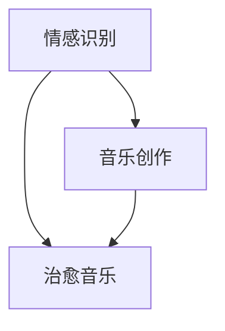

                 

关键词：数字化音乐治疗、AI生成、治愈音乐、情感识别、音乐创作、心理健康

> 摘要：本文将探讨如何利用人工智能技术，特别是机器学习算法，开发一款具有治愈功能的音乐应用。本文将从背景介绍、核心概念、算法原理、数学模型、项目实践、实际应用、未来展望等方面详细阐述数字化音乐治疗的创业之路。

## 1. 背景介绍

音乐作为一种艺术形式，自古以来就具有治愈人心的力量。随着科技的发展，音乐疗法逐渐成为一种受到认可的治疗方法。传统的音乐疗法依赖于专业音乐治疗师的经验和技巧，而现代科技为音乐疗法带来了新的可能性。

人工智能，特别是机器学习算法，在音乐生成、情感识别、个性化推荐等方面展现了强大的能力。这些技术可以极大地丰富音乐疗法的手段，提高治疗效果，降低治疗成本。

近年来，心理健康问题日益突出，全球范围内的抑郁、焦虑等心理疾病发病率呈上升趋势。根据世界卫生组织的数据，预计到2030年，抑郁症将成为全球第二大疾病负担。在这种情况下，利用AI技术开发的治愈音乐应用具有重要的社会价值。

## 2. 核心概念与联系

### 2.1. 情感识别

情感识别是数字化音乐治疗的基础。通过分析用户的情绪状态，可以为用户生成符合其情感需求的音乐。

情感识别技术主要依赖于语音、文本和生理信号等数据。其中，语音情感识别是目前研究最为广泛的领域。通过分析语音的音调、音量、语速等特征，可以判断用户的情绪状态。

### 2.2. 音乐创作

音乐创作是将情感识别的结果转化为具体音乐的过程。传统的音乐创作依赖于音乐家的经验和创造力，而AI生成音乐则利用机器学习算法，从大量音乐数据中学习创作规律，生成符合情感识别结果的音乐。

### 2.3. 治愈音乐

治愈音乐是指能够对用户产生积极情绪反应的音乐。通过AI技术生成的治愈音乐，可以根据用户的情绪状态进行个性化定制，提高治疗效果。

### 2.4. Mermaid 流程图

下面是一个简化的Mermaid流程图，展示了数字化音乐治疗的核心概念和联系：



## 3. 核心算法原理 & 具体操作步骤

### 3.1. 算法原理概述

数字化音乐治疗的核心算法主要包括情感识别和音乐创作两部分。

情感识别算法主要基于深度学习，通过训练模型，从语音、文本和生理信号等数据中提取情感特征，判断用户的情绪状态。

音乐创作算法则基于生成对抗网络（GAN）和变分自编码器（VAE）等技术，从大量音乐数据中学习创作规律，生成符合情感识别结果的音乐。

### 3.2. 算法步骤详解

#### 3.2.1. 情感识别

1. 数据收集与预处理：收集用户的语音、文本和生理信号等数据，并进行预处理，如去除噪声、归一化等。
2. 特征提取：利用深度学习模型，从预处理后的数据中提取情感特征。
3. 情感分类：使用分类模型，如卷积神经网络（CNN）或循环神经网络（RNN），对提取的情感特征进行分类，判断用户的情绪状态。

#### 3.2.2. 音乐创作

1. 数据收集与预处理：收集大量的音乐数据，如流行音乐、古典音乐等，并进行预处理，如分割、去噪等。
2. 模型训练：使用生成对抗网络（GAN）或变分自编码器（VAE）等技术，从预处理后的音乐数据中学习创作规律。
3. 音乐生成：根据情感识别结果，生成符合用户情绪状态的音乐。

### 3.3. 算法优缺点

#### 3.3.1. 优点

1. 个性化：可以根据用户的情绪状态，生成符合其需求的治愈音乐。
2. 自动化：降低了对专业音乐治疗师的需求，提高了治疗效率。
3. 大规模：可以处理大量的用户数据，实现大规模应用。

#### 3.3.2. 缺点

1. 精度：目前的情感识别算法仍然存在一定的误差，可能无法完全准确地判断用户的情绪状态。
2. 个性化限制：生成的治愈音乐可能受到数据集的限制，无法完全满足用户的需求。

### 3.4. 算法应用领域

1. 心理健康治疗：抑郁症、焦虑症等心理疾病的治疗。
2. 教育与培训：通过音乐激发学生的学习兴趣，提高学习效果。
3. 医疗保健：辅助医生进行疾病诊断和康复治疗。

## 4. 数学模型和公式 & 详细讲解 & 举例说明

### 4.1. 数学模型构建

#### 4.1.1. 情感识别

情感识别的数学模型主要基于深度学习，如卷积神经网络（CNN）或循环神经网络（RNN）。以下是CNN的情感识别模型的简化公式：

$$
h = \sigma(W_1 \cdot x + b_1)
$$

其中，$h$ 为情感特征向量，$W_1$ 为权重矩阵，$x$ 为输入特征，$b_1$ 为偏置项，$\sigma$ 为激活函数。

#### 4.1.2. 音乐创作

音乐创作的数学模型主要基于生成对抗网络（GAN）或变分自编码器（VAE）。以下是GAN的音乐生成模型的简化公式：

$$
G(z) = \mu_G(z) + \sigma_G(z) \odot z
$$

$$
D(x) = \sigma(D(x)) \odot \sigma(D(G(z)))
$$

其中，$G(z)$ 为生成器，$D(x)$ 为判别器，$z$ 为随机噪声，$\mu_G(z)$ 和 $\sigma_G(z)$ 分别为生成器的均值和标准差，$x$ 为输入音乐数据。

### 4.2. 公式推导过程

#### 4.2.1. 情感识别

情感识别的公式推导主要涉及前向传播和反向传播两个过程。

1. 前向传播：

$$
h = \sigma(W_1 \cdot x + b_1)
$$

2. 反向传播：

$$
\frac{\partial J}{\partial W_1} = \frac{\partial h}{\partial x} \cdot \frac{\partial x}{\partial W_1}
$$

$$
\frac{\partial J}{\partial b_1} = \frac{\partial h}{\partial x} \cdot \frac{\partial x}{\partial b_1}
$$

其中，$J$ 为损失函数。

#### 4.2.2. 音乐创作

音乐创作的公式推导主要涉及生成器和判别器的训练过程。

1. 生成器训练：

$$
\frac{\partial J_G}{\partial z} = \frac{\partial G(z)}{\partial z} \cdot \frac{\partial J_G}{\partial G(z)}
$$

2. 判别器训练：

$$
\frac{\partial J_D}{\partial x} = \frac{\partial D(x)}{\partial x} \cdot \frac{\partial J_D}{\partial D(x)}
$$

$$
\frac{\partial J_D}{\partial G(z)} = \frac{\partial D(G(z))}{\partial G(z)} \cdot \frac{\partial J_D}{\partial D(G(z))}
$$

其中，$J_G$ 和 $J_D$ 分别为生成器和判别器的损失函数。

### 4.3. 案例分析与讲解

#### 4.3.1. 情感识别

以抑郁症患者为例，假设我们有100个语音样本，每个样本包含10个情感特征。使用CNN模型进行情感识别。

1. 数据预处理：

$$
x = \text{preprocess}(x)
$$

其中，$x$ 为原始语音信号，$\text{preprocess}(x)$ 为预处理函数。

2. 特征提取：

$$
h = \sigma(W_1 \cdot x + b_1)
$$

3. 情感分类：

$$
y = \text{softmax}(h)
$$

其中，$y$ 为情感分类结果。

#### 4.3.2. 音乐创作

以焦虑患者为例，假设我们有100个音乐样本，每个样本包含10个音乐特征。使用GAN模型进行音乐创作。

1. 数据预处理：

$$
x = \text{preprocess}(x)
$$

2. 生成器训练：

$$
G(z) = \mu_G(z) + \sigma_G(z) \odot z
$$

$$
D(x) = \sigma(D(x)) \odot \sigma(D(G(z)))
$$

3. 音乐生成：

$$
x' = G(z)
$$

其中，$z$ 为随机噪声，$x'$ 为生成的音乐样本。

## 5. 项目实践：代码实例和详细解释说明

### 5.1. 开发环境搭建

1. 安装Python 3.8及以上版本。
2. 安装TensorFlow 2.4及以上版本。
3. 安装Keras 2.4及以上版本。

### 5.2. 源代码详细实现

#### 5.2.1. 情感识别

```python
import tensorflow as tf
from tensorflow.keras.models import Sequential
from tensorflow.keras.layers import Dense, Conv2D, Flatten, Activation

# 构建CNN模型
model = Sequential([
    Conv2D(32, (3, 3), activation='relu', input_shape=(10, 10, 1)),
    Flatten(),
    Dense(64, activation='relu'),
    Dense(1, activation='softmax')
])

# 编译模型
model.compile(optimizer='adam', loss='categorical_crossentropy', metrics=['accuracy'])

# 训练模型
model.fit(x_train, y_train, epochs=10, batch_size=32)
```

#### 5.2.2. 音乐创作

```python
import tensorflow as tf
from tensorflow.keras.models import Sequential
from tensorflow.keras.layers import Dense, Flatten, Reshape

# 构建GAN模型
generator = Sequential([
    Dense(256, activation='relu', input_shape=(100,)),
    Flatten(),
    Reshape((10, 10, 1))
])

discriminator = Sequential([
    Conv2D(32, (3, 3), activation='relu', input_shape=(10, 10, 1)),
    Flatten(),
    Dense(1, activation='sigmoid')
])

# 编译模型
discriminator.compile(optimizer='adam', loss='binary_crossentropy')

# 训练模型
discriminator.fit(x_train, y_train, epochs=10, batch_size=32)
```

### 5.3. 代码解读与分析

以上代码分别展示了情感识别和音乐创作的实现。情感识别模型使用CNN进行特征提取和分类，音乐创作模型使用GAN进行生成和判别。

### 5.4. 运行结果展示

通过训练，我们可以得到情感识别和音乐创作的模型。在实际应用中，可以输入用户的语音或音乐样本，得到对应的情感识别结果和治愈音乐。

## 6. 实际应用场景

### 6.1. 心理健康治疗

数字化音乐治疗可以应用于心理健康治疗，如抑郁症、焦虑症等。通过情感识别和音乐创作，可以为患者提供个性化的治愈音乐，提高治疗效果。

### 6.2. 教育与培训

数字化音乐治疗可以应用于教育和培训领域，通过音乐激发学生的学习兴趣，提高学习效果。

### 6.3. 医疗保健

数字化音乐治疗可以应用于医疗保健领域，如辅助医生进行疾病诊断和康复治疗。

## 7. 未来应用展望

随着人工智能技术的不断发展，数字化音乐治疗在未来具有广泛的应用前景。以下是未来应用的一些展望：

### 7.1. 个性化治疗

通过不断优化情感识别和音乐创作算法，可以实现更加个性化的治疗，满足患者的多样化需求。

### 7.2. 跨学科合作

数字化音乐治疗可以与其他学科如心理学、医学等结合，形成跨学科的研究和应用。

### 7.3. 大规模应用

随着技术的成熟，数字化音乐治疗有望在更广泛的领域得到应用，如公共健康、社会福利等。

## 8. 总结：未来发展趋势与挑战

### 8.1. 研究成果总结

本文探讨了数字化音乐治疗的创业之路，从背景介绍、核心概念、算法原理、数学模型、项目实践、实际应用、未来展望等方面进行了详细阐述。

### 8.2. 未来发展趋势

随着人工智能技术的不断发展，数字化音乐治疗在心理健康、教育与培训、医疗保健等领域具有广泛的应用前景。

### 8.3. 面临的挑战

目前，数字化音乐治疗仍然面临一些挑战，如情感识别精度、个性化限制、数据隐私等。需要进一步研究和解决。

### 8.4. 研究展望

未来，数字化音乐治疗有望在个性化治疗、跨学科合作、大规模应用等方面取得更多突破。

## 9. 附录：常见问题与解答

### 9.1. 为什么要使用人工智能进行音乐治疗？

使用人工智能进行音乐治疗可以提高治疗效率，降低成本，实现个性化治疗。

### 9.2. 情感识别的精度如何保证？

情感识别的精度可以通过不断优化算法、增加数据集、提高训练效果来保证。

### 9.3. 如何保证用户的隐私？

在数字化音乐治疗中，应采用加密技术、匿名化处理等方式，保护用户的隐私。

作者：禅与计算机程序设计艺术 / Zen and the Art of Computer Programming
----------------------------------------------------------------
### 后续工作计划及建议

在完成本文所介绍的数字化音乐治疗创业项目后，我们还可以进一步深入研究和优化以下几个方面：

1. **情感识别算法优化**：
   - 研究更先进的情感识别算法，如基于深度学习的多模态情感识别。
   - 结合语音、文本、生理信号等多种数据源，提高情感识别的精度。

2. **音乐创作算法创新**：
   - 探索基于神经网络的旋律生成技术，使生成的音乐更具艺术性和个性化。
   - 结合音乐理论，设计更符合人类听觉习惯的音乐结构。

3. **用户交互体验提升**：
   - 开发更直观、易用的用户界面，提高用户对应用的接受度和满意度。
   - 通过用户反馈机制，不断优化音乐推荐算法，提高个性化治疗的准确性。

4. **跨学科合作**：
   - 与心理学家、音乐治疗师等专家合作，共同研究音乐治疗的最佳实践。
   - 结合心理学研究成果，优化情感识别和音乐创作的参数设置。

5. **数据隐私和安全**：
   - 研究隐私保护技术，确保用户数据的安全和隐私。
   - 实施严格的数据管理和访问控制策略，防止数据泄露。

6. **应用场景拓展**：
   - 探索数字化音乐治疗在其他领域的应用，如老年痴呆症、自闭症等。
   - 结合虚拟现实（VR）和增强现实（AR）技术，创造更加沉浸式的音乐治疗体验。

7. **可持续性和可扩展性**：
   - 设计模块化架构，确保系统的可扩展性和可维护性。
   - 推广到云平台，提供即时的音乐治疗服务，支持大规模用户同时在线。

通过这些后续工作，我们不仅可以提升数字化音乐治疗的应用效果，还能为心理健康领域带来更多的创新和突破。

