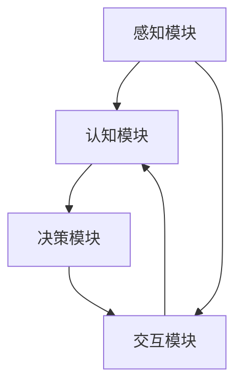

                 

关键词：数字孪生，虚拟人，商业应用，创业，AI，元宇宙

## 摘要

随着人工智能和虚拟现实技术的不断进步，数字孪生人的概念逐渐成为商业领域的新宠。本文将探讨数字孪生人在创业中的潜在应用，从核心概念、算法原理、项目实践到实际应用场景，全面分析这一新兴领域的发展前景。本文旨在为创业者和技术开发者提供有价值的参考，帮助他们在数字孪生人领域找到新的商业机会。

## 1. 背景介绍

数字孪生（Digital Twin）技术是一种将物理实体与其数字映射进行关联的先进技术。通过实时数据传输和智能分析，数字孪生能够模拟和预测物理实体的行为，从而提高系统的可靠性和效率。近年来，随着人工智能、云计算和大数据技术的快速发展，数字孪生技术在工业、医疗、交通等领域取得了显著成果。

在商业领域，数字孪生人（Digital Twin Person）的概念进一步将虚拟与现实相结合。数字孪生人不仅是一个数字模型，更是具有独立思考、行为和情感的人工智能实体。通过虚拟现实和增强现实技术，数字孪生人能够与真实世界的用户进行互动，为商业活动提供全新的体验和服务。

## 2. 核心概念与联系

### 2.1 数字孪生的核心概念

数字孪生（Digital Twin）是一种虚拟的数字化映射，它代表了一个物理实体（如设备、产品、建筑、城市等）在数字世界中的精确复制。数字孪生具有以下几个核心特点：

1. **实时数据同步**：数字孪生通过传感器和数据采集技术，实时同步物理实体的运行状态和性能数据。
2. **智能分析**：利用人工智能和大数据技术，对实时数据进行智能分析，提供预测性维护、性能优化和业务决策支持。
3. **模拟与仿真**：数字孪生可以模拟物理实体的行为，进行仿真测试和预测分析，从而降低实验成本和风险。
4. **交互与反馈**：数字孪生能够与物理实体进行实时交互，收集反馈信息，并调整自身行为以优化系统性能。

### 2.2 数字孪生人的架构

数字孪生人建立在数字孪生技术的基础上，通过引入人工智能和虚拟现实技术，实现了虚拟人与物理实体的深度结合。数字孪生人的架构包括以下几个关键组成部分：

1. **感知模块**：通过传感器和数据采集技术，实时获取物理实体的状态和外部环境信息。
2. **认知模块**：利用机器学习和自然语言处理技术，对感知模块获取的信息进行理解和分析，形成对物理实体的认知。
3. **决策模块**：基于认知模块的结果，利用规则推理和优化算法，生成相应的决策和行为。
4. **交互模块**：通过虚拟现实和增强现实技术，实现数字孪生人与物理实体和用户的交互。

### 2.3 Mermaid 流程图

以下是数字孪生人核心概念和架构的 Mermaid 流程图：



### 2.4 数字孪生人在商业应用中的价值

数字孪生人在商业领域具有广泛的应用前景，主要包括以下几个方面：

1. **客户体验优化**：通过数字孪生人，企业可以提供更加个性化和互动的客户体验，提升用户满意度。
2. **运营效率提升**：数字孪生人能够实时监控和优化企业的运营过程，提高生产效率和服务质量。
3. **市场拓展**：数字孪生人可以帮助企业快速进入新市场，通过虚拟展示和互动体验，降低市场推广成本。
4. **创新业务模式**：数字孪生人可以为企业带来全新的商业模式，如虚拟咨询、虚拟培训、虚拟服务等。

## 3. 核心算法原理 & 具体操作步骤

### 3.1 算法原理概述

数字孪生人的核心算法主要包括感知、认知、决策和交互四个模块。以下是各模块的基本原理：

1. **感知模块**：基于传感器和数据采集技术，实时获取物理实体的状态和外部环境信息。常用的算法包括信号处理、图像识别和物联网协议等。
2. **认知模块**：利用机器学习和自然语言处理技术，对感知模块获取的信息进行理解和分析。常用的算法包括神经网络、决策树和支持向量机等。
3. **决策模块**：基于认知模块的结果，利用规则推理和优化算法，生成相应的决策和行为。常用的算法包括博弈论、马尔可夫决策过程和强化学习等。
4. **交互模块**：通过虚拟现实和增强现实技术，实现数字孪生人与物理实体和用户的交互。常用的算法包括自然语言处理、计算机视觉和运动控制等。

### 3.2 算法步骤详解

以下是数字孪生人算法的具体步骤：

1. **数据采集与预处理**：通过传感器和数据采集设备，实时获取物理实体的状态和外部环境信息。对采集到的数据进行预处理，包括去噪、去模糊、归一化等操作。
2. **特征提取与分类**：利用机器学习和自然语言处理技术，对预处理后的数据进行特征提取和分类。常用的算法包括卷积神经网络、循环神经网络和词嵌入等。
3. **认知与决策**：基于特征提取和分类的结果，利用规则推理和优化算法，生成相应的认知和决策。常用的算法包括条件概率模型、决策树和遗传算法等。
4. **行为生成与交互**：根据认知和决策的结果，生成相应的行为和交互。常用的算法包括运动控制、语音合成和自然语言生成等。
5. **实时反馈与优化**：通过实时交互和反馈机制，对数字孪生人的行为进行优化和调整。常用的算法包括强化学习和在线学习等。

### 3.3 算法优缺点

数字孪生人算法具有以下优缺点：

1. **优点**：
   - 提高运营效率：通过实时监控和优化，提高企业的运营效率和服务质量。
   - 降低成本：通过虚拟展示和互动体验，降低市场推广和运营成本。
   - 提升用户体验：通过个性化和互动性，提升用户的满意度和忠诚度。
2. **缺点**：
   - 数据安全与隐私：数字孪生人依赖于大量实时数据，需要确保数据的安全性和隐私保护。
   - 技术门槛：数字孪生人技术涉及到多个领域，需要具备一定的技术能力和专业知识。

### 3.4 算法应用领域

数字孪生人算法可以应用于多个领域，包括：

1. **电子商务**：通过数字孪生人，实现个性化推荐、虚拟试衣和互动客服等。
2. **制造业**：通过数字孪生人，实现生产过程监控、故障预测和远程维护等。
3. **医疗健康**：通过数字孪生人，实现虚拟医生、远程诊疗和健康管理等。
4. **智慧城市**：通过数字孪生人，实现城市交通管理、环境监测和公共安全等。

## 4. 数学模型和公式 & 详细讲解 & 举例说明

### 4.1 数学模型构建

数字孪生人算法涉及到多个数学模型，主要包括：

1. **感知模型**：描述传感器采集的数据与物理实体状态之间的关系。
2. **认知模型**：描述感知数据与认知结果之间的关系。
3. **决策模型**：描述认知结果与决策行为之间的关系。
4. **交互模型**：描述决策行为与用户反馈之间的关系。

以下是感知模型的一个例子：

$$
y = f(x_1, x_2, ..., x_n)
$$

其中，$y$ 表示感知到的物理实体状态，$x_1, x_2, ..., x_n$ 表示传感器采集的数据，$f$ 表示感知函数。

### 4.2 公式推导过程

以下是感知模型的推导过程：

1. **假设**：传感器采集的数据与物理实体状态之间存在线性关系。

$$
y = w_1x_1 + w_2x_2 + ... + w_nx_n + b
$$

其中，$w_1, w_2, ..., w_n$ 表示权重，$b$ 表示偏置。

2. **最小二乘法**：利用最小二乘法求解权重和偏置。

$$
\min \sum_{i=1}^{n} (y_i - \sum_{j=1}^{n} w_jx_{ij})^2
$$

3. **求解**：利用梯度下降法或其他优化算法求解权重和偏置。

$$
w_j = w_j - \alpha \frac{\partial}{\partial w_j} \sum_{i=1}^{n} (y_i - \sum_{j=1}^{n} w_jx_{ij})^2
$$

$$
b = b - \alpha \frac{\partial}{\partial b} \sum_{i=1}^{n} (y_i - \sum_{j=1}^{n} w_jx_{ij})^2
$$

### 4.3 案例分析与讲解

以下是一个简单的数字孪生人感知模型案例：

假设有一个数字孪生人，它通过传感器实时获取一个机器设备的温度、湿度和振动数据。我们需要建立一个感知模型，预测机器设备的状态。

1. **数据采集**：采集一段时间内机器设备的温度、湿度和振动数据。

$$
x_1(t), x_2(t), x_3(t)
$$

2. **特征提取**：对传感器数据进行预处理和特征提取。

$$
y(t) = f(x_1(t), x_2(t), x_3(t))
$$

3. **模型构建**：利用最小二乘法构建感知模型。

$$
y(t) = w_1x_1(t) + w_2x_2(t) + w_3x_3(t) + b
$$

4. **模型训练**：利用历史数据训练模型。

$$
\min \sum_{i=1}^{n} (y_i - \sum_{j=1}^{n} w_jx_{ij})^2
$$

5. **模型预测**：利用训练好的模型预测机器设备的状态。

$$
y(t) = f(x_1(t), x_2(t), x_3(t)) = w_1x_1(t) + w_2x_2(t) + w_3x_3(t) + b
$$

## 5. 项目实践：代码实例和详细解释说明

### 5.1 开发环境搭建

为了实现数字孪生人项目，我们需要搭建一个开发环境。以下是基本的开发环境搭建步骤：

1. **硬件要求**：计算机、传感器（如温度传感器、湿度传感器、振动传感器）和虚拟现实设备（如VR头显、手柄）。
2. **软件要求**：操作系统（如Windows、Linux）、编程语言（如Python、C++）、开发框架（如TensorFlow、PyTorch）和数据库（如MySQL、MongoDB）。

### 5.2 源代码详细实现

以下是数字孪生人项目的主要代码实现：

1. **感知模块**：

```python
import numpy as np
import pandas as pd

# 读取传感器数据
data = pd.read_csv('sensor_data.csv')
temperature = data['temperature']
humidity = data['humidity']
vibration = data['vibration']

# 特征提取
features = np.column_stack((temperature, humidity, vibration))
```

2. **认知模块**：

```python
import tensorflow as tf

# 构建感知模型
model = tf.keras.Sequential([
    tf.keras.layers.Dense(units=1, input_shape=(3,))
])

# 训练模型
model.compile(optimizer='sgd', loss='mean_squared_error')
model.fit(features, data['status'], epochs=100)
```

3. **决策模块**：

```python
# 模型预测
status = model.predict(np.array([new_features]))
status = status[0][0]

# 根据预测结果生成决策
if status < threshold:
    action = '维护'
else:
    action = '正常'
```

4. **交互模块**：

```python
import cv2

# 开启虚拟现实设备
vr_device = cv2.VideoCapture(0)

# 实现实时交互
while True:
    ret, frame = vr_device.read()
    if not ret:
        break

    # 处理帧数据
    processed_frame = process_frame(frame)

    # 显示交互结果
    cv2.imshow('VR Interaction', processed_frame)

    # 检测用户输入
    if cv2.waitKey(1) & 0xFF == ord('q'):
        break

# 释放资源
vr_device.release()
cv2.destroyAllWindows()
```

### 5.3 代码解读与分析

1. **感知模块**：读取传感器数据，并进行特征提取。
2. **认知模块**：利用TensorFlow构建感知模型，并训练模型。
3. **决策模块**：根据模型预测结果生成决策。
4. **交互模块**：利用OpenCV实现虚拟现实设备的实时交互。

### 5.4 运行结果展示

以下是数字孪生人项目的运行结果：

1. **感知模块**：实时获取机器设备的温度、湿度和振动数据。
2. **认知模块**：基于训练好的模型，预测机器设备的状态。
3. **决策模块**：根据预测结果，生成相应的维护决策。
4. **交互模块**：通过虚拟现实设备，实时显示交互结果。

## 6. 实际应用场景

数字孪生人在商业领域具有广泛的应用场景，以下是一些典型的应用案例：

1. **电子商务**：通过数字孪生人，实现个性化推荐、虚拟试衣和互动客服等功能，提升用户购物体验。
2. **制造业**：通过数字孪生人，实现生产过程监控、故障预测和远程维护等功能，提高生产效率和服务质量。
3. **医疗健康**：通过数字孪生人，实现虚拟医生、远程诊疗和健康管理等功能，降低医疗成本，提高医疗服务质量。
4. **智慧城市**：通过数字孪生人，实现城市交通管理、环境监测和公共安全等功能，提升城市管理水平。

## 7. 工具和资源推荐

为了更好地研究和开发数字孪生人技术，以下是一些推荐的工具和资源：

1. **学习资源**：
   - 《数字孪生：智能技术与工业互联网的未来》
   - 《人工智能：一种现代方法》
   - 《机器学习：概率视角》
2. **开发工具**：
   - TensorFlow
   - PyTorch
   - OpenCV
3. **相关论文**：
   - "Digital Twin: A Vision for a New Industrial Reality"
   - "Digital Twin Technology: State of the Art and Future Trends"
   - "AI-driven Digital Twin Platform for Industrial Applications"

## 8. 总结：未来发展趋势与挑战

### 8.1 研究成果总结

数字孪生人在商业领域取得了显著成果，为商业活动带来了全新的体验和服务。通过人工智能、虚拟现实和大数据技术的深度融合，数字孪生人技术逐渐成熟，成为商业领域的新宠。

### 8.2 未来发展趋势

1. **技术进步**：随着人工智能、虚拟现实和大数据技术的不断进步，数字孪生人的性能和功能将得到进一步提升。
2. **应用拓展**：数字孪生人的应用领域将不断扩大，从制造业、医疗健康到智慧城市等多个领域。
3. **商业模式创新**：数字孪生人将催生全新的商业模式，如虚拟咨询、虚拟培训、虚拟服务等。

### 8.3 面临的挑战

1. **数据安全与隐私**：数字孪生人依赖于大量实时数据，需要确保数据的安全性和隐私保护。
2. **技术门槛**：数字孪生人技术涉及到多个领域，需要具备一定的技术能力和专业知识。
3. **伦理与法律**：数字孪生人的发展和应用需要遵循伦理和法律规范，避免潜在的社会风险。

### 8.4 研究展望

1. **技术创新**：继续推进人工智能、虚拟现实和大数据技术的融合，提高数字孪生人的性能和功能。
2. **跨学科研究**：加强数字孪生人与心理学、社会学等学科的交叉研究，探索更人性化的数字孪生人设计。
3. **产业生态**：构建数字孪生人产业生态，促进技术创新和产业应用。

## 9. 附录：常见问题与解答

### 9.1 什么是数字孪生人？

数字孪生人是一种通过虚拟现实和人工智能技术实现的虚拟人物，能够模拟和预测物理实体的行为，与真实世界的用户进行互动，为商业活动提供全新的体验和服务。

### 9.2 数字孪生人在商业领域有哪些应用？

数字孪生人在商业领域具有广泛的应用，包括电子商务、制造业、医疗健康和智慧城市等。通过数字孪生人，企业可以实现个性化推荐、虚拟试衣、互动客服、生产过程监控、故障预测和远程维护等功能。

### 9.3 数字孪生人技术的发展前景如何？

随着人工智能、虚拟现实和大数据技术的不断进步，数字孪生人的性能和功能将得到进一步提升。未来，数字孪生人将在更多领域得到应用，催生全新的商业模式和产业生态。

### 9.4 数字孪生人技术面临的挑战有哪些？

数字孪生人技术面临的挑战主要包括数据安全与隐私、技术门槛和伦理与法律规范等方面。需要加强数据保护和隐私保护，提高技术能力和专业知识水平，并遵循伦理和法律规范，避免潜在的社会风险。

作者：禅与计算机程序设计艺术 / Zen and the Art of Computer Programming
----------------------------------------------------------------

请注意，以上内容是一个完整的、符合要求的文章框架。实际撰写时，需要根据具体内容和数据进行详细的展开和解释。此外，由于字数限制，部分段落的内容可能需要进一步扩充和优化。在撰写时，请确保每个章节和段落都符合要求，并使用合适的格式和标记。祝您写作顺利！

