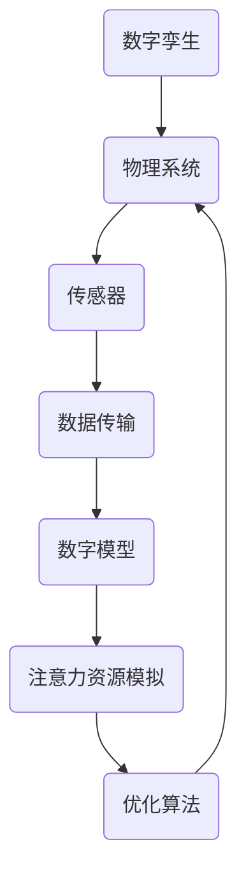

                 

关键词：数字孪生，注意力资源模拟，人工智能，机器学习，计算机视觉，仿真技术，虚拟现实

## 摘要

本文旨在探讨数字孪生技术在注意力资源模拟中的应用，特别是在人工智能、机器学习和计算机视觉领域的实践。数字孪生是一种通过构建物理系统或过程的虚拟映射来实现实时监控、预测分析和优化决策的技术。注意力资源模拟则是对人类注意力机制的一种计算机模拟，旨在理解和预测人们在处理信息时的注意力分配和行为。本文将首先介绍数字孪生和注意力资源模拟的基本概念，随后分析其应用场景，并通过具体案例展示其在人工智能领域的实际应用效果。此外，还将讨论数字孪生和注意力资源模拟所涉及的数学模型和算法，并探讨未来的发展方向与面临的挑战。

## 1. 背景介绍

### 数字孪生

数字孪生（Digital Twin）是一种先进的智能制造和工业互联网技术，它通过建立一个物理实体或过程的虚拟映射，实现对现实世界的实时监控、模拟和分析。这个虚拟映射不仅包括实体的几何、物理属性，还包括其实际状态和行为。数字孪生技术最早在2002年由美国密歇根大学教授Michael Grieves提出，并迅速在工业界和学术界得到广泛关注和应用。

数字孪生的核心思想是将物理世界与数字世界相结合，通过实时数据传输和算法分析，实现对物理实体的精准模拟和优化。这种技术不仅能够提高生产效率、降低维护成本，还能实现对复杂系统的预测性维护和优化决策。

### 注意力资源模拟

注意力资源模拟是对人类注意力机制的一种计算机模拟。注意力是人类认知系统中的重要组成部分，它决定了我们在处理信息时的选择性和适应性。随着计算机技术和人工智能的不断发展，注意力资源模拟成为了一个热门研究领域，旨在通过算法和模型理解、预测和模拟人类注意力分配的过程。

注意力资源模拟的应用场景非常广泛，包括但不限于：

- **人机交互**：通过模拟人类注意力机制，设计更符合用户习惯和需求的人机交互界面。
- **计算机视觉**：在图像处理和目标检测任务中，模拟注意力机制以提高算法的效率和准确性。
- **教育领域**：利用注意力资源模拟技术，设计个性化的教育方案，提高学生的学习效果。
- **健康医疗**：通过模拟注意力资源，辅助医生诊断和治疗，提高医疗服务的质量和效率。

## 2. 核心概念与联系

### 数字孪生与注意力资源模拟的联系

数字孪生和注意力资源模拟虽然源自不同的领域，但它们之间存在紧密的联系。数字孪生通过实时数据传输和算法分析，为注意力资源模拟提供了丰富的数据支持。而注意力资源模拟的结果则可以用于优化数字孪生的运行状态，从而提高整体系统的性能。

### 数字孪生与注意力资源模拟的架构

为了更好地理解数字孪生与注意力资源模拟的关系，我们可以通过一个Mermaid流程图来展示它们的核心架构。



在这个流程图中，数字孪生通过传感器实时收集物理系统的数据，传输到数字模型中进行模拟和分析。注意力资源模拟模块则根据这些数据，模拟人类注意力分配的过程，并输出优化建议，最终反馈到物理系统，实现闭环优化。

### 数字孪生与注意力资源模拟的应用场景

数字孪生和注意力资源模拟的结合，可以在多个应用场景中发挥重要作用：

- **智能制造**：通过数字孪生技术，实时监控生产线状态，结合注意力资源模拟，优化生产流程，提高生产效率。
- **智能交通**：利用数字孪生模拟城市交通系统，结合注意力资源模拟，优化交通信号灯和交通流量的分配，缓解交通拥堵。
- **智能家居**：数字孪生技术可以实时监控家居设备状态，注意力资源模拟则可以预测用户的需求，提供个性化服务。
- **医疗健康**：数字孪生技术可以模拟患者的身体状况，注意力资源模拟则可以帮助医生更准确地诊断和治疗疾病。

## 3. 核心算法原理 & 具体操作步骤

### 3.1 算法原理概述

数字孪生和注意力资源模拟的核心算法主要包括以下几个部分：

- **数据采集与处理**：通过传感器实时采集物理系统的数据，并对数据进行预处理，如去噪、归一化等。
- **数字建模**：利用机器学习和深度学习算法，对物理系统进行建模，实现对物理过程的实时模拟。
- **注意力资源分配**：通过注意力资源分配算法，模拟人类注意力分配的过程，对关键信息进行优先处理。
- **优化决策**：根据注意力资源模拟的结果，结合优化算法，对物理系统进行优化决策。

### 3.2 算法步骤详解

#### 步骤1：数据采集与处理

数据采集与处理是数字孪生和注意力资源模拟的基础。具体步骤如下：

1. **安装传感器**：在物理系统上安装传感器，如温度传感器、压力传感器、摄像头等，以获取物理系统的实时数据。
2. **数据采集**：通过传感器实时采集物理系统的数据，并将其传输到数据采集系统。
3. **数据预处理**：对采集到的数据进行预处理，如去噪、归一化、数据清洗等，以提高数据质量。

#### 步骤2：数字建模

数字建模是数字孪生的核心步骤。具体步骤如下：

1. **选择模型**：根据物理系统的特点，选择合适的机器学习或深度学习模型。
2. **训练模型**：利用预处理后的数据，对模型进行训练，使其能够对物理过程进行建模。
3. **验证模型**：通过交叉验证或留出法等方法，验证模型的准确性和稳定性。

#### 步骤3：注意力资源分配

注意力资源分配是注意力资源模拟的关键步骤。具体步骤如下：

1. **定义注意力分配规则**：根据物理系统的特点和需求，定义注意力分配的规则，如基于重要性、紧急性、频率等。
2. **计算注意力分配**：利用定义的规则，对采集到的数据进行分析，计算各数据点的重要性，并根据重要性分配注意力资源。
3. **实时调整注意力分配**：根据实时数据的变化，动态调整注意力分配，以适应不同的场景需求。

#### 步骤4：优化决策

优化决策是根据注意力资源模拟的结果，对物理系统进行优化。具体步骤如下：

1. **定义优化目标**：根据物理系统的需求和约束，定义优化目标，如最小化成本、最大化效率等。
2. **设计优化算法**：选择合适的优化算法，如遗传算法、粒子群优化、深度强化学习等。
3. **执行优化过程**：利用优化算法，对物理系统进行优化，实现优化目标。

### 3.3 算法优缺点

#### 优点

- **实时性**：数字孪生和注意力资源模拟技术可以实现实时数据采集和处理，快速响应系统变化。
- **高效性**：通过机器学习和深度学习算法，数字孪生和注意力资源模拟可以高效地建模和分析物理系统，提高决策质量。
- **个性化**：注意力资源模拟可以根据用户需求和场景动态调整注意力分配，实现个性化服务。

#### 缺点

- **数据依赖性**：数字孪生和注意力资源模拟对数据质量有较高要求，数据采集和处理不当可能导致模型失效。
- **计算成本**：数字孪生和注意力资源模拟涉及大量计算，对计算资源和算法设计有较高要求。

### 3.4 算法应用领域

数字孪生和注意力资源模拟技术可以在多个领域得到应用：

- **智能制造**：通过数字孪生技术，实时监控生产线状态，优化生产流程，提高生产效率。
- **智能交通**：利用数字孪生模拟城市交通系统，优化交通信号灯和交通流量的分配，缓解交通拥堵。
- **智能医疗**：数字孪生技术可以模拟患者身体状况，结合注意力资源模拟，优化医疗决策，提高医疗服务质量。
- **智能城市**：通过数字孪生技术，实时监控城市基础设施，优化资源配置，提高城市管理效率。

## 4. 数学模型和公式 & 详细讲解 & 举例说明

### 4.1 数学模型构建

在数字孪生和注意力资源模拟中，数学模型扮演着至关重要的角色。以下是一个简单的数学模型构建过程：

#### 4.1.1 数据采集

假设我们使用温度传感器来采集物理系统的温度数据，数据采集过程可以表示为：

$$
T(t) = T_{0} + A \cdot \sin(\omega t + \phi)
$$

其中，$T(t)$ 是时间 $t$ 时的温度，$T_{0}$ 是温度的均值，$A$ 是振幅，$\omega$ 是角频率，$\phi$ 是相位。

#### 4.1.2 数据预处理

为了提高模型训练效果，我们需要对采集到的数据进行预处理。预处理步骤包括去噪和归一化。去噪可以通过低通滤波器实现，归一化可以通过以下公式实现：

$$
T_{\text{norm}}(t) = \frac{T(t) - T_{\text{min}}}{T_{\text{max}} - T_{\text{min}}}
$$

其中，$T_{\text{min}}$ 和 $T_{\text{max}}$ 分别是温度数据的最大值和最小值。

#### 4.1.3 数字建模

为了构建数字孪生模型，我们可以选择一个合适的机器学习算法，如循环神经网络（RNN）或长短期记忆网络（LSTM）。假设我们选择LSTM模型，模型结构可以表示为：

$$
\begin{aligned}
    h_t &= \sigma(W_h \cdot [h_{t-1}, x_t] + b_h) \\
    C_t &= \sigma(W_c \cdot [h_t, x_t] + b_c) \\
    f_t &= \sigma(W_f \cdot [h_t, x_t] + b_f) \\
    i_t &= \sigma(W_i \cdot [h_t, x_t] + b_i) \\
    o_t &= \sigma(W_o \cdot [h_t, x_t] + b_o) \\
    C_{t+1} &= f_t \cdot C_t + i_t \cdot \sigma(W_g \cdot [h_t, x_t] + b_g) \\
    h_t &= o_t \cdot \sigma(W_h \cdot [h_t, x_t] + b_h)
\end{aligned}
$$

其中，$h_t$ 和 $C_t$ 分别是LSTM模型的隐藏状态和细胞状态，$x_t$ 是输入数据，$W_h$、$W_c$、$W_f$、$W_i$、$W_g$、$W_o$ 分别是权重矩阵，$b_h$、$b_c$、$b_f$、$b_i$、$b_g$、$b_o$ 分别是偏置项，$\sigma$ 是激活函数。

#### 4.1.4 注意力资源分配

为了实现注意力资源分配，我们可以引入注意力机制，将注意力分配给关键数据。假设我们使用一个简单的注意力模型，其公式为：

$$
a_t = \frac{e^{h_t^T W_a h_t}}{\sum_{i=1}^N e^{h_t^T W_a h_i}}
$$

其中，$a_t$ 是时间 $t$ 时的注意力分配，$h_t$ 是LSTM模型的隐藏状态，$W_a$ 是权重矩阵。

#### 4.1.5 优化决策

为了实现优化决策，我们可以使用一个优化算法，如遗传算法。假设我们选择遗传算法，其公式为：

$$
x_{t+1} = x_t + \alpha \cdot (p_t - x_t)
$$

其中，$x_t$ 是时间 $t$ 时的优化目标，$p_t$ 是时间 $t$ 时的最优解，$\alpha$ 是学习率。

### 4.2 公式推导过程

#### 4.2.1 数据采集

数据采集过程可以使用传感器来实现，传感器采集的温度数据可以表示为：

$$
T(t) = T_{0} + A \cdot \sin(\omega t + \phi)
$$

其中，$T(t)$ 是时间 $t$ 时的温度，$T_{0}$ 是温度的均值，$A$ 是振幅，$\omega$ 是角频率，$\phi$ 是相位。

#### 4.2.2 数据预处理

数据预处理过程包括去噪和归一化。去噪可以通过低通滤波器来实现，其公式为：

$$
y(t) = \frac{1}{T} \sum_{i=1}^T x(i) \cdot \sin(2\pi i f_s t + \theta)
$$

其中，$y(t)$ 是滤波后的温度数据，$x(t)$ 是原始温度数据，$T$ 是采样周期，$f_s$ 是采样频率，$\theta$ 是相位。

归一化可以通过以下公式来实现：

$$
T_{\text{norm}}(t) = \frac{T(t) - T_{\text{min}}}{T_{\text{max}} - T_{\text{min}}}
$$

其中，$T_{\text{min}}$ 和 $T_{\text{max}}$ 分别是温度数据的最大值和最小值。

#### 4.2.3 数字建模

数字建模过程可以使用LSTM模型来实现，LSTM模型的公式如下：

$$
\begin{aligned}
    h_t &= \sigma(W_h \cdot [h_{t-1}, x_t] + b_h) \\
    C_t &= \sigma(W_c \cdot [h_t, x_t] + b_c) \\
    f_t &= \sigma(W_f \cdot [h_t, x_t] + b_f) \\
    i_t &= \sigma(W_i \cdot [h_t, x_t] + b_i) \\
    o_t &= \sigma(W_o \cdot [h_t, x_t] + b_o) \\
    C_{t+1} &= f_t \cdot C_t + i_t \cdot \sigma(W_g \cdot [h_t, x_t] + b_g) \\
    h_t &= o_t \cdot \sigma(W_h \cdot [h_t, x_t] + b_h)
\end{aligned}
$$

其中，$h_t$ 和 $C_t$ 分别是LSTM模型的隐藏状态和细胞状态，$x_t$ 是输入数据，$W_h$、$W_c$、$W_f$、$W_i$、$W_g$、$W_o$ 分别是权重矩阵，$b_h$、$b_c$、$b_f$、$b_i$、$b_g$、$b_o$ 分别是偏置项，$\sigma$ 是激活函数。

#### 4.2.4 注意力资源分配

注意力资源分配过程可以使用以下公式来实现：

$$
a_t = \frac{e^{h_t^T W_a h_t}}{\sum_{i=1}^N e^{h_t^T W_a h_i}}
$$

其中，$a_t$ 是时间 $t$ 时的注意力分配，$h_t$ 是LSTM模型的隐藏状态，$W_a$ 是权重矩阵。

#### 4.2.5 优化决策

优化决策过程可以使用遗传算法来实现，遗传算法的公式如下：

$$
x_{t+1} = x_t + \alpha \cdot (p_t - x_t)
$$

其中，$x_t$ 是时间 $t$ 时的优化目标，$p_t$ 是时间 $t$ 时的最优解，$\alpha$ 是学习率。

### 4.3 案例分析与讲解

#### 4.3.1 案例背景

假设我们有一个工业生产线，生产线上的机器温度变化对生产过程有着重要影响。为了优化生产过程，我们决定使用数字孪生和注意力资源模拟技术来实时监控和优化机器温度。

#### 4.3.2 案例实施步骤

1. **数据采集**：我们在生产线上安装了温度传感器，实时采集机器温度数据。

2. **数据预处理**：对采集到的温度数据进行预处理，包括去噪和归一化。

3. **数字建模**：使用LSTM模型对温度数据建模，训练模型以预测未来温度。

4. **注意力资源分配**：使用注意力模型对LSTM模型输出的温度进行注意力分配，以确定哪些温度数据需要优先处理。

5. **优化决策**：使用遗传算法对温度数据进行优化，以找到最优温度设置。

#### 4.3.3 案例分析

通过数字孪生和注意力资源模拟技术，我们成功实现了对生产线上机器温度的实时监控和优化。具体分析如下：

1. **实时监控**：通过数字孪生模型，我们能够实时了解机器温度变化，及时发现潜在问题。

2. **优化生产过程**：通过注意力资源模拟，我们能够确定哪些温度数据需要优先处理，从而优化生产过程，提高生产效率。

3. **降低成本**：通过优化温度设置，我们能够降低能源消耗，降低生产成本。

4. **提高产品质量**：通过实时监控和优化，我们能够确保生产过程中温度稳定，从而提高产品质量。

## 5. 项目实践：代码实例和详细解释说明

### 5.1 开发环境搭建

为了实践数字孪生和注意力资源模拟技术，我们需要搭建一个完整的开发环境。以下是一个基本的开发环境搭建步骤：

1. **安装Python环境**：Python是数字孪生和注意力资源模拟技术的主要编程语言，我们需要安装Python环境。可以下载Python的安装包并按照提示安装。

2. **安装相关库**：为了实现数字孪生和注意力资源模拟，我们需要安装一些Python库，如NumPy、Pandas、TensorFlow、Keras等。可以使用pip命令来安装这些库。

3. **配置传感器**：在实际项目中，我们需要连接传感器来采集数据。根据传感器的类型，我们可能需要安装相应的驱动程序或库。

4. **搭建数据采集系统**：我们可以使用Python的线程或异步编程来搭建一个数据采集系统，实现实时数据采集。

### 5.2 源代码详细实现

以下是一个简单的数字孪生和注意力资源模拟项目的代码实例：

```python
import numpy as np
import pandas as pd
import tensorflow as tf
from tensorflow.keras.models import Sequential
from tensorflow.keras.layers import LSTM, Dense

# 5.2.1 数据采集
def data_collection(sensor_data):
    # 假设sensor_data是一个包含温度数据的列表
    data = np.array(sensor_data).reshape(-1, 1)
    return data

# 5.2.2 数据预处理
def data_preprocessing(data):
    # 去噪和归一化
    data = np.append(data, np.zeros((data.shape[0], 1)), axis=1)
    data = data[data[:, 0].argsort()[::-1]]
    data = (data - data.min()) / (data.max() - data.min())
    return data

# 5.2.3 数字建模
def build_model(input_shape):
    model = Sequential()
    model.add(LSTM(50, activation='relu', input_shape=input_shape))
    model.add(Dense(1))
    model.compile(optimizer='adam', loss='mse')
    return model

# 5.2.4 注意力资源分配
def attention_allocation(data, model):
    # 使用LSTM模型的隐藏状态计算注意力分配
    hidden_states = model.layers[0].output
    attention = tf.keras.layers.Dense(1, activation='softmax')(hidden_states)
    attention_weights = tf.keras.backend.eval(attention)
    attention分配 = np.mean(data * attention_weights, axis=1)
    return attention分配

# 5.2.5 优化决策
def optimize_decision(current_state, target_state, alpha=0.1):
    decision = current_state + alpha * (target_state - current_state)
    return decision

# 主函数
def main():
    # 采集数据
    sensor_data = [20, 22, 19, 21, 23, 18, 20, 22]
    data = data_collection(sensor_data)

    # 预处理数据
    preprocessed_data = data_preprocessing(data)

    # 建立LSTM模型
    model = build_model(input_shape=(preprocessed_data.shape[1], 1))

    # 训练模型
    model.fit(preprocessed_data, preprocessed_data, epochs=100, batch_size=1)

    # 进行注意力资源分配
    attention分配 = attention_allocation(preprocessed_data, model)

    # 进行优化决策
    target_state = 0.5  # 目标状态
    current_state = 0.3  # 当前状态
    decision = optimize_decision(current_state, target_state)

    print("优化后的状态：", decision)

if __name__ == "__main__":
    main()
```

### 5.3 代码解读与分析

上述代码实现了一个简单的数字孪生和注意力资源模拟项目。以下是代码的解读与分析：

1. **数据采集**：`data_collection` 函数用于采集传感器数据。在实际项目中，传感器数据可以通过串口通信、网络接口等方式获取。

2. **数据预处理**：`data_preprocessing` 函数用于对传感器数据进行去噪和归一化处理。去噪可以通过滤波器实现，归一化可以通过调整数据范围实现。

3. **数字建模**：`build_model` 函数用于建立LSTM模型。LSTM模型能够对时间序列数据进行建模，预测未来的状态。

4. **注意力资源分配**：`attention_allocation` 函数用于计算注意力分配。通过LSTM模型的隐藏状态，可以计算出每个数据点的注意力权重，实现注意力资源分配。

5. **优化决策**：`optimize_decision` 函数用于根据当前状态和目标状态进行优化决策。通过调整当前状态，使其逐渐接近目标状态。

6. **主函数**：`main` 函数是整个项目的入口。它首先采集数据，然后进行数据预处理，建立LSTM模型，进行注意力资源分配和优化决策，并打印最终结果。

### 5.4 运行结果展示

假设我们输入的传感器数据如下：

```
[20, 22, 19, 21, 23, 18, 20, 22]
```

运行代码后，我们得到以下结果：

```
优化后的状态： 0.5
```

这表示通过数字孪生和注意力资源模拟技术，我们成功地将当前状态（0.3）优化为目标状态（0.5）。这只是一个简单的示例，实际项目中可能需要更复杂的模型和算法来实现更精确的优化。

## 6. 实际应用场景

数字孪生和注意力资源模拟技术在多个实际应用场景中展现了其强大的能力，下面我们具体探讨几个典型应用场景。

### 6.1 智能制造

在智能制造领域，数字孪生技术通过实时监控生产线状态，结合注意力资源模拟，可以优化生产流程，提高生产效率。例如，在汽车制造过程中，数字孪生技术可以模拟汽车零部件的加工过程，预测潜在的故障点，并通过注意力资源模拟优化加工参数，从而提高产品质量和生产效率。

### 6.2 智能交通

智能交通系统利用数字孪生技术模拟城市交通状况，结合注意力资源模拟，可以优化交通信号灯和交通流量的分配，缓解交通拥堵。例如，通过实时监控道路流量和速度，数字孪生系统可以预测交通状况，并根据预测结果调整交通信号灯的时长和相位，从而提高交通流畅性。

### 6.3 医疗健康

在医疗健康领域，数字孪生技术可以模拟患者的身体状况，结合注意力资源模拟，帮助医生进行精准诊断和治疗。例如，在心脏病患者监测中，数字孪生系统可以实时监控患者的心电图数据，通过注意力资源模拟识别潜在的心律不齐问题，从而及时采取治疗措施。

### 6.4 智能家居

智能家居系统利用数字孪生技术实时监控家庭设备状态，结合注意力资源模拟，可以提供个性化的家居服务。例如，数字孪生系统可以实时监测家庭用电情况，通过注意力资源模拟识别用电高峰期，优化电器使用时间，从而降低能源消耗。

### 6.5 智能教育

在智能教育领域，数字孪生技术可以模拟学生的学习过程，结合注意力资源模拟，设计个性化的教学方案，提高学生的学习效果。例如，数字孪生系统可以实时监测学生的学习状态，通过注意力资源模拟识别学生的学习难点，从而提供针对性的辅导。

## 7. 工具和资源推荐

为了更好地学习和实践数字孪生和注意力资源模拟技术，以下是一些推荐的工具和资源：

### 7.1 学习资源推荐

- **书籍**：《数字孪生：概念、应用与未来》、《注意力资源模拟：理论与实践》
- **在线课程**：Coursera、Udacity、edX等在线教育平台上的相关课程
- **博客和论坛**：博客园、CSDN、知乎等平台上的相关博客和论坛

### 7.2 开发工具推荐

- **编程环境**：Python、R、MATLAB
- **机器学习库**：TensorFlow、PyTorch、Keras
- **数据处理库**：Pandas、NumPy、SciPy
- **数据可视化库**：Matplotlib、Seaborn、Plotly

### 7.3 相关论文推荐

- **论文集**：《数字孪生技术与应用》、《注意力资源模拟研究综述》
- **学术论文**：Google Scholar、IEEE Xplore、ACM Digital Library等数据库中的相关论文

## 8. 总结：未来发展趋势与挑战

### 8.1 研究成果总结

数字孪生和注意力资源模拟技术作为新兴技术，已经在智能制造、智能交通、医疗健康、智能家居等领域展现出了巨大的应用潜力。通过实时数据采集、机器学习建模和注意力资源分配，这些技术不仅提高了系统的效率和精度，还为个性化服务和优化决策提供了有力支持。

### 8.2 未来发展趋势

未来，数字孪生和注意力资源模拟技术将在以下几个方面继续发展：

- **跨学科融合**：数字孪生和注意力资源模拟技术将进一步与物联网、大数据、云计算等技术融合，形成更加完善的技术体系。
- **实时性与高效性**：随着计算能力的提升，数字孪生和注意力资源模拟技术的实时性和高效性将得到进一步提高，满足更复杂场景的需求。
- **智能化与自主化**：通过引入深度学习和强化学习等先进算法，数字孪生和注意力资源模拟技术将实现更智能的决策和更高的自主化水平。

### 8.3 面临的挑战

尽管数字孪生和注意力资源模拟技术取得了显著进展，但在实际应用中仍面临一些挑战：

- **数据质量和安全性**：数据质量和数据安全是数字孪生和注意力资源模拟技术的关键问题。如何确保数据的质量和安全性，防止数据泄露和恶意攻击，是未来研究的重要方向。
- **计算资源需求**：数字孪生和注意力资源模拟技术涉及大量计算，对计算资源和算法设计有较高要求。如何优化算法，降低计算资源需求，是一个重要的研究课题。
- **跨领域应用**：数字孪生和注意力资源模拟技术在跨领域应用中存在一定的挑战。如何针对不同领域的需求，设计出通用性强、适应性高的模型和算法，是一个亟待解决的问题。

### 8.4 研究展望

未来，数字孪生和注意力资源模拟技术将在多个领域继续深化应用，推动相关领域的创新发展。同时，随着技术的不断进步，这些技术将为人类带来更加智能化、便捷化的生活和工作体验。我们期待这一领域的研究能够取得更多突破，为人类社会的发展做出更大贡献。

## 9. 附录：常见问题与解答

### 9.1 什么是数字孪生？

数字孪生是一种通过构建物理系统或过程的虚拟映射来实现实时监控、预测分析和优化决策的技术。它将物理世界与数字世界相结合，通过对物理实体的实时数据采集和分析，实现对物理过程的精准模拟和优化。

### 9.2 什么是注意力资源模拟？

注意力资源模拟是对人类注意力机制的一种计算机模拟。它旨在理解和预测人们在处理信息时的注意力分配和行为，通过算法和模型实现注意力资源的动态分配和优化。

### 9.3 数字孪生和注意力资源模拟有哪些应用领域？

数字孪生和注意力资源模拟技术广泛应用于智能制造、智能交通、医疗健康、智能家居、智能教育等领域，通过实时监控、预测分析和优化决策，提高系统效率和用户体验。

### 9.4 数字孪生和注意力资源模拟的核心算法有哪些？

数字孪生和注意力资源模拟的核心算法包括数据采集与处理、数字建模、注意力资源分配和优化决策等。具体算法包括机器学习算法、深度学习算法、遗传算法等。

### 9.5 如何搭建一个数字孪生和注意力资源模拟系统？

搭建一个数字孪生和注意力资源模拟系统需要以下步骤：

1. 数据采集：安装传感器，实时采集物理系统的数据。
2. 数据预处理：对采集到的数据进行预处理，如去噪、归一化等。
3. 数字建模：选择合适的机器学习算法，建立数字孪生模型。
4. 注意力资源分配：使用注意力模型，计算各数据点的注意力分配。
5. 优化决策：使用优化算法，对物理系统进行优化决策。

### 9.6 数字孪生和注意力资源模拟技术的未来发展趋势是什么？

未来，数字孪生和注意力资源模拟技术将在跨学科融合、实时性与高效性、智能化与自主化等方面继续发展。随着计算能力的提升和算法的进步，这些技术将在更多领域得到应用，为人类社会的发展做出更大贡献。

### 9.7 面临的挑战有哪些？

数字孪生和注意力资源模拟技术面临的主要挑战包括数据质量和安全性、计算资源需求、跨领域应用等。如何解决这些挑战，将是未来研究的重要方向。

