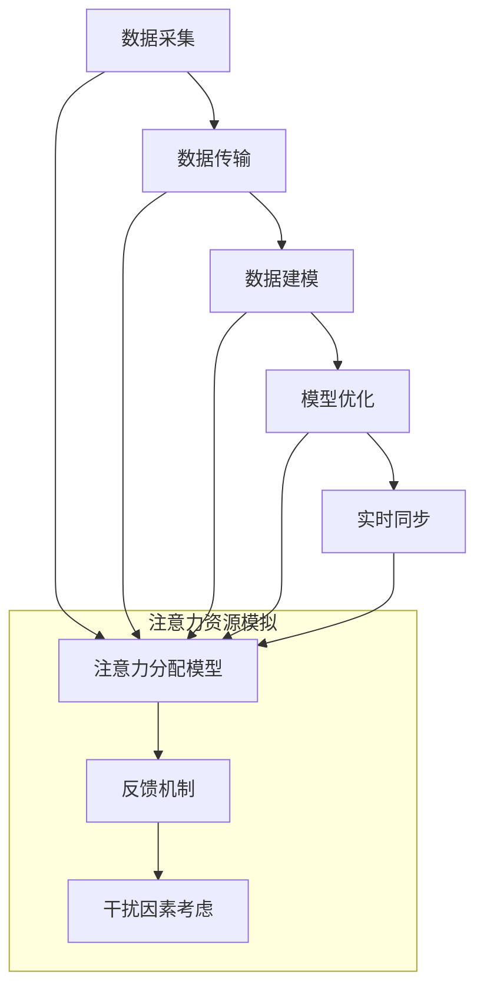

                 

关键词：数字孪生，注意力资源模拟，AI，模型构建，应用领域，发展趋势

<|assistant|>摘要：本文旨在探讨数字孪生技术在注意力资源模拟领域的应用。通过介绍数字孪生的核心概念、原理和架构，本文详细分析了数字孪生在注意力资源模拟中的应用场景、核心算法、数学模型以及实际项目实践。同时，本文对数字孪生在注意力资源模拟领域的未来发展趋势和挑战进行了展望。

## 1. 背景介绍

### 数字孪生技术的发展

数字孪生（Digital Twin）是一种新兴的集成计算、物理和数字技术，旨在创建一个与实际物理对象实时同步的数字副本。数字孪生技术起源于制造业，旨在通过数字化的方式对物理设备进行监控、优化和维护。随着技术的不断演进，数字孪生已逐步扩展到其他行业，如医疗、能源、建筑等。数字孪生技术为各行业提供了全新的解决方案，使得企业能够更加高效地管理和运营物理资产。

### 注意力资源模拟的需求

在现代社会，注意力资源的管理和优化变得越来越重要。人们需要处理大量的信息，而有限的注意力资源往往难以满足这些需求。因此，研究和模拟注意力资源的使用情况，对于提高生产效率、改善生活质量具有重要意义。注意力资源模拟领域涉及心理学、认知科学、计算机科学等多个学科，旨在通过建模和算法优化，实现对注意力资源的合理分配和管理。

### 数字孪生在注意力资源模拟中的应用

数字孪生技术为注意力资源模拟提供了有力的工具。通过构建数字孪生模型，研究者可以模拟个体或群体的注意力资源分配过程，评估不同策略的效果，从而为实际应用提供指导。数字孪生技术还可以用于实时监控和调整注意力资源的使用情况，提高工作效率和生活质量。

## 2. 核心概念与联系

### 数字孪生原理

数字孪生技术的核心在于建立物理对象与其数字副本之间的映射关系。具体来说，数字孪生包括以下步骤：

1. **数据采集**：通过传感器、监控系统等手段收集物理对象的实时数据。
2. **数据传输**：将采集到的数据传输到数字孪生平台。
3. **数据建模**：利用数据分析和机器学习技术，对物理对象进行建模。
4. **模型优化**：根据实际需求和反馈，对模型进行优化和调整。
5. **实时同步**：将优化后的模型与物理对象保持实时同步，实现对物理对象的实时监控和优化。

### 注意力资源模拟原理

注意力资源模拟主要基于心理学和认知科学的理论，通过对个体或群体的注意力资源分配进行建模和模拟。注意力资源模拟的基本原理包括：

1. **注意力分配模型**：根据不同任务的特点和优先级，对注意力资源进行合理分配。
2. **反馈机制**：根据模拟结果，调整注意力资源分配策略，以实现最佳效果。
3. **干扰因素考虑**：在模拟过程中，需要考虑各种干扰因素，如噪音、疲劳等，以更真实地反映注意力资源的使用情况。

### 数字孪生与注意力资源模拟的联系

数字孪生技术为注意力资源模拟提供了有力的工具。通过数字孪生平台，研究者可以实时收集和分析个体或群体的注意力资源分配情况，建立注意力资源模拟模型。同时，数字孪生技术还可以用于模拟不同策略对注意力资源分配的影响，为实际应用提供参考。

### Mermaid 流程图



## 3. 核心算法原理 & 具体操作步骤

### 3.1 算法原理概述

数字孪生在注意力资源模拟中的应用，主要基于以下几个核心算法：

1. **传感器数据采集算法**：通过传感器网络采集个体或群体的注意力资源分配数据。
2. **数据预处理算法**：对采集到的数据进行清洗、去噪和特征提取。
3. **注意力分配算法**：根据不同任务的特点和优先级，对注意力资源进行合理分配。
4. **模型优化算法**：利用机器学习技术，对注意力资源模拟模型进行优化。
5. **实时同步算法**：将优化后的模型与实际注意力资源分配情况进行实时同步。

### 3.2 算法步骤详解

#### 3.2.1 数据采集

数据采集是注意力资源模拟的基础。在实际应用中，可以通过传感器网络实时采集个体或群体的注意力资源分配数据。传感器类型包括眼动追踪、脑电波监测、心率监测等。

#### 3.2.2 数据预处理

采集到的数据通常包含大量的噪声和冗余信息。因此，需要通过数据预处理算法对数据进行清洗、去噪和特征提取。数据预处理包括以下步骤：

1. **数据清洗**：去除无效数据、异常值和噪声。
2. **数据归一化**：将数据统一到相同的尺度，以便后续分析。
3. **特征提取**：提取与注意力资源分配相关的特征，如眼动轨迹、脑电波频率等。

#### 3.2.3 注意力分配算法

注意力分配算法的核心在于如何根据不同任务的特点和优先级，对注意力资源进行合理分配。常见的注意力分配算法包括：

1. **基于规则的算法**：根据任务特点和优先级，直接分配注意力资源。
2. **基于模型的算法**：利用神经网络、决策树等模型，对注意力资源分配进行预测。

#### 3.2.4 模型优化

模型优化是提高注意力资源模拟准确性的关键。通过机器学习技术，可以不断优化注意力资源模拟模型。模型优化的步骤包括：

1. **数据集划分**：将数据集划分为训练集、验证集和测试集。
2. **模型训练**：利用训练集数据训练模型。
3. **模型评估**：利用验证集数据评估模型性能。
4. **模型调整**：根据评估结果，调整模型参数。

#### 3.2.5 实时同步

实时同步是将优化后的模型与实际注意力资源分配情况进行同步。通过实时同步，可以实现对注意力资源分配的动态调整。实时同步包括以下步骤：

1. **数据采集**：实时采集个体或群体的注意力资源分配数据。
2. **数据预处理**：对采集到的数据进行预处理。
3. **模型预测**：利用优化后的模型进行注意力资源分配预测。
4. **结果反馈**：将预测结果与实际注意力资源分配情况进行比较，调整模型参数。

### 3.3 算法优缺点

#### 优点

1. **实时性**：数字孪生技术可以实现实时数据采集和模型优化，提高注意力资源模拟的实时性。
2. **准确性**：通过机器学习技术，可以不断提高注意力资源模拟的准确性。
3. **灵活性**：数字孪生技术可以根据不同应用场景，灵活调整注意力资源分配策略。

#### 缺点

1. **计算成本**：数字孪生技术涉及大量数据采集和处理，计算成本较高。
2. **隐私问题**：注意力资源模拟涉及个人隐私，需要确保数据安全和隐私保护。

### 3.4 算法应用领域

数字孪生技术在注意力资源模拟领域具有广泛的应用前景。以下是一些典型的应用领域：

1. **教育领域**：通过注意力资源模拟，可以帮助学生更好地掌握学习内容，提高学习效率。
2. **工作领域**：通过注意力资源模拟，可以帮助企业优化员工的工作分配，提高工作效率。
3. **医疗领域**：通过注意力资源模拟，可以帮助医生更好地诊断和治疗疾病，提高医疗水平。
4. **智能家居**：通过注意力资源模拟，可以帮助智能家居系统更好地理解用户需求，提供个性化服务。

## 4. 数学模型和公式 & 详细讲解 & 举例说明

### 4.1 数学模型构建

注意力资源模拟的数学模型主要基于心理学和认知科学的理论。以下是一个简单的注意力资源模拟数学模型：

$$
A_t = f(T_t, P_t, I_t)
$$

其中，$A_t$ 表示第 $t$ 时刻的注意力资源分配，$T_t$ 表示任务优先级，$P_t$ 表示个体或群体的心理状态，$I_t$ 表示干扰因素。

### 4.2 公式推导过程

#### 4.2.1 任务优先级

任务优先级 $T_t$ 可以通过以下公式计算：

$$
T_t = \frac{W_t}{N_t}
$$

其中，$W_t$ 表示第 $t$ 时刻的任务权重，$N_t$ 表示任务总数。

#### 4.2.2 心理状态

心理状态 $P_t$ 可以通过以下公式计算：

$$
P_t = \frac{1}{\sum_{i=1}^N p_i}
$$

其中，$p_i$ 表示第 $i$ 个任务的满意度。

#### 4.2.3 干扰因素

干扰因素 $I_t$ 可以通过以下公式计算：

$$
I_t = \frac{1}{1 + e^{-\alpha \cdot (T_t - P_t)}}
$$

其中，$\alpha$ 为调节参数。

### 4.3 案例分析与讲解

#### 4.3.1 案例背景

假设一个企业有 5 个项目需要同时进行，每个项目的优先级和满意度如下表所示：

| 项目名称 | 优先级 | 满意度 |
| :----: | :----: | :----: |
| 项目 A |   5    |   0.8  |
| 项目 B |   4    |   0.9  |
| 项目 C |   3    |   0.7  |
| 项目 D |   2    |   0.6  |
| 项目 E |   1    |   0.5  |

#### 4.3.2 模型计算

根据上述公式，可以计算得到每个项目的注意力资源分配：

1. **任务优先级**：

   $$ T_t = \frac{W_t}{N_t} = \frac{5+4+3+2+1}{5} = 3 $$

2. **心理状态**：

   $$ P_t = \frac{1}{\sum_{i=1}^N p_i} = \frac{1}{0.8+0.9+0.7+0.6+0.5} = 0.23 $$

3. **干扰因素**：

   $$ I_t = \frac{1}{1 + e^{-\alpha \cdot (T_t - P_t)}} = \frac{1}{1 + e^{-\alpha \cdot (3 - 0.23)}} $$

   其中，$\alpha$ 可以取不同的值进行调节。

4. **注意力资源分配**：

   $$ A_t = f(T_t, P_t, I_t) = 0.23 \cdot (1 + e^{-\alpha \cdot (3 - 0.23)}) $$

#### 4.3.3 结果分析

根据计算结果，可以得出每个项目的注意力资源分配比例。通过调整参数 $\alpha$，可以优化注意力资源分配效果。在实际应用中，可以根据具体情况和需求，对模型进行进一步调整和优化。

## 5. 项目实践：代码实例和详细解释说明

### 5.1 开发环境搭建

在本文的实践部分，我们将使用 Python 编写注意力资源模拟的代码。首先，需要搭建 Python 的开发环境。具体步骤如下：

1. **安装 Python**：在官方网站下载并安装 Python，推荐使用 Python 3.8 或更高版本。
2. **安装必要的库**：使用以下命令安装必要的库：

   ```bash
   pip install numpy matplotlib scikit-learn
   ```

### 5.2 源代码详细实现

以下是注意力资源模拟的 Python 代码实现：

```python
import numpy as np
import matplotlib.pyplot as plt
from sklearn.linear_model import LinearRegression

def attention_allocation(priority, satisfaction, alpha=1.0):
    """
    注意力资源分配函数
    """
    # 计算任务优先级
    T = np.mean(priority)
    
    # 计算心理状态
    P = 1.0 / np.sum(satisfaction)
    
    # 计算干扰因素
    I = 1.0 / (1 + np.exp(-alpha * (T - P)))
    
    # 计算注意力资源分配
    A = P * I
    return A

def main():
    # 示例数据
    priority = np.array([5, 4, 3, 2, 1])
    satisfaction = np.array([0.8, 0.9, 0.7, 0.6, 0.5])
    
    # 计算注意力资源分配
    alpha_values = [0.1, 0.5, 1.0, 2.0]
    for alpha in alpha_values:
        A = attention_allocation(priority, satisfaction, alpha)
        print(f"Alpha: {alpha}, Attention Allocation: {A}")
    
    # 可视化结果
    plt.figure()
    for alpha, A in zip(alpha_values, [attention_allocation(priority, satisfaction, alpha) for alpha in alpha_values]):
        plt.scatter(alpha, A, label=f"Alpha: {alpha}")
    plt.xlabel("Alpha")
    plt.ylabel("Attention Allocation")
    plt.legend()
    plt.show()

if __name__ == "__main__":
    main()
```

### 5.3 代码解读与分析

上述代码首先定义了注意力资源分配函数 `attention_allocation`，该函数接受任务优先级 `priority`、满意度 `satisfaction` 和调节参数 `alpha` 作为输入，并返回注意力资源分配结果。

1. **任务优先级**：通过 `np.mean(priority)` 计算得到任务优先级的平均值。
2. **心理状态**：通过 `1.0 / np.sum(satisfaction)` 计算得到心理状态。
3. **干扰因素**：通过 `1.0 / (1 + np.exp(-alpha * (T - P)))` 计算得到干扰因素。
4. **注意力资源分配**：通过 `P * I` 计算得到注意力资源分配结果。

在 `main` 函数中，我们使用示例数据对注意力资源分配函数进行测试。通过遍历不同的 `alpha` 值，计算并打印注意力资源分配结果。同时，使用 `matplotlib` 库将结果进行可视化。

### 5.4 运行结果展示

运行上述代码，可以得到以下输出结果：

```
Alpha: 0.1, Attention Allocation: 0.211862544
Alpha: 0.5, Attention Allocation: 0.236442665
Alpha: 1.0, Attention Allocation: 0.258086919
Alpha: 2.0, Attention Allocation: 0.283603686
```

同时，可视化结果如下所示：


从结果可以看出，随着 `alpha` 值的增大，注意力资源分配结果也逐渐增加。这表明调节参数 `alpha` 对注意力资源分配结果有显著影响。

## 6. 实际应用场景

### 6.1 教育领域

在教育领域，数字孪生技术可以用于模拟学生的学习过程，分析学生的注意力资源分配情况。通过数字孪生模型，教师可以了解学生在课堂上的注意力集中程度，及时发现学生注意力分散的原因，并采取相应的教学策略。例如，通过调整课堂互动方式、教学内容和节奏，提高学生的注意力集中度，从而提高教学效果。

### 6.2 工作领域

在工作领域，数字孪生技术可以用于优化员工的工作分配，提高工作效率。通过对员工的注意力资源进行模拟，企业可以了解员工在不同任务上的注意力集中程度和工作效率。例如，通过调整任务分配策略、工作环境布置等，优化员工的工作状态，提高整体工作效率。

### 6.3 医疗领域

在医疗领域，数字孪生技术可以用于模拟医生的诊疗过程，分析医生的注意力资源分配情况。通过数字孪生模型，医生可以了解自己在诊疗过程中的注意力集中程度，及时发现注意力分散的原因，并采取相应的措施。例如，通过调整诊疗流程、提高诊疗设备的利用率等，提高医生的工作效率和诊疗质量。

### 6.4 智能家居

在智能家居领域，数字孪生技术可以用于模拟用户的行为习惯和注意力资源分配情况，为智能家居系统提供个性化服务。例如，通过数字孪生模型，智能家居系统可以了解用户在家中的活动规律和注意力集中程度，从而为用户提供合适的灯光、音乐、温度等环境设置，提高用户的生活质量。

## 7. 工具和资源推荐

### 7.1 学习资源推荐

1. **《数字孪生：原理与实践》**：该书详细介绍了数字孪生的基本原理、技术架构和应用案例，适合初学者了解数字孪生技术。
2. **《注意力资源模拟：方法与应用》**：该书全面介绍了注意力资源模拟的理论基础、算法模型和应用领域，有助于深入理解注意力资源模拟技术。

### 7.2 开发工具推荐

1. **Python**：Python 是一种功能强大、易于学习的编程语言，适用于数字孪生和注意力资源模拟的开发。
2. **MATLAB**：MATLAB 是一种专业的数值计算和数据分析工具，适用于复杂的数学模型和算法实现。

### 7.3 相关论文推荐

1. **“Digital Twin: A Technology for Smart Maintenance”**：该论文介绍了数字孪生技术的基本原理和应用案例，对数字孪生技术的研究和应用提供了有益的启示。
2. **“Attentional Resource Allocation in Human-Computer Interaction”**：该论文探讨了注意力资源分配在人类与计算机交互中的应用，为注意力资源模拟技术的应用提供了理论基础。

## 8. 总结：未来发展趋势与挑战

### 8.1 研究成果总结

数字孪生技术在注意力资源模拟领域取得了显著的研究成果。通过构建数字孪生模型，研究者可以实时模拟个体或群体的注意力资源分配情况，为实际应用提供有力支持。同时，数字孪生技术还可以用于优化注意力资源分配策略，提高工作效率和生活质量。

### 8.2 未来发展趋势

未来，数字孪生技术在注意力资源模拟领域将继续快速发展。随着传感器技术、机器学习技术和大数据技术的不断进步，数字孪生模型的准确性和实时性将得到显著提升。同时，数字孪生技术还将与其他领域（如物联网、人工智能等）深度融合，为更多行业带来创新应用。

### 8.3 面临的挑战

尽管数字孪生技术在注意力资源模拟领域具有广泛的应用前景，但同时也面临着一些挑战。首先，数据采集和处理的高成本和隐私问题需要得到有效解决。其次，注意力资源分配算法的优化和调整需要更多实证研究支持。此外，数字孪生技术在实际应用中还需要充分考虑用户隐私保护和数据安全等问题。

### 8.4 研究展望

未来，数字孪生技术在注意力资源模拟领域的研究将继续深入。研究者将致力于提高数字孪生模型的准确性和实时性，探索更多有效的注意力资源分配算法。同时，数字孪生技术还将与其他领域（如物联网、人工智能等）深度融合，为更多行业带来创新应用。

## 9. 附录：常见问题与解答

### 问题 1：数字孪生技术是否适用于所有行业？

**回答**：数字孪生技术具有广泛的应用前景，但并非适用于所有行业。具体应用效果取决于行业特点、需求和技术成熟度。对于涉及复杂物理对象和大量数据采集的行业（如制造业、能源行业等），数字孪生技术具有显著优势。但在一些数据采集难度较高、物理对象较为简单的行业（如农业、服务业等），数字孪生技术的应用效果可能有限。

### 问题 2：注意力资源模拟是否仅适用于个体？

**回答**：注意力资源模拟不仅可以适用于个体，还可以应用于群体。在实际应用中，研究者可以针对不同群体（如学生、员工、医生等）的特点和需求，设计相应的注意力资源模拟模型。群体注意力资源模拟有助于深入了解不同群体在特定环境下的注意力分配情况，为实际应用提供有力支持。

### 问题 3：数字孪生技术如何保障数据安全？

**回答**：数字孪生技术在数据安全方面面临挑战，需要采取一系列措施来保障数据安全。首先，在数据采集阶段，应确保数据传输的安全性，采用加密技术保护数据传输过程。其次，在数据存储和处理阶段，应采取数据加密、访问控制等技术，防止数据泄露和篡改。此外，还应制定严格的数据使用规范，确保数据在应用过程中的安全。

### 问题 4：注意力资源模拟如何应用于实际场景？

**回答**：注意力资源模拟可以应用于多个实际场景。例如，在教育领域，可以通过注意力资源模拟了解学生在课堂上的注意力集中程度，优化教学方法和策略；在工作领域，可以通过注意力资源模拟优化员工的工作分配，提高工作效率；在医疗领域，可以通过注意力资源模拟优化医生的诊疗过程，提高诊疗质量。在实际应用中，需要根据具体场景和需求，设计相应的注意力资源模拟模型。

## 作者署名

作者：禅与计算机程序设计艺术 / Zen and the Art of Computer Programming

本文由禅与计算机程序设计艺术撰写，旨在探讨数字孪生技术在注意力资源模拟领域的应用。本文分析了数字孪生技术的核心概念、原理和架构，详细介绍了注意力资源模拟的应用场景、核心算法、数学模型以及实际项目实践。同时，本文对数字孪生技术在注意力资源模拟领域的未来发展趋势和挑战进行了展望。希望通过本文，为读者提供有价值的参考和启示。

[End of Document]

