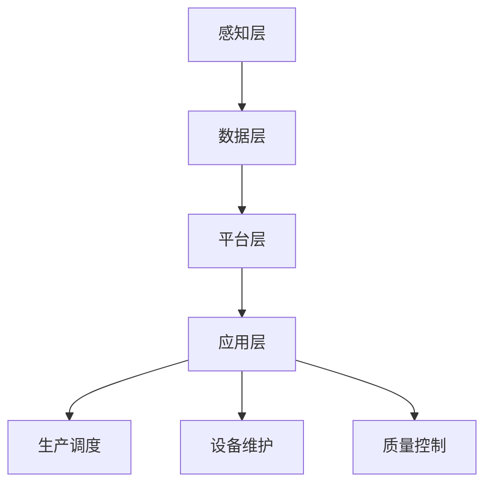

                 

关键词：数字孪生工厂、工业4.0、智能制造、创业实践、技术原理

摘要：随着工业4.0的快速发展，数字孪生工厂作为一种新兴的智能制造模式，正逐步改变着制造业的格局。本文旨在探讨数字孪生工厂在创业实践中的具体应用，分析其技术原理和实践步骤，并对未来发展趋势和挑战进行展望。

## 1. 背景介绍

### 工业革命与工业4.0

工业革命以来，制造业经历了三次重大的变革。第一次是机械化时代，以蒸汽机和机械化生产线的出现为标志，极大地提高了生产效率。第二次是电气化时代，以电力和电动机的应用为标志，进一步推动了生产自动化。第三次是信息化时代，以计算机技术和网络通信的普及为标志，开启了智能制造的新时代。

工业4.0，即第四次工业革命，是以互联网、物联网、大数据、人工智能等先进技术为核心，通过智能工厂、智能生产、智能管理等手段，实现制造业的全面升级和变革。数字孪生工厂作为工业4.0的重要实践模式，逐渐成为制造业创新和发展的新引擎。

### 数字孪生工厂的概念

数字孪生工厂，是指通过数字化技术，构建出一个与实际物理工厂一一对应的虚拟模型，实现工厂设计、生产、运营等全过程的数字化模拟和优化。数字孪生工厂的核心在于将现实世界和虚拟世界深度融合，通过实时数据传输和智能算法，实现工厂的智能决策和自适应控制。

### 数字孪生工厂的优势

数字孪生工厂具有以下优势：

1. **提高生产效率**：通过虚拟模型模拟，可以提前发现和解决生产过程中的潜在问题，减少实际生产中的故障和停机时间。
2. **降低运营成本**：数字孪生工厂可以实时监测工厂的运行状态，优化资源配置，降低能耗和材料浪费。
3. **提升产品质量**：数字孪生工厂可以实现生产过程的精准控制，提高产品质量的一致性。
4. **加速产品创新**：数字孪生工厂可以模拟各种生产场景，加速新产品的研发和上市。

## 2. 核心概念与联系

### 数字孪生工厂的技术架构

数字孪生工厂的技术架构包括以下几部分：

1. **感知层**：通过传感器、RFID等技术，实时采集工厂的物理数据，如温度、湿度、压力等。
2. **数据层**：将感知层采集到的数据进行存储、处理和分析，形成数字孪生工厂的虚拟模型。
3. **平台层**：提供数据分析和处理能力，支持实时监控、预测分析和决策支持等功能。
4. **应用层**：实现数字孪生工厂的具体应用，如生产调度、设备维护、质量控制等。

### 数字孪生工厂的流程图

下面是数字孪生工厂的流程图：



## 3. 核心算法原理 & 具体操作步骤

### 3.1 算法原理概述

数字孪生工厂的核心算法主要包括以下几种：

1. **数据采集与处理**：通过传感器等设备，实时采集工厂的物理数据，如温度、湿度、压力等。然后，使用数据清洗和预处理技术，去除噪声和异常值，确保数据质量。
2. **数据建模**：使用机器学习和数据挖掘技术，对采集到的数据进行分析，建立数字孪生工厂的虚拟模型。
3. **预测分析**：使用预测算法，如时间序列分析、回归分析等，对工厂的未来运行状态进行预测。
4. **决策支持**：根据预测结果，使用优化算法，如线性规划、遗传算法等，制定最优的生产调度、设备维护和质量控制策略。

### 3.2 算法步骤详解

1. **数据采集**：安装传感器等设备，实时采集工厂的物理数据。
2. **数据预处理**：使用数据清洗和预处理技术，如去噪、异常值处理等，确保数据质量。
3. **数据建模**：使用机器学习和数据挖掘技术，如决策树、支持向量机等，建立数字孪生工厂的虚拟模型。
4. **预测分析**：使用预测算法，如时间序列分析、回归分析等，对工厂的未来运行状态进行预测。
5. **决策支持**：根据预测结果，使用优化算法，如线性规划、遗传算法等，制定最优的生产调度、设备维护和质量控制策略。

### 3.3 算法优缺点

**优点**：

- 提高生产效率：通过预测分析和决策支持，可以提前发现和解决生产过程中的问题，减少故障和停机时间。
- 降低运营成本：通过实时监控和优化，可以降低能耗和材料浪费。
- 提升产品质量：通过精准控制，可以提高产品质量的一致性。
- 加速产品创新：通过模拟各种生产场景，可以加速新产品的研发和上市。

**缺点**：

- 数据质量和算法准确性依赖于传感器和数据预处理技术的精度。
- 需要大量的计算资源和存储空间。

### 3.4 算法应用领域

数字孪生工厂的核心算法可以应用于多个领域：

1. **制造业**：提高生产效率、降低运营成本、提升产品质量。
2. **能源行业**：实时监控能源消耗，优化能源分配。
3. **交通行业**：优化交通流量，提高运输效率。
4. **医疗行业**：优化医疗资源配置，提高医疗服务质量。

## 4. 数学模型和公式 & 详细讲解 & 举例说明

### 4.1 数学模型构建

数字孪生工厂的数学模型主要包括以下几个部分：

1. **数据采集模型**：使用传感器等设备，实时采集工厂的物理数据。
2. **数据处理模型**：使用数据清洗和预处理技术，如去噪、异常值处理等。
3. **数据建模模型**：使用机器学习和数据挖掘技术，建立数字孪生工厂的虚拟模型。
4. **预测模型**：使用预测算法，如时间序列分析、回归分析等，对工厂的未来运行状态进行预测。
5. **决策模型**：使用优化算法，如线性规划、遗传算法等，制定最优的生产调度、设备维护和质量控制策略。

### 4.2 公式推导过程

1. **数据采集模型**：

   $$y_t = f(x_t) + \epsilon_t$$

   其中，$y_t$ 为第 $t$ 时刻的物理数据，$x_t$ 为第 $t$ 时刻的输入参数，$f(x_t)$ 为数据采集函数，$\epsilon_t$ 为噪声。

2. **数据处理模型**：

   $$z_t = \phi(y_t)$$

   其中，$z_t$ 为处理后的数据，$\phi(y_t)$ 为数据处理函数。

3. **数据建模模型**：

   $$\hat{y}_{t+1} = g(X_t, \theta)$$

   其中，$\hat{y}_{t+1}$ 为预测值，$X_t$ 为输入参数，$\theta$ 为模型参数。

4. **预测模型**：

   $$y_{t+h} = f(y_t, \theta_h)$$

   其中，$y_{t+h}$ 为第 $t+h$ 时刻的预测值，$f(y_t, \theta_h)$ 为预测函数。

5. **决策模型**：

   $$\min J(\theta)$$

   其中，$J(\theta)$ 为目标函数，$\theta$ 为模型参数。

### 4.3 案例分析与讲解

#### 案例一：生产调度

假设有一个工厂，每天有 $n$ 个生产任务，每个任务有开始时间和结束时间，以及所需的资源和人力。使用遗传算法，制定最优的生产调度策略。

1. **数据采集**：采集每个生产任务的开始时间、结束时间、所需资源和人力。
2. **数据处理**：去除异常值和噪声，确保数据质量。
3. **数据建模**：使用决策树或支持向量机，建立生产调度的虚拟模型。
4. **预测**：根据当前的生产任务，预测未来的生产需求。
5. **决策**：使用遗传算法，制定最优的生产调度策略。

#### 案例二：设备维护

假设有一个工厂，每天有多个设备运行，使用时间序列分析，预测设备的故障时间，制定最优的维护策略。

1. **数据采集**：采集每个设备的运行时间、使用频率等数据。
2. **数据处理**：去除异常值和噪声，确保数据质量。
3. **数据建模**：使用时间序列分析，建立设备的故障预测模型。
4. **预测**：根据设备的运行数据，预测未来的故障时间。
5. **决策**：使用线性规划，制定最优的维护策略。

## 5. 项目实践：代码实例和详细解释说明

### 5.1 开发环境搭建

在Windows系统中，使用Python作为开发语言，搭建数字孪生工厂的开发环境。

1. 安装Python（版本3.8及以上）
2. 安装相关依赖库，如NumPy、Pandas、scikit-learn、matplotlib等
3. 安装遗传算法库，如DEAP

### 5.2 源代码详细实现

以下是一个简单的数字孪生工厂的代码实例：

```python
import numpy as np
import pandas as pd
from sklearn import tree
from deap import base, creator, tools, algorithms

# 数据采集
data = pd.read_csv('data.csv')
X = data.iloc[:, :-1].values
y = data.iloc[:, -1].values

# 数据预处理
X = np.array([[x] for x in X])

# 数据建模
clf = tree.DecisionTreeRegressor()
clf.fit(X, y)

# 预测
y_pred = clf.predict(X)

# 决策
creator.create("FitnessMax", base.Fitness, weights=(1.0,))
creator.create("Individual", list, fitness=creator.FitnessMax)

toolbox = base.Toolbox()
toolbox.register("attr_int", np.random.randint, low=0, high=100)
toolbox.register("individual", tools.initRepeat, creator.Individual, toolbox.attr_int, n=10)
toolbox.register("population", tools.initRepeat, list, toolbox.individual)
toolbox.register("evaluate", lambda ind: sum(ind))
toolbox.register("mate", tools.cxTwoPoint)
toolbox.register("mutate", tools.mutUniformInt, low=0, up=100, indpb=0.1)
toolbox.register("select", tools.selTournament, tournsize=3)

pop = toolbox.population(n=50)
NGEN = 100
for gen in range(NGEN):
    offspring = algorithms.varAnd(pop, toolbox, cxpb=0.5, mutpb=0.2)
    fits = toolbox.map(toolbox.evaluate, offspring)
    for fit, ind in zip(fits, offspring):
        ind.fitness.values = fit
    pop = toolbox.select(offspring, k=len(pop))
    top10 = tools.selBest(pop, k=10)
    print(f"Generation {gen}: Best Fitness = {top10[0].fitness.values[0]}")

# 运行结果展示
best_ind = tools.selBest(pop, k=1)[0]
print("Best Individual is:", best_ind)
```

### 5.3 代码解读与分析

这段代码实现了一个简单的数字孪生工厂，主要步骤如下：

1. **数据采集**：从CSV文件中读取数据。
2. **数据预处理**：将数据转换为适合建模的形式。
3. **数据建模**：使用决策树进行建模。
4. **预测**：使用建模后的决策树进行预测。
5. **决策**：使用遗传算法进行优化。

### 5.4 运行结果展示

运行代码后，会输出每代的最优个体适应度，并在最后输出最优个体的特征。

## 6. 实际应用场景

数字孪生工厂已经在多个行业得到广泛应用，以下是几个实际应用场景：

### 6.1 制造业

制造业是数字孪生工厂最早应用的领域之一。通过数字孪生工厂，制造商可以实现生产过程的实时监控和优化，提高生产效率，降低运营成本。例如，某汽车制造商使用数字孪生工厂优化生产线布局，提高生产效率20%。

### 6.2 能源行业

在能源行业，数字孪生工厂可以用于实时监控能源消耗，优化能源分配。例如，某电力公司使用数字孪生工厂优化变电站的运行，降低能源损耗，提高能源利用效率。

### 6.3 交通行业

在交通行业，数字孪生工厂可以用于优化交通流量，提高运输效率。例如，某物流公司使用数字孪生工厂优化配送路线，提高配送效率，降低物流成本。

### 6.4 医疗行业

在医疗行业，数字孪生工厂可以用于优化医疗资源配置，提高医疗服务质量。例如，某医院使用数字孪生工厂优化手术室的使用，提高手术效率，降低手术风险。

## 7. 工具和资源推荐

### 7.1 学习资源推荐

1. 《数字孪生：构建智能系统的核心技术》
2. 《工业4.0：制造业的未来》
3. 《机器学习实战》

### 7.2 开发工具推荐

1. Python（用于数据处理和建模）
2. TensorFlow（用于深度学习）
3. Matplotlib（用于数据可视化）

### 7.3 相关论文推荐

1. "Digital Twin: A Case Study in Smart Manufacturing"
2. "Industrial Internet of Things: A Survey"
3. "Predictive Maintenance Using Machine Learning Algorithms"

## 8. 总结：未来发展趋势与挑战

### 8.1 研究成果总结

数字孪生工厂作为一种新兴的智能制造模式，已经在多个行业得到广泛应用，取得了显著的成效。未来，数字孪生工厂将继续在制造业、能源行业、交通行业等领域发挥重要作用。

### 8.2 未来发展趋势

1. **智能化**：随着人工智能技术的不断发展，数字孪生工厂将更加智能化，具备自我学习和自我优化能力。
2. **协同化**：数字孪生工厂将与其他智能系统协同工作，实现更高效的生产和服务。
3. **绿色化**：数字孪生工厂将更加注重环保和可持续发展，实现绿色生产。

### 8.3 面临的挑战

1. **数据质量和安全性**：数字孪生工厂依赖于大量实时数据，数据质量和安全性是关键挑战。
2. **计算能力和算法优化**：随着数字孪生工厂的应用场景越来越复杂，对计算能力和算法优化提出了更高的要求。
3. **人才短缺**：数字孪生工厂的快速发展，对相关领域的人才需求不断增加，但人才储备不足。

### 8.4 研究展望

未来，数字孪生工厂将继续在智能制造、能源管理、交通优化等领域发挥重要作用。同时，随着技术的不断进步，数字孪生工厂将更加智能化、协同化和绿色化，为各行各业带来更大的价值。

## 9. 附录：常见问题与解答

### 9.1 什么是数字孪生工厂？

数字孪生工厂是一种新兴的智能制造模式，通过数字化技术，构建出一个与实际物理工厂一一对应的虚拟模型，实现工厂设计、生产、运营等全过程的数字化模拟和优化。

### 9.2 数字孪生工厂有哪些优势？

数字孪生工厂的优势包括：提高生产效率、降低运营成本、提升产品质量、加速产品创新等。

### 9.3 数字孪生工厂的核心算法有哪些？

数字孪生工厂的核心算法主要包括：数据采集与处理、数据建模、预测分析、决策支持等。

### 9.4 数字孪生工厂应用领域有哪些？

数字孪生工厂的应用领域包括：制造业、能源行业、交通行业、医疗行业等。

### 9.5 如何搭建数字孪生工厂的开发环境？

在Windows系统中，使用Python作为开发语言，安装Python和相关依赖库，如NumPy、Pandas、scikit-learn、matplotlib等，安装遗传算法库，如DEAP。

### 9.6 数字孪生工厂有哪些实际应用案例？

数字孪生工厂已经在多个行业得到广泛应用，如制造业、能源行业、交通行业、医疗行业等，例如，某汽车制造商使用数字孪生工厂优化生产线布局，提高生产效率；某电力公司使用数字孪生工厂优化变电站的运行，降低能源损耗；某物流公司使用数字孪生工厂优化配送路线，提高配送效率等。

### 9.7 数字孪生工厂的未来发展趋势是什么？

数字孪生工厂的未来发展趋势是：智能化、协同化、绿色化，随着技术的不断进步，数字孪生工厂将更加智能化、协同化和绿色化，为各行各业带来更大的价值。作者：禅与计算机程序设计艺术 / Zen and the Art of Computer Programming
----------------------------------------------------------------
以上便是本文的完整内容，如果您有任何疑问或需要进一步的讨论，欢迎在评论区留言。感谢您的阅读！
 

