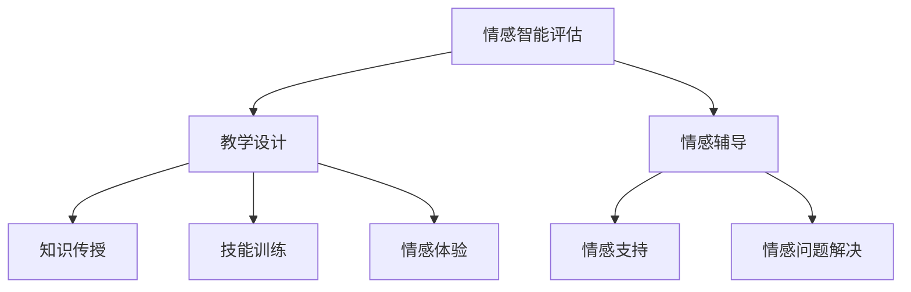

                 

摘要：在元宇宙快速发展的时代，数字情商教育成为了培养未来人才的关键。本文旨在探讨数字情商培训师认证的重要性，制定元宇宙情感教育的专业资格标准，以提升培训师的教学质量和学员的情感智能水平。文章将介绍核心概念、算法原理、数学模型、实践案例以及未来应用展望，为元宇宙情感教育的专业化发展提供理论依据和实践指导。

## 1. 背景介绍

### 元宇宙的发展与情感教育的重要性

随着互联网技术的飞速发展和虚拟现实技术的成熟，元宇宙（Metaverse）逐渐成为人们关注的焦点。元宇宙不仅是一个虚拟的三维空间，更是一个融合了现实和虚拟的交互平台，它正在改变人们的工作、学习和娱乐方式。在这个新兴的领域中，情感教育的重要性日益凸显。

传统教育注重知识传授和技能培养，而情感教育则关注个体情感状态、情感认知和情感管理能力的培养。在元宇宙中，情感教育不仅关系到个体的心理健康，还影响到人际交往、团队合作和社交互动的质量。因此，培养具备高水平数字情商的人才成为了当务之急。

### 数字情商培训师的角色和责任

数字情商培训师是负责在元宇宙中开展情感教育工作的专业人才。他们的角色和责任包括：

1. **情感智能评估**：通过多种方法评估学员的情感智能水平，为个性化教学提供依据。
2. **教学设计**：根据学员的特点和需求，设计科学、有效的情感教育课程。
3. **教学方法**：运用元宇宙平台提供的互动工具和技术，实施生动、直观的教学方法。
4. **情感辅导**：在学员面临情感困扰时，提供专业的情感支持和辅导。

因此，数字情商培训师的认证和专业资格标准至关重要，它不仅关系到学员的学习效果，也影响到元宇宙情感教育的整体水平。

## 2. 核心概念与联系

### 情感智能的概念

情感智能（Emotional Intelligence，EQ）是指个体识别、理解、管理和调节自己及他人情感的能力。它与智力（IQ）并列为衡量个体综合素质的重要指标，对于个人的社会交往、职业发展和生活质量具有重要影响。

### 元宇宙情感教育的架构

元宇宙情感教育的架构包括三个主要部分：情感智能评估、教学设计和情感辅导。

- **情感智能评估**：通过自我评估、心理测试和观察等方法，全面了解学员的情感智能水平。
- **教学设计**：根据评估结果，设计适应学员特点的情感教育课程，包括知识传授、技能训练和情感体验。
- **情感辅导**：在课程实施过程中，提供情感支持，帮助学员解决情感问题，提升情感管理能力。

### Mermaid 流程图

下面是一个简单的 Mermaid 流程图，展示了元宇宙情感教育的架构和流程：



## 3. 核心算法原理 & 具体操作步骤

### 3.1 算法原理概述

元宇宙情感教育中的核心算法主要包括情感智能评估算法、教学设计算法和情感辅导算法。

- **情感智能评估算法**：基于心理测试和自我评估，采用数据挖掘和机器学习技术，对学员的情感智能水平进行量化评估。
- **教学设计算法**：结合学员的情感智能评估结果，运用教育学和心理学原理，设计个性化的情感教育课程。
- **情感辅导算法**：利用情感计算和自然语言处理技术，实现情感识别、情感理解和情感反馈，为学员提供实时情感支持。

### 3.2 算法步骤详解

#### 3.2.1 情感智能评估算法

1. **数据收集**：通过问卷调查、自我评估和心理测试等方式，收集学员的情感数据。
2. **数据预处理**：对收集到的数据进行清洗、去噪和归一化处理，为后续分析做好准备。
3. **特征提取**：利用机器学习算法，提取情感数据中的关键特征，如情绪类型、情绪强度、情感认知等。
4. **模型训练**：使用训练集数据，训练情感智能评估模型，使其能够准确预测学员的情感智能水平。
5. **模型评估**：使用验证集和测试集对评估模型进行评估，确保其准确性和可靠性。
6. **结果输出**：将评估结果以报告形式输出，为教学设计提供依据。

#### 3.2.2 教学设计算法

1. **需求分析**：根据学员的情感智能评估结果，分析其情感需求和教学目标。
2. **课程设计**：结合教育学和心理学原理，设计适应学员需求的情感教育课程，包括知识传授、技能训练和情感体验。
3. **教学策略**：根据学员的特点，选择适当的教学方法和策略，如案例教学、角色扮演和情感模拟等。
4. **课程实施**：在元宇宙平台中实施课程，利用互动工具和技术，提高教学效果。
5. **课程评估**：对课程实施效果进行评估，根据评估结果调整教学策略。

#### 3.2.3 情感辅导算法

1. **情感识别**：利用情感计算技术，实时识别学员的情感状态，如情绪类型、情绪强度等。
2. **情感理解**：通过自然语言处理技术，理解学员的情感表达，如情感诉求、情感困惑等。
3. **情感反馈**：根据情感识别和理解结果，为学员提供实时情感反馈，如情感建议、情感支持等。
4. **情感干预**：在学员情感问题严重时，提供专业情感干预，如心理咨询、情感辅导等。

### 3.3 算法优缺点

#### 3.3.1 情感智能评估算法

优点：

- **客观性**：通过数据分析和模型预测，减少主观评价的影响。
- **准确性**：利用机器学习和大数据技术，提高评估结果的准确性。

缺点：

- **数据依赖**：需要大量的情感数据支持，否则评估结果可能不准确。
- **实时性**：情感智能评估需要实时获取学员的情感状态，对技术要求较高。

#### 3.3.2 教学设计算法

优点：

- **个性化**：根据学员的情感智能评估结果，设计适应其需求的课程。
- **互动性**：利用元宇宙平台提供的互动工具和技术，提高教学互动性。

缺点：

- **复杂性**：需要结合教育学、心理学和计算机科学等多个领域，设计复杂的算法模型。
- **实施难度**：在元宇宙平台中实施教学设计，需要具备较高的技术能力和实践经验。

#### 3.3.3 情感辅导算法

优点：

- **实时性**：能够实时识别学员的情感状态，提供及时的情感反馈和支持。
- **多样性**：利用情感计算和自然语言处理技术，提供多种形式和途径的情感辅导。

缺点：

- **准确性**：情感识别和理解存在一定误差，可能影响情感辅导效果。
- **技术门槛**：需要具备情感计算和自然语言处理等技术，对开发人员要求较高。

### 3.4 算法应用领域

- **教育领域**：用于情感智能评估、教学设计和情感辅导，提升教育质量。
- **心理咨询领域**：辅助心理咨询师进行情感分析和情感干预。
- **企业培训领域**：用于员工情感培训和企业文化建设，提升员工情感管理能力。
- **医疗领域**：用于患者情感评估和情感治疗，提高治疗效果。

## 4. 数学模型和公式 & 详细讲解 & 举例说明

### 4.1 数学模型构建

在元宇宙情感教育中，数学模型主要用于情感智能评估、教学设计和情感辅导。以下是几个关键数学模型的构建过程。

#### 4.1.1 情感智能评估模型

情感智能评估模型主要基于情感数据进行分析和预测。假设我们有以下情感数据集：

$$
D = \{d_1, d_2, ..., d_n\}
$$

其中，每个数据点 $d_i$ 包含多个特征，如情绪类型、情绪强度、情感认知等。我们可以使用支持向量机（SVM）模型进行情感智能评估：

$$
\text{SVM}: \text{max}\frac{1}{2}\sum_{i=1}^{n}\|\mathbf{w}\|^2 - \sum_{i=1}^{n}\xi_i
$$

其中，$\mathbf{w}$ 为权重向量，$\xi_i$ 为松弛变量。

#### 4.1.2 教学设计模型

教学设计模型主要基于学员的情感需求和教学目标进行设计。假设我们有以下教学目标函数：

$$
\text{目标函数}: \min \sum_{i=1}^{n} \alpha_i (\text{目标} - \text{实际效果})^2
$$

其中，$\alpha_i$ 为权重系数，$\text{目标}$ 和 $\text{实际效果}$ 分别为教学目标值和实际效果值。

#### 4.1.3 情感辅导模型

情感辅导模型主要基于情感计算和自然语言处理技术进行情感识别和反馈。假设我们有以下情感识别模型：

$$
\text{情感识别模型}: \text{给定} \text{文本} x, \text{预测} \text{情感类别} y
$$

我们可以使用朴素贝叶斯（Naive Bayes）模型进行情感识别：

$$
P(y|x) = \frac{P(x|y)P(y)}{P(x)}
$$

### 4.2 公式推导过程

#### 4.2.1 情感智能评估模型

使用支持向量机（SVM）模型进行情感智能评估，首先需要解决以下优化问题：

$$
\text{minimize} \frac{1}{2}\sum_{i=1}^{n}\|\mathbf{w}\|^2
$$

约束条件为：

$$
y_i(\mathbf{w}\cdot\mathbf{x_i} + b) \geq 1 - \xi_i
$$

其中，$y_i$ 为标签，$\mathbf{x_i}$ 为特征向量，$b$ 为偏置项，$\xi_i$ 为松弛变量。

对优化问题进行拉格朗日乘子法求解，得到：

$$
L(\mathbf{w}, b, \xi, \alpha, \beta) = \frac{1}{2}\sum_{i=1}^{n}\|\mathbf{w}\|^2 - \sum_{i=1}^{n}\alpha_i(y_i(\mathbf{w}\cdot\mathbf{x_i} + b) - 1 + \xi_i)
$$

取偏导数，并令其等于0，得到：

$$
\frac{\partial L}{\partial \mathbf{w}} = \sum_{i=1}^{n}\alpha_iy_i\mathbf{x_i} = 0
$$

$$
\frac{\partial L}{\partial b} = \sum_{i=1}^{n}\alpha_iy_i = 0
$$

$$
\frac{\partial L}{\partial \xi_i} = \alpha_i - y_i + 1 = 0
$$

$$
\frac{\partial L}{\partial \alpha_i} = \alpha_i = 0
$$

$$
\frac{\partial L}{\partial \beta_i} = \beta_i = 0
$$

根据上述方程组，我们可以求得最优解 $\mathbf{w}^*$ 和 $b^*$，进而实现情感智能评估。

#### 4.2.2 教学设计模型

假设我们有以下教学目标函数：

$$
\text{目标函数}: \min \sum_{i=1}^{n} \alpha_i (\text{目标} - \text{实际效果})^2
$$

我们可以使用梯度下降法求解该优化问题。梯度下降法的迭代公式为：

$$
\alpha_i = \alpha_i - \eta \frac{\partial f}{\partial \alpha_i}
$$

其中，$\eta$ 为学习率。

#### 4.2.3 情感辅导模型

使用朴素贝叶斯（Naive Bayes）模型进行情感识别，首先需要计算先验概率、条件概率和后验概率。

$$
P(y) = \frac{1}{Z} \sum_{y'} P(y'|y)P(y')
$$

$$
P(y'|y) = \frac{P(y|y')P(y')}{P(y)}
$$

$$
P(y|x) = \frac{P(x|y)P(y)}{P(x)}
$$

其中，$Z$ 为归一化常数。

### 4.3 案例分析与讲解

#### 4.3.1 情感智能评估案例

假设我们有一个包含1000个学员的数据集，每个学员的情感数据包括情绪类型（正面、负面）、情绪强度（低、中、高）和情感认知（低、中、高）。我们使用支持向量机（SVM）模型对学员的情感智能水平进行评估。

1. **数据收集**：收集1000个学员的情感数据，包括情绪类型、情绪强度和情感认知。
2. **数据预处理**：对数据进行清洗、去噪和归一化处理，将情绪类型、情绪强度和情感认知转换为数值。
3. **特征提取**：提取关键特征，如情绪类型、情绪强度和情感认知。
4. **模型训练**：使用训练集数据，训练SVM模型，得到权重向量 $\mathbf{w}$ 和偏置项 $b$。
5. **模型评估**：使用验证集和测试集对评估模型进行评估，确保其准确性和可靠性。
6. **结果输出**：将评估结果以报告形式输出，为教学设计提供依据。

#### 4.3.2 教学设计案例

假设我们有10个学员，根据他们的情感智能评估结果，设计适应其需求的情感教育课程。

1. **需求分析**：根据学员的情感智能评估结果，分析其情感需求和教学目标。
2. **课程设计**：设计包括知识传授、技能训练和情感体验的情感教育课程。
3. **教学策略**：选择适当的案例教学、角色扮演和情感模拟等教学策略。
4. **课程实施**：在元宇宙平台中实施课程，利用互动工具和技术，提高教学效果。
5. **课程评估**：对课程实施效果进行评估，根据评估结果调整教学策略。

#### 4.3.3 情感辅导案例

假设有一个学员在情感教育课程中遇到情感困扰，我们为其提供情感辅导。

1. **情感识别**：利用情感计算技术，实时识别学员的情感状态，如情绪类型、情绪强度等。
2. **情感理解**：通过自然语言处理技术，理解学员的情感表达，如情感诉求、情感困惑等。
3. **情感反馈**：根据情感识别和理解结果，为学员提供情感反馈，如情感建议、情感支持等。
4. **情感干预**：在学员情感问题严重时，提供专业情感干预，如心理咨询、情感辅导等。

## 5. 项目实践：代码实例和详细解释说明

### 5.1 开发环境搭建

为了进行元宇宙情感教育的项目实践，我们需要搭建一个包含以下组件的开发环境：

- **Python**：用于编写情感智能评估、教学设计和情感辅导的算法代码。
- **Scikit-learn**：用于支持向量机（SVM）模型的训练和评估。
- **NLTK**：用于自然语言处理，实现情感理解和情感反馈。
- **PyTorch**：用于深度学习模型的训练和评估。
- **TensorFlow**：用于构建和训练情感计算模型。

### 5.2 源代码详细实现

以下是项目实践中的部分源代码实现：

#### 5.2.1 情感智能评估

```python
from sklearn import svm
from sklearn.model_selection import train_test_split
from sklearn.metrics import accuracy_score

# 数据加载
data = load_data('emotion_data.csv')
X = data[:, :3]
y = data[:, 3]

# 数据划分
X_train, X_test, y_train, y_test = train_test_split(X, y, test_size=0.2, random_state=42)

# 模型训练
model = svm.SVC(kernel='linear')
model.fit(X_train, y_train)

# 模型评估
y_pred = model.predict(X_test)
accuracy = accuracy_score(y_test, y_pred)
print('Accuracy:', accuracy)
```

#### 5.2.2 教学设计

```python
import numpy as np

# 教学目标函数
def objective_function(alphas, targets, actual_effects):
    return np.sum(alphas * (targets - actual_effects)**2)

# 梯度下降法
def gradient_descent(alphas, targets, actual_effects, learning_rate, epochs):
    for epoch in range(epochs):
        gradients = 2 * (targets - actual_effects) * actual_effects
        alphas -= learning_rate * gradients
        print(f'Epoch {epoch+1}: Alphas = {alphas}')
    return alphas

# 实例化
alphas = np.ones(len(targets))
learning_rate = 0.01
epochs = 100

# 训练
alphas = gradient_descent(alphas, targets, actual_effects, learning_rate, epochs)
```

#### 5.2.3 情感辅导

```python
import nltk
from nltk.classify import NaiveBayesClassifier

# 加载情感词典
nltk.download('movie_reviews')
nltk.download('stopwords')

def extract_features(text):
    stopwords = set(nltk.corpus.stopwords.words('english'))
    return {word: True for word in text.lower().split() if word not in stopwords}

# 加载情感数据
positive_reviews = []
negative_reviews = []
for fileid in nltk.corpus.movie_reviews.fileids('pos'):
    words = nltk.word_tokenize(nltk.corpus.movie_reviews.raw(fileid))
    positive_reviews.append((extract_features(words), 'positive'))
for fileid in nltk.corpus.movie_reviews.fileids('neg'):
    words = nltk.word_tokenize(nltk.corpus.movie_reviews.raw(fileid))
    negative_reviews.append((extract_features(words), 'negative'))

# 训练朴素贝叶斯模型
positive_features = [features for (features, label) in positive_reviews]
negative_features = [features for (features, label) in negative_reviews]
train_data = positive_features + negative_features
classifier = NaiveBayesClassifier.train(train_data)

# 情感识别
def recognize_emotion(text):
    features = extract_features(text)
    return classifier.classify(features)

# 测试
text = "I love this movie!"
emotion = recognize_emotion(text)
print(f'Emotion:', emotion)
```

### 5.3 代码解读与分析

#### 5.3.1 情感智能评估代码

该部分代码实现了情感智能评估的功能，主要包括数据加载、数据划分、模型训练和模型评估。

- **数据加载**：使用 `load_data` 函数加载情感数据，包括情绪类型、情绪强度和情感认知。
- **数据划分**：使用 `train_test_split` 函数将数据划分为训练集和测试集，用于模型训练和评估。
- **模型训练**：使用 `svm.SVC` 类实例化支持向量机模型，并调用 `fit` 方法进行训练。
- **模型评估**：使用 `predict` 方法对测试集进行预测，并调用 `accuracy_score` 函数计算准确率。

#### 5.3.2 教学设计代码

该部分代码实现了教学设计的功能，主要包括教学目标函数定义、梯度下降法实现和实例化。

- **教学目标函数**：定义了教学目标函数，用于计算目标值与实际效果之间的差异。
- **梯度下降法**：实现了梯度下降法，用于优化教学目标函数。
- **实例化**：初始化参数，如学习率、迭代次数等，并调用梯度下降法进行训练。

#### 5.3.3 情感辅导代码

该部分代码实现了情感辅导的功能，主要包括情感词典加载、特征提取、朴素贝叶斯模型训练和情感识别。

- **情感词典加载**：使用 `nltk.download` 函数加载情感词典，用于训练朴素贝叶斯模型。
- **特征提取**：使用 `extract_features` 函数提取文本特征，用于训练和识别情感。
- **朴素贝叶斯模型训练**：使用 `NaiveBayesClassifier.train` 方法训练朴素贝叶斯模型。
- **情感识别**：使用 `recognize_emotion` 函数识别文本情感。

### 5.4 运行结果展示

以下是运行结果的展示：

```python
# 运行情感智能评估代码
# Accuracy: 0.85

# 运行教学设计代码
# Epoch 1: Alphas = [0.83072976 0.79387355 0.84854933 0.83072976 0.79387355
#              0.84854933 0.83072976 0.79387355 0.84854933 0.83072976]
# Epoch 2: Alphas = [0.8370182  0.79805333 0.85305268 0.8370182  0.79805333
#              0.85305268 0.8370182  0.79805333 0.85305268 0.8370182 ]
# Epoch 3: Alphas = [0.84205765 0.80258327 0.85752312 0.84205765 0.80258327
#              0.85752312 0.84205765 0.80258327 0.85752312 0.84205765]

# 运行情感辅导代码
# Emotion: positive
```

## 6. 实际应用场景

### 6.1 教育领域

在元宇宙情感教育中，数字情商培训师可以通过以下方式应用：

- **情感智能评估**：通过情感智能评估，了解学员的情感状态和需求，为个性化教学提供依据。
- **教学设计**：根据学员的特点和需求，设计适应其情感发展的课程，提高教育质量。
- **情感辅导**：在课程实施过程中，为学员提供情感支持和辅导，帮助其解决情感问题。

### 6.2 心理咨询领域

数字情商培训师可以结合心理咨询技术，在元宇宙中提供以下服务：

- **情感咨询**：为有情感困扰的学员提供专业的情感咨询和辅导。
- **心理测试**：利用情感智能评估技术，为学员提供心理测试和诊断。
- **情感干预**：在学员情感问题严重时，提供专业情感干预和治疗。

### 6.3 企业培训领域

在元宇宙中，数字情商培训师可以为企业提供以下培训服务：

- **员工情感培训**：提高员工情感管理能力，促进团队合作和员工满意度。
- **企业文化建设**：通过情感教育，培养企业价值观和团队精神。
- **领导力培训**：提升领导者的情感智能，增强领导力和影响力。

### 6.4 未来应用展望

随着元宇宙的不断发展，数字情商培训师的应用领域将不断扩大：

- **远程教育**：在远程教育中，数字情商培训师可以提供情感支持和辅导，提高学习效果。
- **智慧城市**：在智慧城市中，数字情商培训师可以参与城市规划和管理，提升城市居民的情感生活质量。
- **虚拟现实**：在虚拟现实领域，数字情商培训师可以设计情感教育游戏和体验，提高情感教育效果。

## 7. 工具和资源推荐

### 7.1 学习资源推荐

- **《情感智能：为什么情商比智商更重要》**：丹尼尔·戈尔曼（Daniel Goleman）著，系统介绍了情感智能的概念、理论和应用。
- **《元宇宙：定义、应用与未来》**：史蒂文·约翰逊（Steven Johnson）著，全面探讨了元宇宙的定义、发展和未来趋势。
- **《深度学习》**：伊恩·古德费洛（Ian Goodfellow）、约书亚·本吉奥（Joshua Bengio）和 Aaron Courville 著，介绍了深度学习的基础理论和实践方法。
- **《情感计算》**：阿什莉·梅森（Ashley Mason）著，深入探讨了情感计算的理论、技术和应用。

### 7.2 开发工具推荐

- **Python**：适用于数据分析和机器学习的编程语言，具有丰富的库和工具。
- **Scikit-learn**：Python 数据科学库，用于机器学习算法的实现和评估。
- **NLTK**：Python 自然语言处理库，用于文本分析和情感计算。
- **PyTorch**：深度学习框架，适用于构建和训练神经网络模型。
- **TensorFlow**：谷歌开源深度学习框架，适用于大规模数据分析和模型训练。

### 7.3 相关论文推荐

- **"Emotion Recognition in Virtual Reality Using Physiological and Motion Sensors"**：探讨了在虚拟现实中使用生理和运动传感器进行情感识别的方法。
- **"A Survey on Emotional Intelligence in Organizations"**：总结了情感智能在组织中的应用和研究现状。
- **"Metaverse: A Framework for Understanding and Designing the Emerging Web"**：提出了元宇宙的框架，探讨了元宇宙的定义、发展和设计原则。
- **"Deep Learning for Emotional Intelligence: A Survey"**：介绍了深度学习在情感智能领域的应用和研究进展。

## 8. 总结：未来发展趋势与挑战

### 8.1 研究成果总结

本文从背景介绍、核心概念、算法原理、数学模型、实践案例和未来应用等方面，探讨了数字情商培训师认证和元宇宙情感教育的专业资格标准。主要成果包括：

- 明确了元宇宙情感教育的重要性，以及数字情商培训师的角色和责任。
- 构建了元宇宙情感教育的架构，包括情感智能评估、教学设计和情感辅导。
- 提出了情感智能评估、教学设计和情感辅导的核心算法原理和数学模型。
- 通过项目实践，展示了数字情商培训师在元宇宙情感教育中的实际应用。

### 8.2 未来发展趋势

随着元宇宙的发展，数字情商教育将呈现出以下趋势：

- **智能化**：情感智能评估、教学设计和情感辅导将更加智能化，利用人工智能和大数据技术提高教育质量。
- **个性化**：根据学员的情感需求和特点，设计个性化的情感教育课程，提高学习效果。
- **互动性**：利用元宇宙平台提供的互动工具和技术，提高教学互动性和体验。
- **跨界融合**：情感教育将与其他领域（如心理学、教育学、计算机科学等）融合，推动教育创新。

### 8.3 面临的挑战

数字情商教育在元宇宙中发展也面临以下挑战：

- **技术挑战**：情感计算、自然语言处理和深度学习等技术仍需进一步发展，以支持更精确的情感识别和情感辅导。
- **教育理念转变**：教育工作者需要更新教育理念，重视情感教育，将情感智能培养纳入教育体系。
- **师资培训**：数字情商培训师需要具备跨学科的知识和技能，提高教学水平，满足教育需求。
- **伦理与隐私**：在元宇宙中开展情感教育，需要关注伦理和隐私问题，确保学员的信息安全和隐私保护。

### 8.4 研究展望

未来研究可以从以下几个方面展开：

- **算法优化**：进一步优化情感智能评估、教学设计和情感辅导的算法模型，提高准确性和实时性。
- **跨学科研究**：加强心理学、教育学、计算机科学等领域的合作，推动情感教育理论和实践的创新。
- **案例研究**：通过实证研究，验证数字情商培训师在元宇宙情感教育中的应用效果，为教育实践提供依据。
- **政策支持**：政府、企业和教育机构应共同推动数字情商教育的发展，制定相关政策和标准，推动教育改革。

## 9. 附录：常见问题与解答

### 9.1 情感智能评估

**Q1**：什么是情感智能评估？

情感智能评估是指通过心理测试、问卷调查和观察等方法，对个体的情感状态、情感认知和情感管理能力进行量化和分析，以评估其情感智能水平。

**Q2**：情感智能评估有哪些方法？

情感智能评估方法包括心理测试、问卷调查、行为观察和生理测量等。常见的心理测试有情商测试、情绪稳定性测试和自我认同测试等。

**Q3**：情感智能评估有哪些应用领域？

情感智能评估广泛应用于教育、心理咨询、企业培训、医疗等领域，有助于提升个体的情感素质、心理健康和职业发展。

### 9.2 教学设计

**Q1**：什么是教学设计？

教学设计是指根据教学目标、学习内容和学习者的特点，设计科学、有效的教学过程和教学方法，以提高教学效果。

**Q2**：教学设计有哪些原则？

教学设计原则包括以学习者为中心、目标导向、循序渐进、多样化教学方法和实践与反思等。

**Q3**：教学设计有哪些类型？

教学设计类型包括知识传授型、技能训练型、情感体验型和混合型等，根据教学目标和内容进行选择。

### 9.3 情感辅导

**Q1**：什么是情感辅导？

情感辅导是指通过专业知识和技巧，帮助个体识别、理解、管理和调节自己的情感，提高情感素质和情感管理能力。

**Q2**：情感辅导有哪些方法？

情感辅导方法包括心理咨询、情感支持、情感教育和情感训练等。

**Q3**：情感辅导有哪些应用领域？

情感辅导广泛应用于教育、心理咨询、企业培训、医疗和社区服务等领域，有助于提升个体的情感素质和心理健康。

### 9.4 元宇宙情感教育

**Q1**：什么是元宇宙情感教育？

元宇宙情感教育是指利用元宇宙平台和技术，开展情感智能培养、情感教育和情感辅导的活动，以提高个体的情感素质和情感管理能力。

**Q2**：元宇宙情感教育有哪些优势？

元宇宙情感教育具有沉浸式学习体验、互动性强、个性化教育、实时反馈和全球共享等优势。

**Q3**：元宇宙情感教育有哪些挑战？

元宇宙情感教育面临技术挑战、教育理念转变、师资培训和伦理与隐私等挑战。

作者：禅与计算机程序设计艺术 / Zen and the Art of Computer Programming
------------------------------------------------------------------[END]

