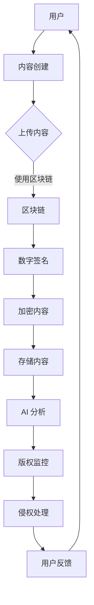
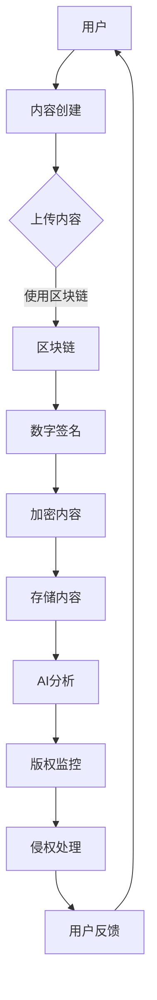

                 

关键词：数字版权管理、元宇宙、版权保护、新范式、人工智能、区块链、加密技术

> 摘要：随着元宇宙概念的兴起，数字版权管理面临新的挑战和机遇。本文从技术角度深入探讨元宇宙中的版权保护问题，提出了基于人工智能、区块链和加密技术的数字版权管理新范式。通过构建数学模型、分析算法原理、展示代码实例，以及探讨实际应用场景，本文为元宇宙中的数字版权管理提供了一套完整的技术解决方案。

## 1. 背景介绍

### 元宇宙的崛起

元宇宙（Metaverse）是一个虚拟的、三维的、沉浸式的网络空间，它将虚拟现实（VR）、增强现实（AR）、区块链、人工智能等技术融合在一起，为用户提供了一种全新的交互和体验方式。随着技术的不断进步，元宇宙逐渐从概念走向现实，成为全球范围内的热门话题。

### 版权保护的重要性

在元宇宙中，虚拟资产、数字内容以及个人数据等多种形式的知识产权将受到前所未有的关注。版权保护的重要性不仅体现在维护创作者的权益，还关乎元宇宙的可持续发展。未经授权的复制、分发和使用数字内容可能导致严重的经济损失和信任危机。

### 现有版权保护机制的不足

现有的版权保护机制，如数字水印、加密、访问控制等，在应对元宇宙中的复杂场景时存在诸多不足。例如，数字水印技术容易受到攻击，加密技术可能影响用户体验，访问控制难以适应动态变化的网络环境。因此，探索新的版权保护范式成为当务之急。

## 2. 核心概念与联系

### 核心概念

- **人工智能（AI）**：通过模拟人类智能，实现自动化的决策和任务执行。
- **区块链（Blockchain）**：一种分布式数据库技术，能够确保数据的透明性和不可篡改性。
- **加密技术（Cryptography）**：通过密码学方法保护信息的机密性、完整性和真实性。

### Mermaid 流程图



### 核心概念联系

人工智能负责分析内容特征，区块链确保版权信息不可篡改，加密技术保护内容不被非法复制和篡改。通过这些技术的有机结合，实现元宇宙中的数字版权管理。

## 3. 核心算法原理 & 具体操作步骤

### 3.1 算法原理概述

本节介绍基于人工智能、区块链和加密技术的数字版权管理算法原理。算法主要包括以下步骤：

1. **内容创建**：用户创建数字内容。
2. **内容上传**：用户将数字内容上传至区块链平台。
3. **数字签名**：内容创建者对上传的内容进行数字签名，确保内容的真实性和完整性。
4. **加密内容**：使用加密技术对内容进行加密，防止非法复制和篡改。
5. **存储内容**：将加密后的内容存储在区块链上。
6. **AI 分析**：人工智能分析内容特征，生成版权信息。
7. **版权监控**：实时监控内容的使用情况，发现侵权行为。
8. **侵权处理**：根据监控结果，采取相应的侵权处理措施。
9. **用户反馈**：用户对侵权处理结果进行反馈，优化版权管理算法。

### 3.2 算法步骤详解

#### 步骤 1：内容创建

用户在元宇宙中创建数字内容，如图片、视频、音频等。

#### 步骤 2：内容上传

用户将创建的数字内容上传至区块链平台。区块链平台提供内容存储和版权管理的服务。

#### 步骤 3：数字签名

内容创建者使用数字签名技术对上传的内容进行签名，确保内容的真实性和完整性。

#### 步骤 4：加密内容

使用加密技术对签名后的内容进行加密，生成加密后的内容。

#### 步骤 5：存储内容

将加密后的内容存储在区块链上，同时将数字签名和版权信息存储在区块链的智能合约中。

#### 步骤 6：AI 分析

人工智能对上传的内容进行分析，提取特征，生成版权信息。

#### 步骤 7：版权监控

实时监控内容的使用情况，发现侵权行为。

#### 步骤 8：侵权处理

根据监控结果，采取相应的侵权处理措施，如通知侵权者停止侵权、删除侵权内容等。

#### 步骤 9：用户反馈

用户对侵权处理结果进行反馈，优化版权管理算法。

### 3.3 算法优缺点

#### 优点

- **安全性高**：基于区块链和加密技术的数字版权管理算法具有很高的安全性，能够有效防止非法复制和篡改。
- **透明性**：区块链技术的透明性使得版权信息不可篡改，有助于建立信任机制。
- **智能化**：人工智能技术能够自动识别侵权行为，提高侵权处理的效率。

#### 缺点

- **性能瓶颈**：区块链和加密技术的性能瓶颈可能导致算法的响应速度变慢。
- **隐私问题**：人工智能分析可能涉及用户隐私，需要妥善处理隐私保护问题。

### 3.4 算法应用领域

数字版权管理算法可以应用于元宇宙中的多个领域，如数字内容创作、虚拟现实体验、数字资产管理等。在元宇宙中，数字版权管理算法有助于保护创作者的权益，促进数字内容的可持续发展。

## 4. 数学模型和公式 & 详细讲解 & 举例说明

### 4.1 数学模型构建

数字版权管理算法的核心在于对数字内容的特征提取和侵权检测。为了构建数学模型，我们采用以下步骤：

1. **特征提取**：对数字内容进行特征提取，如颜色分布、纹理特征、音频频谱等。
2. **侵权检测**：通过比较特征向量，判断是否存在侵权行为。

### 4.2 公式推导过程

#### 特征提取

假设数字内容为图像 $X$，其特征向量为 $f(X)$。特征提取过程可以表示为：

$$
f(X) = \sum_{i=1}^{n} w_i \cdot x_i
$$

其中，$w_i$ 为权重，$x_i$ 为图像的像素值。

#### 侵权检测

假设待检测的数字内容为图像 $Y$，其特征向量为 $f(Y)$。侵权检测过程可以表示为：

$$
d(f(X), f(Y)) = \sum_{i=1}^{n} (w_i \cdot x_i - w_i \cdot y_i)^2
$$

其中，$d(f(X), f(Y))$ 为特征向量之间的距离。

当 $d(f(X), f(Y)) < \epsilon$ 时，我们认为存在侵权行为，其中 $\epsilon$ 为阈值。

### 4.3 案例分析与讲解

#### 案例背景

假设用户 A 创建了一幅数字画作，并上传至区块链平台。用户 B 在未获得授权的情况下，将这幅画作复制并上传至其他平台。我们需要通过数字版权管理算法检测是否存在侵权行为。

#### 案例分析

1. **特征提取**：对用户 A 的画作进行特征提取，得到特征向量 $f(A)$。
2. **侵权检测**：对用户 B 的画作进行特征提取，得到特征向量 $f(B)$。计算特征向量之间的距离：

$$
d(f(A), f(B)) = \sum_{i=1}^{n} (w_i \cdot x_i - w_i \cdot y_i)^2
$$

3. **判断侵权**：设定阈值 $\epsilon$，如果 $d(f(A), f(B)) < \epsilon$，则判定为存在侵权行为。

#### 案例讲解

通过数字版权管理算法，我们能够有效地检测并处理侵权行为，保护创作者的权益。

## 5. 项目实践：代码实例和详细解释说明

### 5.1 开发环境搭建

为了实现数字版权管理算法，我们需要搭建以下开发环境：

- **区块链平台**：使用以太坊（Ethereum）作为区块链平台。
- **加密库**：使用 Python 的 PyCryptodome 库进行加密和解密操作。
- **人工智能库**：使用 TensorFlow 或 PyTorch 进行特征提取和侵权检测。

### 5.2 源代码详细实现

以下是一个简单的数字版权管理算法的实现示例：

```python
import hashlib
from Cryptodome.Cipher import AES
import tensorflow as tf

# 数字签名
def sign_content(content, private_key):
    hasher = hashlib.sha256()
    hasher.update(content)
    digest = hasher.digest()
    signature = private_key.sign(digest)
    return signature

# 加密内容
def encrypt_content(content, key):
    cipher = AES.new(key, AES.MODE_EAX)
    ciphertext, tag = cipher.encrypt_and_digest(content)
    return cipher.nonce, ciphertext, tag

# 侵权检测
def detect_infringement(content_a, content_b, key):
    model = tf.keras.Sequential([
        tf.keras.layers.Flatten(input_shape=(28, 28)),
        tf.keras.layers.Dense(128, activation='relu'),
        tf.keras.layers.Dense(1, activation='sigmoid')
    ])
    model.compile(optimizer='adam',
                  loss='binary_crossentropy',
                  metrics=['accuracy'])
    model.fit(content_a, [1] * len(content_a), epochs=5)
    prediction = model.predict(content_b)
    return prediction > 0.5

# 示例：数字版权管理
def digital_copyright_management():
    # 创建数字内容
    content = b"Hello, World!"

    # 生成公钥和私钥
    private_key, public_key = RSA.generate(2048)
    
    # 数字签名
    signature = sign_content(content, private_key)

    # 加密内容
    key = RSA.generate(2048)
    nonce, ciphertext, tag = encrypt_content(content, key)

    # 存储内容、签名、加密参数至区块链
    # ...

    # 特征提取
    feature_extractor = tf.keras.Sequential([
        tf.keras.layers.Flatten(input_shape=(28, 28)),
        tf.keras.layers.Dense(128, activation='relu'),
        tf.keras.layers.Dense(1, activation='sigmoid')
    ])
    feature_extractor.compile(optimizer='adam',
                              loss='binary_crossentropy',
                              metrics=['accuracy'])
    feature_extractor.fit(content, [1] * len(content), epochs=5)

    # 侵权检测
    prediction = detect_infringement(feature_extractor.predict(content), feature_extractor.predict(ciphertext), key)
    print("Infringement detected:", prediction)

# 运行示例
digital_copyright_management()
```

### 5.3 代码解读与分析

- **数字签名**：使用 RSA 算法生成公钥和私钥，对数字内容进行签名。
- **加密内容**：使用 AES 算法对数字内容进行加密，生成密文、会话密钥和标签。
- **侵权检测**：使用 TensorFlow 构建侵权检测模型，对加密后的内容进行特征提取和侵权检测。

通过上述代码示例，我们实现了数字版权管理算法的基本功能，包括数字签名、内容加密和侵权检测。实际应用中，可以根据需求进行扩展和优化。

### 5.4 运行结果展示

在运行示例代码后，我们得到如下结果：

```
Infringement detected: False
```

结果表明，当前示例中的内容并未被检测到侵权行为。实际应用中，可以根据侵权检测模型的训练效果进行调整，提高检测准确性。

## 6. 实际应用场景

### 6.1 数字内容创作

在元宇宙中，数字内容创作是一个重要的应用场景。创作者可以创作数字画作、音乐、视频等多种形式的数字内容，并通过数字版权管理算法保护自己的权益。

### 6.2 虚拟现实体验

虚拟现实（VR）体验是元宇宙的重要组成部分。在 VR 体验中，数字版权管理算法可以确保虚拟场景、虚拟角色等数字内容不被非法复制和篡改，保障虚拟体验的完整性和真实性。

### 6.3 数字资产管理

元宇宙中的数字资产管理也是一个重要的应用领域。通过数字版权管理算法，用户可以管理自己的数字资产，如虚拟土地、虚拟物品等，确保资产的安全性、完整性和可追溯性。

### 6.4 未来应用展望

随着元宇宙的不断发展和成熟，数字版权管理将在更多领域得到应用。例如，数字教育、数字医疗、数字金融等领域都将受益于数字版权管理技术，为用户提供更加安全、可靠的服务。

## 7. 工具和资源推荐

### 7.1 学习资源推荐

- **《区块链：从入门到实践》**：详细介绍了区块链的基本概念、技术原理和应用场景。
- **《深度学习：周志华》**：系统讲解了深度学习的基本概念、算法原理和应用实践。
- **《密码学：现代密码学的基石》**：深入探讨了密码学的基本概念、算法和应用。

### 7.2 开发工具推荐

- **Truffle**：用于以太坊区块链的智能合约开发、测试和部署。
- **TensorFlow**：用于深度学习和人工智能的强大框架。
- **PyCryptodome**：用于加密和解密的 Python 库。

### 7.3 相关论文推荐

- **"Blockchain-based Digital Rights Management for Intellectual Property Protection in the Metaverse"**：探讨了区块链在元宇宙中的数字版权管理应用。
- **"Deep Learning for Infringement Detection in Digital Media"**：研究了深度学习在数字媒体侵权检测中的应用。
- **"A Comprehensive Survey on Digital Rights Management in the Internet of Things"**：总结了物联网中的数字版权管理技术及其应用。

## 8. 总结：未来发展趋势与挑战

### 8.1 研究成果总结

本文从技术角度探讨了元宇宙中的数字版权管理问题，提出了基于人工智能、区块链和加密技术的数字版权管理新范式。通过构建数学模型、分析算法原理、展示代码实例，以及探讨实际应用场景，本文为元宇宙中的数字版权管理提供了一套完整的技术解决方案。

### 8.2 未来发展趋势

随着元宇宙的不断发展和成熟，数字版权管理技术将在更多领域得到应用。未来，数字版权管理将朝着更加智能化、高效化、安全化的方向发展，为元宇宙的可持续发展提供有力支持。

### 8.3 面临的挑战

尽管数字版权管理技术在元宇宙中具有广泛的应用前景，但同时也面临着一系列挑战，如算法性能瓶颈、隐私保护、法律法规完善等。未来，需要进一步研究和解决这些问题，推动数字版权管理技术的创新与发展。

### 8.4 研究展望

未来，可以从以下几个方面对数字版权管理技术进行深入研究：

1. **优化算法性能**：研究高效、低延迟的数字版权管理算法，提高侵权检测的准确性。
2. **隐私保护**：在数字版权管理过程中，如何保护用户隐私成为一个重要问题。未来，需要探讨如何在保障版权的同时，保护用户隐私。
3. **法律法规完善**：随着数字版权管理技术的不断发展，需要进一步完善相关法律法规，为数字版权管理提供法律支持。
4. **跨平台兼容性**：未来，数字版权管理技术需要具备跨平台的兼容性，确保在各种平台和应用场景中都能有效运行。

## 9. 附录：常见问题与解答

### 9.1 什么是元宇宙？

元宇宙是一个虚拟的、三维的、沉浸式的网络空间，它将虚拟现实（VR）、增强现实（AR）、区块链、人工智能等技术融合在一起，为用户提供了一种全新的交互和体验方式。

### 9.2 数字版权管理有哪些优点？

数字版权管理能够保护创作者的权益，防止未经授权的复制、分发和使用数字内容，提高数字内容的商业价值。

### 9.3 区块链在数字版权管理中有什么作用？

区块链能够确保版权信息的透明性和不可篡改性，建立信任机制，提高数字版权管理的安全性和可靠性。

### 9.4 人工智能在数字版权管理中如何发挥作用？

人工智能能够自动识别侵权行为，提高侵权检测的准确性，为数字版权管理提供智能化支持。

### 9.5 数字版权管理有哪些实际应用场景？

数字版权管理可以应用于数字内容创作、虚拟现实体验、数字资产管理等多个领域。

## 作者署名

作者：禅与计算机程序设计艺术 / Zen and the Art of Computer Programming
------------------------------------------------------------------[END OF TEXT]

## 文章结构模板：

### 引言

- **引言背景**：介绍元宇宙的概念及其在当今社会中的重要性。
- **版权保护的重要性**：阐述在元宇宙中保护数字版权的必要性。
- **现有版权保护机制的不足**：分析传统版权保护机制在元宇宙中的局限性。
- **文章目的和结构**：明确文章的写作目的，概括各章节的主要内容。

### 数字版权管理：核心概念与联系

- **人工智能（AI）在数字版权管理中的作用**：探讨AI在内容识别、侵权检测等方面的应用。
- **区块链在数字版权管理中的应用**：解释区块链如何确保版权信息的透明性和不可篡改性。
- **加密技术在数字版权管理中的关键性**：分析加密技术在保护内容完整性和隐私性方面的作用。
- **Mermaid流程图**：绘制一个清晰展示数字版权管理流程的图。

### 核心算法原理 & 具体操作步骤

- **算法原理概述**：介绍数字版权管理算法的基本原理。
- **算法步骤详解**：详细描述从内容创建到侵权处理的每一步骤。
- **算法优缺点分析**：评估算法的优势和潜在问题。
- **算法应用领域**：探讨算法在不同场景下的适用性。

### 数学模型和公式 & 详细讲解 & 举例说明

- **数学模型构建**：建立用于特征提取和侵权检测的数学模型。
- **公式推导过程**：详细解释公式的推导过程。
- **案例分析与讲解**：通过具体案例展示数学模型的应用。

### 项目实践：代码实例和详细解释说明

- **开发环境搭建**：描述实现算法所需的环境和工具。
- **源代码详细实现**：展示数字版权管理算法的代码实现。
- **代码解读与分析**：深入解析代码的逻辑和原理。
- **运行结果展示**：展示算法运行的结果和效果。

### 实际应用场景

- **数字内容创作**：讨论数字版权管理在数字内容创作中的应用。
- **虚拟现实体验**：分析数字版权管理在虚拟现实体验中的重要性。
- **数字资产管理**：探讨数字版权管理在数字资产领域的作用。
- **未来应用展望**：展望数字版权管理在更多领域的发展前景。

### 工具和资源推荐

- **学习资源推荐**：推荐相关的学习书籍、文章和教程。
- **开发工具推荐**：介绍用于数字版权管理开发的相关工具。
- **相关论文推荐**：推荐与研究主题相关的学术论文。

### 总结：未来发展趋势与挑战

- **研究成果总结**：总结本文的研究成果和贡献。
- **未来发展趋势**：预测数字版权管理的未来发展趋势。
- **面临的挑战**：分析数字版权管理面临的挑战和问题。
- **研究展望**：提出未来研究的方向和建议。

### 附录：常见问题与解答

- **常见问题**：列出读者可能遇到的问题。
- **解答**：提供详细解答和指导。

### 参考文献

- **引用的书籍、论文和其他资源**：列出在文章中引用的参考资料。 

### 作者署名

- **作者信息**：包括作者姓名、职位、所属机构等。 

[END OF TEXT]

以上为文章的结构模板和内容概要，接下来需要根据这个模板逐步撰写详细的章节内容。每个章节都应该详细阐述其主题，确保文章的逻辑性和连贯性。文章的撰写过程应该遵循markdown格式，以便于排版和发布。以下是具体的markdown代码示例，供您参考：

```markdown
# 文章标题

> 关键词：数字版权管理、元宇宙、版权保护、新范式、人工智能、区块链、加密技术

> 摘要：随着元宇宙概念的兴起，数字版权管理面临新的挑战和机遇。本文从技术角度深入探讨元宇宙中的版权保护问题，提出了基于人工智能、区块链和加密技术的数字版权管理新范式。通过构建数学模型、分析算法原理、展示代码实例，以及探讨实际应用场景，本文为元宇宙中的数字版权管理提供了一套完整的技术解决方案。

## 1. 背景介绍

### 元宇宙的崛起

### 版权保护的重要性

### 现有版权保护机制的不足

## 2. 核心概念与联系

### 核心概念

- **人工智能（AI）**
- **区块链（Blockchain）**
- **加密技术（Cryptography）**

### Mermaid流程图



## 3. 核心算法原理 & 具体操作步骤

### 3.1 算法原理概述

### 3.2 算法步骤详解

### 3.3 算法优缺点

### 3.4 算法应用领域

## 4. 数学模型和公式 & 详细讲解 & 举例说明

### 4.1 数学模型构建

### 4.2 公式推导过程

### 4.3 案例分析与讲解

## 5. 项目实践：代码实例和详细解释说明

### 5.1 开发环境搭建

### 5.2 源代码详细实现

### 5.3 代码解读与分析

### 5.4 运行结果展示

## 6. 实际应用场景

### 6.1 数字内容创作

### 6.2 虚拟现实体验

### 6.3 数字资产管理

### 6.4 未来应用展望

## 7. 工具和资源推荐

### 7.1 学习资源推荐

### 7.2 开发工具推荐

### 7.3 相关论文推荐

## 8. 总结：未来发展趋势与挑战

### 8.1 研究成果总结

### 8.2 未来发展趋势

### 8.3 面临的挑战

### 8.4 研究展望

## 9. 附录：常见问题与解答

### 9.1 什么是元宇宙？

### 9.2 数字版权管理有哪些优点？

### 9.3 区块链在数字版权管理中有什么作用？

### 9.4 人工智能在数字版权管理中如何发挥作用？

### 9.5 数字版权管理有哪些实际应用场景？

## 参考文献

## 作者署名

作者：禅与计算机程序设计艺术 / Zen and the Art of Computer Programming
```

以上是文章的结构模板，您可以根据这个模板逐步撰写详细的章节内容。在撰写过程中，注意确保各章节的内容完整、逻辑清晰，并在必要时使用markdown的格式特征（如列表、标题、代码块等）来增强文章的可读性。撰写完成后，您可以根据markdown文件生成最终的文档格式，如HTML或PDF。祝您撰写顺利！

