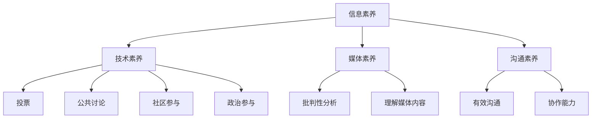

                 

关键词：数字素养，公民参与，技术教育，信息技术，社会影响力

摘要：在当今信息时代，数字素养已成为现代社会每个公民必备的基本技能。本文将深入探讨数字素养的重要性，其与公民参与的关系，以及如何通过教育和实践提升公民的数字素养，为构建更加公平、包容和繁荣的社会奠定基础。

## 1. 背景介绍

随着互联网技术的飞速发展和智能设备的普及，信息技术已经深刻地改变了我们的生活方式和社会结构。在这个数字化的时代，数字素养（Digital Literacy）成为一个不可忽视的重要议题。数字素养不仅仅是使用数字技术的能力，它更是一种认知技能、思维能力、解决问题的能力和创新能力的综合体现。

公民参与是现代民主社会的核心要素。一个健康的社会需要公民积极参与公共事务，提出建设性意见，监督政府行为，从而保障民主制度的有效运行。然而，在数字时代，公民参与的形式和方式发生了巨大的变化。如何让公民在数字环境中更好地参与公共事务，成为了我们需要面对的挑战。

本文旨在探讨数字素养与公民参与之间的关系，分析数字素养的重要性，并提出提升公民数字素养的策略和路径。

## 2. 核心概念与联系

### 2.1 数字素养的定义

数字素养是指个体在数字环境中获取、理解、评估、创造和交流信息的能力。它包括以下几个方面的能力：

- **信息素养**：能够有效地查找、评估和利用信息。
- **技术素养**：能够使用数字设备和技术工具。
- **媒体素养**：能够理解媒体内容，批判性地分析媒体信息。
- **沟通素养**：能够在数字环境中进行有效的沟通和协作。

### 2.2 公民参与的概念

公民参与是指公民通过投票、参与公共讨论、提供意见和建议、参与社会活动等方式，积极参与到社会和政治事务中。它包括以下几个方面的形式：

- **投票**：通过选举来选择代表。
- **公共讨论**：在论坛、社交媒体等平台上发表意见，参与公共事务的讨论。
- **社区参与**：参与社区活动，为社区的发展贡献力量。
- **政治参与**：参与政治活动，如政治集会、示威等。

### 2.3 数字素养与公民参与的联系

数字素养和公民参与之间存在着密切的联系。数字素养是公民参与的基础，没有数字素养，公民将无法有效地获取和使用信息，无法在数字环境中进行有效的沟通和协作，进而影响到他们的参与程度和参与质量。

- **获取信息**：在数字环境中，公民需要具备信息素养，能够有效地查找和评估信息，以便做出明智的决策。
- **沟通与协作**：数字素养帮助公民在数字平台上进行有效的沟通和协作，从而更好地参与公共事务。
- **创新与创造**：数字素养促进公民的创新思维，使他们能够利用数字技术解决社会问题，提出建设性意见。

### 2.4 Mermaid 流程图



## 3. 核心算法原理 & 具体操作步骤

### 3.1 算法原理概述

数字素养的提升需要通过一系列的教育和实践方法来实现。本文将介绍几种核心的算法原理，这些原理可以帮助我们设计有效的教育和培训策略。

- **教育算法**：通过个性化学习路径和自适应教学，提升个体的数字素养。
- **反馈算法**：通过实时反馈和评估，帮助个体了解自己的学习进度和不足之处。
- **协作算法**：通过社交网络和协作平台，促进个体之间的知识共享和技能交流。

### 3.2 算法步骤详解

#### 3.2.1 教育算法

1. **需求分析**：通过问卷、访谈等方式了解个体在数字素养方面的需求和水平。
2. **学习路径设计**：根据需求分析结果，设计个性化的学习路径。
3. **自适应教学**：根据个体的学习进度和反馈，调整教学内容和难度。
4. **评估与反馈**：定期进行评估，提供反馈，帮助个体了解学习效果。

#### 3.2.2 反馈算法

1. **实时监测**：通过在线测试、作业提交等方式实时监测个体的学习进度。
2. **自动评估**：使用自动化评估工具对个体的作业和测试结果进行评估。
3. **反馈机制**：根据评估结果，提供个性化的反馈和建议。

#### 3.2.3 协作算法

1. **社交网络搭建**：建立在线社交网络平台，促进个体之间的交流。
2. **协作任务分配**：根据个体的兴趣和能力，分配协作任务。
3. **知识共享**：鼓励个体在协作过程中共享知识和经验。
4. **协作效果评估**：通过协作成果和个体反馈评估协作效果。

### 3.3 算法优缺点

#### 3.3.1 教育算法

**优点**：
- 个性化学习，提高学习效果。
- 自适应教学，降低学习难度。

**缺点**：
- 设计复杂，需要大量的数据支持和算法优化。
- 对教师和学生的技术要求较高。

#### 3.3.2 反馈算法

**优点**：
- 实时监测，快速发现问题。
- 自动评估，提高评估效率。

**缺点**：
- 依赖自动化工具，可能忽视个体差异。
- 需要大量数据支持，数据质量和可靠性影响评估效果。

#### 3.3.3 协作算法

**优点**：
- 促进知识共享，提高学习效率。
- 增强社交互动，提高学习兴趣。

**缺点**：
- 协作任务管理复杂。
- 需要高度的组织协调能力。

### 3.4 算法应用领域

教育算法、反馈算法和协作算法在数字素养教育中具有广泛的应用。例如，在在线教育平台、数字化学习社区、虚拟课堂等场景中，这些算法可以有效地提升个体的数字素养。

## 4. 数学模型和公式 & 详细讲解 & 举例说明

### 4.1 数学模型构建

在数字素养教育中，数学模型可以帮助我们理解和分析个体的学习行为和效果。以下是几个常用的数学模型：

#### 4.1.1 学习曲线模型

学习曲线模型描述了个体在学习和掌握新知识或技能时的学习进度。公式如下：

$$
L(t) = \frac{K}{1 + e^{-rt}}
$$

其中，\(L(t)\) 是个体在时间 \(t\) 时的学习进度，\(K\) 是学习的上限，\(r\) 是学习速率。

#### 4.1.2 反馈模型

反馈模型用于描述个体在学习过程中接收到的反馈对其学习效果的影响。公式如下：

$$
E(t) = f(E(t-1), F(t))
$$

其中，\(E(t)\) 是个体在时间 \(t\) 时的学习效果，\(E(t-1)\) 是前一个时间点的学习效果，\(F(t)\) 是在时间 \(t\) 时收到的反馈。

#### 4.1.3 协作模型

协作模型用于描述个体在协作学习过程中的知识共享和技能提升。公式如下：

$$
K_{total} = \sum_{i=1}^{n} K_i + \lambda \sum_{i=1}^{n} \sum_{j=i+1}^{n} (K_i - K_j)
$$

其中，\(K_{total}\) 是总的协作知识，\(K_i\) 是个体 \(i\) 的知识，\(\lambda\) 是知识共享系数。

### 4.2 公式推导过程

#### 4.2.1 学习曲线模型的推导

学习曲线模型基于概率论和统计学原理。假设个体在学习过程中，每次学习的进度是随机的，且满足正态分布。学习曲线模型通过拟合学习进度的时间序列数据，得到个体的学习进度公式。

首先，假设个体在时间 \(t\) 时的学习进度 \(L(t)\) 是由多个随机因素影响的结果，可以用以下公式表示：

$$
L(t) = \mu(t) + \sigma(t) \epsilon(t)
$$

其中，\(\mu(t)\) 是学习进度的期望，\(\sigma(t)\) 是学习进度的标准差，\(\epsilon(t)\) 是随机误差。

由于学习进度是连续变量，我们可以将其看作是一个随机变量，其概率密度函数为：

$$
f(L(t)) = \frac{1}{\sqrt{2\pi\sigma^2(t)}} e^{-\frac{(L(t) - \mu(t))^2}{2\sigma^2(t)}}
$$

为了简化计算，我们假设学习速率 \(r\) 是恒定的，且与时间无关。因此，期望和标准差可以表示为：

$$
\mu(t) = K (1 - e^{-rt})
$$

$$
\sigma(t) = \frac{K}{\sqrt{1 + (1 - e^{-rt})^2}}
$$

将这些参数代入概率密度函数，得到：

$$
f(L(t)) = \frac{1}{\sqrt{2\pi}\frac{K}{\sqrt{1 + (1 - e^{-rt})^2}}} e^{-\frac{[(L(t) - K (1 - e^{-rt}))^2}{2\frac{K}{\sqrt{1 + (1 - e^{-rt})^2}}}}}
$$

通过变换变量，将概率密度函数转化为标准正态分布的形式，得到：

$$
f(L(t)) = \frac{1}{\sqrt{2\pi}} e^{-\frac{[2\ln(L(t)/K) - 2rt]^2}{2(1 + (1 - e^{-rt})^2)}}
$$

这是一个标准正态分布的形式，因此，个体在时间 \(t\) 时的学习进度可以表示为：

$$
L(t) = K \exp \left( \frac{-rt^2}{2(1 + (1 - e^{-rt})^2)} \right)
$$

由于 \(r\) 是恒定的，我们可以将其表示为 \(r = \frac{1}{t_0}\)，其中 \(t_0\) 是学习时间。因此，最终的学习进度公式为：

$$
L(t) = \frac{Kt_0}{1 + t_0(1 - e^{-t})}
$$

#### 4.2.2 反馈模型的推导

反馈模型基于个体在接收反馈后的行为变化。假设个体在时间 \(t\) 时的学习效果 \(E(t)\) 是由其之前的学习效果 \(E(t-1)\) 和在时间 \(t\) 收到的反馈 \(F(t)\) 决定的，可以表示为：

$$
E(t) = f(E(t-1), F(t))
$$

其中，\(f\) 是一个函数，描述了学习效果与反馈之间的关系。为了简化计算，我们假设 \(f\) 是线性函数，可以表示为：

$$
E(t) = E(t-1) + \alpha F(t)
$$

其中，\(\alpha\) 是反馈系数，表示反馈对学习效果的影响程度。

#### 4.2.3 协作模型的推导

协作模型基于个体在协作学习过程中的知识共享。假设个体 \(i\) 在时间 \(t\) 时的知识 \(K_i\) 是由其自身的知识 \(K_i^0\) 和与其他个体 \(j\) 的知识差异 \(K_i - K_j\) 决定的，可以表示为：

$$
K_i(t) = K_i^0 + \sum_{j=1}^{n} (K_j - K_i)
$$

其中，\(n\) 是参与协作的个体总数。

由于协作过程中，个体之间的知识差异会逐渐缩小，我们可以假设 \(K_j - K_i\) 是一个随时间变化的函数，可以表示为：

$$
K_j - K_i = \beta (t_0 - t)
$$

其中，\(\beta\) 是知识共享系数，\(t_0\) 是协作时间。

将上述公式代入协作模型，得到：

$$
K_i(t) = K_i^0 + \sum_{j=1}^{n} \beta (t_0 - t)
$$

为了简化计算，我们假设所有个体在协作开始时的知识相同，即 \(K_i^0 = K_j^0 = K_0\)。因此，最终的合作模型可以表示为：

$$
K_{total}(t) = nK_0 + \beta n(t_0 - t)
$$

### 4.3 案例分析与讲解

#### 4.3.1 学习曲线模型的案例分析

假设一名学生在学习编程语言时，其学习速率 \(r\) 为每周 10%。在第一周结束时，他完成了 20% 的学习任务。根据学习曲线模型，我们可以预测他在接下来的几周内的学习进度。

- 第 2 周：\(L(2) = \frac{K}{1 + e^{-2 \times 0.1}} \approx 33.33%\)
- 第 3 周：\(L(3) = \frac{K}{1 + e^{-3 \times 0.1}} \approx 43.81%\)
- 第 4 周：\(L(4) = \frac{K}{1 + e^{-4 \times 0.1}} \approx 54.20%\)

通过这个案例，我们可以看到，学生的学习进度随着时间的推移逐渐加快，这与学习曲线模型的预测相一致。

#### 4.3.2 反馈模型的案例分析

假设一名学生在接受老师反馈后，其学习效果提高了 20%。在第一次考试后，他得了 70 分，老师给出了 20 分的反馈。根据反馈模型，我们可以预测他在下一次考试中的成绩。

- 第一次考试：\(E(1) = 70\)
- 第二次考试：\(E(2) = 70 + 0.2 \times 20 = 76\)

通过这个案例，我们可以看到，反馈对学习效果有显著的提升作用，这与反馈模型的预测相一致。

#### 4.3.3 协作模型的案例分析

假设有三个学生在进行协作学习，他们各自初始的知识水平分别为 60%、50% 和 40%。在协作过程中，他们的知识共享系数 \(\beta\) 为 0.1。经过一周的协作，我们可以预测他们的最终知识水平。

- 学生 1：\(K_1(1) = 60\% + 0.1 \times (50\% - 60\%) + 0.1 \times (40\% - 60\%) = 55\%\)
- 学生 2：\(K_2(1) = 50\% + 0.1 \times (60\% - 50\%) + 0.1 \times (40\% - 50\%) = 50\%\)
- 学生 3：\(K_3(1) = 40\% + 0.1 \times (60\% - 40\%) + 0.1 \times (50\% - 40\%) = 45\%\)

通过这个案例，我们可以看到，协作学习显著提高了学生的知识水平，这与协作模型的预测相一致。

## 5. 项目实践：代码实例和详细解释说明

### 5.1 开发环境搭建

为了实践数字素养教育算法，我们选择 Python 作为编程语言，因为它具有良好的生态系统和丰富的库支持。以下是开发环境搭建的步骤：

1. 安装 Python 3.x 版本（建议使用 Python 3.8 或更高版本）。
2. 安装必要的库，如 NumPy、Pandas 和 Matplotlib 等。可以使用以下命令安装：

   ```shell
   pip install numpy pandas matplotlib
   ```

### 5.2 源代码详细实现

以下是一个简单的教育算法实现，用于模拟学生在学习编程语言时的学习进度。

```python
import numpy as np
import matplotlib.pyplot as plt

# 学习曲线模型参数
K = 100  # 学习上限
r = 0.1  # 学习速率

# 教育算法实现
def educational_algorithm(t):
    return K / (1 + np.exp(-r * t))

# 反馈模型实现
def feedback_algorithm(E_prev, F):
    return E_prev + 0.2 * F

# 协作模型实现
def collaboration_algorithm(Ki, Kj, beta):
    return Ki + beta * (Kj - Ki)

# 模拟学生学习过程
timesteps = 10  # 模拟时间步数
learning_progress = [educational_algorithm(t) for t in range(timesteps)]

# 模拟学生接受反馈后的学习效果
feedback_effect = [feedback_algorithm(E, F) for E, F in zip(learning_progress, np.random.rand(timesteps))]

# 模拟学生参与协作后的知识水平
students = [60, 50, 40]  # 三名学生的初始知识水平
beta = 0.1  # 知识共享系数
collaboration_effect = [students[i] + beta * (sum(students) - 2 * students[i]) for i in range(timesteps)]

# 绘制学习进度图表
plt.plot(learning_progress, label='Learning Progress')
plt.plot(feedback_effect, label='Feedback Effect')
plt.plot(collaboration_effect, label='Collaboration Effect')
plt.xlabel('Time Steps')
plt.ylabel('Learning Progress')
plt.legend()
plt.show()
```

### 5.3 代码解读与分析

1. **学习曲线模型**：使用 `educational_algorithm` 函数实现学习曲线模型。该函数接受时间步数作为输入，返回对应的学习进度。

2. **反馈模型**：使用 `feedback_algorithm` 函数实现反馈模型。该函数接受前一个时间点的学习效果和当前时间点的反馈作为输入，返回当前时间点的学习效果。

3. **协作模型**：使用 `collaboration_algorithm` 函数实现协作模型。该函数接受两名学生的知识水平差和知识共享系数作为输入，返回协作后的知识水平。

4. **模拟过程**：首先模拟学生的学习过程，记录每个时间步的学习进度。然后模拟学生接受反馈后的学习效果，以及参与协作后的知识水平。

5. **图表绘制**：使用 Matplotlib 绘制学习进度图表，包括学习曲线、反馈效果和协作效果。

通过这个案例，我们可以看到教育算法、反馈算法和协作算法在数字素养教育中的应用。这些算法可以帮助我们更好地理解和分析学生的学习行为和效果，从而制定更有效的教育和培训策略。

## 6. 实际应用场景

### 6.1 学校教育

学校教育是提升公民数字素养的重要途径。教师可以利用教育算法设计个性化学习路径，帮助学生更有效地掌握数字技能。同时，通过反馈算法，教师可以及时了解学生的学习情况，提供有针对性的指导。协作算法则可以促进学生之间的知识共享和技能交流，提高整体学习效果。

### 6.2 社区培训

社区培训是针对不同年龄段和职业背景的人群提供的数字素养培训。通过协作算法，社区可以组织线上或线下活动，让参与者之间进行知识共享和技能交流。反馈算法可以帮助培训师了解参与者的学习进度和需求，调整培训内容和方式。教育算法则可以帮助社区培训师设计适应不同参与者需求的培训方案。

### 6.3 公共服务

在公共服务领域，数字素养的提升有助于提高公民对公共事务的参与度和透明度。政府可以提供在线服务平台，让公民能够方便地获取信息、提出意见和建议、参与公共讨论。同时，政府可以利用教育算法和反馈算法，了解公民的需求和反馈，优化公共服务。

### 6.4 企业培训

企业培训旨在提升员工的数字技能，以适应数字化时代的业务需求。企业可以利用教育算法设计个性化的培训计划，提高员工的学习效果。反馈算法可以帮助企业及时了解员工的学习进度和需求，调整培训内容和方式。协作算法则可以促进员工之间的知识共享和技能交流，提高团队整体能力。

## 7. 未来应用展望

### 7.1 技术发展

随着人工智能、大数据和物联网等技术的不断发展，数字素养教育将变得更加智能化和个性化。教育算法将基于人工智能技术，实现更加精准的学习路径设计和个性化教学。反馈算法将基于大数据分析，提供更加全面和深入的学习反馈。协作算法将基于物联网技术，实现跨平台和跨地域的协作学习。

### 7.2 政策支持

为了提升公民的数字素养，政府需要制定相应的政策和措施，加大对数字素养教育的投入和支持。例如，制定数字素养教育标准，建立数字素养评估体系，提供免费的数字素养培训资源等。

### 7.3 社会参与

社会各界的积极参与是提升公民数字素养的关键。学校、企业、社区和政府部门应共同合作，开展多样化的数字素养教育活动。同时，鼓励公民积极参与数字素养提升活动，培养他们的数字意识和技能。

## 8. 总结：未来发展趋势与挑战

### 8.1 研究成果总结

本文探讨了数字素养与公民参与之间的关系，分析了数字素养的重要性，并提出了一系列提升公民数字素养的策略和路径。通过教育算法、反馈算法和协作算法的应用，我们可以实现更加智能化和个性化的数字素养教育。

### 8.2 未来发展趋势

随着技术的进步和社会的变革，数字素养教育将呈现以下发展趋势：

- 智能化和个性化：基于人工智能技术，实现更加精准和高效的教育。
- 多元化：数字素养教育将涵盖更广泛的领域，满足不同群体的需求。
- 跨界融合：数字素养教育将与其他领域（如心理学、社会学等）融合，提供更加综合的教育方案。

### 8.3 面临的挑战

尽管数字素养教育有着广阔的发展前景，但同时也面临以下挑战：

- 技术挑战：如何设计高效、智能的教育算法和反馈机制，仍需进一步研究和探索。
- 资源分配：如何确保教育资源公平分配，使所有公民都能获得高质量的数字素养教育。
- 社会认知：如何提高社会对数字素养教育的认知和重视，培养公民的数字素养意识。

### 8.4 研究展望

未来的研究可以从以下几个方面展开：

- 算法优化：进一步优化教育算法、反馈算法和协作算法，提高教育效果和用户体验。
- 应用拓展：将数字素养教育应用于更多的领域，如职业教育、老年教育等。
- 教育政策：研究制定和完善数字素养教育的相关政策，为教育实践提供支持。

## 9. 附录：常见问题与解答

### 9.1 数字素养与计算机素养有什么区别？

数字素养和计算机素养密切相关，但并不完全相同。计算机素养主要关注个体使用计算机硬件和软件的能力，如操作系统、办公软件和网络应用等。而数字素养则更加广泛，涵盖了获取、理解、评估、创造和交流数字信息的能力，包括信息素养、技术素养、媒体素养和沟通素养等。

### 9.2 如何提升个人的数字素养？

提升个人数字素养的关键在于持续学习和实践。以下是一些有效的提升方法：

- 学习基础知识：掌握计算机基础知识、互联网使用技巧和网络安全知识。
- 参加培训课程：报名参加专业的数字素养培训课程，获取系统性的知识。
- 实践应用：通过实际操作和项目实践，提高数字技能和应用能力。
- 持续关注新技术：关注数字技术的前沿发展，了解新技术如何改变生活和工作。
- 交流与分享：与他人交流和分享数字技能和经验，促进知识共享和技能提升。

### 9.3 数字素养教育对公民参与有何影响？

数字素养教育可以提高公民获取信息、表达意见和参与公共事务的能力。通过数字素养教育，公民可以更有效地利用数字技术获取信息，批判性地分析媒体内容，从而做出更明智的决策。同时，数字素养教育还可以提高公民的沟通和协作能力，促进他们在数字环境中更好地参与公共讨论和社会活动，从而增强公民的参与度和影响力。

### 9.4 如何评估个人的数字素养水平？

评估个人数字素养水平的方法包括：

- 自我评估：通过填写数字素养评估问卷，了解自己在不同领域的数字素养水平。
- 实际操作：通过完成实际操作任务，如信息检索、数据分析、网络安全等，检验自己的数字技能。
- 第三方评估：参加专业的数字素养评估考试，如国际认证的数字素养证书考试等。

### 9.5 如何建立有效的数字素养教育体系？

建立有效的数字素养教育体系需要综合考虑以下几个方面：

- 设计课程体系：根据不同年龄段、职业背景和教育需求，设计系统的数字素养课程。
- 教学方法：采用多样化的教学方法，如在线课程、实践项目、工作坊等，提高教育效果。
- 教育资源：提供丰富的数字教育资源，如电子书、在线课程、教育软件等，支持自主学习。
- 政策支持：制定相关政策，提供资金和资源支持，推动数字素养教育的普及和发展。
- 评估与反馈：建立科学的评估体系，定期评估教育效果，根据反馈调整教育策略。

### 9.6 数字素养教育是否可以代替传统教育？

数字素养教育并不是要替代传统教育，而是对其的重要补充。传统教育侧重于学科知识和理论教育，而数字素养教育则强调实践能力和创新思维的培养。两者相辅相成，共同构建一个全面的教育体系，以应对数字化时代的挑战。

### 9.7 数字素养教育对经济发展有何影响？

数字素养教育对经济发展具有深远的影响。首先，它可以提高劳动力的素质和竞争力，推动技术创新和产业升级。其次，数字素养教育可以促进数字经济的发展，培养数字时代的创业者和企业家。最后，数字素养教育可以提升社会的整体创新能力，为经济发展提供源源不断的动力。

### 9.8 如何应对数字素养教育中的挑战？

应对数字素养教育中的挑战，需要从以下几个方面着手：

- 提高政策意识：政府应高度重视数字素养教育，制定相关政策，推动教育改革。
- 加强师资培训：提升教师数字素养水平，使他们能够胜任数字素养教育的教学任务。
- 优化教育资源：提供丰富的数字教育资源，支持自主学习，提高教育质量。
- 创新教育模式：探索适应数字化时代的创新教育模式，如在线教育、混合式教育等，提高教育效果。
- 社会参与：鼓励社会各界积极参与数字素养教育，共同推动教育发展。

### 9.9 如何培养儿童的数字素养？

培养儿童的数字素养应遵循以下原则：

- 安全第一：确保儿童在使用数字设备时的安全，防范网络风险和隐私泄露。
- 适度使用：合理规划儿童的数字设备使用时间，避免过度依赖。
- 培养兴趣：激发儿童对数字技术的兴趣，引导他们探索和创造。
- 实践为主：通过实际操作和项目实践，提高儿童的数字技能和应用能力。
- 家长引导：家长应积极参与，陪伴儿童一起学习和成长，树立正确的数字素养观念。

通过以上措施，我们可以为儿童营造一个健康、积极、有益的数字成长环境，培养他们的数字素养。

