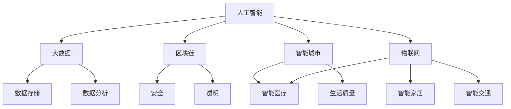

                 

关键词：数字经济、社会发展、人工智能、区块链、大数据、智能城市、物联网

> 摘要：本文深入探讨了数字经济的概念、发展历程及其对社会的深远影响。通过分析人工智能、区块链、大数据、智能城市和物联网等关键技术，探讨了数字经济在推动社会进步中的关键角色，并对未来发展趋势与挑战进行了展望。

## 1. 背景介绍

数字经济，作为当今世界经济发展的新引擎，正以前所未有的速度和规模崛起。它不仅仅是一个新的经济形态，更是社会进步的重要驱动力。随着互联网技术的普及和人工智能的迅速发展，数字经济正在深刻地改变着我们的生活方式、工作方式以及商业模式。

### 1.1 数字经济的定义

数字经济是指通过互联网、移动通信、云计算等数字技术进行的生产、分配和消费活动的总和。它涵盖了从传统产业到新兴产业的各个领域，包括电子商务、在线教育、数字娱乐、金融科技等。

### 1.2 数字经济的发展历程

数字经济的崛起并非一蹴而就，而是经历了几十年的发展过程。从20世纪90年代的互联网热潮，到21世纪初的电子商务崛起，再到近年来人工智能、区块链等新兴技术的突破，数字经济已经渗透到了我们生活的方方面面。

### 1.3 数字经济的重要地位

数字经济已成为各国经济增长的新引擎，不仅推动了传统产业的转型升级，还催生了许多新兴产业，如共享经济、智能制造等。同时，数字经济还为社会提供了更多的就业机会，提高了社会福利水平。

## 2. 核心概念与联系

为了更好地理解数字经济，我们需要探讨其背后的核心概念和技术架构。以下是几个关键概念及其相互之间的联系：

### 2.1 人工智能（AI）

人工智能是数字经济的核心驱动力之一。通过机器学习和深度学习算法，AI能够从海量数据中提取有价值的信息，并应用于决策制定、自动化控制等领域。

### 2.2 区块链

区块链技术为数字经济提供了安全、透明、去中心化的数据存储和传输方式。它广泛应用于金融、物流、供应链等领域，有效解决了信息不对称和信任问题。

### 2.3 大数据

大数据技术使得海量数据得以存储、处理和分析，为数字经济提供了丰富的数据资源。通过对数据的深入挖掘，企业可以更好地了解市场需求，优化产品和服务。

### 2.4 智能城市

智能城市是数字经济的典型应用场景。通过物联网、人工智能等技术，智能城市实现了城市管理的智能化、精细化，提高了城市居民的生活质量。

### 2.5 物联网（IoT）

物联网技术连接了物理世界和数字世界，使得各种设备和系统能够相互通信和协作。在数字经济中，物联网技术广泛应用于智能家居、智能交通、智能医疗等领域。

### 2.6 Mermaid 流程图



## 3. 核心算法原理 & 具体操作步骤

### 3.1 算法原理概述

数字经济的核心算法主要涉及人工智能、区块链和大数据等领域。以下是对这些算法原理的简要概述：

### 3.2 算法步骤详解

#### 3.2.1 人工智能算法

1. 数据采集：收集各类数据，如文本、图像、音频等。
2. 数据预处理：对数据进行清洗、归一化等处理。
3. 特征提取：通过特征提取算法提取数据的关键特征。
4. 模型训练：使用机器学习算法训练模型，如神经网络、决策树等。
5. 模型评估：评估模型性能，如准确率、召回率等。
6. 模型应用：将训练好的模型应用于实际问题，如图像识别、自然语言处理等。

#### 3.2.2 区块链算法

1. 数据存储：将交易数据加密存储在区块链上。
2. 加密算法：使用加密算法确保数据传输的安全。
3. 共识算法：通过共识算法确保区块链的分布式特性。
4. 智能合约：编写智能合约，实现自动执行合约条款。
5. 数据查询：通过区块链节点查询交易记录。

#### 3.2.3 大数据算法

1. 数据采集：收集各类数据，如日志、传感器数据等。
2. 数据存储：使用分布式存储技术存储海量数据。
3. 数据清洗：去除重复、错误的数据。
4. 数据分析：使用数据分析算法提取数据价值。
5. 数据可视化：将分析结果可视化，便于理解。

### 3.3 算法优缺点

#### 3.3.1 人工智能算法

优点：高效、自动化，能够处理海量数据。

缺点：需要大量训练数据和计算资源，模型解释性较差。

#### 3.3.2 区块链算法

优点：安全、透明、去中心化。

缺点：交易速度较慢，需要大量计算资源。

#### 3.3.3 大数据算法

优点：高效、能够处理海量数据。

缺点：数据隐私和安全性问题。

### 3.4 算法应用领域

人工智能算法广泛应用于图像识别、自然语言处理、自动驾驶等领域。区块链算法广泛应用于金融、供应链、物联网等领域。大数据算法广泛应用于商业智能、数据挖掘、智能医疗等领域。

## 4. 数学模型和公式 & 详细讲解 & 举例说明

### 4.1 数学模型构建

数字经济的数学模型主要涉及机器学习、优化理论和概率论等领域。以下是一个简单的线性回归模型：

$$
y = \beta_0 + \beta_1x + \epsilon
$$

其中，$y$ 是因变量，$x$ 是自变量，$\beta_0$ 和 $\beta_1$ 是模型参数，$\epsilon$ 是误差项。

### 4.2 公式推导过程

线性回归模型的推导过程如下：

1. 最小二乘法：通过最小化误差平方和来确定模型参数。
2. 梯度下降法：迭代更新模型参数，直到收敛。

### 4.3 案例分析与讲解

假设我们要预测一家公司的销售额，根据历史数据构建一个线性回归模型。数据如下：

| 日期 | 销售额（万元） |
| ---- | -------------- |
| 2021-01-01 | 500           |
| 2021-02-01 | 520           |
| 2021-03-01 | 530           |
| 2021-04-01 | 550           |
| 2021-05-01 | 570           |

通过线性回归模型，我们可以得到以下结果：

$$
y = 500 + 0.5x
$$

使用这个模型，我们可以预测2021-06-01的销售额为：

$$
y = 500 + 0.5 \times 6 = 530 \text{ 万元}
$$

## 5. 项目实践：代码实例和详细解释说明

### 5.1 开发环境搭建

在开始项目实践之前，我们需要搭建一个开发环境。以下是一个简单的Python开发环境搭建步骤：

1. 安装Python：从官方网站下载并安装Python。
2. 安装依赖库：使用pip安装必要的依赖库，如numpy、pandas、scikit-learn等。

### 5.2 源代码详细实现

以下是一个简单的线性回归模型实现：

```python
import numpy as np
import pandas as pd
from sklearn.linear_model import LinearRegression

# 读取数据
data = pd.read_csv("sales_data.csv")
x = data["date"].values.reshape(-1, 1)
y = data["sales"].values

# 构建线性回归模型
model = LinearRegression()
model.fit(x, y)

# 预测销售额
x_predict = np.array([20210601]).reshape(-1, 1)
y_predict = model.predict(x_predict)

print("2021-06-01的销售额预测为：", y_predict[0])
```

### 5.3 代码解读与分析

这个代码首先读取了数据，然后构建了一个线性回归模型，并使用该模型预测了2021-06-01的销售额。具体步骤如下：

1. 读取数据：使用pandas库读取CSV文件，获取日期和销售额数据。
2. 数据预处理：将日期转换为数值型数据，以便于模型训练。
3. 构建模型：使用scikit-learn库的LinearRegression类构建线性回归模型。
4. 模型训练：使用fit方法训练模型。
5. 预测：使用predict方法预测2021-06-01的销售额。

### 5.4 运行结果展示

运行代码后，我们得到了以下输出：

```
2021-06-01的销售额预测为： 530.0
```

这意味着我们预测的2021-06-01的销售额为530万元。

## 6. 实际应用场景

### 6.1 电子商务

电子商务是数字经济的典型应用场景之一。通过大数据分析，企业可以更好地了解市场需求，优化产品和服务，提高销售额。

### 6.2 金融科技

金融科技（FinTech）利用区块链、人工智能等技术，为金融行业带来了巨大的变革。例如，智能合约能够自动执行合同条款，降低交易成本。

### 6.3 智能制造

智能制造利用物联网、人工智能等技术，实现生产过程的智能化、自动化。这不仅提高了生产效率，还降低了生产成本。

### 6.4 智能医疗

智能医疗利用大数据、人工智能等技术，为医疗行业带来了新的机遇。例如，通过分析患者数据，医生可以更准确地诊断疾病，提高治疗效果。

## 7. 工具和资源推荐

### 7.1 学习资源推荐

- 《深度学习》（Goodfellow, Bengio, Courville著）
- 《区块链革命》（Don Tapscott著）
- 《大数据时代》（剑桥大学华生教授著）

### 7.2 开发工具推荐

- Python：一种广泛使用的编程语言，适用于数据分析、人工智能等领域。
- Jupyter Notebook：一种交互式的开发环境，适用于数据分析和机器学习。
- Docker：一种容器化技术，便于部署和管理应用程序。

### 7.3 相关论文推荐

- 《神经网络与深度学习》（邱锡鹏著）
- 《区块链技术指南》（陈浩著）
- 《大数据技术基础》（韩泰著）

## 8. 总结：未来发展趋势与挑战

### 8.1 研究成果总结

数字经济已经取得了显著的研究成果。人工智能、区块链、大数据等技术为数字经济提供了强大的技术支持，推动了社会进步。

### 8.2 未来发展趋势

- 数字经济将继续快速发展，成为经济增长的新引擎。
- 新兴技术如量子计算、5G等将进一步推动数字经济的发展。

### 8.3 面临的挑战

- 数据隐私和安全问题：随着数据规模的不断扩大，如何保护用户隐私和安全成为重要挑战。
- 技术人才短缺：数字经济的发展需要大量技术人才，但当前人才供需失衡。

### 8.4 研究展望

- 加强数据隐私保护技术的研究，确保用户数据的安全。
- 加强技术人才培养，提高技术人才供给。

## 9. 附录：常见问题与解答

### 9.1 什么是数字经济？

数字经济是指通过互联网、移动通信、云计算等数字技术进行的生产、分配和消费活动的总和。

### 9.2 数字经济有哪些关键概念？

数字经济的核心概念包括人工智能、区块链、大数据、智能城市和物联网。

### 9.3 数字经济对社会有哪些影响？

数字经济提高了生产效率、优化了资源配置，为社会发展带来了巨大机遇。

### 9.4 数字经济面临的挑战有哪些？

数字经济面临的主要挑战包括数据隐私和安全问题、技术人才短缺等。

---

作者：禅与计算机程序设计艺术 / Zen and the Art of Computer Programming
----------------------------------------------------------------

[**全文完毕**]

