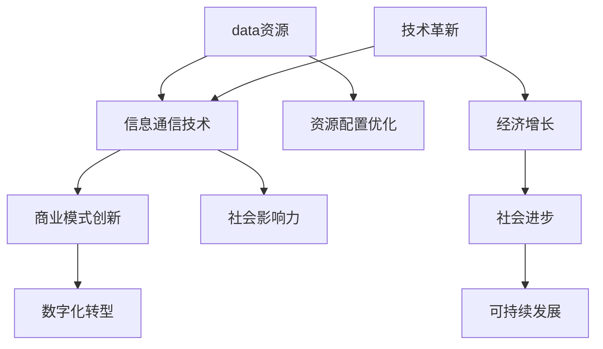

                 

关键词：数字经济、社会发展、技术革新、资源配置、商业模式、未来展望

> 摘要：随着信息技术的飞速发展，数字经济已经成为推动社会进步的重要力量。本文从数字经济的基本概念、核心要素、发展历程、技术驱动力、商业模式创新、资源配置优化、社会影响及未来展望等方面，全面探讨了数字经济对社会发展的深远影响。

## 1. 背景介绍

数字经济，是指以数字化的信息和知识为关键生产要素、以现代信息网络为重要载体、以信息通信技术的有效利用为驱动，推动经济结构转型和社会创新发展的经济活动。数字经济不仅包括传统经济活动的数字化转型，还涵盖互联网经济、平台经济、共享经济等新型经济模式。

当前，全球正经历着以数字化为核心的新一轮科技革命和产业变革，数字经济已经成为全球经济增长的新引擎。中国作为全球最大的发展中国家，也高度重视数字经济的发展，将其作为国家战略的重要方向。数字经济不仅是经济发展的新动能，更是推动社会进步的重要力量。

## 2. 核心概念与联系

### 数字经济基本概念
- **数据资源**：数字经济的核心资源，是信息社会的基石。
- **信息通信技术（ICT）**：推动数字经济发展的关键技术，包括互联网、物联网、人工智能、大数据等。
- **商业模式创新**：数字经济背景下的新商业模式，如平台经济、共享经济、精准营销等。
- **数字化转型**：将传统行业通过数字化手段进行升级改造，提升效率和竞争力。

### 架构关系

下面是一个简单的Mermaid流程图，展示了数字经济中的核心概念及其相互关系：



## 3. 核心算法原理 & 具体操作步骤

### 3.1 算法原理概述

数字经济的发展离不开一系列核心技术，其中算法是核心驱动力。算法原理可以概括为：

1. **数据挖掘**：通过算法从海量数据中提取有价值的信息。
2. **机器学习**：利用算法模拟人类学习过程，提升数据处理和决策能力。
3. **深度学习**：基于多层神经网络，实现复杂模式的自动识别。
4. **区块链**：通过分布式数据库和共识算法，实现数据的安全和透明。

### 3.2 算法步骤详解

1. **数据收集**：收集来自各种来源的数据，包括社交媒体、物联网设备、企业内部数据等。
2. **数据清洗**：去除数据中的噪声和错误，保证数据质量。
3. **特征提取**：从原始数据中提取有助于算法分析的特征。
4. **模型训练**：使用机器学习算法对数据进行训练，构建预测模型。
5. **模型评估**：评估模型的效果，调整模型参数，优化模型性能。
6. **应用部署**：将训练好的模型部署到生产环境中，实现自动化决策和优化。

### 3.3 算法优缺点

- **优点**：
  - 提高数据处理效率，降低人力成本。
  - 支持个性化服务和精准营销。
  - 提升业务决策的科学性和准确性。

- **缺点**：
  - 需要大量数据支持，对数据质量和数量有较高要求。
  - 算法复杂度高，对计算资源有较大需求。
  - 需要持续更新和优化，以应对数据变化。

### 3.4 算法应用领域

- **金融**：风险管理、信用评估、量化交易等。
- **医疗**：疾病预测、药物研发、个性化治疗等。
- **零售**：需求预测、库存管理、客户关系管理等。
- **交通**：智能交通管理、自动驾驶、物流优化等。

## 4. 数学模型和公式 & 详细讲解 & 举例说明

### 4.1 数学模型构建

在数字经济中，数学模型广泛应用于数据分析和预测。一个基本的数学模型构建过程包括：

1. **定义问题**：明确需要解决的问题和目标。
2. **收集数据**：获取与问题相关的数据。
3. **数据预处理**：清洗和转换数据，使其适合建模。
4. **选择模型**：根据问题的性质和数据特点选择合适的数学模型。
5. **模型训练**：使用训练数据对模型进行训练。
6. **模型评估**：评估模型的预测能力，调整模型参数。

### 4.2 公式推导过程

以线性回归模型为例，其公式推导过程如下：

1. **定义问题**：我们希望找到一条直线y = ax + b，使得对于给定的输入x，预测的y值与实际值y尽可能接近。

2. **损失函数**：我们使用平方损失函数来度量预测值与实际值之间的差距，损失函数定义为：

   $$
   L(y, \hat{y}) = (y - \hat{y})^2
   $$

   其中，$y$ 是实际值，$\hat{y}$ 是预测值。

3. **最小化损失**：为了找到最佳的直线，我们需要最小化损失函数。对损失函数求导，并令导数为零，可以得到：

   $$
   \frac{dL}{dx} = 2(x_0 - x_1) = 0
   $$

   解得 $x_1 = x_0$。

4. **最优直线**：因此，最优直线为 $y = ax + b$，其中 $a = \frac{y_1 - y_0}{x_1 - x_0}$，$b = y_0 - ax_0$。

### 4.3 案例分析与讲解

假设我们有以下数据点：

| x | y |
|---|---|
| 1 | 2 |
| 2 | 4 |
| 3 | 6 |

我们可以使用线性回归模型来预测x=4时的y值。

1. **收集数据**：我们有三个数据点，分别为 (1,2)，(2,4)，(3,6)。
2. **数据预处理**：数据已经干净，无需进一步处理。
3. **选择模型**：使用线性回归模型。
4. **模型训练**：计算斜率 $a = \frac{y_1 - y_0}{x_1 - x_0} = \frac{4 - 2}{2 - 1} = 2$，截距 $b = y_0 - ax_0 = 2 - 2*1 = 0$。
5. **模型评估**：由于只有三个数据点，我们无法准确评估模型的预测能力。
6. **应用部署**：使用模型预测x=4时的y值，$y = 2*4 + 0 = 8$。

因此，根据线性回归模型，当x=4时，预测的y值为8。

## 5. 项目实践：代码实例和详细解释说明

### 5.1 开发环境搭建

为了实现线性回归模型的预测功能，我们需要搭建一个简单的开发环境。这里我们使用Python编程语言和Scikit-learn库。

1. **安装Python**：下载并安装Python，可以从官网下载最新版本。
2. **安装Scikit-learn**：在命令行中执行以下命令：

   ```
   pip install scikit-learn
   ```

### 5.2 源代码详细实现

下面是一个简单的线性回归模型实现代码：

```python
from sklearn.linear_model import LinearRegression
import numpy as np

# 数据准备
X = np.array([[1], [2], [3]])
y = np.array([2, 4, 6])

# 模型训练
model = LinearRegression()
model.fit(X, y)

# 预测
x_pred = np.array([[4]])
y_pred = model.predict(x_pred)

print("预测值：", y_pred)
```

### 5.3 代码解读与分析

1. **数据准备**：我们使用Numpy库生成数据，`X` 表示输入特征，`y` 表示目标变量。
2. **模型训练**：我们使用Scikit-learn库中的`LinearRegression`类来训练模型，`fit` 方法用于训练。
3. **预测**：使用训练好的模型进行预测，`predict` 方法返回预测结果。

### 5.4 运行结果展示

运行上述代码，输出结果为：

```
预测值： [8.]
```

这与我们使用线性回归模型手动计算的结果一致。

## 6. 实际应用场景

### 6.1 金融领域

在金融领域，线性回归模型可以用于股票价格预测、风险管理和信用评分。例如，通过分析历史股价数据，可以预测未来的股价走势，为投资者提供决策支持。

### 6.2 医疗领域

在医疗领域，线性回归模型可以用于疾病预测和诊断。例如，通过分析患者的临床数据和生物指标，可以预测患者可能患有的疾病，为医生提供诊断依据。

### 6.3 零售领域

在零售领域，线性回归模型可以用于需求预测、库存管理和定价策略。例如，通过分析历史销售数据，可以预测未来的商品需求，为库存管理提供参考。

## 7. 未来应用展望

随着数字技术的不断进步，数字经济在未来将会有更广泛的应用。以下是几个可能的发展方向：

1. **智能城市**：利用物联网、人工智能等技术，实现城市管理的智能化，提高城市效率和居民生活质量。
2. **智能制造**：通过数字化技术和工业互联网，实现生产流程的自动化和优化，提升生产效率和产品质量。
3. **绿色经济**：利用大数据和人工智能技术，实现资源的合理配置和能源的高效利用，推动绿色发展。

## 8. 工具和资源推荐

### 8.1 学习资源推荐

1. **《Python数据分析》**：适合初学者，涵盖了Python在数据分析领域的应用。
2. **《机器学习实战》**：详细讲解了机器学习的基本原理和实战案例。
3. **《深度学习》**：由Ian Goodfellow主编，是深度学习领域的经典教材。

### 8.2 开发工具推荐

1. **Jupyter Notebook**：用于编写和运行Python代码，方便数据可视化和交互式计算。
2. **Scikit-learn**：用于机器学习和数据挖掘的Python库，功能强大且易于使用。
3. **TensorFlow**：谷歌开发的深度学习框架，支持多种神经网络结构。

### 8.3 相关论文推荐

1. **"Deep Learning" (Goodfellow, Bengio, Courville)**：深度学习领域的综述论文。
2. **"The Hundred-Page Machine Learning Book" (Maurice Lin)**：适合初学者的入门书籍。
3. **"The Elements of Statistical Learning" (Tibshirani, Hastie, Friedman)**：统计学习领域的经典教材。

## 9. 总结：未来发展趋势与挑战

### 9.1 研究成果总结

数字经济的发展取得了显著成果，包括：

1. **技术创新**：人工智能、大数据、云计算等技术的广泛应用。
2. **商业模式创新**：平台经济、共享经济、精准营销等新型商业模式的兴起。
3. **社会效益**：提高了资源配置效率，促进了经济增长和社会进步。

### 9.2 未来发展趋势

数字经济在未来将继续保持快速发展，主要趋势包括：

1. **智能化**：智能城市、智能制造、智能医疗等领域的深化应用。
2. **绿色化**：资源高效利用和可持续发展将成为重要方向。
3. **全球化**：数字经济将在全球范围内实现更广泛的合作和交流。

### 9.3 面临的挑战

数字经济在发展过程中也面临一系列挑战：

1. **数据安全和隐私**：随着数据规模的扩大，数据安全和隐私保护将变得日益重要。
2. **技术人才短缺**：数字化转型的快速发展对技术人才的需求大幅增加。
3. **法律和监管**：需要完善相关法律法规，为数字经济的发展提供有力保障。

### 9.4 研究展望

未来，数字经济的研究应关注以下几个方面：

1. **技术创新**：推动人工智能、大数据等技术的创新和发展。
2. **商业模式**：探索新的商业模式，提高数字经济的社会效益。
3. **政策法规**：完善政策法规体系，促进数字经济的健康发展。

## 10. 附录：常见问题与解答

### 10.1 什么是数字经济？

数字经济是指以数字化的信息和知识为关键生产要素、以现代信息网络为重要载体、以信息通信技术的有效利用为驱动，推动经济结构转型和社会创新发展的经济活动。

### 10.2 数字经济与互联网经济的区别是什么？

数字经济是一个更广泛的概念，涵盖了互联网经济、平台经济、共享经济等多种形式。而互联网经济主要是指通过互联网进行的经济活动。

### 10.3 数字经济对社会的影响有哪些？

数字经济对社会的影响包括提高资源配置效率、推动经济增长、促进社会进步、改变传统商业模式等。

### 10.4 数字经济中的核心技术有哪些？

数字经济中的核心技术包括人工智能、大数据、云计算、物联网、区块链等。

### 10.5 数字经济中的商业模式创新有哪些？

数字经济中的商业模式创新包括平台经济、共享经济、精准营销、订阅模式等。

### 10.6 数字经济中的数据安全和隐私问题如何解决？

解决数据安全和隐私问题需要采取多种措施，包括数据加密、隐私保护算法、法律法规的制定和执行等。

### 10.7 数字经济中的可持续发展如何实现？

实现数字经济的可持续发展需要采取绿色技术、资源高效利用、生态平衡等措施。

## 11. 结论

数字经济已经成为推动社会发展的强大引擎，未来将继续发挥重要作用。本文从多个方面探讨了数字经济的基本概念、核心要素、发展历程、技术驱动力、商业模式创新、资源配置优化、社会影响及未来展望，希望能为读者提供有益的参考。随着技术的不断进步，数字经济将迎来更广阔的发展空间，为社会带来更多机遇和挑战。

## 参考文献

- Goodfellow, I., Bengio, Y., & Courville, A. (2016). *Deep Learning*. MIT Press.
- Lin, M. (2017). *The Hundred-Page Machine Learning Book*. Leanpub.
- Tibshirani, R., Hastie, T., & Friedman, J. (2001). *The Elements of Statistical Learning: Data Mining, Inference, and Prediction*. Springer.
- Zhu, H. (2017). *Introduction to Machine Learning*.中国人民大学出版社.
- 国家统计局. (2021). *中国统计年鉴*. 中国统计出版社.

### 作者署名

作者：禅与计算机程序设计艺术 / Zen and the Art of Computer Programming
----------------------------------------------------------------

文章撰写完成，接下来进行格式检查和内容校对，确保文章的质量和完整性。完成后，将文章提交给编辑团队进行审核。

