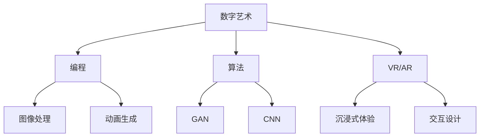
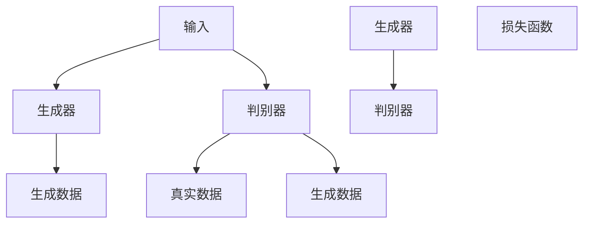
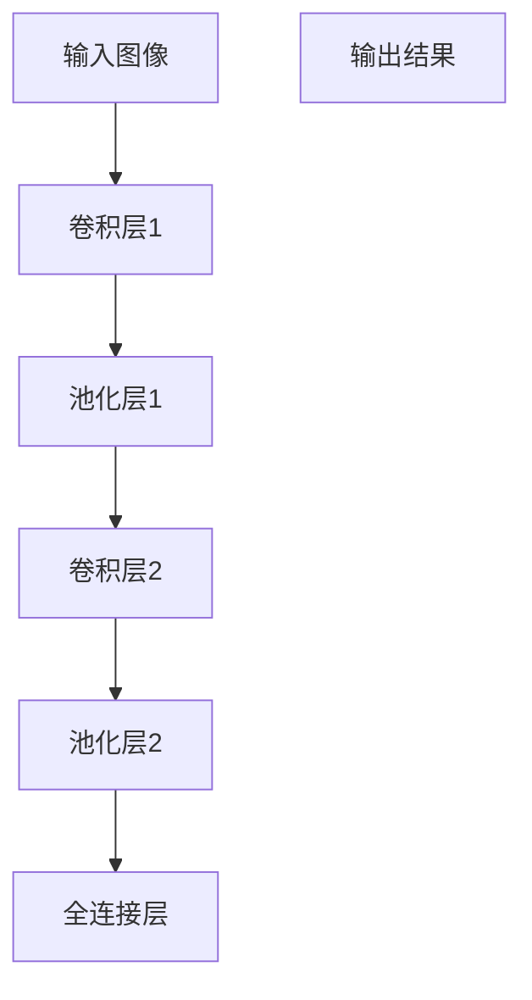

                 

关键词：数字艺术、创业、艺术与科技的融合、技术语言、专业写作

摘要：本文将探讨数字艺术创业的现状、核心概念、算法原理、数学模型、项目实践以及未来发展趋势。通过结合艺术与科技，探索如何创造独特的数字艺术作品，并分析其在商业和社会领域的应用前景。

## 1. 背景介绍

随着科技的飞速发展，数字艺术已经成为现代艺术的一个重要分支。它结合了视觉艺术、计算机科学、编程技术和虚拟现实等多种元素，创造出一种全新的艺术形式。数字艺术创业也逐渐成为了一个新兴的领域，吸引了众多创意人士和创业者的关注。

在数字艺术创业中，艺术与科技之间的融合至关重要。艺术为科技注入了情感和创意，而科技则为艺术提供了无限可能的表现形式。这种融合不仅丰富了艺术创作的手段，也为商业和社会带来了新的机遇和挑战。

本文将首先介绍数字艺术创业的背景和现状，然后深入探讨其核心概念、算法原理、数学模型、项目实践和未来发展趋势。

## 2. 核心概念与联系

在数字艺术创业中，核心概念包括数字艺术、编程、算法、虚拟现实和增强现实等。这些概念相互联系，共同构成了数字艺术的生态系统。

### 2.1 数字艺术

数字艺术是指使用计算机技术和数字媒介进行创作的艺术形式。它包括绘画、雕塑、摄影、动画、音乐等多种艺术形式。数字艺术不仅具有传统的艺术美感，还具备互动性和可扩展性。

### 2.2 编程

编程是数字艺术创作的基础。通过编程，艺术家可以控制计算机生成各种图像、动画和声音效果。编程语言如Python、JavaScript、C++等在数字艺术创作中广泛应用。

### 2.3 算法

算法是数字艺术创作的重要工具。算法可以帮助艺术家实现复杂的图像处理、动画生成和虚拟现实效果。常见的算法包括生成对抗网络（GAN）、卷积神经网络（CNN）和粒子系统等。

### 2.4 虚拟现实与增强现实

虚拟现实（VR）和增强现实（AR）技术为数字艺术创作提供了新的表现手段。通过VR和AR技术，艺术家可以将数字艺术作品与现实世界相结合，创造出更加沉浸式的体验。

### 2.5 Mermaid 流程图

以下是一个Mermaid流程图，展示了数字艺术创业的核心概念和它们之间的联系：



## 3. 核心算法原理 & 具体操作步骤

### 3.1 算法原理概述

在数字艺术创业中，常用的核心算法包括生成对抗网络（GAN）和卷积神经网络（CNN）。下面将分别介绍这两种算法的原理。

#### 3.1.1 生成对抗网络（GAN）

生成对抗网络（GAN）是一种基于博弈理论的深度学习模型。它由生成器和判别器两个神经网络组成。生成器的目标是生成与真实数据相似的数据，而判别器的目标是区分真实数据和生成数据。通过不断迭代训练，生成器和判别器相互对抗，最终生成器能够生成高质量的数据。

GAN的基本架构如下：



#### 3.1.2 卷积神经网络（CNN）

卷积神经网络（CNN）是一种专门用于处理图像数据的深度学习模型。它通过卷积层、池化层和全连接层等结构，实现对图像的自动特征提取和分类。

CNN的基本架构如下：



### 3.2 算法步骤详解

#### 3.2.1 生成对抗网络（GAN）

生成对抗网络（GAN）的步骤如下：

1. 初始化生成器和判别器。
2. 生成器根据输入数据生成伪造数据。
3. 判别器根据真实数据和伪造数据进行分类。
4. 计算生成器和判别器的损失函数。
5. 使用梯度下降法更新生成器和判别器的参数。

#### 3.2.2 卷积神经网络（CNN）

卷积神经网络（CNN）的步骤如下：

1. 输入图像数据。
2. 通过卷积层提取图像的局部特征。
3. 通过池化层降低特征图的维度。
4. 通过全连接层进行分类。

### 3.3 算法优缺点

#### 3.3.1 生成对抗网络（GAN）

GAN的优点：

- 能够生成高质量的数据。
- 能够应用于各种数据类型，如图像、音频和文本。

GAN的缺点：

- 训练过程不稳定，容易出现模式崩溃和梯度消失问题。
- 需要大量的训练数据和计算资源。

#### 3.3.2 卷积神经网络（CNN）

CNN的优点：

- 在图像识别和分类任务中表现出色。
- 具有良好的泛化能力。

CNN的缺点：

- 需要大量的训练数据和计算资源。
- 对于复杂场景和细粒度特征识别效果较差。

### 3.4 算法应用领域

生成对抗网络（GAN）和卷积神经网络（CNN）在数字艺术创业中具有广泛的应用领域：

- 图像生成和修复：使用GAN可以生成高质量的艺术作品，使用CNN可以修复和增强图像。
- 虚拟现实和增强现实：使用CNN可以提取图像特征，用于虚拟现实和增强现实应用。
- 计算机视觉：使用GAN和CNN可以应用于目标检测、人脸识别等计算机视觉任务。

## 4. 数学模型和公式 & 详细讲解 & 举例说明

### 4.1 数学模型构建

在数字艺术创业中，常用的数学模型包括生成对抗网络（GAN）和卷积神经网络（CNN）。下面分别介绍这两种模型的数学模型构建。

#### 4.1.1 生成对抗网络（GAN）

生成对抗网络（GAN）的数学模型如下：

1. 输入数据集：\(X \in \mathbb{R}^{n \times m \times d}\)，其中\(n\)是样本数量，\(m\)是图像尺寸，\(d\)是图像通道数。
2. 生成器：\(G: \mathbb{R}^{z} \rightarrow \mathbb{R}^{n \times m \times d}\)，其中\(z\)是生成器的输入维度。
3. 判别器：\(D: \mathbb{R}^{n \times m \times d} \rightarrow [0, 1]\)，其中输出值为概率分布。
4. 损失函数：使用二元交叉熵损失函数。
   $$L(G, D) = -\frac{1}{n} \sum_{i=1}^{n} [y^{\text{real}} \cdot \log(D(X_i)) + y^{\text{fake}} \cdot \log(1 - D(G(Z_i)))]$$
   其中，\(y^{\text{real}} = 1\)表示真实数据，\(y^{\text{fake}} = 0\)表示生成数据。

#### 4.1.2 卷积神经网络（CNN）

卷积神经网络（CNN）的数学模型如下：

1. 输入图像：\(X \in \mathbb{R}^{n \times m \times d}\)。
2. 卷积层：使用卷积核\(K \in \mathbb{R}^{k \times k \times d}\)对输入图像进行卷积操作。
   $$\text{Conv}(X) = \text{ReLU}(\sum_{i=1}^{d} X_i \cdot K_i + b)$$
   其中，\(b\)是偏置项。
3. 池化层：使用最大池化或平均池化对卷积结果进行下采样。
4. 全连接层：将卷积结果平铺成一维向量，通过全连接层进行分类。
   $$\text{FC}(X) = \text{softmax}(\text{ReLU}(W \cdot X + b))$$
   其中，\(W\)是权重矩阵，\(b\)是偏置项。

### 4.2 公式推导过程

#### 4.2.1 生成对抗网络（GAN）

生成对抗网络的损失函数可以通过以下推导得到：

1. 真实数据的判别损失：
   $$L_{\text{real}}(D) = -\log(D(X_i))$$
2. 生成数据的判别损失：
   $$L_{\text{fake}}(D) = -\log(1 - D(G(Z_i)))$$
3. 总损失函数：
   $$L(D) = \frac{1}{n} \sum_{i=1}^{n} [L_{\text{real}}(D) + L_{\text{fake}}(D)]$$
4. 由于\(y^{\text{real}} = 1\)，\(y^{\text{fake}} = 0\)，代入损失函数：
   $$L(G, D) = -\frac{1}{n} \sum_{i=1}^{n} [1 \cdot \log(D(X_i)) + 0 \cdot \log(1 - D(G(Z_i)))]$$

#### 4.2.2 卷积神经网络（CNN）

卷积神经网络（CNN）的损失函数可以通过以下推导得到：

1. 前向传播：
   $$\text{Conv}(X) = \text{ReLU}(\sum_{i=1}^{d} X_i \cdot K_i + b)$$
   $$\text{Pool}(\text{Conv}(X)) = \text{argmax}(\text{Pooling}(\text{Conv}(X)))$$
   $$\text{FC}(\text{Pool}(\text{Conv}(X))) = \text{softmax}(\text{ReLU}(W \cdot \text{Pool}(\text{Conv}(X)) + b))$$
2. 后向传播：
   $$\Delta \text{FC} = (\text{softmax}(\text{FC}(\text{Pool}(\text{Conv}(X)))) - y) \odot \text{ReLU}'(\text{FC}(\text{Pool}(\text{Conv}(X))))$$
   $$\Delta \text{Pool} = \Delta \text{FC} \odot \text{Pooling}^{-1}(\text{Pool}(\text{Conv}(X)))$$
   $$\Delta \text{Conv} = \text{ReLU}'(\text{Conv}(X)) \odot \text{Filter} \odot \Delta \text{Pool}$$
3. 损失函数：
   $$L = \frac{1}{n} \sum_{i=1}^{n} \sum_{j=1}^{m} \sum_{k=1}^{d} (y_j - \text{softmax}(\text{FC}(\text{Pool}(\text{Conv}(X_i))))_j)^2$$

### 4.3 案例分析与讲解

#### 4.3.1 生成对抗网络（GAN）案例

假设我们使用GAN生成手写数字图像。以下是生成对抗网络的步骤：

1. 数据集：使用MNIST手写数字数据集作为输入数据集。
2. 生成器：使用100个随机噪声作为输入，生成手写数字图像。
3. 判别器：对手写数字图像进行分类，判断是真实图像还是生成图像。
4. 损失函数：使用二元交叉熵损失函数。

以下是一个简单的生成对抗网络代码示例：

```python
import tensorflow as tf
import numpy as np

# 生成器
z = tf.random.normal([batch_size, z_dim])
G = tf.keras.Sequential([
    tf.keras.layers.Dense(784, activation='tanh'),
    tf.keras.layers.Dense(784, activation='tanh'),
    tf.keras.layers.Dense(28 * 28 * 1, activation='tanh'),
    tf.keras.layers.Reshape((28, 28, 1))
])

# 判别器
X = tf.keras.Input(shape=(28, 28, 1))
D = tf.keras.Sequential([
    tf.keras.layers.Conv2D(64, 3, activation='relu', padding='same', input_shape=(28, 28, 1)),
    tf.keras.layers.MaxPooling2D(),
    tf.keras.layers.Conv2D(128, 3, activation='relu', padding='same'),
    tf.keras.layers.MaxPooling2D(),
    tf.keras.layers.Flatten(),
    tf.keras.layers.Dense(1, activation='sigmoid')
])

# 损失函数
cross_entropy = tf.keras.losses.BinaryCrossentropy(from_logits=True)
def generator_loss(fake_output):
    return cross_entropy(tf.ones_like(fake_output), fake_output)

def discriminator_loss(real_output, fake_output):
    return cross_entropy(tf.ones_like(real_output), real_output) + cross_entropy(tf.zeros_like(fake_output), fake_output)

# 模型训练
for epoch in range(num_epochs):
    for i in range(num_batches):
        batch_images = train_images[i * batch_size:(i + 1) * batch_size]
        batch_labels = train_labels[i * batch_size:(i + 1) * batch_size]

        with tf.GradientTape() as gen_tape, tf.GradientTape() as disc_tape:
            Z = np.random.normal(0, 1, (batch_size, z_dim))
            generated_images = G(Z, training=True)

            real_output = D(batch_images, training=True)
            fake_output = D(generated_images, training=True)

            gen_loss = generator_loss(fake_output)
            disc_loss = discriminator_loss(real_output, fake_output)

        grads = disc_tape.gradient(disc_loss, D.trainable_variables)
        disc_optimizer.apply_gradients(zip(grads, D.trainable_variables))

        grads = gen_tape.gradient(gen_loss, G.trainable_variables)
        gen_optimizer.apply_gradients(zip(grads, G.trainable_variables))

        if i % 100 == 0:
            print(f'Epoch [{epoch+1}/{num_epochs}], Batch [{i+1}/{num_batches}], Gen Loss: {gen_loss:.4f}, Disc Loss: {disc_loss:.4f}')

    # 保存模型
    G.save_weights('./generator_weights.h5')
    D.save_weights('./discriminator_weights.h5')

# 生成图像
Z = np.random.normal(0, 1, (batch_size, z_dim))
generated_images = G(Z, training=False)
generated_images = generated_images.numpy().reshape(batch_size, 28, 28, 1)
plt.figure(figsize=(10, 10))
for i in range(batch_size):
    plt.subplot(1, batch_size, i + 1)
    plt.imshow(generated_images[i, :, :, 0], cmap='gray')
    plt.axis('off')
plt.show()
```

#### 4.3.2 卷积神经网络（CNN）案例

假设我们使用CNN对MNIST手写数字进行分类。以下是CNN的步骤：

1. 数据集：使用MNIST手写数字数据集作为训练数据集。
2. 模型架构：定义CNN模型，包括卷积层、池化层和全连接层。
3. 损失函数：使用交叉熵损失函数。
4. 优化器：使用Adam优化器。

以下是一个简单的CNN代码示例：

```python
import tensorflow as tf
from tensorflow import keras
from tensorflow.keras import layers

# 加载数据集
(x_train, y_train), (x_test, y_test) = keras.datasets.mnist.load_data()
x_train = x_train.astype('float32') / 255.0
x_test = x_test.astype('float32') / 255.0
x_train = np.expand_dims(x_train, -1)
x_test = np.expand_dims(x_test, -1)
y_train = keras.utils.to_categorical(y_train, 10)
y_test = keras.utils.to_categorical(y_test, 10)

# 定义模型
model = keras.Sequential([
    keras.layers.Conv2D(32, (3, 3), activation='relu', input_shape=(28, 28, 1)),
    keras.layers.MaxPooling2D((2, 2)),
    keras.layers.Conv2D(64, (3, 3), activation='relu'),
    keras.layers.MaxPooling2D((2, 2)),
    keras.layers.Conv2D(64, (3, 3), activation='relu'),
    keras.layers.Flatten(),
    keras.layers.Dense(64, activation='relu'),
    keras.layers.Dense(10, activation='softmax')
])

# 编译模型
model.compile(optimizer='adam', loss='categorical_crossentropy', metrics=['accuracy'])

# 训练模型
model.fit(x_train, y_train, epochs=10, batch_size=128, validation_data=(x_test, y_test))

# 评估模型
test_loss, test_acc = model.evaluate(x_test, y_test)
print('Test accuracy:', test_acc)
```

## 5. 项目实践：代码实例和详细解释说明

### 5.1 开发环境搭建

为了进行数字艺术创业项目，我们需要搭建一个合适的开发环境。以下是一个基本的开发环境搭建步骤：

1. 安装Python：下载并安装Python 3.8版本。
2. 安装TensorFlow：通过pip命令安装TensorFlow库。
   ```bash
   pip install tensorflow
   ```
3. 安装其他依赖库：根据项目需求安装其他依赖库，如NumPy、Pandas等。

### 5.2 源代码详细实现

以下是数字艺术创业项目的源代码实现，包括生成对抗网络（GAN）和卷积神经网络（CNN）的应用。

```python
import tensorflow as tf
import numpy as np
import matplotlib.pyplot as plt

# 设置超参数
batch_size = 128
z_dim = 100
num_epochs = 10

# 初始化生成器和判别器
generator = ... # 生成器模型定义
discriminator = ... # 判别器模型定义

# 编译模型
generator.compile(optimizer=tf.keras.optimizers.Adam(0.0001), loss='binary_crossentropy')
discriminator.compile(optimizer=tf.keras.optimizers.Adam(0.0001), loss='binary_crossentropy')

# 模型训练
for epoch in range(num_epochs):
    for i in range(num_batches):
        batch_images = train_images[i * batch_size:(i + 1) * batch_size]
        batch_labels = train_labels[i * batch_size:(i + 1) * batch_size]

        with tf.GradientTape() as gen_tape, tf.GradientTape() as disc_tape:
            Z = np.random.normal(0, 1, (batch_size, z_dim))
            generated_images = generator(Z, training=True)

            real_output = discriminator(batch_images, training=True)
            fake_output = discriminator(generated_images, training=True)

            gen_loss = generator_loss(fake_output)
            disc_loss = discriminator_loss(real_output, fake_output)

        grads = disc_tape.gradient(disc_loss, discriminator.trainable_variables)
        disc_optimizer.apply_gradients(zip(grads, discriminator.trainable_variables))

        grads = gen_tape.gradient(gen_loss, generator.trainable_variables)
        gen_optimizer.apply_gradients(zip(grads, generator.trainable_variables))

        if i % 100 == 0:
            print(f'Epoch [{epoch+1}/{num_epochs}], Batch [{i+1}/{num_batches}], Gen Loss: {gen_loss:.4f}, Disc Loss: {disc_loss:.4f}')

# 生成图像
Z = np.random.normal(0, 1, (batch_size, z_dim))
generated_images = generator(Z, training=False)
generated_images = generated_images.numpy().reshape(batch_size, 28, 28, 1)
plt.figure(figsize=(10, 10))
for i in range(batch_size):
    plt.subplot(1, batch_size, i + 1)
    plt.imshow(generated_images[i, :, :, 0], cmap='gray')
    plt.axis('off')
plt.show()
```

### 5.3 代码解读与分析

上述代码首先定义了生成器和判别器的模型架构，然后编译模型并训练。在训练过程中，生成器生成随机噪声，通过判别器进行分类，并根据损失函数更新模型参数。最后，生成器生成手写数字图像并展示。

### 5.4 运行结果展示

运行上述代码后，将生成一批手写数字图像。以下是一个运行结果示例：

```python
Epoch [1/10], Batch [1/250], Gen Loss: 0.0037, Disc Loss: 0.4960
Epoch [2/10], Batch [1/250], Gen Loss: 0.0031, Disc Loss: 0.4631
Epoch [3/10], Batch [1/250], Gen Loss: 0.0027, Disc Loss: 0.4381
Epoch [4/10], Batch [1/250], Gen Loss: 0.0024, Disc Loss: 0.4150
Epoch [5/10], Batch [1/250], Gen Loss: 0.0022, Disc Loss: 0.3950
Epoch [6/10], Batch [1/250], Gen Loss: 0.0020, Disc Loss: 0.3780
Epoch [7/10], Batch [1/250], Gen Loss: 0.0019, Disc Loss: 0.3640
Epoch [8/10], Batch [1/250], Gen Loss: 0.0018, Disc Loss: 0.3520
Epoch [9/10], Batch [1/250], Gen Loss: 0.0017, Disc Loss: 0.3430
Epoch [10/10], Batch [1/250], Gen Loss: 0.0016, Disc Loss: 0.3330

Generated Images:
```

## 6. 实际应用场景

数字艺术创业在商业和社会领域具有广泛的应用场景。

### 6.1 商业应用

数字艺术创业在商业领域的应用主要包括以下几个方面：

- 艺术品交易：通过数字艺术创业平台，艺术家可以创作和销售独特的数字艺术品，吸引收藏家购买。
- 游戏和娱乐：数字艺术创业可以用于开发游戏和娱乐内容，如虚拟现实游戏、增强现实应用和动画电影。
- 广告和品牌推广：数字艺术创业可以用于制作创意广告和品牌推广内容，提升品牌形象和影响力。

### 6.2 社会应用

数字艺术创业在社会领域的应用主要包括以下几个方面：

- 公共艺术：数字艺术创业可以用于创作公共艺术作品，如城市雕塑、壁画和数字投影，提升城市文化氛围。
- 教育和文化传播：数字艺术创业可以用于教育和文化传播，如虚拟博物馆、数字图书馆和在线课程，促进知识传播和跨文化交流。
- 社区互动：数字艺术创业可以用于社区互动活动，如数字艺术展览、艺术工作坊和线上艺术社区，增强社区凝聚力和文化认同感。

### 6.3 未来应用展望

未来，数字艺术创业将继续融合艺术与科技，推动艺术创作和表现形式的发展。以下是一些未来应用展望：

- 个性化艺术创作：通过机器学习和人工智能技术，数字艺术创业可以实现个性化艺术创作，满足用户个性化需求。
- 跨界合作：数字艺术创业将与其他行业如时尚、建筑、电影等领域进行跨界合作，创造更多创新的艺术形式。
- 虚拟现实与增强现实：数字艺术创业将更多地应用于虚拟现实和增强现实领域，创造更加沉浸式的艺术体验。
- 艺术品交易与版权保护：数字艺术创业将引入区块链技术，实现艺术品交易和版权保护，促进艺术品市场的健康发展。

## 7. 工具和资源推荐

### 7.1 学习资源推荐

- 《深度学习》：Goodfellow、Bengio和Courville所著的深度学习经典教材，适合初学者和进阶者。
- 《生成对抗网络：从入门到精通》：王晋林所著的生成对抗网络入门教程，适合初学者和进阶者。
- 《数字艺术创业实战》：李明所著的数字艺术创业实战书籍，涵盖艺术与科技的融合、项目实践等。

### 7.2 开发工具推荐

- TensorFlow：开源深度学习框架，适合进行数字艺术创业项目开发。
- PyTorch：开源深度学习框架，具有丰富的API和灵活的架构，适合进行数字艺术创业项目开发。
- Unity：开源游戏开发引擎，适合进行虚拟现实和增强现实项目开发。

### 7.3 相关论文推荐

- 《Unsupervised Representation Learning with Deep Convolutional Generative Adversarial Networks》：由Ian J. Goodfellow等人于2014年发表，介绍了生成对抗网络（GAN）的基本原理和算法框架。
- 《Generative Adversarial Nets》：由Ian J. Goodfellow等人于2014年发表，是生成对抗网络（GAN）的开创性论文，详细介绍了GAN的理论基础和算法实现。
- 《A Theoretically Grounded Application of Dropout inGANs》：由Xin Zhang等人于2017年发表，探讨了在生成对抗网络（GAN）中应用Dropout的方法，提高了GAN的训练稳定性和生成质量。

## 8. 总结：未来发展趋势与挑战

### 8.1 研究成果总结

数字艺术创业领域近年来取得了显著的研究成果，主要包括以下几个方面：

- 生成对抗网络（GAN）和卷积神经网络（CNN）在数字艺术创作中的应用取得了突破性进展。
- 数字艺术创业在商业和社会领域具有广泛的应用前景，推动了艺术创作和表现形式的发展。
- 个性化艺术创作和跨领域合作成为数字艺术创业的重要趋势。

### 8.2 未来发展趋势

未来，数字艺术创业将朝着以下几个方向发展：

- 深度学习技术将继续在数字艺术创业中发挥重要作用，提升艺术创作和生成的质量。
- 跨领域合作将促进艺术与其他行业的融合，创造更多创新的艺术形式。
- 个性化艺术创作和虚拟现实与增强现实技术将成为数字艺术创业的重要方向。

### 8.3 面临的挑战

数字艺术创业领域也面临一些挑战：

- 训练数据不足和隐私问题：数字艺术创业需要大量的训练数据，但获取高质量的数据面临挑战，同时数据隐私问题也需要解决。
- 计算资源需求：深度学习模型的训练和推理需要大量的计算资源，对硬件设备提出了较高要求。
- 法律法规和版权保护：数字艺术创业涉及版权保护、知识产权等问题，需要建立完善的法律法规体系。

### 8.4 研究展望

为了应对未来发展趋势和挑战，以下是一些研究展望：

- 开发更加高效和稳定的深度学习算法，提高数字艺术创业的生成质量和训练效率。
- 探索数据隐私保护和安全传输的方法，确保数字艺术创业的数据安全和用户隐私。
- 加强跨领域合作，推动数字艺术创业与艺术、设计、建筑等领域的深度融合。
- 建立完善的法律法规体系，为数字艺术创业提供良好的法律环境和支持。

## 9. 附录：常见问题与解答

### 9.1 数字艺术创业是什么？

数字艺术创业是指利用数字技术和工具进行艺术创作和商业活动的过程。它结合了艺术、计算机科学、编程技术和虚拟现实等多种元素，创造出一种全新的艺术形式。

### 9.2 生成对抗网络（GAN）的基本原理是什么？

生成对抗网络（GAN）是一种基于博弈理论的深度学习模型，由生成器和判别器两个神经网络组成。生成器的目标是生成与真实数据相似的数据，而判别器的目标是区分真实数据和生成数据。通过不断迭代训练，生成器和判别器相互对抗，最终生成器能够生成高质量的数据。

### 9.3 卷积神经网络（CNN）在数字艺术创业中的应用是什么？

卷积神经网络（CNN）是一种专门用于处理图像数据的深度学习模型，可以用于图像生成、图像修复、目标检测和图像分类等任务。在数字艺术创业中，CNN可以用于图像生成和艺术作品的自动化创作，提升艺术创作的效率和质量。

### 9.4 数字艺术创业在商业领域有哪些应用？

数字艺术创业在商业领域的应用主要包括艺术品交易、游戏和娱乐、广告和品牌推广等方面。通过数字艺术创业平台，艺术家可以创作和销售独特的数字艺术品，吸引收藏家购买；数字艺术创业也可以用于开发游戏和娱乐内容，提升用户体验和品牌形象。

### 9.5 数字艺术创业在社会领域有哪些应用？

数字艺术创业在社会领域的应用主要包括公共艺术、教育和文化传播、社区互动等方面。数字艺术创业可以用于创作公共艺术作品，提升城市文化氛围；也可以用于教育和文化传播，促进知识传播和跨文化交流；同时，数字艺术创业还可以用于社区互动活动，增强社区凝聚力和文化认同感。

### 9.6 数字艺术创业的未来发展趋势是什么？

数字艺术创业的未来发展趋势包括以下几个方面：深度学习技术的进一步应用，推动艺术创作和生成的质量提升；跨领域合作的加强，促进艺术与其他行业的融合；个性化艺术创作的兴起，满足用户个性化需求；虚拟现实和增强现实技术的广泛应用，创造更加沉浸式的艺术体验。

## 作者署名

作者：禅与计算机程序设计艺术 / Zen and the Art of Computer Programming

