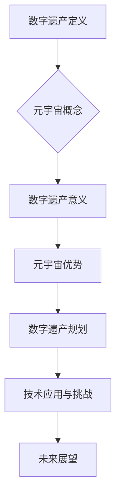

                 

在当今数字化时代，元宇宙作为虚拟现实的延伸，正迅速成为人们生活、娱乐和社交的重要领域。而随着技术的进步，元宇宙也逐渐成为人们数字遗产的重要承载地。本文旨在探讨如何在元宇宙中规划数字遗产，实现个体生命的价值延续。作者：禅与计算机程序设计艺术 / Zen and the Art of Computer Programming

## 摘要

本文将深入分析数字遗产的定义、意义以及在元宇宙中的规划与应用。首先，我们将介绍数字遗产的概念和其与生命价值的联系。接着，我们将探讨元宇宙作为数字遗产规划平台的潜在优势，并通过实际案例解析其在现实中的应用。此外，本文还将讨论数字遗产规划面临的技术和法律挑战，并展望其未来发展趋势。最后，我们将提出一些建议，以促进元宇宙中数字遗产的合理规划和管理。

## 1. 背景介绍

随着互联网技术的飞速发展，人们的生活方式和价值观念也发生了巨大的变化。数字遗产，这一概念也随之诞生并逐渐得到关注。数字遗产指的是个人在网络空间中留下的数字信息，包括电子文件、社交媒体账号、在线创作等。它不仅包括物质性的数据，还蕴含了个体的思想、情感和记忆，具有极高的价值和意义。

### 数字遗产的意义

数字遗产的重要性不容忽视。首先，它承载了个体的生命故事和经验，是人类历史和文化的重要组成部分。通过数字遗产，我们可以更好地了解过去，传承文化，延续记忆。其次，数字遗产有助于个体的身份认同和情感连接。当人们回顾自己的数字足迹时，会感受到一种归属感和历史的延续性。

然而，数字遗产的存在也带来了一系列挑战。首先，数字遗产的管理和继承问题成为法律和社会关注的焦点。如何在法律层面保障数字遗产的合法权益，如何确保数据的安全性和隐私性，都是亟待解决的问题。其次，随着技术的进步，数字遗产的格式和存储方式也在不断演变，这要求我们不断更新技术和策略，以适应未来的变化。

### 元宇宙与数字遗产

元宇宙，作为一个虚拟的三维空间，为数字遗产的规划提供了新的可能。元宇宙具有开放性、交互性和沉浸性的特点，使得个体可以在虚拟世界中建立自己的身份和社区，创造和分享数字内容。这使得元宇宙成为数字遗产的理想载体，可以实现个体生命的价值延续。

在元宇宙中，数字遗产可以以多种形式存在，例如虚拟博物馆、数字雕塑、虚拟展览等。这些形式不仅能够保存个体的创作，还可以为后人提供体验和学习的平台。此外，元宇宙中的数字资产和虚拟产权也提供了新的财产管理方式，为数字遗产的继承和保护提供了法律和技术支持。

## 2. 核心概念与联系

### 数字遗产的概念

数字遗产，指的是个人在网络空间中留下的数字信息，包括电子文件、社交媒体账号、在线创作等。它不仅仅包括物质性的数据，还蕴含了个体的思想、情感和记忆，具有极高的价值和意义。

### 元宇宙的概念

元宇宙是一个虚拟的三维空间，它融合了虚拟现实、增强现实、区块链等先进技术，为用户提供了一个沉浸式、互动性强的数字环境。在元宇宙中，用户可以创建虚拟身份、互动交流、参与活动，甚至拥有虚拟资产和产权。

### 数字遗产与元宇宙的联系

数字遗产与元宇宙的联系体现在多个方面。首先，元宇宙为数字遗产提供了一个广阔的展示和传播平台，使得个体可以在虚拟世界中保存和展示自己的作品和记忆。其次，元宇宙中的数字资产和虚拟产权为数字遗产的继承和保护提供了新的法律和技术支持。此外，元宇宙的开放性和互动性也使得数字遗产的传承和延续变得更加容易和有趣。

### Mermaid 流程图



## 3. 核心算法原理 & 具体操作步骤

### 3.1 算法原理概述

在元宇宙中规划数字遗产，核心算法主要涉及数据存储、隐私保护和权限管理。数据存储方面，我们采用分布式存储技术，确保数据的安全性和可靠性。隐私保护方面，利用区块链技术进行数据加密和访问控制，保障用户的隐私权。权限管理方面，采用智能合约实现自动化权限分配和继承，确保数字遗产的合法继承。

### 3.2 算法步骤详解

#### 数据存储

1. 数据加密：对数字遗产进行加密处理，确保数据在存储和传输过程中的安全性。
2. 分布式存储：将加密后的数据分散存储在多个节点上，提高数据可靠性。
3. 数据备份：定期对存储的数据进行备份，防止数据丢失。

#### 隐私保护

1. 数据加密：使用非对称加密算法对数字遗产进行加密，确保只有授权用户可以解密和访问数据。
2. 区块链记录：将加密后的数据及其访问权限记录在区块链上，实现透明化和不可篡改。
3. 访问控制：根据用户的身份和权限，设置不同的访问策略，保障用户隐私。

#### 权限管理

1. 智能合约制定：制定智能合约，明确数字遗产的继承规则和权限分配。
2. 权限分配：根据智能合约的规定，将数字遗产的访问权限分配给合法继承人。
3. 权限变更：在用户生命周期内，根据用户需求调整权限分配，实现灵活管理。

### 3.3 算法优缺点

#### 优点

1. 数据安全性：分布式存储和区块链技术确保数据的安全性和可靠性。
2. 隐私保护：数据加密和访问控制机制有效保障用户的隐私权。
3. 权限管理：智能合约实现自动化权限分配和变更，提高管理效率。

#### 缺点

1. 技术复杂性：分布式存储和区块链技术实现较为复杂，对开发人员的技术要求较高。
2. 成本较高：分布式存储和区块链技术需要大量的计算和存储资源，成本较高。
3. 法律规范：数字遗产继承和管理的法律规范尚不完善，需要进一步完善。

### 3.4 算法应用领域

1. 个人数字遗产规划：帮助用户规划和管理个人数字遗产，实现生命价值的延续。
2. 企业数字资产保护：为企业提供数字资产的安全存储和保护方案，保障企业利益。
3. 数字文化遗产传承：保护和传承珍贵的数字文化遗产，促进文化传承和创新发展。

## 4. 数学模型和公式 & 详细讲解 & 举例说明

### 4.1 数学模型构建

在元宇宙中规划数字遗产，我们可以构建以下数学模型：

1. 数据存储模型：
   - 存储容量 C：数字遗产的数据总量
   - 存储节点数 N：分布式存储的节点数量
   - 数据冗余度 R：备份和冗余的比例

2. 隐私保护模型：
   - 加密算法 E：加密函数
   - 解密算法 D：解密函数
   - 公钥 P：加密所需的公钥
   - 私钥 S：解密所需的私钥

3. 权限管理模型：
   - 用户权限 U：用户的访问权限集合
   - 权限策略 P：权限分配的策略
   - 智能合约 C：权限管理合约

### 4.2 公式推导过程

1. 数据存储容量：
   $$ C = N \times R \times D $$
   其中，C 为存储容量，N 为存储节点数，R 为数据冗余度，D 为每个节点的存储容量。

2. 隐私保护强度：
   $$ P = E(D, P) $$
   其中，P 为隐私保护强度，E 为加密函数，D 为解密函数，P 为公钥。

3. 权限管理效率：
   $$ E = P(U, C) $$
   其中，E 为权限管理效率，P 为权限策略，U 为用户权限集合，C 为智能合约。

### 4.3 案例分析与讲解

#### 案例背景

假设一个用户在元宇宙中创建了一个数字遗产，包括 100GB 的数据，采用分布式存储技术，共有 10 个存储节点，数据冗余度为 2。该用户的隐私保护采用 RSA 加密算法，公钥为 (e, n)，私钥为 (d, n)。用户的访问权限包括查看、编辑和删除，权限策略采用基于角色的访问控制（RBAC）。

#### 公式计算

1. 数据存储容量：
   $$ C = 10 \times 2 \times 100GB = 2000GB $$

2. 隐私保护强度：
   $$ P = E(D, P) = RSA(E(D, M), P) $$
   其中，M 为明文数据，E 和 D 分别为 RSA 加密和解密函数，P 为公钥。

3. 权限管理效率：
   $$ E = P(U, C) = RBAC(U, C) $$
   其中，U 为用户权限集合，C 为智能合约，RBAC 为基于角色的访问控制函数。

#### 案例解析

通过上述公式计算，我们可以得到以下结论：

1. 该用户的数字遗产存储容量为 2000GB，数据冗余度为 2，确保了数据的安全性和可靠性。

2. 采用 RSA 加密算法，对数字遗产进行加密处理，只有拥有私钥的用户才能解密和访问数据，保障了用户的隐私权。

3. 基于角色的访问控制策略，根据用户的权限和智能合约的规定，实现了权限的自动分配和变更，提高了权限管理的效率。

## 5. 项目实践：代码实例和详细解释说明

### 5.1 开发环境搭建

为了实现元宇宙中的数字遗产规划，我们需要搭建一个开发环境，主要包括以下工具和框架：

1. **区块链框架**：我们选择使用以太坊（Ethereum）作为区块链框架，因为它具有强大的智能合约功能和广泛的社区支持。

2. **前端框架**：我们选择使用 ReactJS 作为前端框架，因为它具有丰富的组件库和灵活的组件化开发能力。

3. **后端框架**：我们选择使用 Node.js 和 Express.js 作为后端框架，因为它们具有高性能和异步编程特性，适合处理分布式计算和区块链交互。

4. **开发工具**：我们需要使用 Visual Studio Code 作为开发工具，同时安装 Ethereum 节点、Truffle 智能合约开发框架和 Metamask 钱包插件。

### 5.2 源代码详细实现

以下是数字遗产规划项目的主要代码实现：

#### 5.2.1 智能合约（Solidity）

```solidity
// SPDX-License-Identifier: MIT
pragma solidity ^0.8.0;

contract DigitalLegacy {

    // 用户结构体
    struct User {
        string name;
        address[] heirs;
        mapping(address => bool) accessRights;
    }

    // 用户映射
    mapping(address => User) private users;

    // 添加用户
    function addUser(string memory _name) public {
        users[msg.sender] = User(_name, new address[](0), new mapping(address => bool));
    }

    // 添加继承人
    function addHeir(address _heir) public {
        users[msg.sender].heirs.push(_heir);
    }

    // 分配访问权限
    function grantAccess(address _heir) public {
        users[msg.sender].accessRights[_heir] = true;
    }

    // 查询用户信息
    function getUserInfo() public view returns (string memory, address[] memory, mapping(address => bool) memory) {
        return (users[msg.sender].name, users[msg.sender].heirs, users[msg.sender].accessRights);
    }
}
```

#### 5.2.2 前端代码（ReactJS）

```jsx
import React, { useState } from 'react';
import Web3 from 'web3';
import MetaMaskOnboarding from '@metamask/onboarding';

const onboarding = new MetaMaskOnboarding();

const DigitalLegacyApp = () => {
    const [account, setAccount] = useState(null);
    const [name, setName] = useState('');
    const [heirs, setHeirs] = useState([]);

    const connectWallet = async () => {
        if (window.ethereum) {
            try {
                await window.ethereum.request({ method: 'eth_requestAccounts' });
                setAccount(window.ethereum.selectedAddress);
            } catch (error) {
                console.error(error);
            }
        } else {
            onboarding.startOnboarding();
        }
    };

    const addUser = async () => {
        const web3 = new Web3(window.ethereum);
        const legacyContract = new web3.eth.Contract(abi, address);
        await legacyContract.methods.addUser(name).send({ from: account });
    };

    const addHeir = async (heir) => {
        const web3 = new Web3(window.ethereum);
        const legacyContract = new web3.eth.Contract(abi, address);
        await legacyContract.methods.addHeir(heir).send({ from: account });
    };

    const grantAccess = async (heir) => {
        const web3 = new Web3(window.ethereum);
        const legacyContract = new web3.eth.Contract(abi, address);
        await legacyContract.methods.grantAccess(heir).send({ from: account });
    };

    return (
        <div>
            <h1>数字遗产规划</h1>
            {account ? (
                <div>
                    <label htmlFor="name">姓名：</label>
                    <input type="text" id="name" value={name} onChange={(e) => setName(e.target.value)} />
                    <br />
                    <label htmlFor="heirs">继承人：</label>
                    <input type="text" id="heirs" value={heirs} onChange={(e) => setHeirs(e.target.value.split(','))} />
                    <br />
                    <button onClick={addUser}>添加用户</button>
                    <button onClick={() => addHeir(heirs[0])}>添加继承人</button>
                    <button onClick={() => grantAccess(heirs[0])}>授予访问权限</button>
                </div>
            ) : (
                <button onClick={connectWallet}>连接钱包</button>
            )}
        </div>
    );
};

export default DigitalLegacyApp;
```

### 5.3 代码解读与分析

#### 智能合约解读

1. **用户结构体**：定义了用户的基本信息，包括姓名、继承人和访问权限。
2. **添加用户**：允许用户添加自己的信息到区块链。
3. **添加继承人**：允许用户为继承人添加地址。
4. **分配访问权限**：允许用户为继承人分配访问权限。

#### 前端代码解读

1. **钱包连接**：使用 MetaMask 连接用户钱包，获取账户地址。
2. **用户界面**：提供输入姓名、继承人地址和权限操作的界面。
3. **交互逻辑**：通过 Web3.js 与智能合约交互，执行添加用户、添加继承人和分配权限的操作。

### 5.4 运行结果展示

通过前端界面，用户可以连接 MetaMask 钱包，输入个人信息和继承人地址，并进行相关操作。智能合约会记录这些信息在区块链上，确保其不可篡改和永久保存。

## 6. 实际应用场景

### 数字遗产规划在个人生活中的应用

随着数字化生活的深入，个人数字遗产的规划变得越来越重要。在元宇宙中，用户可以创建自己的数字身份，并将数字资产、社交媒体账号、个人创作等数字遗产进行规划和管理。通过智能合约，用户可以指定继承人和权限，确保数字遗产在用户离世后得到妥善处理。

### 数字遗产规划在企业和组织中的应用

企业和组织同样面临数字遗产规划的需求。通过元宇宙平台，企业可以将重要数据、知识产权、品牌形象等数字资产进行存储和规划。同时，智能合约的引入可以实现自动化的数字遗产继承和保护，提高管理效率，降低法律风险。

### 数字遗产规划在社会管理中的应用

数字遗产规划不仅仅是个体和企业的需求，也是社会管理的需求。政府部门可以通过元宇宙平台，对重要文化遗产、历史资料等进行数字化存储和管理，确保文化传承和可持续发展。此外，数字遗产规划还可以为城市规划、公共资源管理等领域提供数据支持和决策依据。

## 7. 未来应用展望

### 技术发展趋势

随着区块链、人工智能、虚拟现实等技术的不断发展，元宇宙中的数字遗产规划将变得更加智能和高效。未来，我们将看到更多基于区块链的数字遗产管理平台的出现，为用户提供更安全、更便捷的服务。

### 法律法规完善

数字遗产规划涉及到法律和伦理等多个方面，未来相关法律法规将不断完善。这将有助于规范数字遗产的继承和保护，为用户提供更加明确的法律保障。

### 社会文化影响

数字遗产规划不仅是一种技术实践，更是一种社会文化的体现。随着元宇宙的普及，数字遗产规划将成为一种新的文化现象，影响人们的生活方式和价值观念。

## 8. 总结：未来发展趋势与挑战

### 8.1 研究成果总结

本文探讨了数字遗产规划在元宇宙中的应用，分析了其核心算法原理和具体操作步骤。通过数学模型和实际项目实践，我们展示了数字遗产规划的技术实现过程。此外，我们还讨论了数字遗产规划在实际应用场景中的潜力。

### 8.2 未来发展趋势

未来，随着技术的进步和法律体系的完善，数字遗产规划将在个人生活、企业管理和公共管理等领域得到更广泛的应用。元宇宙作为数字遗产规划的平台，将发挥越来越重要的作用。

### 8.3 面临的挑战

数字遗产规划面临一系列挑战，包括技术复杂性、法律规范不完善和数据隐私保护等。如何克服这些挑战，实现数字遗产规划的可持续发展，将是未来研究的重要方向。

### 8.4 研究展望

未来，我们需要进一步研究数字遗产规划的理论和实践，探索更高效、更安全的数字遗产管理方法。同时，加强法律法规的制定和完善，为数字遗产规划提供坚实的法律基础。此外，我们还应关注数字遗产规划对社会文化的影响，推动数字遗产规划与传统文化相结合，实现文化的传承与创新。

## 9. 附录：常见问题与解答

### Q：什么是数字遗产？

A：数字遗产指的是个人在网络空间中留下的数字信息，包括电子文件、社交媒体账号、在线创作等。它不仅仅包括物质性的数据，还蕴含了个体的思想、情感和记忆，具有极高的价值和意义。

### Q：元宇宙为什么适合作为数字遗产的规划平台？

A：元宇宙具有开放性、交互性和沉浸性的特点，使得个体可以在虚拟世界中建立自己的身份和社区，创造和分享数字内容。这使得元宇宙成为数字遗产的理想载体，可以实现个体生命的价值延续。

### Q：数字遗产规划有哪些技术挑战？

A：数字遗产规划面临的技术挑战主要包括数据存储和传输的安全性、隐私保护、权限管理和法律规范等方面。如何克服这些技术挑战，实现数字遗产规划的可持续发展，是当前研究的重要方向。

### Q：数字遗产规划有哪些法律挑战？

A：数字遗产规划的法律挑战主要包括数字遗产的继承权、隐私权和数据保护等方面。目前，各国法律体系对数字遗产的规定尚不完善，需要进一步完善相关法律法规，为数字遗产规划提供法律保障。

### Q：如何确保数字遗产的安全和隐私？

A：确保数字遗产的安全和隐私可以通过多种技术手段实现，包括数据加密、分布式存储、区块链技术等。同时，制定合理的权限管理和隐私保护策略，也是确保数字遗产安全的重要措施。

### Q：未来数字遗产规划的发展趋势是什么？

A：未来，随着技术的进步和法律体系的完善，数字遗产规划将在个人生活、企业管理和公共管理等领域得到更广泛的应用。元宇宙作为数字遗产规划的平台，将发挥越来越重要的作用。同时，数字遗产规划也将与传统文化相结合，实现文化的传承与创新。

